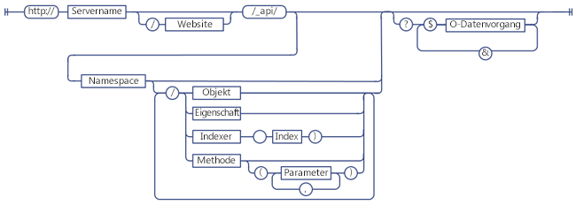
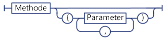
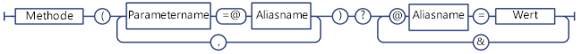
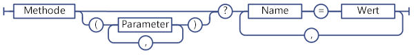
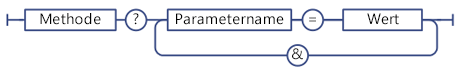

# Ermitteln von URIs von SharePoint-REST-Dienstendpunkten
Informieren Sie sich über allgemeine Richtlinien zur Ermittlung von URIs von SharePoint-REST-Endpunkten mithilfe der Signatur der entsprechenden Clientobjektmodell-APIs.
 **Bevor Sie beginnen**
  
    
    


-  [Einführung in den SharePoint 2013 REST-Dienst](get-to-know-the-sharepoint-2013-rest-service.md)
    
  
-  [Navigieren durch die im REST-Dienst dargestellte SharePoint-Datenstruktur](navigate-the-sharepoint-data-structure-represented-in-the-rest-service.md)
    
  

 **Nächste Schritte**
  
    
    


-  [Verwenden von OData-Abfragevorgängen in SharePoint REST-Anforderungen](use-odata-query-operations-in-sharepoint-rest-requests.md)
    
  

## Struktur von SharePoint-REST-Endpunkte-URIs

Bevor Sie mithilfe des REST-Diensts auf eine SharePoint-Ressource zugreifen können, müssen Sie zuerst den URI-Endpunkt ermitteln, der auf diese Ressource zeigt. Wann immer möglich, bildet die URI für diese REST-Endpunkte die API-Signatur der Ressource im SharePoint-Clientobjektmodell streng nach. Beispiel:
  
    
    
 *Clientobjektmodell-Methode:* 
  
    
    
List.GetByTitle(listname).GetItems()
  
    
    
 *REST-Endpunkt:* 
  
    
    
 `http://server/site/_api/lists/getbytitle('listname')/items`
  
    
    
In einigen Fällen unterscheidet sich die Endpunkt-URI aber von der entsprechenden Clientobjektmodell-Signatur, um REST- oder OData-Konventionen zu erfüllen.
  
    
    
Die folgende Abbildung zeigt die allgemeine Syntaxstruktur von SharePoint-REST-URIs.
  
    
    

**Syntaxstruktur von SharePoint-REST-URIs**

  
    
    

  
    
    

  
    
    
Einige Endpunkte für SharePoint-Ressourcen weichen von dieser Syntaxstruktur ab:
  
    
    

- Methoden, die komplexe Typen als Parameter erfordern.
    
    Wenn die entsprechende Clientobjektmodell-Methode erfordert, dass komplexe Typen als Parameter übergeben werden, kann der REST-Endpunkt wegen REST-Einschränkungen von dieser Syntaxstruktur abweichen.
    
  
- Statische Methoden und Eigenschaften.
    
    REST-Endpunkte weichen von dieser Syntaxstruktur bei URIs ab, die statische Methoden und Eigenschaften darstellen.
    
  

## Ermitteln von SharePoint 2013-REST-Dienstendpunkten

Befolgen Sie diese Schritte, um einen REST-Endpunkt für eine SharePoint-Ressource zu erstellen:
  
    
    

1. Starten Sie mit der REST-Dienstreferenz:
    
     `http://server/site/_api`
    
  
2. Geben Sie den entsprechenden Einstiegspunkt an. Beispiel:
    
     `http://server/site/_api/web`
    
  
3. Navigieren Sie vom Einstiegspunkt zu den spezifischen Ressourcen, auf die Sie zugreifen möchten. Dabei müssen Sie auch Parameter für Endpunkte angeben, die Methoden im Clientobjektmodell entsprechen. Beispiel:
    
     `http://server/site/_api/web/lists/getbytitle('listname')`
    
  

### Referenzieren des SharePoint 2013-REST-Dienstes in Ihrer Endpunkt-URI

Verwenden Sie  `_api`, um den SharePoint 2013-REST-Dienst in Ihren Endpunkt-URIs zu kennzeichnen. Der REST-Dienst ist Teil des client.svc-Webdienstes. Um die Erstellung von REST-URIs zu vereinfachen und den REST-URI-Basispfad zu verkürzen, verwendet der REST-Dienst  `_api`, damit der client.svc-Webdienst nicht explizit referenziert werden muss. Der REST-Dienst erkennt und akzeptiert URIs weiterhin, die den client.svc-Webdienst referenzieren. Sie können z. B.  `http://server/site/_vti_bin/client.svc/web/lists` anstatt `http://server/site/_api/web/lists` verwenden. Die Verwendung von `_api` ist allerdings die bevorzugte Konvention. Für URLs gilt eine Zeichengrenze von 256 Zeichen, sodass die Verwendung von `_api` die Basis-URI verkürzt und entsprechend mehr Zeichen für die Erstellung der restlichen URL übrig bleiben.
  
    
    

### Angeben von Einstiegspunkten für den SharePoint 2013-REST-Dienst

Die zentralen Einstiegspunkte für den REST-Dienst stellen die Websitesammlung und die Website des angegebenen Kontexts dar. Auf diese Weise entsprechen diese Einstiegspunkte der  [ClientContext.Site](https://msdn.microsoft.com/library/Microsoft.SharePoint.Client.ClientContext.Site.aspx) -Eigenschaft und der [ClientContext.Web](https://msdn.microsoft.com/library/Microsoft.SharePoint.Client.ClientContext.Web.aspx) -Eigenschaft in den Clientobjektmodellen.
  
    
    
Gehen Sie folgendermaßen vor, um auf eine bestimmte Websitesammlung zuzugreifen:
  
    
    
 `http://server/site/_api/site`
  
    
    
Gehen Sie folgendermaßen vor, um auf eine bestimmte Website zuzugreifen:
  
    
    
 `http://server/site/_api/web`
  
    
    
Wobei  *server*  den Namen des Servers darstellt und *site*  für den Namen der oder den Pfad zur entsprechenden Website steht.
  
    
    
Zusätzlich zu  `/site` und `/web` enthält der REST-Dienst mehrere Zugriffspunkte, die Entwicklern erlauben, zu spezifischen Funktionen zu navigieren. In der folgenden Liste sind einige dieser Zugriffspunkte aufgeführt.
  
    
    


|**Funktionsbereich**|**Zugriffspunkte**|
|:-----|:-----|
|Site  <br/> |http:// _server/site_/_api/site  <br/> |
|Web  <br/> |http:// _server/site_/_api/web  <br/> |
|Benutzerprofil  <br/> |http:// _server/site_/_api/SP.UserProfiles.PeopleManager  <br/> |
|Suche  <br/> |http:// _server/site_/_api/search  <br/> |
   

### Navigieren zu den entsprechenden Ressourcen, auf die Sie zugreifen möchten

Erstellen Sie von hier aus spezifischere REST-Endpunkte, indem Sie das Objektmodell durchlaufen. Verwenden Sie dazu die Namen der APIs aus dem Clientobjektmodell, getrennt durch einen Schrägstrich (/). Die nachfolgende Tabelle zeigt Beispiele für Clientobjektmodell-Aufrufe und den entsprechenden REST-Endpunkt.
  
    
    


|**Clientobjektmodell-API**|**REST-Endpunkt**|
|:-----|:-----|
|ClientContext.Web.Lists  <br/> |http:// _server_/ _site_/_api/web/lists  <br/> |
|ClientContext.Web.Lists[guid]  <br/> |http:// _server_/ _site_/_api/web/lists(' _guid_')  <br/> |
|ClientContext.Web.Lists.GetByTitle("Title")  <br/> |http:// _server_/ _site_/_api/web/lists/getbytitle(' _Title_')  <br/> |
   
Bei Endpunkt-URIs wird die Groß-/Kleinschreibung beachtet. Verwenden Sie in der vorhergehenden Tabelle z. B.  `/getbytitle`, um das REST-Äquivalent der **GetByTitle()** -Methode anzugeben.
  
    
    

## Angeben von Parametern in REST-Endpunkt-URIs

SharePoint 2013 erweitert die OData-Spezifikation, indem Sie Ihnen die Verwendung von Parametern ermöglicht, um Methodenparameter und Indexwerte anzugeben. Dadurch werden mögliche Probleme aufgrund von Mehrdeutigkeit in URIs vermieden, die mehrere Parameter mit dem gleichen Namen enthalten. Die folgenden zwei URIs enthalten z. B. Parameter mit dem gleichen Namen:
  
    
    
 `http://server/site/_api/web/lists/getByTitle('Announcements')/fields/getByTitle('Description')`
  
    
    
 `http://server/site/_api/web/lists('<guid>')/fields/getById('<guid>')`
  
    
    
Um mehrere Parameter anzugeben, schließen Sie den Parameter als ein Namen-Wert-Paar ein, und trennen Sie die Parameter mit Kommas. Beispiel:
  
    
    
 `http://server/site/_api/web/getAvailableWebTemplates(lcid=1033, includeCrossLanguage=true)`
  
    
    
Die folgende Abbildung zeigt die Syntax von SharePoint-REST-Parametern.
  
    
    

**Syntax von SharePoint-REST-Parametern**

  
    
    

  
    
    

  
    
    

### Komplexe Typen als Parameter für den REST-Dienst

Einige Methoden im Clientobjektmodell erfordern eine große Nutzlast als Parameter. Damit REST-Endpunkte die Funktionsparität mit ihren entsprechenden Clientobjektmodell-APIs aufrechterhalten, müssen die Endpunkte einen komplexen Typ als Parameter akzeptieren. In diesen Fällen erweitert der REST-Dienst das bestehende OData-Protokoll, damit diese REST-Endpunkte einen einzelnen komplexen Typ als Parameter akzeptieren können. Dies bezieht sich nur auf **POST**-Vorgänge, und Sie müssen den komplexen Typ gemäß OData-Standards in  [Atom](http://www.odata.org/developers/protocols/atom-format#RepresentingComplexTypesProperties)-Format oder  [JSON](http://www.odata.org/developers/protocols/json-format#RepresentingComplexTypeProperties)-Format übergeben.
  
    
    
Die  [ListCollection.Add](https://msdn.microsoft.com/library/Microsoft.SharePoint.Client.ListCollection.Add.aspx) -Methode verwendet z. B. ein [Microsoft.SharePoint.Client.ListCreationInformation](https://msdn.microsoft.com/library/Microsoft.SharePoint.Client.ListCreationInformation.aspx) -Objekt als Parameter. Um eine Liste zu einer bestimmten Website hinzuzufügen, erstellen Sie den entsprechenden REST-Endpunkt wie folgt:
  
    
    
 `http://server/site/_api/web/lists/add`
  
    
    
Übergeben Sie dann den komplexen Typ im Textkörper der Anforderung im JSON-Format.
  
    
    


```

{ "d" : {
   "results": {
     "__metadata": {
       "type": "SP.ListCreationInformation"
     }, 
     "CustomSchemaXml": "…large payload…/", 
     "Description": "desc", 
     "DocumentTemplateType": "1", 
     "TemplateType": "101", 
     "Title": "Announcements"
   }
} 
}

```


### Verwenden von Parameter-Aliasen in REST-Dienstaufrufen

Sie können die "Parameteraliasing"-Semantik in OData verwenden, um Parameter an einen SharePoint-REST-Endpunkt zu übergeben. Beim Parameteraliasing wird der Parameterwert mit einem Alias im Parameteraufruf identifiziert, und der tatsächliche Wert wird in der Abfragezeichenfolge der URI angegeben. So können Sie mehr Zeichentypen und eine einheitliche Formatierung mithilfe der Abfragezeichenfolge unterstützen.
  
    
    
Die folgenden zwei REST-URIs sind z. B. äquivalent:
  
    
    
 *Geben Sie den Parameterwert direkt an:* 
  
    
    
 `http://server/site/_api/web/applyWebTemplate("STS#0")`
  
    
    
 *Verwenden Sie einen Parameteralias, und geben Sie den tatsächlichen Parameterwert in der Abfragezeichenfolge der URI an:* 
  
    
    
 `http://server/site/_api/web/applyWebTemplate(title=@template)?@template="STS#0"`
  
    
    
Das Übergeben von komplexen Typen per Parameteraliasing wird vom SharePoint-REST-Dienst allerdings nicht unterstützt. So wird z. B. die folgende URI nicht unterstützt, die einen komplexen Typ im Parameteralias enthält:
  
    
    
 `http://server/site/_api/userProfiles/People(7)/GetWorkplace(@address)?@address={"__metadata":{"type: "ODataDemo.Address"},"Street":"NE 228th", "City":"Sammamish","State":"WA","ZipCode":"98074","Country": "USA"}`
  
    
    

**Syntax von SharePoint-REST-Dienst-Parameteraliasing**

  
    
    

  
    
    

  
    
    

  
    
    

  
    
    

### Angeben von Wörterbüchern als Parameterwerte

Bei REST-Endpunkten, die Methoden entsprechen, die  `Dictionary<String, String>`-Wörterbücher als Parameter verwenden, übergeben Sie das Wörterbuch als Serie von durch Kommas getrennten Namen-Wert-Paaren in der Abfragezeichenfolge.
  
    
    

**REST-Dienstsyntax für Wörterbuchparameter**

  
    
    

  
    
    

  
    
    
Ein  `Dictionary<String, object>` wird als Mehrfachwertobjekt namens "KeyedPropertyValue" mit den folgenden Zeichenfolgeneigenschaften dargestellt:
  
    
    

- **Key** Der Schlüssel des Mehrfachwertobjekts.
    
  
- **Value** Der Wert des Objekts
    
  
- **ValueType** Der Werttyp des Objekts. Bei einfachen Werttypen, die sich bestehenden Entity Data Model (EDM)-Typen zuordnen lassen, gibt der REST-Dienst die entsprechende EDM-Typ-Zeichenfolge zurück, z. B. "Edm.String". Wenn nicht, gibt der REST-Dienst den Werttyp zurück, der durch die **Type.ToString**-Funktion zurückgegeben wird.
    
  

### Angeben von Parameterwerten in der Abfragezeichenfolge

Wenn Ihre REST-URI in einem Methodenaufruf endet, können Sie Abfragezeichenfolgensyntax verwenden, um die Parameterwerte der Methode anzugeben. Beispiel:
  
    
    
 `http://<server>/<site>/_api/web/applyWebTemplate?template="STS#0"`
  
    
    
Die unten stehende Abbildung zeigt die REST-Dienstsyntax für Parameter in Abfragezeichenfolgen.
  
    
    

**REST-Dienstsyntax für Parameter in Abfragezeichenfolgen**

  
    
    

  
    
    

  
    
    

  
    
    

  
    
    

## Angeben von statischen Methoden und Eigenschaften als REST-Dienst-URIs

Um URIs zu erstellen, die statischen Methoden oder Eigenschaften entsprechen, verwenden Sie den entsprechenden API-Namen aus dem ECMAScript-Objektmodell, beginnend mit der Namespacedeklaration und unter Verwendung von punktierter Schreibweise. Beispiel:  [SP.Utilities.Utility.getImageUrl(imageName)](http://msdn.microsoft.com/de-de/library/ee658947.aspx) im ECMAScript-Clientobjektmodell würde das folgende REST-Äquivalent haben:
  
    
    
 `http://server/site/_api/SP.Utilities.Utility.getImageUrl('imageName')`
  
    
    
Statische Methoden können allerdings nur direkt aufgerufen werden und sind als Teil einer größeren URI-Komposition nicht zulässig. Das direkte Aufrufen der **SP.Utility.AssetsLibrary**-Methode in REST ist z. B. wie folgt zulässig:
  
    
    
 `http://server/site/_api/SP.Utility.assetsLibrary/id`
  
    
    
Die Verwendung des Ressourcenspeicherorts als Parameter für eine komplexere URI, wie im folgenden Beispiel gezeigt, ist allerdings nicht zulässig:
  
    
    
 `http://server/site/_api/getList(~SP.Utility/assetsLibrary/id)`
  
    
    
Die unten stehende Abbildung zeigt die Syntax von statischen Mitgliedern des SharePoint-REST-Dienstes.
  
    
    

**Syntax von statischen Mitgliedern des SharePoint-REST-Dienstes**

  
    
    

  
    
    

  
    
    

  
    
    

  
    
    

## Nächste Schritte

Wenn Sie die von einem Endpunkt angeforderten Daten auswählen, filtern oder sortieren möchten, unterstützt der SharePoint-REST-Dienst eine breite Palette von OData-Abfragezeichenfolgen-Operatoren.
  
    
    

## Zusätzliche Ressourcen
<a name="bk_addresources"> </a>


-  [Einführung in den SharePoint 2013 REST-Dienst](get-to-know-the-sharepoint-2013-rest-service.md)
    
  
-  [Ausführen grundlegender Vorgänge unter Verwendung von SharePoint 2013-REST-Endpunkten](complete-basic-operations-using-sharepoint-2013-rest-endpoints.md)
    
  
-  [Arbeiten mit Listen und Listenelementen unter Verwendung von REST](working-with-lists-and-list-items-with-rest.md)
    
  
-  [Arbeiten mit Ordnern und Dateien mit REST](working-with-folders-and-files-with-rest.md)
    
  
-  [Navigieren durch die im REST-Dienst dargestellte SharePoint-Datenstruktur](navigate-the-sharepoint-data-structure-represented-in-the-rest-service.md)
    
  
-  [Verwenden von OData-Abfragevorgängen in SharePoint REST-Anforderungen](use-odata-query-operations-in-sharepoint-rest-requests.md)
    
  
-  [SharePoint 2013 - REST-API, Endpunkte und Beispiele](02128c70-9d27-4388-9374-a11bce68fdb8.md)
    
  
-  [Synchronisieren von SharePoint-Elementen mit dem REST-Dienst](synchronize-sharepoint-items-using-the-rest-service.md)
    
  
-  [Verwenden von ETag-Werten über den REST-Dienst, um die Version von Dokumentlistenelementen zu bestimmen](5f7e0579-46b7-44ab-b3b4-cdbc622dcd98.md)
    
  

  
    
    

