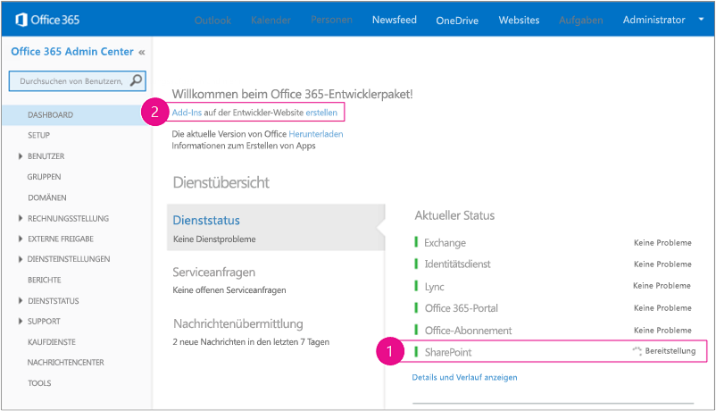

# Erste Schritte beim Erstellen von von einem Anbieter gehosteten SharePoint-Add-Ins
Einrichten einer Entwicklungsumgebung und Erstellen Ihres ersten von einem Anbieter gehosteten SharePoint-Add-In.
Vom Anbieter gehostete Add-Ins sind eine der zwei Haupttypen von SharePoint-Add-Ins. Einen schnellen Überblick über SharePoint-Add-Ins und die zwei verschiedenen Typen finden Sie unter  [SharePoint-Add-Ins](sharepoint-add-ins.md). Hier ist eine Zusammenfassung zu vom Anbieter gehosteten Add-Ins:


- Sie umfassen eine Webanwendung oder einen Dienst oder eine Datenbank, die extern von der SharePoint-Farm oder dem SharePoint Online-Abonnement gehostet wird. Sie können außerdem SharePoint-Komponenten enthalten. Die externen Komponenten können auf einem beliebigen Webhostingstapel gehostet werden, darunter dem LAMP-Stapel (Linux, Apache, MySQL und PHP).


- Die benutzerdefinierte Geschäftslogik im Add-In muss entweder in den externen Komponenten oder in JavaScript auf benutzerdefinierten SharePoint-Seiten ausgeführt werden.


 [


](get-started-creating-provider-hosted-sharepoint-add-ins.md#Setup) [


](get-started-creating-provider-hosted-sharepoint-add-ins.md#Create) [


](get-started-creating-provider-hosted-sharepoint-add-ins.md#Code)


## Einrichten der Entwicklungsumgebung
<a name="Setup"> </a>

Es gibt verschiedene Möglichkeiten zum Einrichten einer Entwicklungsumgebung für SharePoint-Add-Ins. In diesem Abschnitt wird die einfachste Möglichkeit erläutert. Alternativen finden Sie unter  [Zusätzliche Ressourcen](#bk_addresources).


### Abrufen der Tools


- Wenn Sie **Visual Studio** 2013 oder höher noch nicht installiert haben, installieren Sie es mit den Anweisungen unter [Install Visual Studio](http://msdn.microsoft.com/library/da049020-cfda-40d7-8ff4-7492772b620f.aspx). Wir empfehlen die Verwendung der  [neuesten Version aus dem Microsoft Download Center](https://www.visualstudio.com/downloads/download-visual-studio-vs).


- Visual Studio enthält die **Microsoft Office-Entwicklertools für Visual Studio**, aber manchmal wird eine Version der Tools zwischen Updates von Visual Studio veröffentlicht. Um sicherzustellen, dass Sie die neueste Version der Tools verwenden, führen Sie das [Installationsprogramm für Office Developer Tools für Visual Studio 2013](http://aka.ms/OfficeDevToolsForVS2013) oder das [Installationsprogramm für Office Developer Tools für Visual Studio 2015](http://aka.ms/OfficeDevToolsForVS2015) aus.


### Registrieren für eine Website für Office 365-Entwickler
<a name="o365_signup"> </a>


> **HINWEIS**
>  Möglicherweise haben Sie bereits Zugriff auf eine Website für Office 365-Entwickler.> **Sind Sie MSDN-Abonnent?** Visual Studio Ultimate und Visual Studio Premium mit MSDN-Abonnenten erhalten als Bonus ein einjähriges Office 365 Developer-Abonnement. [Lösen Sie Ihren Bonus heute ein.](https://login.live.com/login.srf?wa=wsignin1.0&amp;rpsnv=12&amp;ct=1402926170&amp;rver=6.0.5276.0&amp;wp=MCMBI&amp;wlcxt=msdn%24msdn%24msdn&amp;wreply=https%3a%2f%2fmsdn.microsoft.com%2fsubscriptions%2fmanage%2fdefault.aspx&amp;lc=1033&amp;id=254354&amp;mkt=de-DE)> **Besitzen Sie einen der folgenden Office 365 Abonnementpläne?**> **Falls ja, kann ein Administrator des Office 365-Abonnements eine Website für Entwickler** über das [Office 365 Admin Center](https://portal.microsoftonline.com/admin/default.aspx) erstellen. Weitere Informationen finden Sie unter [Erstellen einer Entwicklerwebsite in einem vorhandenen Office 365-Abonnement](create-a-developer-site-on-an-existing-office-365-subscription.md). 


Es gibt drei Wege zu einem Office 365-Plan.


- Registrieren Sie sich über das Office 365-Entwicklerprogramm für ein kostenloses einjähriges Office 365-Entwicklerkonto.  [Informieren Sie sich ausführlicher](http://dev.office.com/devprogram), oder wechseln Sie direkt zum  [Registrierungsformular](https://profile.microsoft.com/RegSysProfileCenter/wizardnp.aspx?wizid=14b845d0-938c-45af-b061-f798fbb4d170). Nach der Registrierung für das Entwicklerprogramm erhalten Sie eine E-Mail mit einem Link, über den Sie sich für das Entwicklerkonto registrieren können. Beachten Sie die nachstehenden Anweisungen.


- Beginnen Sie mit einer  [kostenlosen 30-Tage-Testversion](https://portal.microsoftonline.com/Signup/MainSignUp.aspx?OfferId=6881A1CB-F4EB-4db3-9F18-388898DAF510&amp;DL=DEVELOPERPACK) mit einer Benutzerlizenz.


- Erwerben Sie ein  [Office 365 Developer-Abonnement](https://portal.microsoftonline.com/Signup/MainSignUp.aspx?OfferId=C69E7747-2566-4897-8CBA-B998ED3BAB88&amp;DL=DEVELOPERPACK).


> **TIPP**
> Öffnen Sie diese Links in einem anderen Fenster oder einer anderen Registerkarte, damit die nachfolgenden Anweisungen übersichtlich bleiben. 


**Abb. 1. Domänenname der Office 365-Entwicklerwebsite**


1. Die erste Seite (nicht abgebildet) des Registrierungsformulars ist selbsterklärend. Geben Sie einfach die erforderlichen Informationen zu Ihrer Person an, und wählen Sie **Weiter** aus.


2. Geben Sie auf der zweiten Seite, die in Abbildung 1 gezeigt ist, eine Benutzer-ID für den Administrator des Abonnements an.


3. Erstellen Sie eine Unterdomäne von **. onmicrosoft.com**, zum Beispiel contoso.onmicrosoft.com.

    Nach der Registrierung müssen Sie die resultierenden Anmeldeinformationen (im Format  _UserID_@ _IhreDomäne_.onmicrosoft.com) benutzen, um sich auf Ihrer Office 365-Portalwebsite anzumelden, auf der Sie Ihr Konto verwalten. Ihre SharePoint Online-Entwicklerwebsite wird unter Ihrer neuen Domäne **http:// _IhreDomäne_.sharepoint.com** bereitgestellt.


4. Wählen Sie **Weiter** aus, und füllen Sie die letzte Seite des Formulars aus. Wenn Sie eine Telefonnummer bereitstellen, um Ihren Bestätigungscode zu erhalten, können Sie eine Mobil- oder Festnetznummer, aber *keine*  VoIP-Nummer (Voice over Internet Protocol) benutzen.


> **HINWEIS**
> Wenn Sie beim Versuch, sich bei einem Entwicklerkonto anzumelden, bei einem anderen Microsoft-Konto angemeldet sind, wird möglicherweise die folgende Nachricht angezeigt: „Die eingegebene Benutzer-ID hat leider nicht funktioniert. Sie ist anscheinend nicht gültig. Geben Sie die Benutzer-ID ein, die Ihnen von Ihrem Unternehmen zugewiesen wurde. Ihre Benutzer-ID hat in der Regel das Format  *someone@example.com*  oder *someone@example.onmicrosoft.com*  ."> Wenn diese Nachricht angezeigt wird, melden Sie sich vom Microsoft-Konto ab, und versuchen Sie es erneut. Sollte die Nachricht weiterhin angezeigt werden, löschen Sie den Browsercache, oder wechseln Sie zu **InPrivate-Browsen** und füllen Sie das Formular aus.


Nachdem Sie die Registrierung abgeschlossen haben, wird in Ihrem Browser die Office 365-Installationsseite geöffnet. Wählen Sie das Admin-Symbol aus, um die Admin Center-Seite zu öffnen.


**Abb. 2. Office 365 Admin Center-Seite**





1. Warten Sie, bis der Einrichtungsprozess für Ihre Website für Entwickler abgeschlossen ist. Nach Abschluss der Bereitstellung aktualisieren Sie die Admin Center-Seite im Browser.


2. Wählen Sie dann links oben den Link **Add-Ins erstellen** aus, um Ihre Website für Entwickler zu öffnen. Sie sollten eine Website wie in Abbildung 3 dargestellt sehen. Mit der Liste **Add-Ins im Test** auf der Seite wird bestätigt, dass die Website mit der Entwicklerwebsitevorlage von SharePoint erstellt wurde. Wird stattdessen eine Teamwebsite angezeigt, warten Sie einige Minuten und starten dann Ihre Website erneut.


3. Notieren Sie die URL der Website. Diese wird verwendet, wenn Sie SharePoint-Add-Ins-Projekte in Visual Studio erstellen.


**Abb. 3: Die Startseite Ihrer Entwicklerwebsite mit der Liste der Add-Ins im Test**


## Erstellen des Add-In-Projekts
<a name="Create"> </a>


1. Starten Sie Visual Studio mit der Option **Als Administrator ausführen**.


2. Wählen Sie in Visual Studio **Datei** > **Neu** > **Projekt** aus.


3. Erweitern Sie im Dialogfeld **Neues Projekt** den Knoten **Visual C#**, dann den Knoten **Office/SharePoint**, und wählen Sie den Knoten **Add-Ins** und **SharePoint-Add-In** aus.


4. Geben Sie dem Projekt den Namen SampleAddIn, und klicken Sie dann auf **OK**.


5. Gehen Sie im ersten Dialogfeld **Einstellungen für das SharePoint-Add-In angeben** folgendermaßen vor:

  - Geben Sie die vollständige URL der SharePoint-Website an, die Sie zum Debuggen Ihres Add-Ins verwenden möchten. Dies ist die URL der Website für Entwickler. Verwenden Sie HTTPS und nicht HTTP in der URL. Während dieses Vorgangs oder kurz danach werden Sie aufgefordert, sich bei dieser Website anzumelden. Der Zeitpunkt der Eingabeaufforderung variiert. Verwenden Sie die Administratoranmeldeinformationen (in der Domäne „*.onmicrosoft.com"), die Sie bei der Registrierung für Ihre Entwicklerwebsite erstellt haben, beispielsweise „MyName@contoso.onmicrosoft.com".


  - Wählen Sie unter **Wie soll Ihr Add-In für SharePoint gehostet werden** die Option **Von Anbieter gehostet** aus.


  - Wählen Sie **Weiter** aus.


6. Wählen Sie auf der Seite **Ziel-SharePoint-Version angeben** die Option **SharePoint Online** und dann **Weiter** aus.


7. Wählen Sie unter **Welchen Webanwendungsprojekttyp möchten Sie erstellen?** ** ASP.NET Webformular-Anwendung**. Wählen Sie **Weiter** aus.


8. Wählen Sie unter **Wie soll Ihr Add-In authentifiziert werden?** ** Microsoft Azure-Zugriffssteuerungsdienst verwenden** aus.


9. Wählen Sie im Assistenten die Option **Fertig stellen**.

    Ein Großteil der Konfiguration wird beim Öffnen der Lösung ausgeführt. In der Visual Studio-Projektmappe werden zwei Projekte erstellt, eines für die SharePoint-Add-In und das andere für die ASP.NET-Webanwendung.


## Codieren Ihres Add-Ins
<a name="Code"> </a>


1. Öffnen Sie die Datei AppManifest.xml. Geben Sie auf der Registerkarte **Berechtigungen** den Bereich der **Websitesammlung** und die **Lese**berechtigungsstufe an.


2. Löschen Sie alle Markups innerhalb des **<body>**-Tags der Datei „Pages/Default.aspx" Ihrer Webanwendung, und fügen Sie dann den folgenden HTML-Code und ASP.NET-Steuerelemente in **<body>** ein. Dieses Beispiel verwendet das [UpdatePanel](https://msdn.microsoft.com/library/System.Web.UI.UpdatePanel.aspx) -Steuerelement, um ein teilweises Seitenrendering zu erzielen.

  ```HTML

<form id="form1" runat="server">
  <div>
    <asp:ScriptManager ID="ScriptManager1" runat="server"
            EnablePartialRendering="true" />
    <asp:UpdatePanel ID="PopulateData" runat="server" UpdateMode="Conditional">
      <ContentTemplate>  
        <table border="1" cellpadding="10">
         <tr><th><asp:LinkButton ID="CSOM" runat="server" Text="Populate Data" 
                               OnClick="CSOM_Click" /></th></tr>
         <tr><td>

        <h2>SharePoint Site</h2>
        <asp:Label runat="server" ID="WebTitleLabel"/>

        <h2>Current User:</h2>
        <asp:Label runat="server" ID="CurrentUserLabel" />

        <h2>Site Users</h2>
        <asp:ListView ID="UserList" runat="server"> 
            <ItemTemplate >
              <asp:Label ID="UserItem" runat="server" 
                                Text="<%# Container.DataItem.ToString()  %>">
              </asp:Label><br />
           </ItemTemplate>
        </asp:ListView>

        <h2>Site Lists</h2>
               <asp:ListView ID="ListList" runat="server">
                   <ItemTemplate >
                     <asp:Label ID="ListItem" runat="server" 
                                Text="<%# Container.DataItem.ToString()  %>">
                    </asp:Label><br />
                  </ItemTemplate>
              </asp:ListView>
            </td>          
          </tr>
         </table>
       </ContentTemplate>
     </asp:UpdatePanel>
  </div>
</form>
  ```

3. Fügen Sie in der Datei „Default.aspx.cs" der Webanwendung folgende Deklarationen hinzu.

  ```cs

using Microsoft.SharePoint.Client;
using Microsoft.IdentityModel.S2S.Tokens;
using System.Net;
using System.IO;
using System.Xml;
  ```

4. Fügen Sie in der Datei „Default.aspx.cs" der Webanwendung folgende Variablen in der  [Page](https://msdn.microsoft.com/library/System.Web.UI.Page.aspx) -Klasse hinzu.

  ```cs

SharePointContextToken contextToken;
string accessToken;
Uri sharepointUrl;
string siteName;
string currentUser;
List<string> listOfUsers = new List<string>();
List<string> listOfLists = new List<string>();
  ```

5. Fügen Sie die Methode  `RetrieveWithCSOM` in der [Page](https://msdn.microsoft.com/library/System.Web.UI.Page.aspx) -Klasse hinzu. In dieser Methode wird SharePoint CSOM verwendet, um Informationen zu Ihrer Website abzurufen und auf der Seite anzuzeigen.

  ```cs

// This method retrieves information about the host web by using the CSOM.
private void RetrieveWithCSOM(string accessToken)
{

    if (IsPostBack)
    {
        sharepointUrl = new Uri(Request.QueryString["SPHostUrl"]);
    }        

    ClientContext clientContext =
                    TokenHelper.GetClientContextWithAccessToken(
                        sharepointUrl.ToString(), accessToken);

    // Load the properties for the web object.
    Web web = clientContext.Web;
    clientContext.Load(web);
    clientContext.ExecuteQuery();

    // Get the site name.
    siteName = web.Title;

    // Get the current user.
    clientContext.Load(web.CurrentUser);
    clientContext.ExecuteQuery();
    currentUser = clientContext.Web.CurrentUser.LoginName;

    // Load the lists from the Web object.
    ListCollection lists = web.Lists;
    clientContext.Load<ListCollection>(lists);
    clientContext.ExecuteQuery();

    // Load the current users from the Web object.
    UserCollection users = web.SiteUsers;
    clientContext.Load<UserCollection>(users);
    clientContext.ExecuteQuery();

    foreach (User siteUser in users)
    {
        listOfUsers.Add(siteUser.LoginName);
    }


    foreach (List list in lists)
    {
        listOfLists.Add(list.Title);
    }
}
  ```

6. Fügen Sie die  `CSOM_Click`-Methode in der  [Page](https://msdn.microsoft.com/library/System.Web.UI.Page.aspx) -Klasse hinzu. Diese Methode löst das Ereignis aus, das auftritt, wenn der Benutzer auf den Link **Daten auffüllen** klickt.

  ```cs

protected void CSOM_Click(object sender, EventArgs e)
{
    string commandAccessToken = ((LinkButton)sender).CommandArgument;
    RetrieveWithCSOM(commandAccessToken);
    WebTitleLabel.Text = siteName;
    CurrentUserLabel.Text = currentUser;
    UserList.DataSource = listOfUsers;
    UserList.DataBind();
    ListList.DataSource = listOfLists;
    ListList.DataBind();
 }
  ```

7. Ersetzen Sie die vorhandene  `Page_Load`-Methode durch diese. Die  `Page_Load`-Methode verwendet Methoden in der Datei „TokenHelper.cs", um den Kontext aus dem  `Request`-Objekt abzurufen und ein Zugriffstoken von Microsoft Azure Access Control Service (ACS) anzufordern.

  ```cs

// The Page_load method fetches the context token and the access token.
// The access token is used by all of the data retrieval methods.
protected void Page_Load(object sender, EventArgs e)
{
     string contextTokenString = TokenHelper.GetContextTokenFromRequest(Request);

    if (contextTokenString != null)
    {
        contextToken =
            TokenHelper.ReadAndValidateContextToken(contextTokenString, Request.Url.Authority);

        sharepointUrl = new Uri(Request.QueryString["SPHostUrl"]);
        accessToken =
                    TokenHelper.GetAccessToken(contextToken, sharepointUrl.Authority)
                    .AccessToken;

         // For simplicity, this sample assigns the access token to the button's CommandArgument property. 
         // In a production add-in, this would not be secure. The access token should be cached on the server-side.
        CSOM.CommandArgument = accessToken;
    }
    else if (!IsPostBack)
    {
        Response.Write("Could not find a context token.");
        return;
    }
}
  ```

8. Die Datei „Default.aspx.cs" sollte wie folgt aussehen, wenn Sie fertig sind.

  ```cs

using System;
using System.Collections.Generic;
using System.Linq;
using System.Web;
using System.Web.UI;
using System.Web.UI.WebControls;

using Microsoft.SharePoint.Client;
using Microsoft.IdentityModel.S2S.Tokens;
using System.Net;
using System.IO;
using System.Xml;

namespace SampleAddInWeb
{
    public partial class Default : System.Web.UI.Page
    {
        SharePointContextToken contextToken;
        string accessToken;
        Uri sharepointUrl;
        string siteName;
        string currentUser;
        List<string> listOfUsers = new List<string>();
        List<string> listOfLists = new List<string>();

        protected void Page_PreInit(object sender, EventArgs e)
        {
            Uri redirectUrl;
            switch (SharePointContextProvider.CheckRedirectionStatus(Context, out redirectUrl))
            {
                case RedirectionStatus.Ok:
                    return;
                case RedirectionStatus.ShouldRedirect:
                    Response.Redirect(redirectUrl.AbsoluteUri, endResponse: true);
                    break;
                case RedirectionStatus.CanNotRedirect:
                    Response.Write("An error occurred while processing your request.");
                    Response.End();
                    break;
            }
        }

        protected void CSOM_Click(object sender, EventArgs e)
        {
            string commandAccessToken = ((LinkButton)sender).CommandArgument;
            RetrieveWithCSOM(commandAccessToken);
            WebTitleLabel.Text = siteName;
            CurrentUserLabel.Text = currentUser;
            UserList.DataSource = listOfUsers;
            UserList.DataBind();
            ListList.DataSource = listOfLists;
            ListList.DataBind();
        }

        // This method retrieves information about the host web by using the CSOM.
        private void RetrieveWithCSOM(string accessToken)
        {

            if (IsPostBack)
            {
                sharepointUrl = new Uri(Request.QueryString["SPHostUrl"]);
            }


            ClientContext clientContext =
                    TokenHelper.GetClientContextWithAccessToken(
                        sharepointUrl.ToString(), accessToken);


            // Load the properties for the web object.
            Web web = clientContext.Web;
            clientContext.Load(web);
            clientContext.ExecuteQuery();

            // Get the site name.
            siteName = web.Title;

            // Get the current user.
            clientContext.Load(web.CurrentUser);
            clientContext.ExecuteQuery();
            currentUser = clientContext.Web.CurrentUser.LoginName;

            // Load the lists from the Web object.
            ListCollection lists = web.Lists;
            clientContext.Load<ListCollection>(lists);
            clientContext.ExecuteQuery();

            // Load the current users from the Web object.
            UserCollection users = web.SiteUsers;
            clientContext.Load<UserCollection>(users);
            clientContext.ExecuteQuery();

            foreach (User siteUser in users)
            {
                listOfUsers.Add(siteUser.LoginName);
            }

            foreach (List list in lists)
            {
                listOfLists.Add(list.Title);
            }
        }

        protected void Page_Load(object sender, EventArgs e)
        {
            string contextTokenString = 
                 TokenHelper.GetContextTokenFromRequest(Request);

            if (contextTokenString != null)
            {
                contextToken =
                    TokenHelper.ReadAndValidateContextToken(contextTokenString, Request.Url.Authority);

                sharepointUrl = new Uri(Request.QueryString["SPHostUrl"]);
                accessToken =
                    TokenHelper.GetAccessToken(contextToken, sharepointUrl.Authority)
                               .AccessToken;
                CSOM.CommandArgument = accessToken;
            }
            else if (!IsPostBack)
            {
                Response.Write("Could not find a context token.");
                return;
            }
        }
    }
}
  ```

9. Drücken Sie auf die F5-TASTE, um Ihr Add-In bereitzustellen und auszuführen. Wenn ein Dialogfeld **Sicherheitshinweis** angezeigt wird, das Sie danach fragt, ob Sie dem selbstsignierten Localhost-Zertifikat vertrauen, klicken Sie auf **Ja**.

    Wählen Sie auf der Zustimmungsseite die Option **Vertrauen** aus, um dem Add-In Berechtigungen zu gewähren. Visual Studio installiert die Webanwendung für IIS Express und installiert dann das Add-In zum Testen der SharePoint-Website und startet es. Es wird eine Seite mit der im nachfolgenden Screenshot dargestellten Tabelle angezeigt. Wählen Sie **Daten auffüllen**, um zusammenfassende Informationen zu Ihrer SharePoint-Website anzuzeigen.


   **Startseite des grundlegenden vom Anbieter gehosteten Beispiel-Add-Ins**


!\[Startseite der selbst gehosteten Basis-App](images/SP15_basicself-hostedapp.gif)


## Nächste Schritte
<a name="SP15createprovider_nextsteps"> </a>

Unter  [Erteilen des Aussehens und Verhaltens von SharePoint für Ihr vom Anbieter gehostetes Add-In](give-your-provider-hosted-add-in-the-sharepoint-look-and-feel.md) erfahren Sie, wie Sie ein Add-In in das Benutzeroberflächenschema von SharePoint integrieren.


## Zusätzliche Ressourcen
<a name="bk_addresources"> </a>


- Andere Möglichkeiten zum Einrichten einer Entwicklungsumgebung, beispielsweise einer „rein lokalen" Umgebung, finden Sie im Abschnitt  [Tools](tools-and-environments-for-developing-sharepoint-add-ins.md) im SharePoint-Add-Ins-Inhaltsverzeichnis.


