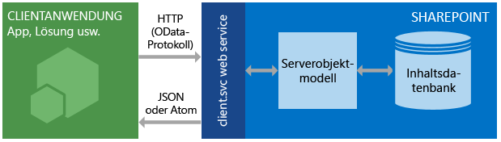

# Einführung in den SharePoint 2013 REST-Dienst
Grundlagen der Verwendung des SharePoint 2013-REST-Diensts zum Zugreifen auf und Aktualisieren von SharePoint-Daten mithilfe der REST- und OData-Webprotokollstandards.
SharePoint 2013 führt einen REST-Dienst (Representational State Transfer) ein, der mit bestehenden SharePoint- [Clientobjektmodellen](http://msdn.microsoft.com/library/88e5e1b9-eab2-4f3b-a3f2-75c96b86f1f4%28Office.15%29.aspx) vergleichbar ist. Entwickler können jetzt mithilfe jeder Technologie, die REST-Webanforderungen unterstützt, remote mit SharePoint-Daten interagieren. Das bedeutet, dass Entwickler mithilfe von REST-Webtechnologien und standardmäßiger OData-Syntax **Create**-, **Read**-, **Update**- und **Delete** (CRUD)-Vorgänge in ihren Apps für SharePoint, Lösungen und Clientanwendungen durchführen können.
  
    
    


## Voraussetzungen

In diesem Thema wird davon ausgegangen, dass Sie über grundlegende Kenntnisse von REST verfügen und wissen, wie REST-Anforderungen erstellt werden.
  
    
    

## So funktioniert der SharePoint 2013-REST-Dienst
<a name="bk_how"> </a>

SharePoint 2013 bietet Ihnen jetzt die Möglichkeit, mithilfe von REST remote mit SharePoint-Websites zu interagieren. Sie können jetzt mithilfe jeder Technologie, die standardmäßige REST-Funktionen unterstützt, direkt mit SharePoint-Objekten interagieren.
  
    
    
Um mithilfe von REST auf SharePoint-Ressourcen zuzugreifen, erstellen Sie mithilfe des OData-Standards (Open Data Protocol), das der gewünschten Clientobjektmodell-API entspricht, eine RESTful-HTTP-Anforderung. Beispiel:
  
    
    
 *Clientobjektmodell-Methode:* 
  
    
    
List.GetByTitle(listname) 
  
    
    
 *REST-Endpunkt:* 
  
    
    
 `http://server/site/_api/lists/getbytitle('listname')`
  
    
    
Der client.svc-Webdienst in SharePoint verarbeitet die HTTP-Anforderung und liefert die entsprechende Antwort im Atom- oder JSON-Format (JavaScript Object Notation). Ihre Clientanwendung muss diese Antwort dann analysieren. Die unten stehende Abbildung zeigt eine allgemeine Übersicht über die REST-Architektur von SharePoint.
  
    
    

**Architektur des SharePoint-REST-Diensts**

  
    
    

  
    
    

  
    
    
Aufgrund ihrer Funktionen und Benutzerfreundlichkeit bleiben Clientobjektmodelle die erste Entwicklungsoption für die Kommunikation mit SharePoint-Websites mithilfe von verwaltetem .NET Framework-Code, Silverlight oder JavaScript.
  
    
    

### Verwenden von HTTP-Befehlen mit dem SharePoint 2013-REST-Dienst
<a name="bk_usingHTTP"> </a>

Um die REST-Funktionen zu nutzen, die in SharePoint 2013 integriert sind, erstellen Sie mithilfe des OData-Standards, welcher der Clientobjektmodell-API entspricht, die Sie verwenden möchten, eine RESTful-HTTP-Anforderung. Der client.svc-Webdienst in SharePoint verarbeitet die HTTP-Anforderung und liefert die entsprechende Antwort im Atom- oder JSON-Format (JavaScript Object Notation). Die Clientanwendung muss diese Antwort dann analysieren.
  
    
    
Die Endpunkte im SharePoint 2013-REST-Dienst entsprechen den Typen und Mitgliedern in den SharePoint-Clientobjektmodellen. Mithilfe von HTTP-Anforderungen können Sie diese REST-Endpunkte verwenden, um typische CRUD-Vorgänge für SharePoint-Entitäten wie Listen und Websites durchzuführen. 
  
    
    
Allgemein gilt:
  
    
    


|**Wenn Sie diese Aktion für einen Endpunkt ausführen möchten**|**Verwenden Sie diese HTTP-Anforderung**|**Beachten Sie**|
|:-----|:-----|:-----|
|Lesen einer Ressource  <br/> |**GET** <br/> ||
|Erstellen oder Aktualisieren einer Ressource  <br/> |**POST** <br/> |Verwenden Sie **POST**, um Entitäten wie Listen und Websites zu erstellen. Der SharePoint 2013-REST-Dienst unterstützt das Senden von **POST**-Befehlen, die Objektdefinitionen enthalten, an Endpunkte, die Sammlungen darstellen.  <br/> Bei **POST**-Vorgängen werden Eigenschaften, die nicht benötigt werden, auf die Standardwerte zurückgesetzt. Wenn Sie versuchen, eine schreibgeschützte Eigenschaft als Teil eines **POST**-Vorgangs festzulegen, gibt der Dienst eine Ausnahme zurück.  <br/> |
|Aktualisieren oder Einfügen einer Ressource  <br/> |**PUT** <br/> | Verwenden Sie **PUT**- und **MERGE**-Vorgänge, um vorhandene SharePoint-Objekte zu aktualisieren.  <br/>  Jeder Dienstendpunkt, der einen **set**-Vorgang einer Objekteigenschaft darstellt, unterstützt sowohl **PUT**-Anforderungen als auch **MERGE**-Anforderungen.  <br/>  Bei **MERGE**-Anforderungen ist das Festlegen von Eigenschaften optional; Eigenschaften, die Sie nicht explizit festlegen, bleiben unverändert.  <br/>  Wenn Sie bei **PUT**-Anforderungen in Objektupdates nicht alle erforderlichen Eigenschaften festlegen, gibt der REST-Dienst eine Ausnahme zurück. Darüber hinaus werden alle optionalen Eigenschaften, die Sie nicht explizit festlegen, auf ihre Standardeigenschaften festgelegt.  <br/> |
|Löschen einer Ressource  <br/> |**DELETE** <br/> |Verwenden Sie den **DELETE**-HTTP-Befehl für die entsprechende Endpunkt-URL, um das von diesem Endpunkt dargestellte SharePoint-Objekt zu löschen.  <br/> Bei wiederverwendbaren Objekten wie Listen, Dateien und Listenelementen führt dies zu einem **Recycle**-Vorgang.  <br/> |
   

### Erstellen von REST-URLs, um auf SharePoint-Ressourcen zuzugreifen
<a name="bk_constructURLs"> </a>

Wann immer möglich, bildet die URI für diese REST-Endpunkte die API-Signatur der Ressource im SharePoint-Clientobjektmodell streng nach. Die zentralen Einstiegspunkte für den REST-Service stellen die Websitesammlung und die Website des angegebenen Kontexts dar. 
  
    
    
Gehen Sie folgendermaßen vor, um auf eine bestimmte Websitesammlung zuzugreifen:
  
    
    
 `http://server/site/_api/site`
  
    
    
Gehen Sie folgendermaßen vor, um auf eine bestimmte Website zuzugreifen:
  
    
    
 `http://server/site/_api/web`
  
    
    
In beiden Fällen stellt  *server*  den Namen des Servers dar, und *site*  steht für den Namen der entsprechenden Website oder den Pfad zu dieser Website.
  
    
    
Ausgehend davon können Sie dann spezifischere REST-URIs erstellen, indem Sie das Objektmodell mithilfe der durch Schrägstrich (/) getrennten Namen der APIs aus dem Clientobjektmodell durchsuchen.
  
    
    
Diese Syntax kann nicht für die SocialFeedManager- oder die SocialFollowingManager-REST-API verwendet werden. Weitere Informationen finden Sie in  [REST-API-Referenz für sozialen Feed für SharePoint 2013](http://msdn.microsoft.com/library/f1cb914f-1e91-4e23-bf53-d2ab323eac13%28Office.15%29.aspx) und [REST-API-Referenz zum Folgen von Personen und Inhalten für SharePoint 2013](http://msdn.microsoft.com/library/c05755df-846d-4a39-941d-950d066cc6d4%28Office.15%29.aspx).
  
    
    
Weitere Richtlinien zur Ermittlung von URIs von SharePoint-REST-Endpunkten aus der Signatur der entsprechenden Clientobjektmodell-APIs finden Sie in  [Ermitteln von URIs von SharePoint-REST-Dienstendpunkten](determine-sharepoint-rest-service-endpoint-uris.md).
  
    
    

## Beispiele für SharePoint-REST-Endpunkte
<a name="bk_URLexamples"> </a>

Die folgende Tabelle enthält Beispiele für typische REST-Endpunkt-URLs, um Ihnen den Einstieg in die Arbeit mit SharePoint-Daten zu erleichtern. Stellen Sie den in der Tabelle enthaltenen URL-Fragmenten  `http://server/site/_api/` voran, um eine vollständig qualifizierte REST-URL zu erstellen. Wo dies für **POST**-Befehle erforderlich ist, enthält die Tabelle Beispieldaten, die Sie im Textkörper der HTTP-Anforderung übergeben müssen, um das angegebene SharePoint-Element zu erstellen. Elemente in Schrägschrift stellen Variablen dar, die Sie durch Ihre Werte ersetzen müssen.
  
    
    


|**Beschreibung**|**URL-Endpunkt**|**HTTP-Methode**|**Textkörperinhalt**|
|:-----|:-----|:-----|:-----|
|Ruft den Titel einer Liste ab  <br/> | `web/title` <br/> |GET  <br/> |Nicht zutreffend  <br/> |
|Ruft alle Listen auf einer Website ab  <br/> | `lists` <br/> |GET  <br/> |Nicht zutreffend  <br/> |
|Ruft die Metadaten einer einzelnen Liste ab  <br/> | `lists/getbytitle('listname')` <br/> |GET  <br/> |Nicht zutreffend  <br/> |
|Ruft Elemente in einer Liste ab  <br/> | `lists/getbytitle('listname')/items` <br/> |GET  <br/> |Nicht zutreffend  <br/> |
|Ruft eine bestimmte Eigenschaft eines Dokuments ab. (In diesem Fall den Dokumenttitel.)  <br/> | `lists/getbytitle('listname')?select=Title` <br/> |GET  <br/> |Nicht zutreffend  <br/> |
|Erstellt eine Liste  <br/> | `lists` <br/> |POST  <br/> |
```

{
  '_metadata':{'type':SP.List},
  'AllowContentTypes': true,
  'BaseTemplate': 104 ,
  'ContentTypesEnabled': true,
  'Description': 'My list description ',
  'Title': 'RestTest '
}
```

|
|Fügt einer Liste ein Element hinzu  <br/> | `lists/getbytitle('listname')/items` <br/> |POST  <br/> |
```

{
  '_metadata':{'type':SP.listname ListItem},
  'Title': 'MyItem'
}

```

|
   

## Unterstützung für Batchaufträge
<a name="batch"> </a>

Der SharePoint Online-REST-Dienst unterstützt die Kombination mehrerer Anforderungen in einem einzelnen Dienstaufruf mithilfe der OData-Abfrageoption  `$batch`. Einzelheiten und Links zu Codebeispielen finden Sie unter  [Erstellen von Batchanforderungen mit den REST-APIs](make-batch-requests-with-the-rest-apis.md).
  
    
    

## Zusätzliche Ressourcen
<a name="bk_learnmore"> </a>

Verwenden Sie die unten aufgeführten Ressourcen, um mehr über die Verwendung des SharePoint-REST-Diensts zu erfahren.
  
    
    

|||
|:-----|:-----|
| [Ausführen grundlegender Vorgänge unter Verwendung von SharePoint 2013-REST-Endpunkten](complete-basic-operations-using-sharepoint-2013-rest-endpoints.md) <br/> |In diesem Artikel erfahren Sie, wie Sie grundlegende Erstellungs-, Lese-, Aktualisierungs- und Löschoperationen, auch als CRUD-Operationen (Create, Read, Update, Delete) bezeichnet, mit der SharePoint 2013-REST-Schnittstelle durchführen.  <br/> |
| [Arbeiten mit Listen und Listenelementen unter Verwendung von REST](working-with-lists-and-list-items-with-rest.md) <br/> |Erfahren Sie, wie Sie grundlegende Erstellungs-, Lese-, Aktualisierungs- und Löschoperationen, auch als CRUD-Operationen (Create, Read, Update, Delete) bezeichnet, für Listen und Listenelemente mit der SharePoint 2013-REST-Schnittstelle durchführen.  <br/> |
| [Arbeiten mit Ordnern und Dateien mit REST](working-with-folders-and-files-with-rest.md) <br/> |Erfahren Sie, wie Sie grundlegende Erstellungs-, Lese-, Aktualisierungs- und Löschoperationen, auch als CRUD-Operationen (Create, Read, Update, Delete) bezeichnet, für Ordner und Dateien mit der SharePoint 2013-REST-Schnittstelle durchführen.  <br/> |
| [Navigieren durch die im REST-Dienst dargestellte SharePoint-Datenstruktur](navigate-the-sharepoint-data-structure-represented-in-the-rest-service.md) <br/> |Erfahren Sie, wie Sie ausgehend von einem REST-Endpunkt für ein bestimmtes SharePoint-Element zu verwandten Elementen wie übergeordneten Websites oder der Bibliothekstruktur, in der sich das Element befindet, navigieren.  <br/> |
| [Ermitteln von URIs von SharePoint-REST-Dienstendpunkten](determine-sharepoint-rest-service-endpoint-uris.md) <br/> |Hier finden Sie allgemeine Richtlinien zur Ermittlung von SharePoint-REST-Endpunkte-URIs aus der Signatur der entsprechenden Clientobjektmodell-APIs.  <br/> |
| [Verwenden von OData-Abfragevorgängen in SharePoint REST-Anforderungen](use-odata-query-operations-in-sharepoint-rest-requests.md) <br/> |Erfahren Sie, wie Sie die Daten, die Sie vom SharePoint-REST-Dienst anfordern, mithilfe einer breiten Palette von OData-Abfragezeichenfolgen-Operatoren auswählen, filtern und sortieren.  <br/> |
| [SharePoint 2013 - REST-API, Endpunkte und Beispiele](02128c70-9d27-4388-9374-a11bce68fdb8.md) <br/> |Diese Seite enthält Links zu allen REST-Ressourcen, die auf MSDN für SharePoint 2013-Entwickler verfügbar sind.  <br/> |
| [Übersicht über die REST-API der SharePoint-Suche](http://msdn.microsoft.com/library/8a4f7863-e4c1-4099-9189-a1894db36930%28Office.15%29.aspx) <br/> |Fügen Sie Client- und mobilen Anwendungen mithilfe des Search-REST-Diensts in SharePoint Server 2013 und jeder Technologie, die REST-Webanfragen unterstützt, Suchfunktionen hinzu.  <br/> |
| [REST-API-Referenz für sozialen Feed für SharePoint 2013](http://msdn.microsoft.com/library/f1cb914f-1e91-4e23-bf53-d2ab323eac13%28Office.15%29.aspx) <br/> |Informieren Sie sich über SharePoint 2013-REST-Endpunkte für feedbezogene Aufgaben.  <br/> |
| [REST-API-Referenz zum Folgen von Personen und Inhalten für SharePoint 2013](http://msdn.microsoft.com/library/c05755df-846d-4a39-941d-950d066cc6d4%28Office.15%29.aspx) <br/> |Informieren Sie sich über SharePoint 2013-REST-Endpunkte zum Folgen von Personen und Inhalten.  <br/> |
| [Erstellen von Batchanforderungen mit den REST-APIs](make-batch-requests-with-the-rest-apis.md) <br/> |Erfahren Sie, wie Sie mehrere Anforderungen in einem einzigen Aufruf des REST-Diensts kombinieren.  <br/> |
| [Synchronisieren von SharePoint-Elementen mit dem REST-Dienst](synchronize-sharepoint-items-using-the-rest-service.md) <br/> |In diesem Artikel erfahren Sie, wie Sie Elemente zwischen SharePoint und Ihren Apps oder Diensten mithilfe der Ressource **GetListItemChangesSinceToken** synchronisieren, die Teil des SharePoint REST-Diensts ist. <br/> |
| [Verwenden von ETag-Werten über den REST-Dienst, um die Version von Dokumentlistenelementen zu bestimmen](5f7e0579-46b7-44ab-b3b4-cdbc622dcd98.md) <br/> |Erfahren Sie, wie Sie HTML-ETags mit dem SharePoint-REST-Dienst für die Steuerung der Parallelität von SharePoint-Listen und -Listenelementen verwenden.  <br/> |
   

## OData-Ressourcen
<a name="SP15startREST_bk_addlresources"> </a>


  
    
    

-  [ Einführung OData](http://msdn.microsoft.com/de-de/data/hh237663)
    
  
-  [Open Data Protocol durch Beispiel](http://msdn.microsoft.com/de-de/library/ff478141.aspx)
    
  
-  [OData (Open Data Protocol)](http://www.odata.org/)
    
  
-  [OData-Protokoll - URI-Konventionen](http://www.odata.org/documentation/odata-version-2-0/uri-conventions/)
    
  
-  [Angeben von Servicevorgängen](http://www.odata.org/documentation/odata-version-2-0/uri-conventions#AddressingServiceOperations)
    
  
-  [OData-Protokollvorgänge](http://www.odata.org/documentation/odata-version-2-0/operations/)
    
  
-  [Fehlerzustände](http://www.odata.org/documentation/odata-version-2-0/operations#ErrorConditions)
    
  

