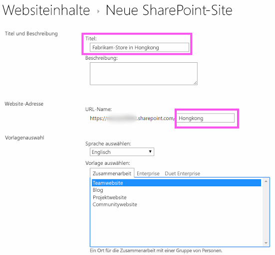
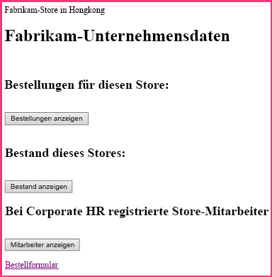
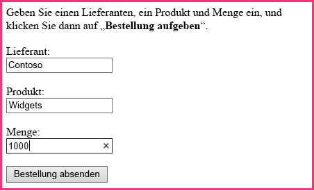
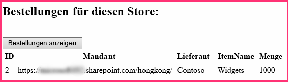
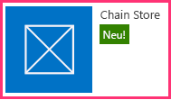
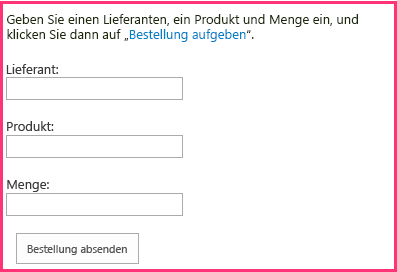
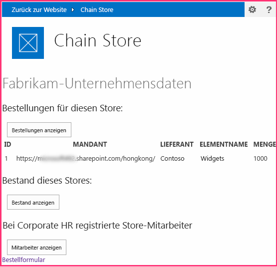
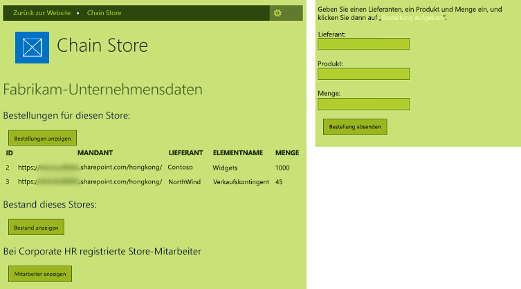

# Erteilen des Aussehens und Verhaltens von SharePoint für Ihr vom Anbieter gehostetes Add-In
Erfahren Sie, wie Sie Ihren vom Anbieter gehosteten SharePoint-Add-Ins das Aussehen und Verhalten von SharePoint geben.
Dies ist der zweite einer Reihe von Artikeln über die Grundlagen der Entwicklung von vom Anbieter gehosteten SharePoint-Add-Ins. Machen Sie sich zunächst mit  [SharePoint-Add-Ins](sharepoint-add-ins.md) und den vorherigen Artikeln dieser Reihe vertraut:
  
    
    


-  [Erste Schritte beim Erstellen von von einem Anbieter gehosteten SharePoint-Add-Ins](get-started-creating-provider-hosted-sharepoint-add-ins.md)
    
  

Im vorherigen Artikel dieser Reihe haben Sie gelernt, wie Sie eine Entwicklungsumgebung einrichten und Visual Studio verwenden, um ein erstes Add-In der Ebene „Hello World" zu erstellen, das SharePoint-Daten in der Remotewebanwendung des Add-Ins zur Verfügung stellt. In diesem Artikel beginnen wir mit einer SharePoint-Add-In-Projektmappe, die bereits erstellt wurde. Sie enthält eine ASP.NET-Web Forms-Anwendung und eine SQL Azure-Datenbank. Wir haben diese für Sie erstellt, da diese Reihe von Artikeln dafür vorgesehen ist, sich nur auf SharePoint-Add-Ins zu konzentrieren. Sie fügen weitere SharePoint-Funktionalität und die Integration in das Add-In mit jedem Artikel dieser Reihe hinzu.
  
    
    


## Einführung in das Basis-Add-In

Wir werden Ihnen in dieser Reihe keine Kenntnisse der ASP.NET- oder T-SQL-Programmierung vermitteln, aber Sie müssen ein wenig über die Remotekomponenten des Add-Ins wissen, bevor wir die Integration in SharePoint beginnen können. Das Szenario des Add-Ins umfasst eine Kette von Einzelhandelsgeschäften, und jedes Geschäft verfügt über eine Teamwebsite im SharePoint Online-Abonnement der Muttergesellschaft. Wenn ein Geschäft das Add-In auf der Teamwebsite installiert, ermöglicht das Add-In die Integration der SharePoint-Daten und den Umgang mit Daten in der Datenbank der Muttergesellschaft. Jede Instanz des Add-Ins verfügt über einen eigenen Mandanten in der Unternehmensdatenbank, und Benutzer können nur mit den Unternehmensdaten interagieren, die ihrem Geschäft zugeordnet sind.
  
    
    

### Erster Schritt: Erstellen von Teamwebsites für zwei Geschäfte in der Kette


1. Öffnen Sie die Startseite von SharePoint Online, und klicken Sie dann auf den Link **Websiteinhalte** auf der Schnellstartleiste. Blättern Sie auf der Seite **Websiteinhalte** nach unten, bis Sie den Link **Neue Unterwebsite** sehen. Klicken Sie darauf.
    
  
2. Füllen Sie auf der Seite **Neue SharePoint-Website** das Formular für eine neue Teamwebsite mithilfe der Werte im folgenden Screenshot aus.
    
     
  

  

  
3. Behalten Sie für alle anderen Einstellungen die Standardeinstellungen bei, und klicken Sie auf **Erstellen**.
    
  

### Erkunden des Add-Ins


1. Wechseln Sie zu  [SharePoint_Provider-Hosted_Add-Ins_Tutorials](https://github.com/OfficeDev/SharePoint_Provider-hosted_Add-ins_Tutorials), und klicken Sie auf die Schaltfläche **ZIP herunterladen**, um das Repository auf Ihren Desktop herunterzuladen. Dekomprimieren Sie die Datei.
    
  
2. Starten Sie Visual Studio *als Administrator*  , und öffnen Sie dann BeforeSharePointUI.sln. Es gibt drei Projekte in der Projektmappe:
    
  - **ChainStore**, das SharePoint-Add-In-Projekt
    
  
  - **ChainStoreWeb**, die Remotewebanwendung
    
  
  - **ChainCorporateDB**, die SQL Azure-Datenbank
    
  
3. Wählen Sie das Projekt **ChainStore** aus, und legen Sie im Fenster **Eigenschaften** die Eigenschaft **Website-URL** auf die vollständige URL der Hongkong-Teamwebsite fest:https://{YOUR_SHAREPOINT_DOMAIN}/hongkong/. Achten Sie darauf, dass das Zeichen „/" am Ende einzufügen. Klicken Sie auf die Schaltfläche **Speichern**.  *An einem bestimmten Punkt in diesem Prozess werden Sie aufgefordert, sich bei Ihrem SharePoint Online-Abonnement anzumelden.* 
    
  
4. Klicken Sie mit der rechten Maustaste oben im **Projektmappen-Explorer** auf den Projektmappenknoten, und wählen Sie **Startprojekte festlegen** aus.
    
  
5. Stellen Sie sicher, dass alle drei Projekte in der Spalte **Aktion** auf **Start** festgelegt sind.
    
  
6. Verwenden Sie die F5-Taste, um das Ihr Add-In bereitzustellen und auszuführen. Visual Studio hostet die Remotewebanwendung in IIS Express und die SQL-Datenbank in SQL Express. Außerdem wird eine temporäre Installation des Add-Ins auf Ihrer SharePoint-Testwebsite durchgeführt, und das Add-In wird sofort ausgeführt. Sie werden aufgefordert, Berechtigungen für das Add-In zu erteilen, bevor die Startseite geöffnet wird.
    
  
7. Die Add-In-Startseite sieht wie im folgenden Screenshot aus. Ganz oben wird der Name der SharePoint-Website angezeigt, auf der das Add-In installiert ist. Dies ist ein Nebeneffekt eines Beispielcodes, den Office-Entwicklertools für Visual Studio generiert. Dies wird in einem späteren Schritt geändert. Die Seite hat Bereiche, in denen Daten aus den SQL-Unternehmensdatenbanktabellen **Bestand**, **Aufträge** und **Mitarbeiter** angezeigt werden. Diese Tabellen sind zunächst leer.
    
     
  

  

  
8. Öffnen Sie den Link **Auftragsformular** am unteren Rand der Seite, um ein Auftragsformular zu öffnen. Geben Sie einige Werte in das Formular ein, und klicken Sie auf **Bestellung aufgeben**. Der folgende Screenshot zeigt ein Beispiel. Es sieht nicht so aus, als wäre etwas passiert, aber der Code hinter der Schaltfläche übergibt die Werte an eine parametrisierte gespeicherte Prozedur in der SQL-Datenbank. Das Verwenden von parametrisierten gespeicherten Prozeduren schützt die Datenbank vor Angriffen durch Einschleusung von SQL-Befehlen.
    
     
  

  

  
9. Verwenden Sie die Schaltfläche „Zurück" des Browsers, um zurück zur Startseite zu navigieren, und klicken Sie dann auf die Schaltfläche **Bestellungen anzeigen**. Die Seite wird aktualisiert, und Ihre Bestellung wird auf der Seite angezeigt, ähnlich wie im folgenden Screenshot.
    
    Die Tabelle weist ein Feld **Mandanten** mit der URL Ihrer SharePoint-Testwebsite als Wert. Dies bezieht sich nicht auf das SharePoint Online-Abonnement, das manchmal als Mandant bezeichnet wird, sondern jede Instanz des Add-Ins ist ein unterschiedlicher Mandant in der Datenbank des Unternehmens. Da nicht mehr als eine Instanz eines Add-Ins in einem bestimmten SharePoint-Hostweb installiert werden kann, kann die URL des Hostwebs als Mandantendiskriminator in der Datenbank verwendet werden. (Eine Wiederholung zum Unterschied zwischen Hostweb und Add-In-Web finden Sie unter [SharePoint-Add-Ins](sharepoint-add-ins.md).) Alle gespeicherten Prozeduren im Add-In enthalten den Diskriminatorwert, wenn sie an die Datenbank schreiben oder aus dieser lesen. Das sorgt dafür, dass beim Klicken auf die Schaltfläche **Bestellungen anzeigen** (oder **Mitarbeiter anzeigen** oder **Bestand anzeigen**) durch den Benutzer nur die Daten aus der Datenbank abgerufen werden, die dem Geschäft des Benutzers zugeordnet sind. Dieses Design stellt außerdem sicher, dass Benutzer nur für ihr eigenes Geschäft Bestellungen aufgeben und Mitarbeiter hinzufügen können.
    
    Die Remotewebanwendung ruft die Hostweb-URL von einen Abfragezeichenfolgenparameter ab, den SharePoint zur URL der Startseite hinzufügt, wenn das Add-In gestartet wird. Da SSL verwendet wird, wird diese Abfragezeichenfolge verschlüsselt, während sie über das Internet an die Remotewebanwendung übergeben wird. 
    
     
  

  

  
10. Schließen Sie zum Beenden der Debugsitzung das Browserfenster, oder beenden Sie das Debuggen in Visual Studio. Jedes Mal, wenn Sie F5 drücken, zieht Visual Studio die vorherige Version des Add-Ins zurück und installiert die neueste.
    
  
11. Das Add-In bleibt standardmäßig im SharePoint-Hostweb zwischen Debugsitzungen in Visual Studio installiert. Um anzuzeigen, wie Endbenutzer es nach der Installation starten, öffnen Sie die SharePoint-Website „Fabrikam Hong Kong" in Ihrem Browser, und navigieren Sie zur Seite **Websiteinhalte**. Sie sehen die Kachel für das Add-In, wie im folgenden Screenshot gezeigt:
    
     
  

    
    > **HINWEIS**
      > Wenn Sie auf die Kachel klicken, wird die Startseite nicht geöffnet, weil Visual Studio die IIS Express-Sitzung schließt, wenn Sie das Debuggen beenden. 

## Konfigurieren von Visual Studio zum erneuten Erstellen der Unternehmensdatenbank bei jeder Debugsitzung
<a name="Rebuild"> </a>

 Standardmäßig erstellt Visual Studio die SQL Express-Datenbank *nicht*  neu. Daher sind Bestellungen und andere Elemente, die Sie in einer Debugsitzung zur Datenbank hinzufügen, in späteren Sitzungen noch in der Datenbank enthalten. Es ist einfacher, jedes Mal, wenn Sie F5 Drücken, mit einer leeren Datenbank zu starten. Gehen Sie also wie folgt vor:
  
    
    

1. Klicken Sie mit der rechten Maustaste auf das Projekt **ChainCorporateDB**, und wählen Sie **Eigenschaften** aus.
    
  
2. Öffnen Sie die Registerkarte **Debuggen**, und aktivieren Sie die Option **Datenbank immer neu erstellen**.
    
  

## Übernehmen des Aussehens und Verhaltens von SharePoint für die Remotewebanwendung
<a name="Rebuild"> </a>

In einigen Szenarien sollen Ihre Remoteseiten ihr eigenes Branding haben, aber in den meisten Fällen sollten sie die Benutzeroberfläche von SharePoint imitieren, damit Benutzer den Eindruck haben, dass sie weiterhin in SharePoint arbeiten.
  
    
    

### Hinzufügen von SharePoint-Chrom und der oberen Leiste zur Startseite


1. Navigieren Sie im **Projektmappen-Explorer** zu **ChainStoreWeb | Seiten**, und öffnen Sie die Datei CorporateDataViewer.aspx. Hierbei handelt es sich um die Startseite des Add-Ins.
    
  
2. Im Abschnitt **head** sehen Sie ein Skript, das eine Reihe von JavaScript-Bibliotheken lädt. Fügen Sie das folgende zusätzliche Skript darunter hinzu. Dieses Skript lädt die Datei SP.UI.Controls.js, die sich auf jeder SharePoint-Website im Ordner /_layouts/15/ befindet. Diese Datei lädt unter anderem die SharePoint-CSS-Bibliothek.
    
  ```
  
<script type="text/javascript">
    var hostweburl;

    // Load the SharePoint resources.
    $(document).ready(function () {

        // Get the URI decoded add-in web URL.
        hostweburl =
            decodeURIComponent(
                getQueryStringParameter("SPHostUrl")
        );

        // The SharePoint js files URL are in the form:
        // web_url/_layouts/15/resource.js
        var scriptbase = hostweburl + "/_layouts/15/";

        // Load the js file and continue to the 
        // success handler.
        $.getScript(scriptbase + "SP.UI.Controls.js")
    });

    // Function to retrieve a query string value.
    function getQueryStringParameter(paramToRetrieve) {
        var params =
            document.URL.split("?")[1].split("&amp;");
        var strParams = "";
        for (var i = 0; i < params.length; i = i + 1) {
            var singleParam = params[i].split("=");
            if (singleParam[0] == paramToRetrieve)
                return singleParam[1];
        }
    }
</script>
  ```

3. Fügen Sie am Anfang des Textabschnitts der Seite das folgende Markup hinzu. Dadurch wird die obere Leiste von SharePoint, die als Chromsteuerelement bezeichnet wird, auf der Seite eingefügt. Die Details dieses Markups werden klarer, wenn das überarbeitete Add-In später in diesem Artikel getestet wird. (Die Zeichenfolge „App" wird in einigen der Eigenschaftennamen angezeigt, da Add-Ins zuvor als „Apps" bezeichnet wurden.)
    
  ```
  
<!-- Chrome control placeholder. Options are declared inline.  -->
<div 
    id="chrome_ctrl_container"
    data-ms-control="SP.UI.Controls.Navigation"  
    data-ms-options=
        '{  
            "appHelpPageUrl" : "Help.aspx",
            "appIconUrl" : "/Images/AppIcon.png",
            "appTitle" : "Chain Store",
            "settingsLinks" : [
                {
                    "linkUrl" : "Account.aspx",
                    "displayName" : "Account settings"
                },
                {
                    "linkUrl" : "Contact.aspx",
                    "displayName" : "Contact us"
                }
            ]
         }'>
</div>
  ```

4. Die **H1**-Header und der Hyperlink im Textteil der Seite verwenden automatisch Formate, die in der CSS-Bibliothek von SharePoint gespeichert sind, und müssen deshalb nicht geändert werden. Zum Illustieren der Verwendungsweise von SharePoint-Formaten legen Sie die Spaltenüberschriften in den drei **GridView**-Steuerelementen auf das Share-Point-Format „Großbuchstaben" fest, indem Sie das Attribut **HeaderStyle-CssClass** zu jedem der Steuerelemente hinzufügen und den Wert auf `ms-uppercase` festlegen. Im Folgenden sehen Sie ein Beispiel. Nehmen Sie dieselbe Änderung an allen drei **GridView**-Steuerelementen vor.
    
  ```XML
  
<asp:GridView ID="ordersGridView" runat="server" CellPadding="5" GridLines="None"
HeaderStyle-CssClass="ms-uppercase" />
  ```

5. Das Chromsteuerelement verwendet das Add-In-Symbol, deshalb wird eine zweite Kopie der Symboldatei auf dem Remotewebserver benötigt. Klicken Sie im **Projektmappen-Explorer** mit der rechten Maustaste auf die Datei AppIcon.png im Projekt **ChainStore**, und wählen Sie **Kopieren** aus.
    
  
6. Klicken Sie mit der rechten Maustaste auf den Ordner **Bilder** im Projekt **ChainStoreWeb**, und wählen Sie **Einfügen** aus.
    
  
7. Öffnen Sie die Datei CorporateDataViewer.aspx.cs.
    
  
8. Die  `CorporateDataViewer`-Klasse deklariert einen privaten Member des Typs **SharePointContext**. Diese Klasse ist in der SharePointContext.cs-Datei definiert, die die Office-Entwicklertools für Visual Studio generiert haben, als das Projekt erstellt wurde. Sie können sich das in etwa wie die **HttpContextBase**-Klasse von ASP.NET vorstellen, aber mit hinzugefügten kontextbezogenen SharePoint-Informationen wie der Hostweb-URL.
    
    In der Methode **Page_Load** gibt es eine **using**-Anweisung, die den Namen des SharePoint-Hostwebs an die Remotestartseite schreibt. Hierbei handelt es sich um Beispielcode, deshalb löschen Sie die gesamte **using**-Anweisung. (Aber behalten Sie die Zeile bei, die die Variable  `spContext` initialisiert.) Die Methode sollte jetzt wie folgt aussehen.
    


  ```cs
  
protected void Page_Load(object sender, EventArgs e)
{
    spContext = SharePointContextProvider.Current.GetSharePointContext(Context);
}
  ```

9. Es gibt vier ASP.NET-Dateien, die die SharePoint-UI benötigen: 
    
  - Account.aspx
    
  
  - Contact.aspx
    
  
  - Help.aspx
    
  
  - OrderForm.aspx
    
  

    > **HINWEIS**
      > Die letzte aspx-Datei des Projekts, EmployeeAdder.aspx, wird tatsächlich nie gerendert, deshalb sollten sie deren Benutzeroberfläche nicht ändern. Sie erfahren mehr darüber in einem späteren Artikel dieser Reihe. 

    Das Chromsteuerelement soll sich jedoch nicht auf diesen Seiten befinden. Wir möchten lediglich auf die SharePoint-CSS-Bibliothek zugreifen. Fügen Sie für jede dieser vier das folgende Markup zum Element **head** hinzu.
    


  ```XML
  
<link type="text/css" rel="stylesheet"
href="<%= spContext.SPHostUrl.ToString() + "_layouts/15/defaultcss.ashx" %>" />
  ```

10. Dieser und der nächste Schritt wurden für die Seite „Auftragsformular" und „Konto" bereits durchgeführt, sie gelten also nur für die Seiten „Kontakt" und „Hilfe". Um das  `spContext`-Objekt auf jede der Seiten einzufügen, öffnen Sie die *.aspx-CodeBehind-Dateien für die drei aspx-Seiten. Fügen Sie in jeder den folgenden Member zur Klasse **Page** hinzu.
    
  ```cs
  
protected SharePointContext spContext;
  ```

11. Ersetzen Sie die Methode **Page_Load** durch die folgende Version. Das Objekt wird aus dem Sitzungscache abgerufen. Es wurde zwischengespeichert, als es erstmals von der Methode **Page_Load** der Startseite des Add-Ins erstellt wurde.
    
  ```cs
  protected void Page_Load(object sender, EventArgs e)
{
    spContext = Session["SPContext"] as SharePointContext;
}
  ```

12. Öffnen Sie die Seite OrderForm.aspx. Ersetzen Sie oben im Element **Label** das Element **<b>** auf dem Ausdruck **Bestellung aufgeben** durch Span-Tags, die auf die `ms-accentText`-CSS-Klasse verweisen. Das gesamte **Label**-Steuerelement sollte wie folgt aussehen, wenn Sie fertig sind.
    
  ```XML
  
<asp:Label ID="lblOrderPrompt" runat="server"
         Text="Enter a supplier, product, and quantity; and then press <span class='ms-accentText'>Place Order</span>.">
</asp:Label>
  ```


## Ausführen des Add-Ins und Testen der neuen SharePoint-UI
<a name="Rebuild"> </a>


  
    
    

1. Verwenden Sie die F5-TASTE, um Ihr Add-In bereitzustellen und auszuführen. Visual Studio hostet die Remotewebanwendung in IIS Express und die SQL-Datenbank in SQL Express. Außerdem wird eine temporäre Installation des Add-Ins auf Ihrer SharePoint-Testwebsite durchgeführt, und das Add-In wird sofort ausgeführt. Sie werden aufgefordert, Berechtigungen für das Add-In zu erteilen, bevor die Startseite geöffnet wird.
    
  
2. Wenn die Add-In-Startseite geöffnet wird, sieht sie jetzt wie eine SharePoint-Seite aus. Klicken Sie auf den Link **Auftragsformular**. Das Formular sieht jetzt ebenfalls wie ein SharePoint-Formular aus.
    
     
  

  

  
3. Erstellen Sie eine Bestellung, und klicken Sie auf **Bestellung aufgeben**.
    
  
4.  Verwenden Sie die Schaltfläche „Zurück" des Browsers, um zurück zur Add-In-Startseite zu navigieren, und klicken Sie dann auf **Bestellungen anzeigen**. Die Seite sollte jetzt ungefähr wie folgt aussehen. Beachten Sie, dass die Spaltenüberschriften jetzt in Großbuchstaben dargestellt sind. 
    
     
  

  

  
5. Klicken Sie auf das Symbol **?** am Ende des Chromsteuerelements. Eine einfache Hilfeseite wird geöffnet. Klicken Sie im Browser auf die Schaltfläche „Zurück".
    
  
6. Klicken Sie auf das Zahnradsymbol des Chromsteuerelements. Ein Menü mit Links zu einer Konto- und einer Kontaktseite wird geöffnet. Öffnen Sie die Kontoseite, und verwenden Sie im Browser die Schaltfläche „Zurück", um zur Startseite zurückzukehren. Gehen Sie genauso mit der Kontaktseite vor.
    
  
7. Klicken Sie auf die Schaltfläche **Zurück zur Website** des Chromsteuerelements. Die Startseite des Hostwebs, die Teamwebsite des Geschäfts in Hongkong, wird geöffnet.
    
  
8. Klicken Sie auf das Zahnradsymbol in der oberen Leiste, und wählen Sie dann **Aussehen ändern** aus.
    
  
9. Befolgen Sie zum Ändern der Website in eins der alternativen Designs die Eingabeaufforderungen.
    
  
10. Navigieren Sie zur Seite **Websiteinhalte**, und starten Sie die ChainStore-App über ihre Kachel. Ihre benutzerdefinierten Seiten haben das ausgewählte Aussehen übernommen. Die folgenden Screenshots zeigen, wie sie im zusammengesetzten Design **Natur** angezeigt werden.
    
     
  

  

  
11. Ändern Sie das Aussehen der Website wieder auf die Standardeinstellung, die als **Office** bezeichnet wird.
    
  
12. Schließen Sie zum Beenden der Debugsitzung das Browserfenster, oder beenden Sie das Debuggen in Visual Studio. Jedes Mal, wenn Sie F5 drücken, zieht Visual Studio die vorherige Version des Add-Ins zurück und installiert die neueste.
    
  
13. Da Sie mit diesem Add-In und dieser Visual Studio-Projektmappe in anderen Artikeln arbeiten werden, hat es sich bewährt, das Add-In ein letztes Mal zurückzuziehen, wenn Sie Ihre Arbeit daran für eine Weile abgeschlossen haben. Klicken Sie mit der rechten Maustaste auf das Projekt im **Projektmappen-Explorer**, und wählen Sie **Zurückziehen** aus.
    
  

## 
<a name="Nextsteps"> </a>

 Das Add-In sieht nun wie SharePoint aus, ist aber dennoch nur noch eine Webanwendung, die nicht wirklich in SharePoint integriert ist, außer dass sie über eine Kachel in SharePoint gestartet wird. Im nächsten Artikel fügen Sie einen benutzerdefinierten Befehl hinzu, der über eine benutzerdefinierte Menübandschaltfläche gestartet wird: [Einfügen einer benutzerdefinierten Schaltfläche in das vom Anbieter gehostete Add-In](include-a-custom-button-in-the-provider-hosted-add-in.md).
  
    
    

