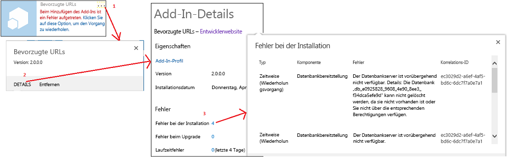
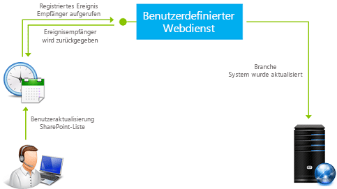

# Behandeln von Ereignissen in SharePoint-Add-Ins

Ihr benutzerdefinierter Code kann drei Kategorien von Ereignissen in vom Anbieter gehosteten Add-Ins behandeln:
  
    
    


- **Listenereignisse**, z. B. das Hinzufügen oder Löschen einer Liste auf einer Website.
    
  
- **Listenelementereignisse**, z. B. das Bearbeiten eines Elements in einer Liste.
    
  
- **Add-In-Ereignisse**, z. B. die Installation eines Add-Ins.
    
  

In SharePoint gehostete SharePoint-Add-Ins unterstützen keine Ereignisbehandlung, aber Sie können einen Workflow in eine Art Listen- oder Listenelement-Ereignishandler umwandeln, indem Sie ein Ereignis festlegen, das den Workflow auslöst. Weitere Informationen finden Sie unter  [Workflows in SharePoint 2013](http://msdn.microsoft.com/library/e0602371-ae22-44be-8a7e-9e47e9f046d6%28Office.15%29.aspx). Workflows können nicht durch Add-In-Ereignisse ausgelöst werden, und somit können Add-In-Ereignisse nicht mit einem in SharePoint gehosteten Add-In behandelt werden.
  
    
    


> [!HINWEIS]
> Websiteereignisse und Websitesammlungsereignisse werden in SharePoint-Add-Ins nicht unterstützt. 
  
    
    

Es gibt zwei Arten von Ereignissen:
- ** *Before*  -Ereignisse** werden ausgelöst, bevor die SharePoint-Infrastruktur eine eigene Handhabung des Ereignisses (einschließlich Ausführen eines Commits der Änderungen an der Inhaltsdatenbank) beginnt. In SharePoint ** werden benutzerdefinierte Before-Ereignishandler immer synchron ausgeführt**. Unter anderem können sie verwendet werden, um das Ereignis abzubrechen. Wenn ein Add-In beispielsweise über eine Funktion zum Löschen einer Liste verfügt, kann ein Handler für das Ereignis zum Löschen der Liste den Löschvorgang abbrechen, wenn bestimmte Bedingungen nicht erfüllt sind. Wenn das Ereignis Teil einer Ereignissequenz ist, verhindert das Abbrechen des Ereignisses, dass spätere Ereignisse überhaupt stattfinden. Wenn beispielsweise Ihr Handler für das Ereignis **ItemAdding** das Ereignis abbricht, wird das Ereignis **ItemAdded**, das normalerweise später durchgeführt wird, nicht ausgelöst.
    
  
- ** *After*  -Ereignisse** werden ausgelöst, nachdem die SharePoint-Infrastruktur ihre eigene Handhabung des Ereignisses begonnen hat. In SharePoint **werden Remote-After-Ereignishandler für Listen- und Listenelementereignisse immer asynchron ausgeführt**. (App-Ereignisse sind eine Ausnahme.) Sie können unter anderem verwendet werden, um Ereignisse zu protokollieren.
    
  

## Behandeln von Listen- und Listenelementereignissen
<a name="RER"> </a>

Zur Behandlung von Listen- und Listenelementereignissen erstellen Sie Remoteereignisempfänger (RERs). Dabei handelt es sich um Webdienste, die extern zur SharePoint-Farm oder zu SharePoint Online sind. Die URL des RER-Diensts wird für die Ereignisse registriert, die er verarbeitet. Es gibt zwei Möglichkeiten, einen Handler zu registrieren:
  
    
    

- Ereignisse im Hostweb werden programmgesteuert beim CSOM (Clientobjektmodell) oder der SharePoint-REST-API registriert. Diese Aufgabe wird normalerweise in der Logik für die „erste Ausführung" im Add-In oder in einem Handler für ein Add-In-Ereignis ausgeführt. (Eine Übersicht über Add-In-Ereignisse finden Sie im weiteren Verlauf des Artikels unter  [Behandeln von Add-In-Ereignissen](#HandlingAppEvents).) Ein Codebeispiel, das ein Listenereignis programmgesteuert registriert, finden Sie unter  [OfficeDev/PnP/Samples/Core.EventReceivers](https://github.com/OfficeDev/PnP/tree/master/Samples/Core.EventReceivers).
    
  
- Ereignisse im Add-In-Web werden normalerweise mit einfachem XML-Markup in einem Feature des Add-In-Webs registriert. Details zum Erstellen des Markups und des Diensts finden Sie in  [Erstellen eines Remoteereignisempfängers in Add-Ins für SharePoint](create-a-remote-event-receiver-in-sharepoint-add-ins.md). Es ist auch möglich, Add-In-Web-Ereignisse programmgesteuert zu registrieren.
    
  

> [!HINWEIS]
> RERs dienen demselben Zweck wie Ereignisempfänger in Farmlösungen. Ereignisempfänger weisen jedoch benutzerdefinierten Code auf, der auf den SharePoint-Servern ausgeführt wird, sodass sie nicht in SharePoint-Add-Ins verwendet werden können. 
  
    
    

Ihr Add-In kann die folgenden Listen- und Dokumentbibliotheksereignisse behandeln. Auf "ing" endende Ereignisse sind (synchrone) Vorabereignisse, die auf "ed" endenden sind (asynchrone) Nachfolgeereignisse.
  
    
    

|||
|:-----|:-----|
|ListAdding  <br/> |ListAdded  <br/> |
|ListDeleting  <br/> |ListDeleted  <br/> |
|FieldAdding  <br/> |FieldAdded  <br/> |
|FieldDeleting  <br/> |FieldDeleted  <br/> |
|FieldUpdating  <br/> |FieldUpdated  <br/> |
   
Bei den FieldUpdate-Ereignissen geht es um die Änderung der Eigenschaften eines Felds (einer Spalte) in einer Liste, z. B. dessen Sortierbarkeit, nicht um die Änderung der Daten in dem Feld.
  
    
    
Ihr Add-In kann die folgenden Listenelementereignisse behandeln.
  
    
    

|||
|:-----|:-----|
|ItemAdding  <br/> |ItemAdded  <br/> |
|ItemUpdating  <br/> |ItemUpdated  <br/> |
|ItemDeleting  <br/> |ItemDeleted  <br/> |
|ItemCheckingOut  <br/> |ItemCheckedOut  <br/> |
|ItemCheckingIn  <br/> |ItemCheckedIn  <br/> |
|ItemUncheckingOut  <br/> |ItemUncheckedOut  <br/> |
|ItemAttachmentAdding  <br/> |ItemAttachmentAdded  <br/> |
|ItemAttachmentDeleting  <br/> |ItemAtttachmentDeleted  <br/> |
|ItemFileMoving  <br/> |ItemFileMoved  <br/> |
|ItemVersionDeleting*  <br/> |ItemVersonDeleted*  <br/> |
||ItemFileConverted  <br/> |
   

> [!HINWEIS]
> *Diese zwei neuen Ereignisse sind möglicherweise nicht in der Visual Studio-Benutzeroberfläche verfügbar. Falls nicht, wählen Sie „ItemDeleting" oder „ItemDeleted" aus, und ändern Sie die Namen dann manuell. 
  
    
    

Wenn Sie in Visual Studio arbeiten und einen RER zu einem SharePoint-Add-In-Projekt hinzufügen, wird von den Office-Entwicklertools für Visual Studio Folgendes ausgeführt:
  
    
    

- Eine Webdienstdatei wie "RemoteEventReceiver1.svc" wird der Webanwendung hinzugefügt, um die Ereignisse zu verarbeiten, die Sie beim Hinzufügen des Remoteereignisempfängers zur SharePoint-Add-In angegeben haben. Der Webdienst enthält eine Codedatei zum Behandeln der Remoteereignisse.
    
    Nachdem Sie den Remoteereignisempfänger erstellt haben, fügen Sie der Codedatei für den Webanwendungsdienst Code zum Behandeln der Ereignisse hinzu. Standardmäßig enthält die Codedatei zwei Methoden, die Sie Ihrem Behandlungscode hinzufügen:
    
  -  `ProcessEvent()` behandelt Vorabereignisse (wie die in den linken Spalten in den Tabellen im früheren Verlauf des Artikels) und gibt ein Objekt an SharePoint zurück, das meldet, ob das Ereignis abgebrochen oder fortgesetzt werden sollte.
    
  
  -  `ProcessOneWayEvent()` behandelt Nachfolgeereignisse. Es wird asynchron ausgeführt und gibt nichts an SharePoint zurück.
    
  

    Wenn ein registriertes Ereignis auftritt, ruft SharePoint die entsprechende Methode in Ihrem Dienst auf und übergibt ein Objekt, das einige Kontextinformationen für den Code bereitstellt. Beispielsweise wird der Ereignistyp (aus einer der beiden Tabellen im früheren Verlauf des Artikels) identifiziert, damit Ihr Code zur dem Ereignis entsprechenden Logik verzweigen kann.
    
  
- Ein Projektelement für den Remoteereignisempfänger wird dem SharePoint-Add-In-Projekt hinzugefügt. Die Datei "Elements.xml" für den Remoteereignisempfänger verweist auf den Webdienst in der Webanwendung und die Remoteereignisse, die Sie angegeben haben. Das folgende Beispiel zeigt eine Datei "Elements.xml", die das Hinzufügen oder Löschen eines Listenelements behandelt.
    
  ```XML
  
<?xml version="1.0" encoding="utf-8"?>
<Elements xmlns="http://schemas.microsoft.com/sharepoint/">
  <Receivers ListTemplateId="104">
      <Receiver>
        <Name>RemoteEventReceiver1ItemAdding</Name>
        <Type>ItemAdding</Type>
        <SequenceNumber>10000</SequenceNumber>
        <Url>~remoteAppUrl/RemoteEventReceiver1.svc</Url>
      </Receiver>
      <Receiver>
        <Name>RemoteEventReceiver1ItemDeleting</Name>
        <Type>ItemDeleting</Type>
        <SequenceNumber>10000</SequenceNumber>
        <Url>~remoteAppUrl/RemoteEventReceiver1.svc</Url>
      </Receiver>
  </Receivers>
</Elements>
  ```

Um die Ereignisse zu ändern, die der Remote-Ereignisempfänger behandelt, öffnen Sie den **Projektmappen-Explorer** und dann das Fenster **Eigenschaften** für den Remote-Ereignisempfänger, erweitern den Knoten **SharePoint-Ereignisse** und legen dann nur die zu behandelnden Ereignisse auf **True** fest.
  
    
    

> [!HINWEIS]
> Weitere Informationen zu RERs, einschließlich Informationen zur Problembehandlung, finden Sie unter  [FAQ für Remote-Ereignisempfänger](handle-events-in-sharepoint-add-ins.md#RERFAQ). 
  
    
    


## Behandeln von Add-In-Ereignissen
<a name="HandlingAppEvents"> </a>

Add-In-Ereignisse werden auch von Remotewebdiensten behandelt, sind jedoch im Add-In-Paket anders konfiguriert als Listen- und Listenelement-RERs, sodass sie als eine separate Kategorie von Komponenten behandelt werden. Der Remotewebdienst ist für ein Add-In-Ereignis im Add-In-Manifest registriert und nicht in einem Add-In-Web-Feature. Das Add-In muss nicht einmal über ein Add-In-Web verfügen. Es gibt drei Add-In-Ereignisse, wie in den folgenden Abschnitten beschrieben.
  
    
    

### AppInstalled-Ereignis

Das Ereignis **AppInstalled** wird ausgeführt, unmittelbar nachdem SharePoint alle zur Installation des Add-Ins erforderlichen Aktionen abgeschlossen hat, jedoch bevor der Benutzer über den Abschluss der Installation benachrichtigt wird. Obwohl es sich hier um ein *After*  -Ereignis handelt, führt SharePoint Ihren Handler *synchron*  aus. Das Add-In ist erst verfügbar, wenn der Handler abgeschlossen wurde, und der Handler kann die Installation abbrechen (wodurch SharePoint veranlasst wird, alle im Rahmen der Installation ausgeführten Aktionen zurückzusetzen). Tatsächlich ist es eine bewährte Methode, alle eventuellen Fehler im Handler abzufangen und SharePoint zum Zurücksetzen der Installation anzuweisen. Weitere Informationen finden Sie unter [Einbeziehen von Rollbacklogik und "Bereits erledigt"-Logik in Add-In-Ereignishandler](#Rollback).
  
    
    

> [!HINWEIS]
> Beim Installieren eines Add-Ins mit  [Mandantenbereich](tenancies-and-deployment-scopes-for-sharepoint-add-ins.md) wird das Add-In in der Add-In-Katalog-Websitesammlung installiert, und das AppInstalled-Ereignis wird dann und nur dann ausgeführt. Das Add-In wird in mehreren Websites des Mandanten angezeigt, aber das Ereignis wird nicht separat für jede ausgeführt.
  
    
    

Neben dem Abbruch der Add-In-Installation kann dieses Ereignis für viele andere Zwecke verwendet werden:
  
    
    

- Installieren von SharePoint-Komponenten im Hostweb, die nicht deklarativ mit dem Hostwebfeature installiert werden können, z. B. Listen oder Unterwebsites.
    
  
- Programmgesteuertes Registrieren von Listen- und Listenelement-Ereignishandlern beim Hostweb oder Add-In-Web.
    
  
- Festlegen der App-Instanz-relativen Initialisierungseinstellungen. Beispielsweise kann Ihr Add-In einen Add-In-Web-Eigenschaftenbehälter zum Speichern von Einstellungen enthalten, die von einer Instanz des Add-Ins zur anderen variieren. Der AppInstalled-Handler kann, z. B. basierend auf dem Websitetyp des Hostwebs (z. B. Teamwebsite oder Blog-Website), unterschiedliche Werte in den Eigenschaftenbehälter schreiben.
    
    > [!HINWEIS]
      > Durch Überprüfen, ob das Hostweb eine AppCatalog-Website ist, lässt sich einfach feststellen, ob das Add-In mit Mandantenbereich installiert wurde. Siehe  [Mandantschaften und Bereitstellungsbereiche von Add-Ins für SharePoint](tenancies-and-deployment-scopes-for-sharepoint-add-ins.md). 
- Ausführen App-Instanz-relativer Konfiguration in der Remotewebanwendung des Add-ins, z. B. Hinzufügen einer Tabelle zu einer Datenbank.
    
  

> [!WICHTIG]
> Die Implementierung des AppInstalled-Ereignisses muss innerhalb von 30 Sekunden abgeschlossen sein. Andernfalls geht die SharePoint-Installationsinfrastruktur davon aus, dass ein Fehler aufgetreten ist. Die Infrastruktur führt das Ereignis erneut aus  *und wiederholt den Code von Anfang an*  bis zu drei Mal zusätzlich. Nach vier Timeouts wird die gesamte Add-In-Installation von SharePoint zurückgesetzt. Die kompletten Auswirkungen dieser Tatsachen werden unter [Einbeziehen von Rollbacklogik und "Bereits erledigt"-Logik in Add-In-Ereignishandler](#Rollback) erörtert.
  
    
    


### AppUninstalling-Ereignis

Das **AppUninstalling**-Ereignis wird  *nicht*  ausgeführt, wenn das Add-In aus dem Hostweb entfernt wird. Beim Entfernen eines Add-Ins wird dieses nur in den Papierkorb des Benutzers verschoben. Bevor das AppUninstalling-Ereignis ausgelöst wird, sind zwei weitere Schritte erforderlich. Erstens muss ein Benutzer das Add-In aus dem Papierkorb entfernen, sodass es in den endgültigen Papierkorb verschoben wird. Zweitens muss **ein Benutzer das Add-In aus dem endgültigen Papierkorb entfernen. Durch diese letzte Aufgabe wird das AppUninstalling-Ereignis ausgelöst**. Das AppUninstalling-Ereignis ist synchron und kann zum Abbruch der Installation verwendet werden. Dann verbleibt das Add-In im endgültigen Papierkorb.
  
    
    
Der Hauptzweck eines Handlers für dieses Ereignis besteht darin, mit einem AppInstalled- (oder AppUpdated-)Handler bereitgestellte Dinge zu löschen oder wieder zu verwenden. SharePoint kann diese Elemente nicht löschen oder in den Papierkorb verschieben, da es sie nicht kennt, zumindest nicht als Komponenten des Add-Ins. Es ist in der Regel empfehlenswert, diese Elemente zu entfernen. Sie sollten jedoch keine Elemente löschen, die nach dem Entfernen des Add-Ins weiter nützlich sind: Wenn eine von Ihrem AppInstalled-Handler erstellte Liste oder Website weiterhin verwendet wird, sollten Sie sie im AppUninstalling-Handler nicht löschen.
  
    
    

### AppUpgraded-Ereignis

Das **AppUpgraded**-Ereignis wird ausgeführt, unmittelbar nachdem SharePoint alle zum Update des Add-Ins auf eine neue Version erforderlichen Aktionen abgeschlossen hat, jedoch bevor der Benutzer über den Abschluss des Updates benachrichtigt wird. Wie das AppInstalled-Ereignis handelt es sich auch hier um ein After-Ereignis, das aber im Wesentlichen synchron ist, und es ist eine bewährte Methode, Fehler abzufangen und SharePoint zum Zurücksetzen des Updates anzuweisen.
  
    
    
Einige Beispiele für mögliche Aktionen eines Handlers für dieses Ereignis:
  
    
    

- Hinzufügen, Ändern oder Entfernen von Add-In-Komponenten aus dem Hostweb.
    
  
- Aktionen im Add-In-Web, die nicht mit der deklarativen Updatesemantik in einem Add-In-Web-Feature möglich sind. Beispielsweise können Sie mit dem deklarativen Update-Markup nichts löschen, aber programmgesteuert in einem AppUpgraded-Handler ist dies möglich.
    
  
- Ändern App-Instanz-relativer Komponenten in der Webanwendung oder Remotedatenbank des Add-Ins.
    
  
 *Ausführliche Anweisungen zum Erstellen von Add-In-Ereignishandlern finden Sie unter  [Erstellen eines Add-In-Ereignisempfängers in SharePoint-Add-Ins](create-an-add-in-event-receiver-in-sharepoint-add-ins.md)*  .
  
    
    

### Einbeziehen von Rollbacklogik und "Bereits erledigt"-Logik in Add-In-Ereignishandler
<a name="Rollback"> </a>

Wenn in SharePoint bei der Verarbeitung eines der drei Add-In-Ereignisse ein Fehler auftritt, wird das Ereignis abgebrochen, und die in Verbindung mit dem Ereignis vorgenommenen Änderungen werden zurückgesetzt. Ihre Add-In-Ereignishandler müssen in dieses System integriert werden, da bei einem Fehler eines Teils des von Ihnen implementierten Ereignisses das gesamte Ereignis zurückgesetzt werden soll, statt fortgesetzt zu werden und Dinge möglicherweise beschädigt zurückzulassen. In der Regel hat Ihr Handler Folgendes zu tun:
  
    
    

- SharePoint mitteilen, dass ein Fehler aufgetreten ist. Die SOAP-Nachricht, die Ihr Add-In-Ereignishandler-Webdienst an SharePoint zurückgibt, hat eine **Status**-Eigenschaft, die den Wert **Continue**, **CancelWithError** oder **CancelWithoutError** hat. Jeder **Cancel***-Status weist SharePoint an, das Ereignis zurückzusetzen.
    
  
- Die vor dem Fehler vom Handler durchgeführten Aktionen zurücksetzen. SharePoint kann dies in der Regel nicht für Sie tun, da es nicht weiß, was der Handler getan hat. Dies ist keine allgemeingültige Regel. Z. B. löscht SharePoint bei Abbruch einer Add-In-Installation das gesamte Add-In-Web. Daher hat es keinen Sinn, in einem AppInstalled-Ereignishandler alles zurückzusetzen, was er im Add-In-Web durchgeführt hat. Aber in der Regel sollte der Handler Dinge zurücksetzen, die er mit dem Hostweb oder mit Remotekomponenten des Add-Ins getan hat.
    
  

> [!HINWEIS]
> **Spezieller Hinweis zum AppUninstalling-Ereignis:** Die vorstehenden Punkte gelten für das AppUninstalling-Ereignis ebenso wie für die anderen beiden Add-In-Ereignisse. Beispielsweise muss, wenn der Handler für das Uninstalling-Ereignis eine Zeile in einer Remotedatenbank löscht und dann ein Fehler auftritt, die Zeile wiederhergestellt werden. Da Ihr Dienst eine Abbruchnachricht an SharePoint senden wird, wird das Add-In nicht aus dem Papierkorb entfernt. Wenn sie von dort wiederhergestellt und erneut verwendet wird, wird sie eventuell ohne diesen Datenbankeintrag nicht funktionieren.> Ihr AppUninstalling-Handler wird jedoch abgeschlossen,  *bevor*  SharePoint das Add-In aus dem Papierkorb entfernt. Tritt in SharePoint selbst ein Fehler auf und muss das Entfernen abgebrochen werden, besteht somit keine Möglichkeit für den Handler, seine Aktionen rückgängig zu machen.
  
    
    

Wenn SharePoint innerhalb von 30 Sekunden keine Ergebnisnachricht vom Handler erhält, wird der Handler erneut aufgerufen. Nach drei Wiederholungen (vier Versuchen insgesamt) wird vollständig aufgegeben und das Ereignis zurückgesetzt. Bei jedem Aufruf des Ereignishandlers wird der Code von Anfang an neu gestartet. Aber im Allgemeinen sollen bereits ausgeführte Aktionen des Handlers, z. B. das Erstellen einer Liste im Hostweb, nicht wiederholt werden, und Sie können vor Erreichen des Zeitlimits des Handlers nicht wissen, ob Ihre Rollbacklogik abgeschlossen wurde oder überhaupt ausgelöst wurde. Aus diesem Grund sollte Ihre Handler-Logik keine Aktionen ausführen, ohne zu prüfen, ob die Aktion bereits ausgeführt wurde, es sei denn, eine Wiederholung wäre harmlos.
  
    
    
Installations- und Aktualisierungsfehler können auf der SharePoint-Benutzeroberfläche angezeigt werden, wie in der folgenden Abbildung dargestellt.
  
    
    

**Abbildung 1. Abrufen von Details für Installationsfehler.**

  
    
    

  
    
    

  
    
    

#### Strategien für die Architektur von Add-In-Ereignishandlern
<a name="Strategies"> </a>

Ausgedrückt in Pseudocode sollte Ihr Handler in der Regel etwa wie folgt aufgebaut sein. Tritt ein Fehler im Abschnitt "Try" auf, sollte der Abschnitt "Catch" und "Rollback" aufgerufen werden. (Dies kann je nach Sprache und Framework automatisch erfolgen.)
  
    
    

```

Try
    If X not already done,
        Do X.
Catch
    Send cancel message to SharePoint.
    If X not already undone,
        Undo X.

```

Das Implementieren der Rollback- und "Bereits erledigt"-Logik in Ihrem Webdienst kann jedoch den Handler verlangsamen. Die Installations- und die Rollbacklogik nehmen in der Regel Änderungen an mehr oder weniger vom Webdienst entfernten Komponenten vor, wie z. B. dem SharePoint-Hostweb oder einer Back-End-Datenbank. Wenn der Installations- und Rollbackcode zwischen den Try und Catch-Abschnitten aufgeteilt ist, macht der Dienst separate Aufrufe an die Remotekomponenten, häufig mehrere solcher Aufrufe in jedem Abschnitt. Die bewährte Methode ist in der Regel, die Installations- und Rollbacklogik auf der Remotekomponente selbst in einer Prozedur zu implementieren, die im Try-Abschnitt vom Ereignishandler aufgerufen werden kann. Die Prozedur sollte eine Erfolgs- oder Fehlernachricht zurückgeben, und wenn ein Fehler gemeldet wird, ruft Code im Try-Abschnitt den Catch-Abschnitt auf (z. B. durch Auslösen einer Ausnahme). Im Catch-Abschnitt wird lediglich SharePoint benachrichtigt. Wir nennen dies die Strategie der Handlerdelegierung. Der folgende Pseudocode veranschaulicht die Strategie:
  
    
    


```

Try
    Call the "Do X" procedure on remote platform.
    If remote platform reports failure, call Catch.
Catch
    Send cancel message to SharePoint.

```

Die Prozedur "Do X" selbst, die auf dem Remotesystem ausgeführt wird, enthält die Rollback- und "Bereits erledigt"-Logik, wie die folgende.
  
    
    


```

Try
    If X not already done,
        Do X.
        Set success flag to true.
Catch
    If X was done before error,
        Undo X.
    Set success flag to false.
Send
    Return success flag to the event handler.

```

Wenn der Handler z. B. eine Aktion in einer SQL Server-Datenbank ausführen muss, können Sie auf dem SQL-Server eine gespeicherte Prozedur mit einem  [TRY-CATCH](http://msdn.microsoft.com/library/248df62a-7334-4bca-8262-235a28f4b07f%28Office.15%29.aspx)-Block für die Logik zum Zurücksetzen der Installation und mit  [IF-ELSE](http://msdn.microsoft.com/library/676c881f-dee1-417a-bc51-55da62398e81%28Office.15%29.aspx)-Blöcken zum Implementieren von "Bereits erledigt"-Logik installieren.
  
    
    
Das SharePoint-Add-In-Modell bietet keine Möglichkeit, benutzerdefinierten serverseitigen Code in SharePoint zu speichern und vom CSOM (clientseitigen Objektmodell) aus aufzurufen. Aber das CSOM ermöglicht, Try-Catch- und If-then-else-Logik zu bündeln und zur Ausführung an den Server zu senden. Ein ausführliches Beispiel eines Add-In-Ereignishandlers, der die Handlerdelegierungsstrategie verwendet, um einem Hostweb eine Liste hinzuzufügen, finden Sie unter  [Erstellen eines Add-In-Ereignisempfängers in SharePoint-Add-Ins](create-an-add-in-event-receiver-in-sharepoint-add-ins.md). Ein Codebeispiel finden Sie unter  [OfficeDev/PnP/Samples/Core.AppEvents.HandlerDelegation](https://github.com/OfficeDev/PnP/tree/master/Samples/Core.AppEvents.HandlerDelegation).
  
    
    
Sie können nicht immer die Handlerdelegierungsstrategie verwenden. Wenn der Handler mehrere Komponenten aufruft, z. B. eine Datenbank und das SharePoint-Hostweb, besteht die Möglichkeit, dass die eine erfolgreich abgeschlossen werden kann und dann auf der anderen ein Fehler auftritt. In diesem Szenario wird die Rollbacklogik für die erste Komponente nicht ausgeführt, wenn Sie sie mit der Handlerdelegierungsstrategie entworfen haben. Wenn Sie die Komponenten synchron aufrufen, kann daher nur die zuletzt aufgerufene die Handlerdelegierungsstrategie verwenden. Wenn sie asynchron aufgerufen werden, können Sie diese Strategie in keiner von beiden verwenden. Ein Beispiel für einen Add-In-Ereignishandler, der nicht die Handlerdelegierungsstrategie verwendet, finden Sie unter  [OfficeDev/PnP/Samples/Core.AppEvents](https://github.com/OfficeDev/PnP/tree/master/Samples/Core.AppEvents).
  
    
    

> [!TIPP]
> Wenn das AppInstalled-Ereignis fehlschlägt, löscht SharePoint das Add-In-Web, wenn eines vorhanden ist. Und wenn das AppUpated-Ereignis fehlschlägt, stellt SharePoint das Add-In-Web im Zustand vor der Aktualisierung wieder her. Aus diesem Grund müssen die Handler nie Aktionen zurücksetzen, die sie im Add-In-Web ausführen. Wenn Ihr Ereignishandler Aktionen im Hostweb und im Add-In-Web ausführen, sollte das Add-In-Web zuerst behandelt werden. So kann die Handlerdelegierungsstrategie für das Hostweb sicher verwendet werden. Selbst wenn die Add-In-Web-Aktionen erfolgreich ausgeführt werden und in den Hostweb-Aktionen Fehler auftreten, bleibt keine Rollbacklogik unausgeführt. 
  
    
    


## Remoteereignisempfänger in Add-Ins, die mehrere Sicherheitszonen unterstützen
<a name="HandlingAppEvents"> </a>

Es gibt einige Einschränkungen beim Entwerfen von Add-Ins, die mehrere Sicherheitszonen unterstützen und über einen Remoteereignisempfänger verfügen. Weitere Informationen finden Sie im Knowledge Base-Artikel kb3135876  [ Eine gehostete Anbieter-add-in kann nicht zu einer SharePoint 2013 nicht standardmäßigen Zonen hinzufügen](https://support.microsoft.com/de-de/kb/3135876).
  
    
    

## FAQ für Remote-Ereignisempfänger
<a name="RERFAQ"> </a>

Im Folgenden finden Sie häufig gestellte Fragen, die Sie möglicherweise im Umgang mit Remote-Ereignisempfängern haben.
  
    
    

### Wie unterscheiden sich Remote-Ereignisempfänger von Ereignisempfängen in SharePoint 2010?
<a name="RER_HowRERDifferentfrom2010"> </a>

In SharePoint 2010 verarbeiten Ereignisempfänger Ereignisse, die in SharePoint-Listen, Websites und anderen SharePoint-Objekten auftreten, indem Der Code auf dem SharePoint-Server ausgeführt wird (vollständig vertrauenswürdig oder in einem Sandkasten). Dieser Ereignisempfängertyp ist in SharePoint 2013 noch vorhanden. SharePoint 2013 unterstützt jedoch ebenfalls  *Remote*  -Ereignisempfänger, in denen der Code, der beim Auslösen des Ereignisses ausgeführt wird, von einem Webdienst gehostet wird. Wenn Sie also einen Remote-Ereignisempfänger registrieren, müssen Sie gleichzeitig SharePoint mitteilen, welcher Webdienst aufgerufen werden soll. In Tabelle 1 implementiert das Codebeispiel auf der linken Seite (SharePoint-Lösungen) die Funktion mit einem Ereignishandler. In dem Beispiel auf der rechten Seite (SharePoint-Add-Ins) wird die gleiche Funktion mit einem Remote-Ereignisempfänger implementiert.
  
    
    

**Tabelle 1. Codebeispiele für Ereignisempfänger in SharePoint 2010 im Vergleich zu Remote-Ereignisempfänger in Add-Ins**


|**SharePoint-Lösungen**|**SharePoint-Add-Ins**|
|:-----|:-----|
|
```cs

// Trigger an event when an item is added to the SharePoint list.
Public class OnPlantUpdated : SPItemEventReceiver
{
Public override void ItemAdding (SPItemEventProperties properties)
{
Properties.After.Properties.ChangedProperties.Add("Image",CreateLink(properties));
Properties.status =SPEventReceiverStatus.Continue;
}

/// When an item updates, run the following.
Public override void ItemUpdating(SPItemEventProperties properties)
{
Properties.AfterProperties.ChangedProperties.Add("Image",CreateLink9properties));
Properties.Status= SPEventReceiverStatus.Continue;
}

```

|
```cs

/* Trigger an event when an item is added to the SharePoint list*/
Public class OnPlantUpdated : IRemoteEventService
{
public SPRemoteEventResult ProcessEvent (SPRemoteEventProperties properties)
{
SPRemoteEventResult result =new SPRemoteEventResult();
If (properties.EventType == SPRemoteEventType.ItemAdding ||  
properties.EventType == SPRemoteEventType.ItemUpdating)
{

// Add code that runs when an item is added or updated.
}

```

|
   
Ein vollständiges Codebeispiel finden Sie unter  [Hinzufügen von Listenelement-Eigenschaften mit einem Remote-Ereignisempfänger](http://code.msdn.microsoft.com/SharePoint-2013-Add-list-2c6e71e0). Eine detaillierte Demonstration des Codebeispiels eines Remote-Ereignisempfängers finden Sie unter  [Migrieren eines SharePoint-Ereignisempfängers in einen Remote-Ereignisempfänger](http://channel9.msdn.com/Series/Reimagine-SharePoint-Development/Migrating-a-SharePoint-Event-Receiver-to-a-Remote-Event-Receiver).
  
    
    

### 
<a name="RER_HowRERDifferentfrom2010"> </a>

Weitere Informationen finden Sie unter  [SPRemoteEventType-Enumeration](https://msdn.microsoft.com/de-de/library/microsoft.sharepoint.client.eventreceivers.spremoteeventtype.aspx)
  
    
    

### Wie funktionieren Remote-Ereignisempfänger?
<a name="RER_HowDoRERWork"> </a>

Abbildung 1 zeigt, wie Remote-Ereignisempfänger funktionieren:
  
    
    

- Der Benutzer führt eine Aktion in SharePoint aus (z. B. bearbeitet ein Listenelement).
    
  
- SharePoint kommuniziert anschließend mit dem registrierten Webdienst. Sie können einige Vorgänge ausführen - z. B. eine Listenelement-Eigenschaft aktualisieren oder ein Backend-System aktualisieren.
    
  
- Der Webdienst kann auch mit dem Zugriffssteuerungsdienst kommunizieren, um sein eigenes signiertes Token anzufordern, um den Rückruf an SharePoint auszuführen. Mit diesem Token können Sie aufgrund des vorherigen Vorgangs zu dem Listenelement oder im Backend-System Remote-Aktionen aus dem Webdienst ausführen.
    
  

**Abbildung 2. So funktionieren Remote-Ereignisempfänger in SharePoint**

  
    
    

  
    
    

  
    
    

  
    
    

  
    
    

### Wie werden Remote-Ereignisempfänger gedebuggt?
<a name="RER_DebugRER"> </a>

Weitere Informationen finden Sie unter  [Debugging und Problembehandlung eines Remoteereignisempfängers in einem Add-In für SharePoint](debug-and-troubleshoot-a-remote-event-receiver-in-a-sharepoint-add-in.md). 
  
    
    

### Kann ich clientseitigen Code (JavaScript) aus Remote-Ereignisempfängern ausführen?
<a name="RER_ClientsideCodeFromRER"> </a>

Nein.
  
    
    

### Gibt es Einschränkungen dazu, wo ein Remote-Ereignisempfänger oder seine eigene URL gehostet werden kann?
<a name="RER_ClientsideCodeFromRER"> </a>

Der Remoteereignisempfänger kann in der Cloud oder auf einem lokalen Server gehostet werden, der nicht gleichzeitig als SharePoint-Server verwendet wird. Die URL eines Produktionsempfängers kann keinen bestimmten Port angeben. Daher müssen Sie entweder Port 443 für HTTPS verwenden, was wir empfehlen, oder Port 80 für HTTP. Wenn Sie HTTPS verwenden und der Empfängerdienst lokal gehostet wird, sich das Add-In jedoch auf Microsoft SharePoint Online befindet, muss der Hosting-Server über ein öffentlich vertrauenswürdiges Zertifikat einer Zertifikatstelle verfügen. (Ein selbstsigniertes Zertifikat kann nur verwendet werden, wenn das Add-In sich in einer lokalen SharePoint-Farm befindet.)
  
    
    

### Funktioniert ein SharePoint 2010-Ereignishandler in SharePoint 2013 nach dem Upgrade?
<a name="RER_Will2020EventHandlerWillWorkOn2013"> </a>

Wenn ein SharePoint 2010-Projektmappenpaket, das einen Ereignishandler enthält, auf SharePoint 2013 aktualisiert wird, kann das Projektmappenpaket möglicherweise je nach Anpassungen ohne Änderungen vorzunehmen funktionieren. Dazu gehört auch der Ereignishandler. Wenn die SharePoint 2010-Projektmappe in einer SharePoint-Add-In in SharePoint 2013 neu modelliert wird, sollte der Ereignishandler als Remote-Ereignisempfänger neu geschrieben werden. (Weitere Informationen dazu finden Sie unter  [Migrieren eines SharePoint-Ereignisempfängers in einen Remote-Ereignisempfänger](http://channel9.msdn.com/Series/Reimagine-SharePoint-Development/Migrating-a-SharePoint-Event-Receiver-to-a-Remote-Event-Receiver).)
  
    
    

## Weitere Informationsquellen
<a name="SP15handleevents_addlresources"> </a>


-  [Erstellen eines Remoteereignisempfängers in Add-Ins für SharePoint](create-a-remote-event-receiver-in-sharepoint-add-ins.md)
    
  
-  [Erstellen eines Add-In-Ereignisempfängers in SharePoint-Add-Ins](create-an-add-in-event-receiver-in-sharepoint-add-ins.md)
    
  
-  [Einführung in Remote-Ereignisempfänger in SharePoint 2013](http://www.microsoft.com/resources/msdn/en-us/office/media/video/video.mdl?cid=sdc&amp;from=mscomsdc&amp;VideoID=3ef8f7ae-85a7-44c3-967d-d1620e2a019f)
    
  
-  [Migrieren eines SharePoint-Ereignisempfängers in einen Remote-Ereignisempfänger](http://channel9.msdn.com/Series/Reimagine-SharePoint-Development/Migrating-a-SharePoint-Event-Receiver-to-a-Remote-Event-Receiver)
    
  

