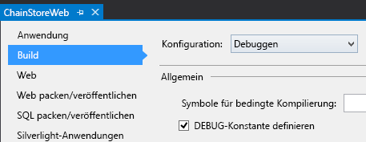
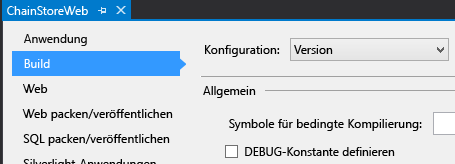

# Behandeln von Listenelementereignissen im vom Anbieter gehosteten Add-In
Erfahren Sie, wie Sie Listenelementereignisse in einem vom Anbieter gehosteten SharePoint-Add-In verarbeiten.
Dies ist der zehnte einer Reihe von Artikeln über die Grundlagen der Entwicklung von vom Anbieter gehosteten SharePoint-Add-Ins. Machen Sie sich zunächst mit  [SharePoint-Add-Ins](sharepoint-add-ins.md) und den vorherigen Artikeln dieser Reihe vertraut:
  
    
    


-  [Erste Schritte beim Erstellen von von einem Anbieter gehosteten SharePoint-Add-Ins](get-started-creating-provider-hosted-sharepoint-add-ins.md)
    
  
-  [Erteilen des Aussehens und Verhaltens von SharePoint für Ihr vom Anbieter gehostetes Add-In](give-your-provider-hosted-add-in-the-sharepoint-look-and-feel.md)
    
  
-  [Einfügen einer benutzerdefinierten Schaltfläche in das vom Anbieter gehostete Add-In](include-a-custom-button-in-the-provider-hosted-add-in.md)
    
  
-  [Schnelle Übersicht über das SharePoint-Objektmodell](get-a-quick-overview-of-the-sharepoint-object-model.md)
    
  
-  [Hinzufügen von SharePoint-Schreibvorgängen zum vom Anbieter gehosteten Add-In](add-sharepoint-write-operations-to-the-provider-hosted-add-in.md)
    
  
-  [Einfügen eines Add-In-Webparts in das vom Anbieter gehostete Add-In](include-an-add-in-part-in-the-provider-hosted-add-in.md)
    
  
-  [Behandeln von Add-In-Ereignissen im vom Anbieter gehosteten Add-In](handle-add-in-events-in-the-provider-hosted-add-in.md)
    
  
-  [Hinzufügen der Logik für die erste Ausführung zum vom Anbieter gehosteten Add-In](add-first-run-logic-to-the-provider-hosted-add-in.md)
    
  
-  [Programmgesteuerte Bereitstellung einer benutzerdefinierten Schaltfläche im vom Anbieter gehosteten Add-In](programmatically-deploy-a-custom-button-in-the-provider-hosted-add-in.md)
    
  

> **HINWEIS**
> Wenn Sie diese Reihe zu vom Anbieter gehosteten Add-Ins durchgearbeitet haben, haben Sie eine Visual Studio-Projektmappe, die Sie verwenden können, um mit diesem Thema fortzufahren. Sie können außerdem das Repository unter  [SharePoint_Provider-hosted_Add-Ins_Tutorials](https://github.com/OfficeDev/SharePoint_Provider-hosted_Add-ins_Tutorials) herunterladen und die Datei „BeforeRER.sln" öffnen.
  
    
    

Sie haben in einem früheren Artikel dieser Reihe gesehen, dass ein platzierter Auftrag in die Tabelle **Aufträge** in der Unternehmensdatenbank eingefügt und automatisch ein Element für den Auftrag der Liste **Erwartete Lieferungen** hingefügt wird. Wenn die Lieferung im lokalen Geschäft ankommt, legt ein Benutzer die Spalte **Angekommen** auf **Ja** fest. Wenn ein Feldwert für ein Element geändert wird, wird ein Ereignis für aktualisierte Elemente erstellt, für das Sie einen benutzerdefinierten Handler hinzufügen können. In diesem Artikel erstellen Sie einen Handler für dieses Listenelementereignis und stellen ihn dann programmgesteuert in der zuerst ausgeführten Logik des SharePoint-Add-Ins bereit. Der Handler fügt das Element in die Tabelle **Bestand** in der Unternehmensdatenbank hinzu. Dann wird die Spalte **Zu Bestand hinzugefügt** der Liste **Erwartete Lieferungen** auf **Ja** festgelegt. Sie erfahren auch, wie Sie verhindern, dass dieses zweite Ereignis für aktualisierte Elemente eine unendliche Reihe von Ereignissen für aktualisierte Elemente auslöst.
## Programmgesteuerte Bereitstellung der Liste „Erwartete Lieferungen"


> **HINWEIS**
> Die Einstellungen für Startprojekte in Visual Studio werden normalerweise auf die Standardwerte zurückgesetzt, wann immer die Projektmappe erneut geöffnet wird. Führen Sie die folgenden Schritte immer unmittelbar nach dem erneuten Öffnen der Beispielprojektmappe in dieser Artikelreihe durch: 
  
    
    


1. Öffnen Sie im **Projektmappen-Explorer** die Datei „Utilities\\SharePointComponentDeployer.cs" im Projekt **ChainStoreWeb**. Fügen Sie die folgende Methode zur Klasse  `SharePointComponentDeployer` hinzu. Dieser Code führt keine Funktionen ein, die Sie nicht bereits in einem vorherigen Artikel dieser Reihe gesehen haben, aber beachten Sie Folgendes:
    
  - Das Attribut **Required** des Felds **Menge** wird auf **TRUE** festgelegt, sodass das Feld immer einen Wert enthalten muss. Der Standardwert wird dann auf 1 festgelegt.
    
  
  - Die Felder **Angekommen** und **Zu Bestand hinzugefügt** sind im Formular für ein neues Element ausgeblendet.
    
  
  - Im Idealfall wäre das Feld **Zu Bestand hinzugefügt** ebenfalls auf dem Formular zum Bearbeiten des Elements ausgeblendet, da es nur auf **Ja** geändert werden sollte, wenn der der Ereignishandler für aktualisierte Elemente das Element erstmals zur Unternehmenstabelle **Bestand** hinzufügt. Aus technischen Gründen, die in einem späteren Schritt erläutert werden, muss ein Feld im Formular zum Bearbeiten des Elements angezeigt werden, wenn in einem Ereignishandler für aktualisierte Elemente programmgesteuert an das Element geschrieben werden soll.
    
  

  ```cs
  
private static void CreateExpectedShipmentsList()
 {
    using (var clientContext = sPContext.CreateUserClientContextForSPHost())
    {
        var query = from list in clientContext.Web.Lists
                    where list.Title == "Expected Shipments"
                    select list;
        IEnumerable<List> matchingLists = clientContext.LoadQuery(query);
        clientContext.ExecuteQuery();
                   
        if (matchingLists.Count() == 0)
        {
                ListCreationInformation listInfo = new ListCreationInformation();
                listInfo.Title = "Expected Shipments";
                listInfo.TemplateType = (int)ListTemplateType.GenericList;
                listInfo.Url = "Lists/ExpectedShipments";
                List expectedShipmentsList = clientContext.Web.Lists.Add(listInfo);

                Field field = expectedShipmentsList.Fields.GetByInternalNameOrTitle("Title");
                field.Title = "Product";
                field.Update();

                expectedShipmentsList.Fields.AddFieldAsXml("<Field DisplayName='Supplier'" 
                                                            + " Type='Text' />", 
                                                            true,
                                                            AddFieldOptions.DefaultValue);
                expectedShipmentsList.Fields.AddFieldAsXml("<Field DisplayName='Quantity'" 
                                                            + " Type='Number'" 
                                                            + " Required='TRUE' >" 
                                                            + "<Default>1</Default></Field>",
                                                            true, 
                                                            AddFieldOptions.DefaultValue);
                expectedShipmentsList.Fields.AddFieldAsXml("<Field DisplayName='Arrived'" 
                                                           + " Type='Boolean'"
                                                           + " ShowInNewForm='FALSE'>"
                                                           + "<Default>FALSE</Default></Field>",
                                                            true, 
                                                            AddFieldOptions.DefaultValue);
                expectedShipmentsList.Fields.AddFieldAsXml("<Field DisplayName='Added to Inventory'" 
                                                            + " Type='Boolean'" 
                                                            + " ShowInNewForm='FALSE'>"
                                                            + "<Default>FALSE</Default></Field>", 
                                                            true, 
                                                            AddFieldOptions.DefaultValue);

                clientContext.ExecuteQuery();
        }
     }
 }
  ```

2. Fügen Sie in der Methode  `DeployChainStoreComponentsToHostWeb` die folgende Zeile direkt über der Zeile `RemoteTenantVersion = localTenantVersion` hinzu.
    
  ```
  
CreateExpectedShipmentsList();
  ```


## Erstellen des Listenelement-Ereignisempfängers


> **HINWEIS**
> Wenn Sie in diese Reihe von Artikeln durchgearbeitet haben, haben Sie Ihre Entwicklungsumgebung für das Debuggen von Remoteereignisempfängern bereits konfiguriert. Wenn Sie dies nicht getan haben, lesen Sie zuerst  [Konfigurieren der Projektmappe für das Debuggen des Ereignisempfängers](handle-add-in-events-in-the-provider-hosted-add-in.md#RERDebug), bevor Sie in diesem Thema fortfahren. 
  
    
    

Die Office-Entwicklertools für Visual Studio enthalten ein **Remoteereignisempfänger**-Element, das einer SharePoint-Add-In-Projektmappe hinzugefügt werden kann. Zum Zeitpunkt des Verfassens dieses Artikels nimmt dieses Projektelement jedoch an, dass sich die Liste (mit der der Empfänger registriert wird) im Add-In-Web befindet, und deshalb erstellen die Tools ein Add-In-Web und einige SharePoint-Artefakte darin. Aber der Empfänger des ChainStore-Add-Ins wird (in einem späteren Schritt) für die Liste **Erwartete Lieferungen** im Hostweb registriert, sodass das Add-In kein Add-In-Web benötigt. (Eine Wiederholung zum Unterschied zwischen der Add-In-Webs und Hostwebs finden Sie unter [SharePoint-Add-Ins](sharepoint-add-ins.md).)
  
    
    

> **HINWEIS**
> Listen- und Listenelement-Ereignisempfänger heißen Remoteereignisempfänger (RER), da sich ihr Code remote von SharePoint in der Cloud oder auf einem lokalen Server außerhalb der SharePoint-Farm befindet. Allerdings befinden sich die Ereignisse, die diese auslösen, in SharePoint.
  
    
    


1. Klicken Sie im **Projektmappen-Explorer** mit der rechten Maustaste auf den Ordner **Dienste** im **ChainStoreWeb**-Projekt, und wählen Sie **Hinzufügen | WCF-Dienst** aus.
    
  
2. Wenn Sie aufgefordert werden, nennen Sie den Dienst RemoteEventReceiver1, und klicken Sie dann auf **OK**. 
    
  
3. Die Tools erstellen eine Schnittstellendatei, eine *.svc-Datei und eine CodeBehind-Datei. Da die Schnittstellendatei „IRemoteEventReceiver1.cs" nicht benötigt wird, können Sie diese löschen. (Die Tools haben sie möglicherweise automatisch geöffnet. Wenn dies der Fall ist, schließen und löschen Sie die Datei.)
    
    > **HINWEIS**
      > Bei der Erstellung der Add-In-Ereignisempfänger für die Ereignisse „Installiert" und „Deinstallieren" in einem früheren Artikel dieser Reihe, haben die Office-Entwicklertools für Visual Studio ihre URLs zur Add-In-Manifest-Datei hinzugefügt. Listen- und Listenelement-Ereignisempfänger sind nicht im Add-In-Manifest registriert. Stattdessen werden sie (in einem vom Anbieter gehosteten Add-In) programmgesteuert registriert. Dies führen Sie in einem späteren Schritt durch. 
4. Öffnen Sie die CodeBehind-Datei: RemoteEventReceiver1.svc.cs. Ersetzen sie den gesamten Inhalt durch den folgenden Code. Beachten Sie Folgendes bei diesem Code:
    
  - Die Schnittstelle  `IRemoteEventService` ist im Namespace **Microsoft.SharePoint.Client.EventReceivers** definiert.
    
  
  - Im ChainStore-Add-In werden keine „Bevor"-Ereignisse verarbeitet, aber die Methode **ProcessEvent** ist für die Schnittstelle `IRemoteEventService` erforderlich.
    
  

  ```cs
  using System;
using System.Collections.Generic;
using Microsoft.SharePoint.Client;
using Microsoft.SharePoint.Client.EventReceivers;
using System.Data.SqlClient;
using System.Data;
using ChainStoreWeb.Utilities;

namespace ChainStoreWeb.Services
{
    public class RemoteEventReceiver1 : IRemoteEventService
    {
        /// <summary>
        /// Handles events that occur before an action occurs, 
        /// such as when a user is adding or deleting a list item.
        /// </summary>
        /// <param name="properties">Holds information about the remote event.</param>
        /// <returns>Holds information returned from the remote event.</returns>
        public SPRemoteEventResult ProcessEvent(SPRemoteEventProperties properties)
        {
            throw new NotImplementedException();
        }

        /// <summary>
        /// Handles events that occur after an action occurs, 
        /// such as after a user adds an item to a list or deletes an item from a list.
        /// </summary>
        /// <param name="properties">Holds information about the remote event.</param>
        public void ProcessOneWayEvent(SPRemoteEventProperties properties)
        {

        }
    }
}
  ```

5. Fügen Sie den folgenden Code zur Methode  `ProcessOneWayEvent` hinzu. Beachten Sie, dass das Ereignis **ItemUpdated** das einzige ist, das in diesem Beispiel verarbeitet wird. Wir hätten also eine einfache **if**-Struktur anstelle einer **switch**-Struktur verwenden können. Aber da Ereignisempfänger normalerweise mehrere Ereignisse verarbeiten, sollten Sie das Muster sehen können, das Sie am häufigsten in Ihren Ereignishandlern als SharePoint-Add-In-Entwickler verwenden.
    
  ```cs
  
switch (properties.EventType)
{
    case SPRemoteEventType.ItemUpdated:

        // TODO12: Handle the item updated event.
                    
        break;
}  
  ```

6. Ersetzen Sie  `TODO12` durch den folgenden Code. Auch hier verwenden wir eine **switch**-Struktur, obwohl eine einfache **if**-Struktur ausreiched wäre, da Sie das typische Muster in SharePoint-Ereignisempfängern sehen sollen.
    
  ```cs
  
switch (properties.ItemEventProperties.ListTitle)
{
    case "Expected Shipments":

        // TODO13: Handle the arrival of a shipment.

        break;
}
  ```

7. Der Code, der auf den Empfang einer Lieferung reagiert, sollte zwei Dinge tun:
    
  - Hinzufügen des im Geschäft angekommenen Elements zum Unternehmensbestand
    
  
  - Festlegen des Feld **Zu Bestand hinzugefügt** in der Liste **Erwartete Lieferungen** auf **Ja**. Aber dies sollte nur geschehen, wenn das Element erfolgreich zum Bestand hinzugefügt wurde.
    
  

    Fügen Sie den folgenden Code anstelle von  `TODO13` hinzu. Die beiden Methoden `TryUpdateInventory` und `RecordInventoryUpdateLocally` werden in späteren Schritten erstellt.
    


  ```cs
  
bool updateComplete = TryUpdateInventory(properties);
if (updateComplete)
{
    RecordInventoryUpdateLocally(properties);
}
  ```


    Die Methode  `ProcessOneWayEvent` sollte jetzt wie folgt aussehen:
    


  ```cs
  
public void ProcessOneWayEvent(SPRemoteEventProperties properties)
{
    switch (properties.EventType)
    {
        case SPRemoteEventType.ItemUpdated:

            switch (properties.ItemEventProperties.ListTitle)
            {
                case "Expected Shipments":
                    bool updateComplete = UpdateInventory(properties);
                    if (updateComplete)
                    {
                        RecordInventoryUpdateLocally(properties);
                    }
                    break;
            }
            break;
    }          
}
  ```

8. Fügen Sie die folgende Methode zur Klasse  `RemoteEventReceiver1` hinzu.
    
  ```cs
  
private bool TryUpdateInventory(SPRemoteEventProperties properties)
{
    bool successFlag = false;

        // TODO14: Test whether the list item is changing because the product has arrived
        // or for some other reason. If the former, add it to the inventory and set the success flag
        // to true.     

    return successFlag;
}
  ```

9. Es gibt fünf Spalten in der Liste **Erwartete Lieferungen**, aber wir möchten, dass der Ereignishandler auf die meisten Arten von Updates für ein Element nicht reagiert. Wenn ein Benutzer beispielsweise die Schreibweise des Namens eines Lieferanten korrigiert, wird das Ereignis für aktualisierte Elemente ausgelöst, aber unser Handler sollte keine Aktion ausführen. Der Handler sollte nur reagieren, wenn das Feld **Angekommen** gerade auf **Ja** festgelegt wurde.
    
    Es gibt eine weitere Bedingung, die getestet werden muss. Nehmen Sie an, **Angekommen** wird auf **Ja** festgelegt und das Produkt im Element wird zum Bestand hinzugefügt (und **Zu Bestand hinzugefügt** wird auf **Ja** festgelegt). Aber später ändert ein Benutzer versehentlich das Feld **Angekommen** einer Lieferung zurück auf **Nein** und korrigiert dann seinen Fehler, indem er es wieder auf **Angekommen** festlegt. Der Fehler und die Korrektur lösen das Ereignis für aktualisierte Ereignisse aus. Der Handler reagiert nicht auf den Fehler, da er nur reagiert, wenn **Angekommen** auf **Ja** festgelegt ist, er reagiert jedoch auf die Korrektur, bei der **Angekommen** zurück auf **Ja** festgelegt wird, was bedeutet, dass dasselbe Produkt und dieselbe Menge ein zweites Mal zum Bestand hinzugefügt werden. Aus diesem Grund sollte der Handler nur reagieren, wenn für **Zu Bestand hinzugefügt** der Wert **Nein** festgelegt ist.
    
    Der Handler muss also wissen, welche Werte diese Felder enthalten, direkt nachdem der Benutzer das Element aktualisiert hat. Das Objekt **SPRemoteEventProperties** verfügt über eine **ItemEventProperties**-Eigenschaft. Und es hat wiederum eine indizierte **AfterProperties**-Eigenschaft, die Werte der Felder im aktualisierten Element enthält. Der folgende Code verwendet diese Eigenschaften, um zu testen, ob der Handler reagieren soll. Setzen dies anstelle von  `TODO14`.
    


  ```cs
  
var arrived = Convert.ToBoolean(properties.ItemEventProperties.AfterProperties["Arrived"]);
var addedToInventory = Convert.ToBoolean(properties.ItemEventProperties.AfterProperties["Added_x0020_to_x0020_Inventory"]);

if (arrived &amp;&amp; !addedToInventory)
{

    // TODO15: Add the item to inventory

    successFlag = true;
}
  ```

10. Ersetzen Sie  `TODO15` durch den folgenden Code. Da es sich hierbei hauptsächlich um SQL- und ASP.NET-Programmierung handelt, wird es nicht ausführlich besprochen, aber beachten Sie Folgendes:
    
  - Wir verwenden die Eigenschaft **ItemEventProperties.WebUrl**, um den Mandantennamen abzurufen, der der Hostweb-URL entspricht.
    
  
  - Wir verwenden erneut **AfterProperties**, um die Werte für Produktname und Menge abzurufen.
    
  
  - Wir bezeichnen das Produktnamensfeld als „Titel", obwohl der Anzeigename auf „Produkt" geändert wurde (in der Methode  `CreateExpectedShipmentsList`), da auf Felder immer mit den internen Namen verwiesen wird.
    
  

  ```cs
  
using (SqlConnection conn = SQLAzureUtilities.GetActiveSqlConnection())
using (SqlCommand cmd = conn.CreateCommand())
{
    conn.Open();
    cmd.CommandText = "UpdateInventory";
    cmd.CommandType = CommandType.StoredProcedure;
    SqlParameter tenant = cmd.Parameters.Add("@Tenant", SqlDbType.NVarChar);
    tenant.Value = properties.ItemEventProperties.WebUrl + "/";
    SqlParameter product = cmd.Parameters.Add("@ItemName", SqlDbType.NVarChar, 50);
    product.Value = properties.ItemEventProperties.AfterProperties["Title"]; // not "Product"
    SqlParameter quantity = cmd.Parameters.Add("@Quantity", SqlDbType.SmallInt);
    quantity.Value = Convert.ToUInt16(properties.ItemEventProperties.AfterProperties["Quantity"]);
    cmd.ExecuteNonQuery();
}
  ```


    Wir sind noch nicht fertig mit der Methode  `TryUpdateInventory`, aber an diesem Punkt sollte sie wie folgt aussehen.
    


  ```cs
  
private bool TryUpdateInventory(SPRemoteEventProperties properties)
{
    bool successFlag = false;

    var arrived = Convert.ToBoolean(properties.ItemEventProperties.AfterProperties["Arrived"]);
    var addedToInventory = Convert.ToBoolean(properties.ItemEventProperties.AfterProperties["Added_x0020_to_x0020_Inventory"]);

    if (arrived &amp;&amp; !addedToInventory)
    {
        using (SqlConnection conn = SQLAzureUtilities.GetActiveSqlConnection())
        using (SqlCommand cmd = conn.CreateCommand())
        {
            conn.Open();
            cmd.CommandText = "UpdateInventory";
            cmd.CommandType = CommandType.StoredProcedure;
            SqlParameter tenant = cmd.Parameters.Add("@Tenant", SqlDbType.NVarChar);
            tenant.Value = properties.ItemEventProperties.WebUrl + "/";
            SqlParameter product = cmd.Parameters.Add("@ItemName", SqlDbType.NVarChar, 50);
            product.Value = properties.ItemEventProperties.AfterProperties["Title"]; // not "Product"
            SqlParameter quantity = cmd.Parameters.Add("@Quantity", SqlDbType.SmallInt);
            quantity.Value = Convert.ToUInt16(properties.ItemEventProperties.AfterProperties["Quantity"]);
            cmd.ExecuteNonQuery();
        }            
        successFlag = true;
    }  
    return successFlag;
}
  ```

11. Wenn die Methode  `TryUpdateInventory` **true** zurückgibt, ruft unser Ereignishandler eine Methode auf (die noch nicht geschrieben ist), die dasselbe Element in der Liste **Erwartete Lieferungen** aktualisiert, indem das Feld **Zu Bestand hinzugefügt** auf **Ja** festgelegt wird. Da dies selbst ein Ereignis zum Aktualisieren von Elementen ist, wird der Handler erneut aufgerufen. (Die Tatsache, das das Feld **Zu Bestand hinzugefügt** jetzt auf **Ja** festgelegt ist, verhindert, dass der Handler dieselbe Lieferung ein zweites Mal zum Bestand hinzufügt, aber der Handler wird dennoch aufgerufen.)
    
    Aber SharePoint verhält sich ein wenig anders, wenn das Ereignis für aktualisierte Elemente durch eine programmgesteuerte Aktualisierung ausgelöst wird:  *es schließt nur die Felder in **AfterProperties** ein, die bei der Aktualisierung geändert wurden.*  Das heißt, dass das Feld **Angekommen** nicht vorhanden ist, da nur das Feld **Zu Bestand hinzugefügt** geändert wurde. Die Zeile --
    
     `var arrived = Convert.ToBoolean(properties.ItemEventProperties.AfterProperties["Arrived"]);`
    
     -- löst eine **KeyNotFoundException** aus.
    
    Es gibt mehrere Möglichkeiten zur Behebung dieses Problems. In diesem Beispiel fangen wir die Ausnahme ab und verwenden den **catch**-Block, um sicherzustellen, dass  `successFlag` auf **false** festgelegt ist. Dadurch wird sichergestellt, dass das Element nicht ein drittes Mal aktualisiert wird.
    
    Setzen alles, was sich in der Methode zwischen der ersten Zeile,  `bool successFlag = false;`, und der letzten Zeile  `return successFlag;` befindet, in einen **try**-Block.
    
  
12. Fügen Sie den folgenden **catch**-Block direkt unterhalb des **try**-Blocks hinzu.
    
  ```cs
  
catch (KeyNotFoundException)
{
    successFlag = false;
}
  ```


    > **HINWEIS**
      > Die **KeyNotFoundException** ist auch der Grund, warum das Feld **Zu Bestand hinzugefügt** im Formular zum Bearbeiten des Elements sichtbar sein muss. SharePoint enthält keine Felder, die auf dem Formular zum Bearbeiten in **AfterProperties** ausgeblendet sind.

    Die gesamte Methode sollte jetzt wie folgt aussehen.
    


  ```cs
  
private bool TryUpdateInventory(SPRemoteEventProperties properties)
{
    bool successFlag = false;
    
    try 
    {
        var arrived = Convert.ToBoolean(properties.ItemEventProperties.AfterProperties["Arrived"]);
        var addedToInventory = Convert.ToBoolean(properties.ItemEventProperties.AfterProperties["Added_x0020_to_x0020_Inventory"]);

        if (arrived &amp;&amp; !addedToInventory)
        {
            using (SqlConnection conn = SQLAzureUtilities.GetActiveSqlConnection())
            using (SqlCommand cmd = conn.CreateCommand())
            {
                conn.Open();
                cmd.CommandText = "UpdateInventory";
                cmd.CommandType = CommandType.StoredProcedure;
                SqlParameter tenant = cmd.Parameters.Add("@Tenant", SqlDbType.NVarChar);
                tenant.Value = properties.ItemEventProperties.WebUrl + "/";
                SqlParameter product = cmd.Parameters.Add("@ItemName", SqlDbType.NVarChar, 50);
                product.Value = properties.ItemEventProperties.AfterProperties["Title"]; // not "Product"
                SqlParameter quantity = cmd.Parameters.Add("@Quantity", SqlDbType.SmallInt);
                quantity.Value = Convert.ToUInt16(properties.ItemEventProperties.AfterProperties["Quantity"]);
                cmd.ExecuteNonQuery();
            }            
            successFlag = true;
        }  
    }
    catch (KeyNotFoundException)
    {
        successFlag = false;
    }
    return successFlag;
}
  ```

13. Fügen Sie die folgende Methode zur Klasse  `RemoteEventReceiver1` hinzu. An diesem Punkt ist das Codemuster aus früheren Artikeln dieser Reihe vertraut. Beachten Sie jedoch einen Unterschied. Der Code ruft das Objekt **ClientContext** durch Aufrufen der Methode **TokenHelper.CreateRemoteEventReceiverClientContext** anstellte der Methode **SharePointContext.CreateUserClientContextForSPHost** ab, die wir in Code verwendet haben, der Aufrufe an SharePoint von Seiten wie der EmployeeAdder-Seite durchgeführt hat. Der Hauptgrund für die Verwendung verschiedener Methoden zum Abrufen eines **ClientContext**-Objekts ist, dass SharePoint die für das Erstellen solcher Objekte erforderlichen Informationen anders an Ereignisempfänger als an Seiten übergibt. Für Ereignisempfänger wird ein **SPRemoteEventProperties**-Objekt übergeben, aber für Seiten wird ein spezielles Feld namens Kontexttoken im Hauptteil der Anforderung übergeben, die die Add-In-Seite startet.
    
  ```cs
  
private void RecordInventoryUpdateLocally(SPRemoteEventProperties properties)
{
    using (ClientContext clientContext = TokenHelper.CreateRemoteEventReceiverClientContext(properties))
    {
        List expectedShipmentslist = clientContext.Web.Lists.GetByTitle(properties.ItemEventProperties.ListTitle);
        ListItem arrivedItem = expectedShipmentslist.GetItemById(properties.ItemEventProperties.ListItemId);
        arrivedItem["Added_x0020_to_x0020_Inventory"] = true;
        arrivedItem.Update();
        clientContext.ExecuteQuery();
    }
}
  ```

14. Speichern und schließen Sie die Empfängercodedatei.
    
  

## Registrieren des Empfängers

Die letzte Aufgabe besteht darin, SharePoint mitzuteilen, dass wir einen benutzerdefinierten Empfänger haben, den SharePoint immer dann aufrufen soll, wenn ein Element in der Liste **Erwartete Lieferungen** aktualisiert wird.
  
    
    

1. Öffnen Sie die Datei „SharePointContentDeployer.cs", und fügen Sie die folgende Zeile zur Methode  `DeployChainStoreComponentsToHostWeb` direkt unterhalb der Zeile hinzu, die die Liste **Erwartete Lieferungen** erstellt. Diese Methode wird im nächsten Schritt hinzugefügt. Beachten Sie, dass das Objekt **HttpRequest** zur der Methode hinzugefügt wird, das die Add-In-Startseite an die Methode `DeployChainStoreComponentsToHostWeb` übergeben hat.
    
  ```cs
  
RegisterExpectedShipmentsEventHandler(request);
  ```

2. Fügen Sie die folgende Methode zur Klasse  `SharePointComponentDeployer` hinzu.
    
  ```cs
  private static void RegisterExpectedShipmentsEventHandler(HttpRequest request)
{
    using (var clientContext = sPContext.CreateUserClientContextForSPHost())    
    {
        var query = from list in clientContext.Web.Lists
                    where list.Title == "Expected Shipments"
                    select list;
        IEnumerable<List> matchingLists = clientContext.LoadQuery(query);
        clientContext.ExecuteQuery();

        List expectedShipmentsList = matchingLists.Single();

        // TODO16: Add the event receiver to the list's collection of event receivers.       

        clientContext.ExecuteQuery();
    }
}
  ```

3. Ersetzen Sie  `TODO16` mit den folgenden Zeilen. Beachten Sie, dass es eine leichte ***CreationInformation**-Klasse für Ereignisempfänger ebenso wie für Listen und Listenelemente gibt. 
    
  ```cs
  
EventReceiverDefinitionCreationInformation receiver = new EventReceiverDefinitionCreationInformation();
receiver.ReceiverName = "ExpectedShipmentsItemUpdated";
receiver.EventType = EventReceiverType.ItemUpdated;

 // TODO17: Set the URL of the receiver.

expectedShipmentsList.EventReceivers.Add(receiver);

  ```

4. Jetzt müssen Sie SharePoint die URL des Ereignisempfängers mitteilen. In der Produktion ist das dieselbe Domäne wie die Remoteseiten mit dem Pfad /Services/RemoteEventReceiver1.svc. Da der Handler in der zuerst ausgeführten Logik auf der Startseite des Add-Ins registriert wird, befindet sich die Domäne im Hostheader des Objekts **HttpRequest** für die Anforderung, die die Seite aufgerufen hat. Unser Code hat dieses Objekt von der Seite an die Methode `DeployChainStoreComponentsToHostWeb` übergeben, die es wiederum selbst an die Methode `RegisterExpectedShipmentsEventHandler` übergeben hat. So können wir die Empfänger-URL mit dem folgenden Code festlegen.
    
     `receiver.ReceiverUrl = "https://" + request.Headers["Host"] + "/Services/RemoteEventReceiver1.svc";`
    
    Leider funktioniert das nicht, wenn Sie das Add-In von Visual Studio debuggen. Beim Debuggen wird der Empfänger in Azure Service Bus und nicht in der Localhost-URL gehostet, in der die Remoteseiten gehostet werden. Wir müssen verschiedene URLs für den Empfänger festlegen, je nachdem, ob wir debuggen oder nicht. Ersetzen Sie deshalb  `TODO17` mit der folgenden Struktur, die C#-Compilerdirektiven verwendet. Beachten Sie, dass im Debugmodus die URL des Empfängers aus einer web.config-Einstellung gelesen wird. *Sie erstellen diese Einstellung in einem späteren Schritt.* 
    


  ```cs
  
#if DEBUG
                    receiver.ReceiverUrl = WebConfigurationManager.AppSettings["RERdebuggingServiceBusUrl"].ToString();
#else
                    receiver.ReceiverUrl = "https://" + request.Headers["Host"] + "/Services/RemoteEventReceiver1.svc"; 
#endif

  ```


    Die gesamte  `RegisterExpectedShipmentsEventHandler`-Methode sollte jetzt wie folgt aussehen.
    


  ```cs
  
private static void RegisterExpectedShipmentsEventHandler(HttpRequest request)
{    
    using (var clientContext = sPContext.CreateUserClientContextForSPHost())
    {
        var query = from list in clientContext.Web.Lists
		            where list.Title == "Expected Shipments"
		            select list;
        IEnumerable<List> matchingLists = clientContext.LoadQuery(query);
        clientContext.ExecuteQuery();

        List expectedShipmentsList = matchingLists.Single();

        EventReceiverDefinitionCreationInformation receiver = new EventReceiverDefinitionCreationInformation();
        receiver.ReceiverName = "ExpectedShipmentsItemUpdated";
        receiver.EventType = EventReceiverType.ItemUpdated;

#if DEBUG
        receiver.ReceiverUrl = WebConfigurationManager.AppSettings["RERdebuggingServiceBusUrl"].ToString();
#else
        receiver.ReceiverUrl = "https://" + request.Headers["Host"] + "/Services/RemoteEventReceiver1.svc"; 
#endif
        expectedShipmentsList.EventReceivers.Add(receiver);
        clientContext.ExecuteQuery();
    }
}
  ```

5. Fügen Sie die folgenden **using**-Anweisung an den Anfang der Datei hinzu.
    
  ```cs
  
using System.Web.Configuration;
  ```

6. Um sicherzustellen, dass  `DEBUG` wahr ist, wenn und nur wenn das Add-In gedebuggt wird, führen Sie die folgende Unterprozedur durch:
    
1. Klicken Sie im **Projektmappen-Explorer** mit der rechten Maustaste auf das Projekt **ChainStoreWeb**, und wählen Sie **Eigenschaften** aus.
    
  
2. Öffnen Sie die Registerkarte **Erstellen** der **Eigenschaften**, und wählen Sie dann **Debuggen** aus der Dropdownliste **Konfiguration** im oberen Bereich aus.
    
  
3. Stellen Sie sicher, dass das Kontrollkästchen **DEBUG-Konstante definieren** aktiviert ist. (Das ist standardmäßig normalerweise der Fall.) Der folgende Screenshot zeigt die richtige Einstellung.
    
     
  

  

  
4. Ändern Sie die Dropdownlinste **Konfiguration** auf **Version**, und stellen Sie sicher, dass das Kontrollkästchen **DEBUG-Konstante definieren** ** *nicht* ** aktiviert ist. (Standardmäßig ist es normalerweise nicht aktiviert.) Der folgende Screenshot zeigt die richtige Einstellung.
    
     
  

  

  
5. Wenn Sie Änderungen vorgenommen haben, speichern Sie diese, und schließen Sie dann die Registerkarte **Eigenschaften**.
    
  
7. Öffnen Sie die Datei „Web.config", und fügen Sie das folgende Markup als untergeordnetes Element des Elements **appSettings** hinzu. Der Wert der Einstellung wird im nächsten Abschnitt abgerufen.
    
  ```XML
  <add key="RERdebuggingServiceBusUrl" value="" />
  ```


## Abrufen der Empfänger-URL für das Debuggen

Die Add-In-Ereignis- und -Listenelement Ereignisempfänger sind Windows Communication Service (WCF)-Dienste und jeder WCF-Dienst kennt seinen eigenen Endpunkt und speichert ihn an mehreren Orten, darunter das Objekt **System.ServiceModel.OperationContext.Current.Channel.LocalAddress.Uri**. Beim Debuggen wird der Add-In-Empfänger in einem Azure Service Bus-Endpunkt gehostet, was nahezu identisch mit dem Endpunkt für den Listenelementempfänger ist. Der Unterschied besteht darin, dass die URL des Add-In-Endpunkts mit „AppEventReceiver.svc" endet, die Listenelementempfänger-URL jedoch mit „RemoteEventReceiver1.svc". Damit die URL des Endpunkts im Add-In-Empfänger abgerufen werden kann, nehmen Sie eine kleine Änderung am Ende vor, und verwenden Sie sie dann als Wert für die web.config- **RERdebuggingServiceBusUrl**-Einstellung.
  
    
    

1. Öffnen Sie die Datei „AppEventReceiver.svc.cs" im Ordner **Dienste** des Projekts **ChainStoreWeb**.
    
  
2. Fügen Sie Folgendes als erste Zeile in der Methode **ProcessEvent** hinzu.
    
  ```cs
  string debugEndpoint = System.ServiceModel.OperationContext.Current.Channel.LocalAddress.Uri.ToString(); 
  ```

3. Fügen Sie einen Haltepunkt in der nächsten Zeile der Methode hinzu.
    
  
4. Drücken Sie F5, um das Add-In zu debuggen. Da web.config geöffnet ist und Office-Entwicklertools für Visual Studio jedes Mal eine Einstellung darin ändert, wenn Sie F5 drücken, werden Sie aufgefordert, sie neu zu laden. Wählen Sie **Ja** aus.
    
  
5. Wenn der Haltepunkt erreicht ist, bewegen Sie den Cursor über die Variable  `debugEndpoint`. Wenn der Visual Studio-Datentipp angezeigt wird, klicken Sie auf den Pfeil nach unten, und wählen Sie **Text-Schnellansicht** aus.
    
     
  

  

  
6. Kopieren Sie den Zeichenfolgenwert aus der Schnellansicht und fügen Sie ihn an einer beliebigen Stelle ein.
    
  
7. Schließen Sie die Schnellansicht, und beenden Sie das Debuggen in Visual Studio.
    
  
8. Löschen Sie die Zeile, die Sie im zweiten Schritt dieses Verfahrens hinzugefügt haben, oder kommentieren Sie die Zeile aus, und löschen Sie auch den Haltepunkt.
    
  
9. Ersetzen Sie in der Zeichenfolge, die Sie kopiert haben, „AppEventReceiver.svc" am Ende durch „RemoteEventReceiver1.svc".
    
  
10. Kopieren Sie die geänderte URL und fügen Sie sie als Wert für den Schlüssel **RERdebuggingServiceBusUrl** in der web.config-Datei ein.
    
  

> **HINWEIS**
>  Das manuelle Kopieren und Einfügen der Servicebus-URL (einer modifizierten Version davon) in die web.config-Datei ist nicht die einzige Möglichkeit für den Umgang mit der Notwendigkeit einer anderen URL beim Debuggen eines Remoteereignisempfängers, wenn dieser in der Produktion ausgeführt wird.>  Wir könnten den Wert von **System.ServiceModel.OperationContext.Current.Channel.LocalAddress.Uri** programmgesteuert an einer beliebigen Stelle in SharePoint oder der Remotedatenbank speichern und ihn dann vom zuerst ausgeführten Code lesen und der Eigenschaft `receiver.ReceiverUrl` zuweisen lassen.>  Der Listenelement-Ereignisempfänger könnte als Teil des installierten Add-In-Ereignishandlers registriert werden. Dann könnte **System.ServiceModel.OperationContext.Current.Channel.LocalAddress.Uri** programmgesteuert gelesen, geändert und zu `receiver.ReceiverUrl` hinzugefügt werden, ohne irgendwo gespeichert werden zu müssen. Diese Strategie würde erfordern, dass die Liste **Erwartete Lieferungen** ebenfalls im installierten Add-In-Ereignishandler erstellt wird, da sie vorhanden sein müsste, bevor der Handler bei ihr registriert werden kann. (Beachten Sie außerdem, dass der Add-In-Ereignisempfänger und der Listenelement-Ereignisempfänger in einem einzigen Empfänger kombinieren werden kann (d. h. in denselben .svc- und svc.cs-Dateien). In diesem Fall ist keine Änderung der URL erforderlich, bevor sie als Wert für `receiver.ReceiverUrl` verwendet wird.)
  
    
    


## Ausführen des Add-Ins und Testen des Listenelementempfängers


  
    
    

1. Öffnen Sie die Seite **Websiteinhalte** der Website für den Hongkong-Store, *und entfernen Sie die Liste **Erwartete Lieferungen**, falls diese vorhanden ist!* 
    
  
2. Verwenden Sie die F5-TASTE, um Ihr Add-In bereitzustellen und auszuführen. Visual Studio hostet die Remotewebanwendung in IIS Express und die SQL-Datenbank in SQL Express. Außerdem wird eine temporäre Installation des Add-Ins auf Ihrer SharePoint-Testwebsite durchgeführt, und das Add-In wird sofort ausgeführt. Sie werden aufgefordert, Berechtigungen für das Add-In zu erteilen, bevor die Startseite geöffnet wird.
    
  
3. Wenn die Startseite des Add-Ins geöffnet wird, klicken Sie auf die Schaltfläche **Zurück zur Website** im Chromsteuerelement im oberen Bereich.
    
  
4. Navigieren Sie von der Startseite des Hongkong-Stores zur Seite **Websiteinhalte**, und öffnen Sie die Liste **Erwartete Lieferungen**.
    
  
5. Erstellen Sie ein Element, und beachten Sie auf dem Formular für ein neues Element, dass die Felder **Angekommen** und **Zu Bestand hinzugefügt** nicht im Formular angezeigt werden.
    
  
6. Nachdem das Element erstellt wurde, öffnen Sie es erneut zur Bearbeitung. Aktivieren Sie das Kontrollkästchen **Angekommen**, und speichern Sie das Element. Dadurch wird das Ereignis für aktualisierte Elemente ausgelöst. Das Element wird zum Bestand hinzugefügt, und der Wert des Felds **Zu Bestand hinzugefügt** ändert sich zu **Ja**. (Möglicherweise müssen Sie die Seite aktualisieren, um die Änderung an **Zu Bestand hinzugefügt** anzuzeigen.)
    
  
7. Verwenden Sie im Browser die Schaltfläche „Zurück", bis Sie wieder auf die Startseite für das ChainStore-Add-In zurückgekehrt sind, und klicken Sie dann auf die Schaltfläche **Bestand anzeigen**. Das Element, das Sie als **Angekommen** markiert haben, ist jetzt aufgelistet.
    
  
8. Navigieren Sie zurück zur Liste **Erwartete Lieferungen**, und fügen Sie ein weiteres  *-Element mit exakt demselben Produktnamen und Lieferantennamen*  , aber einer anderen Menge hinzu.
    
  
9. Nachdem das Element erstellt wurde, öffnen Sie es erneut zur Bearbeitung. Ändern Sie den Wert für **Angekommen** auf **Ja**, und speichern Sie das Element.
    
  
10. Verwenden Sie im Browser die Schaltfläche „Zurück", bis Sie wieder auf die Startseite für das ChainStore-Add-In zurückgekehrt sind, und klicken Sie dann auf die Schaltfläche **Bestand anzeigen**. Es ist immer noch nur ein Element für den Produktnamen und den Anbieter vorhanden, aber die Menge ist jetzt die Summe der zwei Elemente in der Liste **Erwartete Lieferungen**.
    
  
11. Schließen Sie zum Beenden der Debugsitzung das Browserfenster, oder beenden Sie das Debuggen in Visual Studio. Jedes Mal, wenn Sie F5 drücken, zieht Visual Studio die vorherige Version des Add-Ins zurück und installiert die neueste.
    
  
12. Da Sie mit diesem Add-In und dieser Visual Studio-Projektmappe in anderen Artikeln arbeiten werden, hat es sich bewährt, das Add-In ein letztes Mal zurückzuziehen, wenn Sie Ihre Arbeit daran für eine Weile abgeschlossen haben. Klicken Sie mit der rechten Maustaste auf das Projekt im **Projektmappen-Explorer**, und wählen Sie **Zurückziehen** aus.
    
  

## 
<a name="Nextsteps"> </a>

Unter  [Bereitstellen und Installieren von SharePoint-Add-Ins: Methoden und Optionen](deploying-and-installing-sharepoint-add-ins-methods-and-options.md) erfahren Sie, wie Sie Ihr Add-In auf ein SharePoint-Website veröffentlichen. Oder fahren Sie mit erweiterten Themen der SharePoint-Add-In-Entwicklung mit den folgenden Knoten in MSDN fort:
  
    
    

-  [Entwerfen von SharePoint-Add-Ins](design-sharepoint-add-ins.md)
    
  
-  [Entwickeln von Add-Ins für SharePoint](develop-sharepoint-add-ins.md)
    
  
-  [Veröffentlichen von SharePoint-Add-Ins](publish-sharepoint-add-ins.md)
    
  
-  [Tools und Umgebungen für die Entwicklung von Add-Ins für SharePoint](tools-and-environments-for-developing-sharepoint-add-ins.md)
    
  

