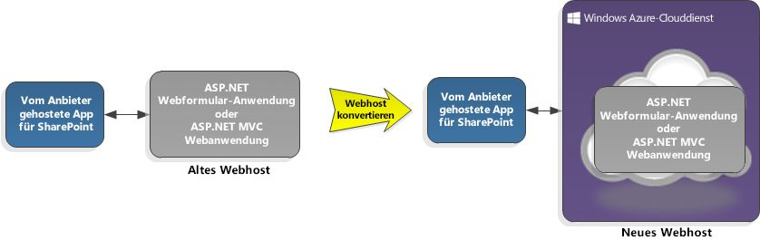

# Hosten von Add-Ins für SharePoint 2013 in einem Microsoft Azure-Cloud-Dienst
Erfahren Sie, wie Sie eine vom Anbieter gehostete SharePoint-Add-In in einem Microsoft Azure-Clouddienst anstatt einer Web-App hosten, wie Sie eine SharePoint-Add-In zu einer Azure-Webrolle hinzufügen, und warum das Hosting auf Azure möglicherweise besser ist als in einer Web-App.
 * **Gilt für:*** 

|||
|:-----|:-----|
|**In diesem Artikel**          [Voraussetzungen](#SP15createselfhostapp_bk_prereq)           [So hosten Sie eine SharePoint-Add-In in einem Azure-Clouddienst](#SP15HostAzure_bk_HowTo)           [Vorteile von Azure](#SP15HostAzure_bk_Why)           [Zusätzliche Ressourcen](#SP15Devapps_AddtionalResources)||
 

## Voraussetzungen

- Die Voraussetzungen für  [Erste Schritte beim Erstellen von von einem Anbieter gehosteten SharePoint-Add-Ins](get-started-creating-provider-hosted-sharepoint-add-ins.md).

- Das Microsoft Azure SDK für .NET (VS 2012) 1.8.1, das Sie mithilfe des  [Webplattform-Installers](http://www.microsoft.com/web/downloads/platform.aspx) installieren können.

## So hosten Sie eine SharePoint-Add-In in einem Azure-Clouddienst

### Hinzufügen eines Clouddienstes zu einem bestehenden Add-In

Wenn Sie bereits eine vom Anbieter gehostete SharePoint-Add-In haben, die Sie auf Azure hosten möchten, wählen Sie das Web-App-Projekt in der Lösung für das Add-In für SharePoint aus. Wählen Sie in der Menüleiste **Project**, **Add Microsoft Azure Cloud Service Project** aus. Ein Azure-Projekt namens _NameOfTheWebAppProject_.Azure wird zur Lösung für Ihre SharePoint-Add-In hinzugefügt. Eine Webrolle für das Webprojekt wird ebenfalls zum Projekt für den Azure-Clouddienst hinzugefügt. Office Developer Tools für Visual Studio 2012 legt die erforderlichen Projekteigenschaften fest, damit die Webrolle mit der SharePoint-Add-In verwendet werden kann.

Abbildung 1 zeigt, wie eine SharePoint-Add-In für die Verwendung eines Azure-Clouddienstes konvertiert wird.

**Abbildung 1. Konvertieren eines Add-Ins für SharePoint für die Verwendung eines Azure-Clouddienstes**

### Hinzufügen eines Add-Ins zu einer bestehenden Webrolle

Wenn Sie bereits eine Webrolle in einem Azure-Clouddienst haben, die Sie als Host für eine vom Anbieter gehostete SharePoint-Add-In verwenden möchten, öffnen Sie das Azure-Cloudprojekt in Visual Studio, und wählen Sie dann im **Projektmappen-Explorer** das Webrollenprojekt aus. Wählen Sie in der Menüleiste **Project**, **Add Add-In for SharePoint Project** aus. Es wird ein Projekt für eine vom Anbieter gehostete SharePoint-Add-In namens _NameOfTheWebAppProject_.Azure erstellt und zur Lösung hinzugefügt. Visual Studio referenziert die Azure-Webrolle als den Webprojekthost für die SharePoint-Add-In.

Abbildung 2 zeigt, wie eine SharePoint-Add-In zu einer bestehenden Webrolle hinzugefügt wird.

**Abbildung 2. Hinzufügen eines Add-Ins für SharePoint zu einer vorhandenen Webrolle**

## Vorteile von Azure

Sie können von den Hostingdiensten und der Skalierbarkeit von Azure profitieren, indem Sie die Webanwendung Ihrer vom Anbieter gehosteten SharePoint-Add-In zu einem Azure-Clouddienst migrieren. Sie können auch die Leistung und Benutzerfreundlichkeit Ihrer SharePoint-Add-In verbessern, vor allem wenn das Add-In stark genutzt wird oder sich die Nachfrage nach dem Add-In über die Zeit hinweg ändert. Sie können eine Webanwendung in Azure mit minimalen Änderungen an Ihrer bestehenden SharePoint-Add-In ausführen. Eine Azure-Webrolle ist im Grunde eine Website, die auf Internetinformationsdiensten (IIS) basiert und auf Azure gehostet wird. 

Um ein Verständnis zu entwickeln, wie Azure Sie unterstützen kann, benötigen Sie einige Hintergrundinformationen. Ein Projekt für eine SharePoint-Add-In , die cloudbasiert ist (d. h. vom Anbieter gehostet wird) ist normalerweise mit einem Webanwendungsprojekt oder einer "Web-App" verknüpft. Die Web-App wird außerhalb der SharePoint-Farm bereitgestellt und gehostet. Vom Anbieter gehostete SharePoint-Add-Ins interagieren mit einer SharePoint-Website über einen Dienst in der Web-App und können auch Ressourcen und Dienste verwenden, die sich auf der Remotewebsite befinden.

Unter folgenden Links finden Sie weitere Informationen.

-  [Wichtige Aspekte der Architektur und Entwicklungslandschaft von Add-Ins für SharePoint](important-aspects-of-the-sharepoint-add-in-architecture-and-development-landscap.md)

-  [Was ist ein Cloud-Dienst?](http://www.windowsazure.com/de-de/manage/services/cloud-services/what-is-a-cloud-service/)

-  [Auswählen von Mustern für die Entwicklung und das Hosting Ihres Add-Ins für SharePoint](choose-patterns-for-developing-and-hosting-your-sharepoint-add-in.md)

-  [Einführung in Microsoft Azure](http://www.windowsazure.com/de-de/develop/net/fundamentals/intro-to-windows-azure/)

Die Web-App Ihrer SharePoint-Add-In kann sich in einer lokalen Serverfarm befinden, für deren Verwaltung Hardware, Anlagen und Mitarbeiter erforderlich sind. Azure nimmt Ihnen diese Aufgaben ab, sodass die mit dem Aufbau und der Verwaltung einer Serverfarm verbundenen Kosten und Probleme für Sie entfallen. Sollte die SharePoint-Add-In einmal mehr Serverressourcen benötigen, kann Azurediese dem Add-In dynamisch zuweisen. Durch die Umstellung einer SharePoint-Add-In auf die Verwendung eines Azure-Clouddienstes bieten Sie Ihrem Add-In mehr Wachstumsspielraum. Siehe  [Automatische Skalierung und Microsoft Azure](http://msdn.microsoft.com/de-de/library/hh680945%28v=pandp.50%29.aspx).

Wenn Sie bereits eine Webrolle in Azure haben, können Sie sie nutzen, indem Sie diese zum Host für Ihre SharePoint-Add-In machen, anstatt eine neue Webrolle zu erstellen. Sie können Ihre Website auch als ein Add-In für SharePoint packen und sie dann im Office Store veröffentlichen, wodurch Ihre Website möglicherweise mehr Besucher erhält.

## Zusätzliche Ressourcen

-  [Was ist Microsoft Azure?](http://www.windowsazure.com/de-de/documentation/)

-  [How to Create and Deploy a Cloud Service](http://www.windowsazure.com/de-de/manage/services/cloud-services/how-to-create-and-deploy-a-cloud-service/)

-  [Bereitstellen einer ASP.NET-Webanwendung auf einer Microsoft Azure-Website](http://www.windowsazure.com/de-de/develop/net/tutorials/get-started/)

-  [Wählen zwischen Microsoft Azure-Websites, -Webrollen und VMs](http://dotnetthread.com/articles/30-Choosing-between-Windows-Azure-Web-Sites-Web-Roles-and-VMs.aspx)

  