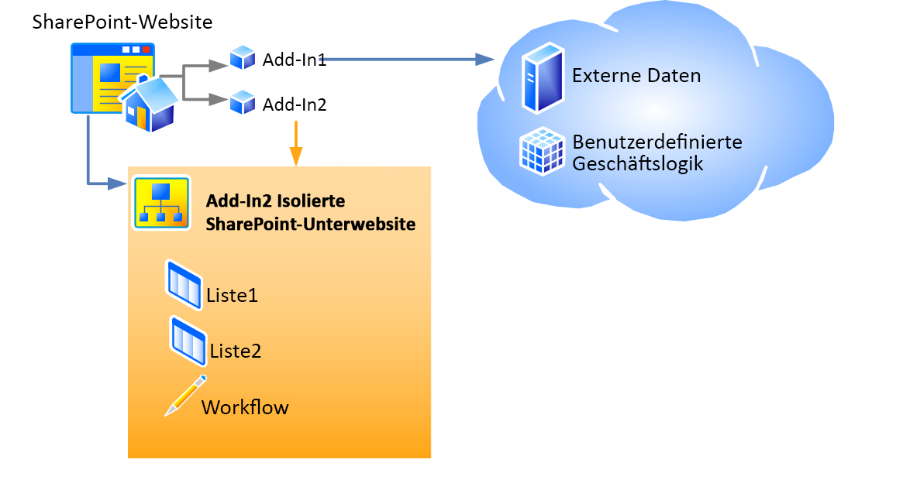

# Hostwebsites, Add-In-Websites und SharePoint-Komponenten in SharePoint 2013
Hier lernen Sie den Unterschied zwischen Hostwebs und Add-In-Webs kennen. Außerdem erfahren Sie, welche SharePoint 2013-Komponenten einem SharePoint-Add-In hinzugefügt werden können, welche für das Hostweb bereitgestellt werden, welche für das Add-In-Web bereitgestellt werden, und wie das Add-In-Web in einer isolierten Domäne bereitgestellt wird.
## Hostwebs, Add-In-Webs und die isolierte Domäne
<a name="IsolatedDomain"> </a>

Wenn ein Add-In, das SharePoint-Komponenten enthält, auf einer Website installiert wird, wird es auf der Seite **Websiteinhalt** aufgeführt und kann von dort aus gestartet werden. Diese Auflistung, die der Startpunkt des Add-Ins ist, ist das einzige Element, das der Website hinzugefügt werden muss. Bestimmte andere Elemente können jedoch optional hinzugefügt werden, wie z. B. eine benutzerdefinierte Aktion oder ein Add-In-Part. Weitere Informationen über diese Optionen finden Sie unter [Zugreifen auf das Add-In über die Benutzeroberfläche](important-aspects-of-the-sharepoint-add-in-architecture-and-development-landscap.md#AccessingApp). Im Gegensatz zu diesen Benutzeroberflächenelementen werden SharePoint-Add-In-Komponenten und Inhalte, wie z. B. Listen, Inhaltstypen, Workflows und Seiten, auf einer anderen Website in einer speziellen isolierten Domäne bereitgestellt. Dies bleibt dem Benutzer weitgehend verborgen. Die spezielle Website, auf der das Add-In  *bereitgestellt*  wird, wird alsAdd-In-Web bezeichnet. Die Website, auf der das Add-In *installiert*  wird, wird alsHostweb bezeichnet. Obwohl die Add-In-Website eine eigene isolierte Domäne besitzt, befindet sie sich in derselben Websitesammlung wie die Hostweb. (Eine Ausnahme von dieser Regel besteht, wenn das Add-In mit Mandantenbereich installiert wird. In diesem Fall befindet sich die Add-In-Website in der Websitesammlung des Unternehmens-Add-In-Katalogs.)


Abbildung 1 zeigt eine Hostweb mit zwei installierten SharePoint-Add-Ins. Add-In 1 umfasst Remote-Komponenten, jedoch keine SharePoint-Komponenten. Daher hat sie keine Add-In-Website. Add-In 2 umfasst keine Remote-Komponenten, jedoch zwei SharePoint-Listen und einen Workflow. Diese wurden für eine isolierte Unterwebsite bereitgestellt. (Eine SharePoint-Add-In kann sowohl Remote-Komponenten als auch in SharePoint gehostete Komponenten umfassen. Keine der Add-Ins in diesem Diagramm umfasst jedoch beide Komponenten.)


**Abbildung 1: Hostweb mit einem in der Cloud gehosteten Add-In und einem in SharePoint gehosteten Add-In**





Angenommen, ein Add-In mit SharePoint-Komponenten, die über die Benutzeroberflächenelemente hinausgehen, die für eine Hostweb bereitgestellt werden können, wird für eine Hostweb unter der folgenden URL installiert:


 `https://www.fabrikam.com/sites/Marketing`


Die SharePoint-Add-In wird für eine neu erstellte Website mit einer URL wie der folgenden bereitgestellt:


 `http://add-in-bdf2016ea7dacb.fabrikamadd-ins.com/sites/Marketing/Scheduler`


Beachten Sie, dass diese URL folgende Struktur hat:


 `https://` _Add-In_Präfix_ `-` _Add-In_ID_ `.` _Add-In_Basisdomäne_ `/` _Domäne_Relative_URL_des_Host_Web_ `/` _Add-In_Name_


Die Platzhalter sind wie folgt definiert:


-  _Add-In_Präfix_ ist eine beliebige, vom Farmadministrator in der Zentraladministration festgelegte Zeichenfolge. Der Standardwert ist "Standard". In diesem Beispiel wurde dies vom Administrator in "Add-In" geändert.


-  _Add-In_ID_ ist eine Hexadezimalzahl, die bei der Installation des Add-Ins intern generiert wird.


-  _Add-In_Basisdomäne_ ist eine beliebige, vom Farmadministrator in der Zentraladministration oder mit SharePoint-Verwaltungsshell festgelegte Zeichenfolge. Dies sollte nicht auf eine Subdomäne der SharePoint-Webanwendung festgelegt werden, da der Zweck der Add-In-Isolation sonst nicht erfüllt wird. In diesem Beispiel hat der Administrator "www." entfernt und "add-ins" zum Unternehmensnamen hinzugefügt. `fabrikamadd-ins.com` ist also die Basisdomäne des Add-Ins.


-  _Domäne_Relative_URL_der_Hostweb_ ist die relative URL der übergeordneten Hostweb, in diesem Fall `sites/Marketing`.


-  _Add-In_Name_ ist der Wert des **Name**-Attributs des **App**-Elements in der Datei appmanifest.xml.


Es gibt zwei wichtige Gründe für die Bereitstellung von SharePoint-Komponenten für Add-In-Webs und nicht für Hostwebs. Beide beziehen sich auf die Sicherheit.


- **Erzwingen von Add-In-Berechtigungen:** Im Modell für SharePoint-Add-Ins hat ein Add-In eine eigene Identität und besitzt Berechtigungen, die nicht zwangsläufig mit den Berechtigungen des Benutzers übereinstimmen, der das Add-In ausführt. Diese Berechtigungen werden bei der Installation des Add-Ins angefordert und von dem Benutzer gewährt, welcher das Add-In installiert, falls dieser Benutzer über alle vom Add-In angeforderten Berechtigungen verfügt. (Wenn der betreffende Benutzer nicht über alle vom Add-In angeforderten Berechtigungen verfügt, kann er das Add-In nicht installieren.) Indem jedem Add-In eine eigene Domäne zugewiesen wird, kann SharePoint 2013 Anforderungen des Add-Ins zuverlässig identifizieren und die Berechtigungen des Add-Ins überprüfen. Weitere Informationen über Add-In-Berechtigungen finden Sie unter [Add-In-Berechtigungen](important-aspects-of-the-sharepoint-add-in-architecture-and-development-landscap.md#AppPermissions).


- **Domänenübergreifende Scripting-Sicherheit:** Moderne Browser unterstützen das als "Same-Origin-Policy" bezeichnete Sicherheitskonzept im Hinblick auf JavaScript-Methodenaufrufe. Indem jede SharePoint-Add-In in einer eigenen Domäne bereitgestellt wird, nutzt SharePoint die Same-Origin-Policy des Browsers, um sicherzustellen, dass JavaScript in der SharePoint-Add-In kein JavaScript von einer anderen Domäne ausführen kann, einschließlich der Domäne, in der (aus der Endbenutzerperspektive) das Add-In installiert ist.

    SharePoint bietet außerdem eine Möglichkeit zur sicheren Überwindung der Beschränkungen des Konzepts. Unter anderem können dadurch die Remote-Komponenten einer SharePoint-Add-In, Daten von jeder beliebigen Website in der allgemeinen übergeordneten Mandanteneinheit der Host- und der Add-In-Website abfragen. Weitere Informationen finden Sie unter  [Zugreifen auf SharePoint 2013-Daten über Add-Ins mithilfe der domänenübergreifenden Bibliothek](access-sharepoint-2013-data-from-add-ins-using-the-cross-domain-library.md).


## Typen von SharePoint-Komponenten, die in einem SharePoint-Add-In enthalten sein können
<a name="TypesOfSPComponentsInApps"> </a>

In der Regel kann ein SharePoint-Add-In eine oder mehrere der Komponenten in der folgenden Liste enthalten. Abgesehen von bestimmten Ausnahmen müssen diese Komponenten in Features mit **Web**-Bereich bereitgestellt werden, die in einer SharePoint-Lösungspaketdatei (WSP-Datei) enthalten sind:


> **HINWEIS**
> ***** Die mit einem Sternchen (*) gekennzeichneten Komponenten werden im Abschnitt [Warnhinweise für die Bereitstellung von SharePoint-Komponenten](#SpecialCases) weiter unten in diesem Artikel ausführlicher behandelt.


- Features (nur mit **Web**-Bereich)


- Benutzerdefinierte Aktionen (einschließlich Kontextmenüelemente und Menübandanpassungen)*


- Remote-Ereignisempfänger*


- Markup, das auf Webparts verweist, einschließlich Add-In-Parts, die SharePoint hinzugefügt werden (jedoch keine benutzerdefinierten Webparts)*


- Angepasste Cascading Stylesheets (CSS)-Dateien zur Verwendung für SharePoint-Seiten


- Angepasste JavaScript-Dateien zur Verwendung für SharePoint-Seiten


- Module (Dateigruppen)


- Seiten


- Listenvorlagen


- Listen- und Bibliotheksinstanzen


- Angepasste Listenformulare


- Angepasste Listenansichten


- Angepasste Inhaltstypen


- Felder (mit Feldtypen, die in SharePoint integriert sind)


- Microsoft Business Connectivity Services (BCS)-Modelle (nur mit **Web**-Bereich), auf dem Modell basierende, externe Inhaltstypen*


- Workflows*


- Eigenschaftenbehälter


- Webvorlagen (jedoch keine Websitedefinitionen)*


Kein anderer SharePoint-Komponententyp kann in einer SharePoint-Add-In bereitgestellt werden. Weitere Informationen über Einschränkungen im Hinblick darauf, was in einer SharePoint-Add-In enthalten sein kann, finden Sie unter  [SharePoint-Add-Ins im Vergleich zu SharePoint-Lösungen](http://msdn.microsoft.com/library/0e9efadb-aaf2-4c0d-afd5-d6cf25c4e7a8%28Office.15%29.aspx).


## Warnhinweise für die Bereitstellung von SharePoint-Komponenten
<a name="SpecialCases"> </a>

Hier einige Warnhinweise und Details für die Bereitstellung bestimmter Arten von SharePoint-Komponenten in einem Add-In: 


- **Benutzerdefinierte Aktionen:** Sie können benutzerdefinierte Aktionen nicht nur der Add-In-Website, sondern auch der Hostwebsite hinzufügen. Um die benutzerdefinierte Aktion der Add-In-Website hinzuzufügen, fügen Sie sie einem Feature mit **Web**-Bereich hinzu, das in einer WSP-Datei enthalten ist. Dabei gehen Sie genauso vor wie bei jeder anderen Komponente, die Sie der Add-In-Website hinzufügen. Um eine benutzerdefinierte Aktion der Hostweb hinzuzufügen, können Sie (selbst bei einem extern basierten Add-In) ein **CustomAction**-Markup in ein Feature einschließen, das sich im Add-In-Paket, jedoch außerhalb einer WSP-Datei befindet. Komponenten in einem solchen "losen" Feature gelten nur für die Hostweb und nicht für die Add-In-Website. Daher wird dieser Feature-Typ als Hostweb-Feature bezeichnet.


- **Webparts:** Eine Art von Webpart, ein Add-In-Part, kann in einem Add-In bereitgestellt werden. Ein Add-In-Part kann entweder für die Add-In-Website oder die Hostwebsite verwendet werden. Auf alle anderen Typen von Webparts kann in Add-Ins verwiesen, jedoch nicht von ihnen bereitgestellt werden. Wenn ein Add-In-Part für die Hostweb bereitgestellt wird, sollte es in ein Hostweb-Feature eingeschlossen sein.


- **Remote-Ereignisempfänger:** Diese sind neu in SharePoint 2013. Sie ähneln den klassischen SharePoint-Ereignisempfängern, mit der Ausnahme, dass der Code in der Cloud ausgeführt wird. Sie sind in einem in SharePoint gehosteten Add-In nicht verfügbar.


- **Workflows:** Workflows in SharePoint 2013 verwenden die in Microsoft Azure gehostete Workflow-Laufzeit, was in SharePoint 2013 neu ist. Codierte Workflows, welche die in SharePoint gehostete Workflow-Laufzeit verwenden, können einer SharePoint-Add-In nicht hinzugefügt werden. Zulässig sind nur deklarative Workflows oder Workflows, welche die neuere Laufzeit verwenden.


- **Microsoft Business Connectivity Services (BCS)-Modelle, externe Inhaltstypen und externe Listen:**Business Data Connectivity (BDC)-Dienst-Modelle haben in der Regel einen größeren Bereich als eine Websitesammlung. Wenn jedoch ein Business Data Connectivity (BDC)-Dienst-Modell in einem Add-In bereitgestellt wird, ist sein Bereich auf die Add-In-Website beschränkt. Wenn ein Business Data Connectivity (BDC)-Dienst-Modell einem Add-In hinzugefügt wird, wird es nicht im Business Data Connectivity (BDC)-Dienst-Speicher für freigegebene Dienste gespeichert, sondern als Datei in der Add-In-Website.


- **Webvorlagen:** In den meisten Fällen empfiehlt es sich, dass die Add-In-Website die neu integrierte Websitedefinitionskonfiguration **APP#0**, die für Add-In-Webs optimiert ist, instanziiert. (Weitere Informationen hierzu finden Sie unter  [Zugreifen auf das Add-In über die Benutzeroberfläche](important-aspects-of-the-sharepoint-add-in-architecture-and-development-landscap.md#AccessingApp).) SharePoint 2013 verwendet automatisch **APP#0**, wenn das Add-In-Paket kein  [WebTemplate](http://msdn.microsoft.com/library/ff4ba91a-cc5f-47ff-9101-a7651f452185%28Office.15%29.aspx)-Element enthält. 

    Sie können auch einen benutzerdefinierten Websitetyp für die Add-In-Website definieren. Dazu sind zwei Schritte erforderlich:

  - Schließen Sie ein angepasstes  [WebTemplate-Element (Webvorlage)](http://msdn.microsoft.com/library/ff4ba91a-cc5f-47ff-9101-a7651f452185%28Office.15%29.aspx), eine onet.xml-Datei und ggf. weitere zugehörige Dateien in das Add-In-Web-Feature für Ihr Add-In ein. Stellen Sie die Webvorlage wie gewohnt in dem Feature mit Web-Bereich in einer WSP-Datei in dem Add-In-Paket bereit.


  - Fügen Sie dem Add-In-Manifest ein  [WebTemplate-Element (PropertiesDefinition ComplexType) (SharePoint-Add-in Manifest)](http://msdn.microsoft.com/library/62302903-e97a-a9a3-a64e-13176a7c4e1e%28Office.15%29.aspx) als untergeordnetes Element des **Properties**-Elements hinzu, und legen Sie sein **Id**-Attribut auf die GUID des Add-In-Web-Features und den Wert des **Name**-Attributs des  [WebTemplate-Element (Webvorlage)](http://msdn.microsoft.com/library/ff4ba91a-cc5f-47ff-9101-a7651f452185%28Office.15%29.aspx) fest. Beachten Sie, dass die GUID mit Bindestrichen geschrieben und in geschweifte Klammern "{}" eingeschlossen werden muss, außerdem müssen der GUID- und der Vorlagenname durch das Zeichen "#" getrennt werden. Hier ein Beispiel:

  ```XML

<WebTemplate Id="{81dd4ae5-873b-4759-9838-4ad9c3dd2952}#NewSiteType" />
  ```


    > **HINWEIS**
      > Das neue  [WebTemplate](http://msdn.microsoft.com/library/62302903-e97a-a9a3-a64e-13176a7c4e1e%28Office.15%29.aspx)-Element für Add-In-Manifeste ist nicht dasselbe Markup wie das  [WebTemplate](http://msdn.microsoft.com/library/ff4ba91a-cc5f-47ff-9101-a7651f452185%28Office.15%29.aspx)-Element, das in Features eingeschlossen werden kann. Das **WebTemplate**-Element, das in Features eingeschlossen werden kann, definiert einen Websitetyp, aber das **WebTemplate**-Element für Add-In-Manifeste gibt nur an, welcher Websitetyp verwendet werden soll. Weitere Informationen zum Add-In-Manifest einer SharePoint-Add-In finden Sie unter  [Add-In-Paketstruktur](important-aspects-of-the-sharepoint-add-in-architecture-and-development-landscap.md#SPAppModelArch_Package). 

    > **VORSICHT**
      > Verwenden Sie nicht das **WebTemplate**-Element im Add-In-Manifest, um eine der integrierten SharePoint-Websitedefinitionskonfigurationen als Websitetyp der Add-In-Website anzugeben. Mit Ausnahme von **APP#0** wird die Verwendung einer der integrierten Websitedefinitionskonfigurationen für Add-In-Webs nicht unterstützt.

    Weitere Informationen über Websitedefinitionskonfigurationen und Webvorlagen finden Sie unter  [Websitetypen: WebTemplates und Websitedefinitionen](http://msdn.microsoft.com/library/1edf6d4d-eddb-4cb5-9034-ed394e8a3e01%28Office.15%29.aspx).


## Weitere Informationsquellen
<a name="SP15hostedwebs_bk_addlresources"> </a>


-  [Wichtige Aspekte der Architektur und Entwicklungslandschaft von Add-Ins für SharePoint](important-aspects-of-the-sharepoint-add-in-architecture-and-development-landscap.md)


-  [SharePoint-Add-Ins im Vergleich zu SharePoint-Lösungen](http://msdn.microsoft.com/library/0e9efadb-aaf2-4c0d-afd5-d6cf25c4e7a8%28Office.15%29.aspx)


