# Vorfall-Manager: ein Lernprogramm zu Cloud-Geschäfts-Add-Ins
Mit dem **Cloud-Geschäfts-Add-In**-Vorlage in Visual Studio können Sie ein in SharePoint gehostetes Add-In erstellen, in dem mobile Benutzer an einem Remotestandort mithilfe moderner Geräte wie Smartphones und Tablet-PCs mit Toucheingabe Daten anzeigen, hinzufügen und aktualisieren können. In diesem Lernprogramm erstellen Sie eine App für eine fiktive Contoso-Feuerwehr zur Bedienung der Einsatz-Vorfallverwaltung. Diese exemplarische Vorgehensweise umfasst die Kernkonzepte des Entwickelns eines Cloud-Geschäfts-Add-Ins sowie weiterführendere Konzepte wie das Einbinden von SharePoint-Listen und Dokumentbibliotheken.Sie können die Vorfallverwaltung-Beispielanwendung und die dazugehörigen Dateien aus der MSDN-Beispielgalerie herunterladen:  [Vorfallverwaltung: Lernprogramm zu einem Cloud-Geschäfts-Add-In](http://code.msdn.microsoft.com/Incident-Manager-A-Cloud-c32d9b04).
## Voraussetzungen

Für diese exemplarische Vorgehensweise sind Visual Studio 2013 Update 1 und Microsoft Developer Tools für Visual Studio 2013 - Update März 2014 erforderlich.
  
    
    
Zum Hosten des Add-Ins benötigen Sie außerdem eine SharePoint-Entwicklerwebsite in Office 365, die Sie hier erhalten  [Registrieren für eine Office 365-Entwicklerwebsite](http://go.microsoft.com/fwlink/?LinkId=263490).
  
    
    

> **HINWEIS**
> Außerdem können Sie ein Cloud-Geschäfts-Add-In auf einer SharePoint 2013-Website hosten. 
  
    
    


## Erstellen der Vorfallverwaltungsanwendung
<a name="add-in"> </a>

Die Contoso-Feuerwehr reagiert auf Brände, medizinische Notfälle, Verkehrsunfälle und andere Notfälle. Bei jedem Notfall-Vorfall entsteht ein erheblicher Verwaltungsaufwand für die Dokumentation des Vorfalls. Aktuell füllen Sie beim Einsatz Papier-Formulare aus und geben sie anschließend in der Feuerwache in ihr Computersystem ein. Seit kurzem setzen Sie SharePoint für Office 365 zur Datensatzverwaltung ein und haben Tablets erworben, damit Sie Daten während eines Einsatzes über den Incident Commander erfassen können.
  
    
    
Sie entwickeln das mobile Add-In, die zur Eingabe der wichtigsten Informationen zu einem Vorfall dient. Da viele Vorfälle auch medizinische Versorgung umfassen, muss es mit dem Add-In möglich sein, Daten für mehrere Patienten pro Vorfall angeben zu können. In diesem Abschnitt entwickeln Sie ein einfaches Add-In und erlernen so die Grundlagen von Cloud-Geschäfts-Add-Ins.
  
    
    

### So erstellen Sie ein Projekt


1. Klicken Sie in der Menüleiste auf **Datei**, **Neu**, **Projekt**.
    
    Das Dialogfeld **Neues Projekt** wird geöffnet.
    
  
2. Erweitern Sie in der Vorlagenliste den Knoten **Visual Basic** oder **Visual C#**, dann den Knoten **Office/SharePoint**, klicken Sie auf den Knoten **Add-Ins** und anschließend auf die **Cloud-Geschäfts-Add-In**-Vorlage, wie in Abbildung 1 dargestellt.
    
   **Abbildung 1. Cloud-Geschäfts-Add-In-Vorlage**

  

     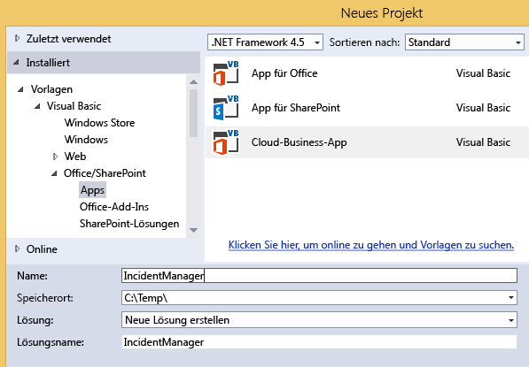
  

  

  
3. Geben Sie in das Textfeld **Name**IncidentManager ein und klicken Sie anschließend auf die Schaltfläche **OK**.
    
    Der Assistent **Neues Cloud-Geschäfts-Add-In** wird geöffnet.
    
  
4. Geben Sie im Assistenten **Neues Cloud-Geschäfts-Add-In** die URL für Ihre Office 365-Entwicklerwebsite ein. und klicken Sie dann auf die Schaltfläche **Fertigstellen**.
    
    Die URL sollte das Format https://  _MySite_.sharepoint.com/sites/Developer/ aufweisen.
    
    Eine **IncidentManager**-Lösung wird im Projektmappen-Explorer mit vier Projekten hinzugefügt: ein **IncidentManager**-Projekt auf oberster Ebene,ein **IncidentManager.HTMLClient**-Projekt, ein **IncidentManager.Server**-Projekt und ein **IncidentManager.SharePoint**-Projekt.
    
    
  
    
    

    
    Im nächsten Schritt fügen Sie eine Entität für Vorfallsammlungen hinzu. Die Entität erstellt eine speziell auf das Add-In zugeschnittene SQL Server-Datenbanktabelle. In ihr werden Informationen zu jedem einzelnen Vorfall gespeichert.
    
  

### So fügen Sie die Vorfallentität hinzu


1. Klicken Sie auf dem **Start**-Bildschirm auf den Hyperlink **Neue Tabelle erstellen**.
    
    Der Entity Designer wird geöffnet.
    
  
2. Geben Sie im Fenster **Eigenschaften** im Textfeld der Eigenschaft **Name**Vorfall ein.
    
  
3. Klicken Sie im Entity Designer auf den Link **<Eigenschaft hinzufügen>** und geben SieIncidentNumber ein.
    
  
4. Drücken Sie die EINGABETASTE, dadurch akzeptieren Sie den Standard- **Typ**, **String** und lassen das Kontrollkästchen **Erforderlich** ausgewählt.
    
  
5. Aktivieren Sie im Fenster **Eigenschaften** das Kontrollkästchen **In eindeutigen Index einschließen**.
    
    Die Vorfallnummer für jeden einzelnen Vorfall muss eindeutig sein.
    
  
6. Klicken Sie auf den Link **<Eigenschaft hinzufügen>**, geben Sie IncidentDate ein und drücken Sie anschließend die **TAB**-Taste.
    
  
7. Klicken Sie in der Spalte **Typ** auf **Datum** und drücken Sie dann zweimal dieTAB-Taste.
    
  
8. Geben Sie in der Spalte **Name**DispatchTime ein und in der Spalte **Typ** den Datentyp **DateTime**.
    
  
9. Geben Sie in der nächsten Zeile IncidentType ein und wählen Sie als Datentyp **Integer**.
    
  
10. Geben Sie in der nächsten Zeile IncidentAddress ein und wählen Sie dann als Datentyp **String**.
    
  
11. Geben Sie in der nächsten Zeile ReportingPartyName ein, wählen Sie dann als Datentyp **String** und deaktivieren Sie anschließend das Kontrollkästchen **Erforderlich**.
    
    Manchmal werden Vorfälle anonym gemeldet, in den Fällen soll dieses Feld nicht obligatorisch sein.
    
  
12. Geben Sie in der nächsten Zeile ReportingPhone ein und wählen Sie als Datentyp **PhoneNumber**.
    
    **Telefonnummer** ist einbenutzerdefinierter Geschäftstyp, der Telefonnummern automatisch formatiert und sie überprüft.
    
  
13. Klicken Sie im Fenster **Eigenschaften** auf den Hyperlink **Telefonnummernformate**.
    
    Das Dialogfeld **Telefonnummernformate** wird geöffnet.
    
  
14. Klicken Sie im Dialogfeld **Telefonnummernformate** auf das entsprechende Format für Ihr Gebietsschema und dann auf die Schaltfläche **Nach oben**, um sie an die erste Stelle in der Liste zu verschieben.
    
  
15. Geben Sie im Textfeld **Validierung der Testtelefonnummer** eine Telefonnummer ein und überprüfen Sie, ob sie korrekt formatiert ist. Klicken Sie anschließend auf die Schaltfläche **Speichern**.
    
    Der Geschäftstyp **Telefonnummer** verarbeitet die Formatierung und Überprüfung für Sie auf den Bildschirmen.
    
  
16. Geben Sie in der nächsten Zeile IncidentCommander ein und wählen Sie als Datentyp **Person**.
    
    Der Geschäftstyp **Person** stellt eine Verbindung zum SharePoint-Benutzerprofildienst bereit, die Benutzerinformationen aus dem Active Directory zieht.
    
    In Abbildung 2 wird die fertige Entität dargestellt.
    

   **Abbildung 2. Die Vorfallentität**

  

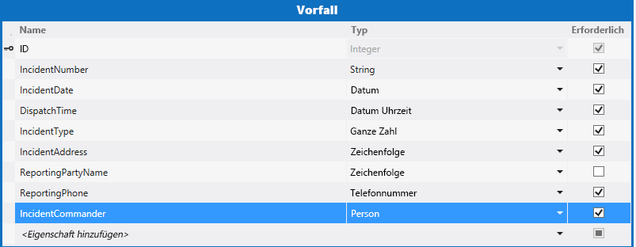
  

    
  
    
    

    
    Im nächsten Schritt fügen Sie eine Auswahlliste hinzu, mit der der Benutzer aus einem festen Satz von Werten auswählen kann. In diesem Fall verfügt die Feuerwehr über einen Satz von häufig auftretenden Vorfalltypen.
    
  

### So fügen Sie eine Auswahlliste hinzu


1. Klicken Sie im Entity Designer auf das Feld **IncidentType** und dann im Fenster **Eigenschaften** auf den Hyperlink **Auswahlliste**.
    
    Das Dialogfeld **Auswahlliste** wird geöffnet.
    
  
2. Klicken Sie im Dialogfeld **Auswahlliste** auf den Link **Wert hinzufügen** und geben Sie1 ein.
    
  
3. Geben Sie in der Spalte **Anzeigename** **Feuer - Gewerbe**.
    
  
4. Geben Sie die folgenden Werte und Anzeigenamen ein und klicken Sie anschließend auf die Schaltfläche **OK**.
    

|**Wert**|**Anzeigename**|
|:-----|:-----|
|2  <br/> |Feuer - Wohngebiet  <br/> |
|3  <br/> |Feuer - Reaktionszeit eines einzelnen Feuerwehrfahrzeugs  <br/> |
|4  <br/> | Hilfe - erweiterte Erste Hilfe <br/> |
|5  <br/> | Hilfe - Lebensrettende Sofortmaßnahmen <br/> |
|6  <br/> |Fahrzeugkollision  <br/> |
|7  <br/> |Serviceeinsatz  <br/> |
|||
   

    Zur Laufzeit wird dem Benutzer eine Liste der Anzeigenamen angezeigt. Wenn Sie eine Auswahl treffen, wird der entsprechende **Integer**-Wert in der Datenbank gespeichert.
    
    
  
    
    

    
    Im nächsten Schritt fügen Sie eine Patient-Entität hinzu. Viele Vorfälle der Feuerwehr umfassen Erste Hilfe und zu einem einzelnen Vorfall gehören oft mehrere Patienten.
    
  

### So fügen Sie die Patient-Entität hinzu


1. Öffnen Sie im **Projektmappen-Explorer** das Kontextmenü des Knotens **Datenquellen** und klicken Sie dann auf **Tabelle hinzufügen**.
    
  
2. Geben Sie im Fenster **Eigenschaften** im Textfeld der Eigenschaft **Name**Patient ein.
    
  
3. Fügen Sie im Entity Designer folgende Felder hinzu wie in Abbildung 3 dargestellt:
    
   **Abbildung 3. Die fertige Patient-Entität**

  

     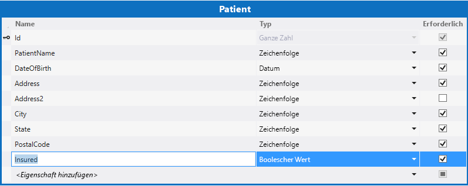
  

    
  
    
    

    
    Im nächsten Schritt definieren Sie eine Beziehung zwischen den Vorfall- und Patient-Entitäten. Ein Vorfall kann mehrere Patienten umfassen.
    
  

### So definieren Sie eine Beziehung


1. Öffnen Sie im **Projektmappen-Explorer** das Kontextmenü des Knotens **Incidents.lsml** und klicken Sie dann auf **Öffnen**.
    
  
2. Klicken Sie in der Symbolleiste auf die Schaltfläche **Beziehung**.
    
    Das Dialogfeld **Neue Beziehung hinzufügen** wird angezeigt.
    
  
3. Klicken Sie im Dialogfeld **Neue Beziehung hinzufügen** in der **An**-Spalte der Zeile **Name** auf **Patient**.
    
  
4. Klicken Sie in der Zeile **Multiplizität** in der **Von**-Spalte auf **Null oder Eins**.
    
  
5. Klicken Sie in der **An**-Spalte auf **Viele** und dann auf die Schaltfläche **OK**.
    
    In Abbildung 4 wird die Beziehung angezeigt.
    

   **Abbildung 4. Vorfall- und Patient-Beziehung**

  

     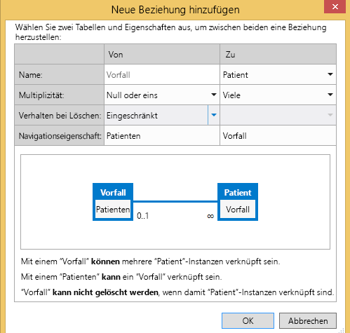
  

    Dadurch wird eine Null-oder-Eins-zu-Viele-Beziehung zwischen den Vorfällen und Patienten erstellt. Für einen Vorfalldatensatz ist kein Patient erforderlich, jedem Patienten muss jedoch ein Vorfalldatensatz zugeordnet werden.
    
    
  
    
    

    
    Im nächsten Schritt fügen Sie Bildschirme zum Anzeigen, Hinzufügen und Bearbeiten von Patient- und Vorfalldatensätzen hinzu.
    
  

### So fügen Sie Bildschirme hinzu


1. Öffnen Sie im **Projektmappen-Explorer** das Kontextmenü des Knotens **Incidents.lsml** und klicken Sie auf **Öffnen**.
    
  
2. Klicken Sie im Bildschirm-Designer in der Leiste **Perspektive** auf die Registerkarte **HTML-Client** und anschließend in der Symbolleiste auf die Schaltfläche **Bildschirm**.
    
    Das Dialogfeld **Neuen Bildschirm hinzufügen** wird geöffnet.
    
  
3. Klicken Sie im Dialogfeld **Neuen Bildschirm hinzufügen** in der Liste **Bildschirmvorlage auswählen** auf **Allgemeiner Bildschirmsatz**.
    
  
4. Geben Sie in das Textfeld **Bildschirmsatzname**Vorfälle ein.
    
  
5. Klicken Sie in der Liste **Bildschirmdaten** auf **Vorfälle**.
    
  
6. Aktivieren Sie die Kontrollkästchen **Vorfalldetails** und **Vorfall-Patienten** und klicken Sie dann auf die Schaltfläche **OK**.
    
    In Abbildung 5 wird das Dialogfeld "Neuen Bildschirm hinzufügen" dargestellt.
    

   **Abbildung 5. Dialogfeld "Neuen Bildschirm hinzufügen"**

  

     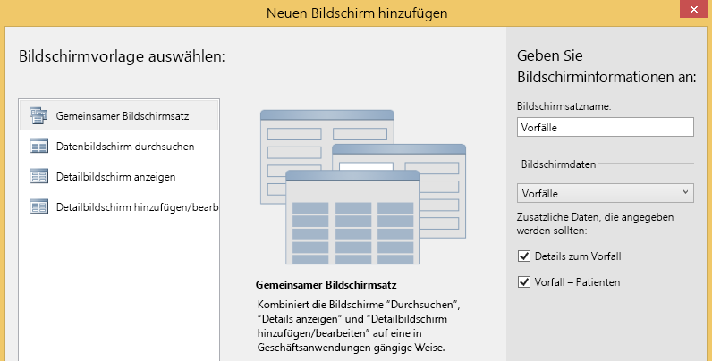
  

    Zu dem HTMLClient-Projekt werden Such-, Detailansicht- und Hinzufügen-/Bearbeiten-Bildschirme hinzugefügt. Der Such-Bildschirm wird automatisch als Startbildschirm der App festgelegt und die zum Starten der Anzeige- und Hinzufügen-/Bearbeiten-Bildschirme werden automatisch bereitgestellt.
    
  
7. Klicken Sie in der Menüleiste auf **Debuggen**, **Debuggen starten**, um die Anwendung auszuführen. Geben Sie im Dialogfeld **Mit SharePoint verbinden** ggf. Benutzername und Kennwort ein.
    
  
8. Klicken Sie, wenn Sie dazu aufgefordert werden, auf die Schaltfläche **Vertrauen**. Das Add-In wird mit einem leeren Bildschirm geöffnet. Beachten Sie, dass der Bildschirmtitel **IncidentsSet** lautet.
    
  
9. Klicken Sie auf die Schaltfläche **Hinzufügen**.
    
    Das Dialogfeld **Vorfälle** wird geöffnet. Beachten Sie, dass während der Eingabe der Vorfalldaten keine Möglichkeit besteht, Patienten hinzuzufügen. Diese und andere Designprobleme können Sie durch Anpassen der Bildschirme beheben.
    
    
  
    
    

    
    Im nächsten Schritt passen Sie den Such-Bildschrim an.
    
  
10. Schließen Sie das Dialogfeld **Vorfall** und klicken Sie anschließend auf das Browserfenster, um zum Entwurfsmodus zurückzukehren.
    
  

### So Passen Sie den Such-Bildschirm an


1. Öffnen Sie im **Projektmappen-Explorer** das Kontextmenü des Knotens **BrowseIncidentsSet.lsml** und klicken Sie dann auf **Öffnen**.
    
  
2. Klicken Sie im Fenster **Eigenschaften** auf die Eigenschaft **Anzeigename** und geben SieVorfälle ein.
    
  
3. Klicken Sie im Bildschirm-Designer auf den Knoten **Zeilenlayout | Zeilen**, erweitern Sie anschließend die Liste **Hinzufügen** und klicken Sie dann auf **Vorfalladresse**.
    
  
4. Klicken Sie auf den Knoten **Versandzeit** und anschließend in der Symbolleiste auf die Schaltfläche **Löschen**.
    
    In Abbildung 6 wird das fertige Bildschirmlayout dargestellt.
    

   **Abbildung 6. Such-Bildschirmlayout**

  

     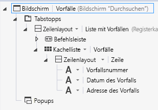
  

    Zur Laufzeit zeigt der Bildschirm eine Kachel für jeden Vorfall inklusive Vorfallnummer, -datum und -adresse an.
    
    
  
    
    

    
    Im nächsten Schritt passen Sie den Hinzufügen-/Bearbeiten-Bildschirm an.
    
  

### So passen Sie den Hinzufügen-/Bearbeiten-Bildschirm an


1. Öffnen Sie im **Projektmappen-Explorer** das Kontextmenü des Knotens **AddEditIncidents.lsml** und klicken Sie dann **Öffnen**.
    
  
2. Klicken Sie auf die Knoten **Vorfalladresse**, **Name der Meldepartei** und **Meldetelefon** und ziehen sie in den Abschnitt **Zeilenlayout | links** unter dem Knoten **Vorfalltyp**.
    
  
3. Klicken Sie auf den Knoten **Versandzeit** und deaktivieren Sie im Fenster **Eigenschaften** das Kontrollkästchen **Datumsauswahl aktiviert**.
    
    Das Datum ist nicht erforderlich, da es immer mit dem Vorfalldatum übereinstimmt.
    
  
4. Klicken Sie im linken Bereich des Bildschirm-Designer auf den Link **Patienten hinzufügen** wie in Abbildung 7 dargestellt.
    
   **Abbildung 7. Link "Patienten hinzufügen"**

  

     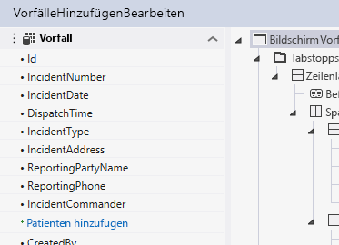
  

  

  
5. Klicken Sie im linken Bereich auf den Knoten **Patienten** und ziehen Sie ihn im mittleren Bereich unter den Knoten **Incident Commander**.
    
    In Abbildung 8 ist das fertige Bildschirmlayout dargestellt.
    

   **Abbildung 8. Layout des Hinzufügen-/Bearbeiten-Bildschirms**

  

     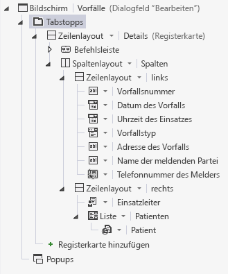
  

    
  
    
    

    
    Im nächsten Schritt erstellen Sie einen Bildschirm zum Hinzufügen von Patientendatensätzen.
    
  

### So fügen Sie einen Patienten-Bildschirm hinzu


1. Öffnen Sie im **Projektmappen-Explorer** das Kontextmenü des Knotens **AddEditIncidents.lsml** und klicken Sie dann auf **Öffnen**.
    
  
2. Öffnen Sie im Bildschirm-Designer unter dem Knoten **Zeilenlayout | Details (Registerkarte)** das Kontextmenü des Knotens **Befehlsleiste** und klicken Sie dann auf **Schaltfläche hinzufügen**.
    
  
3. Erweitern Sie im Dialogfeld **Schaltfläche hinzufügen** die Liste **showTab** und klicken Sie dann in der Gruppe **Patienten** auf **addAndEditNew** und dann auf die Schaltfläche **OK**.
    
    Das Dialogfeld **Neuen Bildschirm hinzufügen** wird geöffnet.
    
  
4. Akzeptieren Sie im Dialogfeld **Neuen Bildschirm hinzufügen** die Standardwerte und klicken Sie auf die Schaltfläche **OK**.
    
    Der Bildschirm **AddEditPatient** wird im Bildschirm-Designer geöffnet.
    
  
5. Klicken Sie im Eigenschaftsfenster auf die Eigenschaft **Anzeigename** und geben Sie dannPatient hinzufügen ein.
    
  
6. Klicken Sie im Bildschirm-Designer auf den Knoten **Vorfall** und löschen Sie ihn.
    
    Das Feld **Vorfälle** ist nicht erforderlich, da der Patient bereits mit einem Vorfall verknüpft ist.
    
    In Abbildung 9 wird das fertige Bildschirmlayout dargestellt.
    

   **Abbildung 9. Das Hinzufügen-/Bearbeiten-Bildschirmlayout**

  

     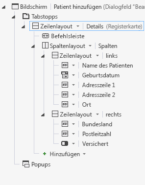
  

    
  
    
    

    
    Im nächsten Schritt starten Sie das Add-In und fügen einige Daten hinzu.
    
  

### So testen Sie das Add-In


1. Klicken Sie in der Menüleiste auf **Debuggen**, **Debuggen starten**.
    
  
2. Klicken Sie im laufenden Add-In auf die Schaltfläche **Hinzufügen**.
    
    Das Popup **Vorfälle** wird geöffnet wie in Abbildung 10 dargestellt.
    

   **Abbildung 10. Das Vorfall-Popup**

  

     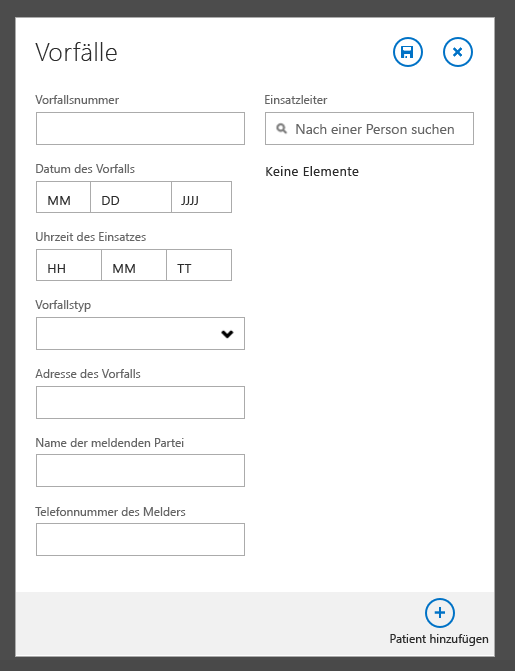
  

  

  
3. Geben Sie im Textfeld **Vorfallnummer**2014-1 ein.
    
  
4. Verwenden Sie in den Feldern **Vorfalldatum** und **Versandzeit** die Steuerelemente **Datumsauswahl** und **Zeitauswahl**, um ein Datum und eine Uhrzeit auszuwählen.
    
  
5. Klicken Sie in der Liste **Vorfalltyp** auf **Hilfe - Lebensrettende Sofortmaßnahmen**.
    
  
6. Geben Sie im Textfeld **Vorfalladresse** eine Postanschrift in Ihrer Stadt ein.
    
     Schließen Sie Stadt, Bundesland und Postleitzahl nicht mit ein, es wird davon ausgegangen, dass die Feuerwehr nur Einsätze in einer Stadt hat.
    
  
7. Geben Sie im **Incident Commander** im Steuerelement **Personenauswahl** den Namen eines Benutzers Ihrer SharePoint-Website ein.
    
    Beachten Sie, dass beim Eingeben eine Liste aller übereinstimmenden Namen angezeigt wird.
    
  
8. Klicken Sie auf die Schaltfläche **Patient hinzufügen**.
    
    Das Popup **Patient hinzufügen** wird geöffnet wie in Abbildung 11 dargestellt.
    

   **Abbildung 11. Das Popup "Patient hinzufügen"**

  

     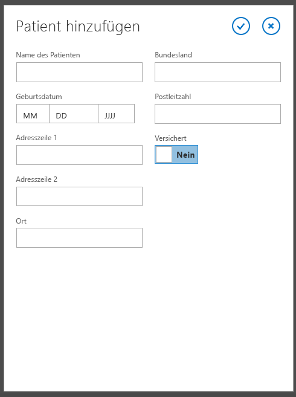
  

  

  
9. Geben Sie Informationen zu einem Patienten ein und klicken Sie anschließend auf die Schaltfläche **Speichern**.
    
    Der Name des von Ihnen hinzugefügten Patienten wird im Popup **Vorfälle** angezeigt. Sie können bei Bedarf weitere Patienten hinzufügen.
    
  
10. Klicken Sie im Popup **Vorfälle** auf die Schaltfläche **Speichern**.
    
    Wenn Sie die Anweisungen befolgen, wird eine Überprüfungsfehlermeldung angezeigt. Das Feld **Meldetelefon** ist ein Pflichtfeld. Cloud-Geschäfts-Add-Ins verfügen über eine integrierte Prüfung für Pflichtfelder.
    
  
11. Geben Sie eine Telefonnummer ein und klicken Sie erneut auf die Schaltfläche **Speichern**.
    
    Auf dem Bildschirm **Vorfälle** wird eine Kachel mit der Vorfallnummer, dem -Datum und der -adresse angezeigt.
    
  
12. Klicken Sie auf die Kachel, um den Anzeigebildschirm des Vorfalls zu öffnen.
    
    Beachten Sie, dass das Feld **Meldetelefon** als Hyperlink angezeigt wird, der einen direkten Zugriff auf Ihre Standard-Telefonanwendung bereitstellt.
    
  
13. Klicken Sie zum Öffnen des Bildschirms **AddEditIncidents** auf die Schaltfläche **Bearbeiten** und anschließend auf die Schaltfläche **Verwerfen**, um zum Bildschirm **Anzeige** zurückzukehren.
    
  
14. Klicken Sie auf die Registerkarte **Patienten**, um eine Liste der Patienten anzuzeigen und anschließend auf eine Patienten-Kachel.
    
    Beachten Sie, dass dadurch kein Anzeige-Bildschirm des Patienten geöffnet wird. Das liegt daran, dass Sie noch keinen erstellt haben.
    
  
15. Klicken Sie in Ihrem Browser auf die Schaltfläche **Schließen**, um zum Entwurfsmodus zurückzukehren.
    
    
  
    
    

    
    Im nächsten Schritt fügen Sie einen Bildschirm zur Anzeige der Patienten hinzu.
    
  

### So fügen Sie einen Anzeige-Bildschirm hinzu


1. Öffnen Sie im **Projektmappen-Explorer** das Kontextmenü des Knotens **Patients.lsml** und klicken Sie dann auf **Öffnen**.
    
  
2. Klicken Sie im Entity Designer in der Leiste **Perspektive** auf **HTMLClient** und anschließend in der Symbolleiste auf die Schaltfläche **Bildschirm**. 
    
    Das Dialogfeld **Neuen Bildschirm hinzufügen** wird geöffnet.
    
  
3. Klicken Sie im Dialogfeld **Neuen Bildschirm hinzufügen** in der Liste **Bildschirmvorlage auswählen** auf **Detailbildschirm anzeigen**.
    
  
4. Geben Sie im Textfeld **Bildschirmname** **ViewPatient** ein, klicken Sie in der Liste **Bildschirmdaten** auf **Patient** und anschließend auf die Schaltfläche **OK**.
    
    Der Bildschirm **ViewPatient** wird im Bildschirm-Designer geöffnet.
    
  
5. Öffnen Sie im Bildschirm-Designer unter dem Knoten **Zeilenlayout | Details (Registerkarte)** das Kontextmenü des Knotens **Befehlsleiste** und klicken Sie anschließend auf **Schaltfläche hinzufügen**.
    
  
6. Erweitern Sie im Dialogfeld **Schaltfläche hinzufügen** die Liste **showTab**, klicken Sie in der Gruppe **Patient** auf **Bearbeiten** und anschließend auf die Schaltfläche **OK**.
    
  
7. Starten Sie die Anwendung und überprüfen Sie, ob Sie nun Patientendatensätze anzeigen und bearbeiten können.
    
    
  
    
    

    
    Sie haben jetzt ein voll funktionsfähiges Vorfallverwaltungs-Add-In entwickelt, Sie können jedoch noch viel mehr mit Cloud-Geschäfts-Add-Ins machen. Im nächsten Abschnitt erfahren Sie, wie Sie Ressourcen auf der SharePoint-Website aus dem Vorfallverwaltungs-Add-In verwenden können.
    
  

## Einbinden von SharePoint-Ressourcen
<a name="integrate"> </a>

Die Contoso-Feuerwehr hat mit der Verwendung des Vorfallverwaltungs-Add-Ins begonnen und wie üblich bei Softwareentwicklungsprojekten fragen sie nun ein neues Feature an. Zusätzlich zu Vorfall- und Patienteninformationen benötigen sie außerdem Funktionen zum Verwalten von Ressourcen wie Feuerlöschgeräten und Personal. Sie besitzen bereits Geräte- und Personallisten auf ihrer SharePoint-Website, die Sie als weitere Datenquelle für das Add-In nutzen.
  
    
    
Im ersten Schritt fügen Sie Ihrer Entwicklerwebsite einige vorausgefüllte Listenvorlagen hinzu.
  
    
    

### So fügen Sie Listenvorlagen hinzu


1. Klicken Sie in der Menüleiste auf **Debuggen**, **Debuggen starten**, um das Add-In auszuführen.
    
  
2. Klicken Sie in dem laufenden Add-In in der Chromleiste auf den Link **Zurück zur Website**, um zu Ihrer SharePoint-Entwicklerwebsite zu navigieren, wie in Abbildung 12 dargestellt.
    
   **Abbildung 12. Der Link "Zurück zur Website"**

  

     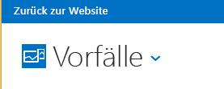
  

  

  
3. Klicken Sie auf der Seite **Entwickler** auf den Link **Websiteinhalte**.
    
  
4. Klicken Sie auf der Seite **Websiteinhalte** auf den Link **Einstellungen**, wie in Abbildung 13 dargestellt.
    
   **Abbildung 13. Der Link "Einstellungen"**

  

     
  

  

  
5. Klicken Sie auf der Seite **Websiteeinstellungen** in der Liste **Web-Designer-Kataloge** auf den Link **Listenvorlagen** wie in Abbildung 14 dargestellt.
    
   **Abbildung 14. Der Link "Listenvorlagen"**

  

     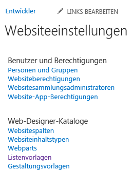
  

  

  
6. Klicken Sie auf der Seite **Listenvorlagenkatalog** auf die Registerkarte **DATEIEN** und anschließend im Menüband auf die Schaltfläche **Dokument hochladen**.
    
  
7. Klicken Sie im Dialogfeld **Vorlage hinzufügen** auf die Schaltfläche **Durchsuchen** und navigieren Sie anschließend zu dem heruntergeladenen Vorfallverwaltungsbeispiel im Ordner **Ressourcen**.
    
  
8. Klicken Sie auf die Datei **ContosoApparatus.stp**, anschließend auf die Schaltfläche **Öffnen** und schließlich auf **OK**.
    
  
9. Klicken Sie im Dialogfeld **Listenvorlagenkatalog** auf die Schaltfläche **Speichern**.
    
  
10. Wiederholen Sie diesen Vorgang und laden Sie dann die **ContosoPersonnel.stp**-Datei hoch.
    
   **Abbildung 15. Die hochgeladenen Dateien**

  

     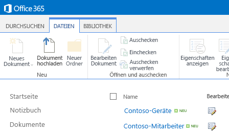
  

  

  
11. Klicken Sie auf den Link **Websiteinhalte**, klicken Sie dann auf der Seite **Websiteinhalte** auf die Kachel **Add-In hinzufügen**.
    
  
12. Klicken Sie auf der Seite **Websiteinhalte > Ihre Add-Ins** auf die Kachel **Contoso-Geräte**.
    
    > **HINWEIS**
      > Möglicherweise müssen Sie auf die zweite Seite der Add-Ins wechseln, um die Kachel **Contoso-Geräte** zu finden.
13. Klicken Sie im Dialogfeld **Benutzerdefinierte Liste hinzufügen** auf das Textfeld **Name**, geben Sie Contoso-Geräte ein und klicken Sie anschließend auf die Schaltfläche **Erstellen**.
    
  
14. Wiederholen Sie den Vorgang und fügen Sie die **Contoso-Personal**-Liste hinzu, geben Sie dabei als Namen Contoso-Personal ein.
    
  
15. Überprüfen Sie auf der Seite **Websiteinhalte**, dass nun die Listen **Contoso-Geräte** und **Contoso-Personal** angezeigt werden.
    
    
  
    
    

    
    Im nächsten Schritt fügen Sie Ihre SharePoint-Website als Datenquelle hinzu.
    
  

### So fügen Sie eine SharePoint-Datenquelle hinzu


1. Öffnen Sie im **Projektmappen-Explorer** das Kontextmenü des Knotens **Datenquellen** und klicken Sie dann auf **Datenquelle hinzufügen**.
    
    Der **Assistent zum Hinzufügen von Datenquellen** wird geöffnet.
    
  
2. Klicken Sie im **Assistent zum Hinzufügen von Datenquellen** auf das **SharePoint**-Symbol wie in Abbildung 16 dargestellt und anschließend auf die Schaltfläche **Weiter**.
    
   **Abbildung 16. SharePoint-Datenquelle**

  

     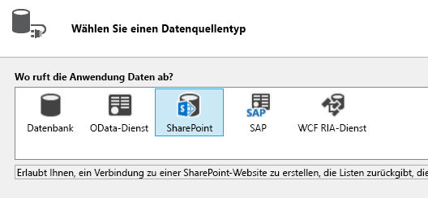
  

  

  
3. Überprüfen Sie auf der Seite **Verbindungsinformationen eingeben**, dass die URL Ihrer SharePoint-Entwicklerwebsite korrekt ist und klicken Sie anschließend auf die Schaltfläche **Weiter**.
    
  
4. Aktivieren Sie auf der Seite **SharePoint-Elemente auswählen** die Kontrollkästchen der Listen **ContosoApparatus** und **ContosoPersonnel** wie in Abbildung 17 dargestellt und klicken Sie anschließend auf die Schaltfläche **Fertig stellen**.
    
   **Abbildung 17. Die ausgewählten Listen**

  

     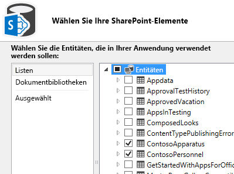
  

    Die Entitäten werden unter dem Knoten **Datenquellen** im **Projektmappen-Explorer** zu einem neuen **Entwicklerdaten**-Knoten hinzugefügt und die Entität **ContosoApparatus** wird im Entity Designer geöffnet.
    
    
    > **HINWEIS**
      > Sie haben vielleicht bemerkt, dass außerdem eine **UserInformationLists**-Entität hinzugefügt wurde. Diese Liste wird von SharePoint zum Verwalten der Felder **CreatedBy** und **ModifiedBy** für Listen verwendet.
5. Klicken Sie im Fenster **Eigenschaften** auf die Eigenschaft **Anzeigename** und ändern Sie ihn zuGeräte.
    
    
  
    
    

    
    Im nächsten Schritt definieren Sie eine Abfrage, um die von der **ApparatusSet**-Entität zurückgegebenen Daten zu begrenzen. In diesem Fall möchten Sie nur Geräte anzeigen, die in Betrieb sind.
    
  

### So definieren Sie die AvailableApparatus-Abfrage


1. Öffnen Sie im **Projektmappen-Explorer** das Kontextmenü des Knotens **ApparatusSet.lsml** und klicken Sie dann auf **Abfrage hinzufügen**.
    
    Der Abfrage-Designer wird geöffnet.
    
  
2. Klicken Sie im Fenster **Eigenschaften** auf die Eigenschaft **Name** und geben SieAvailableApparatus ein.
    
  
3. Klicken Sie im Abfrage-Designer auf den Link **Filter hinzufügen** und in der zweiten Dropdownliste auf **Verfügbar**.
    
  
4. Ändern Sie in dem letzten Textfeld **False** zu **True**.
    
    In Abbildung 18 wird die Abfrage dargestellt.
    

   **Abbildung 18. Die AvailableApparatus-Abfrage**

  

     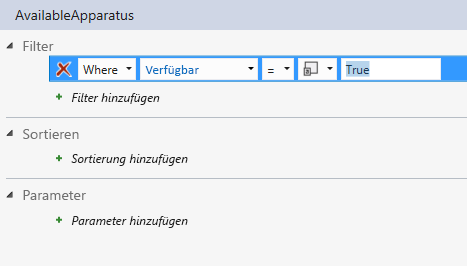
  

    
  
    
    

    
    Im nächsten Schritt definieren Sie eine weitere Abfrage für die **ContosoPersonnel**-Entität. In diesem Fall möchten Sie nur Personal anzeigen, dem die „A"-Schicht zugeteilt wurde.
    
  

### So definieren Sie die AvailablePersonnel-Abfrage


1. Öffnen Sie im **Projektmappen-Explorer** das Kontextmenü des Knotens **ContosoPersonnels.lsml** und klicken Sie dann auf **Abfrage hinzufügen**.
    
    Der Abfrage-Designer wird geöffnet.
    
  
2. Klicken Sie im Fenster **Eigenschaften** auf die Eigenschaft **Name** und geben SieAvailablePersonnel ein.
    
  
3. Klicken Sie im Abfrage-Designer auf den Link **Filter hinzufügen** und in der zweiten Dropdownliste auf **Schicht**.
    
  
4. Geben Sie im letzten Textfeld **A** ein.
    
    In Abbildung 19 wird die Abfrage dargestellt.
    

   **Abbildung 19. Die AvailablePersonnel-Abfrage**

  

     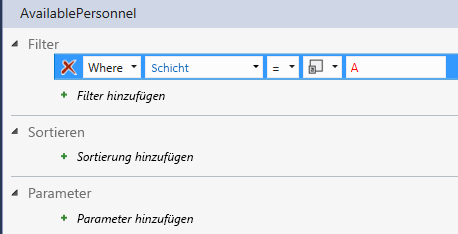
  

    
  
    
    

    
    Im nächsten Schritt fügen Sie zum **ViewIncidents**-Bildschirm Listen der verfügbaren Geräte und des verfügbaren Personals hinzu.
    
  

### So fügen Sie Abfragen zum Bildschirm hinzu


1. Öffnen Sie im **Projektmappen-Explorer** das Kontextmenü des Knotens **ViewIncidents.lsml** und klicken Sie dann auf **Öffnen**.
    
  
2. Öffnen Sie im Bildschirm-Designer das Kontextmenü des Knotens **Registerkarte** und klicken Sie dann auf **Registerkarte hinzufügen**.
    
  
3. Ändern Sie im Fenster **Eigenschaften** die Eigenschaft **Name** inRessourcen.
    
  
4. Klicken Sie im Bildschirm-Designer in der Symbolleiste auf **Datenelement hinzufügen**.
    
    Das Dialogfeld **Datenelement hinzufügen** wird geöffnet.
    
  
5. Klicken Sie im Dialogfeld **Datenelement hinzufügen** auf die Optionsschaltfläche **Abfrage**.
    
  
6. Klicken Sie in der Liste auf **DeveloperData.AvailableApparatus** wie in Abbildung 20 dargestellt und anschließend auf **OK**.
    
   **Abbildung 20. Die AvailableApparatus-Abfrage**

  

     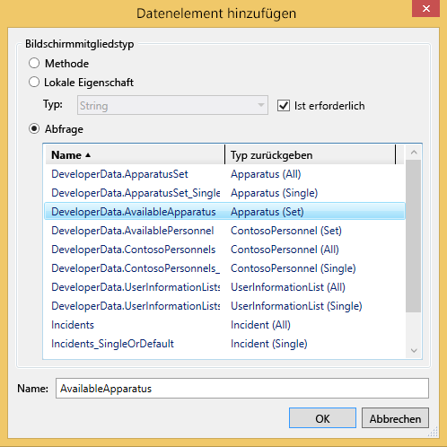
  

    Die **AvailableApparatus**-Sammlung wird im linken Bereich des Bildschirm-Designers hinzugefügt.
    
  
7. Wiederholen Sie den Vorgang, um die **AvailablePersonnel**-Abfrage zum Bildschirm hinzuzufügen.
    
  
8. Öffnen Sie unter dem Knoten **Zeilenlayout | Ressourcen** die **Hinzufügen**-Liste und klicken Sie dann auf **Verfügbare Geräte**.
    
  
9. Klicken Sie auf den Knoten **Liste | Verfügbare Geräte**, öffnen Sie die Liste **Liste** und klicken Sie dann auf **Kachelliste**.
    
  
10. Löschen Sie alle Elemente unter dem Knoten **Zeilenlayout | Contoso-Geräte** außer **Gerätenummer** und **Gerätetyp**.
    
  
11. Öffnen Sie unter dem Knoten **Zeilenlayout | Ressourcen** die **Hinzufügen**-Liste und klicken Sie dann auf **Verfügbares Personal**.
    
  
12. Klicken Sie auf den Knoten **Liste | Verfügbares Personal**, öffnen Sie die Liste **Liste** und klicken Sie dann auf **Tabelle**.
    
  
13. Löschen Sie alle Elemente unter dem Knoten **Tabellenzeile | Contoso-Personal** außer **Name**, **Rang** und **Zuweisung**.
    
    In Abbildung 21 wird das Bildschirmlayout dargestellt.
    

   **Abbildung 21. Das Bildschirmlayout**

  

     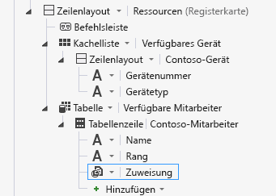
  

  

  
14. Starten Sie das Add-In, und beachten Sie die Änderungen. Klicken Sie auf einen Vorfall und anschließend auf die Registerkarte **Ressourcen**, um eine Liste der verfügbaren Ressourcen anzuzeigen.
    
    
  
    
    

    
    Die Änderungen sind jetzt abgeschlossen. Im nächsten Abschnitt erfahren Sie, wie eine SharePoint-Dokumentbibliothek hinzufügen und dem Add-In zuordnen.
    
  

## Zuordnen einer Dokumentbibliothek
<a name="associate"> </a>

Bei einem Vorfall müssen viele Sachverhalte im Incident Commander dokumentiert werden, einige verwenden vorhandene und andere Ad-Hoc-Formulare. Die bei einem Vorgang erstellten Dokumente müssen zu einem späteren Zeitpunkt zugänglich sein und nach Vorfall gegliedert sein, damit sie schnell aufgerufen werden können. Für das Vorfallverwaltungs-Add-In können Sie das benutzerdefinierte Dokumentbibliothek-Feature in SharePoint verwenden, um den einzelnen Vorfällen Dokumente zuzuordnen.
  
    
    

### So fügen Sie der SharePoint-Website eine Dokumentbibliothek hinzu


1. Klicken Sie in der Menüleiste auf **Debuggen**, **Debuggen starten**, um das Add-In auszuführen.
    
  
2. Klicken Sie in dem laufenden Add-In in der Chromleiste auf den Link **Zurück zur Website** wie in Abbildung 22 dargestellt, um zu Ihrer SharePoint-Entwicklerwebsite zu navigieren.
    
   **Abbildung 22. Der Link "Zurück zur Website"**

  

     
  

  

  
3. Klicken Sie auf der Seite **Entwickler** auf den Link **Websiteinhalte**.
    
  
4. Klicken Sie auf der Seite **Websiteinhalte** auf die Kachel **Add-In hinzufügen**.
    
  
5. Klicken Sie auf der Seite **Websiteinhalte > Ihre Add-Ins** auf die Kachel **Dokumentbibliothek**.
    
  
6. Geben Sie im Dialogfeld **Dokumentbibliothek hinzufügen** im Textfeld **Name**Vorfall-Dokumente ein und klicken Sie dann auf die Schaltfläche **Erstellen**.
    
  
7. Klicken Sie zum Öffnen der Bibliothek auf der Seite **Websiteinhalte** auf die Kachel **Vorfalldokumente** und dann auf die Registerkarte **BIBLIOTHEK**.
    
  
8. Klicken Sie im **Menüband** auf die Schaltfläche **Spalte erstellen**.
    
  
9. Geben Sie im Dialogfeld **Spalte erstellen** im Textfeld **Spaltenname**IncidentNumber ein und klicken Sie anschließend auf die Schaltfläche **OK**.
    
    In Abbildung 23 ist die neu hinzugefügte Spalte dargestellt.
    

   **Abbildung 23. Die Vorfalldokumente-Dokumentbibliothek**

  

     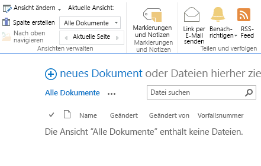
  

    Damit Sie die Dokumentbibliothek mit Ihrem Add-In verknüpfen können, muss die Dokumentbibliothek eine benutzerdefinierte Spalte enthalten, die einem eindeutigen Feld in Ihrer Entität zugeordnet ist. In diesem Fall ist die **IncidentNumber**-Spalte dem **IncidentNumber**-Feld in der **Incidents**-Entität zugeordnet.
    
    
  
    
    

    
    Im nächsten Schritt fügen Sie Ihrem Add-In die Dokumentbibliothek hinzu.
    
  

### So fügen Sie einem Projekt eine Dokumentbibliothek hinzu


1. Öffnen Sie im **Projektmappen-Explorer** das Kontextmenü des Knotens **Entwicklerdaten** und klicken Sie dann auf **Datenquelle aktualisieren**.
    
  
2. Klicken Sie auf der Seite **Wählen Sie Ihre SharePoint-Elemente** im linken Bereich auf das Listenelement **Dokumentbibliotheken** und aktivieren Sie dann im rechten Bereich das Kontrollkästchen **IncidentDocuments** wie in Abbildung 24 dargestellt und klicken Sie dann auf die Schaltfläche **Fertig stellen**.
    
   **Abbildung 24. Die IncidentDocuments-Entität**

  

     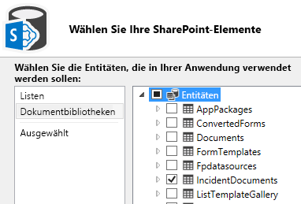
  

    Ein **IncidentDocuments.lsml**-Knoten wird im Projektmappen-Explorer hinzugefügt.
    
    
  
    
    

    
    Im nächsten Schritt erstellen Sie eine Beziehung zwischen der Dokumentbibliothek und der Incidents-Entität.
    
  

### So erstellen Sie eine datenquellenübergreifende Beziehung


1. Öffnen Sie im **Projektmappen-Explorer** das Kontextmenü des Knotens **IncidentDocuments.lsml** und klicken Sie dann auf **Öffnen**.
    
  
2. Klicken Sie im Entity Designer in der Leiste **Perspektive** auf **Server** und klicken Sie anschließend in der Symbolleiste auf **Beziehung**.
    
  
3. Klicken Sie im Dialogfeld **Neue Beziehung hinzufügen** in der Dropdownliste **An** auf **Vorfall**, wie in Abbildung 25 dargestellt.
    
   **Abbildung 25. Das Dialogfeld "Neue Beziehung hinzufügen"**

  

     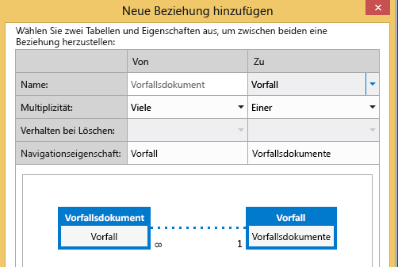
  

  

  
4. Klicken Sie in der Dropdownliste **Fremdschlüssel** auf das Feld **IncidentNumber (String)** aus der **IncidentDocuments**-Entität.
    
  
5. Klicken Sie in der Dropdownliste **Primärschlüssel** auf das Feld **IncidentNumber (String)** aus der **Incidents**-Entität und dann auf die Schaltfläche **OK**.
    
    In Abbildung 26 sind die Fremd- und Primärschlüssel dargestellt.
    

   **Abbildung 26. Fremd- und Primärschlüssel**

  

     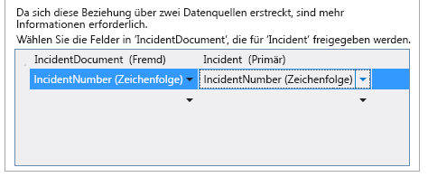
  

    
  
    
    

    
    Im nächsten Schritt fügen Sie dem **ViewIncidents**-Bildschirm die Dokumentbibliothek hinzu.
    
  

### So fügen Sie einem Bildschirm eine Dokumentbibliothek hinzu


1. Öffnen Sie im **Projektmappen-Explorer** das Kontextmenü des Knotens **ViewIncidents.lsml** und klicken Sie dann auf **Öffnen**.
    
  
2. Öffnen Sie im Bildschirm-Designer das Kontextmenü des Knotens **Registerkarte** und klicken Sie dann auf **Registerkarte hinzufügen**.
    
  
3. Ändern Sie im Fenster **Eigenschaften** die Eigenschaft **Name** zuDokumente.
    
  
4. Klicken Sie im Bildschirm-Designer im linken Bereich auf den Link **Vorfalldokumente hinzufügen**.
    
  
5. Öffnen Sie im mittleren Bereich unter dem Knoten **Zeilenlayout | Dokumente** die Liste **Hinzufügen** und klicken Sie dann auf **Vorfalldokumente**.
    
  
6. Öffnen Sie unter dem Knoten **Zeilenlayout | Dokumente** das Kontextmenü des Knotens **Befehlsleiste** und klicken Sie dann auf **Schaltfläche hinzufügen**.
    
  
7. Erweitern Sie im Dialogfeld **Schaltfläche hinzufügen** die Liste **showTab** und klicken Sie dann in der Gruppe **IncidentDocuments** auf **createOrUploadDocument** wie in Abbildung 27 dargestellt, und klicken Sie dann auf die Schaltfläche **OK**.
    
   **Abbildung 27. Das Dialogfeld "Schaltfläche hinzufügen"**

  

     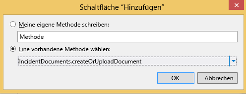
  

  

  
8. Klicken Sie im Fenster **Eigenschaften** auf die Eigenschaft **Anzeigename** und geben SieDokument hinzufügen ein.
    
  
9. Erweitern Sie die Eigenschaftsliste **Symbol** und klicken Sie dann auf **Anhang**.
    
  
10. Klicken Sie in der Menüleiste auf **Debuggen**, **Debuggen starten**, um das Add-In auszuführen.
    
  
11. Klicken Sie auf einen Vorfall, dann auf die Registerkarte **Dokumente** und anschließend auf die Schaltfläche **Dokument hinzufügen**.
    
    Das Dialogfeld **Neue Datei erstellen** wird in SharePoint geöffnet, wie in Abbildung 28 dargestellt.
    

   **Abbildung 28. Das Dialogfeld "Neue Datei erstellen"**

  

     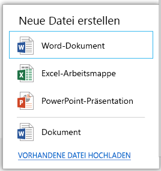
  

  

  
12. Klicken Sie auf den Link **VORHANDENE DATEI HOCHLADEN**, wählen Sie dann eine Datei aus, die hochgeladen werden soll, und klicken Sie dann auf die Schaltfläche **Öffnen**.
    
    Die Datei wird zur Registerkarte **Dokumente** hinzugefügt.
    
    > **TIPP**
      > Wenn Sie auf ein Office-Dokument klicken, können Sie es in dem Add-In anzeigen. 
13. Klicken Sie auf die Schaltfläche "Dokument hinzufügen" und im Dialogfeld **Neue Datei erstellen** auf **Word-Dokument**.
    
    Ein neues Word-Dokument wird in **Word Online** geöffnet.
    
  
14. Klicken Sie in der Titelleiste auf das Namensfeld **Dokument** wie in Abbildung 29 dargestellt und geben SieVorfallbericht ein.
    
   **Abbildung 29. Das Namensfeld "Dokument"**

  

     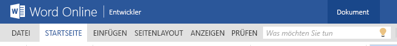
  

    Er wird als Dateiname des Dokuments verwendet.
    
    
    > **HINWEIS**
      > Wenn Sie keinen Dateinamen eingeben, wird es mit dem Standardnamen **Dokument.docx** gespeichert. Nachdem das Dokument gespeichert wurde, kann der Dateiname nur geändert werden, indem Sie darauf in der Dokumentbibliothek in SharePoint zugreifen.
15. Klicken Sie in Ihrem Browser auf die Schaltfläche "Zurück", um zum Add-In zurückzukehren. Das Dokument **Vorfallbericht** sollte auf der Registerkarte **Dokumente** angezeigt werden.
    
  
16. Klicken Sie in Ihrem Browser auf die Schaltfläche **Schließen**, um zum Entwurfsmodus zurückzukehren.
    
    
  
    
    

    
    Im nächsten Abschnitt passen Sie das Add-In an und fügen JavaScript-Code hinzu.
    
  

## Anpassen des Add-Ins
<a name="custom"> </a>

Die Contoso-Feuerwehr ist sehr zufrieden mit den zusätzlichen Funktionen in dem Vorfallverwaltungs-Add-In, es befinden sich jedoch noch ein paar Elemente auf ihrer Liste, die angepasst und fertig gestellt werden müssen. Sie möchten ihr Logo statt des Standardlogos auf den Bildschirmen anzeigen. Ihnen gefällt das Steuerelement **FlipSwitch** für das Feld **Versichert** auf dem **AddEditPatient**-Bildschirm nicht und sie möchten es durch ein Kontrollkästchen ersetzen. Da nicht bei allen Vorfällen Patienten enthalten sind, soll die Registerkarte **Patienten** auf dem Bildschirm **ViewIncidents** nicht angezeigt werden, wenn keine Patienten vorhanden sind.
  
    
    

### So zeigen Sie ein benutzerdefiniertes Logo an


1. Erweitern Sie im **Projektmappen-Explorer** im **IncidentManager.HtmlClient**-Projekt die Knoten **Inhalt** und **Bilder**.
    
  
2. Klicken Sie auf die Dateien **user-logo.png** und **user-splash-screen.png** wie in Abbildung 30 dargestellt und löschen Sie sie.
    
   **Abbildung 30. Die zu löschenden Dateien**

  

     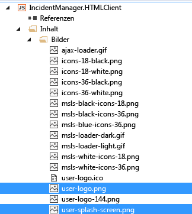
  

  

  
3. Öffnen Sie das Kontextmenü des Knotens **Bilder**, klicken Sie auf **Hinzufügen**, **Vorhandenes Element**.
    
  
4. Klicken Sie im Dialogfeld **Vorhandenes Element hinzufügen** auf die Schaltfläche **Durchsuchen** und navigieren Sie anschließend zum heruntergeladenen Vorfallverwaltungsbeispiel im Ordner **Ressourcen**.
    
  
5. Klicken Sie auf die Dateien **user-logo.png** und **user-splash-screen.png** und anschließend auf die Schaltfläche **Hinzufügen**.
    
    Die neuen Bilder werden in der Titelleiste des Add-Ins auf dem Begrüßungsbildschirm beim Laden des Add-Ins angezeigt.
    
    
  
    
    

    
    Im nächsten Schritt ersetzen Sie das Steuerelement **FlipSwitch** durch ein Kontrollkästchen.
    
  

### So ersetzen Sie das FlipSwitch-Steuerelement


1. Öffnen Sie im **Projektmappen-Explorer** das Kontextmenü des Knotens **AddEditPatient.lsml** und klicken Sie dann auf **Öffnen**.
    
  
2. Erweitern Sie im Bildschirm-Designer die Liste des Knotens **Versichert** und klicken Sie dann auf **Benutzerdefiniertes Steuerelement**.
    
  
3. Klicken Sie im Fenster **Eigenschaften** auf den Link **Render-Code bearbeiten**.
    
  
4. Fügen Sie im Code-Editor folgenden Code zur **Insured_render**-Methode hinzu:
    
  ```
  
// Create the checkbox and add it to the DOM.
    var checkbox = $("<input type='checkbox'/>")
            .css({
                height: 20,
                width: 20,
                margin: "10px"
            })
            .appendTo($(element));

    // Determine if the change was initiated by the user.
    var changingValue = false;

    checkbox.change(function () {
        changingValue = true;
        contentItem.value = checkbox[0].checked;
        changingValue = false;
    });
    contentItem.dataBind("value", function (newValue) {
        if (!changingValue) {
            checkbox[0].checked = newValue;
        }
    });
  ```


    Durch diesen Code wird beim Rendern des Bildschirms ein **CheckBox**-Steuerelement erstellt. Sie müssen außerdem Code hinzufügen, um einen Anfangswert festzulegen.
    
  
5. Öffnen Sie im **Projektmappen-Explorer** das Kontextmenü des Entitätknotens **Patients.lsml** und klicken Sie dann auf **Öffnen**.
    
  
6. Klicken Sie im Entity Designer in der Leiste **Perspektive** auf die Registerkarte **HTMLClient**.
    
  
7. Erweitern Sie in der Symbolleiste die Liste **Code schreiben** und klicken Sie dann auf **erstellt**.
    
  
8. Fügen Sie im Code-Editor folgenden Code zur **created**-Methode hinzu:
    
  ```
  
entity.Insured = new Boolean();
    entity.Insured = 'true';
  ```


    Dieser Code legt beim Erstellen des Bildschirms den Anfangswert des zu überprüfenden (true) Steuerelements fest.
    
    
  
    
    

    
    Im nächsten Schritt fügen Sie Code hinzu, sodass die Registerkarte **Patienten** ausgeblendet wird, wenn keine Patienten vorhanden sind.
    
  

### So blenden Sie eine Registerkarte unter bestimmten Bedingungen aus


1. Öffnen Sie im **Projektmappen-Explorer** das Kontextmenü des Knotens **ViewIncidents.lsml** und klicken Sie dann auf **Öffnen**.
    
  
2. Öffnen Sie in der Symbolleiste die Liste **Code schreiben** und klicken Sie dann auf **erstellt**.
    
  
3. Fügen Sie im Code-Editor folgenden Code zur **ViewIncidents_created**-Methode hinzu:
    
  ```
  
screen.getPatients().then(function (results) {
        var queryCount = results.count;
        if (queryCount == 0 ) {
            screen.findContentItem("Patients").isVisible = false;
        }
    });
  ```


    Dieser Code führt die **GetPatients**-Abfrage durch, um die Anzahl der **Patients** abzurufen. Lautet das Ergebnis Null, dann setzt die **findContentItem**-Methode die **isVisible**-Eigenschaft der **Patienten**-Registerkarte auf false, sodass sie ausgeblendet wird.
    
  
4. Klicken Sie in der Menüleiste auf **Debuggen**, **Debuggen starten**, um das Add-In auszuführen. Beachten Sie, dass das neue Logo auf den Bildschirmen angezeigt wird. Öffnen Sie den ersten Vorfall, den Sie zuvor erstellt haben und bearbeiten Sie einen Patienten. Prüfen Sie, ob das Feld "Versichert" nun ein Kontrollkästchen ist. Fügen Sie einen neuen Vorfall ohne Patienten hinzu und überprüfen Sie, ob die Registerkarte **Patienten** auf dem Anzeigebildschirm ausgeblendet ist.
    
    
  
    
    

    
    Im letzten Abschnitt veröffentlichen Sie das fertige Add-In in SharePoint.
    
  

## Veröffentlichen in SharePoint
<a name="pub"> </a>

Bis jetzt haben Sie das Add-In nur im Debuggingmodus ausgeführt, der SharePoint verwendet, um eine Authentifizierung bereitzustellen und zur lokalen IIS Express-Instanz des Computers umzuleiten. Als Nächstes veröffentlichen Sie das Add-In als automatisch gehostetes SharePoint-Add-In, das automatisch Platz für das Add-In und eine systeminterne Datenbank in Office 365 bereitstellt. Genau genommen wird das Add-In in Microsoft Azure und die Datenbank in SQL Azure gehostet. Nachdem Sie Ih Add-In veröffentlicht haben, können die Benutzer sie auf ihren Computern und mobilen Geräten aus SharePoint starten.
  
    
    

### So veröffentlichen Sie das Add-In


1. Öffnen Sie in der Symbolleiste von Visual Studio die Liste **Debuggen** und klicken Sie dann auf **Freigeben**.
    
  
2. Öffnen Sie im **Projektmappen-Explorer** das Kontextmenü des Knotens **IncidentManager** wie in Abbildung 31 dargestellt und klicken Sie dann auf **Veröffentlichen**.
    
   **Abbildung 31. Der Knoten "IncidentManager"**

  

     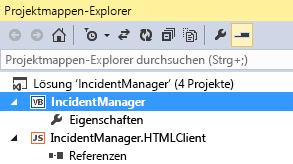
  

    Der **Assistent zum Veröffentlichen von LightSwitch-Anwendungen** wird angezeigt.
    
  
3. Klicken Sie auf der Optionsseite **SharePoint** auf die Optionsschaltfläche **Automatisch gehostet** wie in Abbildung 32 dargestellt, und klicken Sie dann auf die Schaltfläche **Veröffentlichen**.
    
   **Abbildung 32. Die Option "Automatisch gehostet"**

  

     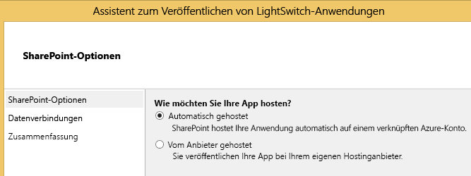
  

    Nachdem Ihr Add-In veröffentlicht ist, wird der **Datei-Explorer** und darin der **Veröffentlichen**-Ordner Ihres Projekts angezeigt.
    
  
4. Navigieren Sie im Browser zu Ihrer SharePoint-Entwicklerwebsite
    
  
5. Klicken Sie in der Liste **Add-Ins im Test** auf den Auslassungszeichen-Link (…) neben **IncidentManager**, und klicken Sie dann auf den Link **Entfernen**, wie in Abbildung 33 dargestellt.
    
   **Abbildung 33. Der Link "Entfernen"**

  

     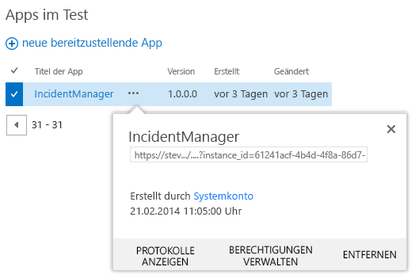
  

  

  
6. Klicken Sie auf den Link **Neues Add-In zum Bereitstellen**.
    
  
7. Klicken Sie im Dialogfeld **Add-In bereitstellen** auf den Link **Hochladen**, wie in Abbildung 34 dargestellt.
    
   **Abbildung 34. Der Link "Hochladen"**

  

     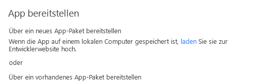
  

    Das Dialogfeld **Add-In hochladen** wird geöffnet.
    
  
8. Klicken Sie im Dialogfeld **Add-In hochladen** auf die Schaltfläche **Durchsuchen**, navigieren Sie zu dem Ordner **Veröffentlichen** Ihres Add-Ins, klicken Sie dann auf die Datei **IncidentManager.SharePoint.app**, klicken Sie auf die Schaltfläche **Öffnen** und anschließend auf die Schaltfläche **OK**.
    
    Nachdem die Datei hochgeladen wurde, öffnet sich das Dialogfeld **Add-In bereitstellen**.
    
  
9. Klicken Sie im Dialogfeld **Add-In bereitstellen** auf die Schaltfläche **Bereitstellen**.
    
  
10. Klicken Sie im Dialogfeld **Add-In hochladen** auf die Schaltfläche **Vertrauen**.
    
    Das Add-In wird auf Ihrer SharePoint-Website installiert. Der Vorgang kann einige Minuten dauern.
    
    In Abbildung 35 ist die Liste "Add-Ins im Test" dargestellt, die während der Installation des Add-Ins angezeigt wird.
    

   **Abbildung 35. Die Liste "Add-In im Test"**

  

     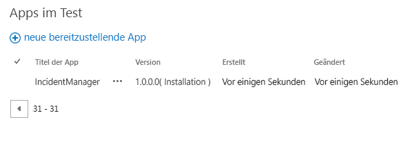
  

  

  
11. Klicken Sie auf den Link **Websiteinhalte**.
    
    In Abbildung 37 ist die Liste "Websiteinhalte" dargestellt, die während der Installation des Add-Ins angezeigt wird.
    

   **Abbildung 37. Das Add-In wird installiert**

  

     
  

  

  
12. Nachdem die Installation des Add-Ins abgeschlossen ist, klicken Sie auf die Kachel **Ereignis-Manager**, um das Add-In zu starten.
    
    In Abbildung 38 ist die Liste "Websiteinhalte" nach der Installation des Add-Ins dargestellt.
    

   **Abbildung 38. Das Add-In wurde installiert**

  

     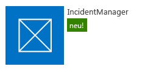
  

    Das Add-In öffnet sich im Browser und sieht genauso aus, als hätten Sie das Add-In im Debuggingmodus gestartet. Beachten Sie, dass die von Ihnen während der Entwicklung eingegebenen Daten nicht mehr vorhanden sind. Beim Bereitstellen des Add-Ins wird die Datenbank bereitgestellt, jedoch nicht die Daten.
    
  
13. Geben Sie einige Daten ein und überprüfen Sie, ob alles wie erwartet funktioniert.
    
    In Abbildung 39 wird die Anzeige des Add-Ins in einem Desktopbrowser dargestellt.
    

   **Abbildung 39. Die Neben-/Untereinanderansicht**

  

     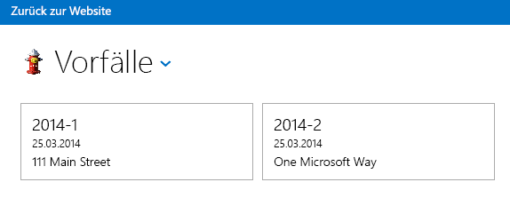
  

    Sie können Ihr Add-In auch auf einem mobilen Gerät überprüfen. Melden Sie sich aus dem Webbrowser auf Ihrem Gerät auf Ihrer SharePoint-Website an, und starten Sie anschließend das Add-In.
    
    In Abbildung 40 ist die Anzeige des Add-Ins in einem mobilen Browser dargestellt.
    

   **Abbildung 40. Listenansicht**

  

     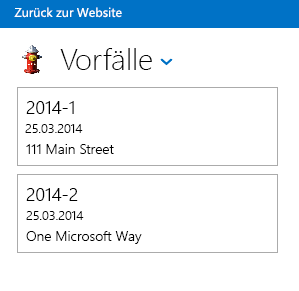
  

  

  
Herzlichen Glückwunsch! Sie haben das Lernprogramm beendet und beherrschen die Grundlagen zum Entwickeln eines Cloud-Geschäfts-Add-Ins. Nun können Sie Ihr eigenes Add-In entwickeln - mithilfe der unten aufgeführten zusätzlichen Ressource können Sie direkt loslegen.
## Zusätzliche Ressourcen
<a name="bk_addresources"> </a>


-  [Erste Schritte zum Entwickeln von Cloud-Geschäfts-Add-Ins](get-started-developing-cloud-business-add-ins.md)
    
  
-  [Entwickeln von Cloud-Geschäfts-Add-Ins](develop-cloud-business-add-ins.md)
    
  
-  [Veröffentlichen von Cloud-Geschäfts-Add-Ins](publish-cloud-business-add-ins.md)
    
  

