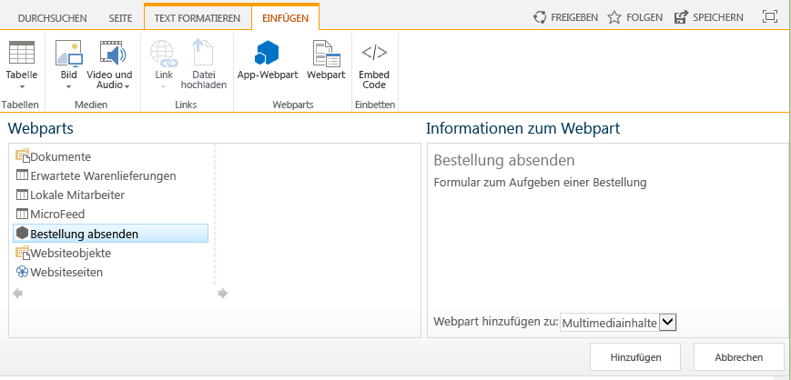
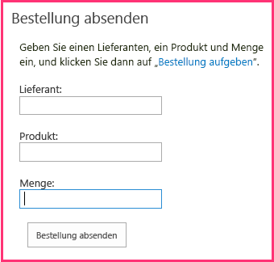

# Einfügen eines Add-In-Webparts in das vom Anbieter gehostete Add-In
Erfahren Sie, wie Sie ein Remotewebformular in einer SharePoint-Seite in einem vom Anbieter gehosteten SharePoint-Add-In anzeigen.
Dies ist der sechste einer Reihe von Artikeln über die Grundlagen der Entwicklung von vom Anbieter gehosteten SharePoint-Add-Ins. Machen Sie sich zunächst mit  [SharePoint-Add-Ins](sharepoint-add-ins.md) und den vorherigen Artikeln dieser Reihe vertraut:
  
    
    

-  [Erste Schritte beim Erstellen von von einem Anbieter gehosteten SharePoint-Add-Ins](get-started-creating-provider-hosted-sharepoint-add-ins.md)
    
  
-  [Erteilen des Aussehens und Verhaltens von SharePoint für Ihr vom Anbieter gehostetes Add-In](give-your-provider-hosted-add-in-the-sharepoint-look-and-feel.md)
    
  
-  [Einfügen einer benutzerdefinierten Schaltfläche in das vom Anbieter gehostete Add-In](include-a-custom-button-in-the-provider-hosted-add-in.md)
    
  
-  [Schnelle Übersicht über das SharePoint-Objektmodell](get-a-quick-overview-of-the-sharepoint-object-model.md)
    
  
-  [Hinzufügen von SharePoint-Schreibvorgängen zum vom Anbieter gehosteten Add-In](add-sharepoint-write-operations-to-the-provider-hosted-add-in.md)
    
  

> **HINWEIS**
> Wenn Sie diese Reihe zu vom Anbieter gehosteten Add-Ins durchgearbeitet haben, haben Sie eine Visual Studio-Projektmappe, die Sie verwenden können, um mit diesem Thema fortzufahren. Sie können außerdem das Repository unter  [SharePoint_Provider-hosted_Add-Ins_Tutorials](https://github.com/OfficeDev/SharePoint_Provider-hosted_Add-ins_Tutorials) herunterladen und die Datei „BeforeAdd-inPart.sln" öffnen.
  
    
    

In diesem Artikel fügen Sie eine besondere Art von Webpart namens Add-In-Webpart zum SharePoint-Add-In hinzu. Das Add-In-Webpart stellt das Bestellformular des Add-Ins Bestellformular auf einer SharePoint-Seite zur Verfügung.
## Erstellen des Add-In-Webparts

  
    
    

> **HINWEIS**
>  Die Einstellungen für Startprojekte in Visual Studio werden normalerweise auf die Standardwerte zurückgesetzt, wann immer die Projektmappe erneut geöffnet wird. Führen Sie die folgenden Schritte immer unmittelbar nach dem erneuten Öffnen der Beispielprojektmappe in dieser Artikelreihe durch:>  Klicken Sie mit der rechten Maustaste oben im **Projektmappen-Explorer** auf den Projektmappenknoten, und wählen Sie **Startprojekte festlegen** aus.>  Stellen Sie sicher, dass alle drei Projekte in der Spalte **Aktion** auf **Start** festgelegt sind.
  
    
    

1. Klicken Sie im **Projektmappen-Explorer** mit der rechten Maustaste auf das **ChainStore**-Projekt, und wählen Sie **Hinzufügen | Neues Element** aus.
    
  
2. Wählen Sie **Clientwebpart (Hostweb)** aus, nennen Sie esBestellung aufgeben, und klicken Sie dann auf **Hinzufügen**. (Clientwebpart ist eine andere Bezeichnung für Add-In-Webpart.)
    
  
3. Wählen Sie auf der nächsten Seite des Assistenten das zweite Optionsfeld auf: **URL einer vorhandenen Webseite für den Clientwebpart-Inhalt auswählen oder eingeben**.
    
  
4. Wählen Sie in der Dropdownliste die URL für die Seite **OrderForm.aspx** aus, und klicken Sie dann auf **Fertig stellen**.
    
    Eine elements.xml-Datei, die das Add-In-Webpart definiert, wird dem Projekt hinzugefügt und geöffnet.
    
  
5. Ändern Sie im Element **ClientWebPart** die folgenden Attribute auf die folgenden Werte:
    

|**Attribut**|**Wert**|
|:-----|:-----|
|Titel    |Bestellung aufgeben    |
|Beschreibung    |Formular zum Aufgeben einer Bestellung    |
|DefaultHeight    |320    |
   

    Behalten Sie für alle anderen Attribute die Standardwerte bei, und speichern Sie die Datei.
    
  

## Ausführen des Add-Ins und Testen des Add-In-Webparts

  
    
    

1. Verwenden Sie die F5-TASTE, um Ihr Add-In bereitzustellen und auszuführen. Visual Studio hostet die Remotewebanwendung in IIS Express und die SQL-Datenbank in SQL Express. Außerdem wird eine temporäre Installation des Add-Ins auf Ihrer SharePoint-Testwebsite durchgeführt, und das Add-In wird sofort ausgeführt. Sie werden aufgefordert, Berechtigungen für das Add-In zu erteilen, bevor die Startseite geöffnet wird.
    
  
2. Wenn das Add-in-Startseite geöffnet wird, das Add-in bereitgestellt wurde und die **Bestellung** -Add-in-Webpart steht für Benutzer auf einen beliebigen Bereich Webpart auf einer beliebigen SharePoint-Seite des Speichers Hong Hongkong-Website hinzufügen. Gehen sie zur Startseite hinzuzufügen.
    
1. Klicken Sie auf **Zurück zur Website** im Chromsteuerelement am oberen Rand der Seite, um die Startseite des Geschäfts in Hongkong zu öffnen.
    
  
2. Öffnen Sie auf dem Menüband die Registerkarte **Seite**, und klicken Sie auf die Schaltfläche **Bearbeiten**.
    
  
3. Nachdem sich die Seite im Bearbeitungsmodus befindet, öffnen Sie die Registerkarte **Einfügen** auf dem Menüband, und klicken Sie auf die Schaltfläche **Add-In-Webpart**. (Die Schaltfläche heißt möglicherweise immer noch **App-Webpart**.)
    
  
4. Wählen Sie im geöffneten Webpart-Einfügesteuerelement das Add-In-Webpart **Bestellung aufgeben** aus. Das Steuerelement sieht ähnlich aus wie folgt.
    
     
  

  

  
5. Klicken Sie in eine beliebige Webpartzone im Formular. Damit wird der Standort festgelegt, an dem das Add-In-Webpart eingefügt wird. 
    
  
6. Klicken Sie auf **Hinzufügen** im Webpart-Einfügesteuerelement. Das Add-In-Webpart **Bestellung aufgeben** wird zur Webpartzone hinzugefügt.
    
  
7. Klicken Sie im Menüband auf **Speichern**.
    
  
3. Das Bestellformular wird nun auf der Seite angezeigt und hat das Aussehen und Verhalten des Rests der Seite übernommen. Es sollte wie folgt aussehen: 
    
     
  

  

  
4. Geben Sie Werte für **Lieferant**, **Produkt** und **Menge** ein, und klicken Sie auf **Bestellung aufgeben**. Es schein nichts zu passieren, aber es wird eine Bestellung in die Datenbank des Unternehmens eingegeben. Optional können Sie die Felder des Add-In-Webparts leeren, indem Sie die Seite aktualisieren.
    
  
5. Verwenden Sie im Browser die Schaltfläche „Zurück", bis Sie wieder auf die Startseite für das ChainStore-Add-In zurückgekehrt sind, und klicken Sie dann auf die Schaltfläche **Bestellungen anzeigen**. Ihre neue Bestellung ist jetzt aufgelistet.
    
  
6. Schließen Sie zum Beenden der Debugsitzung das Browserfenster, oder beenden Sie das Debuggen in Visual Studio. Jedes Mal, wenn Sie F5 drücken, zieht Visual Studio die vorherige Version des Add-Ins zurück und installiert die neueste.
    
  
7. Da Sie mit diesem Add-In und dieser Visual Studio-Projektmappe in anderen Artikeln arbeiten werden, hat es sich bewährt, das Add-In ein letztes Mal zurückzuziehen, wenn Sie Ihre Arbeit daran für eine Weile abgeschlossen haben. Klicken Sie mit der rechten Maustaste auf das Projekt im **Projektmappen-Explorer**, und wählen Sie **Zurückziehen** aus.
    
  

## 

 Das Add-In hängt von zwei Listen ab, die Sie manuell erstellt haben. Sie möchten nicht, dass Ihre Benutzer dies ausführen müssen. Im nächsten Artikel beginnen Sie mit dem Prozess, diese Listen automatisch zu erstellen. Der erste wichtige Schritt ist die Erstellung von benutzerdefinierten Handlern für das Ereignis der Installation eines Add-ins: [Behandeln von Add-In-Ereignissen im vom Anbieter gehosteten Add-In](handle-add-in-events-in-the-provider-hosted-add-in.md)
  
    
    

