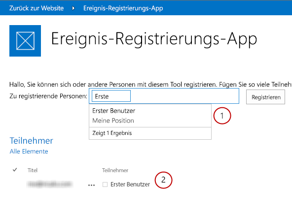
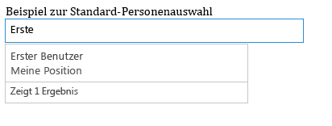
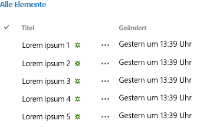

# Übersicht über Office Web Widgets - Experimental
Erfahren Sie mehr über die Office Web Widgets - Experimental, die Sie in Office-Add-Ins, SharePoint-Add-Ins und Websites verwenden können.
> **VORSICHT**
> Die Office Web Widgets - Experimental werden nur zu Recherche- und Feedbackzwecken bereitgestellt. Verwenden Sie sie nicht in Produktionsszenarios. Das Verhalten von Office Web Widgets kann sich in künftigen Versionen erheblich ändern. Lesen und prüfen Sie die  [Lizenzbedingungen für Office Web Widgets - Experimental](office-web-widgetsexperimental-license-terms.md). 
  
    
    

Clientsteuerelemente wie die Office Web Widgets - Experimental können den Arbeitsaufwand zur Erstellung von Add-Ins deutlich reduzieren und gleichzeitig die Qualität der Add-Ins steigern. Damit dies zutrifft, müssen die Widgets bestimmte Kriterien erfüllen:
- Widgets müssen auf die Verwendung in jeder Webseite ausgelegt sein, auch wenn die Seite nicht auf SharePoint gehostet wird.
    
  
- Widgets funktionieren innerhalb der Office-Steuerelementelaufzeit. Dadurch können Sie einen allgemeinen Satz von Anforderungen und eine einheitliche Syntax zur Verwendung der Widgets bereitstellen.
    
  
- Widgets, die mit SharePoint kommunizieren, verwenden die domänenübergreifende Bibliothek. Die Widgets weisen keine Abhängigkeiten von einer bestimmten serverseitigen Plattform oder Technologie auf. Sie können die Widgets unabhängig von der von Ihnen gewählten Servertechnologie verwenden.
    
  
- Widgets müssen mit anderen Elementen in der Seite zusammen verwendet werden können. Der Einschluss des Widgets in einer Seite sollte darin befindliche Elemente nicht ändern.
    
  
- Widgets müssen mit vorhandenen Frameworks kompatibel sein. Es sollte sichergestellt sein, dass Sie Ihre vertrauten Tools und Technologien weiterhin verwenden können.
    
  

**Abbildung 1: Ein Add-In, das Office Web Widgets - Experimental verwendet**

  
    
    

  
    
    

  
    
    
Sie können die Widgets verwenden, indem Sie das **Office Web Widgets - Experimental** -NuGet-Paket von Visual Studio installieren. Weitere Informationen finden Sie unter [Verwalten von NuGet-Paketen mithilfe des Dialogfelds](http://docs.nuget.org/docs/start-here/managing-nuget-packages-using-the-dialog). Sie können auch die  [NuGet-Galerieseite](http://www.nuget.org/packages/Microsoft.Office.WebWidgets.Experimental/) durchsuchen.Ihr Feedback und Ihre Kommentare haben uns bei der Auswahl bereitgestellter Widgets geholfen. Wie Sie in Abbildung 1 sehen können, können Sie jetzt das (1) Personenauswahl- und das (2) Desktoplistenansichts-Widget ausprobieren und damit experimentieren. Bitte geben Sie auf der  [Office Developer Platform UserVoice-Website](http://officespdev.uservoice.com/) weiterhin Feedback.Sie können außerdem im Codebeispiel  [Office Web Widgets - Experimentelle Demo](http://code.msdn.microsoft.com/SharePoint-2013-Office-Web-6d44aa9e) sehen, wie die Widgets eingesetzt werden.
## Personenauswahl-Widget

Sie können das experimentelle Personenauswahl-Widget in Add-Ins verwenden, um Ihren Benutzern zu helfen, Personen und Gruppen in einem Mandanten zu suchen und auszuwählen. Benutzer können beginnen, etwas in das Textfeld einzugeben, und das Widget ruft die Personen ab, deren Name oder E-Mail-Adresse mit dem Text übereinstimmt.
  
    
    

**Abbildung 2: Personenauswahl-Widget beim Auflösen einer Abfrage**

  
    
    

  
    
    

  
    
    
Sie können das Widget im HTML-Markup oder programmgesteuert mithilfe von JavaScript deklarieren. In beiden Fällen können Sie ein **div** -Element als Platzhalter für das Widget verwenden. Sie können auch Eigenschaften und Ereignishandler für das Personenauswahl-Widget festlegen. Die folgende Tabelle zeigt die im Personenauswahl-Widget verfügbaren Eigenschaften und Ereignisse.
  
    
    

|**Eigenschaft/Ereignis**|**Typ**|**Beschreibung**|
|:-----|:-----|:-----|
|**objectType**   |JSON-Objekt (Liste mit Zeichenfolgen)    | Art von Elementen, die das Widget auflöst. Optionen:    Benutzer    Gruppe    Standardeinstellung: nur Benutzer.   |
|**allowMultipleSelections**   |Boolesch    |Wahr/Falsch. Wenn falsch, sollte das Widget die Auswahl von jeweils nur einem Element erlauben.           Standard=Falsch.    |
|**rootGroupName**   |Zeichenfolge    |Wenn angegeben, beschränkt das Widget die Auswahl auf Elemente in dieser Gruppe.           Wenn nicht angegeben, fragt das Widget Objekte aus dem gesamten Mandanten ab.    |
|**selectedItems**   |JSON-Array    |Liste ausgewählter Elemente. Jedes Element gibt ein Objekt zurück, das einen Benutzer oder eine Gruppe darstellt.    |
|**onAdded**   |Funktion    |Ereignis, das ausgelöst wird, wenn der Auswahl ein neues Objekt hinzugefügt wird. Die Handlerfunktion hat das hinzugefügte Objekt erhalten.    |
|**onRemoved**   |Funktion    |Ereignis, das ausgelöst wird, wenn aus der Auswahl ein neues Objekt entfernt wird. Die Handlerfunktion hat das entfernte Objekt erhalten.    |
|**onChange**   |Funktion    |Das Hinzufügen oder Entfernen von Objekten löst dieses Ereignis aus. An die Handlerfunktion werden keine Parameter übergeben.    |
|**validationErrors**   |Bereich    | Bereich möglicher Validierungsfehler:    leer    unresolvedItem    tooManyItems   |
|**autoShowValidationMessage**   |Boolesch    |Wahr=Anzeigen          Falsch=Nicht anzeigen    |
|**hasErrors**   |Boolesch    |Wahr= Es liegen 1 oder mehrere Validierungsfehler vor          Falsch=Es liegen keine Validierungsfehler vor    |
|**errors**   |Bereich    | Bereich möglicher Validierungsfehler:    leer    unresolvedItem    tooManyItems   |
|**displayErrors**   |Boolesch    |Wahr=Fehler anzeigen          Falsch=Fehler nicht anzeigen    |
   
Die CSS-Klassen für das Personenauswahl-Widget sind im Stylesheet **Office.Controls.css** definiert. Sie können die Klassen überschreiben und das Widget für Ihr Add-In anpassen.
  
    
    
Weitere Informationen finden Sie unter  [Verwenden des experimentellen Personenauswahl-Widgets in SharePoint-Add-Ins](use-the-experimental-people-picker-widget-in-sharepoint-add-ins.md) und im Codebeispiel [Use the People Picker experimental widget in an add-in](http://code.msdn.microsoft.com/SharePoint-2013-Use-the-57859f85). 
  
    
    

## Desktoplistenansichts-Widget

Ihre Benutzer können vom Desktoplistenansichts-Widget profitieren und die Daten wie mit dem regulären Listenansichts-Widget in einer Liste anzeigen. Sie können es aber in Add-Ins verwenden, die nicht unbedingt in SharePoint gehostet werden.
  
    
    

**Abbildung 3: Desktoplistenansichts-Widget, das die Daten in einer Liste anzeigt**

  
    
    

  
    
    

  
    
    
Sie können eine vorhandene Ansicht für die Liste festlegen; das Widget gibt die Felder in der Reihenfolge wieder, in der sie in der Ansicht angezeigt werden.
  
    
    

    
> **HINWEIS**
> Aktuell zeigt das Desktoplistenansichts-Widget nur die Daten an. Es bietet keine Funktionen zur Bearbeitung. 
  
    
    

Sie können mit einem **div** -Element einen Platzhalter für das Widget angeben. Sie können das Widget programmgesteuert oder deklarativ verwenden.
  
    
    
Sie können außerdem Eigenschaften oder Ereignishandler für das Desktoplistenansichts-Widget festlegen. Die folgende Tabelle zeigt die im Desktoplistenansichts-Widget verfügbaren Eigenschaften und Ereignisse.
  
    
    

|**Eigenschaft/Ereignis**|**Typ**|**Beschreibung**|
|:-----|:-----|:-----|
|**listUrl**   |URL    |URL der Listenansicht, aus der Elemente abgerufen werden. Es kann sich um eine relative URL handeln, wobei dann davon ausgegangen wird, dass sie sich im Add-In-Web selbst oder unter einer absoluten URL befindet.    |
|**viewName**   |Zeichenfolge    |Name der angezeigten Ansicht. Dies ist der Programmname der Ansicht (nicht der Anzeigename).    |
|**onItemSelected**   |Funktion    |Ereignis, das ausgelöst wird, wenn ein Element in der Liste ausgewählt wird.    |
|**onItemAdded**   |Funktion    |Ereignis, das ausgelöst wird, wenn der Liste ein neues Objekt hinzugefügt wird.    |
|**onItemRemoved**   |Funktion    |Ereignis, das ausgelöst wird, wenn ein Element aus der Liste entfernt wird.    |
|**selectedItems**   |Datenfeld    |Liste ausgewählter Elemente im JSON-Format.    |
   
Das Widget erfordert das SharePoint-Website-Stylesheet. Sie können direkt auf das SharePoint-Stylesheet verweisen oder das Chrome-Widget verwenden. Weitere Informationen zum Stylesheet finden Sie unter  [Verwenden des Stylesheets einer SharePoint-Website in Add-Ins für SharePoint](use-a-sharepoint-website-s-style-sheet-in-sharepoint-add-ins.md) und [Verwenden des Client-Chromsteuerelements in Add-Ins für SharePoint](use-the-client-chrome-control-in-sharepoint-add-ins.md). 
  
    
    
Erfahren Sie im Codebeispiel  [Use the Desktop List View experimental widget in an add-in](http://code.msdn.microsoft.com/SharePoint-2013-Use-the-c3edb076), wie das Listenansichts-Widget eingesetzt wird. Lesen Sie außerdem  [Verwenden des experimentellen Desktoplistenansichts-Widgets in Add-Ins für SharePoint](use-the-experimental-desktop-list-view-widget-in-sharepoint-add-ins.md).
  
    
    

## Schlussbemerkung

Widgets können Ihnen helfen, den Entwicklungsprozess zu beschleunigen, die Kosten zu reduzieren und die Markteinführung Ihrer Add-Ins zu verkürzen. Office Web Widgets - Experimental bietet Widgets, die Sie in Nicht-Produktions-Add-Ins verwenden können. Wir freuen uns auf Ihr Feedback und Ihre Kommentare auf der  [Office Developer Platform UserVoice-Website](http://officespdev.uservoice.com/).
  
    
    

## Zusätzliche Ressourcen

-  [Lizenzbedingungen für Office Web Widgets - Experimental](office-web-widgetsexperimental-license-terms.md)
    
  
-  [Office Web Widgets - Experimental - NuGet-Galerieseite](http://www.nuget.org/packages/Microsoft.Office.WebWidgets.Experimental/)
    
  
-  [Verwenden des experimentellen Personenauswahl-Widgets in SharePoint-Add-Ins](use-the-experimental-people-picker-widget-in-sharepoint-add-ins.md)
    
  
-  [Codebeispiel: Office Web Widgets - Experimentelle Demo](http://code.msdn.microsoft.com/SharePoint-2013-Office-Web-6d44aa9e)
    
  
-  [Verwenden des experimentellen Desktoplistenansichts-Widgets in Add-Ins für SharePoint](use-the-experimental-desktop-list-view-widget-in-sharepoint-add-ins.md)
    
  
-  [Codebeispiel: Verwenden des experimentellen Personenauswahl-Widgets in einem Add-In](http://code.msdn.microsoft.com/SharePoint-2013-Use-the-57859f85)
    
  
-  [Codebeispiel: Verwenden des experimentellen Desktoplistenansichts-Widgets in einem Add-In](http://code.msdn.microsoft.com/SharePoint-2013-Use-the-c3edb076)
    
  
