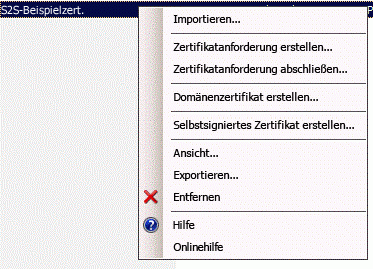

# Packen und Veröffentlichen besonders vertrauenswürdiger Add-Ins für SharePoint
Hier erfahren Sie, wie eine besonders vertrauenswürdige SharePoint-Add-In für die lokale Nutzung verpacken und veröffentlichen.
## Voraussetzungen für die Verpackung und Veröffentlichung besonders vertrauenswürdiger Apps
<a name="Prereqs"> </a>

Sie benötigen Folgendes:
  
    
    

- Eine lokale SharePoint 2013-Entwicklungsumgebung. Eine Anleitung zur Einrichtung finden Sie unter  [Einrichten einer lokalen Entwicklungsumgebung für SharePoint-Add-Ins](set-up-an-on-premises-development-environment-for-sharepoint-add-ins.md).
    
  
- Einen IIS-Webserver zum Hosten der Remotewebanwendung. Der IIS-Manager sollte installiert sein.
    
  
- Remoteinstallation von Visual Studio bzw. auf dem Computer, auf dem SharePoint 2013 installiert ist.
    
  
- Microsoft Office-Entwicklertools für Visual Studio
    
  
-  [Web Deploy](http://www.iis.net/downloads/microsoft/web-deploy), installiert auf dem Visual Studio-Computer, und dieselbe Version von **Web Deploy** auf dem Remote-Webanwendungsserver.
    
  
Tabelle 1 enthält eine Liste einiger Artikel, die zum Verständnis der für die Erstellung von SharePoint-Add-Ins relevanten Konzepte hilfreich sein können.
  
    
    

**Tabelle 1: Kernkonzepte für die Veröffentlichung besonders vertrauenswürdiger Add-Ins**


|**Titel des Artikels**|**Beschreibung**|
|:-----|:-----|
| [Erste Schritte beim Erstellen von von einem Anbieter gehosteten SharePoint-Add-Ins](get-started-creating-provider-hosted-sharepoint-add-ins.md) <br/> |Erfahren Sie, wie Sie eine grundlegende von einem Anbieter gehostete SharePoint-Add-In mit den Office-Entwicklertools für Visual Studio erstellen.  <br/> |
| [Erstellen besonders vertrauenswürdiger Add-Ins für SharePoint 2013](create-high-trust-sharepoint-add-ins.md) <br/> |Erfahren Sie, wie Sie eine einfache besonders vertrauenswürdige SharePoint-Add-In mit den Office-Entwicklertools für Visual Studio erstellen, indem Sie ein selbstsigniertes Zertifikat und eine dazugehörige Aussteller-ID verwenden.  <br/> |
| [Web Deploy](http://www.iis.net/downloads/microsoft/web-deploy) <br/> |Web Deploy vereinfacht die Bereitstellung von Webanwendungen und Websites auf IIS-Servern.  <br/> |
| [Digital Certificates](http://msdn.microsoft.com/library/e523b335-0156-4f47-b55c-b80495587c4f.aspx) und [Working with Certificates](http://msdn.microsoft.com/library/6ffb8682-8f07-4a45-afbb-8d2487e9dbc3.aspx) <br/> |Lernen Sie die grundlegenden Ideen hinter digitalen Zertifikaten kennen.  <br/> |
   

> **HINWEIS**
> Besonders vertrauenswürdige SharePoint-Add-Ins können nur in lokalen SharePoint-Installationen installiert werden, nicht in Microsoft SharePoint Online. Sie sind vorrangig zur Verwendung in einer lokalen Installation statt in einer cloudbasierten Webanwendung gedacht. In diesem Artikel wird die Veröffentlichung des Add-Ins in einem solchen Szenario beschrieben. Zudem bezieht sich 'Kunde' in diesem Artikel auf das Unternehmen, das die SharePoint-Add-In installiert und die Remotekomponenten des Add-Ins hostet. 
  
    
    


## Registrieren des besonders vertrauenswürdigen Add-Ins
<a name="Register"> </a>

Bevor Sie das Add-In veröffentlichen können, muss es beim Add-In-Verwaltungsdienst der SharePoint-Farm registriert werden. Besonders vertrauenswürdige SharePoint-Add-Ins werden immer in der SharePoint-Farm registriert, in der das Add-In installiert werden soll. (Sie können nicht über den Office Store verkauft werden.) Die Registrierung erfolgt auf der Seite "http:// _SharePoint-Website_/_layouts/15/appregnew.aspx", wie im folgenden Verfahren beschrieben.
  
    
    

### So registrieren Sie das Add-In


1. Navigieren Sie zur Seite "http:// _SharePoint-Website_/_layouts/15/appregnew.aspx". Verwenden Sie die Schaltflächen zum **Generieren**, um Werte für die Add-In-ID und den geheimen Schlüssel zu erzeugen. (Der geheime Schlüssel wird nicht wirklich in besonders vertrauenswürdigen SharePoint-Add-Ins verwendet, aber er ist für das Formular erforderlich.) Geben Sie die Basis-URL der Domäne an, in der die Remotewebanwendung des Add-Ins ausgeführt wird. Geben Sie die Domäne ohne das Protokoll (HTTPS) an, aber fügen Sie den Port an, den die Remotekomponenten für HTTPS-Anforderungen verwenden sollen, falls nicht 443 verwendet wird (Beispiel: www.contoso.com:5555 oderMyAppServer:4444).
    
    Falls Sie einen Umleitungs-URI benötigen, können Sie dafür auch einen Wert eingeben. Eine Erklärung der Verwendung eines Umleitungs-URI finden Sie unter  [OAuth-Ablauf mit Authentifizierungscode für SharePoint-Add-Ins](authorization-code-oauth-flow-for-sharepoint-add-ins.md).
    
    Das Formular auf der Seite sollte Abbildung 1 ähneln. In diesem Beispiel lauscht der Remote-Webanwendungsserver am Standardport 443 auf HTTPS-Anforderungen. Daher muss der Port nicht in der Add-In-Domäne angegeben werden.
    

   **Abbildung 1: Registrieren eines Add-Ins in "appregnew.aspx"**

  

     
  

  

  
2. Wählen Sie **Erstellen**. Die Informationen, die Sie für das Add-In eingegeben haben, werden auf der nächsten Seite angezeigt. Notieren Sie sich diese Informationen, da Sie sie beim Verwenden der Veröffentlichungstools von Visual Studio benötigen.
    
  

## Wählen einer Strategie für die Beschaffung, Pflege und Bereitstellung von Zertifikaten für besonders vertrauenswürdige SharePoint-Add-Ins
<a name="Certificate"> </a>

Wenn ein Entwickler unter Verwendung von **F5** in Visual Studio eine besonders vertrauenswürdige SharePoint-Add-In entwickelt und debuggt, kann er ein selbstsigniertes Zertifikat verwenden, wie in [Erstellen besonders vertrauenswürdiger Add-Ins für SharePoint 2013](create-high-trust-sharepoint-add-ins.md) beschrieben. Wird das Add-In jedoch *veröffentlicht*  , hat die Verwendung eines selbstsignierten Zertifikats zur Folge, dass im Browser vor dem Öffnen der Startseite der Remotewebanwendung eine Warnungsseite angezeigt wird. Der Benutzer muss wählen, ob der Vorgang fortgesetzt werden soll. Abbildung 3 zeigt Beispiele solcher Warnungen.
  
    
    

**Abbildung 3: Warnungen für selbstsignierte Zertifikate**

  
    
    

  
    
    

  
    
    
Dieses Ärgernis ist möglicherweise akzeptabel für Entwickler, aber nicht für Kunden. Daher muss der Kunde vor der endgültigen Veröffentlichung in einer Produktionsumgebung ein Zertifikat anfordern, das von einem vertrauenswürdigen Drittanbieter signiert ist. Der Drittanbieter kann eine kommerzielle Zertifizierungsstelle (CA) oder eine lokale Zertifizierungsstelle sein. Beachten Sie bei kommerziellen Zertifizierungsstellen, dass in der Branche "Nur Intranet"-Zertifikate für Webserver schrittweise abgeschafft werden. Sie können weiterhin erworben werden, aber alle diese Zertifikate laufen im November 2016 oder früher ab. Ein solches Zertifikat ist für eine besonders vertrauenswürdige SharePoint-Add-In nicht notwendig, da für Internet-Webserver verwendete Zertifikate auch für Intranet-Webserver verwendet werden können. Diese kosten jedoch normalerweise mehr.
  
    
    
Das Zertifikat sollte in zwei Formaten, PFX (Personal Information Exchange) und CER (Sicherheitszertifikat) vorliegen. Wurde es ursprünglich nicht in einem dieser Formate ausgestellt, kann der Kunde es mithilfe eines Hilfsprogramms konvertieren. Wenn eine PFX-Formatversion erstellt wurde, kann die PFX-Datei auch in IIS importiert und dann die CER-Version exportiert werden, wie unten beschrieben.
  
    
    
Wenn das Zertifikat ursprünglich im CER-Format erstellt wurde, enthält es den privaten und den öffentlichen Schlüssel. Grundsätzlich sollte die von SharePoint verwendete CER-Datei den privaten Schlüssel nicht enthalten. Ziehen Sie es in Betracht, das ursprüngliche Zertifikat in IIS zu importieren und dann eine neue CER-Version zu exportieren, die den privaten Schlüssel nicht enthält. Diese Vorgehensweise ist unten beschrieben. Weitere Informationen zu PFX- und CER-Dateien finden Sie unter  [Softwareherausgeberzertifikat](http://msdn.microsoft.com/de-de/library/windows/hardware/ff552299%28v=vs.85%29.aspx).
  
    
    
Außerdem muss sich der Kunde überlegen, ob er ein Zertifikat für alle besonders vertrauenswürdigen SharePoint-Add-Ins oder ein separates Zertifikat für jedes Add-In verwenden möchte. Weitere Informationen zu dieser Entscheidung finden Sie unter  [Entscheiden zwischen der Verwendung eines oder mehrerer Zertifikate für besonders vertrauenswürdige SharePoint-Add-Ins](creating-sharepoint-add-ins-that-use-high-trust-authorization.md#Deciding).
  
    
    

## Konfigurieren des Remotewebservers mit dem Zertifikat
<a name="ConfigureRemote"> </a>

Die folgenden Verfahren werden auf dem Remotewebserver ausgeführt, der die Remotewebanwendung hostet.
  
    
    

### So konfigurieren Sie den Remotewebserver und das PFX-Zertifikat


1. Weisen Sie dem PFX-Zertifikat ein sicheres Kennwort zu. Weitere Informationen finden Sie unter  [Richtlinien für die Erstellung sicherer Kennwörter](http://msdn.microsoft.com/de-de/library/bb416446.aspx) und [Sichere Kennwörter](http://msdn.microsoft.com/de-de/library/ms161962.aspx).
    
  
2. Importieren Sie das Zertifikat mit den folgenden Schritten in IIS auf dem Remotewebserver:
    
1. Wählen Sie im IIS-Manager in der Strukturansicht auf der linken Seite den Knoten  _ServerName_ aus.
    
  
2. Doppelklicken Sie auf das Symbol **Serverzertifikate**.
    
  
3. Wählen Sie im Bereich **Aktionen** auf der rechten Seite **Importieren** aus.
    
  
4. Verwenden Sie im Dialogfeld **Zertifikat importieren** die Schaltfläche **Durchsuchen**, um zur PFX-Datei zu wechseln, und geben Sie dann das Kennwort des Zertifikats ein.
    
  
5. Wenn Sie IIS-Manager 8 verwenden, gibt es eine Dropdownliste **Zertifikatspeicher auswählen**. Wählen Sie **Persönlich** aus. (Dies bezieht sich auf den "persönlichen" Zertifikatspeicher des Computers, nicht des Benutzers.)
    
  
6. Wenn nicht bereits eine CER-Version vorliegt oder diese den privaten Schlüssel enthält, aktivieren Sie **Export dieses Zertifikats zulassen**.
    
  
7. Klicken Sie auf **OK**.
    
  

### So öffnen Sie den Windows-Zertifikatspeicher


1. Öffnen Sie auf demselben Server die **Microsoft Management Console** gemäß der Beschreibung in [Öffnen von MMC 3.0](http://technet.microsoft.com/de-de/library/cc766121.aspx).
    
  
2. Fügen Sie das **Zertifikate**-Snap-In für das Computerkonto hinzu, wie unter  [Hinzufügen des Zertifikat-Snap-Ins zu einer MMC-Konsole](http://technet.microsoft.com/de-de/library/cc754431.aspx) beschrieben. Achten Sie darauf, dass Sie das Verfahren für den *Computer*  verwenden, nicht für einen Benutzer oder Dienst. Wählen Sie bei der entsprechenden Aufforderung *lokaler*  Computer und nicht "anderer" Computer.
    
  
Überspringen Sie das nächste Verfahren, wenn Sie ISS-Manager 8 verwenden.
  
    
    

### Zusätzliche Schritte für ISS-Manager 7, um das Zertifikat in den Windows-Zertifikatspeicher zu übertragen.


1. Erstellen Sie einen Ordner im Serverdateisystem als temporären Speicherort für das Zertifikat.
    
  
2. Wählen Sie im IIS-Manager in der Strukturansicht auf der linken Seite den Knoten  _ServerName_ aus.
    
  
3. Doppelklicken Sie auf das Symbol **Serverzertifikate**.
    
  
4. Klicken Sie in der Liste **Serverzertifikate** mit der rechten Maustaste auf das Zertifikat, und wählen Sie dann, wie in Abbildung 4 gezeigt, **Exportieren** aus.
    
   **Abbildung 4: Exportieren eines Zertifikats**

  

     
  

  

  
5. Exportieren Sie die Datei in den erstellten Ordner, und geben Sie das Kennwort für die Datei ein.
    
  
6. Importieren Sie in der **Microsoft Management Console** das Zertifikat, wie unter [Importieren eines Zertifikats](http://technet.microsoft.com/de-de/library/cc754489.aspx) beschrieben. Geben Sie dabei unbedingt den **persönlichen** Speicher an.
    
  
7. Lassen Sie die Konsole für das nächste Verfahren geöffnet.
    
  
8.  *Löschen Sie den Ordner, den Sie im ersten Schritt erstellt haben, und die Zertifikatdatei darin.*  Der Sicherheitsvorteil der Speicherung des Zertifikats im Zertifikatspeicher wird zunichte gemacht, wenn es auch im Dateisystem vorhanden ist.
    
  
Das nächste Verfahren gilt für IIS-Manager 7 und 8.
  
    
    

### So rufen Sie die Seriennummer des Zertifikats ab


1. Navigieren Sie in der **Microsoft Management Console** zum Ordner **Zertifikate** unter dem Ordner **Persönlich** des Snap-Ins **Zertifikate (lokaler Computer)**, wenn er nicht bereits geöffnet ist.
    
  
2. Doppelklicken Sie auf das Zertifikat für die SharePoint-Add-In, um es zu öffnen. Öffnen Sie dann die Registerkarte **Details**.
    
  
3. Wählen Sie das Feld **Seriennummer** aus, um die gesamte Seriennummer im Feld sichtbar zu machen.
    
  
4. Kopieren Sie die Seriennummer  *ohne Leerzeichen*  in eine Textdatei, und übergeben Sie diese an den Entwickler der SharePoint-Add-In.
    
    > **TIPP**
      > In einigen Blogbeiträgen von Entwicklern und Forumfragen wird berichtet, dass beim direkten Kopieren der Seriennummer in die Zwischenablage eine Zeichenfolge mit ausgeblendeten Zeichen erstellt wird, in der die Seriennummer vom Code in der SharePoint-Add-In nicht erkannt wird. Geben Sie daher die Nummer lieber manuell ein, statt sie zu kopieren. 
Als Nächstes erstellen Sie eine CER-Version des Zertifikats. Diese enthält den öffentlichen Schlüssel des Remotewebservers und wird von SharePoint zum Entschlüsseln der Anforderungen von der Remotewebanwendung und zum Überprüfen der Zugriffstoken in diesen Anforderungen verwendet. Sie wird auf dem Remotewebserver erstellt und anschließend in die SharePoint-Farm verschoben.
  
    
    

### So erstellen Sie das CER-Zertifikat


1. Wählen Sie im IIS-Manager in der Strukturansicht auf der linken Seite den Knoten  _ServerName_ aus.
    
  
2. Doppelklicken Sie auf **Serverzertifikate**.
    
  
3. Doppelklicken Sie in der Ansicht **Serverzertifikate** auf das Zertifikat, um die Zertifikatdetails anzuzeigen.
    
  
4. Wählen Sie auf der Registerkarte **Details** die Option **In Datei kopieren** aus, um den **Zertifikatexport-Assistenten** zu starten. Klicken Sie anschließend auf **Weiter**.
    
  
5. Verwenden Sie den Standardwert **Nein, privaten Schlüssel nicht exportieren**, und wählen Sie dann **Weiter** aus.
    
  
6. Verwenden Sie auf der nächsten Seite die Standardwerte. Wählen Sie **Weiter** aus.
    
  
7. Wählen Sie **Durchsuchen** aus, und wechseln Sie zu einem beliebigen Ordner. (Die CER-Datei wird später sowieso auf einen anderen Computer verschoben.) Benennen Sie die Datei genauso wie die PFX-Datei, und wählen Sie dann **Speichern** aus. Das Zertifikat wird in einer CER-Datei gespeichert.
    
  
8. Wählen Sie **Weiter** aus.
    
  
9. Wählen Sie **Fertig stellen** aus.
    
  

## Konfigurieren von SharePoint für die Verwendung des Zertifikats
<a name="ConfigureSP"> </a>

Die Verfahren in diesem Abschnitt können auf jedem SharePoint-Server ausgeführt werden, auf dem die **SharePoint-Verwaltungsshell** installiert ist.
  
    
    

### So verteilen Sie die CER-Datei an SharePoint


1. Erstellen Sie einen Ordner, und stellen Sie sicher, dass die Add-In-Pool-Identitäten für die folgenden IIS-Add-In-Pools über Leseberechtigungen dafür verfügen:
    
  - **SecurityTokenServiceApplicationPool**
    
  
  - Der Add-In-Pool, den die IIS-Website verwendet, die die übergeordnete SharePoint-Webanwendung für Ihre SharePoint-Testwebsite hostet. Für die **SharePoint - 80**-IIS-Website hat der Pool den Namen **OServerPortalAppPool**.
    
  
2.  *Verschieben*  Sie die CER-Datei (kopieren Sie sie nicht nur) vom Remotewebserver in den soeben erstellten Ordner auf dem SharePoint-Server. Die Datei bleibt nur vorübergehend in diesem Ordner.
    
  
Mit dem folgenden Verfahren wird das Zertifikat als vertrauenswürdiger Tokenaussteller in SharePoint konfiguriert. Es wird nur einmal durchgeführt (für jede besonders vertrauenswürdige SharePoint-Add-In).
  
    
    

### So konfigurieren Sie das Zertifikat


1. Erstellen Sie ggf. die benötigten besonders vertrauenswürdigen Windows PowerShell-Konfigurationsskripts, wie in  [Besonders vertrauenswürdige Konfigurationsskripts für SharePoint 2013](high-trust-configuration-scripts-for-sharepoint-2013.md) beschrieben.
    
  
2. Kopieren Sie die Skripts auf den SharePoint-Server.
    
  
3. Öffnen Sie die **SharePoint-Verwaltungsshell** als Administrator, und führen Sie die entsprechenden Skripts aus.
    
  
4. Eines der Skripts gilt für den Fall, dass der Kunde ein einzelnes Zertifikat für mehrere SharePoint-Add-Ins verwendet. Das Skript gibt eine Datei aus, die die GUID des Tokenausstellers enthält. Wenn Sie dieses Skript verwenden, geben Sie die ausgegebene Datei an den Entwickler der besonders vertrauenswürdigen SharePoint-Add-In weiter.
    
  
5.  *Löschen Sie die CER-Datei aus dem Dateisystem des SharePoint-Servers.* 
    
  

> **HINWEIS**
> Die Registrierung des Zertifikats als Tokenaussteller ist nicht sofort wirksam, das Add-In ist jedoch erst dann funktionsfähig. Es dauert bis zu 24 Stunden, bis alle SharePoint-Server den neuen Aussteller erkennen. Wenn Sie iisreset auf allen SharePoint-Servern ausführen können, ohne SharePoint-Benutzer zu stören, wird der Aussteller sofort erkannt. 
  
    
    


## Ändern der Datei "web.config"
<a name="WebConfig"> </a>


> **TIPP**
> Ein Codebeispiel mit einer geänderten Datei "web.config" finden Sie unter  [PnP / Samples / Core.OnPrem.S2S.WindowsCertStore](https://github.com/OfficeDev/PnP/tree/dev/Samples/Core.OnPrem.S2S.WindowsCertStore). 
  
    
    

Bearbeiten Sie die Datei "web.config" so, dass sie die neuen Werte für die folgenden Schlüssel im  `appSettings`-Knoten enthält:
  
    
    

- **ClientID:** Dies ist die Client-ID der Webanwendung (GUID), die auf "appregnew.aspx" generiert wurde.
    
  
- **ClientSigningCertificateSerialNumber:** *(Sie müssen diesen Schlüssel hinzufügen, wenn er nicht von den Microsoft Office-Entwicklertools für Visual Studio hinzugefügt wurde.)*  Dies ist die Seriennummer des Zertifikats. Der Wert darf keine Leerzeichen oder Bindestriche enthalten.
    
  
- **IssuerId:** Dies ist die GUID des Tokenausstellers ( *in Kleinbuchstaben*  ). Der Wert hängt von der Zertifikatstrategie des Kunden ab:
    
  - Wenn die besonders vertrauenswürdige SharePoint-Add-In über ein eigenes Zertifikat verfügt, das nicht von anderen SharePoint-Add-Ins verwendet wird, ist die  `IssuerId` mit der `ClientId` identisch.
    
  
  - Wenn die SharePoint-Add-In das gleiche Zertifikat wie andere SharePoint-Add-Ins verwendet, ist die  `IssuerId` eine beliebige GUID. Das Skript für dieses Szenario, das Sie in [Besonders vertrauenswürdige Konfigurationsskripts für SharePoint 2013](high-trust-configuration-scripts-for-sharepoint-2013.md) finden, generiert eine Textdatei mit dieser GUID. IT-Mitarbeiter können die ausgegebene Datei an den Add-In-Entwickler weitergeben, damit er sie als `IssuerId` in die Datei "web.config" einfügen kann.
    
  

> **HINWEIS**
> Möglicherweise wurden von den Office-Entwicklertools für Visual Studio Add-In-Einstellungsschlüssel für **ClientSigningCertificatePath** und **ClientSigningCertificatePassword** hinzugefügt. Diese werden in einem Produktions-Add-In nicht verwendet und sollten gelöscht werden.
  
    
    

Der folgende Code ist ein Beispiel dafür. Beachten Sie, dass für eine besonders vertrauenswürdige SharePoint-Add-In kein **ClientSecret**-Schlüssel enthalten ist.
  
    
    


```XML

<appSettings>
  <add key="ClientID" value="c1c12d4c-4900-43c2-8b89-c05725e0ba30" />
  <add key="ClientSigningCertificateSerialNumber" value="556a1c9c5a5415994941abd0ef2f947b" />
  <add key="IssuerId" value="f94591d5-89e3-47cd-972d-f1895cc158c6" />
</appSettings>

```


## Ändern der "TokenHelper"-Datei
<a name="WebConfig"> </a>

Die von den Office-Entwicklertools für Visual Studio generierte Datei "TokenHelper.cs" (oder .vb) muss geändert werden, damit sie das Zertifikat im Windows-Zertifikatspeicher verwendet und anhand der Seriennummer abruft. Das folgende Beispiel zeigt eine Möglichkeit dafür. In dem Beispiel wird C# verwendet.
  
    
    

> **TIPP**
> Ein Codebeispiel mit einer geänderten Datei "tokenhelper.cs" finden Sie unter  [PnP / Samples / Core.OnPrem.S2S.WindowsCertStore](https://github.com/OfficeDev/PnP/tree/dev/Samples/Core.OnPrem.S2S.WindowsCertStore). 
  
    
    


### So ändern Sie die "TokenHelper"-Datei


1. Unten im Teil  `#region private fields` der Datei befinden sich Deklarationen für `ClientSigningCertificatePath`,  `ClientSigningCertificatePassword` und `ClientCertificate`. Entfernen Sie alle drei.
    
  
2. Fügen Sie an ihrer Stelle folgende Zeile hinzu:
    
  ```
  
private static readonly string ClientSigningCertificateSerialNumber
    = WebConfigurationManager.AppSettings.Get("ClientSigningCertificateSerialNumber");
  ```

3. Suchen Sie die Zeile mit der Deklaration des  `SigningCredentials`-Felds. Ersetzen Sie es durch die folgende Zeile:
    
  ```
  
private static readonly X509SigningCredentials SigningCredentials
    = GetSigningCredentials(GetCertificateFromStore());
  ```

4. Wechseln Sie zum Teil  `#region private methods` der Datei, und fügen Sie die folgenden beiden Methoden hinzu:
    
  ```
  
private static X509SigningCredentials GetSigningCredentials(X509Certificate2 cert)
{
    return (cert == null) ? null 
                          : new X509SigningCredentials(cert, 
                                                       SecurityAlgorithms.RsaSha256Signature, 
                                                       SecurityAlgorithms.Sha256Digest);
}

private static X509Certificate2 GetCertificateFromStore()
{
    if (string.IsNullOrEmpty(ClientSigningCertificateSerialNumber))
    {
        return null;
    }  

    // Get the machine's personal store
    X509Certificate2 storedCert;
    X509Store store = new X509Store(StoreName.My, StoreLocation.LocalMachine); 

    try
    {
        // Open for read-only access                 
        store.Open(OpenFlags.ReadOnly);

        // Find the cert
        storedCert = store.Certificates.Find(X509FindType.FindBySerialNumber, 
                                             ClientSigningCertificateSerialNumber, 
                                             true)
                       .OfType<X509Certificate2>().SingleOrDefault();
    }
    finally
    {
        store.Close();
    }

    return storedCert;
}
  ```


## Verwenden des Visual Studio-Assistenten zum Verpacken der Remotewebanwendung und der SharePoint-Add-In für die Veröffentlichung
<a name="Package"> </a>


> **TIPP**
> Microsoft aktualisiert Visual Studio und Office-Entwicklertools für Visual Studio wesentlich häufiger als in der Vergangenheit, und die Dokumentation kann nicht immer sofort entsprechend aktualisiert werden. Dieser Abschnitt wurde mit der Visual Studio-Version vom Oktober 2013 und der darin enthaltenen Version der Office-Entwicklertools für Visual Studio verfasst. Wenn Sie eine frühere oder spätere Version von Visual Studio oder den Tools verwenden, müssen Sie möglicherweise die Visual Studio-Hilfe und Blogbeiträge hinzuziehen, um die entsprechenden Methoden zum Ausführen der Schritte in diesen Verfahren zu finden. 
  
    
    


### So verpacken Sie die Remotewebanwendung


1. Klicken Sie im **Projektmappen-Explorer** mit der rechten Maustaste auf das Webanwendungsprojekt (nicht das SharePoint-Add-In-Projekt), und wählen Sie **Veröffentlichen** aus.
    
  
2. Wählen Sie auf der Registerkarte **Profil** die Option **Neues Profil** in der Dropdownliste aus.
    
  
3. Wenn Sie dazu aufgefordert werden, geben Sie dem Profil einen geeigneten Namen. Beispiel: SP-Add-In für Gehaltsliste - Remotewebanwendung.
    
  
4. Wählen Sie auf der Registerkarte **Verbindung** in der Dropdownliste **Veröffentlichungsmethode** die Option **Web Deploy-Paket** aus.
    
  
5. Verwenden Sie für **Paketspeicherort** einen beliebigen Ordner. Um spätere Verfahren zu vereinfachen, sollte dies ein leerer Ordner sein. In der Regel wird der Unterordner des Ordners "bin" des Projekts verwendet.
    
  
6. Geben Sie für den Websitenamen den Namen der IIS-Website ein, die die Webanwendung hosten wird. Geben Sie den Namen ohne das Protokoll, den Port oder Schrägstriche an, zum Beispiel "GehaltslisteSite". Wenn die Webanwendung ein untergeordnetes Element der Standardwebsite sein soll, verwenden Sie Standardwebsite _/<Websitename>_, z. B. "Standardwebsite/GehaltslisteSite". (Wenn die IIS-Website noch nicht vorhanden ist, wird sie beim Ausführen des Web Deploy-Pakets in einem späteren Verfahren erstellt.)
    
  
7. Klicken Sie auf **Weiter**.
    
  
8. Wählen Sie auf der Registerkarte **Einstellungen** im Dropdown **Konfiguration** entweder **Release** oder **Debug** aus.
    
  
9. Klicken Sie auf **Weiter** und dann auf **Veröffentlichen**. Im Paketspeicherort werden eine ZIP-Datei und verschiedene andere Dateien erstellt, die zur Installation der Webanwendung in einem späteren Verfahren verwendet werden.
    
  

### So erstellen Sie ein Paket für eine SharePoint-Add-In


1. Klicken Sie in Ihrer Projektmappe mit der rechten Maustaste auf das SharePoint-Add-In-Projekt, und wählen Sie die Option **Veröffentlichen**.
    
  
2. Wählen Sie im Dropdown **Aktuelles Profil** das Profil aus, das Sie im letzten Verfahren erstellt haben.
    
  
3. Wenn ein kleines gelbes Warnsymbol neben der Schaltfläche **Bearbeiten** erscheint, klicken Sie auf die Schaltfläche **Bearbeiten**. Ein Formular wird geöffnet, in dem die gleichen Informationen erfragt werden, die Sie in der Datei "web.config" angegeben haben. Diese Informationen sind nicht erforderlich, da Sie die Veröffentlichungsmethode **Web Deploy-Paket** verwenden. Sie können das Formular jedoch nicht leer lassen. Geben Sie beliebige Zeichen in die vier Textfelder ein, und klicken Sie auf **Fertig stellen**.
    
  
4. Klicken Sie auf die Schaltfläche **Add-In verpacken**. (Klicken Sie nicht auf **Webprojekt bereitstellen**. Mit dieser Schaltfläche wird nur wiederholt, was Sie bereits im abschließenden Schritt des letzten Verfahrens ausgeführt haben.) Ein Formular **Add-In verpacken** wird geöffnet.
    
  
5. Geben Sie im Textfeld **Wo wird Ihre Website gehostet?** die URL der Domäne der Remotewebanwendung ein. Sie müssen das Protokoll, HTTPS, einschließen. Wenn die Webanwendung an einem anderen Port als 443 auf HTTPS-Anforderungen lauscht, müssen Sie den Port ebenfalls angeben. Beispiel:https://MyServer:4444. (Diesen Wert verwenden die Office-Entwicklertools für Visual Studio, um das Token "~remoteAppUr" im Add-In-Manifest der SharePoint-Add-In zu ersetzen.)
    
  
6. Geben Sie im Textfeld **Wie lautet die Client-ID des Add-Ins?** die Client-ID ein, die auf der Seite "appregnew.aspx" generiert wurde und die Sie auch in der Datei "web.config" angegeben haben.
    
  
7. Klicken Sie auf **Fertig stellen**. Das Add-In-Paket wird erstellt.
    
  

## Veröffentlichen der Remotewebanwendung und Installieren der SharePoint-Add-In
<a name="PublishRemote"> </a>


  
    
    

### So veröffentlichen Sie die Webanwendung


1. Navigieren Sie zu dem Ordner, den Sie beim Verpacken der Remotewebanwendung als **Paketspeicherort** verwendet haben. Kopieren Sie dann alle Dateien dieses Ordners in einen Ordner auf dem Remoteserver.
    
  
2. Öffnen Sie in diesem Ordner die Datei " _Projektname_.deploy-readme.txt" (wobei  _Projektname_ der Name des Visual Studio-Webanwendungsprojekts ist). Folgen Sie den Anweisungen in der Datei zum Installieren der Webanwendung mit der Datei " _Projektname_.deploy.cmd".
    
  

### So konfigurieren Sie die Protokollbindung für die Webanwendung


1. Markieren Sie im IIS-Manager die neue Website im Bereich **Verbindungen**. (Ist die neue Webanwendung ein untergeordnetes Element der **Standardwebsite**, markieren Sie die **Standardwebsite**, und führen Sie dieses Verfahren für die **Standardwebsite** aus.)
    
  
2. Klicken Sie im Bereich **Aktionen** auf **Bindungen**.
    
  
3. Klicken Sie im Dialogfeld **Sitebindungen** auf **Hinzufügen**. Führen Sie im daraufhin geöffneten Dialogfeld **Sitebindung hinzufügen** die folgenden Schritte aus.
    
1. Wählen Sie in der Dropdownliste **Typ** die Option **HTTPS** aus.
    
  
2. Wählen Sie in der Dropdownliste **IP-Adresse** die Option **Keine zugewiesen** aus.
    
  
3. Geben Sie im Textfeld **Port** den Port ein. Wenn Sie beim Registrieren der SharePoint-Add-In auf "appregnew.aspx" einen Port in der Add-In-Domäne angegeben haben (wie unter [Registrieren des besonders vertrauenswürdigen Add-Ins](#Register) beschrieben), müssen Sie hier dieselbe Nummer verwenden. Haben Sie auf "appregnew" keinen Port angegeben, verwenden Sie hier 443.
    
  
4. Wählen Sie in der Dropdownliste **SSL-Zertifikat** das Zertifikat aus, das Sie zuvor unter [Konfigurieren des Remotewebservers mit dem Zertifikat](#ConfigureRemote) zum Konfigurieren des Servers verwendet haben.
    
  
5. Klicken Sie auf **OK**.
    
  
4. Klicken Sie auf **Schließen**.
    
  

### So konfigurieren Sie die Authentifizierung für die Webanwendung


1. Bei der Installation einer neuen Webanwendung in IIS wird sie anfänglich für anonymen Zugriff konfiguriert. Fast jede besonders vertrauenswürdige SharePoint-Add-In ist jedoch so konzipiert, dass Benutzer sich authentifizieren müssen. Daher müssen Sie die Konfiguration ändern. Markieren Sie im IIS-Manager die Webanwendung im Bereich **Verbindungen**. Es handelt sich entweder um eine Peer-Website der Standardwebsite oder ein untergeordnetes Element der Standardwebsite.
    
  
2. Doppelklicken Sie auf das Symbol **Authentifizierung** in der Mitte, um den Bereich **Authentifizierung** zu öffnen.
    
  
3. Markieren Sie **Anonyme Authentifizierung**, und klicken Sie dann im Bereich **Aktionen** auf **Deaktivieren**.
    
  
4. Markieren Sie das Authentifizierungssystem, das die Webanwendung verwenden soll, und klicken Sie im Bereich **Aktionen** auf **Aktivieren**.
    
    Wenn der Code der Webanwendung den generierten Code in den "TokenHelper"- und "SharePointContext"-Dateien ohne Änderungen an den Benutzerauthentifizierungsteilen der Dateien verwendet, verwendet die Webanwendung **Windows-Authentifizierung**. Somit sollten Sie diese Option aktivieren.
    
  
5. Wenn Sie die generierten Codedateien ohne Änderungen an den Benutzerauthentifizierungsteilen der Dateien verwenden, müssen Sie auch den Authentifizierungsanbieter mit den folgenden Schritten konfigurieren:
    
1. Markieren Sie im Bereich **Authentifizierung** die Option **Windows-Authentifizierung**.
    
  
2. Klicken Sie auf **Anbieter**.
    
  
3. Stellen Sie im Dialogfeld **Anbieter** sicher, dass **NTLM** *oberhalb von* **Aushandeln** aufgelistet ist.
    
  
4. Klicken Sie auf **OK**.
    
  

### So laden Sie die SharePoint-Add-In hoch und installieren sie


1. Laden Sie die Paketdatei "*.app" der SharePoint-Add-In in den Add-In-Katalog des Unternehmens hoch. (Besonders vertrauenswürdige SharePoint-Add-Ins können nicht über den Office Store verteilt werden.) Details finden Sie unter  [Hinzufügen von Add-Ins zum Add-In-Katalog](http://technet.microsoft.com/de-de/library/fp161234.aspx#AddApps).
    
  
2. Installieren Sie das Add-In auf einer Website in derselben übergeordneten SharePoint-Webanwendung, die den Add-In-Katalog enthält. Details zum Hochladen und Installieren der SharePoint-Add-In finden Sie unter  [Hinzufügen von Add-Ins für SharePoint auf einer SharePoint 2013-Website](http://technet.microsoft.com/de-de/library/fp161231).
    
  

## Zusätzliche Ressourcen
<a name="bk_addresources"> </a>


-  [Erstellen besonders vertrauenswürdiger Add-Ins für SharePoint 2013](create-high-trust-sharepoint-add-ins.md)
    
  
-  [Veröffentlichen von SharePoint-Add-Ins mithilfe von Visual Studio](publish-sharepoint-add-ins-by-using-visual-studio.md)
    
  
-  [Registrieren von SharePoint-Add-Ins 2013](register-sharepoint-add-ins-2013.md)
    
  
-  [Erste Schritte beim Erstellen von von einem Anbieter gehosteten SharePoint-Add-Ins](get-started-creating-provider-hosted-sharepoint-add-ins.md)
    
  

