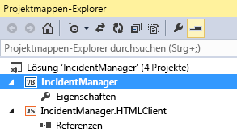

# Veröffentlichen eines Cloud-Geschäfts-Add-Ins in SharePoint
Sie können Ihr Cloud-Geschäfts-Add-In als vom Anbieter gehostetes SharePoint-Add-In veröffentlichen. Mit einem vom Anbieter gehosteten Add-In sind Sie hinsichtlich der Bereitstellung Ihrer Web App und Datenbank flexibel. Sie können sie lokal auf einer SharePoint-Website, in Windows Azure oder auf einer Hosting-Website eines Drittanbieters bereitstellen. Nachdem Sie Ihr Add-In veröffentlicht haben, können die Benutzer das Add-In auf ihren Computern und mobilen Geräten aus SharePoint starten.Sie können Ihr Add-In mit WebDeploy direkt auf einer Website veröffentlichen oder ein Paket für Ihr Add-In erstellen, das auf mehreren Servern bereitgestellt werden kann.
## So veröffentlichen Sie ein Add-In

1. Öffnen Sie im **Projektmappen-Explorer** das Kontextmenü des Anwendungsknotens auf der obersten Ebene wie in Abbildung 1 dargestellt und klicken Sie dann auf **Veröffentlichen**.

   **Abbildung 1. Der Knoten auf oberster Ebene**

2. Klicken Sie im Assistenten zum Veröffentlichen von LightSwitch-Anwendungen auf der Seite **SharePoint-Optionen** auf die Optionsschaltfläche **Vom Anbieter gehostet** und klicken Sie dann auf **Weiter**.

3. Klicken Sie auf der Seite **Anwendungsserverkonfiguration** auf die Optionsschaltfläche **IIS-Server** und klicken Sie dann auf **Weiter**.

    > **HINWEIS**
      > Wenn Sie eine Veröffentlichungseinstellungsdatei (.publishsettings oder .pubxml) besitzen, die für eine anderes Add-In erstellt wurde, können Sie diese Datei verwenden, um die restlichen zum Veröffentlichen erforderlichen Informationen bereitzustellen. Wenn dies der Fall ist, klicken Sie im Assistenten auf die Schaltfläche **Einstellungen importieren**. 
4. Klicken Sie auf der Seite **Ausgabe veröffentlichen** auf die Optionsschaltfläche **Jetzt direkt auf einem Server veröffentlichen** und klicken Sie dann auf **Weiter**.

5. Geben Sie auf der Seite **Veröffentlichungseinstellungen** in das Textfeld **Dienst-URL** die URL des Servers ein, auf dem Sie Ihr Add-In veröffentlichen möchten.

    Wenn Sie eine App bei einem Hosting-Unternehmen veröffentlichen, stellt das Unternehmen diesen Wert bereit. Dieser kann in folgenden Formaten bereitgestellt werden:

  -  _HostingCompanyURL_ (z. B. `contoso.com`)

  -  `https://` _HostingCompanyURL_ (z. B. `https://contoso.com`)

  -  `https://` _HostingCompanyURL_ `:8172/msdeploy.axd` (z. B. `https://contoso.com:8172/msdeploy.axd`)

    Wenn Sie Ihre App zu Testzwecken in Internetinformationsdiensten (IIS) auf Ihrem Computer veröffentlichen, geben Sie  `localhost` oder den Namen Ihres Computers ein.

    Wenn Sie Ihre App auf einem Server in Ihrem eigenen Netzwerk veröffentlichen, geben Sie eine dieser URLs ein:

  -  `http://` _ServerName_

  -  `http://` _ServerName_ `/msdeployagentservice`

    > **HINWEIS**
      > Wenn Sie Ihre App durch eine Firewall hindurch veröffentlichen, müssen Sie möglicherweise Port 8172 öffnen. 
6. Geben Sie in dem Textfeld **Website/Anwendung** den Namen der IIS-Website und den Ihres Add-In ein.

    Wenn Sie Ihr Add-In bei einem Hosting-Unternehmen veröffentlichen, stellt das Unternehmen diesen Wert bereit. In der Regel ist das ein Domänenname (z. B.  `contoso.com`) oder ein Domänenname und ein Add-In-Name (z. B.  `contoso.com/MyApp`).

    Wenn Sie Ihr Add-In zu Testzwecken in IIS auf Ihrem Computer oder auf einem Server in Ihrem internen Netzwerk veröffentlichen, geben Sie den Namen der Website und des Add-Ins so ein, wie sie im IIS-Manager angezeigt werden. Wenn Sie das Add-In "MyApp" auf der Standardwebsite in IIS veröffentlichen, geben Sie Standwardwebsite/MyApp ein.

    > **HINWEIS**
      > Wenn Sie Ihre App in einem vorhandenen Webordner veröffentlichen und vorhandene Inhalte entfernen möchten, müssen Sie das Kontrollkästchen **Zusätzliche Dateien auf dem Ziel entfernen** aktivieren.
7. Geben Sie in den Textfeldern **Benutzername** und **Kennwort** die Anmeldeinformationen eines Kontos ein, das über ausreichend Autorität verfügt, um Bereitstellungsaufgaben auf dem Zielwebserver auszuführen und klicken Sie dann auf **Weiter**.

    Wenn Sie Ihre App bei einem Hosting-Unternehmen veröffentlichen, stellt das Unternehmen diese Werte bereit.

8. Klicken Sie auf der Seite **Sicherheitseinstellungen** auf die Optionsschaltfläche **Ja, Benutzer müssen eine Verbindung mithilfe von HTTPS herstellen**, und anschließend auf **Weiter**.

9. Geben Sie auf der Seite **Datenverbindungen** auf der Registerkarte **Datenbankverbindungen** die Administrator- und Benutzerverbindungszeichenfolgen des Datenbankservers ein, auf dem Sie die Datenbank Ihres Add-Ins veröffentlichen möchten.

    > **HINWEIS**
      > Die Datenbank muss nicht auf dem Server gespeichert werden, auf dem Sie das Add-In veröffentlichen. 
10. Aktualisieren Sie bei Bedarf auf der Registerkarte **Angefügte Datenquellen** die Verbindungszeichenfolgen von zusätzlichen Verbindungen und klicken Sie dann auf **Weiter**.

11. Geben Sie auf der Seite **Anbieter-Hosting** im Textfeld **Wo wird Ihre LightSwitch-Anwendung gehostet** die vollständige URL Ihres Add-Ins ein.

    In den meisten Fällen stimmt diese URL mit den von Ihnen zuvor eingegebenen Werten unter **Dienst-URL** und **Website/Anwendung** überein (z. B. `https://contoso.com/MyApplication`).

12. Geben Sie die Werte **Client-ID** und **Clientgeheimnis** für Ihr Add-In ein.

    Sie können diese Werte von der **appregnew**-Seite Ihrer SharePoint-Website oder vom Verkäuferdashboard abrufen. Weitere Informationen dazu finden Sie unter  [Richtlinien für das Registrieren von SharePoint-Add-Ins 2013](http://msdn.microsoft.com/de-de/library/office/jj687469%28v=office.15%29.aspx).

13. Klicken Sie auf **Veröffentlichen**, um Ihr Add-In zu veröffentlichen.

    Nachdem Ihr Add-In veröffentlicht wurde, wird der **Datei-Explorer** geöffnet. Er zeigt das **Veröffentlichen**-Verzeichnis Ihres Projekts an.

## So erstellen Sie ein Add-In-Paket

1. Öffnen Sie im **Projektmappen-Explorer** das Kontextmenü des Anwendungsknotens auf der obersten Ebene wie in Abbildung 1 dargestellt und klicken Sie dann auf **Veröffentlichen**.

   **Abbildung 1. Der Knoten auf oberster Ebene**

2. Klicken Sie im Assistenten zum Veröffentlichen von LightSwitch-Anwendungen auf der Seite **SharePoint-Optionen** auf die Optionsschaltfläche **Vom Anbieter gehostet** und dann auf **Weiter**.

3. Klicken Sie auf der Seite **Anwendungsserverkonfiguration** auf die Optionsschaltfläche **IIS-Server** und dann auf **Weiter**.

    > **HINWEIS**
      > Wenn Sie eine Veröffentlichungseinstellungsdatei (.publishsettings oder .pubxml) veröffentlichen, die für ein anderes Add-In erstellt wurde, können Sie diese Datei verwenden, um die restlichen zum Veröffentlichen erforderlichen Informationen bereitzustellen. Wenn dies der Fall ist, klicken Sie im Assistenten auf die Schaltfläche **Einstellungen importieren**. 
4. Klicken Sie auf der Seite **Ausgabe veröffentlichen** auf die Optionsschaltfläche **Paket auf Datenträger erstellen** und dann auf **Weiter**.

5. Geben Sie auf der Seite **Veröffentlichungseinstellungen** im Textfeld **Wie soll der Name der Website lauten?** den Namen für Ihre Website ein.

    Der Standardname ist hier der Add-In-Name.

6. Geben Sie im Textfeld **Wo soll das Paket erstellt werden?** den Pfad des Speicherorts ein, an dem die Ausgabe veröffentlicht werden soll und klicken Sie dann auf **Weiter**.

    Der Standardspeicherort ist das Veröffentlichungsunterverzeichnis unter Ihrem Projektverzeichnis.

7. Klicken Sie auf der Seite **Sicherheitseinstellungen** auf die Optionsschaltfläche **Ja, Benutzer müssen eine Verbindung mithilfe von HTTPS herstellen** und dann auf **Weiter**.

8. Klicken Sie auf der Seite **Datenbankkonfiguration** auf die Optionsschaltfläche **Neue Datenbank mit folgendem Namen erstellen**, und geben Sie den Namen Ihres Add-Ins als Datenbanknamen ein.

9. Klicken Sie auf die Registerkarte **Angefügte Datenquellen**, aktualisieren Sie bei Bedarf die Verbindungszeichenfolgen von zusätzlichen Verbindungen und klicken Sie dann auf **Weiter**.

10. Geben Sie auf der Seite **Anbieter-Hosting** im Textfeld **Wo wird Ihre LightSwitch-Anwendung gehostet** die vollständige URL Ihres Add-Ins ein.

    In den meisten Fällen stimmt diese URL mit den von Ihnen zuvor eingegebenen Werten unter **Dienst-URL** und **Website/Anwendung** überein (z. B. `https://contoso.com/MyApplication`).

11. Geben Sie die Werte **Client-ID** und **Clientgeheimnis** für Ihr Add-In ein.

    Sie können diese Werte von der **appregnew**-Seite Ihrer SharePoint-Website oder von dem Verkäuferdashboard abrufen. Weitere Informationen dazu finden Sie unter  [Richtlinien für das Registrieren von SharePoint-Add-Ins 2013](http://msdn.microsoft.com/de-de/library/office/jj687469%28v=office.15%29.aspx).

12. Klicken Sie auf **Veröffentlichen**, um Ihr Add-In zu veröffentlichen.

    Nachdem Ihr Add-In veröffentlicht wurde, wird eine ZIP-Datei, die das Paket enthält, in das Verzeichnis kopiert, das Sie in Schritt 4 angegeben haben. Nachdem dieses Paket erstellt wurde, kann ein Administrator das MSDeploy-Tool verwenden, um Ihr Add-In auf Servern bereitzustellen, die IIS und SQL Server ausführen.

## Zusätzliche Ressourcen

-  [Registrieren von SharePoint-Add-Ins 2013](register-sharepoint-add-ins-2013.md)

-  [Veröffentlichen von Cloud-Geschäfts-Add-Ins](publish-cloud-business-add-ins.md)

