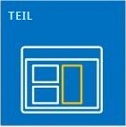
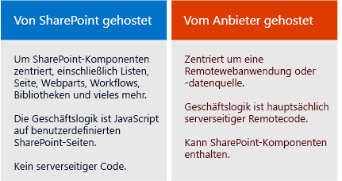

# SharePoint-Add-Ins
SharePoint-Add-Ins sind eigenständige, von Ihnen erstellte Erweiterungen von SharePoint-Websites, die ohne benutzerdefinierten Code auf dem SharePoint-Server ausgeführt werden.
## SharePoint-Add-Ins Übersicht

Es gibt zwei grundlegende Arten von SharePoint-Add-Ins: in SharePoint gehostet und vom Anbieter gehostet. Um die richtige Entscheidung darüber treffen zu können, welche Art Sie für Ihr Szenario entwickeln sollten, machen Sie sich zunächst einmal damit vertraut, was beide Arten von SharePoint-Add-Ins gemeinsam haben.
  
    
    

> **HINWEIS**
> Eine Geräte-App, wie zum Beispiel eine mobile App, ist keine "SharePoint-Add-In" im eigentlichen Sinne, auch wenn sie auf SharePoint zugreift. Das gleiche gilt für eine Webanwendung, die außerhalb von SharePoint gestartet wird. Wenn Sie diese Art von Apps entwickeln möchten, finden Sie weitere Informationen unter  [Zugreifen auf SharePoint aus mobile und systemeigene Gerät apps](http://msdn.microsoft.com/library/42014171-5ee5-421d-9cde-413efc3aecef%28Office.15%29.aspx). 
  
    
    

- **Eine SharePoint-Add-In ist eine eigenständige Funktion**, die die Funktionen von SharePoint-Websites erweitert, um ein klar definiertes Geschäftsproblem zu lösen.
    
  
- **Add-Ins haben keinen benutzerdefinierten Code, der auf SharePoint-Servern ausgeführt wird.** Stattdessen wird die gesamte benutzerdefinierte Logik nach „oben" in die Cloud verschoben bzw. nach „unten" auf Clientcomputer oder „hinüber" auf einen lokalen Server, der sich nicht in der SharePoint-Farm oder in einem SharePoint Online-Abonnement befindet. Da der benutzerdefinierte Code nicht auf den SharePoint-Servern gespeichert wird, können SharePoint-Administrators sicher sein, dass das Add-In den Servern keinen Schaden zufügt oder die Leistung der SharePoint Online-Websites beeinträchtigt.
    
  
- **Die Geschäftslogik in einer SharePoint-Add-In greift über mehrere Client-APIs, die in SharePoint** enthalten sind, auf SharePoint-Daten zu. Welche API Sie für ein Add-In verwenden, hängt von bestimmten Entscheidungen ab, die Sie hinsichtlich des Designs treffen.
    
  
- **Fast alle Haupttypen von SharePoint-Komponenten kann Teil einer SharePoint-Add-In** sein, einschließlich Seiten, Listen, Workflows, benutzerdefinierte Inhaltstypen, Listenvorlagen, Webparts und vieles mehr.
    
  
- **Die SharePoint-Websites, für die SharePoint-Add-Ins installiert sind und von denen aus Benutzer sie starten, heißen Hostweb.** Die SharePoint-Komponenten befinden sich jedoch in der Regel in einem speziellen untergeordneten Web des Hostwebs, das alsAdd-In-Webpart bezeichnet wird.
    
  
- **SharePoint-Add-Ins können auf verschiedene Weise in eine SharePoint-Website integriert werden**:
    
|||
|:-----|:-----|
||**Als übersichtliche ganze Seite**, die das Aussehen und Verhalten einer SharePoint-Seite haben kann.|
||**Als Teil einer Webseite, die ein spezielles Steuerelement verwendet, das als Add-In-Part** bezeichnet wird und mit dem ein iFrame-Element mit dem Add-In verfügbar gemacht wird.|
||**Als Benutzeroberflächenbefehle, die Menübänder und Menüs** für Listen, Dokumente und vieles mehr erweitern.|
   
- **Alle von den Benutzern installierten SharePoint-Add-Ins haben eine Kachel auf der Seite **Websiteinhalte** der SharePoint-Website.** Beim Klicken auf die Kachel wird das Add-In ausgeführt.
    
  
- **Eine SharePoint-Add-In wird durch ein  *Add-In-Manifest*** konfiguriert. Dies ist eine XML-Datei, in der deklariert wird, welche grundlegenden Eigenschaften das Add-In hat, wo es ausgeführt wird und welche Aktion SharePoint beim Starten des Add-Ins ausführen soll. Das Manifest kann unter anderem festlegen, welche Sprachen das Add-In unterstützt, von welchen SharePoint-Diensten und -Funktionen es abhängt und welche Berechtigungen für dasHostweb erforderlich sind, das vom Add-In benötigt wird. (SharePoint-Add-Ins haben Vollzugriff auf ihr eigenesAdd-In-Web.)
    
  
- **Sie verteilen SharePoint-Add-Ins in Add-In-Paketen**, die immer mindestens das Add-In-Manifest enthalten. (Wenn keine SharePoint-Komponenten vorhanden sind, enthält das Add-In-Paket möglicherweise nur das Add-In-Manifest.) Wenn das Add-In SharePoint-Komponenten in einem Add-In-Web hat, sind diese im Paket als ein Satz von XML-Dateien enthalten. Remotekomponenten, die außerhalb von SharePoint gehostet werden, z. B. eine Remotewebanwendung oder eine Datenbank, sind dagegen nicht im Paket enthalten und werden separat vom Add-In-Paket bereitgestellt. (Das Add-In-Manifest gibt jedoch die URLs der Remotekomponenten an.)
    
  
- **Add-In-Pakete können auch Office-Add-Ins enthalten.** Wenn die SharePoint-Add-In installiert wird, wird die Office-Add-In einem Office-Add-Ins-Katalog in SharePoint hinzugefügt. Benutzer können sie aus dem Katalog in Office-Anwendungen wie Word oder Excel installieren.
    
  

> **TIPP**
> **Sehen Sie sich ein Paar SharePoint-Add-Ins im** [Office Store](https://store.office.com/appshome.aspx?productgroup=SharePoint) an, um einen Eindruck zu erhalten, welche Möglichkeiten bei der Entwicklung Sie haben. Sie können auch eine SharePoint 2013-Website aufrufen und einige der kostenlosen SharePoint-Add-Ins installieren. Navigieren Sie einfach zu **Websiteinhalte | ein Add-In hinzufügen | SharePoint Store**. 
  
    
    

### Nachfolgend sind ein paar Hinweise für erfahrene SharePoint-Entwickler aufgeführt

Sandkastenlösungen, der benutzerdefinierten serverseitigen Code enthält, wird nicht mehr verwendet. „No code"- Sandkastenlösungen und Sandkastenlösungen, der nur JavaScript enthält, wird weiterhin unterstützt.
  
    
    
SharePoint-Add-Ins verwenden das serverseitige SharePoint-Objektmodell nicht. Die clientseitigen Objektmodelle wurden in SharePoint 2013 erheblich erweitert. Auch wenn einige APIs im SharePoint-Serverobjektmodell in den Clientobjektmodellen nicht verfügbar sind, handelt es sich nahezu vollständig um verwaltungs- und sicherheitsbezogene Klassen. Benutzerdefinierte SharePoint-Logik, die diese Bereiche berücksichtigt, ist für ein Windows PowerShell-Skript oder eine klassische SharePoint Farmlösung besser geeignet. Weitere Informationen darüber, wie Sie zwischen SharePoint-Add-Ins, klassischen SharePoint Farmlösungen und Sandkastenlösungen eine Auswahl treffen, finden Sie unter  [SharePoint-Add-Ins im Vergleich zu SharePoint-Lösungen](http://msdn.microsoft.com/library/0e9efadb-aaf2-4c0d-afd5-d6cf25c4e7a8%28Office.15%29.aspx).
  
    
    

## Zwei Möglichkeiten zum Verteilen oder Verkaufen eines Add-In-Pakets

Sie haben zwei Möglichkeiten zum Verteilen eines Add-In-Pakets:
  
    
    

- **An einen Add-In-Katalog einer Organsation**, bei dem es sich um eine dedizierte SharePoint-Websitesammlung im SharePoint Online-Abonnement oder eine lokale Farm handelt. Diese Methode wird verwendet, wenn das Add-In speziell für eine bestimmte Organisation erstellt wurde.
    
  
- **An den  [Office Store](https://store.office.com/appshome.aspx?productgroup=SharePoint)**. Der Store übernimmt den Marketingprozess für Sie, von der Erkennung über den Erwerb bis hin zu Updates. Microsoft bietet ein **Verkäufer-Dashboard**, das Sie beim Verkaufen von Add-Ins über den Office Store unterstützt.
    
  
Nachdem Sie das Add-In anhand einer der beiden Möglichkeiten bereitgestellt haben, steht es auf der Seite zum **Hinzufügen eines Add-Ins** auf den SharePoint-Websites zur Verfügung. Wenn das Add-In Berechtigungen für das Hostweb oder das übergeordnete Abonnement benötigt, fordert SharePoint den Benutzer, der das Add-In installiert, zum Gewähren dieser Berechtigungen auf.
  
    
    
Wenn Sie ein Add-In aktualisieren müssen, um einen Fehler zu beheben oder Funktionen hinzuzufügen, nehmen Sie die Änderungen vor, und erhöhen Sie die Versionsnummer des Add-Ins im Manifest. Stellen Sie das Add-In-Paket dann neu im Store oder Add-In-Katalog bereit. Benutzer erhalten innerhalb von 24 Stunden eine Benachrichtigung in der SharePoint-UI, dass ein Update verfügbar ist. Sie können das Update mit nur einem Klick installieren. 
  
    
    

## Zwei Arten von SharePoint-Add-Ins: von SharePoint-gehostet und vom Anbieter gehostet

  
    
    

  
    
    

### SharePoint-hosted SharePoint-Add-Ins

Von SharePoint gehostete Add-Ins bestehen fast nur aus SharePoint-Komponenten in einem Add-In-Web. Daher wird auch gesagt, dass sie ihren „Schwerpunkt" in SharePoint haben.
  
    
    
Wie bei allen SharePoint-Add-Ins kann ein Benutzer ein von SharePoint gehostetes Add-In von einer Kachel auf der Seite **Websiteinhalte** der SharePoint-Websites ausführen, in denen es installiert ist. Optional können auch zwei andere Arten von Benutzeroberflächen-Komponenten im Hostweb vorhanden sein: Add-In-Webparts und benutzerdefinierte Aktionen (d. h. benutzerdefinierte Menübandschaltflächen oder Menübefehle). **Alles andere in einem von SharePoint gehosteten Add-In wird dem Add-In-Web bereitgestellt.** Diese Komponenten werden deklarativ mithilfe von XML-Dateien definiert und können unter anderem Folgendes enthalten:
  
    
    

||||
|:-----|:-----|:-----|
|Benutzerdefinierte Seiten| Workflows|Module (Dateigruppen)|
|Listenvorlagen|Listen- und Bibliotheksinstanzen|Benutzerdefinierte Listenformulare und Ansichten|
|Angepasste Inhaltstypen|Webvorlagen|Integrierte Spalten (keine benutzerdefinierten Spalten)|
|Integrierte Webparts (keine benutzerdefinierten Webparts)|JavaScript-Dateien|Benutzerdefinierte Schaltflächen und Menüelemente für das Add-In-Web|
   

  
    
    
Die gesamte Geschäftslogik in einem von SharePoint gehosteten Add-In verwendet JavaScript, entweder direkt auf einer benutzerdefinierten Seite oder in einer JavaScript-Datei, auf die von einer benutzerdefinierten Seite verwiesen wird. Eine JavaScript-Version des SharePoint-Objektmodells (JSOM) ist verfügbar, damit das Add-In auf einfache Weise CRUD-Vorgänge (Erstellen, Lesen, Aktualisieren und Löschen) für SharePoint-Daten durchführen kann.
  
    
    
Benutzerdefinierte Seiten in einem von SharePoint gehosteten Add-In sind in der Regel ASP.NET-Seiten (ASPX), die deklarativ ASP.NET- und enthaltene SharePoint-Steuerelemente referenzieren können, wobei kein Code-Behind vorhanden sein kann. Sie können die SharePoint-Steuerelemente jedoch über eine clientseitige Renderingoption und ein benutzerdefiniertes JavaScript anpassen.
  
    
    
Das JavaScript in von SharePoint gehosteten Add-Ins kann auf Daten und Ressourcen, die sich außerhalb des Add-In-Webparts befinden, mithilfe einer von zwei Techniken für das sichere Umgehen der Richtlinie des Browsers zum selben Ursprung zugreifen: eine spezielle domänenübergreifende JavaScript-Bibliothek oder eine bestimmte JavaScript-WebProxy-Klasse. Mithilfe dieser Techniken kann ein von SharePoint gehostetes Add-In mit Daten im Hostweb, dem übergeordneten Abonnement oder einem beliebigen Standort im Internet arbeiten.
  
    
    

### Vom Anbieter gehostete SharePoint-Add-Ins

Alle SharePoint-Komponenten, die in einem von SharePoint gehosteten Add-In sein können, können auch in einem von einem Anbieter gehosteten Add-In vorhanden sein. Von einem Anbieter gehostete Add-Ins unterscheiden sich jedoch von in SharePoint gehosteten Add-Ins, da sie mindestens eine Remotekomponente enthalten, z. B. eine Webanwendung, einen Dienst oder eine Datenbank, die außerhalb der SharePoint-Farm oder einem SharePoint Online-Abonnement gehostet werden. Dabei kann es sich um einen Server im selben Unternehmensnetzwerk wie eine SharePoint-Farm oder einen Clouddienst handeln. Die externen Komponenten können in einem beliebigen Webhostingstapel, einschließlich des Linux-, Apache, MySQL- und PHP (LAMP)-Stapels gehostet werden. 
  
    
    

> **HINWEIS**
> **„Anbieter" ist, wer den Server oder das Cloud-Konto besitzt.** Das kann dasselbe Unternehmen oder dieselbe Organisation sein, das bzw. die die SharePoint-Farm oder den SharePoint Online-Mandanten besitzt, in der bzw. dem das Add-In installiert werden soll. Es kann jedoch auch der Entwickler des Add-Ins der Anbieter sein. Wenn ein Add-In für eine Organisation erstellt wird, übernimmt in der Regel diese Organisation das Hosting. Wenn ein Add-In jedoch für mehrere Organisationen erstellt wird, ist es wahrscheinlicher, dass der Entwickler die Remotekomponenten hostet. Das Entwicklerhosting ist verpflichtend, wenn das die SharePoint-Add-In über den Office Store vermarktet wird, da der Entwickler in der Regel keine Kontaktinformationen der Add-In-Käufer hat. In diesem Szenario kennen die verschiedenen Instanzen des Add-Ins den URI der Remotekomponente, da dieser im Add-In-Manifest angegeben ist.
  
    
    

Was das Hosting-Framework betrifft, das Sie für die Remotekomponenten verwenden, haben Sie volle Flexibilität. Sie müssen keinen Microsoft-Stapel verwenden. Es kann jedes Webhosting-Framework verwendet werden, einschließlich LAMP (Linux, Apache-Server, MySQL, PHP), MEAN (MongoDB, ExpressJS, AngularJS, Nodejs), Java, Python und anderen. Sie können außerdem Entwicklungstools verwenden, die nicht von Microsoft stammen. Darüber hinaus können die Remotekomponenten in Cloud-Diensten von anderen Anbietern als Microsoft gehostet werden.
  
    
    
 **Remoteseiten im Add-In können mithilfe eines speziellen Chromsteuerelements das Erscheinungsbild und Verhalten von SharePoint-Seiten erhalten.**
  
    
    
 **Remotedaten können unter anderem Blobs, Caches, Nachrichtenwarteschlangen, Netzwerke für die Inhaltsübermittlung (CDN) und Datenbanken sein.** Datenbanken können einen beliebigen Typ haben, einschließliche relational und objektorientiert. Auf die Remotedaten kann auf verschiedene Weise zugegriffen werden. Sie können beispielsweise Business Connectivity Services (BCS) verwenden, um die Daten in einer SharePoint-Liste bereitzustellen. Eine weitere Option besteht darin, Daten in einem Raster auf einer Seite einer Remotewebanwendung darzustellen.
  
    
    
 **SharePoint-Add-Ins verwenden SharePoint-APIs für die Verbindung und Integration mit SharePoint** -Funktionen wie Suche, Workflow, soziale Netzwerke, Taxonomie, Benutzerprofile, BCS und mehr. Damit können sie Dokumente lesen, Suchen durchführen, Benutzer verbinden und CRUD-Vorgänge ausführen. Es gibt verschiedene Sätze von APIs:
  
    
    

- Wenn die Remotekomponenten mit .NET implementiert werden, ist die Bibliothek des **clientseitigen SharePoint-Objektmodells (CSOM)** mit verwaltetem Code verfügbar.
    
  
- Für Remotekomponenten, die nicht auf .NET basieren, gibt es eine Reihe von **REST-/OData-APIs**, die zum Zugreifen auf SharePoint-Daten verwendet werden können. Diese können auch von einem .NET-Client verwendet werden, wenn Sie das Arbeiten mit einer OData-Schnittstelle bevorzugen.
    
  
- Die **JSOM-Bibliothek**, die weiter oben erwähnt wurde, kann nicht auf einer Remoteseite verwendet werden. Von einem Anbieter gehostete Add-Ins können jedoch benutzerdefinierte SharePoint-Seiten in einem Add-In-Web haben, und JavaScript auf diesen Seiten kann die JSOM-Bibliothek verwenden.
    
  
 **Von einem Anbieter gehostete Add-Ins, die auf SharePoint zugreifen, sind Sicherheitsprinzipale, ebenso wie Benutzer und Gruppen es sind**. Der Add-In-Prinzipal muss ebenso wie der Benutzer authentifiziert und autorisiert werden. Das Add-In benötigt Berechtigungen, um Vorgänge an SharePoint-Daten im Hostweb durchzuführen. In den meisten Szenarien sind die effektiven Berechtigungen eines Benutzers, der mit SharePoint über eine SharePoint-Add-In arbeitet, die Schnittstelle der Berechtigungen des Benutzers und des Add-Ins, obwohl es einige Szenarien gibt, in denen ein Benutzer Aktionen mit einem Add-In ausführen kann, für das er andernfalls keine Berechtigung hätte.
  
    
    
 **Von einem Anbieter gehostete Add-Ins können eine Verbindung zu einem beliebigen internen oder öffentlichen Webdienst herstellen**, und im Gegensatz zu von SharePoint gehosteten Add-Ins können sie **SharePoint-Listen- und -Listenelementereignisse verarbeiten**, z. B. das Hinzufügen eines Elements zu einer Dokumentbibliothek.
  
    
    

## Auswählen des richtigen Weges für die SharePoint-Entwicklung

Sind Sie bereit zu beginnen?
  
    
    

- **Wenn Sie ein erfahrener SharePoint-Entwickler sind, empfehlen wir, mit von SharePoint gehosteten Add-Ins zu beginnen.** Sie sind den Arten von SharePoint-Erweiterungen, die Sie in der Vergangenheit entwickelt haben, am ähnlichsten.
    
     [Erste Schritte beim Erstellen von von SharePoint gehosteten SharePoint-Add-Ins](get-started-creating-sharepoint-hosted-sharepoint-add-ins.md)
    
  
- **Wenn Sie ein erfahrener ASP.NET-Webanwendungsentwickler sind, empfehlen wir, mit von einem Anbieter gehosteten Add-Ins zu beginnen.** Diese werden um Webanwendungen erstellt.
    
     [Erste Schritte beim Erstellen von von einem Anbieter gehosteten SharePoint-Add-Ins](get-started-creating-provider-hosted-sharepoint-add-ins.md)
    
  
- **Wenn Sie ein von einem Anbieter gehostetes Add-In auf einem Stapel eines anderen Anbieters als Microsoft entwickeln möchten, finden Sie im Folgenden Informationen zu den ersten Schritten:**
    
  -  Wenn Sie noch keine passenden Tools für Ihren Stapel haben, installieren Sie die Tools, die für Ihren Stapel geeignet sind.
    
  
  - Richten Sie ein Entwicklerkonto bei Office 365 für Test- und Debuggingzwecke ein. Weitere Informationen finden Sie unter  [Einrichten einer Entwicklungsumgebung für SharePoint-Add-Ins in Office 365](set-up-a-development-environment-for-sharepoint-add-ins-on-office-365.md), oder  [erstellen Sie einfach eine Entwicklerwebsite](create-a-developer-site-on-an-existing-office-365-subscription.md), wenn Sie bereits über ein Office 365-Abonnement verfügen.
    
  
  - Ihr Add-In verwendet SharePoint-REST-/OData-APIs, um CRUD-Vorgänge an SharePoint-Daten auszuführen:
    
  - Die erläuternde Dokumentation finden Sie im Artikel  [Einführung in den SharePoint 2013 REST-Dienst](get-to-know-the-sharepoint-2013-rest-service.md) und unter den darin enthaltenen Links zu anderen Artikeln.
    
  
  - Die Referenzdokumentation finden Sie unter  [REST-API-Referenz für SharePoint 2013](http://msdn.microsoft.com/library/3514e753-19f9-4b41-a1ae-f35c5ffc17d2%28Office.15%29.aspx).
    
  
  - Wenn Sie Visual Studio nicht verwenden, müssen Sie die Add-In-Manifestdatei und das Add-In-Paket erstellen. Informationen dazu finden Sie unter  [Hinweise zur App-Manifeststruktur und zum Paket eines SharePoint-Add-Ins](explore-the-app-manifest-structure-and-the-package-of-a-sharepoint-add-in.md). Die Verwendung von Visual Studio und Microsoft Office-Entwicklertools für Visual Studio zum Erstellen der Manifestdatei und des Pakets bietet viele zeitsparende Vorteile. Wir empfehlen, diese in Betracht zu ziehen, selbst wenn Sie für die Erstellung der Remotewebanwendung selbst ein anderes Tool verwenden. Die  [Community-Eedition von Visual Studio](https://www.visualstudio.com/news/vs2013-community-vs.aspx) ist kostenlos.
    
  
  - Es gibt Beispiele für von einem Anbieter gehostete Add-Ins für einige nicht von Microsoft stammende Sprachen und Plattformen im  [OfficeDev-Abschnitt auf GitHub](https://github.com/OfficeDev), z. B.  [PHP-App-for-SharePoint](https://github.com/OfficeDev/PHP-App-for-SharePoint).
    
  

> **HINWEIS**
> Wenn Sie Anfänger in der SharePoint- und Webentwicklung sind, profitieren Sie am meisten, wenn Sie mit dem kostenlosen Kurs der Microsoft Virtual Academy oder einem Buch zur SharePoint 2013-Entwicklung beginnen. 
  
    
    

## Siehe auch

#### Weitere Ressourcen

  
    
    
 [Schnellstart zum Entwickeln von Microsoft SharePoint Server 2013-Core-Lösungen](http://www.microsoftvirtualacademy.com/training-courses/developing-microsoft-sharepoint-server-2013-core-solutions-jump-start)
