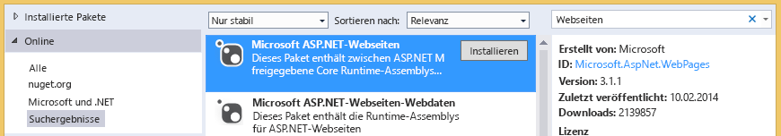

# Problembehandlung in Dokumentbibliotheken
In diesem Thema erfahren Sie von Problemen, die auftreten können, wenn Sie von einem Cloud-Geschäfts-Add-In auf eine SharePoint-Dokumentbibliothek zugreifen, und mit welchen Techniken Sie diese Probleme beheben können.

  
    
    

## Fehler: Dieses Add-In unterstützt nicht das Hochladen von Dokumenten aus dem aktuellen Browser

Wenn Sie ein Dokument in eine verbundene Dokumentbibliothek in einem Cloud-Geschäfts-Add-In hochladen wollen, scheitert der Versuch mit folgender Fehlermeldung: "Dieses Add-In unterstützt nicht das Hochladen von Dokumenten aus dem aktuellen Browser. Verwenden Sie die neueste Version." Dieses Problem tritt nur bei einigen älteren Browsern auf, die die HTML5 FileReader-API nicht unterstützen. Fügen Sie das NuGet-Paket zu Ihrem Projekt hinzu, und stellen Sie das Add-In erneut bereit, um das Problem zu beheben.
  
    
    

### So verhindern Sie den Fehler

1. Öffnen Sie in **Projektmappen-Explorer** das Kontextmenü für das **Server**-Projekt, und wählen Sie **NuGet-Pakete verwalten**.
    
  
2. Erweitern Sie im Dialogfeld **NuGet-Pakete verwalten** den Knoten **Online**, und geben Sie dann im Feld **Online suchen** Webseiten, wie es Abbildung 1 zeigt.
    
   **Abbildung 1: Auswahl im Dialogfeld "NuGet-Pakete verwalten"**

  

     
  

  

  
3. Wählen Sie in der Ergebnisliste den Eintrag **Microsoft ASP.NET-Webseiten**, und klicken Sie dann auf **Installieren**.
    
    Das Dialogfeld **Lizenzzustimmung** wird geöffnet.
    
  
4. Prüfen Sie unter **Lizenzzustimmung** die Lizenzbedingungen. Klicken Sie auf **Annehmen**, wenn Sie den Bedingungen zustimmen.
    
  
5. Wenn das Paket fertig installiert ist, klicken Sie auf **Schließen**.
    
  
6. Veröffentlichen Sie das aktualisierte Add-In auf Ihrer SharePoint-Website.
    
  

## Zusätzliche Ressourcen

-  [Zuordnen einer Dokumentbibliothek zu einer Entität](associate-a-document-library-with-an-entity.md)
    
  

