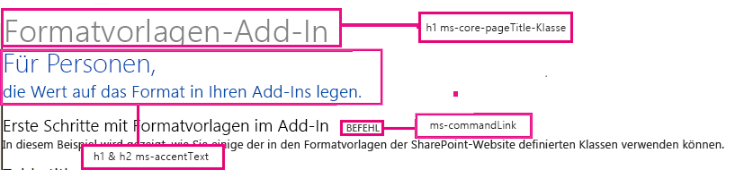

# Verwenden des Stylesheets einer SharePoint-Website in Add-Ins für SharePoint
Informationen zur Verwendung des Stylesheets einer SharePoint-Website in einer SharePoint-Add-In.
Sie können in einer SharePoint-Add-In auf das Stylesheet einer SharePoint-Website verweisen und Ihre Webseiten damit gestalten, indem Sie das Stylesheet in SharePoint verwenden. Wird das Stylesheet oder Design der SharePoint-Website geändert, können Sie die neuen Formatvorlagen in Ihrer App übernehmen, ohne den Verweis auf das Stylesheet in der App zu ändern.
  
    
    


> **WICHTIG**
> Wenn Sie für Ihre Webseiten das Chromsteuerelement oder die App-Masterseite verwenden, sind die Formatvorlagen für Sie bereits verfügbar. Sie müssen dann nicht manuell auf das Stylesheet verweisen, indem Sie das in diesem Artikel beschriebene Verfahren nutzen. 
  
    
    


## Voraussetzungen für die Verwendung der Beispiele in diesem Artikel
<a name="SP15Usestylesheetcontrol_Prereq"> </a>

Sie benötigen eine Entwicklungsumgebung, wie unter  [Erste Schritte beim Erstellen von von einem Anbieter gehosteten SharePoint-Add-Ins](get-started-creating-provider-hosted-sharepoint-add-ins.md) erläutert.
  
    
    

### Kernkonzepte für die Verwendung des SharePoint-Stylesheets in einer SharePoint-Add-In

In der folgenden Tabelle sind Artikel aufgeführt, die Ihnen das Verständnis der relevanten Konzepte in einem Szenario mit Verwendung des SharePoint-Stylesheets erleichtern.
  
    
    

**Tabelle 1. Kernkonzepte für die Verwendung des Stylesheets**


|**Artikeltitel**|**Beschreibung**|
|:-----|:-----|
| [SharePoint-Add-Ins](sharepoint-add-ins.md) <br/> |Erfahren Sie mehr über das neue App-Modell in SharePoint, mit dem Sie Apps, d. h. kleine, einfach zu verwendende Lösungen für Endbenutzer, erstellen können.  <br/> |
| [UX-Design für SharePoint-Add-Ins](ux-design-for-sharepoint-add-ins.md) <br/> |Erfahren Sie mehr über UX-Optionen (User eXperience, Benutzerumgebung) und Alternativen beim Erstellen von SharePoint-Add-Ins.  <br/> |
| [Hostwebsites, Add-In-Websites und SharePoint-Komponenten in SharePoint 2013](host-webs-add-in-webs-and-sharepoint-components-in-sharepoint-2013.md) <br/> |Lernen Sie den Unterschied zwischen Hostwebs und App-Webs kennen. Erfahren Sie, welche SharePoint-Komponenten in eine SharePoint-Add-In eingeschlossen werden können, welche Komponenten im Hostweb und welche im App-Web bereitgestellt werden und wie das App-Web in einer isolierten Domäne bereitgestellt wird.  <br/> |
   

## Codebeispiel: Verwenden des Stylesheets einer SharePoint-Website in einer SharePoint-Add-In
<a name="SP15Usestylesheetcontrol_Example"> </a>

This code example shows you how to use the SharePoint website's stylesheet. This enables your remote web application pages to match the look-and-feel of the pages in the SharePoint host web.
  
    
    
Führen Sie die folgenden Schritte aus, um das Stylesheet in einer SharePoint-Add-In zu verwenden:
  
    
    

1. Erstellen Sie die vom Anbieter gehostete SharePoint-Add-In.
    
  
2. Erzwingen Sie die App-Webbereitstellung, indem Sie eine leere Seite erstellen.
    
  
3. Fügen Sie dem Webprojekt eine Webseite hinzu, und verweisen Sie auf das Stylesheet.
    
  
4. Bearbeiten Sie das Element im App-Manifest.
    
  
In Abbildung 1 ist eine SharePoint-Webseite dargestellt, die das Stylesheet verwendet.
  
    
    

**Abbildung 1. Webseite, die das Stylesheet verwendet**

  
    
    

  
    
    

  
    
    

### So erstellen Sie die Projekte für die App für SharePoint und für das Remoteweb


1. Öffnen Sie Visual Studio als Administrator. (Klicken Sie dazu im **Startmenü** mit der rechten Maustaste auf das Symbol Visual Studio, und wählen Sie **Als Administrator ausführen** aus.)
    
  
2. Erstellen Sie die vom Anbieter gehostete SharePoint-Add-In, wie unter  [Erste Schritte beim Erstellen von von einem Anbieter gehosteten SharePoint-Add-Ins](get-started-creating-provider-hosted-sharepoint-add-ins.md) erläutert, und nennen Sie sieStylesheetAdd-In.
    
  

### So erzwingen Sie die App-Webbereitstellung, indem Sie eine leere Seite erstellen


1. Klicken Sie mit der rechten Maustaste auf das SharePoint-Add-In-Projekt, und fügen Sie ein neues Modul hinzu.
    
  
2. Klicken Sie mit der rechten Maustaste auf das neue Modul, und fügen Sie ein neues Element hinzu.
    
  
3. Wählen Sie **Visual C#-Elemente** und unter **Web** dann die Option **HTML-Seite**. Benennen Sie die Seite in **blank.html** um.
    
  
4. Löschen Sie den Inhalt der Datei "blank.html".
    
  

### So fügen Sie im Webprojekt eine Webseite hinzu, die auf das Stylesheet verweist


1. Klicken Sie mit der rechten Maustaste auf das Webprojekt, und fügen Sie ein neues Web Form hinzu. Benennen Sie das Web Form in **StyleConsumer.aspx** um.
    
  
2. Ersetzen Sie den Inhalt der Web Form-ASPX-Datei durch den folgenden Code. Mit dem Code werden die folgenden Aufgaben durchgeführt:
    
  - Laden der Seite "blank.html" aus dem App-Web in ein unsichtbares IFrame-Element.
    
  
  - Laden der Datei "defaultcss.ashx" aus dem App-Web.
    
  
  - Verwenden der verfügbaren Formatvorlagen.
    
  

  ```
  
<%@ Page Language="C#" AutoEventWireup="true" CodeBehind="StyleConsumer.aspx.cs" Inherits="StylesheetAppWeb.StyleConsumer" %>

<!DOCTYPE html>
<html>
<head>
    <title>Add-in using stylesheet</title>
</head>
<body>

    <!-- The main page title -->
    <h1 class="ms-core-pageTitle">Stylesheet add-in</h1>

    <!-- Some subtitle -->
    <h1 class="ms-accentText">For people</h1>

    <!-- Subtitle comments -->
    <h2 class="ms-accentText">who care about the style in their add-ins</h2>
    <p></p>
    <div>
        <h2 class="ms-webpart-titleText">Get started with style in your add-in... </h2>
        <a class="ms-commandLink" href="#">some command</a>
        <br />
        This sample shows you how to use some of the classes defined in the SharePoint website's style sheet.
    </div>

    <!-- Script to load SharePoint resources
        and load the blank.html page in
        the invisible iframe
        -->
    <script type="text/javascript">
        "use strict";
        var appweburl;

        (function () {
            var ctag;

            // Get the URI decoded add-in web URL.
            appweburl =
                decodeURIComponent(
                    getQueryStringParameter("SPAppWebUrl")
            );
            // Get the ctag from the SPClientTag token.
            ctag =
                decodeURIComponent(
                    getQueryStringParameter("SPClientTag")
            );

            // The resource files are in a URL in the form:
            // web_url/_layouts/15/Resource.ashx
            var scriptbase = appweburl + "/_layouts/15/";

            // Dynamically create the invisible iframe.
            var blankiframe;
            var blankurl;
            var body;
            blankurl = appweburl + "/Pages/blank.html";
            blankiframe = document.createElement("iframe");
            blankiframe.setAttribute("src", blankurl);
            blankiframe.setAttribute("style", "display: none");
            body = document.getElementsByTagName("body");
            body[0].appendChild(blankiframe);

            // Dynamically create the link element.
            var dclink;
            var head;
            dclink = document.createElement("link");
            dclink.setAttribute("rel", "stylesheet");
            dclink.setAttribute("href", scriptbase + "defaultcss.ashx?ctag=" + ctag);
            head = document.getElementsByTagName("head");
            head[0].appendChild(dclink);
        })();

        // Function to retrieve a query string value.
        // For production purposes you may want to use
        //  a library to handle the query string.
        function getQueryStringParameter(paramToRetrieve) {
            var params;
            var strParams;

            params = document.URL.split("?")[1].split("&amp;");
            strParams = "";
            for (var i = 0; i < params.length; i = i + 1) {
                var singleParam = params[i].split("=");
                if (singleParam[0] == paramToRetrieve)
                    return singleParam[1];
            }
        }
    </script>
</body>
</html>

  ```


    In einigen Fällen müssen Benutzer für SharePoint authentifiziert werden, bevor Ihre Seite das CSS und Bilder für die Formaterstellung herunterladen kann. Von Linktags wird nicht automatisch eine Authentifizierung von Benutzern vorgenommen, die nicht bereits angemeldet sind. Sie können eine Seitenressource aus dem App-Web für die Webseite laden, um die Authentifizierung des Benutzers zu erzwingen, bevor Sie eine Verknüpfung mit der CSS-Datei erstellen. In diesem Beispiel wird die Seite "blank.html" in ein unsichtbares IFrame-Element geladen.
    
  

### So bearbeiten Sie das StartPage-Element im App-Manifest


1. Doppelklicken Sie im Projektmappen-Explorer auf die Datei **AppManifest.xml**.
    
  
2. Wählen Sie im Dropdownmenü **Startseite** die Webseite aus, auf der das Stylesheet verwendet wird.
    
  

### So erstellen Sie die Projektmappe und führen sie aus


1. Stellen Sie sicher, dass das "SharePoint-Add-In"-Projekt als Startprojekt festgelegt ist.
    
  
2. Drücken Sie F5.
    
    > **HINWEIS**
      > Wenn Sie F5 drücken, erstellt Visual Studio die Lösung, stellt die App bereit und öffnet die Berechtigungsseite für die App. 
3. Klicken Sie auf die Schaltfläche **Vertrauen**.
    
  
4. Klicken Sie auf das App-Symbol **StylesheetBasic**.
    
  
5. In Abbildung 2 ist die mit SharePoint-Formatvorlagen erstellte Webseite dargestellt.
    
   **Abbildung 2: Auf der Seite verwendetes Stylesheet**

  

!\[Auf Webseite verwendetes Stylesheet-Steuerelement](images/StylesheetControl_result2.png)
  

  

  
6. Sie können auch zum Hostweb wechseln und das Design ändern. Laden Sie anschließend die Webseite der App neu, damit die neuen Formatvorlagen verwendet werden.
    
  

**Tabelle 2. Problembehandlung für die Projektmappe**


|**Problem**|**Lösung**|
|:-----|:-----|
|Visual Studio wird nicht geöffnet, nachdem Sie F5 gedrückt haben.  <br/> |Legen Sie das SharePoint-Add-In-Projekt als Startprojekt fest.  <br/> |
|Zertifikatfehler  <br/> |Legen Sie die Eigenschaft **SSL-aktiviert** des Webprojekts auf "false" fest. Legen Sie im SharePoint-Add-In-Projekt die Eigenschaft **Webprojekt** aufKein fest, und setzen Sie die Eigenschaft dann wieder auf den Namen des Webprojekts. <br/> |
   

## Nächste Schritte
<a name="SP15Usestylesheetcontrol_Nextsteps"> </a>

In diesem Artikel wurde die Verwendung des Stylesheets in einer SharePoint-Add-In erläutert. Als Nächstes können Sie andere verfügbare UX-Komponenten für SharePoint-Add-Ins kennen lernen. Weitere Informationen finden Sie in den folgenden Ressourcen:
  
    
    

-  [Codebeispiel: Verwenden des SharePoint-Stylesheets in einer App](http://code.msdn.microsoft.com/SharePoint-2013-Use-the-7a8684e2)
    
  
-  [Verwenden des Client-Chromsteuerelements in Add-Ins für SharePoint](use-the-client-chrome-control-in-sharepoint-add-ins.md)
    
  
-  [Gewusst wie: Erstellen benutzerdefinierter Aktionen zur Bereitstellung mit Add-Ins für SharePoint](create-custom-actions-to-deploy-with-sharepoint-add-ins.md)
    
  
-  [Erstellen von Add-In-Webparts zur Installation mit Ihrem SharePoint-Add-In](create-add-in-parts-to-install-with-your-sharepoint-add-in.md)
    
  

## Zusätzliche Ressourcen
<a name="SP15Usestylesheetcontrol_Addresources"> </a>


-  [UX-Design für SharePoint-Add-Ins](ux-design-for-sharepoint-add-ins.md)
    
  
-  [Designrichtlinien für die Benutzerfreundlichkeit von Add-Ins für SharePoint](sharepoint-add-ins-ux-design-guidelines.md)
    
  
-  [Erstellen von UX-Komponenten in SharePoint 2013](create-ux-components-in-sharepoint-2013.md)
    
  
-  [Drei Ansätze, um Entwurfsentscheidungen für Add-Ins für SharePoint zu treffen](three-ways-to-think-about-design-options-for-sharepoint-add-ins.md)
    
  
-  [Wichtige Aspekte der Architektur und Entwicklungslandschaft von Add-Ins für SharePoint](important-aspects-of-the-sharepoint-add-in-architecture-and-development-landscap.md)
    
  

