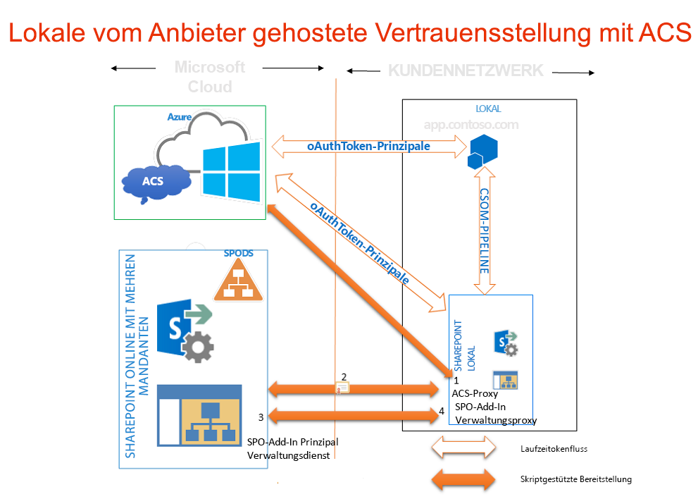

# Verwenden einer Office 365 SharePoint-Website, um vom Anbieter gehostete Add-Ins auf einer lokalen SharePoint-Website zu autorisieren
Verwenden Sie eine Office 365-SharePoint-Website, um eine Umgebung zu erstellen, in der Sie ACS zur Einrichtung einer Vertrauensstellung zwischen einem vom Anbieter gehosteten Add-In und einer lokalen SharePoint 2013-Farm verwenden, wie Sie dies tun würden, wenn Sie Add-Ins für eine Office 365-SharePoint-Website entwickeln würden.
## Voraussetzungen für die Verwendung von ACS mit vom Anbieter gehosteten Add-Ins in lokalen Umgebungen
<a name="Prerequisites"> </a>

Sorgen Sie dafür, dass Sie über Folgendes verfügen.
  
    
    

- Eine lokale SharePoint 2013-Entwicklungsumgebung. Siehe  [Einrichten einer lokalen Entwicklungsumgebung für SharePoint-Add-Ins](set-up-an-on-premises-development-environment-for-sharepoint-add-ins.md).
    
  
- Eine Office 365-SharePoint-Website. Wenn Sie noch keine haben und schnell eine Entwicklungsumgebung einrichten möchten, finden Sie Hilfe unter  [Einrichten einer Entwicklungsumgebung für SharePoint-Add-Ins in Office 365](set-up-a-development-environment-for-sharepoint-add-ins-on-office-365.md).
    
  
-  [Visual Studio 2012](https://www.microsoft.com/de-de/download/details.aspx?id=30682), entweder remote oder auf dem Computer installiert, auf dem Sie SharePoint 2013 installiert haben.
    
  
-  [Microsoft Office Developer Tools für Visual Studio 2012](https://msdn.microsoft.com/de-de/office/aa905340.aspx).
    
  
- Die 64-Bit-Edition von  [Microsoft Online Services-Anmeldeassistent.](http://www.microsoft.com/de-de/download/details.aspx?id=41950), auf dem Computer installiert, auf dem Sie SharePoint 2013 installiert haben.
    
  
-  [Microsoft Online Services-Modul für Windows Powershell (64-bit)](http://go.microsoft.com/fwlink/p/?linkid=236297), installiert auf dem Computer, auf dem Sie SharePoint 2013 installiert haben.
    
  

## Erstellen eines Zertifikats und es zum Sicherheitstokendienst-Zertifikat Ihrer lokalen Installation von SharePoint 2013 machen
<a name="Certificate"> </a>

Sie müssen das standardmäßige Sicherheitstokendienst-Zertifikat Ihrer lokalen Installation von SharePoint 2013 durch Ihr eigenes Zertifikat ersetzen. In diesem Artikel finden Sie ein Beispiel, wie Sie mithilfe der Option **Selbstsigniertes Zertifikat erstellen** in IIS ein Testzertifikat erstellen und exportieren. Sie können auch ein kommerzielles Zertifikat verwenden, das von einer Zertifikatsstelle ausgestellt wurde.
  
    
    
 [Erstellen Sie zuerst eine PFX-Zertifikatstestdatei, und dann eine entsprechende CER-Testdatei](http://msdn.microsoft.com/de-de/library/windows/hardware/ff552299%28v=vs.85%29.aspx).
  
    
    
 [Sie können auch das MakeCert-Testprogramm verwenden, um ein X.509-Testzertifikat zu erstellen](http://msdn.microsoft.com/de-de/library/ms537364%28VS.85%29.aspx).
  
    
    

### So erstellen Sie eine PFX-Zertifikatstestdatei


1. Wählen Sie im IIS-Manager in der Strukturansicht links den Knoten  _ServerName_ aus.
    
  
2. Wählen Sie **Serverzertifikate** aus, wie in Abbildung 1 dargestellt.
    
   **Abbildung 1. Option "Serverzertifikate" in IIS**

  

!\[Option "Serverzertifikate" in IIS](images/e38f9b7f-59a3-468c-bcde-a48272f1f217.gif)
  

  

  
3. Klicken Sie in der Gruppe mit den Links auf der rechten Seite auf den Link **Selbstsigniertes Zertifikat erstellen**, wie in Abbildung 2 dargestellt.
    
   **Abbildung 2. Erstellen eines Link zu einem selbstsignierten Zertifikat**

  

!\[Verknüpfung "Selbstsigniertes Zertifikat erstellen"](images/3f0aae5a-e58b-4ec8-b67f-0024abfa2dab.gif)
  

  

  
4. Geben Sie dem Zertifikat den Namen Beispielzert, und wählen Sie dann **OK** aus.
    
  
5. Klicken Sie mit der rechten Maustaste auf das Zertifikat, und wählen Sie dann **Exportieren aus**, wie in Abbildung 3 dargestellt.
    
   **Abbildung 3. Exportieren eines Testzertifikats**

  

!\[Exportieren eines Testzertifikats](images/997021de-c60c-46b0-961f-7e1e63c0f619.gif)
  

  

  
6. Exportieren Sie die Datei an einen gewünschten Speicherort, und vergeben Sie ein Kennwort. In diesem Beispiel lautet das Kennwort nur der Einfachheit halber **Kennwort**. Verwenden Sie in einer Produktionsumgebung ein sicheres Kennwort. Siehe [Richtlinien für die Erstellung sicherer Kennwörter](http://msdn.microsoft.com/de-de/library/bb416446.aspx) und [Sichere Kennwörter](http://msdn.microsoft.com/de-de/library/ms161962.aspx).
    
  

## Ihr Zertifikat zum Sicherheitstokendienst-Zertifikat für Ihre lokale Installation von SharePoint 2013 machen
<a name="STSCertificate"> </a>

Nachdem Sie jetzt ein Zertifikat haben, können Sie es zum Sicherheitstokendienst-Zertifikat für Ihre lokale SharePoint-Farm machen.
  
    
    
Öffnen Sie SharePoint-Verwaltungsshell als Administrator, und führen Sie dieses Windows PowerShell-Skript aus.
  
    
    


```

$certPrKPath = "c:\\location of your .pfx file"
$certPassword = "password"
$stsCertificate = New-Object System.Security.Cryptography.X509Certificates.X509Certificate2 $certPrKPath, $certPassword, 20
Set-SPSecurityTokenServiceConfig -ImportSigningCertificate $stsCertificate -confirm:$false

```


> **HINWEIS**
> Im Dokument  [Configure a one-way hybrid environment with SharePoint Server 2013 and Office 365](http://download.microsoft.com/download/6/4/4/644BA525-96CB-4739-B08F-18949A9BDADC/sps-2013-config-one-way-hybrid-environment.docx), das auf der  [Seite mit SharePoint 2013-Hybridressourcen](http://www.microsoft.com/de-de/download/details.aspx?id=35593) zum Download verfügbar ist, wird ausführlicher erläutert, wie Sie das standardmäßige Sicherheitstokendienst-Zertifikat Ihrer lokalen Farm durch ein Zertifikat von einer bekannten Zertifikatsstelle oder ein selbstsigniertes Zertifikat ersetzen.
  
    
    


## Konfigurieren Ihrer lokalen Installation von SharePoint 2013 für die Verwendung von ACS
<a name="ConnectAAD"> </a>

Abbildung 4 zeigt die vier Schritte, um die Verbindungen zu aktivieren, die Sie in der Gesamtarchitektur eines vom Anbieter gehosteten Add-Ins benötigen, das auf einer lokalen Website ausgeführt wird. Sie zeigt außerdem den Fluss von OAuth-Token, wenn das Add-In ausgeführt wird.
  
    
    

**Abbildung 4. Verwenden von ACS mit einer lokalen Installation von SharePoint mithilfe einer Office 365 SharePoint-Website**

  
    
    

  
    
    

  
    
    

  
    
    

1. Erstellen Sie in Ihrer lokalen SharePoint 2013-Farm einen ACS-Proxy.
    
  
2. Installieren Sie das Signaturzertifikat Ihres lokalen Servers auf Ihrem Office 365-Mandanten.
    
  
3. Fügen Sie die vollständig qualifizierten Domänennamen auf Ihrer SharePoint 2013-Farm, auf der Sie Add-Ins ausführen möchten, der Sammlung der Dienstprinzipalnamen auf Ihrem Office 365-Mandanten hinzu.
    
  
4. Erstellen Sie in Ihrer SharePoint 2013-Farm einen Add-In-Verwaltungsproxy.
    
  
Mithilfe der unten stehenden Funktion lässt sich Ihre lokale SharePoint 2013-Website für die Verwendung von ACS konfigurieren. Sie können mit dieser Funktion auch einige Bereinigungsaufgaben durchführen, wenn Sie frühere Konfigurationen entfernen müssen. Es gibt verschiedene Möglichkeiten, die Funktion in PowerShell auszuführen. Hier eine Option:
  
    
    

  
    
    

1. Kopieren Sie auf dem lokalen SharePoint-Server den Code der Funktion in eine Textdatei, und speichern Sie diese unter dem Namen "MySharePointFunctions.psm1" in einem der beiden folgenden Ordner (nicht in beiden Ordnern). Sie müssen möglicherweise Teile des Pfads erstellen, wenn dieser noch nicht vorhandene Ordner enthält. Beachten Sie in beiden Fällen, dass der unterste Ordner im Pfad den gleichen Namen wie die Datei haben muss.
    
    > **TIPP**
      > Die Datei muss im ANSI-Format, nicht im UTF-8-Format, gespeichert werden. Es kann sein, dass PowerShell Syntaxfehler ausgibt, wenn eine Datei in einem anderen Format als ANSI hochgeladen wird. Windows Editor speichert sie standardmäßig im ANSI-Format. Wenn Sie zum Speichern der Datei einen anderen Editor verwenden, achten Sie darauf, die Datei im ANSI-Format zu speichern. 

  -  `C:\\users\\username\\documents\\windowspowershell\\modules\\MySharePointFunctions`, wobei  _username_ für den Farmadministrator steht, der die Datei ausführt.
    
  
  -  `C:\\windows\\system32\\windowspowershell\\V1.0\\modules\\MySharePointFunctions`
    
  
2. Öffnen Sie SharePoint-Verwaltungsshell als Administrator, und führen Sie das folgende Cmdlet aus, um sicherzustellen, dass das MySharePointFunctions-Modul aufgeführt wird.
    
  ```
  
Get-Module -listavailable
  ```

3. Führen Sie das folgende Cmdlet aus, um das Modul zu importieren.
    
  ```
  Import-Module MySharePointFunctions
  ```

4. Führen Sie das folgende Cmdlet aus, um sicherzustellen, dass die Connect-SPFarmToAAD-Funktion als Teil des Moduls aufgeführt wird:
    
  ```
  Get-Command -module MySharePointFunctions
  ```

5. Führen Sie das folgende Cmdlet aus, um sicherzustellen, dass die Connect-SPFarmToAAD-Funktion geladen ist.
    
  ```
  ls function:\\ | where {$_.Name -eq "Connect-SPFarmToAAD"}
  ```

6. Führen Sie die  `Connect-SPFarmToAAD`-Funktion aus. Geben Sie die erforderlichen Parameter und alle optionalen Parameter an, die sich auf Ihre Entwicklerumgebung beziehen. Im nächsten Abschnitt finden Sie nähere Informationen und Beispiele.
    
  

  
    
    

### Parameter der Connect-SPFarmToAAD-Funktion
<a name="parameters"> </a>


|**Parameter**|**Wert**|
|:-----|:-----|
| `-AADDomain` (erforderlich) <br/> |Die *.onmicrosoft.com-Domäne, die Sie erstellt haben, als Sie Ihre Office 365-Website ( _yourcustomdomain_.onmicrosoft.com) registriert haben. Wenn Sie das Skript zur Authentifizierung auffordert, verwenden Sie den Benutzernamen und das Kennwort, das Sie für diese Domäne erstellt haben:  _username_@ _yourcustomdomain_.onmicrosoft.com.  <br/> |
| `-SharePointOnlineUrl` (erforderlich) <br/> |Die URL Ihrer Office 365-SharePoint-Website ( _https://yourcustomdomain_.sharepoint.com). Beachten Sie, dass die übergeordnete Domäne  *nicht*  onmicrosoft.com ist. <br/> |
| `-SharePointWeb` (manchmal erforderlich) <br/> |Die vollständige URL (einschließlich des Protokolls) der lokalen SharePoint-Webanwendung, unter der Sie vom Anbieter gehostete Add-Ins ausführen. Diese Funktion fügt nur eine SharePoint-Webanwendung von Ihrer lokalen Farm zu ACS hinzu. Wenn Sie keinen Wert dafür angeben, wählt das Skript die erste Webanwendung in Ihrer Farm aus. Wenn Sie eine Hostname-Websitesammlung verwenden, die mit einem Platzhalter (wie  _http://*.contoso.com_) definiert werden kann, können Sie diese Zeichenfolge als Wert für diesen Parameter verwenden. Wenn die Webanwendung über eine alternative Zugriffszuordnung (Alternative Access Mapping, AAM) für die Internetzone verfügt, müssen Sie diese AAM-URL für diesen Parameter verwenden. Wenn die SharePoint-Webanwendung nicht für HTTPS konfiguriert ist, müssen Sie HTTP als Protokoll verwenden, und  *Sie müssen den -AllowOverHttp-Switch verwenden (siehe unten in dieser Tabelle).*  <br/> Wenn Sie vom Anbieter gehostete Add-Ins ausführen möchten, die ACS auf mehreren Webanwendungen in Ihrer Farm verwenden, müssen Sie sie zur Sammlung der Dienstprinzipalnamen hinzufügen. Das unten stehende Windows PowerShell-Skript, das der  `Connect-SPFarmToAAD`-Funktion folgt, zeigt Ihnen, wie Sie alle Webanwendungen in Ihrer Farm zur Sammlung der Dienstprinzipalnamen hinzufügen.  <br/> |
| `-AllowOverHttp` (optional) <br/> |Verwenden Sie diesen Switch, wenn Sie mit einer Entwicklerumgebung arbeiten und für Ihre Add-Ins kein SSL verwenden möchten. Sie müssen diesen Switch verwenden, wenn die SharePoint-Webanwendung nicht für HTTPS konfiguriert ist.  <br/> |
| `-O365Credentials` (optional) <br/> |Das erste Zeichen ist ein großgeschriebenes "O", keine null. Wenn Sie das Skript immer wieder zum Debuggen ausführen, bietet Ihnen dieser Switch den Vorteil, nicht jedes Mal Ihren O365-Namen und Ihr Kennwort manuell eingeben zu müssen. Bevor Sie diesen Parameter verwenden können, müssen Sie das Anmeldedatenobjekt erstellen, das Sie ihm mit diesen Cmdlets zuweisen:  <br/> ```$User = "username@yourcustomdomain.onmicrosoft.com"$PWord = ConvertTo-SecureString -String "the_password" -AsPlainText -Force$Credential = New-Object -TypeName System.Management.Automation.PSCredential -ArgumentList $User, $PWord```Verwenden Sie  `$Credential` als Wert des `-O365Credentials`-Parameters.  <br/> |
| `-Verbose` (optional) <br/> |Dieser Switch generiert ausführlicheres Feedback, das hilfreich sein kann, wenn die Funktion nicht verwendet werden kann und Sie sie zum Debuggen erneut ausführen müssen.  <br/> |
| `-RemoveExistingACS` (optional) <br/> |Verwenden Sie diesen Switch, wenn Sie eine bestehende Verbindung zu Microsoft Azure Active Directory ersetzen. Er entfernt einen bestehenden ACS-Proxy, wenn Sie in Ihrer Farm bereits einen erstellt haben.  <br/> |
| `-RemoveExistingSTS` (optional) <br/> |Verwenden Sie diesen Switch, wenn Sie eine bestehende Verbindung zu Microsoft Azure Active Directory ersetzen. Er entfernt einen bestehenden vertrauenswürdigen Sicherheitstokenaussteller, der aus einer früheren Verbindung zu ACS stammt.  <br/> |
| `-RemoveExistingSPOProxy` (optional) <br/> |Verwenden Sie diesen Switch, wenn Sie eine bestehende Verbindung zu Microsoft Azure Active Directory ersetzen. Er entfernt einen bestehenden Add-In-Verwaltungsproxy, wenn Sie in Ihrer Farm bereits einen erstellt haben.  <br/> |
| `-RemoveExistingAADCredentials` (optional) <br/> |Verwenden Sie diesen Switch, wenn Sie die Office 365-SharePoint-Website ersetzen.  <br/> |
   
Es folgen Beispiele:
  
    
    

```

Connect-SPFarmToAAD -AADDomain 'MyO365Domain.onmicrosoft.com' -SharePointOnlineUrl https://MyO365Domain.sharepoint.com

Connect-SPFarmToAAD -AADDomain 'MyO365Domain.onmicrosoft.com' -SharePointOnlineUrl https://MyO365Domain.sharepoint.com -SharePointWeb https://fabrikam.com

Connect-SPFarmToAAD -AADDomain 'MyO365Domain.onmicrosoft.com' -SharePointOnlineUrl https://MyO365Domain.sharepoint.com -SharePointWeb http://northwind.com -AllowOverHttp

Connect-SPFarmToAAD -AADDomain 'MyO365Domain.onmicrosoft.com' -SharePointOnlineUrl https://MyO365Domain.sharepoint.com -SharePointWeb http://northwind.com -AllowOverHttp -RemoveExistingACS -RemoveExistingSTS -RemoveExistingSPOProxy -RemoveExistingAADCredentials

```


### Skript der Connect-SPFarmToAAD-Funktion
<a name="function"> </a>


```

function Connect-SPFarmToAAD {
param(
    [Parameter(Mandatory)][String]   $AADDomain,
    [Parameter(Mandatory)][String]   $SharePointOnlineUrl,
    #Specify this parameter if you don't want to use the default SPWeb returned
    [Parameter()][String]            $SharePointWeb,
    [Parameter()][System.Management.Automation.PSCredential] $O365Credentials,
    #Use these switches if you're replacing an existing connection to AAD.
    [Parameter()][Switch]            $RemoveExistingACS,
    [Parameter()][Switch]            $RemoveExistingSTS,
    [Parameter()][Switch]            $RemoveExistingSPOProxy,
    #Use this switch if you're replacing the Office 365 SharePoint site.
    [Parameter()][Switch]            $RemoveExistingAADCredentials,
    #Use this switch if you don't want to use SSL when you launch your app.
    [Parameter()][Switch]            $AllowOverHttp
)
    #Prompt for credentials right away.
    if (-not $O365Credentials) {
        $O365Credentials = Get-Credential -Message "Admin credentials for $AADDomain"
    }
    Add-PSSnapin Microsoft.SharePoint.PowerShell
    #Import the Microsoft Online Services Sign-In Assistant.
    Import-Module -Name MSOnline
    #Import the Microsoft Online Services Module for Windows Powershell.
    Import-Module MSOnlineExtended -force -verbose 
    #Set values for Constants.
    New-Variable -Option Constant -Name SP_APPPRINCIPALID -Value '00000003-0000-0ff1-ce00-000000000000' | Out-Null
    New-Variable -Option Constant -Name ACS_APPPRINCIPALID -Value '00000001-0000-0000-c000-000000000000' | Out-Null
    New-Variable -Option Constant -Name ACS_APPPROXY_NAME -Value ACS
    New-Variable -Option Constant -Name SPO_MANAGEMENT_APPPROXY_NAME -Value 'SPO Add-in Management Proxy'
    New-Variable -Option Constant -Name ACS_STS_NAME -Value ACS-STS
    New-Variable -Option Constant -Name AAD_METADATAEP_FSTRING -Value 'https://accounts.accesscontrol.windows.net/{0}/metadata/json/1'
    New-Variable -Option Constant -Name SP_METADATAEP_FSTRING -Value '{0}/_layouts/15/metadata/json/1'
    #Get the default SPWeb from the on-premises farm if no $SharePointWeb parameter is specified.
    if ([String]::IsNullOrEmpty($SharePointWeb)) {
        $SharePointWeb = Get-SPSite | Select-Object -First 1 | Get-SPWeb | Select-Object -First 1 | % Url
    }

    #Configure the realm ID for local farm so that it matches the AAD realm.
    $ACSMetadataEndpoint = $AAD_METADATAEP_FSTRING -f $AADDomain
    $ACSMetadata = Invoke-RestMethod -Uri $ACSMetadataEndpoint
    $AADRealmId = $ACSMetadata.realm

    Set-SPAuthenticationRealm -ServiceContext $SharePointWeb -Realm $AADRealmId
    
    $LocalSTS = Get-SPSecurityTokenServiceConfig
    $LocalSTS.NameIdentifier = '{0}@{1}' -f $SP_APPPRINCIPALID,$AADRealmId
    $LocalSTS.Update()

    #Allow connections over HTTP if the switch is specified.
    if ($AllowOverHttp.IsPresent -and $AllowOverHttp -eq $True) {
        $serviceConfig = Get-SPSecurityTokenServiceConfig
        $serviceConfig.AllowOAuthOverHttp = $true
        $serviceConfig.AllowMetadataOverHttp = $true
        $serviceConfig.Update()
    }

    #Step 1: Set up the ACS proxy in the on-premises SharePoint farm. Remove the existing ACS proxy
    #if the switch is specified.
    if ($RemoveExistingACS.IsPresent -and $RemoveExistingACS -eq $True) {
        Get-SPServiceApplicationProxy | ? DisplayName -EQ $ACS_APPPROXY_NAME | Remove-SPServiceApplicationProxy -RemoveData -Confirm:$false
    }
    if (-not (Get-SPServiceApplicationProxy | ? DisplayName -EQ $ACS_APPPROXY_NAME)) {
        $AzureACSProxy = New-SPAzureAccessControlServiceApplicationProxy -Name $ACS_APPPROXY_NAME -MetadataServiceEndpointUri $ACSMetadataEndpoint -DefaultProxyGroup
    }

    #Remove the existing security token service if the switch is specified.
    if ($RemoveExistingSTS.IsPresent) {
        Get-SPTrustedSecurityTokenIssuer | ? Name -EQ $ACS_STS_NAME | Remove-SPTrustedSecurityTokenIssuer -Confirm:$false
    }
    if (-not (Get-SPTrustedSecurityTokenIssuer | ? DisplayName -EQ $ACS_STS_NAME)) {
        $AzureACSSTS = New-SPTrustedSecurityTokenIssuer -Name $ACS_STS_NAME -IsTrustBroker -MetadataEndPoint $ACSMetadataEndpoint
    }

    #Update the ACS Proxy for OAuth authentication.
    $ACSProxy = Get-SPServiceApplicationProxy | ? Name -EQ $ACS_APPPROXY_NAME
    $ACSProxy.DiscoveryConfiguration.SecurityTokenServiceName = $ACS_APPPRINCIPALID
    $ACSProxy.Update()

    #Retrieve the local STS signing key from JSON metadata.
    $SPMetadata = Invoke-RestMethod -Uri ($SP_METADATAEP_FSTRING -f $SharePointWeb)
    $SPSigningKey = $SPMetadata.keys | ? usage -EQ "Signing" | % keyValue
    $CertValue = $SPSigningKey.value
    
    #Connect to Office 365.
    Connect-MsolService -Credential $O365Credentials
    #Remove existing connection to an Office 365 SharePoint site if the switch is specified.
    if ($RemoveExistingAADCredentials.IsPresent -and $RemoveExistingAADCredentials -eq $true) {
        $msolserviceprincipal = Get-MsolServicePrincipal -AppPrincipalId $SP_APPPRINCIPALID
        [Guid[]] $ExistingKeyIds = Get-MsolServicePrincipalCredential -ObjectId $msolserviceprincipal.ObjectId -ReturnKeyValues $false | % {if ($_.Type -ne "Other") {$_.KeyId}}
        Remove-MsolServicePrincipalCredential -AppPrincipalId $SP_APPPRINCIPALID -KeyIds $ExistingKeyIds
    }
    #Step 2: Upload the local STS signing certificate
    New-MsolServicePrincipalCredential -AppPrincipalId $SP_APPPRINCIPALID -Type Asymmetric -Value $CertValue -Usage Verify

    #Step 3: Add the service principal name of the local web application, if necessary.
    $indexHostName = $SharePointWeb.IndexOf('://') + 3
    $HostName = $SharePointWeb.Substring($indexHostName)
    $NewSPN = '{0}/{1}' -f $SP_APPPRINCIPALID, $HostName
    $SPAppPrincipal = Get-MsolServicePrincipal -AppPrincipalId $SP_APPPRINCIPALID
    if ($SPAppPrincipal.ServicePrincipalNames -notcontains $NewSPN) {
        $SPAppPrincipal.ServicePrincipalNames.Add($NewSPN)
        Set-MsolServicePrincipal -AppPrincipalId $SPAppPrincipal.AppPrincipalId -ServicePrincipalNames $SPAppPrincipal.ServicePrincipalNames
    }

    #Remove the existing SharePoint Online proxy if the switch is specified.
    if ($RemoveExistingSPOProxy.IsPresent -and $RemoveExistingSPOProxy -eq $True) {
        Get-SPServiceApplicationProxy | ? DisplayName -EQ $SPO_MANAGEMENT_APPPROXY_NAME | Remove-SPServiceApplicationProxy -RemoveData -Confirm:$false
    }
    #Step 4: Add the SharePoint Online proxy
    if (-not (Get-SPServiceApplicationProxy | ? DisplayName -EQ $SPO_MANAGEMENT_APPPROXY_NAME)) {
        $spoproxy = New-SPOnlineApplicationPrincipalManagementServiceApplicationProxy -Name $SPO_MANAGEMENT_APPPROXY_NAME -OnlineTenantUri $SharePointOnlineUrl -DefaultProxyGroup
    }  
}
```


### Konfigurieren des Add-Ins und der SharePoint-Webanwendung für den Office Store
<a name="function"> </a>

Es gibt einen optionalen Konfigurationsschritt, den Farmadministratoren in Produktionsumgebungen vornehmen sollten, wenn Benutzer dazu in der Lage sein sollen, vom Anbieter gehostete Add-Ins zu installieren, die ACS aus dem Office Store verwenden. Es dient in Ihrer SharePoint-Entwicklungsumgebung keinem Zweck, solange Sie nicht Add-Ins (die ACS verwenden) aus dem Store für diese Umgebung installieren möchten. Dies wird durch das folgende Cmdlet ermöglicht. Dieser Code kann zur oben aufgeführten Funktion hinzugefügt werden.
  
    
    

```

New-SPMarketplaceWebServiceApplicationProxy -Name "ApplicationIdentityDataWebServiceProxy" -ServiceEndpointUri "https://oauth.sellerdashboard.microsoft.com/ApplicationIdentityDataWebService.svc" -DefaultProxyGroup

```

In SharePoint-Produktionswebanwendungen sollten Sie das Feature **Add-Ins, die verfügbare Internet-Endpunkte benötigen** aktivieren, nachdem Sie die oben genannten Konfigurationsschritte ausgeführt haben. (Siehe Prozedur unten.) Dieses Feature selbst macht nichts. Es dient nur als Kennzeichen, das dem Office Store mitteilt, dass beim Anbieter gehostete Add-Ins, die ACS verwenden, auf Websites in der SharePoint-Webanwendung installiert werden können.
  
    
    
Das System kann Auswirkungen auf das Add-In-Manifest Ihrer SharePoint-Add-In haben. Falls Sie Ihr Add-In über den Store verkaufen möchten, sollten Sie die folgende **AppPrerequiste** dem **AppPrerequisites**-Abschnitt des Add-In-Manifests hinzufügen:
  
    
    


```

<AppPrerequisite Type="Feature" ID="{7877bbf6-30f5-4f58-99d9-a0cc787c1300}" />
```

Die Auswirkung der Voraussetzung ist, dass Ihr Add-In ausgegraut und als nicht installierbar dargestellt wird, wenn Benutzer den Store von einer lokalen SharePoint-Farm aus durchsuchen und wenn die übergeordnete SharePoint-Webanwendung das Feature **Add-Ins, die verfügbare Internet-Endpunkte benötigen** nicht aktiviert haben. Diese Vorgehensweise stellt sicher, dass Benutzer, die Ihr Add-In auf einer lokalen SharePoint-Website installiert haben und feststellen, dass sie nicht funktioniert, sich nicht beschweren.
  
    
    
Es gibt zwei Möglichkeiten, die Funktion zu aktivieren. Die erste besteht darin, das folgende PowerShell-Cmdlet (kann am Ende der oben aufgeführten Funktion hinzugefügt werden) auf einem beliebigen SharePoint-Server durchzuführen:
  
    
    


```
Enable-SPFeature -identity "7877bbf6-30f5-4f58-99d9-a0cc787c1300" -Url http://domain_of_the_SharePoint_web_application
```

Die andere Methode zum Aktivieren der Funktion besteht darin, folgende Schritte in der Zentraladministration durchzuführen:
  
    
    

1. Gehen Sie in **SharePoint-Zentraladministration** zu **Anwendungsverwaltung | Webanwendungen verwalten**.
    
  
2. Wählen Sie auf der Seite **Webanwendungen verwalten** die zu ändernde Webanwendung.
    
  
3. Klicken Sie im Band auf **Features verwalten**.
    
  
4. Klicken Sie in der Liste der Features neben **Add-Ins, die verfügbare Internet-Endpunkte benötigen** auf **Aktivieren**.
    
  
5. Klicken Sie auf **OK**.
    
  

  
    
    

### Konfigurieren weiterer SharePoint-Webanwendungen in der Farm
<a name="function"> </a>

Wenn sich in Ihrer SharePoint-Farm weitere Webanwendungen befinden und Sie auf diesen vom Anbieter gehostete Add-Ins ausführen möchten, die eine ACS-Vertrauensstellung verwenden, können Sie dieses Windows PowerShell-Skript (in SharePoint-Verwaltungsshell) verwenden, um sie zur Sammlung der Dienstprinzipalnamen hinzuzufügen.
  
    
    

```
$SPAppPrincipal = Get-MsolServicePrincipal -AppPrincipalId 00000003-0000-0ff1-ce00-000000000000
$id = "00000003-0000-0ff1-ce00-000000000000/"

Get-SPWebApplication | ForEach-Object {
    $hostName = $_.Url.substring($_.Url.indexof("//") + 2)
    $hostName = $hostName.Remove($hostName.Length - 1, 1)

    $NewSPN = $id + $hostName

    Write-Host "Adding SPN for" $NewSPN

    if ($SPAppPrincipal.ServicePrincipalNames -notcontains $NewSPN) {
       $SPAppPrincipal.ServicePrincipalNames.Add($NewSPN)
       Set-MsolServicePrincipal -AppPrincipalId $SPAppPrincipal.AppPrincipalId -ServicePrincipalNames $SPAppPrincipal.ServicePrincipalNames
    }
}

```


## Nächste Schritte
<a name="CreateApp"> </a>

Befolgen Sie die Schritte in  [Erste Schritte beim Erstellen von von einem Anbieter gehosteten SharePoint-Add-Ins](get-started-creating-provider-hosted-sharepoint-add-ins.md), um ein einfaches vom Anbieter gehostete "Hello World"-Add-In zu erstellen, das ACS als Tokenaussteller verwendet.
  
    
    

## Weitere Ressourcen
<a name="bk_addresources"> </a>


-  [Autorisierung und Authentifizierung für Add-Ins in SharePoint 2013](authorization-and-authentication-of-sharepoint-add-ins.md)
    
  
