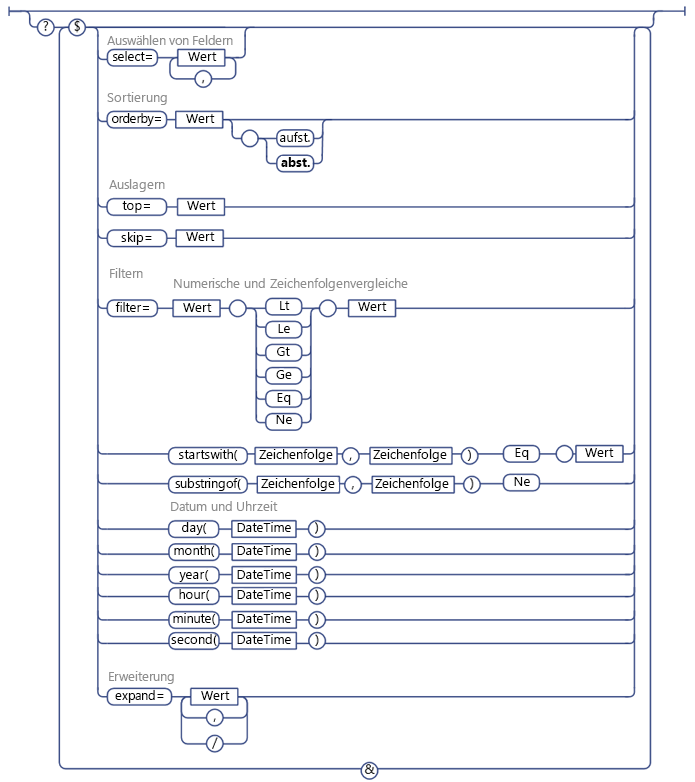

# Verwenden von OData-Abfragevorgängen in SharePoint REST-Anforderungen
Hier erfahren Sie, wie Sie eine Reihe von OData-Abfragezeichenfolgeoperatoren verwenden, um die vom SharePoint REST-Dienst angeforderten Daten auszuwählen, zu filtern und zu ordnen.
 **Bevor Sie beginnen**
  
    
    

-  [Einführung in den SharePoint 2013 REST-Dienst](get-to-know-the-sharepoint-2013-rest-service.md)
    
  
-  [Navigieren durch die im REST-Dienst dargestellte SharePoint-Datenstruktur](navigate-the-sharepoint-data-structure-represented-in-the-rest-service.md)
    
  
-  [Ermitteln von URIs von SharePoint-REST-Dienstendpunkten](determine-sharepoint-rest-service-endpoint-uris.md)
    
  

Der SharePoint REST-Dienst unterstütz eine Reihe von OData-Abfragezeichenfolgeoperatoren, mit denen SIe die angeforderten Daten auswählen, filtern und ordnen können.
  
    
    

> **TIPP**
> Der SharePoint Online-REST-Dienst unterstützt die Kombination mehrerer Anforderungen in einem einzelnen Dienstaufruf mithilfe der OData-Abfrageoption  `$batch`. Einzelheiten und Links zu Codebeispielen finden Sie unter  [Erstellen von Batchanforderungen mit den REST-APIs](make-batch-requests-with-the-rest-apis.md). 
  
    
    

## Auswählen der Felder, die zurückgegeben werden sollen

Verwenden Sie die Abfrageoption  [$select](http://www.odata.org/documentation/odata-version-2-0/uri-conventions#SelectSystemQueryOption), um für eine Liste, ein Listenelement oder ein anderes, von einer Entitätenmenge repräsentiertes SharePoint-Objekt die Felder anzugeben, die zurückgegeben werden sollen. Sie können  `$select=*` verwenden, um alle verfügbaren Felder zurückzugeben.
  
    
    

> **HINWEIS**
> Generell gilt, wenn Sie die  `$select`-Abfrageoption nicht angeben, gibt der REST-Dienst standardmäßig alle verfügbaren Felder zurück. Es kann jedoch manchmal vorkommen, dass einige SharePoint-Objekte Eigenschaften enthalten, deren Abruf äußerst ressourcenintensiv is. Um die Leistung des REST-Dienstes zu optimieren, sind diese Eigenschaften in der Standardabfrage nicht enthalten und müssen explizit angefordert werden. > Die Eigenschaft **SPWeb.EffectiveBasePermissions** wird beispielsweise standardmäßig nicht zurückgegeben und muss explizit mittels der `$select`-Abfrageoption angefordert werden. 
  
    
    

Außerdem können Sie festlegen, dass die Anforderung geplante Felder aus anderen Listen und die Werte von Suchvorgängen zurückgibt. Geben Sie dazu den Feldnamen in den Abfrageoptionen  `$select` und `$expand` an. Beispiel:
  
    
    
 `http://server/site/_api/web/lists('guid')/items?$select=Title,Products/Name&amp;$expand=Products/Name`
  
    
    
Massenerweiterung und die Auswahl damit zusammenhängender Elemente wird nicht unterstützt.
  
    
    

## Auswählen der Elemente, die zurückgegeben werden sollen

Verwenden Sie die Abfrageoption  [$filter](http://www.odata.org/documentation/odata-version-2-0/uri-conventions#FilterSystemQueryOption), um auszuwählen, welche Elemente zurückgegeben werden sollen. Unter  [Vom SharePoint REST-Dienst unterstützte OData-Abfrageoperatoren](#bk_supported) sind die Filter-, Abfrage- und Vergleichsfunktionen und Optionen aufgeführt, die Sie mit dem SharePoint REST-Dienst nutzen können.
  
    
    

## Abfrage für Einzelwert-Suchfelder

Einzelwert-Suchfelder werden beim SharePoint REST-Dienst als zwei separate Felder dargestellt: ein Feld für den tatsächlichen Feldwert und ein weiteres für den Feldnamen. Sie können Abfragen des Suchfeldwerts durchführen wie bei jedem anderen Feld dieses Datentyps. Wenn beispielsweise der Wert des Suchfelds eine Zeichenfolge ist, können Sie die Vergleichsoptionen für Zeichenfolgen in Ihrer Abfrage verwenden.
  
    
    

## Abfrage von Benutzern

Beim SharePoint REST-Dienst werden die Benutzer durch ihren Anzeigennamen repräsentiert und nicht ihrem Alias oder ihrer Domäne\\Alias-Kombination. Daher müssen Sie sich bei Benutzerabfragen nach den Anzeigenamen richten.
  
    
    

> **HINWEIS**
> Mitgliedschaftsbasierte Benutzerabfragen werden nicht unterstützt > Die Verwendung des **Current**-Operators, um Abfragen mit der ID des aktuellen Benutzers durchzuführen, wird nicht unterstützt. 
  
    
    

## Abfrage für Suchfelder und Benutzer mit mehreren Werten

Da Suchfelder mit mehreren Werten als eine Zeichenfolge mehrerer Werte zurückgegeben werden, ist es nicht möglich, sie abzufragen (z. B. wird das Äquivalent eines **Includes**-Elements oder **NotIncludes**-Elements nicht unterstützt).
  
    
    

## Sortieren der zurückgegebenen Elemente

Verwenden Sie die Abfrageoption  [$orderby](http://www.odata.org/documentation/odata-version-2-0/uri-conventions#OrderBySystemQueryOption), um anzugeben, wie die Elemente in Ihrem Abfragerückgabesatz sortiert werden sollen. Um mehrere Felder zu sortieren, geben Sie eine durch Kommas getrennte Liste von Feldern an. Sie können auch angeben, ob die Elemente in auf- oder absteigender Reihenfolge sortiert werden sollen, indem Sie an Ihre Abfrage das Schlüsselwort **asc** oder **desc** anhängen.
  
    
    

## Unterteilen der zurückgegebenen Elemente

Verwenden Sie die Abfrageoptionen  [$top](http://www.odata.org/documentation/odata-version-2-0/uri-conventions#TopSystemQueryOption) und [$skiptoken](http://msdn.microsoft.com/library/dd942121.aspx), um eine Untergruppe der Elemente auszuwählen, die Ihre Abfrage anderenfalls zurückgeben würde.
  
    
    

> **HINWEIS**
> Die Abfrageoption $skip funktioniert nicht bei Abfragen für SharePoint-Listenelemente. 
  
    
    

Die Option  `$top` ermöglicht Ihnen, die ersten *n*  Elemente des Rückgabesatzes für die Rückgabe auszuwählen. Die folgende URI fordert beispielsweise an, dass nur die ersten zehn Elemente des potenziellen Rückgabesatzes tatsächlich zurückgegeben werden:
  
    
    
 `http://server/site/_api/web/lists('<guid>')/items$top=10`
  
    
    
Mit der Option $skiptoken können Sie Elemente bis zum angegebenen Element überspringen und den Rest zurückgeben.
  
    
    
 `$skiptoken=Paged=TRUE&amp;p_ID=5`
  
    
    

> **HINWEIS**
> Beachten Sie bei der Verwendung dieser Abfrageoptionen, dass das Unterteilen in OData ordinal ist. Nehmen Sie beispielsweise an, dass Sie eine "Nächste Seite"-Schaltfläche implementieren, um SharePoint-Listenelemente anzuzeigen. Sie verwenden den REST-Dienst, damit die Schaltfläche die Elemente 1 bis 20 zurückgibt, wenn sie angeklickt wird, dann die Elemete 21 bis 40 usw. Nehmen Sie jedoch an, dass ein anderer Benutzer die Elemente 4 und 18 zwischen den Klicks auf "Nächste Seite" löscht. In so einem Fall wird die ordinale Position der verbleibenden Elemente zurückgesetzt und beim Anzeigen der Elemente 21 bis 40 werden eigentlich zwei Elemente übersprungen. 
  
    
    

## Vom SharePoint REST-Dienst unterstützte OData-Abfrageoperatoren

|**Unterstützt**|**Nicht unterstützt**|
|:-----|:-----|
|**Numerische Vergleiche**    Lt    Le    Gt    Ge    Eq    Ne   | Arithmetische Operatoren           (Add, Sub, Mul, Div, Mod)    Grundlegende mathematische Funktionen          (Runden, Untergrenze, Obergrenze)    |
|**Zeichenfolgenvergleiche**    startsWith    substringof    Eq    Ne   | endsWith    replace    substring    tolower    toupper    trim    concat   |
|**Datums- und Uhrzeitfunktionen**    day()    month()    year()    hour()    minute()    second()   | Operator "DateTimeRangesOverlap"    Abfrage, ob Datum-Zeit in ein wiederkehrendes Datum-Zeit-Muster fällt   |
   
Die untenstehende Abbildung zeigt unterstützte OData-Abfrageoptionen.
  
    
    

**Unterstützte OData-Abfrageoptionen**

  
    
    

  
    
    

  
    
    

  
    
    

  
    
    

## Weitere Ressourcen

-  [Einführung in den SharePoint 2013 REST-Dienst](get-to-know-the-sharepoint-2013-rest-service.md)
    
  
-  [Ausführen grundlegender Vorgänge unter Verwendung von SharePoint 2013-REST-Endpunkten](complete-basic-operations-using-sharepoint-2013-rest-endpoints.md)
    
  
-  [Arbeiten mit Listen und Listenelementen unter Verwendung von REST](working-with-lists-and-list-items-with-rest.md)
    
  
-  [Arbeiten mit Ordnern und Dateien mit REST](working-with-folders-and-files-with-rest.md)
    
  
-  [Navigieren durch die im REST-Dienst dargestellte SharePoint-Datenstruktur](navigate-the-sharepoint-data-structure-represented-in-the-rest-service.md)
    
  
-  [Ermitteln von URIs von SharePoint-REST-Dienstendpunkten](determine-sharepoint-rest-service-endpoint-uris.md)
    
  
-  [SharePoint 2013 - REST-API, Endpunkte und Beispiele](02128c70-9d27-4388-9374-a11bce68fdb8.md)
    
  

  
    
    
