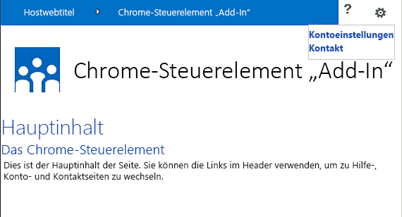

# Verwenden des Client-Chromsteuerelements in Add-Ins für SharePoint
Hier erfahren Sie, wie Sie das Chromsteuerelement in Add-Ins in SharePoint 2013 verwenden.
Dank des Chromsteuerelements in SharePoint 2013 können Sie den Kopfzeilenstil einer bestimmten SharePoint-Website in Ihrem Add-In verwenden, ohne eine Serverbibliothek registrieren zu müssen oder eine bestimmte Technologie bzw. ein bestimmtes Tool zu verwenden. Sie müssen dazu eine SharePoint-JavaScript-Bibliothek durch ein standardmäßiges <script>-Tag registrieren. Sie können einen Platzhalter bereitstellen, indem Sie ein HTML- **div**-Element verwenden und das Steuerelement mit den verfügbaren Optionen weiter anpassen. Das Steuerelement erhält sein Aussehen durch die angegebene SharePoint-Website.
  
    
    


## Voraussetzungen für die Verwendung der Beispiele in diesem Artikel
<a name="SP15Usechromecontrol_Prereq"> </a>

Um die Schritte in diesem Beispiel auszuführen, benötigen Sie Folgendes:
  
    
    

- Visual Studio 2015
    
  
- Eine SharePoint 2013 Entwicklungsumgebung (Add-In-Isolierung für lokale Szenarien erforderlich)
    
  
Anleitungen zum Einrichten einer Entwicklungsumgebung, die Ihren Anforderungen entspricht, finden Sie unter  [Erste Schritte beim Erstellen von Apps für Office und SharePoint](http://msdn.microsoft.com/library/187f8c8c-1b15-471c-80b5-69a40e67deea%28Office.15%29.aspx).
  
    
    

### Kernkonzepte, die vor der Verwendung des Chromsteuerelements bekannt sein müssen

Die folgende Tabelle enthält eine Liste von Artikeln, die das Verständnis der Konzepte erleichtern, die in einem Szenario mit dem Chromsteuerelement relevant sind.
  
    
    

**Tabelle 1. Kernkonzepte der Verwendung des Chromsteuerelements**


|**Titel des Artikels**|**Beschreibung**|
|:-----|:-----|
| [SharePoint-Add-Ins](sharepoint-add-ins.md) <br/> |Hier finden Sie Informationen über das neue Add-In-Modell in SharePoint 2013, das es Ihnen ermöglicht, Add-Ins als kompakte, einfach zu verwendende Lösungen für Endbenutzer zu erstellen.  <br/> |
| [UX-Design für SharePoint-Add-Ins](ux-design-for-sharepoint-add-ins.md) <br/> |Erfahren Sie mehr über UX-Optionen (User eXperience, Benutzerumgebung) und Alternativen beim Erstellen von SharePoint-Add-Ins.  <br/> |
| [Hostwebsites, Add-In-Websites und SharePoint-Komponenten in SharePoint 2013](host-webs-add-in-webs-and-sharepoint-components-in-sharepoint-2013.md) <br/> |Lernen Sie den Unterschied zwischen Hostwebs und App-Webs kennen. Erfahren Sie, welche SharePoint 2013-Komponenten in eine SharePoint-Add-In eingeschlossen werden können, welche Komponenten im Hostweb und welche im App-Web bereitgestellt werden und wie das App-Web in einer isolierten Domäne bereitgestellt wird.  <br/> |
   

## Codebeispiel: Verwenden des Chromsteuerelements in einem in der Cloud gehosteten Add-In
<a name="SP15Usechromecontrol_Codeexample"> </a>

Ein in der Cloud gehostetes Add-In enthält mindestens eine Remotekomponente. Weitere Informationen finden Sie unter  [Auswählen von Mustern für die Entwicklung und das Hosting Ihres Add-Ins für SharePoint](choose-patterns-for-developing-and-hosting-your-sharepoint-add-in.md). Um das Chromsteuerelement in einem in der Cloud gehosteten Add-In zu verwenden, führen Sie folgende Schritte aus:
  
    
    

1. Erstellen Sie die Projekte für die SharePoint-Add-In und die Remotewebsite.
    
  
2. Senden Sie Standardkonfigurationsinformationen in der Abfragezeichenfolge.
    
  
3. Fügen Sie dem Webprojekt eine Webseite hinzu.
    
  
In Abbildung 1 ist eine Remotewebseite mit dem Chromsteuerelement dargestellt.
  
    
    

**Abbildung 1. Remotewebseite mit dem Chromsteuerelement**

  
    
    

  
    
    

  
    
    

### So erstellen Sie die Projekte für die SharePoint-Add-In und die Remotewebsite


1. Öffnen Sie Visual Studio 2015 als Administrator. (Klicken Sie dazu im Menü **Start** mit der rechten Maustaste auf das Symbol für Visual Studio 2015, und wählen Sie **Als Administrator ausführen** aus.)
    
  
2. Erstellen Sie ein neues Projekt unter Verwendung der Vorlage **SharePoint-Add-In**.
    
    Abbildung 2 zeigt den Speicherort der Vorlage **SharePoint-Add-In** in Visual Studio 2015 unter **Vorlagen**, **Visual C#**, **Office/SharePoint**, **Office-Add-Ins**.
    

   **Abbildung 2. Visual Studio-Vorlage für SharePoint-Add-Ins**

  

!\[Speicherort der Vorlage "App für SharePoint 2013 Visual Studio"](images/AppForSharePointVSTemplate.PNG)
  

  

  
3. Geben Sie die URL der SharePoint-Website an, die Sie für das Debugging verwenden möchten.
    
  
4. Wählen Sie **Vom Internetanbieter gehostet** als Option zum Hosten Ihres Add-Ins aus. Ein Beispiel für von SharePoint gehosteten Code finden Sie unter [SharePoint-Add-in-JSOM-BasicDataOperations](https://github.com/OfficeDev/SharePoint-Add-in-JSOM-BasicDataOperations).
    
    Nachdem der Assistent beendet wurde, sollte der **Projektmappen-Explorer** eine Struktur ähnlich wie in Abbildung 3 zeigen.
    

   **Abbildung 3: "Add-In für SharePoint"-Projekte im Projektmappen-Explorer**

  

!\[App für SharePoint-Projekte im Projektmappen-Explorer](images/AppVSTemplateSolutionExplorer.jpg)
  

  

  

### So senden Sie Standardkonfigurationsoptionen in der Abfragezeichenfolge


1. Öffnen Sie die Datei **Appmanifest.xml** im Manifest-Editor.
    
  
2. Fügen Sie der Abfragezeichenfolge das **{StandardTokens}**-Token und einen zusätzlichen  _SPHostTitle_-Parameter hinzu. Abbildung 4 zeigt den Manifest-Editor mit den konfigurierten Abfragezeichenfolgen-Parametern.
    
   **Abbildung 4. Manifest-Editor mit Abfragezeichenfolgen-Parametern für das Chromsteuerelement**

  

!\[Manifest-Editor mit Abfragezeichenfolge-Parametern](images/ChromeControl_manifest.PNG)
  

    Das Chromsteuerelement übernimmt automatisch die folgenden Werte aus der Abfragezeichenfolge:
    
  - **SPHostUrl**
    
  
  - **SPHostTitle**
    
  
  - **SPAppWebUrl**
    
  
  - **SPLanguage**
    
  

    **{StandardTokens}** include **SPHostUrl** und **SPAppWebUrl**.
    
  

### So fügen Sie dem Webprojekt eine Seite hinzu, in der das Chromsteuerelement verwendet wird


1. Klicken Sie mit der rechten Maustaste auf das Webprojekt, und fügen Sie ein neues Web Form hinzu.
    
  
2. Kopieren Sie das folgende Markup, und fügen Sie es in die ASPX-Seite ein. Das Markup führt folgende Aufgaben aus:
    
  - Laden der AJAX-Bibliothek aus dem Microsoft CDN (Content Delivery Network).
    
  
  - Laden der jQuery-Bibliothek aus dem Microsoft CDN.
    
  
  - Laden der Datei **SP.UI.Controls.js** mit der jQuery-Funktion **getScript**.
    
  
  - Definieren einer Rückruffunktion für das **onCssLoaded**-Ereignis.
    
  
  - Vorbereiten der Optionen für das Chromsteuerelement.
    
  
  - Initialisieren des Chromsteuerelements.
    
  

  ```HTML
  
<!DOCTYPE html>
<html xmlns="http://www.w3.org/1999/xhtml">
<head>
    <title>Chrome control host page</title>
    <script 
        src="//ajax.aspnetcdn.com/ajax/4.0/1/MicrosoftAjax.js" 
        type="text/javascript">
    </script>
    <script 
        type="text/javascript" 
        src="//ajax.aspnetcdn.com/ajax/jQuery/jquery-1.7.2.min.js">
    </script>      
    <script 
        type="text/javascript"
        src="ChromeLoader.js">
    </script>
<script type="text/javascript">
"use strict";

var hostweburl;

//load the SharePoint resources
$(document).ready(function () {
    //Get the URI decoded URL.
    hostweburl =
        decodeURIComponent(
            getQueryStringParameter("SPHostUrl")
    );

    // The SharePoint js files URL are in the form:
    // web_url/_layouts/15/resource
    var scriptbase = hostweburl + "/_layouts/15/";

    // Load the js file and continue to the 
    //   success handler
    $.getScript(scriptbase + "SP.UI.Controls.js", renderChrome)
});

// Callback for the onCssLoaded event defined
//  in the options object of the chrome control
function chromeLoaded() {
    // When the page has loaded the required
    //  resources for the chrome control,
    //  display the page body.
    $("body").show();
}

//Function to prepare the options and render the control
function renderChrome() {
    // The Help, Account and Contact pages receive the 
    //   same query string parameters as the main page
    var options = {
        "appIconUrl": "siteicon.png",
        "appTitle": "Chrome control add-in",
        "appHelpPageUrl": "Help.html?"
            + document.URL.split("?")[1],
        // The onCssLoaded event allows you to 
        //  specify a callback to execute when the
        //  chrome resources have been loaded.
        "onCssLoaded": "chromeLoaded()",
        "settingsLinks": [
            {
                "linkUrl": "Account.html?"
                    + document.URL.split("?")[1],
                "displayName": "Account settings"
            },
            {
                "linkUrl": "Contact.html?"
                    + document.URL.split("?")[1],
                "displayName": "Contact us"
            }
        ]
    };

    var nav = new SP.UI.Controls.Navigation(
                            "chrome_ctrl_placeholder",
                            options
                        );
    nav.setVisible(true);
}

// Function to retrieve a query string value.
// For production purposes you may want to use
//  a library to handle the query string.
function getQueryStringParameter(paramToRetrieve) {
    var params =
        document.URL.split("?")[1].split("&amp;");
    var strParams = "";
    for (var i = 0; i < params.length; i = i + 1) {
        var singleParam = params[i].split("=");
        if (singleParam[0] == paramToRetrieve)
            return singleParam[1];
    }
}
</script>
</head>

<!-- The body is initally hidden. 
     The onCssLoaded callback allows you to 
     display the content after the required
     resources for the chrome control have
     been loaded.  -->
<body style="display: none">

    <!-- Chrome control placeholder -->
    <div id="chrome_ctrl_placeholder"></div>

    <!-- The chrome control also makes the SharePoint
          Website stylesheet available to your page -->
    <h1 class="ms-accentText">Main content</h1>
    <h2 class="ms-accentText">The chrome control</h2>
    <div id="MainContent">
        This is the page's main content. 
        You can use the links in the header to go to the help, 
        account or contact pages.
    </div>
</body>
</html>
  ```

3. Sie können das Chromsteuerelement auch in deklarativem Code verwenden. Im folgenden Codebeispiel wird das Chromsteuerelement im HTML-Markup deklariert, ohne dass JavaScript-Code zum Konfigurieren und Initialisieren des Steuerelements verwendet wird. Das nachstehende Markup führt die folgenden Aufgaben aus:
    
  - Bereitstellen eines Platzhalters für die JavaScript-Datei **SP.UI.Controls.js**.
    
  
  - Dynamisches Laden der Datei **SP.UI.Controls.js**
    
  
  - Bereitstellen eines Platzhalters für das Chromsteuerelement und Angeben der Optionen inline im HTML-Markup.
    
  

  ```HTML
  
<!DOCTYPE html>
<html xmlns="http://www.w3.org/1999/xhtml">
<head>
    <title>Chrome control host page</title>
    <script 
        src="http://ajax.aspnetcdn.com/ajax/4.0/1/MicrosoftAjax.js" 
        type="text/javascript">
    </script>
    <script 
        type="text/javascript" 
        src="http://ajax.aspnetcdn.com/ajax/jQuery/jquery-1.7.2.min.js">
    </script>      
    <script type="text/javascript">
    var hostweburl;

    // Load the SharePoint resources.
    $(document).ready(function () {

        // Get the URI decoded add-in web URL.
        hostweburl =
            decodeURIComponent(
                getQueryStringParameter("SPHostUrl")
        );

        // The SharePoint js files URL are in the form:
        // web_url/_layouts/15/resource.js
        var scriptbase = hostweburl + "/_layouts/15/";

        // Load the js file and continue to the 
        // success handler.
        $.getScript(scriptbase + "SP.UI.Controls.js")
    });

    // Function to retrieve a query string value.
    // For production purposes you may want to use
    // a library to handle the query string.
    function getQueryStringParameter(paramToRetrieve) {
        var params =
            document.URL.split("?")[1].split("&amp;");
        var strParams = "";
        for (var i = 0; i < params.length; i = i + 1) {
            var singleParam = params[i].split("=");
            if (singleParam[0] == paramToRetrieve)
                return singleParam[1];
        }
    }
    </script>
</head>
<body>

    <!-- Chrome control placeholder 
           Options are declared inline.  -->
    <div 
        id="chrome_ctrl_container"
        data-ms-control="SP.UI.Controls.Navigation"  
        data-ms-options=
            '{  
                "appHelpPageUrl" : "Help.html",
                "appIconUrl" : "siteIcon.png",
                "appTitle" : "Chrome control add-in",
                "settingsLinks" : [
                    {
                        "linkUrl" : "Account.html",
                        "displayName" : "Account settings"
                    },
                    {
                        "linkUrl" : "Contact.html",
                        "displayName" : "Contact us"
                    }
                ]
             }'>
    </div>
    
    <!-- The chrome control also makes the SharePoint
          Website style sheet available to your page. -->
    <h1 class="ms-accentText">Main content</h1>
    <h2 class="ms-accentText">The chrome control</h2>
    <div id="MainContent">
        This is the page's main content. 
        You can use the links in the header to go to the help, 
        account or contact pages.
    </div>
</body>
</html>
  ```


    Die Bibliothek **SP.UI.Controls.js** rendert das Steuerelement automatisch, wenn sie das **data-ms-control="SP.UI.Controls.Navigation"**-Attribut in einem **div**-Element findet.
    
  

### So bearbeiten Sie das StartPage-Element im App-Manifest


1. Doppelklicken Sie im Projektmappen-Explorer auf die Datei **AppManifest.xml**.
    
  
2. Wählen Sie im Dropdownmenü **Startseite** die Webseite aus, auf der das Chromsteuerelement verwendet wird.
    
  

### So erstellen Sie die Lösung und führen sie aus


1. Stellen Sie sicher, dass das "SharePoint-Add-In"-Projekt als Startprojekt festgelegt ist.
    
  
2. Drücken Sie F5.
    
    > **HINWEIS**
      > Wenn Sie F5 drücken, erstellt Visual Studio die Lösung, stellt die App bereit und öffnet die Berechtigungsseite für die App. 
3. Klicken Sie auf die Schaltfläche **Vertrauen**.
    
  
4. Klicken Sie auf das Symbol des Add-Ins **ChromeControlCloudhosted**.
    
  
5. Wenn Sie das Chromsteuerelement in Webseiten verwenden, können Sie auch die SharePoint-Website-Formatvorlage verwenden, die in Abbildung 4 dargestellt ist.
    
   **Abbildung 5. Auf der Seite verwendete SharePoint-Website-Formatvorlage**

  

!\[Auf einer Seite verwendetes SharePoint-Website-Stylesheet](images/ChromControl_stylesheet.png)
  

  

  

**Tabelle 2. Problembehandlung für die Projektmappe**


|**Problem**|**Lösung**|
|:-----|:-----|
|Unbehandelte Ausnahme **SP ist undefiniert**. <br/> |Stellen Sie sicher, dass Ihr Browser die Datei **SP.UI.Controls.js**lädt.  <br/> |
|Das Chromsteuerelement wird nicht ordnungsgemäß gerendert.  <br/> |Das Chromsteuerelement unterstützt nur Dokumentmodi von Internet Explorer 8 und höher. Stellen Sie sicher, dass Ihr Browser Ihre Seite im Dokumentmodus von Internet Explorer 8 oder höher rendert.  <br/> |
|Zertifikatfehler  <br/> |Legen Sie die Eigenschaft **SSL-aktiviert** des Webprojekts auf "false" fest. Legen Sie im SharePoint-Add-In-Projekt die Eigenschaft **Webprojekt** aufKein fest, und setzen Sie die Eigenschaft dann wieder auf den Namen des Webprojekts. <br/> |
   

## Nächste Schritte
<a name="SP15Usechromecontrol_Nextsteps"> </a>

In diesem Artikel wird gezeigt, wie Sie das Chromsteuerelement in einem SharePoint-Add-In verwenden. Im nächsten Schritt können Sie sich über UX-Komponenten informieren, die für SharePoint-Add-Ins verfügbar sind. Nähere Einzelheiten finden Sie unter:
  
    
    

-  [Codebeispiel: Verwenden des Chromsteuerelements in einem in der Cloud gehosteten Add-In](http://code.msdn.microsoft.com/SharePoint-2013-Work-with-089ecc6f)
    
  
-  [Codebeispiel: Use the chrome control and the cross-domain library (CSOM)](http://code.msdn.microsoft.com/SharePoint-2013-Use-the-97c30a2e)
    
  
-  [Codebeispiel: Use the chrome control and the cross-domain library (REST)](http://code.msdn.microsoft.com/SharePoint-2013-Use-the-a759e9f8)
    
  
-  [Verwenden des Stylesheets einer SharePoint-Website in Add-Ins für SharePoint](use-a-sharepoint-website-s-style-sheet-in-sharepoint-add-ins.md)
    
  
-  [Gewusst wie: Erstellen benutzerdefinierter Aktionen zur Bereitstellung mit Add-Ins für SharePoint](create-custom-actions-to-deploy-with-sharepoint-add-ins.md)
    
  
-  [Erstellen von Add-In-Webparts zur Installation mit Ihrem SharePoint-Add-In](create-add-in-parts-to-install-with-your-sharepoint-add-in.md)
    
  

## Zusätzliche Ressourcen
<a name="SP15Usechromecontrol_Addresources"> </a>


-  [Einrichten einer lokalen Entwicklungsumgebung für SharePoint-Add-Ins](set-up-an-on-premises-development-environment-for-sharepoint-add-ins.md)
    
  
-  [UX-Design für SharePoint-Add-Ins](ux-design-for-sharepoint-add-ins.md)
    
  
-  [Designrichtlinien für die Benutzerfreundlichkeit von Add-Ins für SharePoint](sharepoint-add-ins-ux-design-guidelines.md)
    
  
-  [Erstellen von UX-Komponenten in SharePoint 2013](create-ux-components-in-sharepoint-2013.md)
    
  
-  [Drei Ansätze, um Entwurfsentscheidungen für Add-Ins für SharePoint zu treffen](three-ways-to-think-about-design-options-for-sharepoint-add-ins.md)
    
  
-  [Wichtige Aspekte der Architektur und Entwicklungslandschaft von Add-Ins für SharePoint](important-aspects-of-the-sharepoint-add-in-architecture-and-development-landscap.md)
    
  

