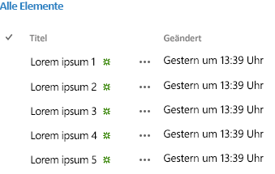

# Verwenden des experimentellen Desktoplistenansichts-Widgets in Add-Ins für SharePoint
Erfahren Sie, wie Sie das Desktoplistenansichts-Widget auf jeder Webseite verwenden, auch wenn die Seite nicht in SharePoint gehostet wird. Verwenden Sie das Listenansichts-Widget in Ihren Add-Ins, um Daten in Listen anzuzeigen, die in einer SharePoint-Website gehostet werden.
> **HINWEIS**
> Die Office Web Widgets - Experimental werden nur zu Recherche- und Feedbackzwecken bereitgestellt. Verwenden Sie sie nicht in Produktionsszenarios. Das Verhalten von Office Web Widgets kann sich in künftigen Versionen erheblich ändern. Lesen und prüfen Sie die  [Lizenzbedingungen für Office Web Widgets - Experimental](office-web-widgetsexperimental-license-terms.md). 


Sie können das Listenansichts-Widget ähnlich dem herkömmlichen Listenansichts-Widget verwenden, um die Daten in einer SharePointListe anzuzeigen. Der Unterschied ist, dass Sie es in Ihren Add-Ins und Websites verwenden können, die nicht unbedingt in SharePoint gehostet werden.
**Abbildung 1: Desktoplistenansichts-Widget zeigt Daten in einer Liste an**





## Einführung

Sie können die Ansicht in der SharePoint-Liste angeben, die Sie zum Anzeigen der Daten verwenden möchten. Das Listenansichts-Widget zeigt die Spalten und Elemente in der durch die Ansicht festgelegten Reihenfolge an.


Das Listenansichts-Widget verwendet die domänenübergreifende Bibliothek, um die Listendaten abzurufen. Daher erfolgt die Kommunikation auf der Clientebene.


> **VORSICHT**
> Das Desktoplistenansichts-Widget ermöglicht nicht alle Szenarios der nativen Listenansicht. 


Die folgenden Szenarios wurden in der aktuellen Version des Widgets nicht aktiviert:


- Verwenden des Widgets in Authentifizierungsschemas, die von der domänenübergreifenden Bibliothek nicht nativ unterstützt werden.


- Verwenden des Widgets mit anderen Datenquellen als SharePoint-Listen oder -Bibliotheken.


- Herstellen einer Datenbindung mit dem Widget.


- Ansichten mit Toucheingabe.


- Inlinebearbeitung für Benutzer.


- Anzeigen von Anwesenheitsinformationen.


- Bereitstellen benutzerdefinierter Wiedergabevorlagen.


- Lokale Szenarios. Derzeit kann das Widget nur in SharePoint Online verwendet werden.


## Voraussetzungen für die Verwendung der Beispiele in diesem Artikel

Um diese Beispiele auszuführen, benötigen Sie Folgendes:


- Visual Studio 2013


- NuGet-Paket-Manager. Weitere Informationen finden Sie unter  [Installieren von NuGet](http://go.microsoft.com/fwlink/?LinkId=271465).


- Eine SharePoint 2013-Entwicklungsumgebung (für lokale Szenarios App-Isolierung erforderlich). 


- Office Web Widgets - Experimental - NuGet-Paket. Weitere Informationen dazu, wie Sie ein NuGet-Paket installieren, finden Sie unter  [Verwalten von NuGet-Paketen mithilfe des Dialogfelds](http://docs.nuget.org/docs/start-here/managing-nuget-packages-using-the-dialog). Sie können auch die  [NuGet-Galerieseite](http://www.nuget.org/packages/Microsoft.Office.WebWidgets.Experimental/) durchsuchen.


## Verwenden des Desktoplistenansichts-Widgets in einem vom Anbieter gehosteten SharePoint-Add-In

Dieses Beispiel enthält eine einfache Seite, die außerhalb von SharePoint gehostet wird und ein Desktoplistenansichts-Widget deklariert.


Sie müssen Folgendes tun, um das Listenansichts-Widget zu verwenden:


- Erstellen Sie SharePoint-Add-In- und Webprojekte.


- Erstellen Sie im Add-In-Web eine Liste. Mit diesem Schritt wird außerdem sichergestellt, dass ein Add-In-Web erstellt wird, wenn Benutzer das Add-In bereitstellen.

    > **HINWEIS**
    > Für die domänenübergreifende Bibliothek muss ein Add-Ins-Web vorhanden sein. Das Listenansichts-Widget kommuniziert mit SharePoint mithilfe der domänenübergreifenden Bibliothek. 
- Erstellen Sie eine Add-In-Seite, die mithilfe von HTML-Markup eine Listenansichts-Widget-Instanz deklariert.


### So erstellen Sie ein SharePoint-Add-In und Webprojekte


1. Öffnen Sie Visual Studio 2013 als Administrator. (Wählen Sie dazu im Menü **Start** das Symbol für Visual Studio 2013 aus, und wählen Sie **Als Administrator ausführen** aus.)


2. Erstellen Sie mithilfe der **SharePoint-Add-In 2013**-Vorlage ein neues Projekt. Die SharePoint-Add-In 2013-Vorlage befindet sich unter **Vorlagen**> **Visual C#**, **Office/SharePoint**> **Add-Ins**.


3. Geben Sie die SharePoint-Website-URL ein, die Sie für das Debugging verwenden möchten.


4. Wählen Sie als Hostingoption für Ihr Add-In **Von Anbieter gehostet** aus.

    > **HINWEIS**
      > Sie können das Desktoplistenansichts-Widget auch mit anderen Hostingoptionen oder sogar mit Add-Ins für Office oder Ihrer eigenen Website verwenden. 
5. Wählen Sie als Typ des Webanwendungsprojekts **ASP.NET Webformular-Anwendung** aus.


6. Wählen Sie als Authentifizierungsoption **Windows Azure-Zugriffssteuerungsdienst** aus.


### So erstellen Sie eine Liste im Add-In-Web


1. Wählen Sie das SharePoint-Add-In-Projekt im **Projektmappen-Explorer** aus. Wählen Sie **Hinzufügen**> **Neues Element…** aus.


2. Wählen Sie **Visual C#-Elemente**> **Office/SharePoint**> **Liste** aus. Geben Sie im Textfeld **Name** **Ankündigungen** ein. Wählen Sie **Hinzufügen** aus.


3. Wählen Sie **Listeninstanz basierend auf einer bestehenden Listenvorlage erstellen** aus. Wählen Sie die Vorlage **Ankündigungen** aus. Wählen Sie **Fertig stellen** aus.


### So fügen Sie eine neue Seite hinzu, die das Desktoplistenansichts-Widget verwendet


1. Wählen Sie den Ordner **Seiten** im Webprojekt **Projektmappen-Explorer** aus.


2. Kopieren Sie den folgenden Code, und fügen Sie ihn in eine **ASPX** -Datei im Projekt ein. Der Code führt die folgenden Aufgaben aus:

  - Fügt Referenzen zu den erforderlichen Office-Bibliotheken und -Ressourcen hinzu.


  - Stellt einen Platzhalter für das Listenansichts-Widget bereit.


  - Initialisiert die Steuerelementelaufzeit.


  - Führt die Methode **renderAll** der Office-Steuerelementelaufzeit aus.


  ```

<!DOCTYPE html>
<html>
<head>
    <!-- IE9 or superior -->
    <meta http-equiv="x-ua-compatible" content="IE=10">
    <title>Desktop List View HTML Markup</title>

    <!-- Controls Specific CSS File -->
    <link rel="stylesheet" type="text/css" href="/Scripts/Office.Controls.css" />

    <!-- Ajax, jQuery, and utils -->
    <script 
        src=" https://ajax.aspnetcdn.com/ajax/4.0/1/MicrosoftAjax.js.js">
    </script>
    <script 
        src=" https://ajax.aspnetcdn.com/ajax/jQuery/jquery-1.9.1.min.js">
    </script>
    <script type="text/javascript">

        // Function to retrieve a query string value.
        // For production purposes you may want to use
        //  a library to handle the query string.
        function getQueryStringParameter(paramToRetrieve) {
            var params =
                document.URL.split("?")[1].split("&amp;");
            var strParams = "";
            for (var i = 0; i < params.length; i = i + 1) {
                var singleParam = params[i].split("=");
                if (singleParam[0] == paramToRetrieve)
                    return singleParam[1];
            }
        }
    </script>

    <!-- Cross-Domain Library and Office controls runtime -->
    <script type="text/javascript">
        //Register namespace and variables used through the sample
        Type.registerNamespace("Office.Samples.ListViewBasic");
        //Retrieve context tokens from the querystring
        Office.Samples.ListViewBasic.appWebUrl =
            decodeURIComponent(getQueryStringParameter("SPAppWebUrl"));
        Office.Samples.ListViewBasic.hostWebUrl =
            decodeURIComponent(getQueryStringParameter("SPHostUrl"));
        Office.Samples.ListViewBasic.ctag =
            decodeURIComponent(getQueryStringParameter("SPClientTag"));

        //Pattern to dynamically load JSOM and the cross-domain library
        var scriptbase =
            Office.Samples.ListViewBasic.hostWebUrl + "/_layouts/15/";

        //Get the cross-domain library
        $.getScript(scriptbase + "SP.RequestExecutor.js", 
            //Get the Office controls runtime and 
            //  continue to the createControl function
            function () {
                $.getScript("../Scripts/Office.Controls.js", createControl);
            }
        );
    </script>

    <!-- List View -->
    <script 
        src="../Scripts/Office.Controls.ListView.debug.js" 
        type="text/javascript">
    </script>

    <!-- SharePoint CSS -->
    <script type="text/javascript">
        document.addEventListener("DOMContentLoaded", function () {
            // The resource files are in a URL in the form:
            // web_url/_layouts/15/Resource.ashx
            var scriptbase =
                Office.Samples.ListViewBasic.appWebUrl + "/_layouts/15/";

            // Dynamically create the invisible iframe.
            var blankiframe;
            var blankurl;
            var body;
            blankurl =
                Office.Samples.ListViewBasic.appWebUrl + "/Pages/blank.html";
            blankiframe = document.createElement("iframe");
            blankiframe.setAttribute("src", blankurl);
            blankiframe.setAttribute("style", "display: none");
            body = document.getElementsByTagName("body");
            body[0].appendChild(blankiframe);

            // Dynamically create the link element.
            var dclink;
            var head;
            dclink = document.createElement("link");
            dclink.setAttribute("rel", "stylesheet");
            dclink.setAttribute("href",
                                scriptbase +
                                "defaultcss.ashx?ctag=" +
                                Office.Samples.ListViewBasic.ctag
                                );
            head = document.getElementsByTagName("head");
            head[0].appendChild(dclink);
        }, false);
    </script>
</head>
<body>
    Basic List View sample (HTML markup declaration):
    <div id="ListViewDiv"
         data-office-control="Office.Controls.ListView"
         data-office-options='{"listUrl" : getListUrl()}'>
    </div>

    <script type="text/javascript">
        function createControl() {
            //Initialize Controls Runtime
            Office.Controls.Runtime.initialize({
                sharePointHostUrl: Office.Samples.ListViewBasic.hostWebUrl,
                appWebUrl: Office.Samples.ListViewBasic.appWebUrl
            });

            //Render the widget, this must be executed after the
            //placeholder DOM is loaded
            Office.Controls.Runtime.renderAll();
        }

        function getListUrl() {
            return Office.Samples.ListViewBasic.appWebUrl +
                    "/_api/web/lists/getbytitle('Announcements')";
        }
    </script>
</body>
</html>
  ```


> **HINWEIS**
> Das obige Codebeispiel gibt die URLs des Hostwebs und des Add-In-Webs explizit an, um die Office-Steuerelementelaufzeit zu initialisieren. Wenn die URLs des Hostwebs und des Add-In-Webs allerdings im Abfragezeichenfolgenparameter **SPAppWebUrl** bzw. **SPHostUrl** angegeben werden, können Sie ein leeres Objekt übergeben. Der Code wird dann versuchen, die Parameter automatisch abzurufen. Die Parameter **SPAppWebUrl** und **SPHostUrl** sind in der Abfragezeichenfolge enthalten, wenn Sie den Token **{StandardTokens}** verwenden.


Das folgende Beispiel zeigt, wie Sie ein leeres Objekt übergeben, um die Methode zu initialisieren:


```

// Initialize with an empty object and the code
// will attempt to get the tokens from the
// query string directly.
Office.Controls.Runtime.initialize({});
```


### So erstellen Sie die Lösung und führen sie aus


1. Drücken Sie F5.

    > **HINWEIS**
      > Wenn Sie F5 drücken, erstellt Visual Studio die Lösung, stellt das Add-In bereit und öffnet die Berechtigungsseite für das Add-In. 
2. Klicken Sie auf die Schaltfläche **Vertrauen**.


3. Wählen Sie auf der Seite **Websiteinhalte** das Add-In-Symbol.


Sie können dieses Beispiel auch in der Codegalerie herunterladen: siehe Codebeispiel  [Verwenden des experimentellen Desktoplistenansichts-Widgets in einem Add-In](http://code.msdn.microsoft.com/SharePoint-2013-Use-the-c3edb076).


## 

In diesem Artikel wird gezeigt, wie Sie das Desktoplistenansichts-Widget in Ihrem Add-In mithilfe von HTML verwenden. Sie können sich auch mit den folgenden Szenarios und Details zum Widget vertraut machen.


### Verwenden von JavaScript zum Deklarieren des Desktoplistenansichts-Widgets

Möglicherweise verwenden Sie zum Deklarieren des Widgets anstatt HTML lieber das JavaScript. Ist dies der Fall, können Sie das folgende Markup als Platzhalter für das Widget verwenden.


```HTML

<div id="ListViewDiv"></div>
```

Verwenden Sie den folgenden JavaScript-Code, um die Listenansicht zu instanziieren.


```
new Office.Controls.ListView(
    document.getElementById("ListViewDiv"), {
        listUrl: Office.Samples.ListViewBasic.appWebUrl + "/_api/web/lists/getbytitle('Announcements')"
    });
```

Ein Beispiel dafür, wie die Aufgaben durchgeführt werden, finden Sie auf der Seite **JSSimple.html** im Codebeispiel [Verwenden des experimentellen Desktoplistenansichts-Widgets in einem Add-In](http://code.msdn.microsoft.com/SharePoint-2013-Use-the-c3edb076).


### Festlegen einer Ansicht zur Anzeige der Daten

Sie können in Ihrer SharePoint-Liste eine vorhandene Ansicht festlegen, die das Listenansichts-Widget dann zur Anzeige der Daten verwendet.


Wenn Sie zum Deklarieren des Widgets HTML-Markup verwenden, können Sie zum Festlegen einer Ansicht die folgende Syntax verwenden.


```

<div id="ListViewDiv"
        data-office-control="Office.Controls.ListView"
        data-office-options="{listUrl: 'list URL',
                            viewID: 'GUID'
                            }">
</div> 

```

Wenn Sie das Widget mit JavaScript deklarieren, verwenden Sie zum Festlegen einer Ansicht die folgende Syntax.


```

new Office.Controls.ListView(
    document.getElementById("ListViewDiv"), {
        listUrl: "list URL",
        viewID: "GUID"
    });
```


## Schlussbemerkung

Sie können das experimentelle Desktoplistenansichts-Widget zum Anzeigen von Daten in SharePoint-Listen verwenden. Das Widget zeigt Daten im schreibgeschützten Modus an. Wir freuen uns über Ihre Ideen und Kommentare auf der  [Office Developer Platform UserVoice-Website](http://officespdev.uservoice.com/).


## Zusätzliche Ressourcen
<a name="bk_addresources"> </a>


-  [Übersicht über Office Web Widgets - Experimental](office-web-widgetsexperimental-overview.md)


-  [Lizenzbedingungen für Office Web Widgets - Experimental](office-web-widgetsexperimental-license-terms.md)


-  [Office Web Widgets - Experimental - NuGet-Galerieseite](http://www.nuget.org/packages/Microsoft.Office.WebWidgets.Experimental/)


-  [Codebeispiel: Verwenden des experimentellen Desktoplistenansichts-Widgets in eine Add-In](http://code.msdn.microsoft.com/SharePoint-2013-Use-the-c3edb076)


-  [Verwenden des experimentellen Desktoplistenansichts-Widgets in Add-Ins für SharePoint](use-the-experimental-desktop-list-view-widget-in-sharepoint-add-ins.md)


