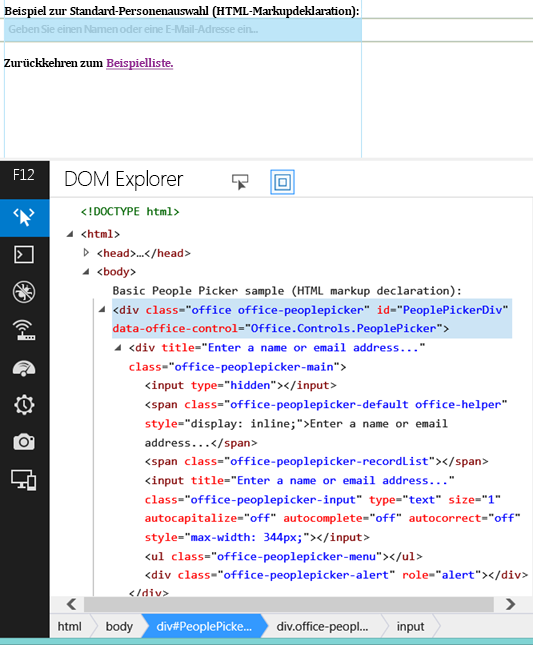

# Verwenden des experimentellen Personenauswahl-Widgets in SharePoint-Add-Ins
Erfahren Sie, wie Sie das Personenauswahl-Widget auf einer Webseite verwenden, auch wenn die Seite nicht in SharePoint gehostet wird. Verwenden Sie das Personenauswahl-Widget in Ihren Add-Ins, um Benutzern das Suchen und Auswählen von Personen und Gruppen zu erleichtern.
> [!VORSICHT]
> Die Office Web Widgets - Experimental werden nur zu Recherche- und Feedbackzwecken bereitgestellt. Verwenden Sie sie nicht in Produktionsszenarios. Das Verhalten von Office Web Widgets kann sich in künftigen Versionen erheblich ändern. Lesen und prüfen Sie die  [Lizenzbedingungen für Office Web Widgets - Experimental](office-web-widgetsexperimental-license-terms.md). 
  
    
    

Sie können das experimentelle Personenauswahl-Widget in Add-Ins verwenden, um Ihren Benutzern zu helfen, Personen und Gruppen in einem Mandanten zu suchen und auszuwählen. Benutzer können beginnen, etwas in das Textfeld einzugeben, und das Widget ruft die Personen ab, deren Name oder E-Mail-Adresse mit dem Text übereinstimmt.
**Abbildung 1. Personenauswahl-Widget löst eine Abfrage auf**

  
    
    

  
    
    

  
    
    

  
    
    

  
    
    
Ihr Add-In kann auf die ausgewählten Personen zugreifen, indem es die Eigenschaft **selectedItems** des Widgets liest. Die selectedItems-Eigenschaft ist ein Array von Objekten, die Personen oder Gruppen darstellen. Die folgende Tabelle zeigt die verfügbaren Eigenschaften des Benutzerobjekts.

|**Eigenschaft**|**Beschreibung**|
|:-----|:-----|
|**department** <br/> |Stellt die Abteilung des Benutzers oder der Gruppe dar.  <br/> |
|**displayName** <br/> |Stellt den Anzeigenamen des Benutzers oder der Gruppe dar.  <br/> |
|**email** <br/> |Stellt die E-Mail-Adresse des Benutzers oder der Gruppe dar.  <br/> |
|**isResolved** <br/> |Gibt an, ob das Widget den Text im Widget für einen Benutzer oder eine Gruppe im Mandanten erfolgreich aufgelöst hat.  <br/> |
|**jobTitle** <br/> |Stellt die Position des Benutzers dar.  <br/> |
|**loginName** <br/> |Stellt den Anmeldenamen des Benutzers oder der Gruppe dar.  <br/> |
|**mobile** <br/> |Stellt die Mobilnummer des Benutzers oder der Gruppe dar.  <br/> |
|**principalId** <br/> |Stellt die Prinzipal-ID des Benutzers oder der Gruppe dar.  <br/> |
|**principalType** <br/> |Gibt an, ob das Element ein Benutzer oder eine Gruppe ist. Weist den Wert 1 auf, wenn es ein Benutzer ist, und den Wert 4, wenn es eine Gruppe ist.  <br/> |
|**sipAddress** <br/> |Stellt die SIP-Adresse des Benutzers oder der Gruppe dar.  <br/> |
|**text** <br/> |Stellt den Texttitel des Benutzers oder der Gruppe dar.  <br/> |
   
Das Personenauswahl­-Widget weist einen Cache der zuletzt verwendeten Einträge (Most Recently Used, MRU) auf. Der Cache speichert die fünf letzten Einträge, die vom Widget aufgelöst wurden.
## Voraussetzungen für die Verwendung der Beispiele in diesem Artikel

Um die Beispiele in diesem Artikel zu verwenden, benötigen Sie Folgendes:
  
    
    

- Visual Studio 2013.
    
  
- NuGet-Paket-Manager. Weitere Informationen finden Sie unter  [Installieren von NuGet](http://go.microsoft.com/fwlink/?LinkId=271465).
    
  
- Eine SharePoint 2013-Entwicklungsumgebung (App-Isolierung für lokale Szenarien erforderlich).
    
  
- Office Web Widgets - Experimental - NuGet-Paket. Weitere Informationen dazu, wie Sie ein NuGet-Paket installieren, finden Sie unter  [Verwalten von NuGet-Paketen mithilfe des Dialogfelds](http://docs.nuget.org/docs/start-here/managing-nuget-packages-using-the-dialog). Sie können auch die  [NuGet-Galerieseite](http://www.nuget.org/packages/Microsoft.Office.WebWidgets.Experimental/) durchsuchen.
    
  

## Verwenden des Personenauswahl-Widgets in einem vom Anbieter gehosteten SharePoint-Add-In

Dieses Beispiel enthält eine einfache Seite, die außerhalb von SharePoint gehostet wird und ein Personenauswahl-Widget mithilfe von Markup deklariert. Aus Gründen der Einfachheit werden in diesem Beispiel keine Optionen deklariert. Im Abschnitt  [Nächste Schritte](use-the-experimental-people-picker-widget-in-sharepoint-add-ins.md#NextSteps) finden Sie allerdings ein Beispiel mit Optionen.
  
    
    
Um das Personenauswahl-Widget zu verwenden, müssen Sie folgende Schritte ausführen:
  
    
    

- Erstellen Sie SharePoint-Add-In- und Webprojekte.
    
  
- Erstellen Sie im Add-In-Web ein Modul. Dieser Schritt stellt sicher, dass ein Add-In-Web erstellt wird, wenn Benutzer das Add-In bereitstellen.
    
    > [!HINWEIS]
      > Für die domänenübergreifende Bibliothek muss ein Add-In-Web vorhanden sein. Das Personenauswahl-Widget kommuniziert mithilfe der domänenübergreifenden Bibliothek mit SharePoint. 
- Erstellen Sie eine Add-In-Seite, die eine Personenauswahl-Widget-Instanz mithilfe von Markup deklariert.
    
  

### So erstellen Sie ein SharePoint-Add-In und Webprojekte


1. Öffnen Sie Visual Studio 2013 als Administrator. (Wählen Sie dazu im Menü **Start** das Symbol für Visual Studio 2013 aus, und wählen Sie **Als Administrator ausführen** aus.)
    
  
2. Erstellen Sie mithilfe der SharePoint-Add-In 2013-Vorlage ein neues Projekt. Die **SharePoint-Add-In 2013** -Vorlage befindet sich unter **Vorlagen**> **Visual C#**, **Office/SharePoint**> **Add-Ins**.
    
  
3. Geben Sie die SharePoint-Website-URL ein, die Sie für das Debugging verwenden möchten.
    
  
4. Wählen Sie als Hostingoption für Ihr Add-In **Von Anbieter gehostet** aus.
    
    > [!HINWEIS]
      > Sie können das Personenauswahl-Widget auch mit anderen Hostingoptionen oder sogar mit Add-Ins für Office auf Ihrer eigenen Website verwenden. 
5. Wählen Sie als Typ des Webanwendungsprojekts **ASP.NET Webformular-Anwendung** aus.
    
  
6. Wählen Sie als Authentifizierungsoption **Windows Azure-Zugriffssteuerungsdienst** aus.
    
  

### So erstellen Sie im Add-In-Web ein Modul


1. Wählen Sie das SharePoint-Add-In-Projekt im **Projektmappen-Explorer** aus. Wählen Sie **Hinzufügen**> **Neues Element…** aus.
    
  
2. ählen Sie **Visual C#-Elemente**> **Office/SharePoint**> **Modul** aus. Geben Sie einen Namen für Ihr Modul an.
    
    > [!HINWEIS]
      > Wenn Sie eine Von SharePoint gehostetes Add-In erstellen, müssen Sie ein eigenes Modul erstellen. 

### So fügen Sie eine neue Seite hinzu, die das Personenauswahl-Widget verwendet


1. Wählen Sie im **Projektmappen-Explorer** im Webprojekt den Ordner **Seiten** aus.
    
  
2. Kopieren Sie den folgenden Code, und fügen Sie ihn in eine **ASPX** -Datei im Projekt ein. Der Code führt die folgenden Aufgaben durch:
    
  - Fügt Verweise auf die erforderlichen Office-Bibliotheken und -Ressourcen hinzu.
    
  
  - Initialisiert die Laufzeit der Steuerelemente.
    
  
  - Führt die Methode **renderAll** der Office-Steuerelementelaufzeit aus.
    
  
  - Deklariert einen Platzhalter für das Personenauswahl-Widget.
    
  

  ```
  
<!DOCTYPE html>
<html>
<head>
    <!-- IE9 or superior -->
    <meta http-equiv="X-UA-Compatible" content="IE=9" >
    <title>People Picker HTML Markup</title>

    <!-- Widgets Specific CSS File -->
    <link 
        rel="stylesheet" 
        type="text/css" 
        href="../Scripts/Office.Controls.css" 
    />

    <!-- Ajax, jQuery, and utils --> 
    <script 
        src=" https://ajax.aspnetcdn.com/ajax/4.0/1/MicrosoftAjax.js.js">
    </script>
    <script 
        src=" https://ajax.aspnetcdn.com/ajax/jQuery/jquery-1.9.1.min.js">
    </script>
    <script type="text/javascript">
        // Function to retrieve a query string value.
        // For production purposes you may want to use
        //  a library to handle the query string.
        function getQueryStringParameter(paramToRetrieve) {
            var params =
                document.URL.split("?")[1].split("&amp;");
            var strParams = "";
            for (var i = 0; i < params.length; i = i + 1) {
                var singleParam = params[i].split("=");
                if (singleParam[0] == paramToRetrieve)
                    return singleParam[1];
            }
        }
    </script>

    <!-- Cross-Domain Library and Office controls runtime -->
    <script type="text/javascript">
        //Register namespace and variables used through the sample
        Type.registerNamespace("Office.Samples.PeoplePickerBasic");
        //Retrieve context tokens from the querystring
        Office.Samples.PeoplePickerBasic.appWebUrl =
            decodeURIComponent(getQueryStringParameter("SPAppWebUrl"));
        Office.Samples.PeoplePickerBasic.hostWebUrl =
            decodeURIComponent(getQueryStringParameter("SPHostUrl"));

        //Pattern to dynamically load JSOM and and the cross-domain library
        var scriptbase =
            Office.Samples.PeoplePickerBasic.hostWebUrl + "/_layouts/15/";

        //Get the cross-domain library
        $.getScript(scriptbase + "SP.RequestExecutor.js",
            //Get the Office controls runtime and 
            //  continue to the createControl function
            function () {
                $.getScript("../Scripts/Office.Controls.js", createControl)
            }
        );
    </script>

    <!--People Picker -->
    <script 
        src="../Scripts/Office.Controls.PeoplePicker.js" 
        type="text/javascript">
    </script>
</head>
<body>
Basic People Picker sample (HTML markup declaration):
<div 
        id="PeoplePickerDiv" 
        data-office-control="Office.Controls.PeoplePicker">
</div>

<script type="text/javascript">
    function createControl() {
        //Initialize Controls Runtime
        Office.Controls.Runtime.initialize({
            sharePointHostUrl: Office.Samples.PeoplePickerBasic.hostWebUrl,
            appWebUrl: Office.Samples.PeoplePickerBasic.appWebUrl
        });

        //Render the widget, this must be executed after the
        //placeholder DOM is loaded
        Office.Controls.Runtime.renderAll();
    }
</script>
</body>
</html>

  ```


> [!HINWEIS]
> Das obige Codebeispiel gibt die URLs des Hostwebs und des Add-In-Webs explizit an, um die Office-Steuerelementelaufzeit zu initialisieren. Wenn die URLs des Hostwebs und des Add-In-Webs allerdings im Abfragezeichenfolgenparameter **SPAppWebUrl** bzw. **SPHostUrl** angegeben werden, können Sie ein leeres Objekt übergeben. Der Code wird dann versuchen, die Parameter automatisch abzurufen. Die Parameter **SPAppWebUrl** und **SPHostUrl** sind in der Abfragezeichenfolge enthalten, wenn Sie das Token **{StandardTokens}** verwenden.
  
    
    

Das folgende Beispiel zeigt, wie Sie ein leeres Objekt übergeben, um die Methode zu initialisieren:
  
    
    


```

// Initialize with an empty object and the code
// will attempt to get the tokens from the
// query string directly.
Office.Controls.Runtime.initialize({});
```


### So erstellen Sie die Lösung und führen sie aus


1. Drücken Sie F5.
    
    > [!HINWEIS]
      > Wenn Sie F5 drücken, erstellt Visual Studio die Lösung, stellt das Add-In bereit und öffnet die Berechtigungsseite für das Add-In. 
2. Klicken Sie auf die Schaltfläche **Vertrauen**.
    
  
3. Wählen Sie auf der Seite **Websiteinhalte** das Add-In-Symbol.
    
  
Sie können dieses Beispiel auch in der Codegalerie herunterladen, siehe Codebeispiel  [Verwenden des experimentellen Personenauswahl-Widgets in einem Add-In](http://code.msdn.microsoft.com/SharePoint-2013-Use-the-57859f85). 
  
    
    

## 
<a name="NextSteps"> </a>

In diesem Artikel wird die Verwendung des Personenauswahl-Widgets in Ihrem Add-In mithilfe von HTML beschrieben. Sie können auch die folgenden Szenarios und Details zum Widget erkunden.
  
    
    

### Verwenden von JavaScript, um das Personenauswahl-Widget zu deklarieren

Möglicherweise verwenden Sie zum Deklarieren des Widgets anstatt HTML lieber das JavaScript. Ist dies der Fall, können Sie das folgende Markup als Platzhalter für das Widget verwenden.
  
    
    

```HTML

<div id="PeoplePickerDiv"></div>
```

Verwenden Sie den folgenden JavaScript-Code, um die Personenauswahl zu instanziieren.
  
    
    


```
new Office.Controls.PeoplePicker(
    document.getElementById("PeoplePickerDiv"), {});
```

Ein Codebeispiel, das zeigt, wie die Aufgaben durchgeführt werden, finden Sie auf der Seite **JSSimple.html** im Codebeispiel [Verwenden des experimentellen Personenauswahl-Widgets in einem Add-In](http://code.msdn.microsoft.com/SharePoint-2013-Use-the-57859f85).
  
    
    

### Festlegen von Optionen für das Widget

ie können mithilfe des Attributs **data-office-options** in der Widget-Deklaration Optionen für das Widget festlegen. Der folgende HTML-Code zeigt, wie Sie Optionen für das Personenauswahl-Widget festlegen.
  
    
    

```HTML

<div id="PeoplePickerDiv"
        data-office-control="Office.Controls.PeoplePicker"
        data-office-options='{
        "allowMultipleSelections" : true,
        "onChange" : handleChange,
        "placeholder" : "Check the count message, it changes when you add names..."
    }'>
</div>
```

Der folgende Code zeigt, wie Sie Optionen festlegen, wenn Sie das Personenauswahl-Widget mit JavaScript deklarieren.
  
    
    


```

new Office.Controls.PeoplePicker(
    document.getElementById("PeoplePickerDiv"), {
        allowMultipleSelections: true,
        placeholder: "Check the count message, it changes when you add names...",
        onChange: function (ctrl) {
            document.getElementById("count").textContent = 
ctrl.selectedItems.length.toString();
        }
    });
```

Sie können auch Ereignishandler für die Ereignisse **onChange**, **onAdded** und **onRemoved** festlegen. Beachten Sie im obigen Code, dass der Ereignishandler für das onChange-Ereignis einen einzelnen **ctrl** -Parameter erhält, der einen Verweis auf das Widget darstellt.
  
    
    
Ein Beispiel dafür, wie Sie Optionen festlegen, finden Sie auf den Seiten **MarkupOptions.html** und **JSOptions.html** im Codebeispiel [Verwenden des experimentellen Personenauswahl-Widgets in einem Add-In](http://code.msdn.microsoft.com/SharePoint-2013-Use-the-57859f85).
  
    
    

### Abrufen der im Widget ausgewählten Personen oder Gruppen

m die Personen im Widget abzurufen, müssen Sie die folgenden Aufgaben durchführen:
  
    
    

- Abrufen eines Verweises auf das Widget.
    
  
- Aufrufen der Eigenschaft **selectedItems** des Widgets.
    
  
ie können mithilfe der folgenden Syntax einen Verweis auf das Widget abrufen.
  
    
    


```

var pplPicker = document.getElementById("PeoplePickerDiv")._officeControl;
```

Sie können auch einen Verweis speichern, wenn Sie das Widget instanziieren.
  
    
    


```
var pplPicker = new Office.Controls.PeoplePicker(
                        document.getElementById("PeoplePickerDiv"), {});
```

ie Eigenschaft **selectedItems** ist ein Array von Objekten, die Personen oder Gruppen darstellen. Personen oder Gruppen im selectedItems-Array können aufgelöst oder unaufgelöst sein, was Sie in der Eigenschaft **isResolved** überprüfen können. Im folgenden Beispiel wird gezeigt, wie Sie das Element *i*  im Array aufrufen und den Namen der Person oder Gruppe verwenden.
  
    
    


```

var principal = pplPicker.selectedItems[i];
$("#msg").text(principal.text + " is selected in the control.");
```

Ein Beispiel dafür, wie Sie die ausgewählten Personen oder Gruppen im Widget abrufen, finden Sie auf der Seite **demo.html** des Codebeispiels [Office Web Widgets - Experimentelle Demo](http://code.msdn.microsoft.com/SharePoint-2013-Office-Web-6d44aa9e).
  
    
    

### Anpassen des Stils des Widgets

Als Entwickler möchten Sie vielleicht das Erscheinungsbild des Widgets anpassen. Die folgende Abbildung zeigt die HTML-Hierarchie im Widget, nachdem es gerendert wurde.
  
    
    

**Abbildung 2. HTML-Hierarchie im Personenauswahl-Widget**

  
    
    

  
    
    

  
    
    
as Widget definiert viele Klassen mit dem Präfix **office-peoplepicker**, die Sie im Stylesheet **Office.Controls.css** finden und anpassen können.
  
    
    

## Schlussfolgerung
<a name="NextSteps"> </a>

Sie können das experimentelle Personenauswahl-Widget verwenden, um Personen und Gruppen in Ihrem Mandanten auszuwählen. Ihr Add-In kann dann die von Ihren Benutzern ausgewählten Prinzipale verwenden. Wir freuen uns auf Ihre Ideen und Kommentare auf der  [Office Developer Platform UserVoice-Website](http://officespdev.uservoice.com/).
  
    
    

## Zusätzliche Ressourcen
<a name="bk_addresources"> </a>


-  [Übersicht über Office Web Widgets - Experimental](office-web-widgetsexperimental-overview.md)
    
  
-  [Lizenzbedingungen für Office Web Widgets - Experimental](office-web-widgetsexperimental-license-terms.md)
    
  
-  [Office Web Widgets - Experimental - NuGet-Galerieseite](http://www.nuget.org/packages/Microsoft.Office.WebWidgets.Experimental/)
    
  
-  [Codebeispiel: Verwenden des experimentellen Personenauswahl-Widgets in einem Add-In](http://code.msdn.microsoft.com/SharePoint-2013-Use-the-57859f85).
    
  
-  [Verwenden des experimentellen Desktoplistenansichts-Widgets in Add-Ins für SharePoint](use-the-experimental-desktop-list-view-widget-in-sharepoint-add-ins.md) .
    
  

