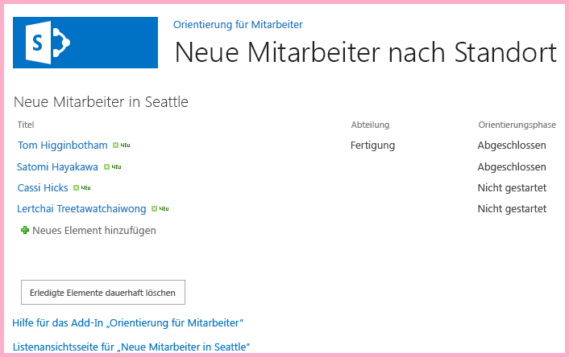
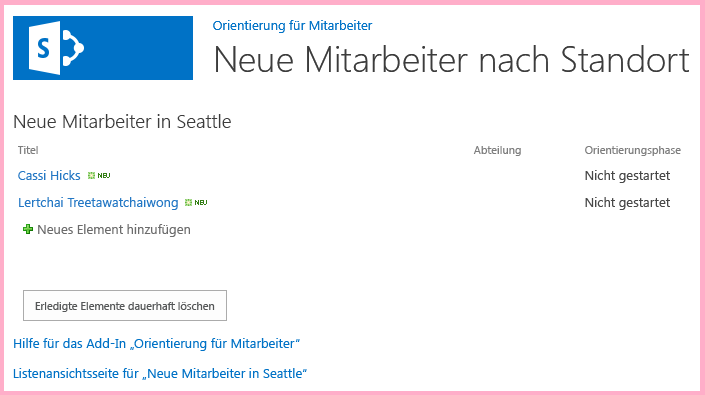

# Verwenden von SharePoint-JavaScript-APIs zum Arbeiten mit SharePoint-Daten
Verwenden Sie das SharePoint-JavaScript-Objektmodell, um mit SharePoint-Daten aus JavaScript auf Seiten im Add-In-Web zu arbeiten.
Dies ist der zehnte einer Reihe von Artikeln über die Grundlagen der Entwicklung von von SharePoint gehosteter SharePoint-Add-Ins. Machen Sie sich zunächst mit  [SharePoint-Add-Ins](sharepoint-add-ins.md) und den vorherigen Artikeln dieser Reihe vertraut:


-  [Erste Schritte beim Erstellen von von SharePoint gehosteten SharePoint-Add-Ins](get-started-creating-sharepoint-hosted-sharepoint-add-ins.md)


-  [Bereitstellung und Installation eines von SharePoint gehosteten Add-Ins für SharePoint](deploy-and-install-a-sharepoint-hosted-sharepoint-add-in.md)


-  [Hinzufügen von benutzerdefinierten Spalten zu einem von SharePoint gehosteten Add-In für SharePoint](add-custom-columns-to-a-sharepoint-hostedsharepoint-add-in.md)


-  [Hinzufügen eines benutzerdefinierten Inhaltstyps zu einem von SharePoint gehosteten Add-In für SharePoint](add-a-custom-content-type-to-a-sharepoint-hostedsharepoint-add-in.md)


-  [Hinzufügen eines Webparts zu einer Seite in einem von SharePoint gehosteten Add-In für SharePoint](add-a-web-part-to-a-page-in-a-sharepoint-hosted-sharepoint-add-in.md)


-  [Hinzufügen eines Workflows zu einem von SharePoint gehosteten Add-In für SharePoint](add-a-workflow-to-a-sharepoint-hosted-sharepoint-add-in.md)


-  [Hinzufügen einer benutzerdefinierten Seite und Formatvorlage zu einem von SharePoint gehosteten Add-In für SharePoint](add-a-custom-page-and-style-to-a-sharepoint-hosted-sharepoint-add-in.md)


-  [Hinzufügen des benutzerdefinierten clientseitigen Renderings für ein von SharePoint-gehostetes SharePoint Add-In](add-custom-client-side-rendering-to-a-sharepoint-hosted-sharepoint-add-in.md)


-  [Erstellen einer benutzerdefinierten Menübandschaltfläche im Hostweb eines SharePoint-Add-Ins](create-a-custom-ribbon-button-in-the-host-web-of-a-sharepoint-add-in.md)


> **HINWEIS**
> Wenn Sie diese Reihe zu von SharePoint gehosteten Add-Ins durchgearbeitet haben, haben Sie eine Visual Studio-Lösung, die Sie verwenden können, um mit diesem Thema fortzufahren. Sie können außerdem das Repository unter  [SharePoint_SP-Hosted_Add-Ins_Tutorials](https://github.com/OfficeDev/SharePoint_SP-hosted_Add-Ins_Tutorials) herunterladen und die Datei „BeforeJSOM.sln" öffnen.


Obwohl von SharePoint gehostete SharePoint-Add-Ins keinen serverseitigen Code enthalten können, können Sie dennoch über eine Geschäftslogik und Laufzeitinteraktion mit SharePoint-Komponenten in einer von SharePoint-gehosteten SharePoint-Add-In verfügen, indem Sie JavaScript und die SharePoint-JavaScript-Clientobjektmodell-Bibliothek verwenden. (Wir nennen sie JSOM. Beachten Sie das „M" am Ende. Verwechseln Sie dies nicht mit JSO **N** [JavaScript Object Notation].) In diesem Artikel verwenden Sie das JavaScript-Objektmodell, um alte Elemente in der Liste **Neue Mitarbeiter in Seattle** zu suchen und daraus zu entfernen.
## Erstellen des JavaScript und einer Schaltfläche zum Aufrufen


1. Stellen Sie sicher, dass der folgende Schritt aus dem ersten Lernprogramm in dieser Reihe abgeschlossen wurde: 

    Öffnen Sie die Datei **/Pages/Default.aspx** aus dem Stammverzeichnis des Projekts. Unter anderem lädt diese generierte Datei eines oder beide der zwei Skripts, die auf SharePoint: sp.runtime.js und sp.js gehostet werden. Das Markup zum Laden dieser Dateien befindet sich im **Content**-Steuerelement im oberen Bereich der Datei mit der ID **PlaceHolderAdditionalPageHead**. Das Markup variiert in Abhängigkeit von der **Microsoft Office-Entwicklertools für Visual Studio** -Version, die Sie verwenden. Diese Reihe von Lernprogrammen erfordert, dass beide Dateien geladen werden und sie mit normalen HTML **<script>**-Tags und nicht mit **<SharePoint:ScriptLink>**-Tags geladen werden. Stellen Sie sicher, dass die folgenden Zeilen im **PlaceHolderAdditionalPageHead**-Steuerelement  *über*  der Zeile `<meta name="WebPartPageExpansion" content="full" />` enthalten sind:


  ```

<script type="text/javascript" src="/_layouts/15/sp.runtime.js"></script>
<script type="text/javascript" src="/_layouts/15/sp.js"></script> 

  ```


   Durchsuchen Sie anschließend die Datei nach einem anderen Markup, das auch eine oder die andere dieser Dateien lädt, und entfernen Sie das redundante Markup. Speichern und schließen Sie die Datei.


2. In Knoten **Skripts** im **Projektmappen-Explorer** ist möglicherweise bereits eine Add-in.js-Datei vorhanden. Ist dies nicht der Fall, aber eine App.js-Datei vorhanden, klicken Sie mit der rechten Maustaste auf App.js, und benennen Sie sie in Add-in.js um. Wenn weder Add-in.js noch App.js vorhanden ist, erstellen Sie die Datei mit den folgenden Schritten:

1. Klicken Sie mit der rechten Maustaste auf den Knoten **Scripts**, und wählen Sie **Hinzufügen** > **Neues Element** > **Web** aus.


2. Wählen Sie **JavaScript-Datei** aus, und nennen Sie die DateiAdd-in.js.


3. Öffnen Sie Add-in.js, und löschen Sie ihren Inhalt, falls vorhanden.


4. Fügen Sie der Datei die folgenden Zeilen hinzu. Beachten Sie Folgendes zu diesem Code:

  - Die Zeile  `'use strict';` sorgt dafür, dass dass die JavaScript-Laufzeit im Browser eine Ausnahme auslöst, wenn Sie versehentlich bestimmte ungültige Methoden in JavaScript verwenden.


  - Die Variable  `clientContext` enthält ein **SP.ClientContext**-Objekt, das auf die SharePoint-Website verweist. Jeder JSOM-Code beginnt mit dem Erstellen eines Objekts dieses Typs oder dem Abrufen eines Verweises auf ein solches Objekt.


  - Die Variable  `employeeList` enthält einen Verweis auf die Listeninstanz **Neue Mitarbeiter in Seattle**.


  - Die Variable  `completedItems` enthält die Elemente aus der Liste, die das Skript löscht: die Elemente, deren Feld **OrientationStage** auf **Abgeschlossen** festgelegt ist.


  ```

'use strict';

var clientContext = SP.ClientContext.get_current(); 
var employeeList = clientContext.get_web().get_lists().getByTitle('New Employees In Seattle'); 
var completedItems; 
  ```

5. Um Nachrichten zwischen dem Clientbrowser und dem SharePoint-Server zu minimieren, verwendet JSOM ein Batchverarbeitungssystem. Nur eine Funktion, **SP.ClientContext.executeQueryAsync**, sendet tatsächlich Nachrichten an den Server (und empfängt Antworten). Aufrufe an die JSOM-APIs, die zwischen Aufrufen von **executeQueryAsync** stattfinden, werden gebündelt und in einem Batch beim nächsten Mal an den Server gesendet, wenn **executeQueryAsync** aufgerufen wird. Allerdings ist es in der Regel nicht möglich, eine Methode eines JSOM-Objekts aufzurufen, es sei denn, das Objekt wurde in einem vorherigen Aufruf von **executeQueryAsync** zum Client gebracht. Das Skript ruft die Methode **SP.ListItem.deleteObject** jedes abgeschlossenen Elements in der Liste auf, muss **executeQueryAsync** also zweimal aufrufen, einmal, um eine Auflistung von abgeschlossenen Listenelementen abzurufen, und ein zweites Mal, um die Aufrufe von **deleteObject** in einem Batch zusammenzufassen und zur Ausführung an den Server zu senden.

    Beginnen Sie also damit, eine Methode zu erstellen, um die Listenelemente vom Server abzurufen. Fügen Sie den folgenden Code in die Datei ein.


  ```

function purgeCompletedItems() {

   var camlQuery = new SP.CamlQuery(); 
   camlQuery.set_viewXml( 
         '<View><Query><Where><Eq>' + 
           '<FieldRef Name=\\'OrientationStage\\'/><Value Type=\\'Choice\\'>Completed</Value>' + 
         '</Eq></Where></Query></View>'); 
     completedItems = employeeList.getItems(camlQuery); 
}
  ```

6. Wenn diese Zeilen an den Server gesendet und dort ausgeführt werden, erstellen Sie eine Auflistung von Listenelementen, aber das Skript muss diese Auflistung zum Client bringen. Dies erfolgt durch einen Aufruf an die Funktion **SP.ClientContext.load**. Fügen Sie also die folgende Zeile am Ende der Methode zur Methode hinzu.

  ```

clientContext.load(completedItems);
  ```

7. Fügen Sie einen Aufruf von **executeQueryAsync** hinzu. Diese Methode hat zwei Parameter, die beide Rückruffunktionen sind. Die erste wird ausgeführt, wenn der Server erfolgreich alle Befehle im Batch ausführt. Die zweite wird ausgeführt, wenn auf dem Server aus irgendeinem Grund ein Fehler auftritt. Sie erstellen diese beiden Funktionen in späteren Schritten. Fügen Sie die folgende Zeile am Ende der Methode hinzu.

  ```
  clientContext.executeQueryAsync(deleteCompletedItems, onGetCompletedItemsFail);
  ```

8. Schließlich fügen Sie die folgende Zeile am Ende der Methode hinzu. Durch Rückgabe von **false** an die ASP.NET-Schaltfläche, die die Funktion aufrufen wird, wird das Standardverhalten von ASP.NET-Schaltflächen abgebrochen, das im erneuten Laden der Seite besteht. Ein erneutes Laden der Seite würde ein erneutes Laden der Datei Add-in.js verursachen. Das würde wiederum das Objekt `clientContext` erneut initialisieren. Wenn dieses erneute Laden zwischen dem Zeitpunkt, an dem **executeQueryAsync** seine Anforderung sendet, und dem Zeitpunkt, an dem der SharePoint-Server die Antwort zurücksendet, abgeschlossen wird, ist das ursprüngliche `clientContext`-Objekt nicht mehr vorhanden, um die Antwort zu verarbeiten. Die Funktion würde angehalten werden, ohne dass die Erfolgs- oder Fehlerrückrufe ausgeführt wurden. (Das genaue Verhalten kann je nach Browser unterschiedlich sein.)

  ```
  return false;
  ```

9. Fügen Sie der Datei die folgende Funktion,  `deleteCompletedItems`, hinzu. Diese Funktion wird ausgeführt, wenn die Funktion  `purgeCompletedItems` erfolgreich ist. Beachten Sie Folgendes zu diesem Code:

  - Die Methode **SP.ListItem.get_id** Methode gibt die ID des Listenelements zurück. Jedes Element im Array ist ein **SP.ListItem**-Objekt.


  - Die Methode **SP.List.getItemById** gibt das Objekt **SP.ListItem** mit der angegebenen ID zurück.


  - Die Methode **SP.ListItem.deleteObject** kennzeichnet das auf dem Server zu löschende Listenelement, wenn der Aufruf von **executeQueryAsync** vorgenommen wird.


  - Die Listenelemente müssen aus der Auflistung kopiert werden, die vom Server zu einem Array gesendet wird, bevor sie gelöscht werden können. Wenn das Skript die Methode **deleteObject** für jedes Element direkt in der **while**-Schleife aufgerufen hat, löst JavaScript einen Fehler aus, dass die Länge der Auflistung geändert wird, während die Enumeration ausgeführt wird. Die Fehlermeldung ist nicht wirklich wahr, da das Element nicht wirklich gelöscht wird, bis die **deleteObject**-Aufrufe gebündelt und an den Server gesendet werden, aber JSOM ist darauf ausgelegt, um die Ausnahmeauslöser zu imitieren, die auf dem Server auftreten würden (auf dem Code eine Auflistungsgröße nicht ändern sollte, während eine Enumeration der Auflistung erfolgt). Arrays haben jedoch eine feste Größe, deshalb wird beim Aufrufen von **deleteObject** für ein Element in einem Array das Element aus der Liste gelöscht, aber die Größe des Arrays wird nicht geändert.


  ```
  function deleteCompletedItems() {

    var itemArray = new Array();
    var listItemEnumerator = completedItems.getEnumerator();

    while (listItemEnumerator.moveNext()) {
        var item = listItemEnumerator.get_current();
        itemArray.push(item);
    }

    var i;
    for (i = 0; i < itemArray.length; i++) {
        employeeList.getItemById(itemArray[i].get_id()).deleteObject();
    }

    clientContext.executeQueryAsync(onDeleteCompletedItemsSuccess, onDeleteCompletedItemsFail);
}
  ```

10. Fügen Sie die folgende Funktion,  `onDeleteCompletedItemsSuccess`, zur Datei hinzu. Dies ist die Funktion, die ausgeführt wird, wenn die abgeschlossenen Elemente erfolgreich gelöscht werden (oder keine abgeschlossenen Elemente in der Liste vorhanden sind). Die zweite Zeile,  `location.reload(true);`, bewirkt, dass die Seite vom Server neu geladen wird. Dies erfolgt aus Gründen der Einfachheit, da das Listenansicht-Webpart auf der Seite weiterhin abgeschlossene Elemente angezeigt, bis die Seite aktualisiert wird. (Die Datei Add-in.js wird ebenfalls neu geladen, was aber kein Problem verursacht, da dies nicht in einer Weise erfolgt, die eine laufende JavaScript-Funktion unterbricht.)

  ```

function onDeleteCompletedItemsSuccess() {
    alert('Completed orientations have been deleted.');
    location.reload(true);
}
  ```

11. Fügen Sie die folgenden zwei Rückruf-bei-Fehler-Funktionen zu der Datei hinzu.

  ```

// Failure callbacks

function onGetCompletedItemsFail(sender, args) {
    alert('Unable to get completed items. Error:' + args.get_message() + '\\n' + args.get_stackTrace());
}

function onDeleteCompletedItemsFail(sender, args) {
    alert('Unable to delete completed items. Error:' + args.get_message() + '\\n' + args.get_stackTrace());
}
  ```

12. Öffnen Sie die Datei default.aspx, und suchen Sie nach dem **asp:Content**-Element mit der ID **PlaceHolderMain**.


13. Fügen Sie das folgende Markup zwischen dem Element **WebPartPages:WebPartZone** und dem ersten der zwei **asp:Hyperlink**-Elemente hinzu. Beachten Sie, dass der Wert des **OnClientClick**-Handlers  `return purgeCompletedItems()` statt nur `purgeCompletedItems()` ist. Der von der Funktion zurückgegebene Wert `false` weist ASP.NET an, die Seite nicht erneut zu laden.

  ```HTML

<p><asp:Button runat="server" OnClientClick="return purgeCompletedItems()"
  ID="purgecompleteditemsbutton" Text="Purge Completed Items" /></p>
  ```

14. Erstellen Sie das Projekt in Visual Studio neu.


15. Um die Notwendigkeit zu minimieren, die **Einführungsphase** von Listenelementen manuell aufAbgeschlossen beim Testen des Add-Ins festzulegen zu müssen, öffnen Sie die Datei elements.xml für die Listeninstanz **NeueMitarbeiterInSeattle** (nicht die elements.xml für die Listenvorlage **EinführungNeuerMitarbeiter**), und fügen Sie das Markup  `<Field Name="OrientationStage">Completed</Field>` als letztes untergeordnetes Element zu einem oder mehreren der **Row**-Elemente hinzu.

    Im Folgenden sehen Sie ein Beispiel, wie das Element **Rows** aussehen sollte.


  ```

<Rows>
  <Row>
    <Field Name="Title">Tom Higginbotham</Field>
    <Field Name="Division">Manufacturing</Field>
    <Field Name="OrientationStage">Completed</Field>
  </Row>
  <Row>
    <Field Name="Title">Satomi Hayakawa</Field>
    <Field Name="OrientationStage">Completed</Field>
  </Row>
  <Row>
    <Field Name="Title">Cassi Hicks</Field>
  </Row>
  <Row>
    <Field Name="Title">Lertchai Treetawatchaiwong</Field>
  </Row>
</Rows>
  ```


## Ausführen und Testen des Add-Ins


1. Aktivieren Sie Popups im Browser, den Visual Studio beim Debuggen verwendet.


2. Verwenden Sie die F5-TASTE, um Ihr Add-In bereitzustellen und auszuführen. Visual Studio führt eine temporäre Installation des Add-Ins auf Ihrer SharePoint-Testwebsite durch und führt das Add-In sofort aus.


3. Die Startseite des Add-Ins wird geöffnet, und es gibt ein oder mehrere Elemente in der Liste, für die **Einführungsphase** auf **Abgeschlossen** festgelegt ist.

   **Liste vor dem Löschen abgeschlossener Elemente**





4. Wenn die Startseite des Add-Ins vollständig geladen wurde, klicken Sie auf die Schaltlfäche **Abgeschlossene Elemente löschen**. Wenn der Vorgang erfolgreich ist (und Sie keine Fehlermeldung erhalten), werden alle **abgeschlossenen** Elemente gelöscht, und Sie sehen das Feld mit der Popupmeldung **Abgeschlossene Einführungen wurden gelöscht**.


5. Schließen Sie das Popup. Die Seite wird erneut geladen und die **abgeschlossenen** Elemente sind nicht mehr im Listenansicht-Webpart vorhanden...

   **Liste nach dem Löschen abgeschlossener Elemente**





6. Schließen Sie zum Beenden der Debugsitzung das Browserfenster, oder beenden Sie das Debuggen in Visual Studio. Jedes Mal, wenn Sie F5 drücken, zieht Visual Studio die vorherige Version des Add-Ins zurück und installiert die neueste.


7. Da Sie mit diesem Add-In und dieser Visual Studio-Projektmappe in anderen Artikeln arbeiten werden, hat es sich bewährt, das Add-In ein letztes Mal zurückzuziehen, wenn Sie Ihre Arbeit daran für eine Weile abgeschlossen haben. Klicken Sie mit der rechten Maustaste auf das Projekt im **Projektmappen-Explorer**, und wählen Sie **Zurückziehen** aus.


## 
<a name="Nextsteps"> </a>

Im nächsten Artikel dieser Reihe fügen Sie JavaScript zu einer Seite im Add-In-Web hinzu, das mit SharePoint-Daten im Hostweb arbeitet:  [Arbeiten mit Hostwebdaten aus JavaScript im Add-In-Webpart](work-with-host-web-data-from-javascript-in-the-add-in-web.md).


