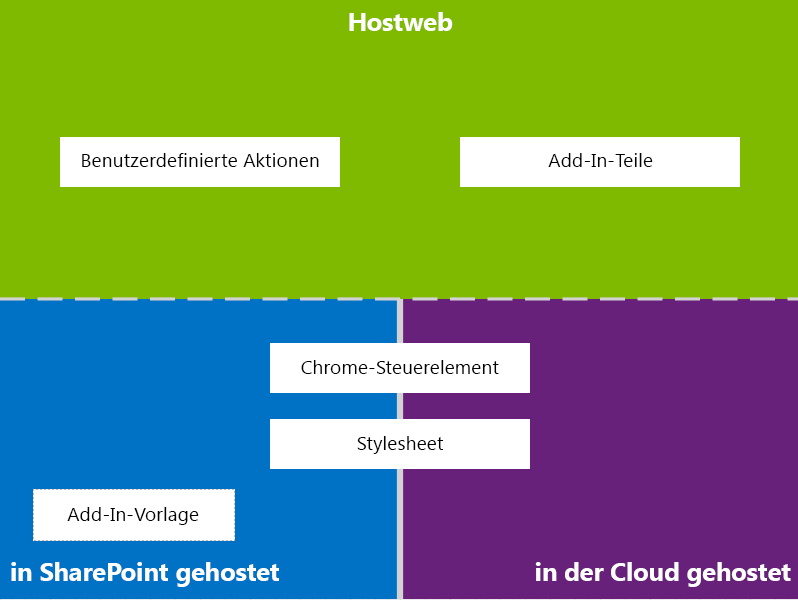
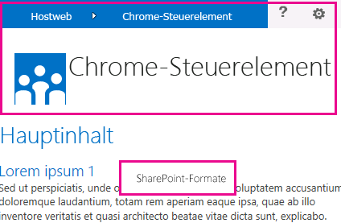
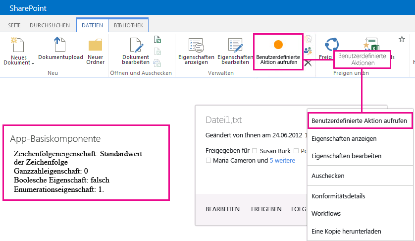

# UX-Design für SharePoint-Add-Ins
In diesem Artikel erfahren Sie mehr über die UX (User Experience)-Optionen, die Ihnen beim Erstellen von Add-Ins in SharePoint 2013 zur Verfügung stehen.
Als Entwickler sollten Sie der User Experience (UX), d. h. dem umfassenden Nutzungserlebnis des Benutzers, einen hohen Stellenwert beimessen, wenn Sie Add-Ins erstellen. Das Modell für SharePoint-Add-Ins bietet zahlreiche UX-Komponenten und Mechanismen, die Sie dabei unterstützen, ein optimales Nutzungserlebnis zu bieten. Die User Experience im Add-In-Modell ist außerdem so flexibel, dass Sie die Verfahren und Plattformen verwenden können, die sich am besten an die Anforderungen der Endbenutzer anpassen.

## Allgemeine Übersicht über Add-In-UX in SharePoint 2013

Als Add-In-Entwickler müssen Sie die Architektur Ihres Add-Ins kennen. Nachdem Sie bestimmt haben, wie Ihr Add-In in Remote- und SharePoint-Plattformen verteilt werden soll, können Sie unter den verfügbaren Alternativen zum Erstellen Ihrer Add-In-UX eine Wahl treffen. Sie können sich folgende Fragen stellen:

- Was kann ich verwenden, wenn ich ein in der Cloud gehostetes Add-In erstelle?

- Was kann ich verwenden, wenn ich ein in SharePoint gehostetes Add-In erstelle? Weitere Informationen finden Sie unter [Auswählen von Mustern für die Entwicklung und das Hosting Ihres Add-Ins für SharePoint](choose-patterns-for-developing-and-hosting-your-sharepoint-add-in.md).

- Wie kann ich meine UX mit der Hostwebsite verbinden? Weitere Informationen finden Sie unter  [Hostwebsites, Add-In-Websites und SharePoint-Komponenten in SharePoint 2013](host-webs-add-in-webs-and-sharepoint-components-in-sharepoint-2013.md).

Das folgende Diagramm zeigt die Hauptszenarien und Optionen, die Sie beim Entwerfen Ihrer Add-In-UX berücksichtigen sollten.

**Abbildung 1. Hauptszenarien und Optionen für die Add-In-UX**

Bei der Wahl Ihres Entwurfs sollten Sie grundsätzlich überlegen, welche Teile Ihres Add-Ins in SharePoint gehostet werden und welche nicht. Sie sollten außerdem überlegen, wie Ihr Add-In mit der Hostwebsite interagiert.

## Add-In-UX-Szenarien bei in der Cloud gehosteten Add-Ins

Angenommen, Sie bestimmen, dass ein Teil Ihrer User Experience nicht in SharePoint gehostet werden soll. Bei diesen Szenarien wird davon ausgegangen, dass Ihre Endbenutzer zwischen einer SharePoint-Website und dem in der Cloud gehosteten Add-In hin und her wechseln. Sie können die auf der Plattform verfügbaren Verfahren und Tools verwenden, jedoch bietet SharePoint ebenfalls Ressourcen, damit Sie eine nahtlose Erfahrung für Ihre Benutzer entwerfen können.

Die folgenden UX-Ressourcen sind für in der Cloud gehostete Add-Ins in SharePoint 2013 verfügbar:

- **Chromsteuerelement:** DasChromsteuerelement ermöglicht Ihnen, den Navigationsheader einer bestimmten SharePoint-Website in Ihrem Add-In zu verwenden, ohne eine Serverbibliothek registrieren zu müssen oder eine bestimmte Technologie bzw. ein bestimmtes Tool zu verwenden. Um diese Funktion zu nutzen, müssen Sie eine SharePoint-JavaScript-Bibliothek durch standardmäßige <script>-Tags registrieren. Sie können einen Platzhalter bereitstellen, indem Sie ein HTML- **div**-Element verwenden und das Steuerelement mithilfe der verfügbaren Optionen weiter anpassen. Das Steuerelement erhält sein Aussehen durch die angegebene SharePoint-Website. Weitere Informationen finden Sie unter  [Verwenden des Client-Chromsteuerelements in Add-Ins für SharePoint](use-the-client-chrome-control-in-sharepoint-add-ins.md).

   **Video anschauen: Chromsteuerelement in SharePoint 2013**

- **Stylesheet:** Sie können in Ihrer SharePoint-Add-In auf das Stylesheet einer SharePoint-Website verweisen und es zum Formatieren Ihrer Webseiten nutzen, indem Sie die verfügbaren Klassen verwenden. Wenn die Endbenutzer das Design der SharePoint-Website ändern, kann Ihr Add-In außerdem die neuen Formate übernehmen, ohne dass der Verweis in Ihrem Add-In geändert werden muss. Weitere Informationen finden Sie unter [Verwenden des Stylesheets einer SharePoint-Website in Add-Ins für SharePoint](use-a-sharepoint-website-s-style-sheet-in-sharepoint-add-ins.md).

Abbildung 2 zeigt die Ressourcen in der Modell für SharePoint-Add-Ins für in der Cloud gehostete Add-Ins.

**Abbildung 2. Add-In-UX-Ressourcen für in der Cloud gehostete Add-Ins**

## Add-In-UX-Szenarien für in SharePoint gehostete Add-Ins

Wenn Ihr Add-In in SharePoint gehostet wird, ist es weniger wahrscheinlich, dass sich die User Experience stark ändert, wenn Benutzer zwischen der Hostwebsite und der Add-In-Website hin und her wechseln. Wenn das Add-In bereitgestellt wird, übernimmt die Add-In-Website das Stylesheet und Design der Hostwebsite. Sie können das Chromsteuerelement und das Stylesheet in einem in SharePoint gehosteten Add-In weiterhin verwenden, der signifikanteste Unterschied bei in der Cloud gehosteten Szenarien besteht jedoch in der Verfügbarkeit der Add-In-Vorlage.

Die folgende UX-Ressource ist für in SharePoint gehostete Add-Ins verfügbar:

- **Add-In-Vorlage:** Die Add-In-Vorlage enthält die **app.master**-Masterseite. Sie ist die Standardoption bei der Erstellung eines Add-Ins.

Auch in SharePoint gehostete Add-Ins nutzen vorhandene Ressourcen und Technologien in SharePoint, wie Menüband, Webpartinfrastruktur und clientseitiges Rendering.

## Szenarien für das Verbinden der Add-In-UX mit der Hostwebsite

Einige Verwendungsfälle für Ihr Add-In können innerhalb der Hostwebsite ausgelöst werden. SharePoint bietet zwei Möglichkeiten zum Öffnen Ihres Add-Ins über eine Dokumentbibliothek oder Liste, zusätzlich zu den Möglichkeiten, einen Teil der Add-In-UX innerhalb von Seiten anzuzeigen, die in SharePoint gehostet sind.

Die folgenden UX-Ressourcen sind verfügbar, um Ihre Add-In-UX mit der Hostwebsite zu verbinden:

- **Benutzerdefinierte Aktionen**: Sie können benutzerdefinierte Aktionen verwenden, um die Hostwebsite-UX mit Ihrem Add-In zu verbinden. Es gibt zwei Typen von benutzerdefinierten Aktionen:Menüband oderECB. Eine benutzerdefinierte Aktion kann Parameter, wie z. B. die Liste oder das Element, in der bzw. dem sie aufgerufen wurde, an eine Remoteseite senden. Weitere Informationen finden Sie unter  [Gewusst wie: Erstellen benutzerdefinierter Aktionen zur Bereitstellung mit Add-Ins für SharePoint](create-custom-actions-to-deploy-with-sharepoint-add-ins.md).

- **Add-In-Parts:** Sie können einen Teil der User Experience Ihres Add-Ins mithilfe von Add-In-Parts der Hostwebsite hinzufügen. Das Add-In-Part ist bei der Bereitstellung des Add-Ins im Webpartkatalog auf der Hostwebsite verfügbar. Benutzer können das Add-In-Part einer Seite hinzufügen, indem sie das Steuerelement zum **Hinzufügen von Webparts** verwenden. Weitere Informationen finden Sie unter [Erstellen von Add-In-Webparts zur Installation mit Ihrem SharePoint-Add-In](create-add-in-parts-to-install-with-your-sharepoint-add-in.md).

Abbildung 3 zeigt die Ressourcen im Modell für SharePoint-Add-Ins zum Verbinden Ihrer Add-In-UX mit der Hostwebsite.

**Abbildung 3. Add-In-UX-Ressourcen für die Hostwebsite**

## Weitere Informationsquellen

Informationen über die Verwendung der Add-In-UX-Optionen in SharePoint-Add-Ins finden Sie in den folgenden Ressourcen:

-  [Entwerfen von SharePoint-Add-Ins](design-sharepoint-add-ins.md)

-  [SharePoint-Add-Ins](sharepoint-add-ins.md)

-  [Drei Ansätze, um Entwurfsentscheidungen für Add-Ins für SharePoint zu treffen](three-ways-to-think-about-design-options-for-sharepoint-add-ins.md)

-  [Wichtige Aspekte der Architektur und Entwicklungslandschaft von Add-Ins für SharePoint](important-aspects-of-the-sharepoint-add-in-architecture-and-development-landscap.md)

-  [Hostwebsites, Add-In-Websites und SharePoint-Komponenten in SharePoint 2013](host-webs-add-in-webs-and-sharepoint-components-in-sharepoint-2013.md)

-  [Designrichtlinien für die Benutzerfreundlichkeit von Add-Ins für SharePoint](sharepoint-add-ins-ux-design-guidelines.md)

-  [Erstellen von UX-Komponenten in SharePoint 2013](create-ux-components-in-sharepoint-2013.md)

-  [Verwenden des Stylesheets einer SharePoint-Website in Add-Ins für SharePoint](use-a-sharepoint-website-s-style-sheet-in-sharepoint-add-ins.md)

-  [Verwenden des Client-Chromsteuerelements in Add-Ins für SharePoint](use-the-client-chrome-control-in-sharepoint-add-ins.md)

-  [Erstellen von Add-In-Webparts zur Installation mit Ihrem SharePoint-Add-In](create-add-in-parts-to-install-with-your-sharepoint-add-in.md)

-  [Gewusst wie: Erstellen benutzerdefinierter Aktionen zur Bereitstellung mit Add-Ins für SharePoint](create-custom-actions-to-deploy-with-sharepoint-add-ins.md)

