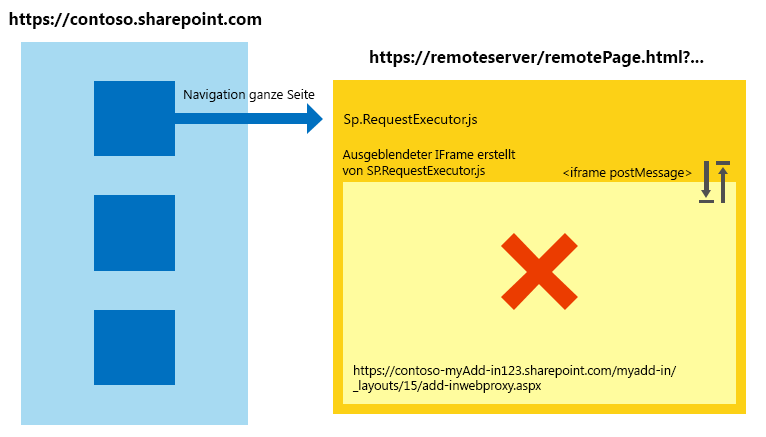
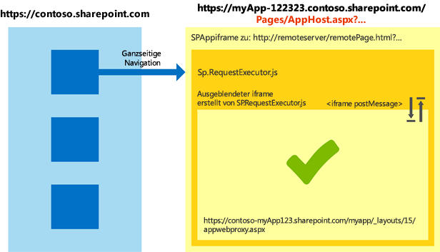

# Arbeiten mit der domänenübergreifenden Bibliothek in verschiedenen Internet Explorer-Sicherheitszonen in Add-Ins für SharePoint
Hier erfahren Sie, wie Sie die domänenübergreifende Bibliothek in SharePoint 2013 verwenden, wenn sich das Hostweb und Add-In-Seiten in verschiedenen Sicherheitszonen in Windows Internet Explorer befinden.
Wenn Sie die domänenübergreifende SharePoint 2013-Bibliothek für Ihr Add-In verwenden, müssen Sie die Funktion von Sicherheitszonen in Internet Explorer kennen. In dem Add-In können Kommunikationsprobleme auftreten, wenn sich die SharePoint-Website und das Add-In in verschiedenen Zonen befinden. In diesem Artikel wird erklärt, was geschieht, wenn Sie die domänenübergreifende Bibliothek in verschiedenen Internet Explorer-Sicherheitszonen verwenden.


## Zonenübergreifende Szenarien in Internet Explorer mit der domänenübergreifenden SharePoint-Bibliothek
<a name="bk_crosszonescenarios"> </a>

Aus Sicherheitsgründen verhindert Internet Explorer, dass Seiten, die verschiedenen Integritätsebenen (auch Sicherheitszonen genannt) angehören, Cookies gemeinsam nutzen, weil jede Integritätsebene über einen eigenen Cookiespeicher verfügt. Die Integritätsebene einer Seite wird durch die oberste Seite bestimmt, und jeder Frame innerhalb dieser Seite gehört der gleichen Integritätsebene an. Weitere Informationen finden Sie unter dem Thema zum Cookie-Sharing, [Beware Cookie Sharing in Cross-Zone Scenarios](http://blogs.msdn.com/b/ieinternals/archive/2011/03/10/internet-explorer-beware-cookie-sharing-in-cross-zone-scenarios.aspx).


Die domänenübergreifende SharePoint-Bibliothek verwendet einen verborgenen **IFrame** und eine clientseitige Proxyseite, die in SharePoint gehostet wird, um die clientseitige Kommunikation über JavaScript zu ermöglichen. Die domänenübergreifende Bibliothek ist verfügbar, wenn Sie in Seiten auf die Datei sp.requestexecutor.js verweisen. Weitere Informationen finden Sie unter [Zugreifen auf SharePoint 2013-Daten über Add-Ins mithilfe der domänenübergreifenden Bibliothek](access-sharepoint-2013-data-from-add-ins-using-the-cross-domain-library.md).


Wenn sich die Seite des Remote-Add-Ins und die SharePoint-Website in verschiedenen Sicherheitszonen befinden, können die Autorisierungscookies nicht gesendet werden. Wenn keine Autorisierungscookies vorhanden sind und **IFrame** die Proxyseite zu laden versucht, wird dieser zur SharePoint-Anmeldeseite weitergeleitet. Aus Sicherheitsgründen kann die SharePoint-Anmeldeseite nicht in einem **IFrame** enthalten sein. In diesen Szenarien kann die Bibliothek die Proxyseite nicht laden, und es ist keine Kommunikation mit SharePoint möglich.


Im folgenden Diagramm ist ein zonenübergreifendes Szenario dargestellt, in dem die Proxyseite nicht geladen werden kann. Die oberste Seite weist den Frame der gleichen Sicherheitszone zu wie  `http://remoteserver/remotepage.html`. Die Proxyseite wird nicht geladen.


**Abbildung 1. Zonenübergreifendes Szenario, in dem die Proxyseite nicht geladen werden kann**





Es folgen einige Beispiele, in denen die domänenübergreifende Bibliothek die Proxyseite unter Umständen nicht laden kann:


- Ihre Kunden verwenden SharePoint Online, und die Seite des Remote-Add-In wird auf einem Intranetserver gehostet. In diesem Szenario tritt wahrscheinlich das Problem mit dem Laden der Proxyseite auf, weil die SharePoint-Online-URL in der Regel nicht zur lokalen Intranetzone gehört. Dies ist ein häufiger vorkommendes Szenario während der anfänglichen Entwicklung eines Add-Ins, da Sie möglicherweise IIS Express oder einen anderen lokalen Server verwenden, um Ihre Seite ohne vollqualifizierte Internetdomäne zu hosten.


- Ihre Kunden verwenden SharePoint lokal mit formularbasierter Authentifizierung, und die Remoteseite wird von einem Clouddienst gehostet (beispielsweise Microsoft Azure).


## Behandlung zonenübergreifender Szenarien in SharePoint-Add-Ins
<a name="bk_handlingcrosszone"> </a>

Dieses Problem kann sowohl während der Add-In-Entwicklung (dringend empfohlen) als auch während der Ausführung des Add-Ins auf verschiedene Weise gelöst werden.


### Bewährte Methode: Verwenden Sie das apphost-Muster

Zur Behandlung eines zonenübergreifenden Szenarios wird empfohlen, eine apphost-Seite in die SharePoint-Website aufzunehmen. Die apphost-Seite ist eine SharePoint-Seite, welche die Remoteseite in einem **IFrame** enthält. Alles, was im **IFrame** in der Apphost-Seite enthalten ist, gehört derselben Sicherheitszone wie das Add-In-Web an. Die domänenübergreifende Bibliothek in der Remoteseite kann die Autorisierungscookies empfangen und die Proxyseite erfolgreich laden.


Im folgenden Diagramm wird ein zonenübergreifendes Szenario dargestellt, in dem das apphost-Seitenmuster zum Einsatz kommt. 


**Abbildung 2. Behandlung eines zonenübergreifenden Szenarios mit dem apphost-Seitenmuster**





Der für die apphost-Seite erforderliche Code ist einfach. Der Hauptteil der apphost-Seite ist ein **SPAppIFrame**-Element. Sie müssen CSS-Formatierungen verwenden, um den **IFrame** unsichtbar zu machen, damit es nicht zu Konflikten mit dem Add-In kommt.


Das folgende Markup ist ein Beispiel für eine einfache apphost-Seite. Damit werden die folgenden Aufgaben ausgeführt:


- Deklarieren von Direktiven, die zur Verwendung von SharePoint-Komponenten erforderlich sind.


- Deklarieren von Formatierungen, um den **IFrame** unsichtbar zu machen.


- Deklarieren des **SPAppIFrame**-Elements und Festlegen des Ziels auf die Add-In-Startseite.


```HTML

<%@ Page
    Inherits="Microsoft.SharePoint.WebPartPages.WebPartPage, Microsoft.SharePoint, Version=15.0.0.0, Culture=neutral, PublicKeyToken=71e9bce111e9429c" 
    language="C#" %>
<%@ Register 
    Tagprefix="SharePoint" 
    Namespace="Microsoft.SharePoint.WebControls" 
    Assembly="Microsoft.SharePoint, Version=15.0.0.0, Culture=neutral, PublicKeyToken=71e9bce111e9429c" %>
<%@ Register 
    Tagprefix="Utilities" 
    Namespace="Microsoft.SharePoint.Utilities" 
    Assembly="Microsoft.SharePoint, Version=15.0.0.0, Culture=neutral, PublicKeyToken=71e9bce111e9429c" %>
<%@ Register 
    Tagprefix="WebPartPages" 
    Namespace="Microsoft.SharePoint.WebPartPages" 
    Assembly="Microsoft.SharePoint, Version=15.0.0.0, Culture=neutral, PublicKeyToken=71e9bce111e9429c" %>

<html>
<head>
    <title>Your add-in page title</title>
    <style type="text/css">
        html, body
        {
            overflow:hidden;
        }
    
        body
        {
            margin:0px;
            padding:0px;
        }
     
        iframe 
        {
            border:0px;
            height:100%;
            width:100%;
        }
    </style>
</head>

<body>
    <SharePoint:SPAppIFrame 
        runat="server" 
        src="~remoteAppUrl/StartPage.html?{StandardTokens}" 
        frameborder="0">
    </SharePoint:SPAppIFrame>
</body>
</html>
```

Wenn Benutzer über Deep-Links auf Teile des Add-Ins zugreifen können sollen, kann die apphost-Seite mit Inhalten des **IFrame** zusammenarbeiten, um dies zu ermöglichen. Eine Alternative besteht darin, die postMessage-Methode des **IFrame** und jeweils verschiedene URLs für jede Seite des Remote-Add-Ins zu verwenden. Um verschiedene URLs für Seiten anzugeben, können Sie einzelne Seiten im Add-In-Web erstellen oder Abfragezeichenfolgen-Parameter für eine Seite verwenden.


### Alternatives Muster: Hinzufügen der Websites zu selben Sicherheitszone in Internet Explorer

Selbst wenn ein Add-In nicht unter Verwendung des Apphost-Musters entworfen wurde, können Sie für ihr Funktionieren sorgen, indem Sie die folgenden Domänen derselben Sicherheitszone hinzufügen: 


- Die Domäne Ihrer SharePoint-Website (beispielsweise  `https://contoso.sharepoint.com`).


- Die Domäne des Add-Ins, die in der Cloud gehostet wird ( `http://remoteserver`).


- Die Domäne der von Microsoft gehosteten Anmeldeseiten und Dienste ( `*.microsoftonline.com`).


Administratoren können mithilfe von Active Directory-Richtlinien Änderungen auf alle Computer der Organisation übertragen.


## Sicherheitsimplikationen der Verwendung des apphost-Musters
<a name="bk_securityimplications"> </a>

Beachten Sie unbedingt, dass das apphost-Muster im Endeffekt bewirkt, dass die Remoteseite der gleichen Sicherheitszone wie das Add-In-Web angehört. Berücksichtigen Sie die Auswirkungen, die das Hinzufügen einer Website zu einer Sicherheitszone hat. Weitere Informationen finden Sie unter  [Gewusst wie: Verwenden von Sicherheitszonen in Internet Explorer](http://support.microsoft.com/kb/174360/de-de/).


## Verwendung anderer Browser: Chrome, Firefox und Safari
<a name="bk_otherbrowsers"> </a>

Andere Browser, wie z. B. Google Chrome, Mozilla Firefox und Apple Safari, implementieren das Konzept der Sicherheitszone nicht. Wenn ein Browser Cookies nicht an getrennten Speicherorten isoliert, werden die in diesem Artikel beschriebenen Probleme wahrscheinlich nicht auftreten. Wir empfehlen, dass Sie das apphost-Muster in Ihren Add-Ins verwenden. Durch die Verwendung des apphost-Musters wird sichergestellt, dass das Add-In in den genannten Browsern und Internet Explorer unabhängig von der Sicherheitszone von SharePoint funktioniert.


## Weitere Ressourcen
<a name="bk_addresources"> </a>


-  [Sicherer Datenzugriff und Clientobjektmodelle für SharePoint-Add-Ins](secure-data-access-and-client-object-models-for-sharepoint-add-ins.md)


-  [Zugreifen auf SharePoint 2013-Daten über Add-Ins mithilfe der domänenübergreifenden Bibliothek](access-sharepoint-2013-data-from-add-ins-using-the-cross-domain-library.md)


-  [SharePoint-Add-Ins](sharepoint-add-ins.md)


-  [Autorisierung und Authentifizierung für Add-Ins in SharePoint 2013](authorization-and-authentication-of-sharepoint-add-ins.md)


-  [Drei Ansätze, um Entwurfsentscheidungen für Add-Ins für SharePoint zu treffen](three-ways-to-think-about-design-options-for-sharepoint-add-ins.md)


-  [Wichtige Aspekte der Architektur und Entwicklungslandschaft von Add-Ins für SharePoint](important-aspects-of-the-sharepoint-add-in-architecture-and-development-landscap.md)


-  [Hostwebsites, Add-In-Websites und SharePoint-Komponenten in SharePoint 2013](host-webs-add-in-webs-and-sharepoint-components-in-sharepoint-2013.md)


-  [Datenspeicher in Add-Ins für SharePoint](important-aspects-of-the-sharepoint-add-in-architecture-and-development-landscap.md#Data)


-  [Erstellen einer benutzerdefinierten Proxyseite für die domänenübergreifende Bibliothek in SharePoint 2013](create-a-custom-proxy-page-for-the-cross-domain-library-in-sharepoint-2013.md)


-  [Client-side Cross-domain Security](http://msdn.microsoft.com/de-de/library/cc709423%28VS.85%29.aspx)


