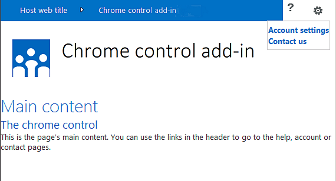
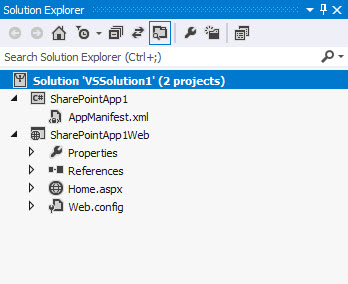
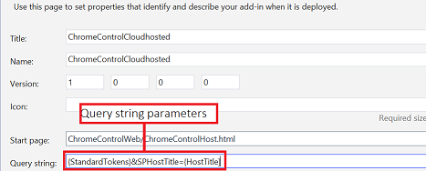
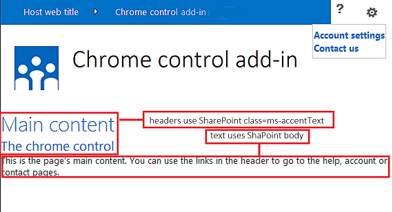

# Use the client chrome control in SharePoint Add-ins
Learn how to use the chrome control in add-ins in SharePoint 2013.
 


The chrome control in SharePoint 2013 enables you to use the header styling of a specific SharePoint site in your add-in without needing to register a server library or use a specific technology or tool. To use this functionality, you must register a SharePoint JavaScript library through a standard <script> tag. You can provide a placeholder by using an HTML **div** element and further customize the control by using the available options. The control inherits its appearance from the specified SharePoint website.
## Prerequisites for using the examples in this article
<a name="SP15Usechromecontrol_Prereq"> </a>

To follow the steps in this example, you need the following:


- Visual Studio 2015


- A SharePoint 2013 development environment (add-in isolation required for on-premises scenarios)


For guidance on how to set up a development environment that fits your needs, see  [Start building Office and SharePoint Add-ins](http://msdn.microsoft.com/library/187f8c8c-1b15-471c-80b5-69a40e67deea.aspx).


### Core concepts to know before using the chrome control

The following table lists useful articles that can help you understand the concepts involved in a scenario that uses the chrome control.


**Table 1. Core concepts for using the chrome control**


|**Article title**|**Description**|
|:-----|:-----|
| [SharePoint Add-ins](sharepoint-add-ins.md) <br/> |Learn about the new add-in model in SharePoint 2013 that enables you to create add-ins, which are small, easy-to-use solutions for end users.  <br/> |
| [UX design for SharePoint Add-ins](ux-design-for-sharepoint-add-ins.md) <br/> |Learn about the user experience (UX) options and alternatives that you have when building SharePoint Add-ins.  <br/> |
| [Host webs, add-in webs, and SharePoint components in SharePoint 2013](host-webs-add-in-webs-and-sharepoint-components-in-sharepoint-2013.md) <br/> |Learn about the distinction between host webs and add-in webs. Find out which SharePoint 2013 components can be included in a SharePoint Add-in, which components are deployed to the host web, which components are deployed to the add-in web, and how the add-in web is deployed in an isolated domain.  <br/> |
 

## Code example: Use the chrome control in your cloud-hosted add-in
<a name="SP15Usechromecontrol_Codeexample"> </a>

A cloud-hosted add-in includes at least one remote component. For more information, see  [Choose patterns for developing and hosting your SharePoint Add-in](choose-patterns-for-developing-and-hosting-your-sharepoint-add-in.md). To use the chrome control in your cloud-hosted add-in, follow these steps:


1. Create the SharePoint Add-in and remote web projects.


2. Send default configuration options in the query string.


3. Add a webpage to the web project.


Figure 1 shows a remote webpage with the chrome control.


**Figure 1. Remote webpage with the chrome control**





### To create the SharePoint Add-in and remote web projects


1. Open Visual Studio 2015 as administrator. (To do this, right-click the Visual Studio 2015 icon on the **Start** menu, and choose **Run as administrator**.)


2. Create a new project using the **SharePoint Add-in** template.

    Figure 2 shows the location of the **SharePoint Add-in** template in Visual Studio 2015, under **Templates**, **Visual C#**, **Office/SharePoint**, **Office Add-ins**.


   **Figure 2. SharePoint Add-in Visual Studio template**


3. Provide the URL of the SharePoint website that you want to use for debugging.


4. Select **Provider-hosted** as the hosting option for your add-in. For a SharePoint-hosted code sample, see [SharePoint-Add-in-JSOM-BasicDataOperations](https://github.com/OfficeDev/SharePoint-Add-in-JSOM-BasicDataOperations).

    After the wizard finishes, you should have a structure in **Solution Explorer** that resembles Figure 3.


   **Figure 3. Add-in for SharePoint projects in Solution Explorer**





### To send default configuration options in the query string


1. Open the Appmanifest.xml file in the manifest editor.


2. Add the **{StandardTokens}** token and an additional _SPHostTitle_ parameter to the query string. Figure 4 shows the manifest editor with the configured query string parameters.

   **Figure 4. Manifest editor with query string parameters for the chrome control**





    The chrome control automatically takes the following values from the query string:

  - **SPHostUrl**


  - **SPHostTitle**


  - **SPAppWebUrl**


  - **SPLanguage**


    **{StandardTokens}** include **SPHostUrl** and **SPAppWebUrl**.


### To add a page that uses the chrome control in the web project


1. Right-click the web project, and add a new Web Form.


2. Copy the following markup, and paste it in the ASPX page. The markup performs the following tasks:

  - Loads the AJAX library from the Microsoft CDN (Content Delivery Network).


  - Loads the jQuery library from the Microsoft CDN.


  - Loads the SP.UI.Controls.js file using the jQuery function **getScript**.


  - Defines a callback function for the **onCssLoaded** event.


  - Prepares the options for the chrome control.


  - Initializes the chrome control.


 ```HTML

<!DOCTYPE html>
<html xmlns="http://www.w3.org/1999/xhtml">
<head>
    <title>Chrome control host page</title>
    <script 
        src="//ajax.aspnetcdn.com/ajax/4.0/1/MicrosoftAjax.js" 
        type="text/javascript">
    </script>
    <script 
        type="text/javascript" 
        src="//ajax.aspnetcdn.com/ajax/jQuery/jquery-1.7.2.min.js">
    </script>  
    <script 
        type="text/javascript"
        src="ChromeLoader.js">
    </script>
<script type="text/javascript">
"use strict";

var hostweburl;

//load the SharePoint resources
$(document).ready(function () {
    //Get the URI decoded URL.
    hostweburl =
        decodeURIComponent(
            getQueryStringParameter("SPHostUrl")
    );

    // The SharePoint js files URL are in the form:
    // web_url/_layouts/15/resource
    var scriptbase = hostweburl + "/_layouts/15/";

    // Load the js file and continue to the 
    //   success handler
    $.getScript(scriptbase + "SP.UI.Controls.js", renderChrome)
});

// Callback for the onCssLoaded event defined
//  in the options object of the chrome control
function chromeLoaded() {
    // When the page has loaded the required
    //  resources for the chrome control,
    //  display the page body.
    $("body").show();
}

//Function to prepare the options and render the control
function renderChrome() {
    // The Help, Account and Contact pages receive the 
    //   same query string parameters as the main page
    var options = {
        "appIconUrl": "siteicon.png",
        "appTitle": "Chrome control add-in",
        "appHelpPageUrl": "Help.html?"
            + document.URL.split("?")[1],
        // The onCssLoaded event allows you to 
        //  specify a callback to execute when the
        //  chrome resources have been loaded.
        "onCssLoaded": "chromeLoaded()",
        "settingsLinks": [
            {
                "linkUrl": "Account.html?"
                    + document.URL.split("?")[1],
                "displayName": "Account settings"
            },
            {
                "linkUrl": "Contact.html?"
                    + document.URL.split("?")[1],
                "displayName": "Contact us"
            }
        ]
    };

    var nav = new SP.UI.Controls.Navigation(
                            "chrome_ctrl_placeholder",
                            options
                        );
    nav.setVisible(true);
}

// Function to retrieve a query string value.
// For production purposes you may want to use
//  a library to handle the query string.
function getQueryStringParameter(paramToRetrieve) {
    var params =
        document.URL.split("?")[1].split("&amp;");
    var strParams = "";
    for (var i = 0; i < params.length; i = i + 1) {
        var singleParam = params[i].split("=");
        if (singleParam[0] == paramToRetrieve)
            return singleParam[1];
    }
}
</script>
</head>

<!-- The body is initally hidden. 
     The onCssLoaded callback allows you to 
     display the content after the required
     resources for the chrome control have
     been loaded.  -->
<body style="display: none">

    <!-- Chrome control placeholder -->
    <div id="chrome_ctrl_placeholder"></div>

    <!-- The chrome control also makes the SharePoint
          Website stylesheet available to your page -->
    <h1 class="ms-accentText">Main content</h1>
    <h2 class="ms-accentText">The chrome control</h2>
    <div id="MainContent">
        This is the page's main content. 
        You can use the links in the header to go to the help, 
        account or contact pages.
    </div>
</body>
</html>
 ```

3. You can also use the chrome control in a declarative way. In the following code example, the HTML markup declares the control without using JavaScript code to configure and initialize the control. The following markup performs the following tasks:

  - Provides a placeholder for the SP.UI.Controls.js JavaScript file.


  - Dynamically loads the SP.UI.Controls.js file


  - Provides a placeholder for the chrome control and specifies the options inline with the HTML markup.


 ```HTML

<!DOCTYPE html>
<html xmlns="http://www.w3.org/1999/xhtml">
<head>
    <title>Chrome control host page</title>
    <script 
        src="http://ajax.aspnetcdn.com/ajax/4.0/1/MicrosoftAjax.js" 
        type="text/javascript">
    </script>
    <script 
        type="text/javascript" 
        src="http://ajax.aspnetcdn.com/ajax/jQuery/jquery-1.7.2.min.js">
    </script>  
    <script type="text/javascript">
    var hostweburl;

    // Load the SharePoint resources.
    $(document).ready(function () {

        // Get the URI decoded add-in web URL.
        hostweburl =
            decodeURIComponent(
                getQueryStringParameter("SPHostUrl")
        );

        // The SharePoint js files URL are in the form:
        // web_url/_layouts/15/resource.js
        var scriptbase = hostweburl + "/_layouts/15/";

        // Load the js file and continue to the 
        // success handler.
        $.getScript(scriptbase + "SP.UI.Controls.js")
    });

    // Function to retrieve a query string value.
    // For production purposes you may want to use
    // a library to handle the query string.
    function getQueryStringParameter(paramToRetrieve) {
        var params =
            document.URL.split("?")[1].split("&amp;");
        var strParams = "";
        for (var i = 0; i < params.length; i = i + 1) {
            var singleParam = params[i].split("=");
            if (singleParam[0] == paramToRetrieve)
                return singleParam[1];
        }
    }
    </script>
</head>
<body>

    <!-- Chrome control placeholder 
           Options are declared inline.  -->
    <div 
        id="chrome_ctrl_container"
        data-ms-control="SP.UI.Controls.Navigation"
        data-ms-options=
            '{
                "appHelpPageUrl" : "Help.html",
                "appIconUrl" : "siteIcon.png",
                "appTitle" : "Chrome control add-in",
                "settingsLinks" : [
                    {
                        "linkUrl" : "Account.html",
                        "displayName" : "Account settings"
                    },
                    {
                        "linkUrl" : "Contact.html",
                        "displayName" : "Contact us"
                    }
                ]
             }'>
    </div>

    <!-- The chrome control also makes the SharePoint
          Website style sheet available to your page. -->
    <h1 class="ms-accentText">Main content</h1>
    <h2 class="ms-accentText">The chrome control</h2>
    <div id="MainContent">
        This is the page's main content. 
        You can use the links in the header to go to the help, 
        account or contact pages.
    </div>
</body>
</html>
 ```


    The SP.UI.Controls.js library automatically renders the control if it finds the **data-ms-control="SP.UI.Controls.Navigation"** attribute in a **div** element.


### To edit the StartPage element in the add-in manifest


1. Double-click the **AppManifest.xml** file in **Solution Explorer**.


2. On the **Start page** drop-down menu, choose the webpage that uses the chrome control.


### To build and run the solution


1. Make sure that the SharePoint Add-in project is set as the startup project.


2. Press the F5 key.

    > **NOTE**
      > When you press F5, Visual Studio builds the solution, deploys the add-in, and opens the permissions page for the add-in. 
3. Choose the **Trust It** button.


4. Click the **ChromeControlCloudhosted** add-in icon.


5. When you use the chrome control in your webpages, you can also use the SharePoint website style sheet, as shown in Figure 4.

   **Figure 5. SharePoint website style sheet used in the page**





**Table 2. Troubleshooting the solution**


|**Problem**|**Solution**|
|:-----|:-----|
|Unhandled exception **SP is undefined**. <br/> |Make sure your browser loads SP.UI.Controls.js file.  <br/> |
|The chrome control does not render properly.  <br/> |The chrome control only supports document modes Internet Explorer 8 and superior. Make sure your browser renders your page in document mode Internet Explorer 8 or superior.  <br/> |
|Certificate error.  <br/> |Set the **SSL Enabled** property of your web project to false. In the SharePoint Add-in project, set the **Web Project** property toNone, and then set the property back to your web project's name.  <br/> |
 

## Next steps
<a name="SP15Usechromecontrol_Nextsteps"> </a>

This article demonstrated how to use the chrome control in a SharePoint Add-in. As a next step, you can learn about other UX components that are available for SharePoint Add-ins. To learn more, see the following:


-  [Code sample: Use the chrome control in a cloud-hosted add-in](http://code.msdn.microsoft.com/SharePoint-2013-Work-with-089ecc6f)


-  [Code sample: Use the chrome control and the cross-domain library (CSOM)](http://code.msdn.microsoft.com/SharePoint-2013-Use-the-97c30a2e)


-  [Code sample: Use the chrome control and the cross-domain library (REST)](http://code.msdn.microsoft.com/SharePoint-2013-Use-the-a759e9f8)


-  [Use a SharePoint website's style sheet in SharePoint Add-ins](use-a-sharepoint-website-s-style-sheet-in-sharepoint-add-ins.md)


-  [Create custom actions to deploy with SharePoint Add-ins](create-custom-actions-to-deploy-with-sharepoint-add-ins.md)


-  [Create add-in parts to install with your SharePoint Add-in](create-add-in-parts-to-install-with-your-sharepoint-add-in.md)


## Additional resources
<a name="SP15Usechromecontrol_Addresources"> </a>


-  [Set up an on-premises development environment for SharePoint Add-ins](set-up-an-on-premises-development-environment-for-sharepoint-add-ins.md)


-  [UX design for SharePoint Add-ins](ux-design-for-sharepoint-add-ins.md)


-  [SharePoint Add-ins UX design guidelines](sharepoint-add-ins-ux-design-guidelines.md)


-  [Create UX components in SharePoint 2013](create-ux-components-in-sharepoint-2013.md)


-  [Three ways to think about design options for SharePoint Add-ins](three-ways-to-think-about-design-options-for-sharepoint-add-ins.md)


-  [Important aspects of the SharePoint Add-in architecture and development landscape](important-aspects-of-the-sharepoint-add-in-architecture-and-development-landscap.md)


