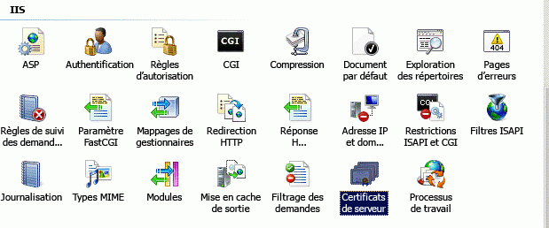
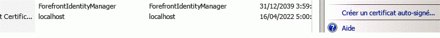
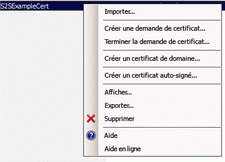
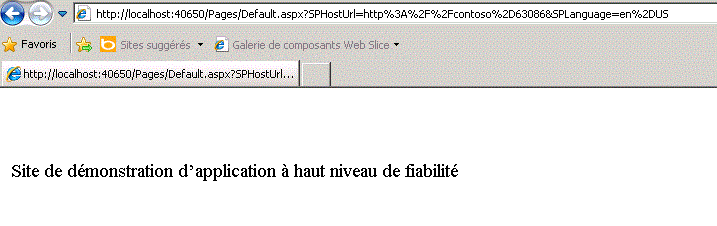

# Créer des compléments à haut niveau de fiabilité pour SharePoint 2013
Découvrez comment créer un Complément SharePoint à haut niveau de fiabilité. Un complément à haut niveau de fiabilité utilise des certificats numériques pour établir un lien de confiance entre une application web à distance et SharePoint 2013. Un complément à haut niveau de fiabilité peut être installé uniquement sur SharePoint sur site, et non sur Microsoft SharePoint Online, et est essentiellement destiné à être utilisé avec une application web sur site plutôt que dans le nuage.
## Conditions préalables à la création de compléments à haut niveau de fiabilité
<a name="Prereqs"> </a>

Pour suivre les procédures décrites dans cet article, assurez-vous que vous disposez de ce qui suit :
  
    
    

- Environnement de développement SharePoint 2013 local. Voir  [Configurer un environnement de développement local pour les compléments pour SharePoint](set-up-an-on-premises-development-environment-for-sharepoint-add-ins.md) pour obtenir des instructions d'installation. Assurez-vous notamment que vous avez suivi les étapes décrites dans la section [Configurer les services de SharePoint en vue d'une utilisation des compléments de serveur à serveur](set-up-an-on-premises-development-environment-for-sharepoint-add-ins.md#Servertoserver).
    
  
- Expérience requise pour créer un Complément SharePoint hébergé par le fournisseur. Voir  [Commencer à créer des compléments hébergés par un fournisseur pour SharePoint](get-started-creating-provider-hosted-sharepoint-add-ins.md).
    
  
- Visual Studio installé soit à distance, soit sur l'ordinateur où vous avez installé SharePoint 2013.
    
  
- Outils de développement Microsoft Office pour Visual Studio.
    
  
- Connaissance des certificats numériques (leur définition et leur mode d'utilisation).
    
  
Pour acquérir une meilleure compréhension des Compléments SharePoint et des certificats numériques, lisez les articles suivants.
  
    
    

**Tableau 1. Principaux concepts pour la configuration de SharePoint 2013 pour exécuter des compléments à haut niveau de fiabilité**


|**Titre de l'article**|**Description**|
|:-----|:-----|
| [Commencer à créer des compléments hébergés par un fournisseur pour SharePoint](get-started-creating-provider-hosted-sharepoint-add-ins.md) <br/> |Découvrez comment créer un Complément SharePoint hébergé par le fournisseur au moyen des Outils de développement Office pour Visual Studio, et comment interagir avec des sites SharePoint 2013 au moyen du modèle objet côté client (CSOM) SharePoint.  <br/> |
| [Digital Certificates](http://msdn.microsoft.com/library/e523b335-0156-4f47-b55c-b80495587c4f.aspx) et [Working with Certificates](http://msdn.microsoft.com/library/6ffb8682-8f07-4a45-afbb-8d2487e9dbc3.aspx) <br/> |Découvrez les idées fondamentales des certificats numériques.  <br/> |
   

## Présentation des compléments à haut niveau de fiabilité
<a name="Intro"> </a>

Un complément à haut niveau de fiabilité est un Complément SharePoint qui utilise des certificats numériques pour établir un lien de confiance entre une application web à distance et SharePoint. « Haut niveau de fiabilité » ne signifie pas « fiabilité totale ». Un complément à haut niveau de fiabilité doit demander des autorisations des compléments. Le complément est considéré comme « à haut niveau de fiabilité » quand on peut en toute confiance lui permettre de se servir de n'importe quelle identité d'utilisateur dont il a besoin, puisqu'il est responsable de la création de la partie utilisateur du jeton d'accès qu'il transmet à SharePoint.
  
    
    
Un Complément SharePoint à haut niveau de fiabilité est principalement destiné à être utilisé dans un environnement sur site. Un complément à haut niveau de fiabilité ne peut pas être installé sur Microsoft SharePoint Online, et les composants distants sont généralement installés sur site également, derrière le pare-feu d'entreprise. Les instances du Complément SharePoint sont donc propres à chaque organisation.
  
    
    
Un complément à haut niveau de fiabilité se sert d'un certificat plutôt que d'un jeton de contexte pour établir la confiance (un complément hébergé par le fournisseur, qui est conçu pour utiliser Microsoft Azure Access Control Service (ACS) comme service Broker d'approbation, doit être modifié pour opérer comme application à haut niveau de fiabilité). Un complément à haut niveau de fiabilité nécessite une configuration de la batterie de serveurs SharePoint et du serveur hébergeant l'application web distante. Cette rubrique décrit les étapes de configuration nécessaires pour faire fonctionner le débogage Visual Studio ( **F5**). Les procédures de configuration diffèrent quelque peu selon qu'il s'agit d'un environnement de test, d'un environnement intermédiaire ou d'un environnement de production. Ces procédures sont décrites dans la rubrique  [Empaquetage et publication de compléments SharePoint à haut niveau de fiabilité](package-and-publish-high-trust-sharepoint-add-ins.md). 
  
    
    
Dans SharePoint 2013, le service d'émission de jeton de sécurité (STS) de serveur à serveur fournit des jetons d'accès pour une authentification de serveur à serveur. Le service STS de serveur à serveur active des jetons temporaires permettant d'accéder à d'autres services d'application tels que Exchange 2013, Lync 2013 et des compléments pour SharePoint 2013. Une relation d'approbation entre les services d'application (par exemple, une approbation mutuelle entre SharePoint et un complément distant) est établie au moyen d'applets de commande Windows PowerShell et d'un certificat.
  
    
    

> **REMARQUE**
> Le service STS de serveur à serveur n'est pas destiné à être utilisé pour l'authentification des utilisateurs. C'est pourquoi ce même service ne figurera pas dans la page de connexion de l'utilisateur, dans la section **Fournisseur d'authentification** sur le site Administration centrale ou dans le Sélecteur de personnes dans SharePoint 2013.
  
    
    

Cet article montre comment créer un complément à haut niveau de fiabilité et fournit des instructions de configuration pour son exécution dans Visual Studio en appuyant sur **F5**. Vous allez apprendre à :
  
    
    

- Configurer un complément à utiliser comme complément à haut niveau de fiabilité.
    
  
- Configurer SharePoint 2013 pour utiliser des compléments à haut niveau de fiabilité.
    
  
- Créer un complément de base à haut niveau de fiabilité.
    
  

## Obtention d'un certificat ou création d'un certificat de test public et privé
<a name="Cert2"> </a>

Vous avez besoin d'un certificat numérique X.509 pour l'application web à distance de votre complément à haut niveau de fiabilité. Pour tester pleinement votre Complément SharePoint, vous avez besoin d'un certificat émis par le domaine ou d'un certificat commercial émis par une autorité de certification. Toutefois, pour la phase initiale de débogage, vous pouvez utiliser un certificat auto-signé. La procédure suivante explique comment créer et exporter un certificat de test à l'aide d'IIS. Vous allez apprendre à remplacer le certificat auto-signé par un certificat commercial ou émis par un domaine dans la section  [Achèvement du débogage avec un certificat commercial ou émis par un domaine](#NewCertificate) ci-dessous.
  
    
    
Une autre solution consiste à utiliser le programme test MakeCert pour générer un certificat X.509. Pour plus d'informations sur l'utilisation de MakeCert, voir  [Signature et vérification du code au moyen d'Authenticode](http://msdn.microsoft.com/fr-fr/library/ms537364%28VS.85%29.aspx).
  
    
    
Vous allez créer un fichier de certificat .pfx de test, puis un fichier .cer de test correspondant. Le certificat .pfx contient la clé privée utilisée par l'application web à distance pour signer ses communications à SharePoint. Le fichier .cer contient la clé publique que SharePoint utilise pour déchiffrer les messages, vérifier qu'ils proviennent de l'application web à distance, et s'assurer que cette dernière dispose d'un jeton d'accès reçu d'un émetteur de jeton approuvé par SharePoint. Pour plus d'informations sur les fichiers .pfx et .cer, voir la rubrique concernant le  [certificat d'éditeur de logiciels](http://msdn.microsoft.com/fr-fr/library/windows/hardware/ff552299%28v=vs.85%29.aspx)
  
    
    

### Pour créer un fichier de certificat .pfx de test auto-signé


1. Lorsque vous déboguez un Complément SharePoint à haut niveau de fiabilité dans Visual Studio, l'application web à distance est hébergée dans IIS Express sur l'ordinateur sur lequel Visual Studio est installé. Ainsi, l'ordinateur sur lequel l'application web à distance est installée ne dispose pas de gestionnaire des services Internet permettant de créer un certificat. C'est pourquoi, vous utilisez les services Internet sur le serveur de test  *SharePoint*  pour créer le certificat. Dans le gestionnaire des services Internet, sélectionnez le nœud _ServerName_ dans l'arborescence sur la gauche.
    
  
2. Sélectionnez l'icône **Certificats de serveur** présentée dans la figure 1 ci-dessous.
    
   **Figure 1. Option Certificats de serveur dans IIS**

  

     
  

  

  
3. Sélectionnez le lien **Créer un certificat auto-signé** parmi le jeu de liens sur le côté droit, comme illustré dans la figure 2 ci-dessous.
    
   **Figure 2. Lien Créer un certificat auto-signé**

  

     
  

  

  
4. Nommez le certificat HighTrustSampleCert, puis choisissez **OK**.
    
  
5. Cliquez avec le bouton droit sur le certificat, puis sélectionnez **Exporter** comme le montre la figure 3.
    
   **Figure 3. Exportation d'un certificat de test**

  

     
  

  

  
6. Dans Windows, ou à une ligne de commande, créez un dossier appelé C:\\Certs.
    
  
7. De retour dans le gestionnaire des services Internet, exportez le fichier vers C:\\Certs, puis attribuez-lui un mot de passe. Dans cet exemple, le mot de passe est **password**.
    
  
8. Si votre installation SharePoint de test ne se trouve pas sur l'ordinateur exécutant Visual Studio, créez un dossier C:\\Certs sur l'ordinateur exécutant Visual Studio, puis déplacez le fichier HighTrustSampleCert.pfx vers ce dernier. Il s'agit de l'ordinateur sur lequel s'exécute l'application web à distance lorsque vous effectuez un débogage dans Visual Studio.
    
  

### Pour créer un fichier .cer correspondant


1. Sur le serveur SharePoint, vérifiez que l'identité du pool de compléments pour les pools de compléments IIS suivants dispose de droits de lecture sur le dossier C:\\Certs :
    
  - **SecurityTokenServiceApplicationPool**
    
  
  - Pool de compléments servant le site web IIS hébergeant l'application web SharePoint parent pour votre site web SharePoint de test. Pour le site web IIS **SharePoint - 80**, le pool est nommé **OServerPortalAppPool**.
    
  
2. Dans le Gestionnaire des services Internet (IIS), sélectionnez le nœud  _NomServeur_ dans l'arborescence à gauche.
    
  
3. Double-cliquez sur **Certificats de serveur**.
    
  
4. Dans l'affichage **Certificats de serveur**, double-cliquez sur **HighTrustSampleCert** pour afficher les détails des certificats.
    
  
5. Sous l'onglet **Détails**, choisissez **Copier dans un fichier** pour lancer l' **Assistant Exportation du certificat**, puis choisissez **Suivant**.
    
  
6. Utilisez la valeur par défaut **Non, ne pas exporter la clé privée**, puis choisissez **Suivant**.
    
  
7. Utilisez les valeurs par défaut. Choisissez **Suivant**.
    
  
8. Choisissez **Parcourir**, accédez à C:\\Certs, nommez le certificat **HighTrustSampleCert**, puis cliquez sur **Enregistrer**. Le certificat est enregistré sous la forme d'un fichier .cer.
    
  
9. Choisissez **Suivant**.
    
  
10. Choisissez **Terminer**.
    
  

## Configurer SharePoint 2013 en vue de l'utilisation de certificats et configurer le niveau d'approbation pour votre complément
<a name="Configure2"> </a>

Le script Windows PowerShell que vous créez dans cette section est destiné à prendre en charge l'utilisation de **F5** dans Visual Studio. Il ne configure *pas*  à proprement parler une installation SharePoint intermédiaire ou de production. Pour obtenir des instructions sur la configuration d'une installation SharePoint de production pour l'utilisation de certificats, voir [Empaquetage et publication de compléments SharePoint à haut niveau de fiabilité](package-and-publish-high-trust-sharepoint-add-ins.md).
  
    
    

> **REMARQUE**
> Assurez-vous que vous avez suivi la procédure décrite dans la rubrique  [Configurer les services de SharePoint en vue d'une utilisation des compléments de serveur à serveur](set-up-an-on-premises-development-environment-for-sharepoint-add-ins.md#Servertoserver) (ce qui constitue une condition préalable pour cet article). Si ce n'est pas le cas, vous devez effectuer cette configuration maintenant, avant de continuer.
  
    
    


### Pour configurer SharePoint


1. Dans un éditeur de texte ou dans l'éditeur Windows PowerShell, créez un fichier et ajoutez-y les lignes suivantes pour créer un objet certificat :
    
 ```
  
$publicCertPath = "C:\\Certs\\HighTrustSampleCert.cer"
$certificate = New-Object System.Security.Cryptography.X509Certificates.X509Certificate2($publicCertPath)

 ```

2. Ajoutez la ligne suivante pour vous assurer que SharePoint traite le certificat comme une autorité racine.
    
 ```
  
New-SPTrustedRootAuthority -Name "HighTrustSampleCert" -Certificate $certificate

 ```

3. Ajoutez la ligne suivante pour obtenir l'ID du domaine d'autorisation.
    
 ```
  
$realm = Get-SPAuthenticationRealm

 ```

4. Votre application web à distance utilisera un jeton d'accès pour accéder aux données SharePoint. Le jeton d'accès doit être émis par un émetteur de jeton approuvé par SharePoint. Dans un Complément SharePoint à haut niveau de fiabilité, le certificat est l'émetteur de jeton. Ajoutez les lignes suivantes pour créer un ID de l'émetteur au format requis par SharePoint : ** _specific_issuer_GUID_@ _realm_GUID_**.
    
 ```
  
$specificIssuerId = "11111111-1111-1111-1111-111111111111"
$fullIssuerIdentifier = $specificIssuerId + '@' + $realm 

 ```


    > **REMARQUE**
      > La valeur  `$specificIssuerId` doit être un GUID car, dans un environnement de production, chaque certificat doit avoir un émetteur unique. Toutefois, dans ce contexte où vous utilisez le même certificat pour déboguer tous les compléments à haut niveau de fiabilité, vous pouvez coder en dur la valeur. Si, pour une raison quelconque, vous utilisez un GUID différent de celui utilisé ici, * **assurez-vous que toutes les lettres du GUID sont en minuscules*** . L'infrastructure SharePoint exige actuellement l'utilisation de lettres minuscules pour les GUID d'émetteur de certificat.
5. Ajoutez les lignes suivantes pour enregistrer le certificat sous la forme d'un émetteur de jeton approuvé. Le paramètre  `-Name` doit être unique. Ainsi, dans une configuration de production, il est courant d'utiliser un GUID pour une partie ou la totalité du nom. Toutefois, dans ce contexte, vous pouvez utiliser un nom convivial. Le commutateur `-IsTrustBroker` est nécessaire pour garantir que vous pouvez utiliser le même certificat pour tous les compléments à haut niveau de fiabilité que vous développez. La commande `iisreset` est requise pour que votre émetteur de jeton soit immédiatement enregistré. Sans cette dernière, il se peut que vous deviez patienter jusqu'à 24 heures avant que le nouvel émetteur soit enregistré.
    
 ```
  
New-SPTrustedSecurityTokenIssuer -Name "High Trust Sample Cert" -Certificate $certificate -RegisteredIssuerName $fullIssuerIdentifier -IsTrustBroker
iisreset 

 ```

6. Normalement, SharePoint 2013 n'accepte pas les certificats auto-signés. Ainsi, lorsque vous utilisez un certificat auto-signé pour le débogage, ajoutez les lignes suivantes pour contourner l'exigence normale de SharePoint que les applications web à distance utilisent le protocole HTTPS quand elles appellent SharePoint. À défaut, vous obtiendrez un message **403 Interdit** lorsque l'application web à distance appellera SharePoint en utilisant un certificat auto-signé. Vous pourrez annuler cette action dans une procédure ultérieure. Le contournement de l'exigence d'utilisation du protocole HTTPS a pour effet que les demandes de l'application web à distance adressées à SharePoint ne sont pas chiffrées, mais que le certificat continue à être utilisé comme émetteur approuvé de jetons d'accès, ce qui est l'objectif principal dans des Compléments SharePoint à haut niveau de fiabilité.
    
 ```
  
$serviceConfig = Get-SPSecurityTokenServiceConfig
$serviceConfig.AllowOAuthOverHttp = $true
$serviceConfig.Update()

 ```

7. Enregistrez le fichier sous le nom HighTrustConfig-ForDebugOnly.ps1.
    
  
8. Ouvrez **SharePoint Management Shell** en tant qu'administrateur, puis exécutez le fichier avec la ligne suivante :
    
 ```
  
./HighTrustConfig-ForDebugOnly.ps1
 ```


## Créer un Complément SharePoint à haut niveau de fiabilité
<a name="Createapp2"> </a>

Dans cette section, vous apprenez à créer un Complément SharePoint à haut niveau de fiabilité en utilisant Visual Studio.
  
    
    

> **REMARQUE**
> Comme indiqué dans la section  [Conditions préalables à la création de compléments à haut niveau de fiabilité](#Prereq), cet article part du principe que vous savez comment créer un Complément SharePoint hébergé par le fournisseur. Pour plus d'informations, voir  [Commencer à créer des compléments hébergés par un fournisseur pour SharePoint](get-started-creating-provider-hosted-sharepoint-add-ins.md). 
  
    
    


### Pour créer un Complément SharePoint à haut niveau de fiabilité


1. Dans Visual Studio, choisissez successivement **Fichier**, **Nouveau**, puis **Projet**.
    
  
2. Dans l'Assistant **Nouveau projet**, développez le nœud **Visual C#** ou **Visual Basic**, puis développez le nœud **Office/SharePoint**.
    
  
3. Cliquez sur **Compléments**, puis optez pour la création d'un projet de **Complément pour SharePoint**.
    
  
4. Nommez le projet HighTrustSampleApp.
    
  
5. Enregistrez le projet à un emplacement de votre choix, puis cliquez sur **OK**.
    
  
6. Indiquez l'adresse URL complète du site du développeur SharePoint. Par exemple, http://TestServer/sites/devsite/.
    
  
7. Sélectionnez l'option **Hébergement par le fournisseur**, puis cliquez sur le bouton **Suivant**.
    
  
8. Si vous êtes invité à spécifier le type de projet web, sélectionnez **Application Web Forms ASP.NET** pour l'exemple de cette rubrique, puis cliquez sur le bouton **Suivant**.
    
  
9. La page **Configurer les paramètres d'authentification** de l'Assistant s'affiche. Les valeurs que vous introduisez dans ce formulaire sont automatiquement ajoutées au fichier web.config. Sous **Comment souhaitez-vous procéder pour l'authentification de votre complément ?**, choisissez **Utiliser un certificat**.
    
  
10. Cliquez sur le bouton **Parcourir** en regard de la zone **Emplacement du certificat**, puis accédez à l'emplacement du certificat auto-signé (fichier .pfx) que vous avez créé (C:\\Certs). La valeur de ce champ doit être le chemin d'accès complet C:\\Certs\\HighTrustSampleCert.pfx. 
    
  
11. Tapez le mot de passe de ce certificat dans la zone **Mot de passe**. Dans le cas présent, il s'agit de « password ».
    
  
12. Tapez l'ID de l'émetteur ( `11111111-1111-1111-1111-111111111111`) dans le champ **ID de l'émetteur**.
    
  
13. Cliquez sur **Terminer**. L'essentiel de la configuration a lieu lors à l'ouverture de la solution. Deux projets sont créés dans la solution Visual Studio, un pour le Complément SharePoint et l'autre pour l'application web ASP.NET.
    
  

### Pour exécuter et déboguer le complément


1. Outils de développement Office pour Visual Studio génère automatiquement les fichiers default.aspx et default.aspx.cs lors de la création du projet ASP.NET. Le code généré récupère le titre du site web hôte SharePoint et l'imprime sur la page par défaut de l'application web à distance. Le code et le balisage exacts de ces fichiers varient en fonction de la version des outils. Dans le cadre de cette rubrique, vous utilisez les fichiers default.aspx et default.aspx.cs générés automatiquement sans les modifier.
    
  
2. Pour tester le Complément SharePoint et son application web à distance, appuyez sur **F5** dans Visual Studio. L'application web est déployée sur IIS Express au niveau de *localhost*  . Le Complément SharePoint est installé sur le site web SharePoint cible. SharePoint vous demande d'accorder les autorisations qu'exige le Complément SharePoint. Certaines versions de Outils de développement Office pour Visual Studio démarrent le complément immédiatement, tandis que d'autres ouvrent la page **Contenu du site** de votre site web SharePoint cible, qui affiche le nouveau complément.
    
    Démarrez le complément s'il ne démarre pas automatiquement. L'application web à distance ouvre la page spécifiée comme **Page de démarrage** dans le fichier AppManifest.xml, à savoir Default.aspx. Votre complément doit ressembler à celui présenté à la figure 4.
    

   **Figure 4. Exemple de complément appelant SharePoint Server et extrayant le titre du site web hôte SharePoint**

  

     
  

  

  

## Achèvement du débogage avec un certificat commercial ou émis par un domaine
<a name="NewCertificate"> </a>

Le script Windows PowerShell que vous avez créé précédemment a permis de contourner l'exigence habituelle de SharePoint selon laquelle les applications web à distance doivent utiliser le protocole HTTPS pour accéder à SharePoint. La désactivation du protocole HTTPS peut avoir pour effet qu'en tant que développeur, vous ne détectiez pas certains problèmes relatifs à la création d'un complément, susceptibles de se produire lors d'un déploiement de production où le protocole HTTPS est requis. Par conséquent, vous ne devez pas considérer que les phases de développement et de débogage sont terminées tant que vous n'aurez pas remplacé le certificat de test par un certificat commercial ou émis par un domaine, puis testé à nouveau le complément après avoir réactivé l'exigence HTTPS.
  
    
    
Après avoir obtenu le nouveau certificat, si ce dernier est dépourvu de mot de passe, vous devez lui en ajouter un. Dans un environnement de production, vous devez utiliser un mot de passe fort. En revanche, pour le débogage d'un Complément SharePoint, vous pouvez utiliser un mot de passe quelconque. Vous devez disposer du certificat dans deux formats, pfx et cer. Si vous ne l'avez pas reçu au format pfx, il se peut que vous deviez le convertir dans ce format à l'aide d'un utilitaire. Si vous disposez d'un fichier .pfx, vous pouvez l'importer dans IIS, puis l'exporter au format .cer en suivant la procédure décrite ci-après.
  
    
    

### Pour importer le nouveau certificat


1. Placez le fichier .pfx dans C:\\Certs sur le serveur SharePoint. Pour les besoins de cet article, nous partons du principe que le fichier est nommé  _MonCert_.pfx. Dans toutes ces instructions, vous devez remplacer « MonCert » par le nom réel de votre certificat.
    
  
2. Dans le Gestionnaire des services Internet, sélectionnez le nœud  _ServerName_ dans l'arborescence sur la gauche.
    
  
3. Double-cliquez sur l'icône **Certificats de serveur**.
    
  
4. Dans le volet **Actions** sur la droite, sélectionnez **Importer**.
    
  
5. Dans la boîte de dialogue **Importer un certificat**, utilisez le bouton de navigation pour accéder au fichier C:\\Certs\\ _MonCert_.pfx, puis tapez le mot de passe du certificat.
    
  
6. Vérifiez que l'option **Autoriser l'exportation du certificat** est activée, puis cliquez sur **OK**.
    
  
7. Dans la liste **Certificats de serveur**, cliquez avec le bouton droit sur le certificat, puis sélectionnez **Exporter**, comme le montre la figure 3 ci-dessus.
    
  
8. Exportez le fichier vers C:\\Certs et spécifiez son mot de passe.
    
  
9. Si votre installation SharePoint de test ne se trouve pas sur l'ordinateur exécutant Visual Studio, déplacez le fichier  _MonCert_.pfx vers le dossier C:\\Certs sur l'ordinateur exécutant Visual Studio. 
    
  
10. Dans l'affichage **Certificats de serveur**, double-cliquez sur  _MonCert_ pour afficher les détails du certificat.
    
  
11. Sous l'onglet **Détails**, choisissez **Copier dans un fichier** pour lancer l' **Assistant Exportation du certificat**, puis cliquez sur **Suivant**.
    
  
12. Utilisez la valeur par défaut **Non, ne pas exporter la clé privée**, puis cliquez sur **Suivant**.
    
  
13. Utilisez les valeurs par défaut. Cliquez sur **Suivant**.
    
  
14. Choisissez **Parcourir**, accédez à C:\\Certs, nommez le certificat  _MonCert_, puis cliquez sur **Enregistrer**. Le certificat est enregistré sous la forme d'un fichier .cer.
    
  
15. Cliquez sur **Suivant**.
    
  
16. Cliquez sur **Terminer**.
    
  

### Pour configurer SharePoint 2013 pour l'utilisation d'un nouveau certificat


1. Ouvrez le fichier HighTrustConfig-ForDebugOnly.ps1file pour le modifier comme suit :
    
1. Remplacez la chaîne  `HighTrustSampleCert` aux deux emplacements où elle apparaît par _MonCert_.
    
  
2. Remplacez l'ID de l'émetteur,  `11111111-1111-1111-1111-111111111111`, par  `22222222-2222-2222-2222-222222222222`.
    
  
3. Remplacez « High Trust Sample Cert » par « MonCert » ou un autre nom convivial approprié.
    
  
4. Dans la ligne  `$serviceConfig.AllowOAuthOverHttp = $true`, remplacez  `false` par `true`. Cela a pour effet de rétablir l'exigence d'utilisation du protocole HTTPS.
    
  
2. Enregistrez le fichier.
    
  
3. Ouvrez **SharePoint Management Shell** en tant qu'administrateur, puis exécutez le fichier avec la ligne suivante :
    
 ```
  ./HighTrustConfig-ForDebugOnly.ps1
 ```


### Pour reconfigurer l'application web à distance


1. Dans Visual Studio, ouvrez le fichier web.config du projet d'application web pour le modifier comme suit :
    
1. Dans la clé  `ClientSigningCertificatePath`, remplacez  `C:\\Certs\\HighTrustSampleCert.pfx` par `C:\\Certs\\` _MonCert_ `.pfx`.
    
  
2. Remplacez la valeur de clé  `ClientSigningCertificatePassword` par le mot de passe réel du certificat.
    
  
3. Remplacez la valeur de clé  `IssuerId` par `22222222-2222-2222-2222-222222222222`.
    
  
2. Appuyez sur **F5** pour déboguer le complément.
    
  
Une fois le développement de votre complément à haut niveau de fiabilité terminé, consultez l'article  [Empaquetage et publication de compléments SharePoint à haut niveau de fiabilité](package-and-publish-high-trust-sharepoint-add-ins.md) pour obtenir des instructions sur la manière d'empaqueter et de publier ce type de Complément SharePoint.
  
    
    

## En quoi consistent les fichiers TokenHelper et SharePointContext ?
<a name="TokenHelper"> </a>

Outils de développement Office pour Visual Studio inclut un fichier TokenHelper.cs (ou .vb) dans l'application web à distance. Certaines versions des outils incluent également un fichier SharePointContext.cs (ou .vb). Le code de ces fichiers effectue les opérations suivantes :
  
    
    

- Configure .NET en vue de l'approbation de certificats lors de l'exécution d'appels réseau. 
    
  
- Récupère un jeton d'accès de serveur à serveur signé par le certificat privé de l'application du site web à distance pour le compte de l'objet **WindowsIdentity** spécifié et utilisé par SharePoint 2013 pour établir une relation de confiance.
    
  
- Obtient le certificat du service d'émission de jeton de sécurité SharePoint (STS).
    
  
- Dans les compléments qui utilisent le système d'autorisation à faible niveau de fiabilité au lieu du système d'autorisation à haut niveau de fiabilité, ces fichiers assurent des tâches supplémentaires, telles que la gestion des jetons OAuth dans le cadre du scénario décrit dans l'article  [Flux OAuth de jeton de contexte pour les compléments SharePoint](context-token-oauth-flow-for-sharepoint-add-ins.md). Ce scénario dépasse la portée du présent article. 
    
  
Pour plus d'informations sur TokenHelper et SharePointContext, voir les commentaires dans les fichiers.
  
    
    
Dans un complément à haut niveau de fiabilité, il n'existe pas de jeton de contexte. Le jeton de contexte est propre aux configurations qui utilisent l'autorisation à faible niveau de fiabilité. Toutefois, un jeton d'accès reste obligatoire. Si vous utilisez une configuration à haut niveau de fiabilité, votre application web doit authentifier l'utilisateur de la même manière que SharePoint (cela signifie que le complément est responsable de la création du jeton d'accès, y compris des ID de l'utilisateur et du fournisseur d'identité). 
  
    
    
Lorsque vous procédez au débogage dans Visual Studio avec **F5**, les Outils de développement Microsoft Office pour Visual Studio utilisent l'authentification Windows et les deux fichiers de code générés utilisent l'identité Windows de la personne exécutant le complément pour créer le jeton d'accès. Lors de la publication de votre complément, vous devez configurer l'application web distante dans le Gestionnaire des services Internet afin qu'il utilise l'authentification Windows si vous souhaitez qu'il utilise les deux fichiers générés sans modification. Si votre complément n'utilise pas l'authentification Windows dans l'environnement de production, vous devez personnaliser les fichiers de code générés, TokenHelper et/ou SharePointContext, afin d'utiliser un autre système d'authentification. Vous devez également personnaliser ces fichiers si votre application web distante accède à SharePoint sous une identité autre que celle de l'utilisateur exécutant le Complément SharePoint. Au final, si l'application web distante se trouve sur une plateforme PHP, node.js, Java ou une autre plateforme autre qu'ASP.NET, votre code doit obtenir l'identifiant de l'utilisateur auprès du système d'authentification en cours d'utilisation, puis ajouter cet identifiant dans le jeton d'accès qu'il crée. Pour en savoir plus, voir  [Empaquetage et publication de compléments SharePoint à haut niveau de fiabilité](package-and-publish-high-trust-sharepoint-add-ins.md),  [Création et utilisation de jetons d'accès dans les compléments à haut niveau de fiabilité hébergés par un fournisseur pour SharePoint](create-and-use-access-tokens-in-provider-hosted-high-trust-sharepoint-add-ins.md) et la page relative à l' [utilisation des compléments SharePoint avec les sites SAML et FBA dans SharePoint 2013](http://blogs.technet.com/b/speschka/archive/2012/12/07/using-sharepoint-apps-with-saml-and-fba-sites-in-sharepoint-2013.aspx).
  
    
    

## Ressources supplémentaires
<a name="bk_addresources"> </a>


-  [Empaquetage et publication de compléments SharePoint à haut niveau de fiabilité](package-and-publish-high-trust-sharepoint-add-ins.md)
    
  
-  [Conseils supplémentaires pour dépanner les compléments à haut niveau de fiabilité sur SharePoint 2013](http://blogs.technet.com/b/speschka/archive/2012/11/01/more-troubleshooting-tips-for-high-trust-apps-on-sharepoint-2013.aspx)
    
  
-  [Enregistrer des compléments dans SharePoint 2013](register-sharepoint-add-ins-2013.md)
    
  
-  [Autorisation et authentification des compléments dans SharePoint](authorization-and-authentication-of-sharepoint-add-ins.md)
    
  
-  [Annonce du lancement du nouveau programme d'assistance SharePointContext dans les compléments SharePoint 2013](http://blogs.msdn.com/b/officeapps/archive/2013/11/07/announcing-the-new-sharepointcontext-helper-in-apps-for-sharepoint-2013.aspx)
    
  
-  [Autorisations des compléments dans SharePoint 2013](add-in-permissions-in-sharepoint-2013.md)
    
  
-  [Commencer à créer des compléments hébergés par un fournisseur pour SharePoint](get-started-creating-provider-hosted-sharepoint-add-ins.md)
    
  

