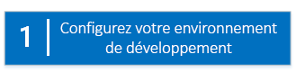
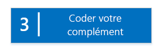
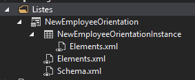

# Commencer à créer des compléments SharePoint hébergés par SharePoint
Configuration d'un environnement de développement et création de votre première Complément SharePoint hébergée par SharePoint.
Les compléments hébergés par SharePoint sont de l'un des deux principaux types d'Compléments SharePoint. Pour obtenir un aperçu rapide des Compléments SharePoint et des deux types distincts, voir  [Compléments](sharepoint-add-ins.md). Voici les informations principales à connaître sur les compléments hébergés par SharePoint :
  
    
    


- Ils contiennent des listes SharePoint, des composants WebPart, des flux de travail, des pages personnalisées et d'autres composants, lesquels sont tous installés sur un sous-site web appelé site web de complément du site web SharePoint où le complément est installé.
    
  
- Sur les pages SharePoint personnalisées, seul le code JavaScript est présent.
    
  

 [
  
    
    
](get-started-creating-sharepoint-hosted-sharepoint-add-ins.md#Setup) [
  
    
    
](get-started-creating-sharepoint-hosted-sharepoint-add-ins.md#Create) [
  
    
    
](get-started-creating-sharepoint-hosted-sharepoint-add-ins.md#Code)
  
    
    


## Configuration de votre environnement de développement
<a name="Setup"> </a>

Pour configurer un environnement de développement pour des Compléments SharePoint, plusieurs options s'offrent à vous. Dans cette section, nous vous expliquons l'option la plus simple. Pour connaître les autres options, consultez les  [ressources supplémentaires](#bk_addresources).
  
    
    

### Obtenir les outils


- Si vous ne disposez pas déjà de **Visual Studio** 2013 ou version ultérieure, installez-le en suivant les instructions figurant à la rubrique [Install Visual Studio](http://msdn.microsoft.com/library/da049020-cfda-40d7-8ff4-7492772b620f.aspx). Nous recommandons d'utiliser la  [dernière version disponible dans le Centre de téléchargement Microsoft](https://www.visualstudio.com/downloads/download-visual-studio-vs).
    
  
- Visual Studio inclut les **Outils de développement Microsoft Office pour Visual Studio**, mais parfois une version des outils est publiée entre les mises à jour de Visual Studio. Pour être sûr que vous avez la dernière version des outils, exécutez le [programme d'installation pour Office Developer Tools pour Visual Studio 2013](http://aka.ms/OfficeDevToolsForVS2013) ou le [programme d'installation pour Office Developer Tools pour Visual Studio 2015](http://aka.ms/OfficeDevToolsForVS2015).
    
  

### Inscription à un Site du développeur Office 365
<a name="o365_signup"> </a>


> **REMARQUE**
>  Vous avez peut-être déjà accès à un Site du développeur Office 365.> **Êtes-vous abonné à MSDN ?** Les abonnés Visual Studio Ultimate et Visual Studio Premium reçoivent également un abonnement à Office 365 Développeur. [Obtenez cet avantage aujourd'hui.](https://msdn.microsoft.com/subscriptions/manage/default.aspx)> **Disposez-vous de l'un des plans d'abonnement Office 365 suivants ?**> **Si oui, un administrateur de l'abonnement à Office 365 peut créer un Site du développeur** à l'aide du [centre d'administration Office 365](https://portal.microsoftonline.com/admin/default.aspx). Pour plus d'informations, voir  [Créer un Site du développeur dans un abonnement Office 365 existant](create-a-developer-site-on-an-existing-office-365-subscription.md). 
  
    
    

Il existe trois options pour obtenir un plan Office 365.
  
    
    

- Ouvrez un compte de développeur Office 365 gratuit d'un an, via le programme de développement d'Office 365.  [Accédez à plus d'information](http://dev.office.com/devprogram) ou remplissez directement le [formulaire d'abonnement](https://profile.microsoft.com/RegSysProfileCenter/wizardnp.aspx?wizid=14b845d0-938c-45af-b061-f798fbb4d170). Une fois l'abonnement réalisé, vous recevrez un e-mail contenant un lien qui vous permettra d'activer votre compte de développeur. Suivez les instructions ci-dessous.
    
  
- Commencer avec un  [essai gratuit de 30 jours](https://portal.microsoftonline.com/Signup/MainSignUp.aspx?OfferId=6881A1CB-F4EB-4db3-9F18-388898DAF510&amp;DL=DEVELOPERPACK) avec une licence utilisateur.
    
  
- Acheter un  [abonnement Office 365 Développeur](https://portal.microsoftonline.com/Signup/MainSignUp.aspx?OfferId=C69E7747-2566-4897-8CBA-B998ED3BAB88&amp;DL=DEVELOPERPACK).
    
  

> **CONSEIL**
> Ouvrez ces liens dans une autre fenêtre ou un nouvel onglet pour que vous puissiez toujours voir les instructions. 
  
    
    


**Figure 1. Nom de domaine d'un Site du développeur Office 365**

  
    
    

  
    
    

  
    
    

  
    
    

  
    
    

1. La première page (non illustrée) du formulaire d'inscription est explicite. Indiquez simplement les informations demandées et choisissez **Suivant**.
    
  
2. Sur la deuxième page (Figure 1), spécifiez l'identificateur d'utilisateur de l'administrateur de l'abonnement.
    
  
3. Créez un sous-domaine de **.onmicrosoft.com**; par exemple, contoso.onmicrosoft.com.
    
    Après l'inscription, vous devez utiliser les informations d'identification obtenues (au format  _UserID_@ _votre_domaine_.onmicrosoft.com) pour vous connecter à votre portail Office 365, où vous pourrez administrer votre compte. Votre Site du développeur SharePoint Online est configuré sur votre nouveau domaine : **http:// _votre_domaine_.sharepoint.com**.
    
  
4. Choisissez **Suivant** et renseignez la page finale du formulaire. Si vous choisissez d'indiquer un numéro de téléphone pour obtenir un code de confirmation, vous pouvez indiquer un numéro de téléphone mobile ou fixe, mais *pas*  un numéro VoIP.
    
  

    
> **REMARQUE**
> Si vous êtes connecté à un autre compte Microsoft lorsque vous tentez de vous connecter à un compte de développeur, il est possible qu'un message semblable à celui-ci s'affiche : « Désolé, l'identifiant utilisateur que vous avez saisi ne fonctionne pas. Il semble ne pas être valide. Veillez à saisir l'identifiant utilisateur que votre organisation vous a affecté. Votre identifiant utilisateur ressemble généralement à  *nom@exemple.com*  ou *nom@exemple.onmicrosoft.com*  . »> Si ce message s'affiche, déconnectez-vous du compte Microsoft que vous utilisiez et réessayez. Si vous obtenez toujours ce message, effacez le cache de votre navigateur ou passez en mode **Navigation InPrivate**, puis remplissez le formulaire. 
  
    
    

Une fois que vous avez terminé le processus d'inscription, votre navigateur ouvre la page d'installation d'Office 365. Choisissez l'icône Administrateur pour ouvrir la page Centre d'administration.
  
    
    

**Figure 2. Page Centre d'administration Office 365**

  
    
    

  
    
    

  
    
    

  
    
    

1. Vous devrez attendre la fin de la configuration de votre Site du développeur. Une fois la configuration terminée, actualisez la page Centre d'administration dans votre navigateur.
    
  
2. Ensuite, cliquez sur le lien **Créer des compléments** dans le coin supérieur gauche de la page pour ouvrir le Site du développeur. Le site ressemble à celui présenté dans la Figure 3. Sur la page figure la liste **Compléments en cours de test**. Cela confirme que le site web a été créé avec le modèle Site du développeur de SharePoint. Si, à la place, un site d'équipe s'ouvre, patientez quelques minutes et lancez de nouveau votre site.
    
  
3. Notez l'URL du site. Elle est utilisée lorsque vous créez des projets d'Compléments SharePoint dans Visual Studio.
    
  

**Figure 3. Page d'accueil de votre Site du développeur avec la liste Compléments en cours de test**

  
    
    

  
    
    

  
    
    

  
    
    

  
    
    

## Création du projet de complément
<a name="Create"> </a>


1. Démarrez Visual Studio à l'aide de l'option **Exécuter en tant qu'administrateur**.
    
  
2. Choisissez **Fichier** > **Nouveau** > **Nouveau projet**.
    
  
3. Dans la boîte de dialogue **Nouveau projet**, développez le nœud **Visual C#**, le nœud **Office/SharePoint**, puis choisissez **Compléments** > **Complément pour SharePoint**.
    
  
4. Nommez le projet EmployeeOrientation, puis choisissez **OK**.
    
  
5. Dans la première boîte de dialogue **Spécifier le complément pour les paramètres SharePoint**, indiquez l'URL du site SharePoint que vous souhaitez utiliser pour déboguer votre complément. Il s'agit de l'URL du Site du développeur. (Utilisez HTTPS, et non HTTP dans l'URL.) Sous **Comment souhaitez-vous héberger votre complément pour SharePoint ?**, choisissez **Hébergement par SharePoint**. Cliquez sur **Terminer**.
    
  
6. Il se peut que vous soyez invité à vous connecter à votre Site du développeur. Dans ce cas, utilisez les informations d'identification de l'administrateur de votre abonnement.
    
  
7. Une fois que le projet est créé, ouvrez le fichier **/Pages/Default.aspx** depuis la racine du projet. Entre autres, ce fichier généré charge un des deux ou les deux scripts hébergés sur SharePoint : sp.runtime.js et sp.js. Le balisage pour le chargement de ces fichiers se trouve dans le contrôle **Content** situé en haut du fichier ayant l'ID **PlaceHolderAdditionalPageHead**. Le balisage varie selon la version des **Outils de développement Microsoft Office pour Visual Studio** que vous utilisez. Cette série de didacticiels exige que les deux fichiers soient chargés avec des balises **<script>** ordinaires dans le code HTML, et non des balises **<SharePoint:ScriptLink>**. Vérifiez que les lignes suivantes sont dans le contrôle **PlaceHolderAdditionalPageHead**,  *juste au-dessus*  de la ligne `<meta name="WebPartPageExpansion" content="full" />` :
    
 ```
  
<script type="text/javascript" src="/_layouts/15/sp.runtime.js"></script>
<script type="text/javascript" src="/_layouts/15/sp.js"></script> 

 ```


    Recherchez tout autre balisage dans le fichier, qui charge également l'un ou l'autre de ces fichiers, puis supprimez le balisage redondant. Enregistrez et fermez le fichier.
    
  

## Codage de votre complément
<a name="Code"> </a>

Pour votre première Complément SharePoint hébergée par SharePoint, nous allons inclure l'extension SharePoint classique : une liste personnalisée et une instance de liste.
  
    
    

1. Dans l' **Explorateur de solutions**, ouvrez le fichier AppManifest.xml.
    
  
2. Lorsque le concepteur de manifeste s'ouvre, ajoutez un espace entre les mots dans le champ **Title** de sorte qu'il indiqueEmployee Orientation . (Ne modifiez *pas*  le champ **Name**.)
    
  
3. Enregistrez et fermez le fichier.
    
  
4. Cliquez avec le bouton droit sur le projet dans l' **Explorateur de solutions** et choisissez **Ajouter** > **Nouveau dossier**. Nommez le dossier Listes.
    
  
5. Cliquez avec le bouton droit sur le nouveau dossier et choisissez **Ajouter** > **Nouvel élément**. La boîte de dialogue **Ajouter un nouvel élément** s'ouvre au niveau du nœud **Office/SharePoint**.
    
  
6. Choisissez **Liste**. Nommez-le NewEmployeeOrientation, puis choisissez **Ajouter**.
    
  
7. Dans la page **Choisir les paramètres de liste** de l' **Assistant Personnalisation de SharePoint**, conservez le nom d'affichage de la liste **NewEmployeeOrientation** comme valeur par défaut, cliquez sur la case d'option **Créer un modèle de liste personnalisable et une instance de liste de ce dernier**, puis sélectionnez **Par défaut (Liste personnalisée)** dans la liste déroulante. Ensuite, choisissez **Terminer**.
    
  
8. L'Assistant crée un modèle de liste **NewEmployeeOrientation** avec une instance de liste enfant nommée **NewEmployeeOrientationInstance**. Un concepteur de liste peut s'ouvrir. Il est utilisé à une étape ultérieure.
    
  
9. Développez le nœud **NewEmployeeOrientationInstance** dans l' **Explorateur de solutions**, si ce n'est déjà fait, afin de pouvoir distinguer clairement le fichier elements.xml qui est un enfant de la liste  *instance*  du fichier elements.xml qui est un enfant de la liste *modèle*  .
    
   **Nœud de listes dans l'Explorateur de solutions**

  

     
  

    
    
  
10. Ouvrez l'enfant du fichier elements.xml du modèle de liste **NewEmployeeOrientation**.
    
  
11. Ajoutez des espaces à l'attribut **DisplayName** (pas l'attribut **Name**) pour le rendre plus convivial : « Orientation des nouveaux employés ».
    
  
12. Définissez l'attribut **Description** sur« Informations sur l'orientation des nouveaux employés. »
    
  
13. Conservez les valeurs par défaut de tous les autres attributs, enregistrez le fichier, puis fermez-le.
    
  
14. Si le concepteur de liste n'est pas ouvert, sélectionnez le nœud **NewEmployeeOrientation** dans l' **Explorateur de solutions**.
    
  
15. Ouvrez l'onglet **Liste** du concepteur. Cet onglet est utilisé afin de définir certaines valeurs pour la liste *instance*  , non pour la liste *modèle*  , mais il comporte quelques valeurs par défaut qu'il a hérité du modèle.
    
  
16. Remplacez les valeurs de cet onglet par celles-ci :
    
  - **Titre**:Nouveaux employés de Seattle
    
  
  - **URL de la liste**:Lists/NewEmployeesInSeattle
    
  
  - **Description**:Les nouveaux employés à Seattle.
    
  

    Conservez l'état par défaut des cases à cocher, enregistrez le fichier, puis fermez le concepteur.
    
  
17. L'instance de liste peut porter son ancien nom dans l' **Explorateur de solutions**. Si c'est le cas, ouvrez le menu contextuel de **NewEmployeeOrientationInstance**, sélectionnez **Renommer**, puis remplacez le nom par NewEmployeesInSeattle.
    
  
18. Ouvrez le fichier schema.xml.
    
  
19. Dans l'élément **View** dont la valeur **BaseViewID** est « 0 », remplacez l'élément **ViewFields** existant par le balisage ci-après. (Utilisez précisément ce GUID pour le **FieldRef** nommé `Title`.)
    
     *Des sauts de ligne peuvent survenir à des endroits bizarres dans ce fichier schema.xml généré automatiquement. Vérifiez que vous avez trouvé les balises de début et de fin correspondantes pour l'élément **ViewFields**. Ajoutez des sauts de ligne pour améliorer la lisibilité.* 
    


 ```
  
<ViewFields>
  <FieldRef Name="Title" ID="{fa564e0f-0c70-4ab9-b863-0177e6ddd247}" DisplayName="Employee" />
 </ViewFields>
 ```

20. Toujours dans le fichier schema.xml, dans l'élément **View** dont la valeur **BaseViewID** est « 1 », remplacez l'élément **ViewFields** existant par le balisage ci-après. (Utilisez précisément ce GUID pour le **FieldRef** nommé `LinkTitle`.)
    
 ```
  
<ViewFields>
  <FieldRef Name="LinkTitle" ID="{82642ec8-ef9b-478f-acf9-31f7d45fbc31}" DisplayName="Employee" />
</ViewFields>
 ```

21. Enregistrez le fichier schema.xml, puis fermez-le.
    
  
22. Ouvrez le fichier elements.xml qui est un enfant de la liste  *instance* **NewEmployeesInSeattle** (pas le fichier elements.xml qui est un enfant de la liste *modèle* **NewEmployeeOrientation**).
    
  
23. Dans ce fichier, remplissez la liste avec des données initiales. Pour cela, ajoutez le balisage d'élément **Data** suivant en tant qu'élément enfant de l'élément **ListInstance**.
    
 ```
  
<Data>
  <Rows>
    <Row>
      <Field Name="Title">Tom Higginbotham</Field>
    </Row>
    <Row>
      <Field Name="Title">Satomi Hayakawa</Field>
    </Row>
    <Row>
      <Field Name="Title">Cassi Hicks</Field>
    </Row>
    <Row>
      <Field Name="Title">Lertchai Treetawatchaiwong</Field>
    </Row>
  </Rows>
</Data>
 ```

24. Enregistrez et fermez le fichier.
    
  
25. Dans l' **Explorateur de solutions**, double-cliquez sur **Fonctionnalité1** pour ouvrir le concepteur de fonctionnalités. Dans le concepteur, définissez le champ **Titre** surComposants de l'orientation des nouveaux employés et définissez le champ **Description** surListes et autres composants pour l'orientation des employés dans la société. Enregistrez le fichier, puis fermez le concepteur.
    
  
26. Dans l' **Explorateur de solutions**, si **Fonctionnalité1** n'a pas été renommé automatiquement, ouvrez son menu contextuel, sélectionnez **Renommer**, puis attribuez le nom NewEmployeeOrientationComponents.
    
  
27. Ouvrez le fichier Default.aspx.
    
  
28. Recherchez l'élément **Content** ASP.NET avec l'ID **PlaceHolderPageTitleInTitleArea**. Remplacez la chaîne par défaut « Titre de la page » par « Nouveaux employés par emplacement ».
    
  
29. Recherchez l'élément **Content** ASP.NET avec l'ID **PlaceHolderMain**.  *Remplacez*  son contenu par le balisage ci-après. L'élément ` _spPageContextInfo` est un objet JavaScript que SharePoint inclut automatiquement dans la page. Sa propriété `webAbsoluteUrl` renvoie l'URL du web du complément.
    
 ```XML
  
<p><asp:HyperLink runat="server"
    NavigateUrl="JavaScript:window.location = _spPageContextInfo.webAbsoluteUrl + '/Lists/NewEmployeesInSeattle/AllItems.aspx';" 
    Text="New Employees in Seattle" /></p>

 ```


## Exécuter le complément et tester la liste
<a name="Code"> </a>


  
    
    

1. Utilisez la touche F5 pour déployer et exécuter votre complément. Visual Studio effectue une installation temporaire du complément sur votre site SharePoint de test et exécute immédiatement le complément. (Pour savoir comment les utilisateurs finaux exécutent une Complément SharePoint installée, consultez la rubrique  [Étapes suivantes](#Nextsteps).)
    
  
2. Lorsque la page par défaut du complément s'ouvre, choisissez le lien **Nouveaux employés de Seattle** pour ouvrir l'instance de liste personnalisée.
    
   **Page par défaut et page en mode liste**

  

     
  

    
    
  
3. Ajoutez et supprimez des éléments dans la liste.
    
  
4. Pour mettre fin à la session de débogage, fermez la fenêtre du navigateur ou arrêtez le débogage dans Visual Studio. Chaque fois que vous appuyez sur F5, Visual Studio retire la version précédente du complément et installe la dernière version disponible.
    
  
5. Vous allez travailler avec ce complément et la solution Visual Studio dans d'autres articles. Il est donc recommandé de retirer le complément une dernière fois lorsque vous avez terminé de travailler et n'allez pas le réutiliser pendant un moment. Cliquez avec le bouton droit de la souris sur le projet dans l' **Explorateur de solutions** et choisissez **Retirer**.
    
  

## 
<a name="Nextsteps"> </a>

Jusqu'à présent, il n'existe pas beaucoup d'informations d'orientation dans la liste. Nous en ajouterons dans des articles suivants de cette série. Mais tout d'abord, faisons une pause dans le codage pour en savoir plus sur le déploiement des Compléments SharePoint dans la rubrique  [Déployer et installer un complément hébergé par SharePoint pour SharePoint](deploy-and-install-a-sharepoint-hosted-sharepoint-add-in.md).
  
    
    

