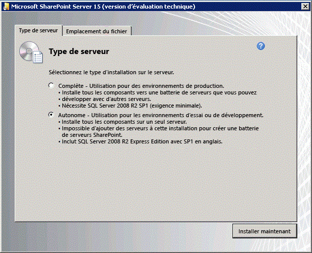
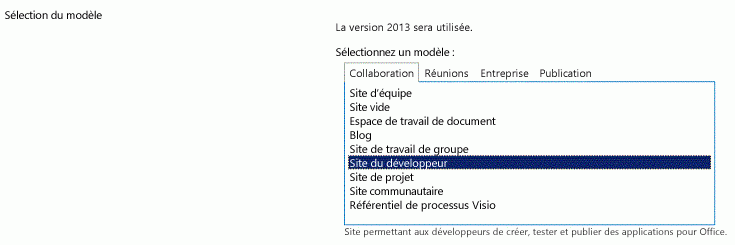

# Configurer un environnement de développement local pour les compléments pour SharePoint
Découvrez comment configurer l'environnement de développement convenant spécifiquement au développement d'Compléments SharePoint avec une installation locale de SharePoint.
## Installer le système d'exploitation pour l'environnement de développement d'Compléments SharePoint
<a name="bk_installOS"> </a>

Les exigences sont moins strictes et onéreuses pour les environnements de développement que pour les environnements de production. Par ailleurs, les instructions décrites ici ne s'appliquent pas à l'installation d'un environnement de production. Voir  [Vue d'ensemble de l'installation et de la configuration de SharePoint 2013](http://technet.microsoft.com/fr-fr/library/ee667264%28v=office.15%29),  [Configuration matérielle et logicielle requise pour SharePoint 2013](http://technet.microsoft.com/fr-fr/library/cc262485%28v=office.15%29) et [Configurer un environnement pour des compléments pour SharePoint (SharePoint 2013)](http://technet.microsoft.com/fr-fr/library/fp161236%28office.15%29.aspx) pour découvrir les instructions permettant de configurer l'installation d'un environnement de production SharePoint.
  
    
    
Dans tout environnement de développement, vous devez utiliser un ordinateur équipé d'une unité centrale avec un système x64 et disposant d'au moins 16 Go de mémoire vive (RAM) pour installer et exécuter SharePoint ; nous recommandons 24 Go de mémoire vive (RAM).
  
    
    
En fonction de vos exigences et de votre budget, vous pouvez choisir une des options suivantes :
  
    
    

- Installez SharePoint sur Windows Server 2008 R2 Service Pack 1 x64 ou Windows Server 2012.
    
  
- Utilisez Microsoft Hyper-V et installez SharePoint sur un ordinateur virtuel exécutant un système d'exploitation invité Windows Server 2008 R2 Service Pack 1 x64 ou Windows Server 2012. Pour plus d'informations sur la configuration d'un ordinateur virtuel Microsoft Hyper-V pour SharePoint, voir les aspects relatifs à l' [utilisation des configurations recommandées pour les ordinateurs virtuels SharePoint 2013 et l'environnement Hyper-V](http://technet.microsoft.com/fr-fr/library/ff621103%28v=office.15%29.aspx).
    
  

> **REMARQUE**
> L'installation de SharePoint est uniquement prise en charge sur Windows Server 2008 R2 Service Pack 1 x64 ou Windows Server 2012. Si vous souhaitez développer des Compléments SharePoint pour SharePoint sur Windows 7 ou Windows 8, vous pouvez vous inscrire à un Site du développeur Office 365 et développer les compléments à distance. 
  
    
    


## Installer les éléments prérequis pour le système d'exploitation et SharePoint
<a name="bk_prereqsOS"> </a>


1. Exécutez l'outil PrerequisiteInstaller.exe inclus dans vos fichiers d'installation.
    
  
2. Exécutez l'outil Setup.exe inclus dans vos fichiers d'installation.
    
  
3. Acceptez les termes du contrat de licence logiciel Microsoft.
    
  
4. Dans la page **Choisir le type d'installation**, sélectionnez **Autonome**.
    
   **Figure 1. Choix du type d'installation**

  

     
  

  

  
5. Si une erreur se produit au cours de l'installation, vérifiez le fichier journal. Pour trouver le fichier journal, ouvrez une fenêtre de Ligne de commande, puis tapez les commandes suivantes dans l'invite de commande. Un lien vers le fichier journal s'affiche aussi quand l'installation est terminée.
    
 ```
  
cd %temp%
dir /od *.log
 ```

6. Une fois l'installation terminée, vous êtes invité à démarrer l'Assistant Configuration des produits et des technologies SharePoint.
    
    > **REMARQUE**
      > L'Assistant Configuration des produits et des technologies SharePoint peut échouer si vous utilisez un ordinateur associé à un domaine, mais non connecté à un contrôleur de domaine. Si vous constatez cet échec, connectez-vous à un contrôleur de domaine directement ou par l'intermédiaire d'une connexion à un réseau privé virtuel (VPN) ou connectez-vous à un compte local doté de privilèges administrateur sur l'ordinateur. 
7. Une fois l'Assistant de configuration terminé, vous voyez la page **Sélection du modèle** du nouveau site SharePoint. Sur cette page, sélectionnez le modèle **Site du développeur**. Vous ne pouvez déployer les Compléments SharePoint qu'à partir de Visual Studio vers un Site du développeur.
    
   **Figure 2. Choisissez la page du modèle de site**

  

     
  

  

  

## Configurer les services de SharePoint en vue d'une utilisation des compléments de serveur à serveur
<a name="Servertoserver"> </a>

Au cours de cette procédure, vous configurez les services dans SharePoint en vue d'une utilisation des compléments de serveur à serveur. Ces étapes garantissent que vous pourrez créer des compléments à haut niveau de fiabilité hébergés par le fournisseur avec votre installation. Voir  [Créer des compléments à haut niveau de fiabilité pour SharePoint 2013](create-high-trust-sharepoint-add-ins.md) pour plus d'informations sur la création de ce type de complément.
  
    
    

1. Vérifiez que le service de gestion d'application et l'application de profil utilisateur sont configurés (il s'appelle « Service de gestion d'application », car les Compléments SharePoint étaient appelées « applications pour SharePoint » à l'origine.) La procédure est la suivante :
    
1. Dans **Administration centrale**, sous **Gestion des applications**, sélectionnez **Gérer les applications de service**.
    
  
2. Dans la page **Applications de service**, vérifiez que les services suivants ont démarré :
    
  - Application de service de profil utilisateur
    
  
  - Service de gestion des applications
    
  
3. Sous **Gestion des applications**, sélectionnez **Gérer les services sur le serveur**. 
    
  
4. Dans la page **Services sur le serveur**, vérifiez que les services suivants ont démarré :
    
  - Service de profil utilisateur 
    
  
2. Veillez à ce qu'au moins un profil soit créé dans l' **Application de service Profil utilisateur**. La procédure est la suivante :
    
1. Dans **Administration centrale**, sous **Gestion des applications**, sélectionnez **Gérer les applications de service**.
    
  
2. Ensuite, sélectionnez **Application de service Profil utilisateur**.
    
  
3. Dans la page **Gérer le service de profil : Application de service Profil utilisateur**, sous **Personnes**, sélectionnez **Gérer les profils utilisateur**.
    
  
4. Dans la page **Gérer les profils utilisateur**, sélectionnez **Nouveaux profils**.
    
  
5. Dans la page **Ajouter un profil utilisateur**, tapez le nom de votre compte et votre adresse de messagerie.
    
  
6. Sélectionnez **Enregistrer et fermer**.
    
    > **REMARQUE**
      > Si vous recevez un message indiquant que le profil que vous essayez de créer existe déjà, sélectionnez **Annuler et retourner à la page précédente**. 
7. De retour dans la page **Gérer les profils utilisateur**, vous devriez voir **Nombre total de profils : 1**.
    
  

## Installer Visual Studio et Outils de développement Office pour Visual Studio
<a name="SP15Appdevonprem_bk_installVS"> </a>


- Si **Visual Studio** 2013 ou version ultérieure n'est pas déjà installé, installez-le en suivant les instructions fournies dans [Install Visual Studio](http://msdn.microsoft.com/library/da049020-cfda-40d7-8ff4-7492772b620f.aspx). Nous recommandons d'utiliser la  [dernière version fournie dans le Centre de téléchargement Microsoft ](https://www.visualstudio.com/downloads/download-visual-studio-vs).
    
  
- Visual Studio inclut les **Outils de développement Microsoft Office pour Visual Studio**, mais il arrive qu'une version des outils soit mise à disposition entre les mises à jour de Visual Studio. Pour vérifier que vous disposez de la dernière version des outils, exécutez le [programme d'installation des Outils de développement Office pour Visual Studio 2013](http://aka.ms/OfficeDevToolsForVS2013) ou le [programme d'installation des Outils de développement Office pour Visual Studio 2015](http://aka.ms/OfficeDevToolsForVS2015).
    
  

### Journalisation détaillée dans Visual Studio

Si vous souhaitez activer la journalisation détaillée, procédez comme suit :
  
    
    

1. Ouvrez le registre et accédez à **HKEY_CURRENT_USER\\Software\\Microsoft\\VisualStudio\\ _nn.n_\\SharePointTools**, où _nn.n_ représente la version de Visual Studio, par exemple 12.0 ou 14.0.
    
  
2. Ajoutez une clé DWORD appelée **EnableDiagnostics**.
    
  
3. Attribuez la valeur **1** à la clé.
    
  
Le chemin d'accès du Registre sera modifié dans les futures versions de Visual Studio.
  
    
    

## Configurer un domaine de complément isolé dans SharePoint
<a name="SP15appdevonprem_bk_configure"> </a>

Consultez la rubrique  [Sites web hôtes, sites web de compléments et domaine isolé](host-webs-add-in-webs-and-sharepoint-components-in-sharepoint-2013.md#IsolatedDomain) avant d'exécuter les procédures de cette section.
  
    
    
Vous devez créer un domaine isolé dans votre batterie de test SharePoint. Par ailleurs, votre installation SharePoint a besoin d'un domaine d'en-tête hôte générique général où elle peut mettre en service les compléments hébergés sur SharePoint.
  
    
    
À des fins de développement, vous pouvez modifier votre fichier hôte, afin de router votre ordinateur de développement vers une instance de test d'une Complément SharePoint. Visual Studio modifie votre fichier hôte automatiquement quand vous créez et déployez le complément. 
  
    
    

> **REMARQUE**
> Pour les batteries de test, vous devrez créer une stratégie de routage DNS dans votre intranet et éventuellement configurer votre pare-feu. Voir  [Installer et gérer les compléments pour SharePoint](http://technet.microsoft.com/fr-fr/library/fp161232%28v=office.15%29) pour plus d'informations sur la création et la configuration d'un environnement de production pour des Compléments SharePoint.
  
    
    

Effectuez les étapes de la procédure suivante afin de créer un domaine de complément isolé.
  
    
    

> **REMARQUE**
> Vous devez suivre toutes les étapes de la procédure suivante en étant connecté en tant qu'administrateur de la batterie de serveurs et vous devez exécuter l'invite de commande et SharePoint Management Shell en tant qu'administrateur. 
  
    
    


### Créer un domaine de complément isolé sur votre ordinateur de développement


1. Assurez-vous que les services spadmin et sptimer fonctionnent en ouvrant une invite de commande et en tapant les commandes suivantes.
    
 ```
  
net start spadminv4
net start sptimerv4
 ```

2. Créez votre domaine de complément isolé en exécutant l'environnement SharePoint Management Shell en tant qu'administrateur et en saisissant la commande suivante. Remplacez  _contosoaddins.com_ par votre domaine de complément. Il ne doit *pas*  s'agir d'un sous-domaine du domaine SharePoint hôte. Cela réduit grandement les avantages en matière de sécurité de l'isolement des domaines de complément. Par exemple, si le domaine hôte est contoso.com, n'utilisez pas addins.contoso.com comme domaine de complément.
    
 ```
  
Set-SPAppDomain "contosoaddins.com"
 ```

3. Assurez-vous que les services SPSubscriptionSettingsService et AppManagementServiceInstance fonctionnent en tapant la commande suivante dans le SharePoint Management Shell.
    
 ```
  Get-SPServiceInstance | where{$_.GetType().Name -eq "AppManagementServiceInstance" -or $_.GetType().Name -eq "SPSubscriptionSettingsServiceInstance"} | Start-SPServiceInstance
 ```

4. Assurez-vous que les services SPSubscriptionSettingsService et AppManagementServiceInstance fonctionnent en tapant la commande suivante dans le SharePoint Management Shell. La sortie va indiquer quel service est en ligne.
    
 ```
  Get-SPServiceInstance | where{$_.GetType().Name -eq "AppManagementServiceInstance" -or $_.GetType().Name -eq "SPSubscriptionSettingsServiceInstance"}
 ```

5. Vous devez indiquer un compte où les instances de service SPSubscriptionService et AppManagementServiceInstance vont fonctionner. Ce compte doit être un compte un SPManagedAccount. Vous pouvez créer un SPManagedAccount en tapant la commande suivante dans le SharePoint Management Shell. Vous devrez indiquer le compte de domaine\\utilisateur et mot de passe.
    
 ```
  $account = New-SPManagedAccount
 ```

6. Spécifiez un compte, le pool d'applications et les paramètres de la base de données pour les services SPSubscriptionService et AppManagementServiceInstance en tapant le code suivant dans le SharePoint Management Shell. Si vous avez créé un SPManagedAccount à l'étape précédente, utilisez ce nom de compte.
    
 ```
  $account = Get-SPManagedAccount "domain\\user"
$appPoolSubSvc = New-SPServiceApplicationPool -Name SettingsServiceAppPool -Account $account
$appPoolAppSvc = New-SPServiceApplicationPool -Name AppServiceAppPool -Account $account
$appSubSvc = New-SPSubscriptionSettingsServiceApplication -ApplicationPool $appPoolSubSvc -Name SettingsServiceApp -DatabaseName SettingsServiceDB 
$proxySubSvc = New-SPSubscriptionSettingsServiceApplicationProxy -ServiceApplication $appSubSvc
$appAppSvc = New-SPAppManagementServiceApplication -ApplicationPool $appPoolAppSvc -Name AppServiceApp -DatabaseName AppServiceDB
$proxyAppSvc = New-SPAppManagementServiceApplicationProxy -ServiceApplication $appAppSvc

 ```

7. Spécifiez votre préfixe de complément (voir  [Sites web hôtes, sites web de compléments et domaine isolé](host-webs-add-in-webs-and-sharepoint-components-in-sharepoint-2013.md#IsolatedDomain)) en tapant le code suivant dans le SharePoint Management Shell.
    
 ```
  
Set-SPAppSiteSubscriptionName -Name "add-in" -Confirm:$false
 ```

 **Effectuez seulement la procédure suivante si votre environnement utilise un serveur proxy.** Une fois le domaine de complément isolé créé, suivez les étapes de la procédure suivante afin d'ajouter un domaine à votre liste de contournement dans Internet Explorer. Cela garantit votre accès à ce domaine une fois que vous avez déployé un complément hébergé sur un serveur SharePoint ou un complément hébergé sur un fournisseur qui inclut un web de complément.
  
    
    

### Ajouter votre domaine de complément isolé à votre liste de contournement dans Internet Explorer


1. Dans Internet Explorer, allez dans **Outils**.
    
  
2. Sélectionnez **Options Internet**.
    
  
3. Sous l'onglet **Connexions**, sélectionnez le bouton **Paramètres réseau**.
    
  
4. Désélectionnez la case **Détecter automatiquement les paramètres de connexion**.
    
  
5. Sélectionnez la case **Utiliser un serveur proxy pour le réseau local**.
    
  
6. Sélectionnez le bouton **Avancé**, puis ajoutez *.YourAddinsDomain.com à la liste **Exceptions**.
    
  
7. Sélectionnez le bouton **OK**.
    
  
8. Sélectionnez le bouton **OK** pour fermer la boîte de dialogue **Paramètres du réseau local**.
    
  
9. Sélectionnez le bouton **OK** pour fermer la boîte de dialogue **Options Internet**.
    
  
Voir  [Déploiement et installation de compléments pour SharePoint : méthodes et options](deploying-and-installing-sharepoint-add-ins-methods-and-options.md) pour des informations sur les options dont vous disposez pour déployer vos compléments.
  
    
    

> **CONSEIL**
> Après avoir déployé un complément hébergé par SharePoint sur votre installation, vous pouvez être invité à vous connecter à l'aide de vos informations d'identification lorsque vous essayez de la lancer. Vous devez désactiver le contrôle de boucle de rappel pour vous débarrasser de ces invites. Voir  [Vous recevez une erreur 401.1 lorsque vous visitez un site web qui utilise l'authentification intégrée et qui est hébergé sur IIS 5.1 ou une version ultérieure](http://support.microsoft.com/kb/896861/fr-fr) pour obtenir des instructions sur la façon de désactiver le contrôle de boucle de rappel.
  
    
    


## Ressources supplémentaires
<a name="SP15SetupSPO365_bk_addlresources"> </a>


-  [Compléments](sharepoint-add-ins.md)
    
  
-  [Commencer à créer des compléments hébergés par un fournisseur pour SharePoint](get-started-creating-provider-hosted-sharepoint-add-ins.md)
    
  
-  [Commencer à créer des compléments SharePoint hébergés par SharePoint](get-started-creating-sharepoint-hosted-sharepoint-add-ins.md)
    
  

  
    
    

