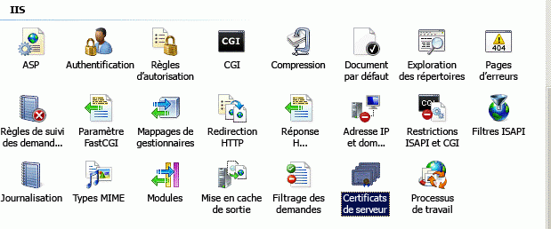
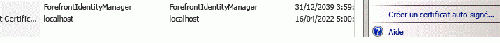
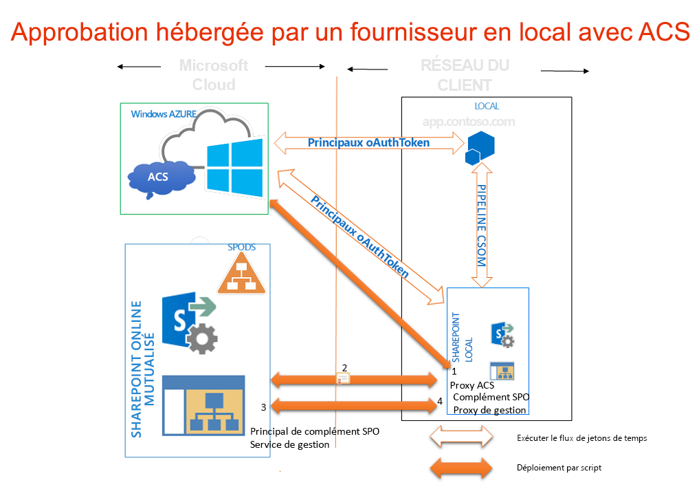

# Utiliser un site SharePoint Office 365 pour autoriser des compléments hébergés par un fournisseur sur un site SharePoint local
Utilisez un site SharePoint Office 365 pour créer un environnement dans lequel vous pouvez utiliser ACS pour établir une approbation entre un complément hébergé par un fournisseur et une batterie de serveurs SharePoint 2013 sur site, comme vous le feriez si vous développiez des compléments pour un site SharePoint Office 365.
## Conditions requises pour l'utilisation d'ACS avec des compléments hébergés par un fournisseur dans les environnements sur site
<a name="Prerequisites"> </a>

Assurez-vous que vous disposez des éléments suivants.
  
    
    

- Un environnement de développement SharePoint 2013 sur site. Voir  [Configurer un environnement de développement local pour les compléments pour SharePoint](set-up-an-on-premises-development-environment-for-sharepoint-add-ins.md).
    
  
- Un site SharePoint Office 365. Si vous n'en avez pas encore et que vous voulez configurer rapidement un environnement de développement, vous pouvez :  [Configurer un environnement de développement pour les compléments pour SharePoint dans Office 365](set-up-a-development-environment-for-sharepoint-add-ins-on-office-365.md).
    
  
-  [Visual Studio 2012](https://www.microsoft.com/fr-fr/download/details.aspx?id=30682) installé à distance ou sur l'ordinateur sur lequel est installé SharePoint 2013.
    
  
-  [Outils de développement Microsoft Office pour Visual Studio 2012](https://msdn.microsoft.com/fr-fr/office/aa905340.aspx).
    
  
- L'édition 64 bits de l' [Assistant de connexion Microsoft Online Services](http://www.microsoft.com/fr-fr/download/details.aspx?id=41950) installée sur l'ordinateur sur lequel vous avez installé SharePoint 2013.
    
  
- Le  [Module Microsoft Online Services pour Windows PowerShell (64 bits)](http://go.microsoft.com/fwlink/p/?linkid=236297) installé sur l'ordinateur sur lequel vous avez installé SharePoint 2013.
    
  

## Créer un certificat et en faire le certificat STS (service d'émission de jeton de sécurité) de votre installation sur site de SharePoint 2013
<a name="Certificate"> </a>

Vous devrez remplacer le certificat STS (service d'émission de jeton de sécurité par défaut) de votre installation sur site de SharePoint 2013 par votre propre certificat. Cet article vous fournit un exemple de méthode de création et d'exportation d'un certificat de test à l'aide de l'option **Créer un certificat auto-signé** dans IIS. Vous pouvez également utiliser un certificat commercial délivré par une autorité de certification.
  
    
    
 [Vous pouvez d'abord créer un fichier de certificat .pfx de test, puis un fichier .cer de test correspondant](http://msdn.microsoft.com/fr-fr/library/windows/hardware/ff552299%28v=vs.85%29.aspx).
  
    
    
 [Vous pouvez également utiliser le programme de test MakeCert pour générer un certificat X.509 de test](http://msdn.microsoft.com/fr-fr/library/ms537364%28VS.85%29.aspx).
  
    
    

### Pour créer un fichier de certificat .pfx de test


1. Dans le Gestionnaire des services Internet, sélectionnez le nœud  _ServerName_ dans l'arborescence sur la gauche.
    
  
2. Choisissez **Certificats de serveur**, comme le montre la figure 1.
    
   **Figure 1. Option Certificats de serveur dans IIS**

  

     
  

  

  
3. Cliquez sur le lien **Créer un certificat auto-signé** dans l'ensemble de liens sur le côté droit, comme le montre la figure 2.
    
   **Figure 2. Lien Créer un certificat auto-signé**

  

     
  

  

  
4. Nommez le certificat SampleCert, puis cliquez sur **OK**.
    
  
5. Cliquez avec le bouton droit sur le certificat, puis choisissez **Exporter**, comme le montre la figure 3.
    
   **Figure 3. Exportation d'un certificat de test**

  

     
  

  

  
6. Exportez le fichier vers l'emplacement de votre choix et attribuez-lui un mot de passe. Dans cet exemple, le mot de passe est **password**. Dans un environnement de production, utilisez un mot de passe fort. Voir [Instructions de création de mots de passe forts](http://msdn.microsoft.com/fr-fr/library/bb416446.aspx) et [Mots de passe forts](http://msdn.microsoft.com/fr-fr/library/ms161962.aspx).
    
  

## Faire de votre certificat le certificat STS de votre installation sur site de SharePoint 2013
<a name="STSCertificate"> </a>

Maintenant que vous disposez d'un certificat, vous pouvez en faire le certificat STS de votre batterie de serveurs SharePoint sur site.
  
    
    
Ouvrez SharePoint Management Shell en tant qu'administrateur et exécutez ce script Windows PowerShell.
  
    
    



```

$certPrKPath = "c:\\location of your .pfx file"
$certPassword = "password"
$stsCertificate = New-Object System.Security.Cryptography.X509Certificates.X509Certificate2 $certPrKPath, $certPassword, 20
Set-SPSecurityTokenServiceConfig -ImportSigningCertificate $stsCertificate -confirm:$false

```


> **REMARQUE**
> Le document relatif à la  [configuration d'un environnement hybride à sens unique avec SharePoint Server 2013 et Office 365](http://download.microsoft.com/download/6/4/4/644BA525-96CB-4739-B08F-18949A9BDADC/sps-2013-config-one-way-hybrid-environment.docx), disponible en téléchargement sur la page  [Ressources SharePoint 2013 hybrides](http://www.microsoft.com/fr-fr/download/details.aspx?id=35593), fournit plus de détails sur le remplacement du certificat STS par défaut de votre batterie de serveurs sur site par un certificat d'une autorité de certification connue ou par un certificat auto-signé. 
  
    
    


## Configurer votre installation sur site de SharePoint 2013 pour utiliser ACS
<a name="ConnectAAD"> </a>

La figure 4 décrit les quatre étapes permettant d'activer les connexions dont vous avez besoin dans l'architecture globale d'un complément hébergé par un fournisseur exécuté sur site. Elle montre également le flux des jetons OAuth lorsque le complément est en cours d'exécution.
  
    
    

**Figure 4. Utiliser ACS avec une installation sur site de SharePoint à l'aide d'un site SharePoint Office 365**

  
    
    

  
    
    

  
    
    

  
    
    

1. Créez un proxy ACS dans votre batterie de serveurs SharePoint 2013 sur site.
    
  
2. Installez le certificat de signature de votre serveur sur site pour votre location Office 365.
    
  
3. Ajoutez les noms de domaine complets des sites de la batterie de serveurs SharePoint 2013 où vous voulez exécuter les compléments à la collection de noms de principal de service dans votre location Office 365.
    
  
4. Créez un proxy de gestion des compléments sur votre batterie de serveurs SharePoint 2013.
    
  
La fonction ci-dessous effectue toutes les actions nécessaires pour configurer votre site SharePoint 2013 sur site pour l'utilisation d'ACS. Vous pouvez également utiliser cette fonction pour effectuer des tâches de nettoyage si vous avez besoin de supprimer des configurations précédentes. Il existe plusieurs moyens d'exécuter la fonction dans PowerShell. Voici une méthode :
  
    
    

  
    
    

1. Sur le serveur SharePoint sur site, copiez le code de la fonction dans un fichier texte et enregistrez-le sous le nom MySharePointFunctions.psm1 dans l'un des dossiers suivants (pas les deux). Vous devrez peut-être créer des parties du chemin, si celui-ci inclut des dossiers qui n'existent pas déjà. Dans les deux cas, le dossier situé au niveau le plus bas du chemin doit avoir le même nom que le fichier.
    
    > **CONSEIL**
      > Le fichier doit être enregistré au format ANSI, et non UTF-8. PowerShell peut générer de fausses erreurs de syntaxe lors du chargement d'un fichier dans un format autre que ANSI. Par défaut, le Bloc-notes de Windows procédera à l'enregistrement au format ANSI. Si vous utilisez un autre éditeur pour enregistrer le fichier, veillez à l'enregistrer au format ANSI. 

  -  `C:\\users\\username\\documents\\windowspowershell\\modules\\MySharePointFunctions`, où  _username_ est l'administrateur de la batterie de serveurs qui va exécuter le fichier.
    
  
  -  `C:\\windows\\system32\\windowspowershell\\V1.0\\modules\\MySharePointFunctions`
    
  
2. Ouvrez SharePoint Management Shell en tant qu'administrateur et exécutez l'applet de commande suivante pour vérifier que le module MySharePointFunctions est répertorié.
    
 ```
  
Get-Module -listavailable
 ```

3. Exécutez l'applet de commande suivante pour importer le module.
    
 ```
  Import-Module MySharePointFunctions
 ```

4. Exécutez l'applet de commande suivante pour vérifier que la fonction Connect-SPFarmToAAD est répertoriée dans le cadre du module :
    
 ```
  Get-Command -module MySharePointFunctions
 ```

5. Exécutez l'applet de commande suivante pour vérifier que la fonction Connect-SPFarmToAAD est chargée.
    
 ```
  ls function:\\ | where {$_.Name -eq "Connect-SPFarmToAAD"}
 ```

6. Exécutez la fonction  `Connect-SPFarmToAAD`. Veillez à fournir les paramètres obligatoires et tous les paramètres facultatifs qui s'appliquent à votre environnement de développeur. Consultez la section suivante pour obtenir plus d'informations et des exemples.
    
  

  
    
    

### Paramètres de la fonction Connect-SPFarmToAAD
<a name="parameters"> </a>


|**Paramètre**|**Valeur**|
|:-----|:-----|
| `-AADDomain` (obligatoire) <br/> |Domaine *.onmicrosoft.com que vous avez créé lorsque vous vous êtes inscrit à votre site Office 365 ( _yourcustomdomain_.onmicrosoft.com). Lorsque le script vous invite à vous authentifier, utilisez le nom d'utilisateur et le mot de passe que vous avez créés pour ce domaine :  _username_@ _yourcustomdomain_.onmicrosoft.com.  <br/> |
| `-SharePointOnlineUrl` (obligatoire) <br/> |URL de votre site SharePoint Office 365 ( _https://yourcustomdomain_.sharepoint.com). Le domaine parent n'est  *pas*  onmicrosoft.com. <br/> |
| `-SharePointWeb` (parfois obligatoire) <br/> |URL complète (protocole compris) de l'application web SharePoint sur site où vous exécutez les compléments hébergés par un fournisseur. Cette fonction ajoute une seule application web SharePoint de votre batterie de serveurs sur site à ACS. Si vous ne spécifiez pas de valeur, le script sélectionne la première application web de votre batterie de serveurs. Si vous utilisez une collection de sites de nom d'hôte (HNSC) pouvant être définie à l'aide d'un caractère générique (comme  _http://*.contoso.com_), vous pouvez utiliser cette chaîne en tant que valeur pour ce paramètre. Si l'application web possède un mappage des accès de substitution (AAM) pour la zone Internet, vous devez utiliser cette URL AAM pour ce paramètre. Si l'application web SharePoint n'est pas configurée pour HTTPS, vous devez utiliser HTTP en tant que protocole et  *vous devez utiliser le commutateur -AllowOverHttp (voir plus bas dans ce tableau).*  <br/> Si vous voulez exécuter des compléments hébergés par un fournisseur utilisant le service ACS sur plusieurs applications web dans votre batterie de serveurs, vous devez les ajouter à la collection de noms de principal de service. Le script Windows PowerShell qui suit la fonction  `Connect-SPFarmToAAD` ci-dessous vous indique comment ajouter toutes les applications web de votre batterie de serveurs à la collection de noms de principal de service. <br/> |
| `-AllowOverHttp` (facultatif) <br/> |Utilisez ce commutateur si vous travaillez avec un environnement de développeur et que vous ne voulez pas utiliser SSL avec vos compléments. Vous devez utiliser ce commutateur si l'application web SharePoint n'est pas configurée pour HTTPS.  <br/> |
| `-O365Credentials` (facultatif) <br/> |Le premier caractère est un « O » majuscule, et non un zéro. Si vous devez exécuter le script de manière répétée à des fins de débogage, ce commutateur vous permet d'éviter de devoir entrer manuellement votre nom et votre mot de passe O365 à chaque fois. Pour pouvoir utiliser ce paramètre, vous devez créer l'objet d'informations d'identification que vous allez lui affecter à l'aide de ces applets de commande :  <br/>```$User = "username@yourcustomdomain.onmicrosoft.com"$PWord = ConvertTo-SecureString -String "the_password" -AsPlainText -Force$Credential = New-Object -TypeName System.Management.Automation.PSCredential -ArgumentList $User, $PWord```Utilisez  `$Credential` comme valeur du paramètre `-O365Credentials`.  <br/> |
| `-Verbose` (facultatif) <br/> |Ce commutateur génère des commentaires plus détaillés pouvant vous aider si la fonction est inefficace et si vous devez l'exécuter à nouveau pour procéder au débogage.  <br/> |
| `-RemoveExistingACS` (facultatif) <br/> |Utilisez ce commutateur si vous remplacez une connexion existante à Microsoft Azure Active Directory. Il supprime un proxy ACS existant si vous en avez déjà créé un sur votre batterie de serveurs.  <br/> |
| `-RemoveExistingSTS` (facultatif) <br/> |Utilisez ce commutateur si vous remplacez une connexion existante à Microsoft Azure Active Directory. Il supprime un émetteur de jeton de sécurité approuvé existant restant d'une connexion antérieure à ACS.  <br/> |
| `-RemoveExistingSPOProxy` (facultatif) <br/> |Utilisez ce commutateur si vous remplacez une connexion existante à Microsoft Azure Active Directory. Il supprime un proxy de gestion des compléments existant si vous en avez déjà créé un sur votre batterie de serveurs.  <br/> |
| `-RemoveExistingAADCredentials` (facultatif) <br/> |Utilisez ce commutateur si vous remplacez le site SharePoint Office 365.  <br/> |
   
Voici quelques exemples :
  
    
    

```

Connect-SPFarmToAAD -AADDomain 'MyO365Domain.onmicrosoft.com' -SharePointOnlineUrl https://MyO365Domain.sharepoint.com

Connect-SPFarmToAAD -AADDomain 'MyO365Domain.onmicrosoft.com' -SharePointOnlineUrl https://MyO365Domain.sharepoint.com -SharePointWeb https://fabrikam.com

Connect-SPFarmToAAD -AADDomain 'MyO365Domain.onmicrosoft.com' -SharePointOnlineUrl https://MyO365Domain.sharepoint.com -SharePointWeb http://northwind.com -AllowOverHttp

Connect-SPFarmToAAD -AADDomain 'MyO365Domain.onmicrosoft.com' -SharePointOnlineUrl https://MyO365Domain.sharepoint.com -SharePointWeb http://northwind.com -AllowOverHttp -RemoveExistingACS -RemoveExistingSTS -RemoveExistingSPOProxy -RemoveExistingAADCredentials

```


### Script de fonction Connect-SPFarmToAAD
<a name="function"> </a>


```

function Connect-SPFarmToAAD {
param(
    [Parameter(Mandatory)][String]   $AADDomain,
    [Parameter(Mandatory)][String]   $SharePointOnlineUrl,
    #Specify this parameter if you don't want to use the default SPWeb returned
    [Parameter()][String]            $SharePointWeb,
    [Parameter()][System.Management.Automation.PSCredential] $O365Credentials,
    #Use these switches if you're replacing an existing connection to AAD.
    [Parameter()][Switch]            $RemoveExistingACS,
    [Parameter()][Switch]            $RemoveExistingSTS,
    [Parameter()][Switch]            $RemoveExistingSPOProxy,
    #Use this switch if you're replacing the Office 365 SharePoint site.
    [Parameter()][Switch]            $RemoveExistingAADCredentials,
    #Use this switch if you don't want to use SSL when you launch your app.
    [Parameter()][Switch]            $AllowOverHttp
)
    #Prompt for credentials right away.
    if (-not $O365Credentials) {
        $O365Credentials = Get-Credential -Message "Admin credentials for $AADDomain"
    }
    Add-PSSnapin Microsoft.SharePoint.PowerShell
    #Import the Microsoft Online Services Sign-In Assistant.
    Import-Module -Name MSOnline
    #Import the Microsoft Online Services Module for Windows Powershell.
    Import-Module MSOnlineExtended -force -verbose 
    #Set values for Constants.
    New-Variable -Option Constant -Name SP_APPPRINCIPALID -Value '00000003-0000-0ff1-ce00-000000000000' | Out-Null
    New-Variable -Option Constant -Name ACS_APPPRINCIPALID -Value '00000001-0000-0000-c000-000000000000' | Out-Null
    New-Variable -Option Constant -Name ACS_APPPROXY_NAME -Value ACS
    New-Variable -Option Constant -Name SPO_MANAGEMENT_APPPROXY_NAME -Value 'SPO Add-in Management Proxy'
    New-Variable -Option Constant -Name ACS_STS_NAME -Value ACS-STS
    New-Variable -Option Constant -Name AAD_METADATAEP_FSTRING -Value 'https://accounts.accesscontrol.windows.net/{0}/metadata/json/1'
    New-Variable -Option Constant -Name SP_METADATAEP_FSTRING -Value '{0}/_layouts/15/metadata/json/1'
    #Get the default SPWeb from the on-premises farm if no $SharePointWeb parameter is specified.
    if ([String]::IsNullOrEmpty($SharePointWeb)) {
        $SharePointWeb = Get-SPSite | Select-Object -First 1 | Get-SPWeb | Select-Object -First 1 | % Url
    }

    #Configure the realm ID for local farm so that it matches the AAD realm.
    $ACSMetadataEndpoint = $AAD_METADATAEP_FSTRING -f $AADDomain
    $ACSMetadata = Invoke-RestMethod -Uri $ACSMetadataEndpoint
    $AADRealmId = $ACSMetadata.realm

    Set-SPAuthenticationRealm -ServiceContext $SharePointWeb -Realm $AADRealmId
    
    $LocalSTS = Get-SPSecurityTokenServiceConfig
    $LocalSTS.NameIdentifier = '{0}@{1}' -f $SP_APPPRINCIPALID,$AADRealmId
    $LocalSTS.Update()

    #Allow connections over HTTP if the switch is specified.
    if ($AllowOverHttp.IsPresent -and $AllowOverHttp -eq $True) {
        $serviceConfig = Get-SPSecurityTokenServiceConfig
        $serviceConfig.AllowOAuthOverHttp = $true
        $serviceConfig.AllowMetadataOverHttp = $true
        $serviceConfig.Update()
    }

    #Step 1: Set up the ACS proxy in the on-premises SharePoint farm. Remove the existing ACS proxy
    #if the switch is specified.
    if ($RemoveExistingACS.IsPresent -and $RemoveExistingACS -eq $True) {
        Get-SPServiceApplicationProxy | ? DisplayName -EQ $ACS_APPPROXY_NAME | Remove-SPServiceApplicationProxy -RemoveData -Confirm:$false
    }
    if (-not (Get-SPServiceApplicationProxy | ? DisplayName -EQ $ACS_APPPROXY_NAME)) {
        $AzureACSProxy = New-SPAzureAccessControlServiceApplicationProxy -Name $ACS_APPPROXY_NAME -MetadataServiceEndpointUri $ACSMetadataEndpoint -DefaultProxyGroup
    }

    #Remove the existing security token service if the switch is specified.
    if ($RemoveExistingSTS.IsPresent) {
        Get-SPTrustedSecurityTokenIssuer | ? Name -EQ $ACS_STS_NAME | Remove-SPTrustedSecurityTokenIssuer -Confirm:$false
    }
    if (-not (Get-SPTrustedSecurityTokenIssuer | ? DisplayName -EQ $ACS_STS_NAME)) {
        $AzureACSSTS = New-SPTrustedSecurityTokenIssuer -Name $ACS_STS_NAME -IsTrustBroker -MetadataEndPoint $ACSMetadataEndpoint
    }

    #Update the ACS Proxy for OAuth authentication.
    $ACSProxy = Get-SPServiceApplicationProxy | ? Name -EQ $ACS_APPPROXY_NAME
    $ACSProxy.DiscoveryConfiguration.SecurityTokenServiceName = $ACS_APPPRINCIPALID
    $ACSProxy.Update()

    #Retrieve the local STS signing key from JSON metadata.
    $SPMetadata = Invoke-RestMethod -Uri ($SP_METADATAEP_FSTRING -f $SharePointWeb)
    $SPSigningKey = $SPMetadata.keys | ? usage -EQ "Signing" | % keyValue
    $CertValue = $SPSigningKey.value
    
    #Connect to Office 365.
    Connect-MsolService -Credential $O365Credentials
    #Remove existing connection to an Office 365 SharePoint site if the switch is specified.
    if ($RemoveExistingAADCredentials.IsPresent -and $RemoveExistingAADCredentials -eq $true) {
        $msolserviceprincipal = Get-MsolServicePrincipal -AppPrincipalId $SP_APPPRINCIPALID
        [Guid[]] $ExistingKeyIds = Get-MsolServicePrincipalCredential -ObjectId $msolserviceprincipal.ObjectId -ReturnKeyValues $false | % {if ($_.Type -ne "Other") {$_.KeyId}}
        Remove-MsolServicePrincipalCredential -AppPrincipalId $SP_APPPRINCIPALID -KeyIds $ExistingKeyIds
    }
    #Step 2: Upload the local STS signing certificate
    New-MsolServicePrincipalCredential -AppPrincipalId $SP_APPPRINCIPALID -Type Asymmetric -Value $CertValue -Usage Verify

    #Step 3: Add the service principal name of the local web application, if necessary.
    $indexHostName = $SharePointWeb.IndexOf('://') + 3
    $HostName = $SharePointWeb.Substring($indexHostName)
    $NewSPN = '{0}/{1}' -f $SP_APPPRINCIPALID, $HostName
    $SPAppPrincipal = Get-MsolServicePrincipal -AppPrincipalId $SP_APPPRINCIPALID
    if ($SPAppPrincipal.ServicePrincipalNames -notcontains $NewSPN) {
        $SPAppPrincipal.ServicePrincipalNames.Add($NewSPN)
        Set-MsolServicePrincipal -AppPrincipalId $SPAppPrincipal.AppPrincipalId -ServicePrincipalNames $SPAppPrincipal.ServicePrincipalNames
    }

    #Remove the existing SharePoint Online proxy if the switch is specified.
    if ($RemoveExistingSPOProxy.IsPresent -and $RemoveExistingSPOProxy -eq $True) {
        Get-SPServiceApplicationProxy | ? DisplayName -EQ $SPO_MANAGEMENT_APPPROXY_NAME | Remove-SPServiceApplicationProxy -RemoveData -Confirm:$false
    }
    #Step 4: Add the SharePoint Online proxy
    if (-not (Get-SPServiceApplicationProxy | ? DisplayName -EQ $SPO_MANAGEMENT_APPPROXY_NAME)) {
        $spoproxy = New-SPOnlineApplicationPrincipalManagementServiceApplicationProxy -Name $SPO_MANAGEMENT_APPPROXY_NAME -OnlineTenantUri $SharePointOnlineUrl -DefaultProxyGroup
    }  
}
```


### Configurer le complément et l'application web SharePoint pour l'Office Store
<a name="function"> </a>

Il existe une étape de configuration facultative que les administrateurs de batterie de serveurs doivent effectuer sur les environnements de production, s'ils veulent que les utilisateurs puissent installer des compléments hébergés par un fournisseur qui utilisent ACS à partir de l'Office Store. (Elle n'est pas utile sur votre environnement de développement SharePoint, sauf si vous prévoyez d'installer des compléments qui utilisent ACS à partir du magasin dans cet environnement.) La cmdlet suivante permet de faire cela. Ce code peut être ajouté à la fonction ci-dessus.
  
    
    

```

New-SPMarketplaceWebServiceApplicationProxy -Name "ApplicationIdentityDataWebServiceProxy" -ServiceEndpointUri "https://oauth.sellerdashboard.microsoft.com/ApplicationIdentityDataWebService.svc" -DefaultProxyGroup

```

Une autre bonne pratique sur les applications web SharePoint de production consiste à activer la fonctionnalité **Compléments nécessitant des points de terminaison accessibles sur Internet** une fois que les étapes de configuration ci-dessus sont terminées. (Voir les instructions ci-dessous.) En réalité, cette fonctionnalité ne fait rien. Elle sert simplement d'indicateur qui signale à l'Office Store que les compléments hébergés par un fournisseur qui utilisent ACS peuvent être installés sur des sites web dans l'application web SharePoint.
  
    
    
Ce système peut avoir des conséquences sur le manifeste du complément de votre Complément SharePoint. Si vous envisagez de vendre votre complément dans le magasin, il est conseillé d'ajouter l'élément **AppPrerequiste** suivant dans la section **AppPrerequisites** du manifeste du complément :
  
    
    



```

<AppPrerequisite Type="Feature" ID="{7877bbf6-30f5-4f58-99d9-a0cc787c1300}" />
```

L'effet de la condition préalable est le suivant : lorsque les utilisateurs parcourent le magasin depuis une batterie de serveurs SharePoint sur site, si la fonctionnalité **Compléments nécessitant des points de terminaison accessibles sur Internet** de l'application web SharePoint parent n'est pas activée, votre complément sera grisé et non installable. Vous vous assurez ainsi que vous n'aurez pas de réclamations de clients ayant installé votre complément sur un site web SharePoint sur site et constaté qu'il ne fonctionnait pas.
  
    
    
Il y a deux façons d'activer la fonctionnalité. La première consiste à exécuter la cmdlet PowerShell suivante (qui peut être ajoutée à la fin de la fonction ci-dessus) sur n'importe quel serveur SharePoint :
  
    
    



```
Enable-SPFeature -identity "7877bbf6-30f5-4f58-99d9-a0cc787c1300" -Url http://domain_of_the_SharePoint_web_application
```

La seconde façon d'activer la fonctionnalité consiste à effectuer les étapes suivantes dans l'Administration centrale :
  
    
    

1. Dans **Administration centrale de SharePoint**, accédez à **Gestion des applications | Gérer les applications web**.
    
  
2. Sur la page **Gérer les applications web**, sélectionnez l'application web que vous voulez modifier.
    
  
3. Sur le ruban, cliquez sur **Gérer les fonctionnalités**.
    
  
4. Dans la liste des fonctionnalités, en regard de **Compléments nécessitant des points de terminaison accessibles sur Internet**, cliquez sur **Activer**.
    
  
5. Cliquez sur **OK**.
    
  

  
    
    

### Configurer des applications web SharePoint supplémentaires dans la batterie de serveurs
<a name="function"> </a>

Si vous avez d'autres applications web dans votre batterie de serveurs SharePoint et que vous voulez y exécuter les compléments hébergés par un fournisseur qui utilisent l'approbation ACS, vous pouvez utiliser ce script Windows PowerShell (dans SharePoint Management Shell) pour les ajouter à la collection de noms de principal de service.
  
    
    

```
$SPAppPrincipal = Get-MsolServicePrincipal -AppPrincipalId 00000003-0000-0ff1-ce00-000000000000
$id = "00000003-0000-0ff1-ce00-000000000000/"

Get-SPWebApplication | ForEach-Object {
    $hostName = $_.Url.substring($_.Url.indexof("//") + 2)
    $hostName = $hostName.Remove($hostName.Length - 1, 1)

    $NewSPN = $id + $hostName

    Write-Host "Adding SPN for" $NewSPN

    if ($SPAppPrincipal.ServicePrincipalNames -notcontains $NewSPN) {
       $SPAppPrincipal.ServicePrincipalNames.Add($NewSPN)
       Set-MsolServicePrincipal -AppPrincipalId $SPAppPrincipal.AppPrincipalId -ServicePrincipalNames $SPAppPrincipal.ServicePrincipalNames
    }
}

```


## Étapes suivantes
<a name="CreateApp"> </a>

Suivez les étapes décrites dans  [Commencer à créer des compléments hébergés par un fournisseur pour SharePoint](get-started-creating-provider-hosted-sharepoint-add-ins.md) pour créer un complément « Hello World » simple hébergé par un fournisseur utilisant ACS en tant qu'émetteur de jeton.
  
    
    

## Ressources supplémentaires
<a name="bk_addresources"> </a>


-  [Autorisation et authentification des compléments dans SharePoint](authorization-and-authentication-of-sharepoint-add-ins.md)
    
  
