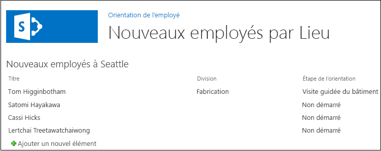

# Ajouter un composant WebPart à une page dans un complément hébergé par SharePoint pour SharePoint
Découvrez comment inclure des composants WebPart sur une page dans des Compléments SharePoint.
Cet article est le cinquième d'une série d'articles sur les concepts de base du développement des Compléments SharePoint hébergées par SharePoint. Familiarisez-vous tout d'abord avec  [Compléments](sharepoint-add-ins.md) et les articles précédents de cette série :
  
    
    


-  [Commencer à créer des compléments SharePoint hébergés par SharePoint](get-started-creating-sharepoint-hosted-sharepoint-add-ins.md)
    
  
-  [Déployer et installer un complément hébergé par SharePoint pour SharePoint](deploy-and-install-a-sharepoint-hosted-sharepoint-add-in.md)
    
  
-  [Ajouter des colonnes personnalisées à un complément hébergé par SharePoint pour SharePoint](add-custom-columns-to-a-sharepoint-hostedsharepoint-add-in.md)
    
  
-  [Ajouter un type de contenu personnalisé à un complément hébergé par SharePoint pour SharePoint](add-a-custom-content-type-to-a-sharepoint-hostedsharepoint-add-in.md)
    
  

> [!REMARQUE]
> Si vous avez suivi cette série sur les compléments hébergés par SharePoint, vous disposez d'une solution Visual Studio que vous pouvez continuer à utiliser avec cette rubrique. Vous pouvez également télécharger le référentiel à l'adresse  [SharePoint_SP-hosted_Add-Ins_Tutorials](https://github.com/OfficeDev/SharePoint_SP-hosted_Add-Ins_Tutorials) et ouvrir le fichier BeforeWebPart.sln.
  
    
    

Dans cet article, vous ajoutez un composant WebPart à la page par défaut du Complément SharePoint Employee Orientation (Orientation des employés).
## Ajouter un composant WebPart à une page


  
    
    

1. Dans l' **Explorateur de solutions**, ouvrez le fichier Default.aspx. 
    
  
2. Nous allons ajouter un composant WebPart Affichage Liste à la page qui fait apparaître la liste New Employees in Seattle (Nouveaux employés à Seattle), de telle sorte qu'il ne soit plus nécessaire d'avoir un lien vers la page Affichage Liste. Supprimez l'élément **<asp:HyperLink>** de l'élément **<asp:Content>** dont la valeur **ContentPlaceHolderId** est `PlaceHolderMain`. 
    
  
3. Au sein du même élément **<asp:Content>**, ajoutez l'élément **WebPartZone** suivant.
    
  ```XML
  
<WebPartPages:WebPartZone runat="server" FrameType="TitleBarOnly"
      ID="HomePage1" Title="loc:full" />

  ```

4. Enregistrez et fermez le fichier.
    
  
5. Dans l' **Explorateur de solutions**, ouvrez le fichier elements.xml de la page dans le nœud **Pages**. 
    
  
6. Si l'élément **File** est à fermeture automatique, supprimez le caractère « / » qu'il contient et ajoutez la balise de fin `</File>`.
    
  
7. Dans l'élément **File**, ajoutez un élément enfant **AllUsersWebPart** et définissez sa valeur **WebPartZoneID** sur l'ID de la zone WebPart que vous avez créée sur la page. Le contenu du fichier doit maintenant avoir l'aspect ci-dessous. Ce balisage indique à SharePoint d'insérer un élément **AllUsersWebPart** dans la zone WebPart nommée « HomePage1 ».
    
  ```
  
<Elements xmlns="http://schemas.microsoft.com/sharepoint/">
  <Module Name="Pages">
    <File Path="Pages\\Default.aspx" Url="Pages/Default.aspx" ReplaceContent="TRUE" >
      <AllUsersWebPart WebPartZoneID="HomePage1" WebPartOrder="1">

      </AllUsersWebPart>
    </File>
  </Module>
</Elements>

  ```

8. Ajoutez un élément **CDATA** en tant qu'enfant de l'élément **AllUsersWebPart**, puis ajoutez un élément **webParts** en tant qu'enfant de l'élément **CDATA** comme indiqué dans le balisage suivant.
    
  ```
  
<AllUsersWebPart WebPartZoneID="HomePage1" WebPartOrder="1">
  <![CDATA[
    <webParts>

    </webParts>
  ]]>
</AllUsersWebPart>
  ```

9. Ajoutez le balisage **webPart** suivant en tant qu'enfant de l'élément **webParts**. Ce balisage ajoute un élément **XsltListViewWebPart** et indique à l'élément WebPart d'afficher la listeNew Employees in Seattle (Nouveaux employés à Seattle). Notez que la valeur de la propriété **ViewContentTypeId** est simplement « 0x », et non l'ID réel du type de contenuNewEmployee
    
  ```
  
  <webPart xmlns="http://schemas.microsoft.com/WebPart/v3">
    <metaData>
      <type name="Microsoft.SharePoint.WebPartPages.XsltListViewWebPart, 
                   Microsoft.SharePoint, Version=15.0.0.0, Culture=neutral, 
                   PublicKeyToken=71e9bce111e9429c" />
    </metaData>
    <data>
      <properties>
        <property name="ListUrl">Lists/NewEmployeesInSeattle</property>
        <property name="IsIncluded">True</property>
        <property name="NoDefaultStyle">True</property>
        <property name="Title">New Employees in Seattle</property>
        <property name="PageType">PAGE_NORMALVIEW</property>
        <property name="Default">False</property>
        <property name="ViewContentTypeId">0x</property>
      </properties>
    </data>
  </webPart>
  ```


## Exécuter et tester le complément


  
    
    

1. Utilisez la touche F5 pour déployer et exécuter votre complément. Visual Studio effectue une installation temporaire du complément sur votre site SharePoint de test et exécute immédiatement celui-ci. 
    
  
2. Lorsque la page par défaut du complément s'ouvre, le composant WebPart Affichage Liste figure dessus et la liste y est affichée.
    
   **Page par défaut avec élément WebPart de vue liste**

  

     
  

    
    
  
3. Essayez d'ajouter de nouveaux éléments à la liste et de modifier des éléments existants.
    
  
4. Pour mettre fin à la session de débogage, fermez la fenêtre du navigateur ou arrêtez le débogage dans Visual Studio. Chaque fois que vous appuyez sur F5, Visual Studio retire la version précédente du complément et installe la plus récente.
    
  
5. Vous allez travailler avec ce complément et la solution Visual Studio dans d'autres articles. Il est donc recommandé de retirer le complément une dernière fois lorsque vous avez terminé de travailler et n'allez pas le réutiliser pendant un moment. Cliquez avec le bouton droit de la souris sur le projet dans l' **Explorateur de solutions** et choisissez **Retirer**.
    
  

## 
<a name="Nextsteps"> </a>

Dans le prochain article de cette série, vous allez ajouter un flux de travail au Complément SharePoint :  [Ajouter un flux de travail à un complément hébergé par SharePoint pour SharePoint](add-a-workflow-to-a-sharepoint-hosted-sharepoint-add-in.md).
  
    
    

