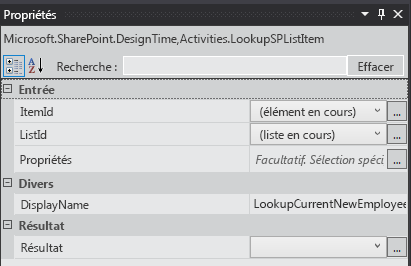
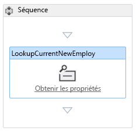
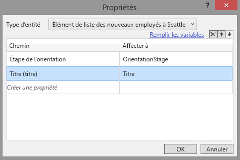
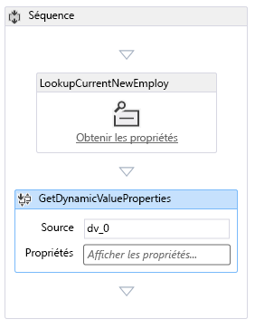
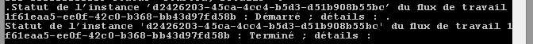
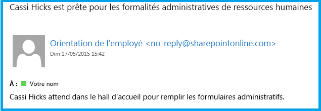

# Ajouter un flux de travail à un complément hébergé par SharePoint pour SharePoint
Apprenez à inclure un flux de travail dans un Complément SharePoint.
Cet article est le sixième d'une série sur les concepts de base du développement de Compléments SharePoint hébergés sur SharePoint. Familiarisez-vous tout d'abord avec  [Compléments](sharepoint-add-ins.md) et les articles précédents de cette série :

-  [Commencer à créer des compléments SharePoint hébergés par SharePoint](get-started-creating-sharepoint-hosted-sharepoint-add-ins.md)

-  [Déployer et installer un complément hébergé par SharePoint pour SharePoint](deploy-and-install-a-sharepoint-hosted-sharepoint-add-in.md)

-  [Ajouter des colonnes personnalisées à un complément hébergé par SharePoint pour SharePoint](add-custom-columns-to-a-sharepoint-hostedsharepoint-add-in.md)

-  [Ajouter un type de contenu personnalisé à un complément hébergé par SharePoint pour SharePoint](add-a-custom-content-type-to-a-sharepoint-hostedsharepoint-add-in.md)

-  [Ajouter un composant WebPart à une page dans un complément hébergé par SharePoint pour SharePoint](add-a-web-part-to-a-page-in-a-sharepoint-hosted-sharepoint-add-in.md)

> **REMARQUE**
> Si vous avez suivi cette série sur les compléments hébergés par SharePoint, vous disposez d'une solution Visual Studio que vous pouvez continuer à utiliser avec cette rubrique. Vous pouvez également télécharger le référentiel à l'adresse  [SharePoint_SP-hosted_Add-Ins_Tutorials](https://github.com/OfficeDev/SharePoint_SP-hosted_Add-Ins_Tutorials) et ouvrir le fichier BeforeWorkflow.sln.

Dans cet article, vous ajoutez un flux de travail au Complément SharePoint Employee Orientation (Orientation des employés) qui informe le service des ressources humaines (RH) qu'un nouvel employé est prêt à remplir les formulaires de RH.
## Ajouter un flux de travail à un complément

1. Dans l' **Explorateur de solutions**, cliquez avec le bouton droit de la souris sur le projet et choisissez **Ajouter** > **Nouveau dossier**. Nommez le dossier Flux de travail.

2. Cliquez avec le bouton droit de la souris dans le nouveau dossier et choisissez **Ajouter** > **Nouvel élément**. La boîte de dialogue **Ajouter un nouvel élément** s'ouvre sur le nœud **Office/SharePoint**.

3. Choisissez **Flux de travail** et attribuez-lui le nomAdmission_HR. Lorsque vous êtes invité à choisir le type de flux de travail, choisissez **Flux de travail de liste**, puis **Suivant**.

4. Dans la page suivante de l'assistant, activez l'option **Oui, associer ...** et définissez les valeurs suivantes pour les contrôles de la liste déroulante :

  - **Bibliothèque ou liste auxquelles associer le flux de travail**

    New Employees in Seattle (Nouveaux employés à Seattle)

  - **Historique ...**

    <créer nouveau>

  - **Liste des tâches ...**

    <créer nouveau>

    Cliquez sur **Suivant**.

5. Sur la dernière page de l'assistant, activez  *uniquement*  l'option de démarrage automatique du workflow lorsqu'un élément est *modifié*  .

6. Cliquez sur **Terminer**.

    Les Outils de développement Office pour Visual Studio effectuent ensuite l'action suivante :

  - Ils créent un flux de travail Admission_HR dans le dossier **Flux de travail**, avec un fichier Workflow.xaml enfant ouvert dans le concepteur de flux de travail.

  - Ils créent une instance de liste **WorkflowTaskList** dans laquelle les tâches qui font partie du flux de travail sont créées et mises à jour.

  - Ils créent une instance de liste **WorkflowHistoryList**, qui est un journal des différentes étapes de chaque exécution du flux de travail au moment où elles se produisent.

7. Faites glisser les deux nouvelles instances de liste dans le dossier **Listes**.

## Concevoir le flux de travail

Le flux de travail envoie un courrier électronique pour avertir un membre des ressources humaines que le nouvel employé a terminé l'étape de son orientation **Visite du bâtiment** et qu'il est prêt à remplir les formulaires d'admission des RH. Toute modification d'un élément existant de la listeNew Employees in Seattle (Nouveaux employés à Seattle) déclenche le workflow, mais celui-ci ne fait rien tant que le champOrientation Stage (Étape d'orientation) de l'élément de la liste n'est pas défini surHR Paperwork (Formalités HR). S'il l'est, un message électronique est envoyé à un membre des RH et une tâche relative à cet employé est ajoutée à la liste **WorkflowTaskList**. 

> **REMARQUE**
> À divers moments de la conception du flux de travail, un symbole losange bleu contenant un point d'exclamation  apparaît sur un ou plusieurs des éléments du concepteur de flux de travail, afin de signaler les erreurs temporaires. (Pointez le curseur sur le symbole pour afficher un message court, ou consultez la **liste d'erreurs** de Visual Studio pour plus de détails.) Il s'agit d'effets secondaires liés au fait que le flux de travail n'est pas terminé. Ils doivent tous disparaître lorsque cette procédure a pris fin.

1. Ouvrez le volet **Boîte à outils** de Visual Studio, développez le nœud **SP - Liste**, puis faites glisser **LookupSPListItem** dans la **séquence** dans le concepteur.

2. Sélectionnez l'élément **LookupSPListItem** pour faire apparaître ses propriétés dans le volet **Propriétés** de Visual Studio. Définissez les propriétés ci-dessous sur les valeurs suivantes :

  - **ItemID :** (élément actif)

  - **ListID :** (liste actuelle)

  - **DisplayName** LookupCurrentNewEmployee

    Le volet **Propriétés** doit maintenant avoir l'aspect suivant :

   **Volet Propriétés de LookupSPListItem**

Cliquez n'importe où en dehors du volet pour enregistrer les modifications ; le concepteur doit maintenant avoir l'aspect suivant.

   **Séquence dans le concepteur de flux de travail**

3. Cliquez sur le lien **Get Properties** à l'intérieur de l'activité (récemment renommée)LookupCurrentNewEmployee dans le concepteur. Une activité **GetDynamicValueProperties** est alors ajoutée à la séquence.

4. Cliquez sur le texte **Définir…** dans l'activité **GetDynamicValueProperties** pour ouvrir la boîte de dialogue **Propriétés**.

5. Définissez le **type d'entité** sur **Élément de liste de** _nom_instance_liste_, où  _nom_instance_liste_ estNew Employees in Seattle (Nouveaux employés à Seattle).

6. Dans la colonne **Chemin**, cliquez sur la cellule du haut, puis choisissez Orientation Stage (Étape d'orientation) dans la liste déroulante.

7. Cliquez sur la cellule située en-dessous, puis choisissez **Title (Titre)** dans la liste déroulante.

8. Cliquez sur **Populate Variables**. Cette action crée des variables nommées OrientationStage (Étape d'orientation) et **Title** (Titre) et affecte à chacune d'entre elles la valeur des champs correspondants dans l'élément actuel de la listeNew Employees in Seattle (Nouveaux employés à Seattle). La boîte de dialogue **Propriétés** doit maintenant avoir l'aspect suivant :

   **Boîte de dialogue Propriétés de l'activité de flux de travail**

9. Sélectionnez **OK**. La surface du concepteur doit maintenant avoir l'aspect suivant :

   **Concepteur de flux de travail**

10. Ouvrez le volet **Boîte à outils** dans Visual Studio, développez le nœud **Contrôle de flux**, puis faites glisser **If** dans le bas de la **séquence**, sous **GetDynamicValueProperties**.

11. Dans la zone **Condition** du **If**, entrez OrientationStage=="Documents HR".

12. Ouvrez le volet **Boîte à outils** dans Visual Studio, développez le nœud **SP - Utilitaires**, puis faites glisser **Courrier électronique** dans la zone **Then** de l'activité **If**.

13. Sélectionnez l'activité **Courrier électronique**. Dans le volet **Propriétés**, définissez les valeurs des propriétés Corps, Objet et À. Dans chacun des cas, choisissez le bouton de légende **. . .** de la propriété et utilisez l' **éditeur d'expression** qui s'ouvre pour définir la valeur de la propriété comme indiqué dans le tableau ci-dessous. Il s'agit d'expressions de chaîne en C# ; utilisez donc les guillemets exactement tels qu'ils sont indiqués. L'élément `Title` est une variable que vous avez affectée au champ **Titre** de l'élément de liste (qui contient le nom de l'employé).

  - **Corps :** `Title + " is waiting in the lobby to fill out benefits and employment forms."`

  - **Objet :** `Title + " is ready for HR paperwork"`

  - **À :** `new System.Collections.ObjectModel.Collection<string>() {"your_O365_email"}`

    Remplacez l'espace réservé  *your_O365_email*  par l'identité que vous utilisez pour vous connecter à votre compte de développeur Office 365, par exemple *alias*  @ *O365domain*  .sharepoint.com. Il s'agit d'une chaîne en C#, qui doit donc être entre guillemets.

14. Ouvrez le volet **Boîte à outils** de Visual Studio, développez le nœud **Runtime**, puis faites glisser **TerminateWorkflow** dans la zone **Else** de l'activité **If**.

15. Sélectionnez l'activité **TerminateWorkflow** et, dans le volet **Propriétés**, définissez la **raison** suivante, *guillemets compris*  :"Pas à l'étape des formalités HR.". Le concepteur doit ensuite ressembler à l'illustration suivante :

   **Concepteur de flux de travail en fin de flux de travail**

## Exécuter et tester le complément

1. Utilisez la touche F5 pour déployer et exécuter votre complément. Visual Studio effectue une installation temporaire du complément sur votre site SharePoint de test et exécute immédiatement celui-ci. La console de l' **hôte de service de test** s'ouvre également.

2. Lorsque la page par défaut du complément s'ouvre, ouvrez l'un des éléments pour le modifier et définissez la valeur Orientation Stage (Étape d'orientation) surHR paperwork (Formalités HR).

    Dans la console de l' **hôte de service de test**, une indication apparaît pour signaler que le flux de travail a démarré. Peu après, une autre indication signale qu'il est terminé. Voici un exemple :

   **Console de l'hôte de service de test**

> **REMARQUE**
> Si la console de l' **hôte de service de test** ne s'ouvre pas, il vous faudra peut-être activer le débogage du flux de travail. Cliquez avec le bouton droit de la souris sur le nom du projet dans l' **Explorateur de solutions** et choisissez **Propriétés**. Ouvrez l'onglet **SharePoint** dans le volet **Propriétés** et cochez la case **Activer le débogage de flux de travail**. 
3. Accédez à la boîte de réception du courrier électronique (Outlook) de votre compte développeur Office 365. Il contient un message dont l'objet est «  *Employé*  est prêt pour les formalités HR », où *Employé*  est le nom de l'employé dont vous avez modifié les éléments. Le corps du message indique « *Employé*  attend dans le hall pour remplir les formulaires d'avantages et d'emploi ». Voici un exemple :

   **Message électronique envoyé par le flux de travail**

> **CONSEIL**
> Si le flux de travail commence mais ne se termine jamais et que le message électronique n'est pas envoyé, essayez de mettre fin à la session de débogage et essayez plusieurs fois d'appuyer sur F5 avant de conclure qu'une partie de votre code est incorrecte. Il arrive que le problème provienne de SharePoint Online. > Si les problèmes persistent, essayez d'ajouter un type de contenu nommé **ListFieldsContentType**, s'il n'en existe pas déjà un, à la section **ContentTypes** du fichier schema.xml. Voici un exemple de sortie :>  `<ContentType ID="0x0100781dd48170b94fdc9706313c82b3d04c" Name="ListFieldsContentType" Hidden="TRUE">`   `</ContentType>`> Copiez ensuite l'intégralité de la section **FieldRefs** du type de contenu **NewEmployee** dans ce nouveau type de contenu.  Enregistrez le projet, retirez-le et réessayez F5. 
4. Pour mettre fin à la session de débogage, fermez la fenêtre du navigateur ou arrêtez le débogage dans Visual Studio. Chaque fois que vous appuyez sur F5, Visual Studio retire la version précédente du complément et installe la plus récente.

5. Vous allez travailler avec ce complément et la solution Visual Studio dans d'autres articles. Il est donc recommandé de retirer le complément une dernière fois lorsque vous avez terminé de travailler et n'allez pas le réutiliser pendant un moment. Cliquez avec le bouton droit de la souris sur le projet dans l' **Explorateur de solutions** et choisissez **Retirer**.

## 

Dans l'article suivant de cette série, vous ajouterez une page et un style personnalisés au Complément SharePoint :  [Ajouter une page et un style personnalisés à un complément hébergé par SharePoint pour SharePoint](add-a-custom-page-and-style-to-a-sharepoint-hosted-sharepoint-add-in.md).

