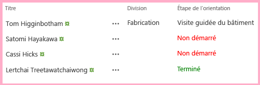

# Ajout de rendu côté client personnalisé à un complément SharePoint hébergé par SharePoint
Personnalisez le rendu et la validation des contrôles sur les pages de Compléments SharePoint.
Cet article est le huitième d'une série sur les concepts de base du développement de Compléments SharePoint hébergés par SharePoint. Familiarisez-vous tout d'abord avec  [Compléments](sharepoint-add-ins.md) et les articles précédents de cette série :
  
    
    


-  [Commencer à créer des compléments SharePoint hébergés par SharePoint](get-started-creating-sharepoint-hosted-sharepoint-add-ins.md)
    
  
-  [Déployer et installer un complément hébergé par SharePoint pour SharePoint](deploy-and-install-a-sharepoint-hosted-sharepoint-add-in.md)
    
  
-  [Ajouter des colonnes personnalisées à un complément hébergé par SharePoint pour SharePoint](add-custom-columns-to-a-sharepoint-hostedsharepoint-add-in.md)
    
  
-  [Ajouter un type de contenu personnalisé à un complément hébergé par SharePoint pour SharePoint](add-a-custom-content-type-to-a-sharepoint-hostedsharepoint-add-in.md)
    
  
-  [Ajouter un composant WebPart à une page dans un complément hébergé par SharePoint pour SharePoint](add-a-web-part-to-a-page-in-a-sharepoint-hosted-sharepoint-add-in.md)
    
  
-  [Ajouter un flux de travail à un complément hébergé par SharePoint pour SharePoint](add-a-workflow-to-a-sharepoint-hosted-sharepoint-add-in.md)
    
  
-  [Ajouter une page et un style personnalisés à un complément hébergé par SharePoint pour SharePoint](add-a-custom-page-and-style-to-a-sharepoint-hosted-sharepoint-add-in.md)
    
  

> [!REMARQUE]
> Si vous avez suivi cette série sur les compléments hébergés par SharePoint, vous disposez d'une solution Visual Studio que vous pouvez continuer à utiliser avec cette rubrique. Vous pouvez également télécharger le référentiel à l'adresse  [SharePoint_SP-hosted_Add-Ins_Tutorials](https://github.com/OfficeDev/SharePoint_SP-hosted_Add-Ins_Tutorials) et ouvrir le fichier BeforeClientRenderedControl.sln.
  
    
    

Vous pouvez utiliser un code JavaScript court côté client pour personnaliser le rendu des composants WebPart, la plupart des types de champs (colonnes) et certains autres contrôles, en attribuant un fichier JavaScript à la propriété **JSLink** du contrôle, comme **SPField.JSLink**. Vous pouvez également ajouter une logique de validation côté client de cette manière. Cet article vous permet de personnaliser le rendu d'un champ dans une liste de Complément SharePoint d'orientation d'employés à l'aide de rendu côté client.
> [!REMARQUE]
> Si l'utilisateur final a désactivé JavaScript dans son navigateur, SharePoint applique le rendu et la validation côté serveur. 
  
    
    


> [!REMARQUE]
>  La propriété JSLink n'est pas prise en charge sur les listes d'enquêtes ou d'événements. Un calendrier SharePoint est une liste d'événements.
  
    
    


## Création et enregistrement du code JavaScript


  
    
    

1. Dans l' **Explorateur de solutions**, cliquez avec le bouton droit sur le nœud **Scripts** et choisissez **Ajouter** > **Nouvel élément** > **Web**.
    
  
2. Sélectionnez **Fichier JavaScript** et nommez-leRenduÉtapeOrientation.js.
    
  
3. Votre rendu personnalisé du champ doit se produire automatiquement, il faut donc ajouter une méthode anonyme au code JavaScript qui s'exécute automatiquement lorsque le fichier se charge avec le code suivant.
    
  ```
  
(function () {

})();
  ```

4. Dans le corps de cette méthode (entre les caractères {}), ajoutez le code suivant afin de créer des objets JSON (JavaScript Object Notation) pour le contexte rendu prioritaire, les modèles de contexte et les modèles de champs.
    
  ```
  
var customRenderingOverride = {};
customRenderingOverride.Templates = {};
customRenderingOverride.Templates.Fields = {

}
  ```

5. Dans le corps de l'objet de modèle  `Fields`, ajoutez le JSON suivant. Le nom de propriété  `OrientationStage` identifie le champ dont le rendu est personnalisé. La valeur de la propriété est un autre objet JSON. La propriété `View` identifie le contexte de page dans lequel le rendu personnalisé est appliqué. Dans ce cas, l'objet indique à SharePoint d'utiliser le rendu personnalisé sur les vues de liste. (Il existe d'autres options pour les formulaires de modification, de création et d'affichage.) La valeur de la propriété, `renderOrientationStage`, est le nom de la méthode de rendu personnalisé que vous créerez à une étape ultérieure.
    
  ```
  
"OrientationStage": { "View": renderOrientationStage }
  ```

6. La dernière chose que la méthode anonyme doit faire consiste à parler du rendu prioritaire au gestionnaire de modèles SharePoint. Ajoutez la ligne suivante à la fin du corps de la méthode.
    
  ```
  SPClientTemplates.TemplateManager.RegisterTemplateOverrides(customRenderingOverride);
  ```


    La méthode doit maintenant se présenter comme suit.
    


  ```
  (function () {
    var customRenderingOverride = {};
    customRenderingOverride.Templates = {};
    customRenderingOverride.Templates.Fields = {
        "OrientationStage": { "View": renderOrientationStage }
    }

    SPClientTemplates.TemplateManager.RegisterTemplateOverrides(customRenderingOverride);
})();
  ```

7. Ajoutez la méthode suivante au fichier. Elle définit la couleur de la valeur de colonne **Étape d'orientation** en rouge lorsque la valeur est « Non commencée » et en vert lorsque la valeur est « Terminée ». (L'objet `ctx` est un objet de contexte client déclaré par le script prêt à l'emploi de SharePoint.)
    
  ```
  
function renderOrientationStage(ctx) {
    var orientationStageValue = ctx.CurrentItem[ctx.CurrentFieldSchema.Name];
    if (orientationStageValue == "Not Started")  {
        return "<span style='color:red'>" + orientationStageValue + "</span>"
    }
    else if (orientationStageValue == "Completed") {
        return "<span style='color:green'>" + orientationStageValue + "</span>"
    }
    else {
        return orientationStageValue;
    }
}
  ```

8. Dans l' **Explorateur de solutions**, développez **Colonnes de site**, puis **ÉtapeOrientation**. Ensuite, ouvrez le fichier elements.xml.
    
  
9. Pour indiquer à SharePoint d'utiliser votre code JavaScript personnalisé, ajoutez un nouvel attribut, **JSLink**, à l'élément **Field**, puis attribuez l'URL suivante en tant que valeur :  `~site/Scripts/OrientationStageRendering.js`.
    
    > [!REMARQUE]
      > La propriété **JSLink** est toujours un fichier, pas une méthode. Il n'existe aucun moyen d'indiquer à SharePoint la méthode à exécuter. C'est pourquoi le fichier contient une méthode qui s'exécute automatiquement.

    La balise de début de l'élément **Field** se présente désormais comme suit.
    


  ```
  
<Field
       ID="{some_guid_here}"
       Name="OrientationStage"
       Title="OrientationStage"
       DisplayName="Orientation Stage"
       Description="The current orientation stage of the employee."
       Type="Choice"
       Required="TRUE"
       Group="Employee Orientation" 
       JSLink="~site/Scripts/OrientationStageRendering.js">
<!-- child elements and end tag omitted -->
  ```

10. Ouvrez la page Default.aspx et ajoutez le code suivant en tant que dernier enfant de l'élément **asp:Content** dont la valeur **ContentPlaceHolderID** est définie sur **PlaceHolderMain**. 
    
  ```XML
  
<p><asp:HyperLink runat="server" NavigateUrl="JavaScript:window.location = _spPageContextInfo.webAbsoluteUrl + '/Lists/NewEmployeesInSeattle/AllItems.aspx';"
    Text="List View Page for New Employees in Seattle" /></p>

  ```


## Exécuter et tester le complément


  
    
    

1. Utilisez la touche F5 pour déployer et exécuter votre complément. Visual Studio effectue une installation temporaire du complément sur votre site SharePoint de test et exécute immédiatement celui-ci. 
    
  
2. Le rendu côté client que vous avez configuré a un impact sur le rendu du champ uniquement sur la page de vue de liste et non dans le composant WebPart de vue de liste que nous avons mis sur la page d'accueil. Cela est dû au fait que les composants WebPart appliquent par défaut le rendu côté serveur. Il existe des façons d'inverser ce phénomène, mais elles impliquent un niveau trop avancé par rapport à cet exemple simple. Par conséquent, pour voir le rendu côté client en action, cliquez sur le lien en bas de la page **de vue de liste pour les nouveaux employés à Seattle**.
    
  
3. Lorsque la page de vue de liste s'ouvre, définissez la valeur **Étape d'orientation** pour certains éléments sur **Non démarrée** et d'autres sur **Terminée** pour voir le rendu personnalisé des couleurs.
    
   **Liste avec le rendu côté client**

  

     
  

  

  
4. Pour mettre fin à la session de débogage, fermez la fenêtre du navigateur ou arrêtez le débogage dans Visual Studio. Chaque fois que vous appuyez sur F5, Visual Studio retire la version précédente du complément et installe la plus récente.
    
  
5. Vous allez travailler avec ce complément et la solution Visual Studio dans d'autres articles. Il est donc recommandé de retirer le complément une dernière fois lorsque vous avez terminé de travailler et n'allez pas le réutiliser pendant un moment. Cliquez avec le bouton droit de la souris sur le projet dans l' **Explorateur de solutions** et choisissez **Retirer**.
    
  

## 
<a name="Nextsteps"> </a>

Dans l'article suivant de cette série, vous allez ajouter un élément de menu personnalisé et un bouton personnalisé au ruban dans le Complément SharePoint :  [ Création d'un bouton de ruban personnalisé dans le site web hôte d'un complément SharePoint](create-a-custom-ribbon-button-in-the-host-web-of-a-sharepoint-add-in.md).
  
    
    

