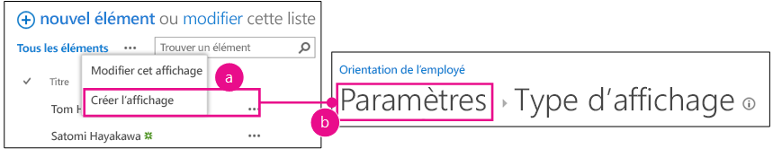
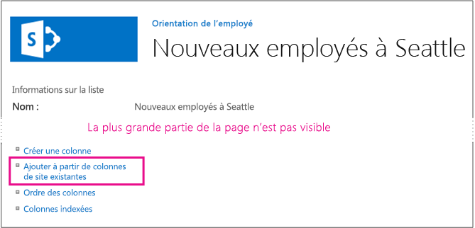
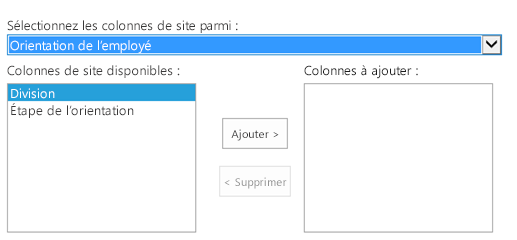
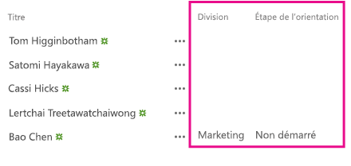

# Ajouter des colonnes personnalisées à un complément hébergé par SharePoint pour SharePoint
Découvrez comment inclure des colonnes personnalisées dans des Compléments SharePoint.
Cet article est le troisième d'une série d'articles sur les concepts de base du développement de Compléments SharePoint hébergés par SharePoint. Vous devez d'abord vous familiariser avec  [Compléments](sharepoint-add-ins.md) et les articles précédents de cette série :
  
    
    


-  [Commencer à créer des compléments SharePoint hébergés par SharePoint](get-started-creating-sharepoint-hosted-sharepoint-add-ins.md)
    
  
-  [Déployer et installer un complément hébergé par SharePoint pour SharePoint](deploy-and-install-a-sharepoint-hosted-sharepoint-add-in.md)
    
  

> [!REMARQUE]
> Si vous avez suivi cette série sur les compléments hébergés par SharePoint, vous disposez d'une solution Visual Studio que vous pouvez continuer à utiliser avec cette rubrique. Vous pouvez également télécharger le référentiel à l'adresse  [SharePoint_SP-hosted_Add-Ins_Tutorials](https://github.com/OfficeDev/SharePoint_SP-hosted_Add-Ins_Tutorials) et ouvrir le fichier BeforeColumns.sln.
  
    
    

Cet article revient sur le codage et traite de l'ajout de colonnes de site au Complément SharePoint Employee Orientation (Orientation des employés).
## Créer des types de colonnes personnalisées


  
    
    

1. Dans l' **Explorateur de solutions**, cliquez avec le bouton droit de la souris sur le projet et choisissez **Ajouter** > **Nouveau dossier**. Nommez le dossier Colonnes de site.
    
  
2. Cliquez avec le bouton droit sur le nouveau dossier, puis choisissez **Ajouter** > **Nouvel élément**. La boîte de dialogue **Ajouter un nouvel élément** s'ouvre sur le nœud **Office/SharePoint**.
    
  
3. Choisissez **Colonne de site**, attribuez-lui le nom Division, puis choisissez **Ajouter**.
    
  
4. Dans le fichier elements.xml de la nouvelle colonne de site, modifiez l'élément **Field** pour qu'il possède les attributs et les valeurs de l'exemple suivant. Toutefois, *ne modifiez **pas** le GUID*  de l'attribut **ID**; conservez la valeur que Visual Studio a généré pour celui-ci. * Utilisez donc le copier-coller avec précaution*  .
    
  ```
  
<Field ID="{generated GUID}"
       Name="Division" 
       Title="Division" 
       DisplayName="Division" 
       Description="The division of the company where the employee works." 
       Group="Employee Orientation" 
       Type="Text" 
       Required ="FALSE">
</Field>
  ```

5. Ajoutez une autre **colonne de site** au même dossier et nommez-laOrientationStage (Étape d'orientation).
    
  
6. Dans le fichier elements.xml de la nouvelle colonne de site, modifiez l'élément **Field** pour qu'il possède les attributs et valeurs de l'exemple suivant. Vous ne devez toutefois pas changer le GUID de l'attribut **ID**; conservez la valeur Visual Studio générée pour celui-ci.
    
  ```
  
<Field ID="{generated GUID}"
       Name="OrientationStage" 
       Title="OrientationStage"
       DisplayName="Orientation Stage" 
       Group="Employee Orientation" 
       Description="The current orientation stage of the employee." 
       Type="Choice"
       Required ="TRUE">
</Field>
  ```

7. Comme il s'agit d'un champ de choix, vous devez spécifier les choix possibles et l'ordre dans lequel ils doivent apparaître dans la liste déroulante lorsqu'un utilisateur effectue une sélection. Comme il s'agit d'un champ obligatoire, indiquez également une valeur par défaut. Ajoutez le balisage enfant suivant à l'élément **Field**.
    
  ```
  
<CHOICES>
      <CHOICE>Not Started</CHOICE>
      <CHOICE>Tour of building</CHOICE>
      <CHOICE>HR paperwork</CHOICE>
      <CHOICE>Corporate network access</CHOICE>
      <CHOICE>Completed</CHOICE>
</CHOICES>
<MAPPINGS>
      <MAPPING Value="1">Not Started</MAPPING>
      <MAPPING Value="2">Tour of building</MAPPING>
      <MAPPING Value="3">HR paperwork</MAPPING>
      <MAPPING Value="4">Corp network access</MAPPING>
      <MAPPING Value="5">Completed</MAPPING>
</MAPPINGS>
<Default>Not Started</Default>
  ```

8. Enregistrez tous les fichiers.
    
  

## Exécuter le complément et tester les colonnes


  
    
    

1. Utilisez la touche F5 pour déployer et exécuter votre complément. Visual Studio effectue une installation temporaire du complément sur votre site SharePoint de test et exécute immédiatement celui-ci. 
    
  
2. Lorsque la page par défaut du complément s'ouvre, choisissez le lien **New Employees in Seattle** (Nouveaux employés à Seattle) pour ouvrir l'instance de liste personnalisée.
    
  
3. Ouvrez la page **Paramètres** de la liste et ajoutez-y les deux colonnes avec ces étapes.
    
1. Cliquez sur le bouton de légende, **· · ·**, juste au-dessus de la liste, puis choisissez **Créer une vue**.
    
  
2. La page **Type de vue** s'affiche, avec la structure de navigation **Paramètres > Type de vue** dans la partie supérieure. Cliquez sur la barre de navigation **Paramètres**.
    
   **Étapes d'ouverture de la page de paramètres de liste**

  

     
  

    
    
  
3. Dans la page **Paramètres**, ouvrez le lien **Ajouter à partir de colonnes de site existantes** à gauche, à mi-hauteur de la page.
    
   **Page Paramètres de la liste**

  

     
  

    
    
  
4. Dans la page **Ajouter des colonnes à partir de colonnes de site**, choisissez **Employee Orientation** (Orientation des employés) dans la liste déroulante **Sélectionner des colonnes du site dans**.
    
   **Page Ajouter des colonnes à partir de colonnes de site**

  

     
  

    
    
  
5. Ajoutez les colonnes **Division** et **OrientationStage** (Étape d'orientation) à la zone **Colonnes à ajouter**.
    
  
6. Choisissez **OK** pour revenir à la page **Paramètres**, puis cliquez sur la barre de navigation **New Employees in Seattle** (Nouveaux employés à Seattle) en haut de la page.
    
  
4. Les nouvelles colonnes figurent maintenant dans la liste. Ajoutez un nouvel élément à la liste. Dans le formulaire d'édition, le champ **Orientation Stage** (Étape d'orientation) contiendra déjà la valeur par défautNon commencé. (Les éléments existants sont vides dans ce champ car ils ont été créés avant que le champ n'apparaisse dans la liste.)
    
   **Liste avec les nouvelles colonnes**

  

     
  

    
    
  
5. Pour mettre fin à la session de débogage, fermez la fenêtre du navigateur ou arrêtez le débogage dans Visual Studio. Chaque fois que vous appuyez sur F5, Visual Studio retire la version précédente du complément et installe la plus récente.
    
  
6. Vous allez travailler avec ce complément et la solution Visual Studio dans d'autres articles. Il est donc recommandé de retirer le complément une dernière fois lorsque vous avez terminé de travailler et n'allez pas le réutiliser pendant un moment. Cliquez avec le bouton droit sur le projet dans l' **Explorateur de solutions** et choisissez **Retirer**.
    
  

## 
<a name="Nextsteps"> </a>

Comme il n'est pas vraiment nécessaire que vos utilisateurs aient à ajouter manuellement les colonnes personnalisées à la liste, le prochain article de cette série examinera la création d'un type de contenu personnalisé qui comprend les colonnes personnalisées et est associé automatiquement au modèle de liste Nouveaux employés :  [Ajouter un type de contenu personnalisé à un complément hébergé par SharePoint pour SharePoint](add-a-custom-content-type-to-a-sharepoint-hostedsharepoint-add-in.md). 
  
    
    

