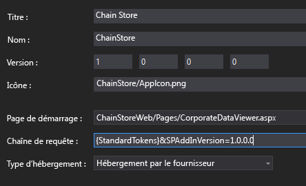
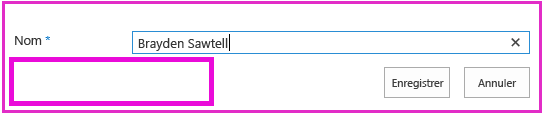
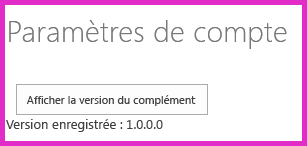

# Ajout d'une logique de première exécution au complément hébergé par un fournisseur
 Apprenez à inclure du code de « première exécution » dans un Complément SharePoint hébergé par un fournisseur.
 Cet article est le huitième d'une série sur les concepts de base du développement de Compléments SharePoint hébergés par un fournisseur. Familiarisez-vous tout d'abord avec [Compléments](sharepoint-add-ins.md) et les articles précédents de cette série :


-  [Commencer à créer des compléments hébergés par un fournisseur pour SharePoint](get-started-creating-provider-hosted-sharepoint-add-ins.md)


-  [ Procédure pour donner à votre complément hébergé par un fournisseur l'apparence de SharePoint](give-your-provider-hosted-add-in-the-sharepoint-look-and-feel.md)


-  [ Insertion d'un bouton personnalisé dans un complément hébergé par un fournisseur](include-a-custom-button-in-the-provider-hosted-add-in.md)


-  [ Présentation rapide du modèle objet SharePoint](get-a-quick-overview-of-the-sharepoint-object-model.md)


-  [ Ajout d'opérations d'écriture SharePoint au complément hébergé par un fournisseur](add-sharepoint-write-operations-to-the-provider-hosted-add-in.md)


-  [ Insertion d'un composant de complément dans le complément hébergé par un fournisseur](include-an-add-in-part-in-the-provider-hosted-add-in.md)


-  [ Gestion des événements de complément dans le complément hébergé par un fournisseur](handle-add-in-events-in-the-provider-hosted-add-in.md)


> **REMARQUE**
>  Si vous avez suivi cette série sur les compléments hébergés par un fournisseur, vous disposez d'une solution Visual Studio que vous pouvez continuer à utiliser avec cette rubrique. Vous pouvez également télécharger le référentiel à l'adresse [SharePoint_Provider-hosted_Add-Ins_Tutorials](https://github.com/OfficeDev/SharePoint_Provider-hosted_Add-ins_Tutorials) et ouvrir le fichier BeforeFirstRunLogic.sln.


 Dans cet article, vous allez ajouter du code à la page d'accueil du Complément SharePoint Chain Store qui permet de vérifier si l'instance actuelle du complément est en cours d'exécution pour la première fois. S'il s'agit de la première fois, votre code déploie la liste **Employés locaux** et le bouton de ruban personnalisé.
## Création de la classe de base pour le déploiement des composants SharePoint


> **REMARQUE**
>  Les paramètres des projets de démarrage dans Visual Studio ont tendance à revenir aux valeurs par défaut à chaque fois que la solution est rouverte. Veillez à toujours suivre les étapes ci-dessous immédiatement après la réouverture de la solution d'exemple de cette série d'articles :<BR /><BR />  Cliquez avec le bouton droit sur le nœud de la solution en haut de l' **Explorateur de solutions** et sélectionnez **Définir les projets de démarrage**. <BR />  Assurez-vous que les trois projets sont définis sur **Début** dans la colonne **Action**. 


1.  Dans le projet **ChainStoreWeb** de l' **Explorateur de solutions**, cliquez avec le bouton droit sur le dossier **Utilitaires** et sélectionnez **Ajouter | Élément existant**.


2.  Dans l' **Explorateur de fichiers** qui s'ouvre, accédez au dossier de solution, le dossier **ChainStoreWeb**, puis ouvrez le dossier **Utilitaires**.


3.  Sélectionnez SharePointComponentDeployer.cs et cliquez sur **Ajouter**.


4.  Ouvrez le fichier SharePointComponentDeployer.cs. Il comporte une classe statique et deux méthodes statiques qui obtiennent et définissent la version du complément dans la table **Clients** de la base de données d'entreprise. Nous n'allons pas parler de ces méthodes, car cette série d'articles n'est pas destinée à l'enseignement de la programmation ASP.NET ou SQL Server/Azure.


5.  Ajoutez l'instruction **using** suivante en haut du fichier.

 ```

using System.Web;
using System.Linq;
using System.Collections.Generic;
using Microsoft.SharePoint.Client;
 ```

6.  En haut de la classe `SharePointComponentDeployer`, ajoutez les deux champs statiques suivants. Ces deux champs sont initialisés dans la méthode **Page_Load** de la page d'accueil du complément. Vous ajouterez ce code à une étape ultérieure. Le premier champ doit contenir l'objet **SharePointContext** qui est nécessaire pour effectuer des opérations CRUD sur SharePoint. Le deuxième doit contenir le numéro de version du complément installé sur le site web hôte. Cette valeur sera initialement différente de la valeur par défaut ( **0000.0000.0000.0000** ) qui est enregistrée dans la table **Clients** d'entreprise lorsque le gestionnaire d'installation enregistre le client. Par exemple, la première version du complément sera **1.0.0.0**.

 ```cs

internal static SharePointContext sPContext;
internal static Version localVersion;
 ```

7.  Créez la propriété statique suivante pour conserver la version du complément actuellement enregistrée dans la table **Clients** de l'entreprise. Elle utilise les deux méthodes qui étaient déjà dans le fichier pour obtenir et définir cette valeur.

 ```cs

internal static Version RemoteTenantVersion
{
    get
    {
        return GetTenantVersion();
    }
    set
    {
        SetTenantVersion(value);
    }
}
 ```

8.  Maintenant, créez la propriété `IsDeployed` suivante. Notez ce qui suit à propos de ce code :

  -  La méthode **Page_Load** de la page d'accueil du complément utilise la valeur de cette propriété pour déterminer si le complément est en cours d'exécution pour la première fois ou non. La valeur **false** indique que le complément n'a jamais été exécuté sur le site web hôte actuel, par conséquent, ses composants doivent être déployés.


  -  Le critère repose sur le numéro de version enregistré dans la table **Clients**: il s'agit de savoir s'il est inférieur à la version réellement installée. Lors de la première exécution du complément, il est inférieur. Le code que vous écrirez dans une étape ultérieure définit la version dans la table **Clients** sur la même version réellement installée. Ainsi, lorsque le complément s'exécute à nouveau, `IsDeployed` renvoie **true** et la logique de déploiement ne s'exécute pas à nouveau.


 ```cs

public static bool IsDeployed
{
    get
    {
        if (RemoteTenantVersion < localVersion)
            return false; 
        else
            return true; 
    }
}
 ```

9.  Ajoutez la méthode suivante à la classe `SharePointComponentDeployer`. Notez que la dernière action de la méthode consiste à mettre à jour la version du client enregistrée dans la base de données d'entreprise ( **0000.0000.0000.0000** ) afin qu'elle corresponde à la version réelle du complément sur le site web hôte ( **1.0.0.0** ). Vous terminerez cette méthode à une étape ultérieure.

 ```cs

internal static void DeployChainStoreComponentsToHostWeb(HttpRequest request)
{
    // TODO4: Deployment code goes here.

    RemoteTenantVersion = localVersion;
}
 ```


> **REMARQUE**
>  Il est possible que vous vous demandiez pourquoi le complément utilise des numéros de version et un test « inférieur à » pour déterminer la réponse à une simple question : le complément s'exécute-t-il pour la première fois ? Nous pourrions tout aussi bien avoir un champ de chaîne simple dans la table **Clients** défini sur « pas encore exécuté » dans le gestionnaire d'installation, puis le modifier sur « exécuté une fois » par la logique de première exécution une fois que les composants SharePoint sont déployés.<BR />  Pour le complément de Chain Store, un simple test pourrait fonctionner. Cependant, il est généralement recommandé d'utiliser les numéros de version. En effet, un complément de production est susceptible d'être mis à jour sur place dans le futur (c'est-à-dire, mis à jour après qu'il a déjà été installé). Lorsque cela se produira, votre logique de complément devra être sensible à plus de possibilités quepas encore exécuté etdéjà exécuté une fois. Par exemple, supposons que vous souhaitez ajouter une liste supplémentaire au site web hôte dans la mise à niveau de la version 1.0.0.0 à 2.0.0.0. Vous pouvez le faire dans un gestionnaire d'événements de mise à jour ou dans une logique de « première exécution après mise à jour ». De toute façon, votre logique de déploiement devra déployer de nouveaux composants, mais elle devra également éviter d'essayer de redéployer les composants qui ont été déployés dans une version précédente du complément. Le numéro de version 1.0.0.0 signalerait que les composants de la version 1.0.0.0 ont été déployés, mais que la logique de première exécution après mise à jour ne s'est pas encore exécutée.


## Ajout de la logique de démarrage de base


1.  Le site web hôte SharePoint doit indiquer à l'application web distante la version du complément qu'il a installée. Pour ce faire, nous allons utiliser un paramètre de requête. Ouvrez le fichier AppManifest.xml du projet **ChainStore**. Dans le concepteur, l'espace réservé **{StandardTokens}** est la valeur de la zone **Chaîne de requête**. Ajoutez la chaîne « &amp;SPAddInVersion=1.0.0.0 » à la fin. Le concepteur de manifeste doit désormais se présenter comme suit. *Notez que le numéro de version que vous transmettez dans la chaîne de requête doit correspondre à la valeur de la zone **Version** du concepteur.*  (Si vous êtes amené à mettre à jour le complément, l'une de vos tâches consiste à mettre à jour ces valeurs en les conservant.)




2.  Ouvrez le fichier CorporateDataViewer.aspx.cs et ajoutez le code suivant à la méthode **Page_Load**, juste en dessous de la ligne qui initialise l'objet  `spContext`. Notez ce qui suit à propos de ce code :

  -  Il commence par la définition de deux champs statiques dans la classe statique `SharePointComponentDeployer`. Il transmet l'objet **SharePointContext**, car le code de l'élément  `SharePointComponentDeployer` appelle SharePoint, puis il utilise le paramètre de requête que vous avez ajouté pour définir la propriété `localVersion`.


  -  Il ne fait rien si `IsDeployed` est True, en d'autres termes si la logique « de première exécution » a déjà été exécutée. Dans le cas contraire, il appelle la méthode de déploiement et transmet l'objet de demande ASP.NET.


 ```cs

SharePointComponentDeployer.sPContext = spContext;
SharePointComponentDeployer.localVersion = new Version(Request.QueryString["SPAddInVersion"]);

if (!SharePointComponentDeployer.IsDeployed)
{
    SharePointComponentDeployer.DeployChainStoreComponentsToHostWeb(Request);
}
 ```


## Déploiement par programmation d'une liste SharePoint


1.  Dans le fichier SharePointComponentDeployer.cs, remplacez l'élément `TODO4` par la ligne suivante. Vous créerez cette méthode à l'étape suivante.

 ```cs

CreateLocalEmployeesList();
 ```

2.  Ajoutez la méthode suivante à la classe `SharePointComponentDeployer`. Notez les points suivants concernant ce code.

  -  Il comporte deux appels de l'élément **ExecuteQuery**. Le premier est nécessaire pour déterminer si la liste existe déjà. Le deuxième crée la liste.


  -  La méthode **ClientContext.LoadQuery** est semblable à l'élément **ClientContext.Load**, sauf qu'au lieu d'apporter une entité au client, par exemple une liste, elle transmet les résultats énumérables d'une requête.


 ```cs
  private static void CreateLocalEmployeesList()
{
    using (var clientContext = sPContext.CreateUserClientContextForSPHost())
    {
        var query = from list in clientContext.Web.Lists
                    where list.Title == "Local Employees"
                    select list;
        IEnumerable<List> matchingLists = clientContext.LoadQuery(query);
        clientContext.ExecuteQuery();

        if (matchingLists.Count() == 0)
        {
           // TODO5: Create the list 

           // TODO6: Rename the Title field on the list 

           // TODO7: Add "Added to Corporate DB" field to the list 

           clientContext.ExecuteQuery();
        }
    }
}
 ```

3.  Remplacez l'élément `TODO5` par le code suivant. Notez ce qui suit à propos de ce code :

  -  La classe **ListCreationInformation** est semblable à la classe **ListItemCreationInformation** que vous avez vue dans un article précédent de cette série. Il s'agit d'une classe simple plus appropriée pour l'envoi d'informations depuis l'application web à SharePoint comparé à la classe **List** complète.


  -  Il existe plusieurs types de modèles de liste, tels que le type Tâches pour une liste de tâches et le type Événements pour un calendrier. La liste **Employés locaux** est basée sur le plus simple : le type Générique.


  -  La propriété **ListCreationInformation.Url** contient l'URL de la liste *relative*  au site web hôte. En spécifiant « Lists/LocalEmployees », le code définit l'URL complète de la liste vers https:// *{DomaineSharePoint}*  /hongkong/_layouts/15/start.aspx#/Lists/Local%20Employees.


 ```cs

ListCreationInformation listInfo = new ListCreationInformation();
listInfo.Title = "Local Employees";
listInfo.TemplateType = (int)ListTemplateType.GenericList;
listInfo.Url = "Lists/Local Employees";
List localEmployeesList = clientContext.Web.Lists.Add(listInfo);
 ```

4.  Remplacez `TODO6` par le code suivant qui modifie le nom public du champ « Titre » (colonne) de « Titre » en « Nom ». Voici ce que vous avez fait sur la page **Paramètres de liste** lorsque vous avez créé la liste manuellement.

 ```cs

Field field = localEmployeesList.Fields.GetByInternalNameOrTitle("Title");
field.Title = "Name";
field.Update();
 ```

5.  Vous avez également créé manuellement un champ intitulé **Ajouté à la base de données d'entreprise**. Pour réaliser cette opération par programmation, ajoutez le code suivant à la place de l'élément  `TODO7`. Notez ce qui suit à propos de ce code :

  -  Les principales propriétés du champ sont spécifiées par un objet blob XML. Il s'agit d'un héritage de l'architecture SharePoint : les sites web, les listes, les champs, les types de contenu et la plupart des autres types de composants SharePoint sont définis comme des éléments XML. Dans ce cas, nous indiquons le nom d'affichage, le type de données et la valeur par défaut du champ.


  -  Le deuxième paramètre détermine si le champ est visible dans la vue par défaut de la liste. Nous le définissons sur **true**. 


  -  Le troisième paramètre peut être utilisé pour déterminer les types de contenu auxquels le champ est ajouté. La valeur **DefaultValue** signifie qu'il est ajouté uniquement au type de contenu par défaut de la liste.


 ```cs

localEmployeesList.Fields.AddFieldAsXml("<Field DisplayName='Added to Corporate DB'"
                                         +"Type='Boolean'>"
                                         + "<Default>FALSE</Default></Field>",
                                         true,
                                         AddFieldOptions.DefaultValue);
 ```

6.  Souvenez-vous que le champ **Ajouté à la base de données d'entreprise** est défini par défaut sur **Non** (ce qui correspond à False), mais que le bouton de ruban personnalisé du complément le définit sur **Oui** une fois que l'employé est ajouté à la base de données d'entreprise. Ce système fonctionne mieux uniquement si les utilisateurs ne peuvent modifier manuellement la valeur du champ. Pour veiller à ce qu'ils ne puissent pas le faire, masquez le champ des formulaires de création et de modification des éléments dans la liste **Employés locaux**. Pour ce faire, ajoutez deux attributs supplémentaires au premier paramètre, comme illustré dans ce qui suit.

 ```cs

localEmployeesList.Fields.AddFieldAsXml("<Field DisplayName='Added to Corporate DB'"
                                         + " Type='Boolean'"
                                         + " ShowInEditForm='FALSE' "
                                         + " ShowInNewForm='FALSE'>"
                                         + "<Default>FALSE</Default></Field>",
                                         true,
                                         AddFieldOptions.DefaultValue);
 ```


     L'ensemble de l'élément `CreateLocalEmployeesList` doit désormais se présenter comme suit.


 ```cs

private static void CreateLocalEmployeesList()
{
    using (var clientContext = sPContext.CreateUserClientContextForSPHost())
    {
        var query = from list in clientContext.Web.Lists
                    where list.Title == "Local Employees"
                    select list;
        IEnumerable<List> matchingLists = clientContext.LoadQuery(query);
        clientContext.ExecuteQuery();

        if (matchingLists.Count() == 0)
        {
            ListCreationInformation listInfo = new ListCreationInformation();
            listInfo.Title = "Local Employees";
            listInfo.TemplateType = (int)ListTemplateType.GenericList;
            listInfo.Url = "LocalEmployees";
            List localEmployeesList = clientContext.Web.Lists.Add(listInfo);

            Field field = localEmployeesList.Fields.GetByInternalNameOrTitle("Title");
            field.Title = "Name";
            field.Update();

            localEmployeesList.Fields.AddFieldAsXml("<Field DisplayName='Added to Corporate DB'" 
                                                    + " Type='Boolean'"
                                                   + " ShowInEditForm='FALSE' "
                                                   + " ShowInNewForm='FALSE'>"
                                                   + "<Default>FALSE</Default></Field>",
                                                    true,
                                                    AddFieldOptions.DefaultValue);
            clientContext.ExecuteQuery();
        }
    }
}
 ```


## Suppression temporaire du bouton personnalisé du projet

 Pour des raisons techniques que nous aborderons dans l'article suivant, le bouton personnalisé que nous avons créé ne peut pas être installé sans être modifié lorsqu'il est placé sur le ruban d'une liste qui est déployée par programmation. Nous allons le supprimer temporairement du projet, afin de pouvoir tester notre logique de première exécution. Nous le restaurerons dans le prochain article.


 Dans l' **Explorateur de solutions**, dans le projet **ChainStore**, cliquez avec le bouton droit sur le nœud **AjouterEmployéBDEntreprise** et sélectionnez **Exclure du projet**.


## Demande d'autorisation pour gérer des listes sur le site web hôte

 Étant donné que le complément ajoute à présent une liste au site web hôte, et pas seulement des éléments à une liste existante, nous devons passer les autorisations demandées par le complément du statut d'écriture au statut de gestion. Procédez comme suit.


1.  Dans l' **Explorateur de solutions**, ouvrez le fichier AppManifest.xml dans le projet **ChainStore**. 


2.  Ouvrez l'onglet **Autorisations** et laissez la valeur **Portée** sur Web, mais dans le champ **Autorisation**, sélectionnez **Gérer** dans le menu déroulant.


3. Enregistrez le fichier.


## Exécution du complément et test de la logique de « première exécution »


1.  Ouvrez la page **Contenu du site** du site web de la boutique de Hong Kong *et supprimez la liste **Employés locaux**.* 


2.  Utilisez la touche F5 pour déployer et exécuter votre complément. Visual Studio héberge l'application web distante dans IIS Express et héberge la base de données SQL dans SQL Express. Il réalise également une installation temporaire du complément sur votre site SharePoint de test et l'exécute immédiatement. Vous êtes invité à accorder des autorisations au complément avant l'ouverture de sa page d'accueil.


3.  Lorsque la page d'accueil du complément s'ouvre, sélectionnez le lien **Retour au site** sur le contrôle Chrome dans la partie supérieure.


4.  Accédez à la page **Contenu du site**. La liste **Employés locaux** est à cet endroit, car votre logique de première exécution l'y a ajoutée.

    > **REMARQUE**
      >  Si la liste n'est pas cet endroit ou que vous détectez d'autres éléments indiquant que le code de première exécution ne s'exécute pas, il se peut que la table **Clients** ne soit pas vidée lorsque vous appuyez sur F5. La cause la plus commune de ce phénomène est que le projet **ChainCorporateDB** n'est plus défini comme projet de démarrage dans Visual Studio. Consultez la remarque en haut de cet article pour résoudre ce problème. Assurez-vous également que vous avez configuré la base de données afin qu'elle soit régénérée comme décrit dans la rubrique relative à la [ Configuration de Visual Studio pour régénérer la base de données d'entreprise à chaque session de débogage](give-your-provider-hosted-add-in-the-sharepoint-look-and-feel.md#Rebuild). 
5.  Ouvrez la liste et ajoutez un élément. Notez que sur le nouveau formulaire de l'élément, le champ **Ajouté à la base de données d'entreprise** n'apparaît plus, il ne peut par conséquent pas être défini manuellement. Cela s'applique aussi au formulaire de modification d'élément.




6.  Utilisez le bouton retour du navigateur pour revenir à la page d'accueil du complément.


7.  Cliquez sur l'icône d'engrenage dans la partie supérieure du contrôle Chrome et sélectionnez **Paramètres du compte**.


8.  Sur la page **Comptes**, cliquez sur le bouton **Afficher la version du complément**. La version affichée est **1.0.0.0**, car la logique de première exécution l'a modifiée.




9. Pour mettre fin à la session de débogage, fermez la fenêtre du navigateur ou arrêtez le débogage dans Visual Studio. Chaque fois que vous appuyez sur F5, Visual Studio retire la version précédente du complément et installe la plus récente.


10. Vous allez travailler avec ce complément et la solution Visual Studio dans d'autres articles. Il est donc recommandé de retirer le complément une dernière fois lorsque vous avez terminé de travailler et n'allez pas le réutiliser pendant un moment. Cliquez avec le bouton droit de la souris sur le projet dans l' **Explorateur de solutions** et choisissez **Retirer**.


## 
<a name="Nextsteps"> </a>

 Dans le prochain article, vous verrez comment remettre le bouton personnalisé du ruban **Employé local** dans le complément, maintenant que la liste est déployée par programmation : [ Déploiement par programmation d'un bouton personnalisé dans un complément hébergé par un fournisseur](programmatically-deploy-a-custom-button-in-the-provider-hosted-add-in.md)


