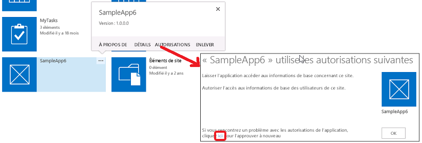

# Autorisations des compléments dans SharePoint 2013
Découvrez les autorisations de complément dans SharePoint, y compris les types d'autorisations de complément, les étendues de demande d'autorisation et la gestion des autorisations. Cet article décrit également les différences entre les droits liés aux autorisations de complément, les droits des utilisateurs et les droits des compléments de l'Office Store.
Avant de lire cet article, vous devez connaître le contenu de la rubrique  [Autorisation et authentification des compléments dans SharePoint](authorization-and-authentication-of-sharepoint-add-ins.md).
  
    
    


**Regardez une vidéo sur les autorisations de complément.**

  
    
    

  
    
    

  
    
    

  
    
    

  
    
    

## Vue d'ensemble des autorisations de complément dans SharePoint
<a name="Perm_intro"> </a>

Un Complément SharePoint demande à l'utilisateur qui l'installe les autorisations dont il a besoin au cours de l'installation. Le développeur d'un complément doit demander, par le biais du fichier manifeste du complément, les autorisations dont le complément spécifique a besoin pour pouvoir s'exécuter. (Les applications pour périphérique et les applications web qui accèdent à SharePoint, mais qui ne sont pas installées sur des sites web SharePoint, doivent obtenir des autorisations au moment de leur exécution de la part de l'utilisateur qui les exécute. Pour en savoir plus, voir  [Vue d'ensemble des compléments qui demandent des autorisations d'accès à SharePoint à la volée](authorization-code-oauth-flow-for-sharepoint-add-ins.md#Overview).) Les utilisateurs peuvent uniquement octroyer les autorisations dont ils disposent. L'utilisateur doit octroyer toutes les autorisations demandées par un complément ou n'octroyer aucune autorisation. L'utilisateur ne peut pas choisir les autorisations qu'il octroie. (Dans le cas des compléments demandant des autorisations à la volée, seul un utilisateur possédant des autorisations de gestion pour les ressources SharePoint auxquelles le complément veut accéder peut exécuter le complément, même si le complément ne demande que des autorisations de niveau inférieur, telles qu'une autorisation en lecture.)
  
    
    
Les autorisations qui sont octroyées au complément sont stockées dans la base de données de contenu de la batterie de serveurs SharePoint ou de la location SharePoint Online. Elles ne sont pas stockées dans un service de jeton sécurisé tel que Microsoft Azure Access Control Service (ACS). Lorsqu'un utilisateur octroie pour la première fois des autorisations à un complément, SharePoint obtient des informations sur le complément auprès du service ACS. SharePoint stocke ensuite les informations de base relatives au complément dans le service de gestion de complément et la base de données de contenu, avec les autorisations du complément. Pour en savoir plus sur le service ACS, voir  [Création de compléments pour SharePoint qui utilisent l'autorisation de faible niveau de fiabilité](creating-sharepoint-add-ins-that-use-low-trust-authorization.md).
  
    
    
Si un objet pour lequel un complément a reçu une autorisation est supprimé, les autorisations octroyées correspondantes sont également supprimées. Lorsqu'un objet pour lequel un complément a reçu une autorisation est recyclé, SharePoint ne modifie pas l'autorisation octroyée correspondante, car si l'objet est restauré à partir de la Corbeille, l'autorisation octroyée reste en vigueur.
  
    
    
Si un complément est supprimé, toutes les autorisations octroyées à ce complément au niveau de l'étendue d'où il a été supprimé sont révoquées. Cette procédure garantit que le complément ne peut pas utiliser ses informations d'identification pour continuer à accéder à distance aux ressources SharePoint protégées une fois qu'un utilisateur a supprimé le complément de SharePoint.
  
    
    

## Comprendre les types d'autorisations de complément et d'étendues d'autorisation
<a name="Perm_types"> </a>

Un Complément SharePoint utilise les demandes d'autorisation pour spécifier les autorisations dont il a besoin pour fonctionner correctement. Les demandes d'autorisation spécifient à la fois les droits dont un complément a besoin et l'étendue au niveau de laquelle il a besoin des droits. Les autorisations sont demandées dans le cadre du manifeste de complément.
  
    
    

> [!REMARQUE]
> Les étendues décrites dans cette section s'appliquent au contenu de liste et au contenu de bibliothèque uniquement. Pour des informations sur les étendues d'autres fonctionnalités, voir la section  [Comprendre les types d'autorisations de complément et d'étendues d'autorisation](#Perm_types) dans cet article.
  
    
    

Les étendues de demande d'autorisation indiquent l'emplacement dans la hiérarchie SharePoint auquel une demande d'autorisation s'applique.
  
    
    

> [!REMARQUE]
> Un Complément SharePoint dispose de sa propre identité et a un principal de sécurité, appelé principal de complément. À l'instar des utilisateurs et des groupes, un principal de complément dispose de certains droits et autorisations. Le principal de complément dispose de droits de contrôle complets pour le site web de complément de sorte qu'il a uniquement besoin de demander des autorisations à des ressources SharePoint dans le site web hôte ou d'autres emplacements en dehors du site web de complément. Pour plus d'informations sur le site web de complément, voir  [Aspects importants du contexte de développement et de l'architecture des compléments pour SharePoint](important-aspects-of-the-sharepoint-add-in-architecture-and-development-landscap.md) et [Héberger des sites web, des sites web de complément et des composants SharePoint dans SharePoint 2013](host-webs-add-in-webs-and-sharepoint-components-in-sharepoint-2013.md). 
  
    
    

SharePoint prend en charge quatre étendues d'autorisation distinctes au sein de la base de données de contenu et de la location, comme illustré dans le tableau 1. Les étendues d'autorisation sont nommées avec des URI comprenant un préfixe « http: », mais ce ne sont pas des URL et elles ne contiennent aucun espace réservé. Les étendues d'autorisation dans ce tableau et cet article sont des chaînes littérales.
  
    
    

**Tableau 1. Descriptions et URI des étendues de demande d'autorisation de complément SharePoint**

|||
|:-----|:-----|
|**URI d'étendue** <br/> |**Description** <br/> |
|location  <br/> http://sharepoint/content/tenant  <br/> |Location où le complément est installé. Inclut tous les enfants de cette étendue.  <br/> |
|collection de sites  <br/> http://sharepoint/content/sitecollection  <br/> |Collection de sites où le complément est installé. Inclut tous les enfants de cette étendue.  <br/> |
|site web  <br/> http://sharepoint/content/sitecollection/web  <br/> |Site web où le complément est installé. Inclut tous les enfants de cette étendue.  <br/> |
|liste  <br/> http://sharepoint/content/sitecollection/web/list  <br/> |Liste unique dans le site web où le complément est installé. Lorsque l'utilisateur qui installe le complément est invité à octroyer les autorisations, la boîte de dialogue lui permet de sélectionner une liste pour laquelle le complément bénéficie d'une autorisation. Si le complément a besoin d'autorisations pour plus d'une liste, il doit demander une autorisation pour l'étendue du site web. De plus, en tant que développeur, vous n'avez aucun moyen de contrôler la liste choisie par l'utilisateur ou de lui indiquer laquelle choisir ; ainsi, vous devez utiliser l'étendue du site web si votre complément  *doit*  recevoir une autorisation à une liste. (Il existe toutefois un moyen de restreindre le choix de l'utilisateur à certains sous-ensembles de listes. Reportez-vous à la section [Étendue de demande d'autorisation avec les propriétés associées](#AssociatedProperties) ci-dessous.) <br/> |
   
Si un complément reçoit une autorisation pour l'une des étendues, cette autorisation s'applique à tous les enfants de l'étendue. Par exemple, si un complément reçoit une autorisation pour un site web, le complément dispose également d'une autorisation pour chaque liste figurant dans le site web et tous les éléments de liste figurant dans chaque liste.
  
    
    
Étant donné que les demandes d'autorisation sont effectuées sans informations relatives à la topologie de la collection de sites où est installé le complément, l'étendue est exprimée en tant que type au lieu de l'URL d'une instance spécifique. Ces types d'étendues sont exprimés sous forme d'URI. Les autorisations d'accès aux ressources stockées dans la base de données de contenu SharePoint sont organisées sous l'URI suivante :  `http://sharepoint/content`.
  
    
    

## Présentation des différences entre les droits d'autorisations de complément et les droits des utilisateurs
<a name="Perm_diff"> </a>

Les autorisations indiquent les activités qu'un complément est autorisé à effectuer au sein de l'étendue demandée. SharePoint prend en charge quatre niveaux de droits dans la base de données de contenu. Pour chaque étendue, un complément peut avoir les droits suivants :
  
    
    

- Lecture
    
  
- Écriture
    
  
- Gestion
    
  
- Contrôle total
    
  

> [!REMARQUE]
> Pour plus d'informations sur ce qui est inclus dans les droits Lecture, Écriture, Gestion et Contrôle total, voir  [Planifier la gestion des autorisations de complément](http://technet.microsoft.com/fr-fr/library/jj219576%28office.15%29.aspx). 
  
    
    


> [!REMARQUE]
> Ces droits correspondent aux niveaux d'autorisation des utilisateurs par défaut de SharePoint : Lecteur, Collaborateur, Concepteur et Contrôle total. Pour plus d'informations sur les niveaux d'autorisation des utilisateurs, voir  [Autorisations utilisateur et niveaux d'autorisation](http://technet.microsoft.com/fr-fr/library/cc288074.aspx). > Les noms des droits de compléments ne correspondent pas aux noms des droits des rôles d'utilisateurs SharePoint, ceci afin d'éviter toute confusion entre les droits des rôles d'utilisateurs et les droits de compléments. Étant donné que la personnalisation des autorisations associées à des rôles d'utilisateurs SharePoint n'affecte pas les niveaux de demande d'autorisation de complément, les noms des droits de compléments ne correspondent pas aux rôles d'utilisateurs SharePoint correspondants, à l'exception de Contrôle total, qui ne peut pas être personnalisé par le biais de l'interface utilisateur de gestion des autorisations. 
  
    
    

En outre :
  
    
    

- Pour le complément de recherche uniquement, un complément peut disposer du droit Requête.
    
  
- Pour certaines étendues Microsoft Project Server 2013, il y a également le droit Soumission de l'état ou Élever. Pour la plupart des étendues pour Project Server 2013, seuls Lecture et Écriture sont disponibles. Pour plus d'informations, voir la section  [Comprendre les types d'autorisations de complément et d'étendues d'autorisation](#Perm_types) dans cet article.
    
  
- Pour la taxonomie, seuls Lecture et Écriture sont disponibles.
    
  

> [!REMARQUE]
> Les applications de l'Office Store présentent des restrictions par rapport aux types de droits pouvant être demandés par un complément. Pour plus d'informations, voir la section  [Comprendre les types d'autorisations de complément et d'étendues d'autorisation](#Perm_types) de cet article.
  
    
    

Contrairement aux rôles d'utilisateurs SharePoint, ces niveaux de droits ne sont pas personnalisables. Cela permet de garantir que lorsqu'un complément reçoit une demande d'autorisation, le complément est assuré de disposer d'un jeu prévisible de fonctionnalités et ne doit pas prendre en compte l'éventualité de recevoir moins d'autorisations que celles qu'il attend.
  
    
    
Un utilisateur ne peut pas octroyer d'autorisations dont il ne dispose pas lui-même à un complément. S'il tente d'installer un complément qui demande plus d'autorisations que lui n'en possède, un message d'erreur apparaît à l'écran et l'informe qu'il ne dispose pas des autorisations suffisantes pour accorder au complément les autorisations qu'il demande.
  
    
    
Les autorisations non connues de SharePoint sont ignorées. Cela signifie que, si un complément demande une autorisation que SharePoint ne reconnaît pas, le complément peut toujours être installé, mais l'utilisateur n'est pas invité à octroyer l'autorisation et l'autorisation n'est pas octroyée au complément.
  
    
    

## Découvrez les étendues et les autorisations disponibles, ainsi que les limites applicables aux autorisations d'applications de l'Office Store
<a name="Perm_rightlist"> </a>

Des étendues différentes présentent des jeux de droits différents pouvant être demandés par un complément. Cette section décrit les jeux de droits qui sont disponibles pour chaque étendue. En outre, elle met en évidence les limites applicables aux Compléments SharePoint qui sont en vente dans l'Office Store.
  
    
    

### Droits des applications de l'Office Store

Seuls les droits Lecture, Écriture et Gestion sont autorisés pour les applications de l'Office Store. Si vous essayez de soumettre à l'Office Store une application nécessitant des droits Contrôle total, la soumission de votre application est bloquée. Étant donné que le bloc se trouve dans le pipeline de soumission de l'Office Store, les applications qui nécessitent des autorisations supérieures à l'autorisation Gestion peuvent quand même être déployées via le catalogue de compléments.
  
    
    

### Étendues de demande d'autorisation pour le contenu de liste et le contenu de bibliothèque
<a name="PermissionsForLists"> </a>

Le Tableau 2 illustre l'étendue de demande d'autorisation pour le contenu de liste et de bibliothèque. Il indique également les droits pouvant être spécifiés pour chaque URI d'étendue.
  
    
    

> [!REMARQUE]
> Les URI utilisées dans le Tableau 2 sont des valeurs littérales. 
  
    
    


**Tableau 2. URI d'étendue d'autorisation de complément SharePoint et droits disponibles**

|||
|:-----|:-----|
|**URI d'étendue** <br/> |**Droits disponibles** <br/> |
|http://sharepoint/content/sitecollection  <br/> |Lecture, Écriture, Gestion, Contrôle total  <br/> |
|http://sharepoint/content/sitecollection/web  <br/> |Lecture, Écriture, Gestion, Contrôle total  <br/> |
|http://sharepoint/content/sitecollection/web/list  <br/> |Lecture, Écriture, Gestion, Contrôle total  <br/> |
|http://sharepoint/content/tenant  <br/> |Lecture, Écriture, Gestion, Contrôle total  <br/> |
   
Le code suivant illustre la façon d'utiliser les étendues d'autorisation et les droits dans le fichier AppManifest.xml file. Dans le premier exemple, un complément demande l'accès Écriture à l'étendue de liste.
  
    
    


```XML

<?xml version="1.0" encoding="utf-8" ?>
<App xmlns="http://schemas.microsoft.com/sharepoint/2012/app/manifest"
     ProductID="{4a07f3bd-803d-45f2-a710-b9e944c3396e}"
     Version="1.0.0.0"
     SharePointMinVersion="15.0.0.0"
     Name="MySampleAddIn"
>
  <Properties>
    <Title>My Sample Add-in</Title>
    <StartPage>~remoteAppUrl/Home.aspx?{StandardTokens}</StartPage>
  </Properties>

  <AppPrincipal>
    <RemoteWebApplication ClientId="1ee82b34-7c1b-471b-b27e-ff272accd564" />
  </AppPrincipal>

  <AppPermissionRequests>
    <AppPermissionRequest Scope="http://sharepoint/content/sitecollection/web/list" Right="Write"/>
  </AppPermissionRequests>
</App>
```

Le code suivant illustre un complément demandant l'accès Lecture à l'étendue du site web et l'accès Lecture à l'étendue de liste.
  
    
    


```XML

<?xml version="1.0" encoding="utf-8" ?>
<App xmlns="http://schemas.microsoft.com/sharepoint/2012/app/manifest"
     ProductID="{4a07f3bd-803d-45f2-a710-b9e944c3396e}"
     Version="1.0.0.0"
     SharePointMinVersion="15.0.0.0"
     Name="MySampleAddIn"
>
  <Properties>
    <Title>My Sample Add-in</Title>
    <StartPage>~remoteAppUrl/Home.aspx?{StandardTokens}</StartPage>
  </Properties>

  <AppPrincipal>
    <RemoteWebApplication ClientId="6daebfdd-6516-4506-a7a9-168862921986" />
  </AppPrincipal>

  <AppPermissionRequests>
    <AppPermissionRequest Scope="http://sharepoint/content/sitecollection/web" Right="Read"/>
    <AppPermissionRequest Scope="http://sharepoint/content/sitecollection/web/list" Right="Write"/>
  </AppPermissionRequests>
</App>
```


### Étendues de demande d'autorisation pour les autres fonctionnalités SharePoint
<a name="PermissionsForLists"> </a>

L'étendue de demande d'autorisation pour les autres fonctionnalités SharePoint figurent dans les tableaux ci-dessous. 
  
    
    

> [!REMARQUE]
> Les URI utilisées dans les tableaux sont des valeurs littérales. 
  
    
    

Le Tableau 3 illustre l'étendue de demande d'autorisation pour Business Connectivity Services (BCS). Il indique également les droits pouvant être spécifiés pour cette URI d'étendue.
  
    
    

**Tableau 3. URI d'étendue de demande d'autorisation du complément BCS et droits disponibles**

|||
|:-----|:-----|
|**URI d'étendue** <br/> |**Droits disponibles** <br/> |
|http://sharepoint/bcs/connection  <br/> |Lecture  <br/> |
   

> [!REMARQUE]
> Pour plus d'informations sur l'étendue de demande d'autorisation de complément BCS, voir  [Business Connectivity Services dans SharePoint 2013](http://msdn.microsoft.com/library/64b7d032-4b83-4e9e-bc08-f0a161af5457%28Office.15%29.aspx). 
  
    
    


  
    
    
Le Tableau 4 illustre l'étendue de demande d'autorisation pour l'application de recherche. Il indique également les droits pouvant être spécifiés pour cette URI d'étendue.
  
    
    

**Tableau 4. URI d'étendue de demande d'autorisation du complément de recherche et droits disponibles**

|||
|:-----|:-----|
|**URI d'étendue** <br/> |**Droits disponibles** <br/> |
|http://sharepoint/search  <br/> |QueryAsUserIgnoreAppPrincipal  <br/> |
   

> [!REMARQUE]
> Pour plus d'informations sur l'étendue de demande d'autorisation de complément de recherche, voir  [Recherche dans SharePoint 2013](http://msdn.microsoft.com/library/59220f81-0e5e-4945-8056-cf0a116446cb%28Office.15%29.aspx). 
  
    
    


  
    
    
Le Tableau 5 illustre l'étendue de demande d'autorisation pour Project Server 2013. Il indique également les droits pouvant être spécifiés pour chaque URI d'étendue.
  
    
    

> [!REMARQUE]
> Un complément qui utilise les fonctionnalités et les services de Project Server 2013 doit être testé dans un environnement disposant des fonctionnalités et services Project Server requis. L'assembly du fournisseur d'autorisations Project Server 2013 connaissant l'étendue d'autorisations Project Server 2013 n'est pas installé par défaut avec SharePoint Server. Pour plus d'informations, voir la documentation développeur de Project Server 2013. 
  
    
    


**Tableau 5. URI d'étendue de demande d'autorisation de complément Project Server et droits disponibles**

|||
|:-----|:-----|
|**Étendue** <br/> |**Droits disponibles** <br/> |
|http://sharepoint/projectserver  <br/> |Gestion  <br/> |
|http://sharepoint/projectserver/projects  <br/> |Lecture, Écriture  <br/> |
|http://sharepoint/projectserver/projects/project  <br/> |Lecture, Écriture  <br/> |
|http://sharepoint/projectserver/enterpriseresources  <br/> |Lecture, Écriture  <br/> |
|http://sharepoint/projectserver/statusing  <br/> |Soumission de l'état  <br/> |
|http://sharepoint/projectserver/reporting  <br/> |Lecture  <br/> |
|http://sharepoint/projectserver/workflow  <br/> |Élever  <br/> |
   

  
    
    
Le Tableau 6 illustre l'étendue de demande d'autorisation pour les fonctionnalités sociales. Il indique également les droits pouvant être spécifiés pour chaque URI d'étendue.
  
    
    

**Tableau 6. URI d'étendue de demande d'autorisation du complément des fonctionnalités sociales et droits disponibles**

|||
|:-----|:-----|
|**URI d'étendue** <br/> |**Droits disponibles** <br/> |
|http://sharepoint/social/tenant  <br/> |Lecture, Écriture, Gestion, Contrôle total  <br/> |
|http://sharepoint/social/core  <br/> |Lecture, Écriture, Gestion, Contrôle total  <br/> |
|http://sharepoint/social/microfeed  <br/> |Lecture, Écriture, Gestion, Contrôle total  <br/> |
   

> [!REMARQUE]
> Pour plus d'informations sur l'étendue de la demande d'autorisation de complément pour l'accès aux fonctionnalités sociales, consultez la rubrique relative aux  [demandes d'autorisation de complément concernant les fonctionnalités sociales](http://msdn.microsoft.com/library/8852ce36-8309-45a7-a141-2e10ac17a123%28Office.15%29.aspx#bkmk_AppPerms). 
  
    
    


  
    
    
Le Tableau 7 illustre l'étendue de demande d'autorisation pour l'application de taxonomie. Il indique également les droits pouvant être spécifiés pour cette URI d'étendue.
  
    
    

**Tableau 7. URI d'étendue de demande d'autorisation du complément de taxonomie et droits disponibles**

|||
|:-----|:-----|
|**URI d'étendue** <br/> |**Droits disponibles** <br/> |
|http://sharepoint/taxonomy  <br/> |Lecture, Écriture  <br/> |
   

> [!REMARQUE]
> Pour plus d'informations sur l'étendue de demande d'autorisation de complément de taxonomie, voir  [Ajout de fonctionnalités SharePoint 2013](http://msdn.microsoft.com/library/11ecb65e-6dc5-4cf1-80ca-3c16418697b6%28Office.15%29.aspx). 
  
    
    


### Étendue de demande d'autorisation avec les propriétés associées
<a name="AssociatedProperties"> </a>

L'étendue de demande d'autorisation de liste présente une propriété facultative supplémentaire. L'étendue de liste peut prendre une propriété portant le nom **BaseTemplateId** et une valeur d'entier correspondant à un modèle de base de liste, comme illustré dans l'exemple de balisage ci-dessous. Sans ID de modèle de base, l'utilisateur qui installe le complément peut lui octroyer une autorisation à *une liste*  parmi toutes celles disponibles sur le site web. La spécification d'un ID de modèle de base limite le choix de l'utilisateur au jeu de listes correspondant à ce qui est spécifié par la propriété **BaseTemplateId**.
  
    
    
La propriété **BaseTemplateId** est un élément enfant, et non un attribut de l'élément **AppPermissionRequest**. Le code suivant illustre l'utilisation de la propriété **BaseTemplateId**.
  
    
    


```XML

<AppPermissionRequest Scope="http://sharepoint/content/sitecollection/web/list" Right="Write">
  <Property Name="BaseTemplateId" Value="101"/>
</AppPermissionRequest>
```


**Tableau 7. Étendue de demande d'autorisation avec les propriétés associées**

||||
|:-----|:-----|:-----|
|**URI d'étendue** <br/> |**Propriété** <br/> |**Type** <br/> |
|http://sharepoint/content/sitecollection/web/list  <br/> |**BaseTemplateId** <br/> |Entier  <br/> > [!REMARQUE]> Pour plus d'informations sur **BaseTemplateId** et la valeur d'entier correspondante pour le modèle de base de liste, voir l'attribut **Type** de l' [List, élément (List)](http://msdn.microsoft.com/library/b2b26fee-eb45-48ac-99f1-65f725da293f%28Office.15%29.aspx).           |
   

## Gestion et résolution des problèmes relatifs aux autorisations de complément
<a name="Perm_manage"> </a>

Les Compléments SharePoint qui sont installés sur SharePoint obtiennent des autorisations au moment de leur installation. Les compléments qui sont installés sur d'autres plateformes, mais qui ont accès à SharePoint obtiennent des autorisations au moment de leur exécution par l'utilisateur qui exécute le complément. De temps en temps, le premier type de complément peut perdre ses autorisations. Les compléments peuvent retrouver leurs autorisations en suivant les étapes ci-après :
  
    
    

1. Sur la page **Contenu du site** du site web où le complément semble avoir perdu ses autorisations, cliquez sur le bouton **...** sur la vignette du complément. Cela va ouvrir une légende avec soit un lien intitulé **AUTORISATIONS**, soit un autre bouton **...**. 
    
  
2. Si le lien **AUTORISATIONS** est apparu, cliquez dessus et passez à l'étape suivante. Sinon, cliquez sur le bouton **…**
    
  
3. Cliquez sur le lien **Autorisations**.
    
  
4. Sur la page qui apparaît, cliquez sur le lien **ici** dans la dernière phrase. Cela réattribuera au complément ses autorisations et redirigera le navigateur vers la page **Contenu du site**.
    
  

  
    
    

  
    
    
Lorsque vous développez ou résolvez les problèmes d'un complément, vous souhaiterez peut-être modifier ou réattribuer les autorisations d'un complément qui a déjà été installé. Pour ce faire, suivez les étapes ci-après :
  
    
    

  
    
    

1. Accédez à  `http://<SharePointWebSite>/_layouts/15/AppInv.aspx`, où  _<SiteWebSharePoint>_ est l'URL du site web où le complément est installé. Veillez à ne pas ajouter de paramètre de requête à l'URL. Le formulaire dont vous avez besoin n'apparaît sur cette page que si l'URL est correcte.
    
  
2. Entrez l'ID du complément, aussi appelé ID client, dans la zone **ID du complément** et cliquez sur **Recherche**. Les autres zones du formulaire sont ensuite renseignées avec des informations sur le complément.
    
  
3. Remplissez la zone **Code XML de la demande d'autorisation** avec les mêmes demandes d'autorisation que vous entreriez dans un manifeste de complément. Pour obtenir des exemples, voir la rubrique [Étendues de demande d'autorisation pour le contenu de liste et le contenu de bibliothèque](#PermissionsForLists) ci-dessus. Pour obtenir toutes les informations sur la syntaxe, voir la page [Élément AppPermissionRequest](http://msdn.microsoft.com/library/4ad90fb0-33b2-aee5-69c2-5b97ca5334f8%28Office.15%29.aspx).
    
  
4. Cliquez sur **Créer**. 
    
  
Les autorisations d'un complément pour une étendue spécifique sont révoquées lorsqu'il est supprimé de cette étendue.
  
    
    

## Découvrez pourquoi les compléments ne peuvent pas être masqués pour les utilisateurs
<a name="CannotBeHidden"> </a>

Tout utilisateur disposant des droits de navigation sur un site web SharePoint peut lancer un Complément SharePoint installé sur le site. Son utilisation du complément dépendra des autres autorisations dont dispose l'utilisateur et du  [type de stratégie d'autorisation](add-in-authorization-policy-types-in-sharepoint-2013.md) utilisé par le complément. Si l'utilisateur essaie d'effectuer une action qu'il n'est pas autorisé à faire sur le complément et si l'appel à SharePoint utilise la stratégie utilisateur + complément, l'appel échouera.
  
    
    

## Ressources supplémentaires
<a name="Filename_AdditionalResources"> </a>


-  [Autorisation et authentification des compléments dans SharePoint](authorization-and-authentication-of-sharepoint-add-ins.md)
    
  
-  [Compléments](sharepoint-add-ins.md)
    
  
-  [Configurer un environnement de développement local pour les compléments pour SharePoint](set-up-an-on-premises-development-environment-for-sharepoint-add-ins.md)
    
  
-  [Commencer à créer des compléments hébergés par un fournisseur pour SharePoint](get-started-creating-provider-hosted-sharepoint-add-ins.md)
    
  
-  [Commencer à créer des compléments SharePoint hébergés par SharePoint](get-started-creating-sharepoint-hosted-sharepoint-add-ins.md)
    
  
