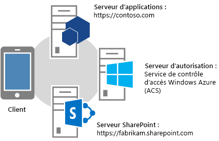
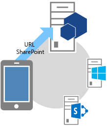
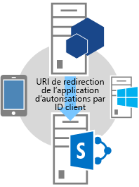
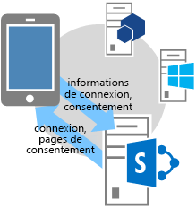
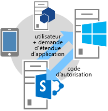
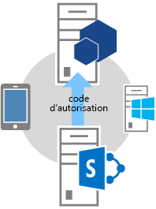
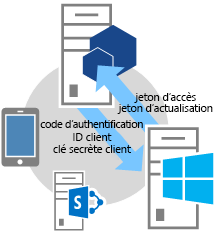
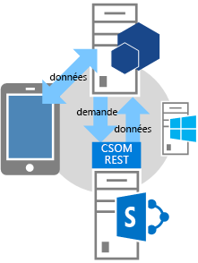

# Flux OAuth de code d'authentification pour les compléments SharePoint
Découvrez le flux OAuth pour les compléments qui demandent des autorisations d'accès aux ressources SharePoint à la volée et comment utiliser la page OAuthAuthorize.aspx et l'URI de redirection SharePoint.
## Vue d'ensemble des compléments qui demandent des autorisations d'accès à SharePoint à la volée
<a name="Overview"> </a>


> **REMARQUE**
> Cet article suppose que vous connaissez déjà la  [Création de compléments pour SharePoint qui utilisent l'autorisation de faible niveau de fiabilité](creating-sharepoint-add-ins-that-use-low-trust-authorization.md) et les concepts et principes sur lesquels se fonde OAuth. Pour plus d'informations sur OAuth, voir [OAuth.net](http://oauth.net/) et [Protocole d'autorisation web (oauth)](http://datatracker.ietf.org/doc/active/#oauth). 


Dans certains scénarios, un complément peut demander l'autorisation d'accéder aux ressources SharePoint à la volée. En d'autres termes, un **complément peut demander l'autorisation d'accéder à des ressources SharePoint dynamiquement au moment de son exécution**, plutôt qu'au moment de son installation. Il n'est pas nécessaire que ce type de complément soit lancé à partir de SharePoint ni même installé sur SharePoint. Par exemple, il peut s'agir d'un complément natif pour périphérique, d'un complément lancé depuis un site web ou d'un Complément Office lancé depuis une application Office qui souhaite accéder à des ressources sur SharePoint à la volée.


> **REMARQUE**
> Ce type de complément ne peut être exécuté que par les utilisateurs disposant des autorisations de gestion sur les ressources auxquelles le complément veut accéder. Par exemple, si un complément demande seulement une autorisation en lecture pour un site web, un utilisateur doté de droits d'accès en lecture, mais pas en gestion, sur le site web ne peut pas exécuter le complément. 


Pour pouvoir appeler SharePoint, ce type de **complément doit préalablement être inscrit** par le biais du service Mon tableau de bord vendeur ou de la page appregnew.aspx. Pour plus d'informations sur l'inscription des compléments via le service Mon tableau de bord vendeur ou le fichier appregnew.aspx, voir [Enregistrer des compléments dans SharePoint 2013](register-sharepoint-add-ins-2013.md).


Une fois que vous avez inscrit votre complément, celui-ci devient  *principal de sécurité*  et possède une identité, comme les utilisateurs et les groupes. Cette identité est appeléeprincipal de complément. À l'instar des utilisateurs et des groupes, un principal de complément dispose de certaines autorisations. Pour en savoir plus sur les principaux de complément, voir  [Enregistrer des compléments dans SharePoint 2013](register-sharepoint-add-ins-2013.md).


Lorsque vous inscrivez le complément, vous obtenez un ID client, une clé secrète client, un domaine de complément et un URI de redirection pour le principal de complément. Ces informations sont inscrites auprès du serveur d'autorisation, Microsoft Azure Access Control Service (ACS).


## Comprendre le flux OAuth pour les compléments qui demandent des autorisations à la volée
<a name="Flow"> </a>

Cette section résume le flux d'authentification et d'autorisation OAuth pour un complément SharePoint demandant des autorisations à la volée. Le flux est appelé **flux de code d'authentification**. La séquence décrit la manière dont un complément qui n'est pas lancé à partir de SharePoint peut accéder à des ressources dans SharePoint.


> **REMARQUE**
> Le flux **implique une série d'interactions entre votre complément, SharePoint, le serveur d'autorisation (à savoir ACS) et l'utilisateur final** lors de l'exécution. Ainsi, le flux a besoin de SharePoint Online ou d'une batterie de serveurs SharePoint connectée à Internet afin de pouvoir communiquer avec le service ACS. Les batteries SharePoint qui ne sont pas connectées à Internet doivent utiliser [le système d'autorisation à haut niveau de fiabilité](creating-sharepoint-add-ins-that-use-high-trust-authorization.md). 


Il doit exister une application ou un service web hébergé séparément de SharePoint. Même si le complément est un complément pour périphérique, il doit contenir une URL d'application ou de service web pouvant être inscrite auprès du service ACS (voir ci-dessus), même si le composant web n'est utilisé pour rien d'autre. Par souci de simplicité, cet article présuppose que le complément est une application web appelée Contoso.com. Elle utilise le modèle objet client (CSOM) SharePoint ou les API REST SharePoint pour appeler SharePoint. Lorsque l'application tente d'accéder pour la première fois à SharePoint, SharePoint demande un code d'autorisation au service ACS pour l'envoyer à l'application Contoso.com. L'application utilise ensuite le code d'autorisation pour demander un jeton d'accès au service ACS. Une fois qu'elle détient le jeton d'accès, l'application Contoso.com l'inclut dans toutes ses demandes à SharePoint.


### Exemple détaillé du flux
<a name="Fly"> </a>

Supposons que Contoso offre un service d'impression de photos en ligne. Un utilisateur souhaite imprimer des photos. Il souhaite permettre à un service d'impression de photos Contoso d'accéder à un ensemble de bibliothèques de photos et d'imprimer des photos à partir de celles-ci. L'utilisateur gère ces bibliothèques de photos sur un site SharePoint Online,  `fabrikam.sharepoint.com`.





Le complément d'impression de photos est inscrit et possède donc un ID client, une clé secrète client et un URI de redirection. L'URI de redirection que Contoso a fourni pendant l'inscription du complément est  `https://contoso.com/RedirectAccept.aspx`. L'ID client et la clé secrète client sont stockés dans le fichier web.config du complément d'impression de photos. Voici un exemple de la manière dont l'ID client et la clé secrète client sont entrés dans le fichier web.config :



```XML

<configuration>
  <appSettings>
    <add key="ClientId" value="c78d058c-7f82-44ca-a077-fba855e14d38 "/>
    <add key="ClientSecret" value="SbALAKghPXTjbBiLQZP+GnbmN+vrgeCMMvptbgk7T6w= "/>

  </appSettings>

</configuration>
```

Voici les étapes du flux de code d'authentification.


> **CONSEIL**
> Ces étapes font référence à des méthodes figurant dans le fichier TokenHelper.cs (ou .vb). Ce code managé n'est pas compilé, il n'existe donc aucune rubrique de référence relative à celui-ci. Cependant, le fichier est entièrement commenté et comporte des descriptions de chaque classe, paramètre de membre et valeur renvoyée. Pensez à laisser une copie de ce fichier ouverte pour pouvoir vous y référer à mesure que vous parcourez ces étapes. 


||||
|:-----|:-----|:-----|
|**1** <br/> ||**Le client ouvre une application, puis la dirige vers un site SharePoint pour les données.** <br/> Un utilisateur accède au site web d'impression de photos Contoso, où l'interface utilisateur indique que l'utilisateur peut imprimer les photos conservées sur n'importe quel site SharePoint Online. Dans cet exemple, l'URL est  `https://contoso.com/print/home.aspx`.  <br/> Le complément d'impression de photos demande à l'utilisateur d'entrer l'URL de la collection de photos. L'utilisateur entre une URL pointant vers le site SharePoint Online :  `https://fabrikam.sharepoint.com/`.  <br/> |
|**2** <br/> ||**Le complément est redirigé vers l'URL d'autorisation du site SharePoint.** <br/> Lorsque l'utilisateur clique sur le bouton permettant de récupérer les photos, le complément d'impression de photos Contoso redirige le navigateur sur  `https://fabrikam.sharepoint.com/`. Cette redirection est une réponse de redirection HTTP 302.  <br/> Si vous utilisez Microsoft .NET, **Response.Redirect** constitue l'une des façons d'effectuer une redirection depuis votre code. À l'aide du fichier TokenHelper.cs (ou .vb) dans votre projet, votre code peut appeler la méthode **GetAuthorizationUrl** surchargée (en utilisant la surcharge avec trois arguments). Cette méthode crée l'URL de redirection OAuthAuthorize.aspx à votre place. Sinon, votre code peut également créer l'URL manuellement. <br/> Par exemple, si vous choisissez d'appeler la méthode **GetAuthorizationUrl** pour qu'elle construise l'URL de redirection OAuthAuthorize.aspx automatiquement et que vous utilisez le fichier TokenHelper.cs (ou .vb) dans votre projet, le code est le suivant : <br/>  `Response.Redirect(TokenHelper.GetAuthorizationUrl(`           `sharePointSiteUrl.ToString(),`           `"Web.Read List.Write",`           `"https://contoso.com/RedirectAccept.aspx"));` <br/> Si vous jetez un œil à la surcharge à trois paramètres de la méthode **GetAuthorizationUrl** dans TokenHelper.cs (ou .vb), vous pouvez constater que le deuxième paramètre est un paramètre d'étendue d'autorisation, c'est-à-dire une liste d'autorisations délimitées par des espaces que le complément demande au format abrégé. Pour plus d'informations sur les étendues des autorisations, voir [Comprendre les alias d'étendue d'autorisation et utiliser la page OAuthAuthorize.aspx](#Scope). Le troisième paramètre doit correspondre au même URI de redirection que celui qui a été utilisé lors de l'inscription du complément. Pour obtenir plus d'informations sur l'inscription, voir  [Enregistrer des compléments dans SharePoint 2013](register-sharepoint-add-ins-2013.md). Vous constatez également que la chaîne renvoyée est une URL comprenant des paramètres de chaîne de requête.  <br/> Si vous préférez, vous pouvez construire manuellement l'URL de redirection OAuthAuthorize.aspx. Par exemple, l'URL vers laquelle le complément d'impression de photos Contoso redirige l'utilisateur dans ce cas est :  <br/>  `https://fabrikam.sharepoint.com/_layouts/15/OAuthAuthorize.aspx?client_id=client_GUID&amp;scope=app_permissions_list&amp;response_type=code&amp;redirect_uri=redirect_uri` <br/> Le complément d'impression de photos Contoso envoie l'ID client et l'URI de redirection OAuth au site Fabrikam sous forme de paramètres de chaîne de requête. Vous trouverez ci-dessous un exemple de demande GET illustré avec des exemples de valeurs de chaîne de requête. Pour plus de clarté, des sauts de ligne ont été ajoutés. L'URL cible réelle est composée d'une seule ligne.  <br/>  `GET /authcode HTTP/1.1`           `Host: fabrikam.sharepoint.com`                     `/oauthauthorize.aspx`           `?client_id= c78d058c-7f82-44ca-a077-fba855e14d38`           `&amp;scope=list.read`           `&amp;response_type=code`           `&amp;redirect_uri= https%3A%2F%2Fcontoso%2Ecom%2Fredirectaccept.aspx`           <br/> Si vous souhaitez une fenêtre contextuelle de consentement distincte, vous pouvez ajouter le paramètre de requête **IsDlg=1** à la création de l'URL, comme indiqué ci-dessous : <br/>  `/oauthauthorize.aspx?IsDlg=1&amp;client_id= c78d058c-7f82-44ca-a077-fba855e14d38&amp;scope=list.read&amp;response_type=code&amp;redirect_uri= https%3A%2F%2Fcontoso%2Ecom%2Fredirectaccept.aspx` <br/> |
|**3** <br/> ||**SharePoint affiche la page de consentement afin que l'utilisateur puisse accorder les autorisations au complément.** <br/> Si l'utilisateur ne s'est pas déjà connecté au site SharePoint Online Fabrikam, il est invité à le faire. S'il est déjà connecté, SharePoint affiche une page de consentement HTML.  <br/> Sur la page de consentement, l'utilisateur est invité à accorder ou à refuser au complément d'impression de photos Contoso les autorisations demandées par celui-ci. Dans ce cas, l'utilisateur accorde au complément un accès en lecture à sa bibliothèque d'images sur Fabrikam.  <br/> |
|**4** <br/> ||**SharePoint demande un code d'autorisation à durée de vie limitée à ACS.** <br/> Le site SharePoint Online Fabrikam demande au service ACS de créer un code d'autorisation à durée limitée (environ 5 minutes) unique pour cette combinaison utilisateur/complément.  <br/> Le service ACS envoie le code d'autorisation au site Fabrikam.  <br/> |
|**5** <br/> ||**Le site SharePoint Online est redirigé vers l'URI de redirection inscrit de l'application, en transmettant le code d'autorisation au complément.** <br/> Le site SharePoint Online Fabrikam redirige le navigateur vers Contoso via la réponse HTTP 302. L'URL pour cette redirection utilise l'URI de redirection spécifié au moment de l'inscription du complément d'impression de photos. Elle comprend également le code d'autorisation sous la forme d'une chaîne de requête. L'URL de redirection est structurée comme suit :  <br/>  `https://contoso.com/RedirectAccept.aspx?code=<authcode>` <br/> |
|**6** <br/> ||**Le complément utilise le code d'autorisation pour demander un jeton d'accès au service ACS. Ce dernier valide la demande, invalide le code d'autorisation, puis envoie les jetons d'accès et d'actualisation au complément.** <br/> Contoso récupère le code d'autorisation du paramètre de requête, puis l'inclut avec l'ID client et la clé secrète client dans une demande de jeton d'accès envoyée à ACS.  <br/> Si vous utilisez du code managé et le CSOM SharePoint, le fichier TokenHelper.cs (ou .vb), la méthode qui effectue la demande à ACS est **GetClientContextWithAuthorizationCode**. Dans ce cas, le code se présente comme suit (où  `authCode` est une variable à laquelle le code d'autorisation a été affecté) : <br/>  `TokenHelper.GetClientContextWithAuthorizationCode(`           `"https://fabrikam.sharepoint.com/",`           `"00000003-0000-0ff1-ce00-000000000000",`           `authCode,`           `"1ee82b34-7c1b-471b-b27e-ff272accd564",`           `new Uri(Request.Url.GetLeftPart(UriPartial.Path)));`           <br/> Si vous jetez un œil au fichier TokenHelper.cs (ou .vb), le deuxième paramètre de la méthode **GetClientContextWithAuthorizationCode** est `targetPrincipalName`. Cette valeur est constante et est toujours «  `00000003-0000-0ff1-ce00-000000000000` » dans un complément qui accède à SharePoint. Vous pouvez également constater, si vous effectuez un suivi de la hiérarchie des appels à partir de **GetClientContextWithAuthorizationCode**, que l'ID client et la clé secrète sont obtenus dans le fichier web.config.  <br/> Le service ACS reçoit la demande de Contoso et valide l'ID client, la clé secrète client, l'URI de redirection et le code d'autorisation. Si toutes ces informations sont valides, le service ACS invalide le code d'autorisation (qui n'est utilisable qu'une seule fois) et crée un jeton d'actualisation et un jeton d'accès qu'il renvoie à Contoso.  <br/> L'application Contoso peut mettre en cache ce jeton d'accès à des fins de réutilisation pour des demandes ultérieures. Par défaut, les jetons d'accès sont valides pendant environ 12 heures. Chaque jeton d'accès est propre au compte d'utilisateur qui est spécifié dans la demande d'autorisation initiale et fournit un accès uniquement aux services qui sont spécifiés dans cette demande. Votre complément doit stocker le jeton d'accès de façon sécurisée.  <br/> L'application Contoso peut également mettre en cache le jeton d'actualisation. Par défaut, les jetons d'actualisation sont valides pendant 6 mois. Le jeton d'actualisation peut être échangé contre un nouveau jeton d'accès provenant du service ACS en cas d'expiration du jeton d'accès. Pour en savoir plus sur les jetons, voir  [Gestion des jetons de sécurité dans les compléments SharePoint à faible niveau de fiabilité hébergés par le fournisseur](handle-security-tokens-in-provider-hosted-low-trust-sharepoint-add-ins.md).  <br/> |
|**7** <br/> ||**Le complément peut désormais utiliser le jeton d'accès pour demander des données au site SharePoint afin de les afficher ensuite pour l'utilisateur.** <br/> Contoso contient le jeton d'accès nécessaire pour envoyer un appel d'API REST ou une demande CSOM à SharePoint, en insérant le jeton d'accès OAuth dans l'en-tête HTTP **Authorization**.  <br/> SharePoint renvoie les informations demandées par Contoso. Pour en savoir plus sur cette demande, voir  [Gestion des jetons de sécurité dans les compléments SharePoint à faible niveau de fiabilité hébergés par le fournisseur](handle-security-tokens-in-provider-hosted-low-trust-sharepoint-add-ins.md).  <br/> |
 

## Comprendre les alias d'étendue d'autorisation et utiliser la page OAuthAuthorize.aspx
<a name="Scope"> </a>

Pour utiliser cette section, vous devez connaître l'article  [Autorisations des compléments dans SharePoint 2013](add-in-permissions-in-sharepoint-2013.md). Le tableau 1 présente les URI d'étendue de demande d'autorisation de complément indiqués dans cet article, à la différence qu'il comporte une colonne supplémentaire ( **Alias d'étendue** ) et que le droit Contrôle total n'est pas disponible dans la colonne **Droits disponibles**, car un complément qui demande l'autorisation d'accéder à des ressources SharePoint à la volée ne peut pas demander le droit Contrôle total.


Les valeurs figurant dans la colonne **Alias d'étendue** sont des versions abrégées des valeurs correspondantes indiquées dans la colonne **URI d'étendue**. Les alias peuvent uniquement être utilisés par les compléments qui demandent l'autorisation d'accéder à des ressources SharePoint à la volée. (Les valeurs d'URI d'étendue sont utilisées dans le manifeste des compléments lancés à partir de SharePoint. Ces compléments demandent les autorisations au cours de leur installation).


Les alias d'étendue n'interviennent que dans le contexte d'utilisation de la page de redirection OAuthAuthorize.aspx. Comme le montre l'étape 2 du flux OAuth décrit dans la section précédente, lorsque le complément utilise du code géré, les alias sont utilisés lorsque vous appelez la méthode **GetAuthorizationUrl** de TokenHelper.cs (ou .vb) dans votre projet. Voici un autre exemple :



```cs

Response.Redirect(TokenHelper.GetAuthorizationUrl(
    sharePointSiteUrl.ToString(), 
    "Web.Read List.Write ", 
    "https://contoso.com/RedirectAccept.aspx "));
```

La valeur du paramètre  _scope_,  `Web.Read List.Write`, est un exemple de demande d'autorisation à l'aide des alias d'étendue. Le paramètre  _scope_ est un ensemble délimité par des espaces de demandes d'étendue d'autorisation et de droits.


Si vous n'utilisez pas de code géré, les alias d'étendue sont utilisés dans le champ d'étendue de l'URL de redirection. Par exemple :


 `https://fabrikam.sharepoint.com/_layout/15/OAuthAuthorize.aspx?client_id=c78d058c-7f82-44ca-a077-fba855e14d38&amp;scope=list.write&amp;response_type=code&amp;redirect_uri=https%3A%2F%2Fcontoso%2Ecom%2Fredirectaccept.aspx`


> **REMARQUE**
> Pour obtenir une description des étendues, voir  [Autorisations des compléments dans SharePoint 2013](add-in-permissions-in-sharepoint-2013.md). 


**Tableau 1. URI d'étendue de demande d'autorisation de complément SharePoint et alias d'étendue correspondants**

||||
|:-----|:-----|:-----|
|**URI d'étendue** <br/> |**Alias d'étendue** <br/> |**Droits disponibles** <br/> |
|http://sharepoint/content/sitecollection  <br/> |Site  <br/> |Lecture, Écriture, Gérer  <br/> |
|http://sharepoint/content/sitecollection/web  <br/> |Web  <br/> |Lecture, Écriture, Gérer  <br/> |
|http://sharepoint/content/sitecollection/web/list  <br/> |List  <br/> |Lecture, Écriture, Gérer  <br/> |
|http://sharepoint/content/tenant  <br/> |AllSites  <br/> |Lecture, Écriture, Gérer  <br/> |
|http://sharepoint/bcs/connection  <br/> |Aucun (non pris en charge actuellement)  <br/> |Lecture  <br/> |
|http://sharepoint/search  <br/> |Search  <br/> |QueryAsUserIgnoreAppPrincipal  <br/> |
|http://sharepoint/projectserver  <br/> |ProjectAdmin  <br/> |Gérer  <br/> |
|http://sharepoint/projectserver/projects  <br/> |Projects  <br/> |Lecture, Écriture  <br/> |
|http://sharepoint/projectserver/projects/project  <br/> |Project  <br/> |Lecture, Écriture  <br/> |
|http://sharepoint/projectserver/enterpriseresources  <br/> |ProjectResources  <br/> |Lecture, Écriture  <br/> |
|http://sharepoint/projectserver/statusing  <br/> |ProjectStatusing  <br/> |Soumission de l'état  <br/> |
|http://sharepoint/projectserver/reporting  <br/> |ProjectReporting  <br/> |Lecture  <br/> |
|http://sharepoint/projectserver/workflow  <br/> |ProjectWorkflow  <br/> |Élever  <br/> |
|http://sharepoint/social/tenant  <br/> |AllProfiles  <br/> |Lecture, Écriture, Gérer  <br/> |
|http://sharepoint/social/core  <br/> |Social  <br/> |Lecture, Écriture, Gérer  <br/> |
|http://sharepoint/social/microfeed  <br/> |Microfeed  <br/> |Lecture, Écriture, Gérer  <br/> |
|http://sharepoint/taxonomy  <br/> |TermStore  <br/> |Lecture, Écriture  <br/> |
 

## Apprendre à utiliser un URI de redirection et obtenir un exemple de page de redirection
<a name="RedirectURI"> </a>


L' **URI de redirection** utilisé par les compléments qui demandent des autorisations à la volée **est l'URI vers lequel SharePoint redirige le navigateur une fois l'autorisation accordée** (avec le code d'autorisation inclus en tant que paramètre de requête). L'étape 2 de la description de flux ci-dessus fournit un exemple dans lequel l'URI est codé en dur dans un appel à la méthode **GetAuthorizationUrl**. Sinon, un complément ASP.NET peut également stocker l'URI de redirection dans le fichier web.config comme indiqué dans cet exemple :



```XML

<configuration>
  <appSettings>
    <add key="RedirectUri" value="https://contoso.com/RedirectAccept.aspx" />
  </appSettings>
<configuration>
```

La valeur peut être récupérée à l'aide d'un appel à  `WebConfigurationManager.AppSettings.Get("RedirectUri")`.


Le **point de terminaison de l'URI de redirection obtient le code d'autorisation à l'aide du paramètre de requête et l'utilise pour récupérer un jeton d'accès**, lequel peut ensuite être utilisé pour accéder à SharePoint. Généralement, le point de terminaison est la page, la méthode de contrôleur ou la méthode web qui a initialement tenté d'accéder à SharePoint. Toutefois, il peut s'agir d'une page ou d'une méthode qui reçoit seulement le jeton d'autorisation, puis qui est redirigée vers une autre page ou méthode. La page ou la méthode spéciale peut transmettre le jeton d'autorisation ou le mettre en cache. (Elle a une durée de vie d'environ 5 minutes). Elle peut également utiliser le jeton d'autorisation pour obtenir un jeton d'accès qu'elle met en cache.


Un exemple du code-behind d'une page de ce type dans une application ASP.NET est présenté ci-après. Voici quelques informations concernant ce code :


- Il utilise le fichier TokenHelper.cs qui est généré par les Outils de développement Office pour Visual Studio.


- Le code part du principe qu'il existe un paramètre de requête « code » qui contient un code d'autorisation. Cette méthode est sécurisée, car la page est appelée uniquement par SharePoint et seulement lors de la transmission d'un code d'autorisation.


- Il utilise l'objet de contexte client CSOM pour accéder à SharePoint, mais aurait simplement pu avoir mis l'objet en cache sur le serveur et l'avoir redirigé vers une autre page.


- La méthode **GetClientContextWithAuthorizationCode** utilise le code d'autorisation pour obtenir un code d'accès. Elle crée ensuite un objet de contexte client SharePoint et modifie le gestionnaire de cet objet pour l'événement **ExecutingWebRequest**, de manière à ce que le gestionnaire intègre le jeton d'accès dans toutes les demandes adressées à SharePoint. Le jeton d'accès est, en fait, mis en cache dans l'objet.


- La méthode **GetClientContextWithAuthorizationCode** renvoie l'URL de redirection à ACS dans le paramètre `rUrl`, mais le service ACS l'utilise comme une forme d'identification en cas de vol du code d'autorisation. Le service ACS ne l'utilise pas pour effectuer une autre redirection, de manière à ce qu'il n'exécute pas une boucle sans fin le redirigeant sur lui-même.


- Le code ne prévoit aucune mesure pour gérer un jeton d'accès expiré. Une fois que l'objet de contexte client a été créé, il utilise continuellement le même jeton d'accès et ne fait pas du tout appel au jeton d'actualisation. Cette stratégie est appropriée pour les compléments utilisés uniquement lors de sessions qui durent moins longtemps que la durée de vie du jeton d'accès.


Pour obtenir un exemple plus complexe de l'utilisation du jeton d'actualisation pour récupérer un nouveau jeton d'accès, voir la section suivante.



```cs

public partial class RedirectAccept : System.Web.UI.Page
{
    protected void Page_Load(object sender, EventArgs e)
    {
        string authCode = Request.QueryString["code"];
        Uri rUri = new Uri("https://contoso.com/RedirectAccept.aspx");

        using (ClientContext context = TokenHelper.GetClientContextWithAuthorizationCode(
            "https://fabrikam.sharepoint.com/", 
            "00000003-0000-0ff1-ce00-000000000000",
            authCode,
            "1ee82b34-7c1b-471b-b27e-ff272accd564".
            rUri))
       {
           context.Load(context.Web);
           context.ExecuteQuery();

           Response.Write("<p>" + context.Web.Title + "</p>");
       }
    }
}

```


## Obtenir un exemple de code-behind d'une page accédant à SharePoint
<a name="Default"> </a>

Le code-behind d'une page Default.aspx est présenté ci-dessous. Cette page présuppose un scénario dans lequel la page Default est à la fois la page de démarrage du complément et l'URL de redirection inscrite pour le complément. Voici quelques informations concernant ce code :


- La méthode **Page_Load** recherche tout d'abord un code d'autorisation dans la chaîne de requête. Si le navigateur a été redirigé vers la page par SharePoint, un code d'autorisation existe. Le cas échéant, le code l'utilise pour obtenir un nouveau jeton d'actualisation, qu'il place dans un cache durable, qui persiste entre les sessions.


- La méthode recherche ensuite un jeton d'actualisation dans le cache. 

  - Si elle n'en trouve aucun, elle en obtient un en indiquant à SharePoint les autorisations dont elle a besoin (autorisation en écriture pour l'étendue web) et en demandant un code d'autorisation à SharePoint. L'utilisateur est invité à octroyer l'autorisation. S'il l'octroie, SharePoint reçoit le code d'autorisation de la part d'ACS et le renvoie en tant que paramètre de requête dans une redirection vers cette même page.


  - S'il existe un jeton d'actualisation en cache, la méthode l'utilise pour obtenir directement un jeton d'accès auprès du service ACS. Comme dans l'exemple fourni à la fin de la section précédente de cet article, le jeton d'accès permet de créer un objet de contexte client SharePoint. L'utilisation d'un jeton d'actualisation en cache pour obtenir directement un jeton d'accès de l'ACS permet d'éviter un appel réseau supplémentaire à SharePoint au démarrage de session, et permet aux utilisateurs qui relancent le complément au cours de la durée de vie du cache de jeton d'actualisation de démarrer plus rapidement.


- De même que dans l'exemple à la fin de la section précédente, ce code ne prévoit aucune mesure pour gérer un jeton d'accès expiré. Une fois l'objet de contexte client créé, il continue à utiliser le même jeton d'accès. Pour vous protéger contre l'expiration d'un jeton d'accès, vous pouvez le mettre en cache avec le jeton d'actualisation. Vous pouvez ensuite modifier le code ci-dessous pour qu'il appelle uniquement la méthode **GetAccessToken** s'il n'y a aucun jeton d'accès non expiré dans le cache. Cependant, alors qu'il est acceptable de mettre en cache le jeton d'actualisation sur le client, dans un cookie, par exemple, le jeton d'accès doit être placé dans un cache côté serveur uniquement, à des fins de sécurité. En effet, le jeton d'actualisation est chiffré et ne peut être déchiffré que par le service ACS. Le jeton d'accès est simplement encodé en base 64 et peut facilement être décodé dans le cadre d'une attaque de l'intercepteur (man-in-the-middle).


- La classe **TokenCache** indiquée dans ce code est définie ci-dessous.



```cs

using System;
using System.Collections.Generic;
using System.Linq;
using System.Web;
using System.Web.UI;
using System.Web.UI.WebControls;
using Microsoft.SharePoint.Samples;
using Microsoft.SharePoint.Client;

namespace DynamicAppPermissionRequest
{
    public partial class Default : System.Web.UI.Page
    {
        protected void Page_Load(object sender, EventArgs e)
        {
            Uri sharePointSiteUrl = new Uri("https://fabrikam.sharpoint.com/print/");

            if (Request.QueryString["code"] != null)
            {
                TokenCache.UpdateCacheWithCode(Request, Response, sharePointSiteUrl);
            }

            if (!TokenCache.IsTokenInCache(Request.Cookies))
            {
                Response.Redirect(TokenHelper.GetAuthorizationUrl(sharePointSiteUrl.ToString(), 
                                                                  "Web.Write"));
            }
            else
            {
                string refreshToken = TokenCache.GetCachedRefreshToken(Request.Cookies);
                string accessToken = 
                TokenHelper.GetAccessToken(
                           refreshToken, 
                           "00000003-0000-0ff1-ce00-000000000000", 
                           sharePointSiteUrl.Authority, 
                           TokenHelper.GetRealmFromTargetUrl(sharePointSiteUrl)).AccessToken;

                using (ClientContext context = 
                       TokenHelper.GetClientContextWithAccessToken(sharePointSiteUrl.ToString(), 
                                                                   accessToken))
                {
                    context.Load(context.Web);
                    context.ExecuteQuery();

                    Response.Write("<p>" + context.Web.Title + "</p>");
                }
            }
        }
    }
}
```

Voici un exemple de code pour un module de cache de jeton appelé par l'exemple de code précédent. Il utilise les cookies en guise de cache. Il existe d'autres options de mise en cache. Pour en savoir plus, voir  [Gestion des jetons de sécurité dans les compléments SharePoint à faible niveau de fiabilité hébergés par le fournisseur](handle-security-tokens-in-provider-hosted-low-trust-sharepoint-add-ins.md).



```cs

using System;
using System.Collections.Generic;
using System.Linq;
using System.Web;
using Microsoft.SharePoint.Samples;

namespace DynamicAppPermissionRequest
{
    public static class TokenCache
    {
        private const string REFRESH_TOKEN_COOKIE_NAME = "RefreshToken";

        public static void UpdateCacheWithCode(HttpRequest request, 
                                               HttpResponse response, 
                                               Uri targetUri)
        {
            string refreshToken = 
                TokenHelper.GetAccessToken(
                    request.QueryString["code"], 
                    "00000003-0000-0ff1-ce00-000000000000", 
                    targetUri.Authority, 
                    TokenHelper.GetRealmFromTargetUrl(targetUri), 
                    new Uri(request.Url.GetLeftPart(UriPartial.Path)))
                   .RefreshToken;
            SetRefreshTokenCookie(response.Cookies, refreshToken);
            SetRefreshTokenCookie(request.Cookies, refreshToken);
        }

        internal static string GetCachedRefreshToken(HttpCookieCollection requestCookies)
        {
            return GetRefreshTokenFromCookie(requestCookies);
        }

        internal static bool IsTokenInCache(HttpCookieCollection requestCookies)
        {
            return requestCookies[REFRESH_TOKEN_COOKIE_NAME] != null;
        }

        private static string GetRefreshTokenFromCookie(HttpCookieCollection cookies)
        {
            if (cookies[REFRESH_TOKEN_COOKIE_NAME] != null)
            {
                return cookies[REFRESH_TOKEN_COOKIE_NAME].Value;
            }
            else
            {
                return null;
            }
        }

        private static void SetRefreshTokenCookie(HttpCookieCollection cookies, 
                                                  string refreshToken)
        {
            if (cookies[REFRESH_TOKEN_COOKIE_NAME] != null)
            {
                cookies[REFRESH_TOKEN_COOKIE_NAME].Value = refreshToken;
            }
            else
            {
                HttpCookie cookie = new HttpCookie(REFRESH_TOKEN_COOKIE_NAME, 
                                                   refreshToken);
                cookie.Expires = DateTime.Now.AddDays(30);
                cookies.Add(cookie);
            }
        }
    }
}

```


## Ressources supplémentaires
<a name="AR"> </a>


-  [Autorisation et authentification des compléments dans SharePoint](authorization-and-authentication-of-sharepoint-add-ins.md)


-  [Création de compléments pour SharePoint qui utilisent l'autorisation de faible niveau de fiabilité](creating-sharepoint-add-ins-that-use-low-trust-authorization.md)


-  [Compléments](sharepoint-add-ins.md)


-  [Configurer un environnement de développement local pour les compléments pour SharePoint](set-up-an-on-premises-development-environment-for-sharepoint-add-ins.md)


-  [Commencer à créer des compléments hébergés par un fournisseur pour SharePoint](get-started-creating-provider-hosted-sharepoint-add-ins.md)


