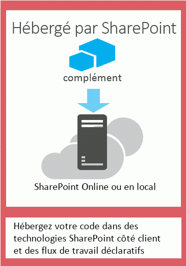
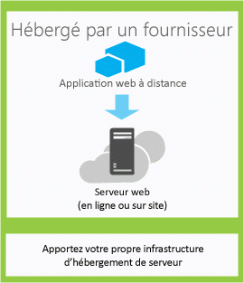

# Choisir les modèles de développement et l'hébergement d'un complément pour SharePoint
Découvrez les différentes manières d'héberger les composants des Compléments SharePoint.
Le modèle de complément SharePoint 2013 propose un large éventail de modèles de développement et d'hébergement. Certains de ces modèles peuvent être utilisés en combinaison les uns avec les autres. Par exemple, vos compléments peuvent associer des composants hébergés par SharePoint et des composants hébergés à distance. Pour déterminer les modèles à utiliser, il est conseillé d'identifier vos besoins, technologies et objectifs, et de choisir les options et les possibilités qui correspondent le mieux à ces facteurs parmi celles offertes par les Compléments SharePoint.

## Éléments à prendre en considération lors de la sélection d'un modèle de développement

Les Compléments SharePoint permettent d'élargir la gamme des langages de programmation et des piles technologiques que vous pouvez utiliser lorsque vous travaillez avec des ressources et des services SharePoint. Le nombre précis d'options à votre disposition dépend à la fois du type de complément et du modèle d'hébergement que vous choisissez. Il est également possible de combiner les modèles.

### Compléments hébergés par SharePoint

Commencez avec l'option la plus simple : des compléments hébergés par SharePoint ou des compléments dont tous les composants sont hébergés sur une batterie de serveurs SharePoint sur site ou Office 365. Les compléments hébergés par SharePoint sont installés sur un site web SharePoint 2013, appelé site web hôte. Leurs ressources sont hébergées sur un sous-site isolé du site web hôte, appelé site web de complément. Il est important de savoir faire la  [différence entre les sites web hôtes et les sites web de complément](host-webs-add-in-webs-and-sharepoint-components-in-sharepoint-2013.md). La figure 1 illustre l'architecture de base d'un complément hébergé par SharePoint.

**Figure 1. Architecture d'un complément hébergé par SharePoint**

Vous pouvez combiner un complément hébergé par SharePoint avec des compléments dont les composants sont hébergés à distance. Ceci dit, tous les compléments ou portions de complément exécutés sur un site web de complément doivent répondre aux exigences suivantes concernant trois éléments clés : l'emplacement d'hébergement du complément, la méthode d'obtention d'autorisation pour le complément et le langage qu'il peut utiliser.

|**Composant**|**Exigences pour les compléments hébergés par SharePoint**|
|:-----|:-----|
|Emplacement d'hébergement des composants de complément    |Domaine de complément isolé de votre batterie de serveurs SharePoint    |
|Méthode d'obtention d'autorisation du complément    |Privilèges de l'utilisateur connecté    |
|Langage pouvant être utilisé par le complément    |JavaScript (avec la bibliothèque JSOM SharePoint 2013) + HTML    |
 
Ce modèle est très facile à déployer et vous pouvez utiliser les  [Créer un complément de base hébergé par SharePoint à l'aide des outils de développement Office 365 « Napa »](create-a-basic-sharepoint-hosted-add-in-by-using-napa-office-365-development-too.md). Prenez en considération les éléments suivants avant de décider de créer un complément hébergé par SharePoint.

|**Avantages offerts**|**Points à prendre en considération**|
|:-----|:-----|
|Vous pouvez réutiliser les éléments SharePoint courants comme les listes et les composants WebPart.    |Vous pouvez utiliser uniquement JavaScript dans le complément et aucun code côté serveur.    |
|Ces compléments sont relativement faciles à créer et à déployer ; ils sont donc parfaits comme compléments de productivité pour les petites équipes et pour l'automatisation des processus d'entreprise impliquant des règles métiers peu complexes.    |Votre complément bénéficie uniquement des privilèges d'autorisation de l'utilisateur connecté.    |
 
 [Commencer à créer des compléments SharePoint hébergés par SharePoint](get-started-creating-sharepoint-hosted-sharepoint-add-ins.md)

### Compléments hébergés par un fournisseur

Les Compléments SharePoint hébergés par un fournisseur incluent des composants qui sont déployés et hébergés en dehors de la batterie de serveurs SharePoint. Ils sont installés sur le site web hôte, mais leurs composants distants sont hébergés sur un autre serveur  *qui doit être situé en dehors de la batterie de serveurs SharePoint*  . La figure 2 illustre l'architecture de base d'un complément hébergé par un fournisseur.

**Figure 2. Architecture d'un complément hébergé par un fournisseur**

Le tableau suivant montre que les exigences concernant l'hébergement, les autorisations et les langages sont beaucoup plus souples pour les compléments hébergés par un fournisseur qu'elles ne le sont pour les compléments hébergés par SharePoint.

|**Composant**|**Exigences pour les compléments hébergés par un fournisseur**|
|:-----|:-----|
|Emplacement d'hébergement des composants de complément    |N'importe quel serveur web ou service d'hébergement    |
|Méthode d'obtention d'autorisation du complément    |OAuth ou la bibliothèque inter-domaines JavaScript    |
|Langage pouvant être utilisé par le complément    |N'importe quel langage pris en charge par votre serveur web ou votre service d'hébergement    |
 
Un complément hébergé par un fournisseur interagit avec un site SharePoint, mais utilise également les ressources et les services qui résident sur le site distant. Prenez en considération les éléments suivants avant de décider de créer un complément hébergé par un fournisseur.

|**Avantages offerts**|**Points à prendre en considération**|
|:-----|:-----|
|Vous pouvez héberger le complément sur Microsoft Azure ou sur n'importe quelle plateforme web distante, y compris des plateformes autres que celles proposées par Microsoft.    |C'est vous qui êtes responsable de la création de la logique d'installation, de mise à jour et de désinstallation des composants distants.    |
|Vous pouvez utiliser l'un des modèles objets clients SharePoint, la bibliothèque inter-domaines JavaScript ou le  [service web basé sur REST/OData](http://msdn.microsoft.com/magazine/dn198245.aspx) de SharePoint 2013 pour interagir avec SharePoint.   |Pour chaque façon d'interagir avec SharePoint, il existe des  [options correspondant aux différentes approches d'accès aux données](secure-data-access-and-client-object-models-for-sharepoint-add-ins.md).    |
|Obtenir une autorisation d'accès à des données SharePoint à l'aide de l'un des  [trois systèmes d'autorisation](three-authorization-systems-for-sharepoint-add-ins.md).    |Vous devez choisir OAuth ou la bibliothèque inter-domaines pour autoriser l'accès de votre complément à SharePoint.    |
 

## Aligner le modèle d'hébergement avec les objectifs de développement

En plus d'examiner les avantages et les contraintes techniques de chaque option, vous devez également réfléchir à vos objectifs de développement au moment de choisir un modèle d'hébergement. Le tableau suivant peut vous aider à déterminer le modèle d'hébergement qui correspond le mieux à vos besoins.

|**Vos besoins**|**Modèle d'hébergement recommandé**|**Exemple**|
|:-----|:-----|:-----|
|Utiliser et mettre en service de nouvelles entités SharePoint de manière exclusive    |Application hébergée sur SharePoint    |Un complément qui comprend un contrôle de type sélecteur de personnes et stocke des informations sur les utilisateurs SharePoint dans une liste SharePoint    |
|Utiliser les entités SharePoint existantes et interagir avec des services web externes (autres que SharePoint)    |Application hébergée par un fournisseur    |Un complément qui récupère les adresses des clients dans une liste SharePoint figurant sur le site web hôte et utilise un service de géolocalisation dans une application web pour afficher l'endroit où ils se trouvent    |
|Mettre en service de nouvelles entités SharePoint et interagir avec des services web externes    |Combinaison d'une application hébergée sur SharePoint et d'une application hébergée par un fournisseur    |Un complément de géolocalisation qui met en service une liste SharePoint sur le site web d'application afin de stocker les coordonnées de latitude et de longitude des adresses fournies par l'utilisateur ou tirées d'une liste SharePoint existante    |
 

## Éléments à prendre en considération lors de la sélection d'un modèle d'hébergement pour les compléments hébergés par un fournisseur

Les compléments hébergés par SharePoint présentent un modèle d'hébergement fixe, car ils sont hébergés sur le site web de complément. Les compléments hébergés par un fournisseur offrent plus de souplesse dans l'hébergement des différents composants de votre complément. Aussi, si vous choisissez d'en créer un, vous devrez sélectionner un modèle d'hébergement correspondant à vos objectifs et à vos exigences. 

### OAuth ou la bibliothèque inter-domaines

L'une des questions les plus importantes à vous poser si vous envisagez de créer un complément hébergé par un fournisseur est de savoir comment le complément obtient l'autorisation d'interagir avec SharePoint. Les compléments hébergés par un fournisseur vous donnent le choix entre deux possibilités : la bibliothèque inter-domaines JavaScript et OAuth. 

La  [bibliothèque inter-domaines](access-sharepoint-2013-data-from-add-ins-using-the-cross-domain-library.md) vous permet d'interagir avec plusieurs domaines à partir des composants distants de votre complément via un proxy. Si le code côté client et les autorisations d'un utilisateur connecté à SharePoint sont suffisants, la bibliothèque inter-domaines constitue une bonne option. La bibliothèque inter-domaines est également pratique lorsque vous effectuez des appels distants à travers un pare-feu.

OAuth est un protocole d'autorisation ouvert, qui permet l'octroi sécurisé d'autorisation par les applications clientes (applications de bureau, web et mobiles) d'une manière facile à gérer. Si vous envisagez de créer un complément SharePoint qui sera exécuté sur une application web distante et renverra des données vers SharePoint 2013, vous devrez souvent utiliser OAuth. OAuth est obligatoire lorsque vous effectuez des appels dans SharePoint à partir d'une application web hébergée à distance qui ne peut pas utiliser exclusivement le code côté client (HTML + JavaScript).  [En savoir plus sur le fonctionnement d'OAuth dans les compléments SharePoint.](creating-sharepoint-add-ins-that-use-low-trust-authorization.md)

Les rubriques  [Accès aux données sécurisé et modèles d'objet client pour les compléments SharePoint](secure-data-access-and-client-object-models-for-sharepoint-add-ins.md) et [Trois systèmes d'autorisation pour les compléments SharePoint](three-authorization-systems-for-sharepoint-add-ins.md) expliquent comment choisir entre OAuth et la bibliothèque inter-domaines de manière plus approfondie.

### OAuth avec les batteries de serveurs SharePoint sur site

Si vous utilisez un déploiement sur site de SharePoint 2013, vous pouvez utiliser OAuth, mais vous aurez à choisir entre la création de compléments à haut niveau de fiabilité et l'utilisation d'une location Office 365. Office 365 utilise le service de contrôle d'accès (ACS) Microsoft Azure comme service Broker d'approbation ; aussi, si vous n'avez pas accès à une location Office 365, vous devrez opter pour  [Créer des compléments à haut niveau de fiabilité pour SharePoint 2013](create-high-trust-sharepoint-add-ins.md), qui utilise des certificats pour établir une relation d'approbation entre votre complément et SharePoint. Vous pouvez ajouter des compléments à haut niveau de fiabilité au catalogue de compléments de votre batterie de serveurs SharePoint, mais vous ne pouvez pas les vendre sur l'Office Store. Si vous avez accès à une location Office 365, vous pouvez la relier à votre installation sur site de SharePoint 2013 et  [utiliser ACS comme service Broker d'approbation pour les compléments installés sur votre batterie de serveurs SharePoint sur site](use-an-office-365-sharepoint-site-to-authorize-provider-hosted-add-ins-on-an-on.md).

Le tableau suivant énumère tous les modèles possibles pour l'hébergement des composants SharePoint et des composants distants de votre complément, ainsi que les services Broker d'approbation disponibles si vous utilisez OAuth. Notez que vous aurez besoin d'un accès à un client Office 365 afin de pouvoir utiliser ACS pour établir la relation d'approbation entre SharePoint et un Complément SharePoint installé sur une installation sur site de SharePoint 2013.

|**Emplacement du composant SharePoint**|**Emplacement du composant distant**|**Service Broker d'approbation**|
|:-----|:-----|:-----|
|Sur site    |Dans le nuage    |ACS, certificat    |
|Sur site    |Sur site    |ACS, certificat    |
|Site SharePoint Office 365    |Dans le nuage    |NCO ACS    |
|Site SharePoint Office 365    |Sur site    |ACS    |
 

## Combiner un hébergement par un fournisseur et un hébergement sur SharePoint

Vous pouvez aussi créer des compléments qui incluent à la fois des composants hébergés par SharePoint et des composants hébergés dans le cloud. Par exemple, vous pouvez créer un  [complément hébergé dans le cloud qui inclut un type de liste et de contenu SharePoint personnalisé](create-a-provider-hosted-add-in-that-includes-a-custom-sharepoint-list-and-conte.md). Si vous choisissez d'utiliser cette architecture, votre conception et votre approche doivent tenir compte des limitations de sécurité intégrées dans le modèle. Vous ne pouvez utiliser que JavaScript dans les composants de code hébergés par SharePoint, tandis que les composants hébergés à distance doivent utiliser OAuth ou la bibliothèque inter-domaines pour interagir avec le site web SharePoint. Si vous envisagez cette approche, assurez-vous que vous comprenez parfaitement le  [fonctionnement de l'autorisation de complément dans SharePoint 2013](authorization-and-authentication-of-sharepoint-add-ins.md). La figure 4 illustre le fonctionnement de cette architecture quand vous utilisez Microsoft Azure pour héberger les composants distants de votre complément et que vous utilisez OAuth.

**Figure 4. Communication de serveur à serveur pour un complément SharePoint avec OAuth et Windows Azure**

 [Découvrez comment créer un complément combinant un hébergement dans le cloud et par SharePoint.](create-a-provider-hosted-add-in-that-includes-a-custom-sharepoint-list-and-conte.md)

Prenez en considération les éléments suivants lorsque vous envisagez de combiner un hébergement par un fournisseur et un hébergement sur SharePoint.

|**Avantages offerts**|**Points à prendre en considération**|
|:-----|:-----|
|Vous bénéficiez de tous les avantages des deux approches.    |L'architecture est plus complexe et nécessite une planification soignée de la communication de serveur à serveur et des restrictions de scripts intersites.    |
 

## Compléments hébergés par un fournisseur dans des rôles web Azure

Vous pouvez héberger un Complément SharePoint hébergé par un fournisseur sur un rôle web Microsoft Azure plutôt que sur une application web, qu'il soit local ou Site web Azure. Un rôle web Azure est essentiellement un site web basé sur Internet Information Services (IIS) et hébergé sur Azure. Vous pouvez tirer parti des services d'hébergement et de l'évolutivité des rôles web Azure. En outre, vous pouvez améliorer les performances et la convivialité de votre Complément SharePoint, en particulier si le complément est très utilisé ou si la demande à son égard varie dans le temps. Si le Complément SharePoint nécessite davantage de ressources serveur, Azure peut les lui allouer de façon dynamique.

Consultez les liens suivants pour obtenir plus d'informations sur les rôles web Azure.

-  [Qu'est-ce qu'un service cloud ?](http://www.windowsazure.com/fr-fr/manage/services/cloud-services/what-is-a-cloud-service/)

-  [Présentation de Microsoft Azure](http://www.windowsazure.com/fr-fr/develop/net/fundamentals/intro-to-windows-azure/)

-  [Mise à l'échelle automatique et Microsoft Azure](http://msdn.microsoft.com/fr-fr/library/hh680945%28v=pandp.50%29.aspx)

Dans le cadre des conditions préalables, vous avez besoin du kit de développement logiciel (SDK) Microsoft Azure pour .NET (VS 2012) 1.8.1, que vous pouvez installer à l'aide de  [Web Platform Installer](http://www.microsoft.com/web/downloads/platform.aspx).

La façon dont vous créez le projet dans vsnv varie selon que vous démarrez avec un projet SharePoint Add-in puis ajoutez le projet de rôle web Azure, ou que vous démarrez avec le projet Azure et ajoutez ensuite le projet SharePoint.

### Ajouter un service cloud à un complément existant

Si vous disposez déjà d'un Complément SharePoint hébergé par un fournisseur que vous souhaitez héberger sur Azure, choisissez le projet de complément dans la solution pour le complément SharePoint. Dans la barre de menus, choisissez **Projet**, **Ajouter un projet de service cloud Microsoft Azure**. Un projet Azure nommé  _NameOfTheWebAppProject_.Azure est ajouté à la solution pour votre Complément SharePoint. Un rôle web pour le projet web est également ajouté au projet pour le service cloud Azure. Les Outils de développement Office pour Visual Studio 2012 définissent les propriétés de projet nécessaires pour que le rôle web puisse fonctionner avec le Complément SharePoint.

### Ajouter un complément à un rôle web existant

Si vous disposez déjà d'un rôle web dans un service cloud Azure et que vous souhaitez l'utiliser comme hôte pour un Complément SharePoint hébergé par un fournisseur, ouvrez le projet cloud Azure dans Visual Studio. Ensuite, dans l' **Explorateur de solutions**, choisissez le projet de rôle web. Dans la barre de menus, choisissez **Projet**, **Ajouter un projet de complément SharePoint**. Un projet pour un Complément SharePoint hébergé par un fournisseur nommé  _NameOfTheWebAppProject_.Azure est créé et ajouté à la solution. Visual Studio référence le rôle web Azure en tant qu'hôte de projet web pour le Complément SharePoint.

## Ressources supplémentaires

Pour plus d'informations, voir les ressources suivantes :

-  [Aspects importants du contexte de développement et de l'architecture des compléments pour SharePoint](important-aspects-of-the-sharepoint-add-in-architecture-and-development-landscap.md)

-  [Compléments](sharepoint-add-ins.md)

-  [Héberger des sites web, des sites web de complément et des composants SharePoint dans SharePoint 2013](host-webs-add-in-webs-and-sharepoint-components-in-sharepoint-2013.md)

-  [Autorisation et authentification des compléments dans SharePoint](authorization-and-authentication-of-sharepoint-add-ins.md)

-  [Flux OAuth de jeton de contexte pour les compléments SharePoint](context-token-oauth-flow-for-sharepoint-add-ins.md)

-  [Utiliser un site SharePoint Office 365 pour autoriser des compléments hébergés par un fournisseur sur un site SharePoint local](use-an-office-365-sharepoint-site-to-authorize-provider-hosted-add-ins-on-an-on.md)

-  [Comparaison des compléments pour SharePoint et des solutions SharePoint](http://msdn.microsoft.com/library/0e9efadb-aaf2-4c0d-afd5-d6cf25c4e7a8%28Office.15%29.aspx)

-  [Commencer à créer des compléments hébergés par un fournisseur pour SharePoint](get-started-creating-provider-hosted-sharepoint-add-ins.md)

-  [Commencer à créer des compléments SharePoint hébergés par SharePoint](get-started-creating-sharepoint-hosted-sharepoint-add-ins.md)

-  [Créer un complément hébergé par un fournisseur comportant un type personnalisé de liste et de contenu SharePoint](create-a-provider-hosted-add-in-that-includes-a-custom-sharepoint-list-and-conte.md)

