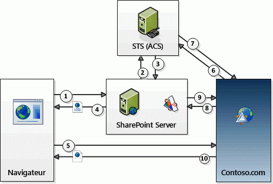

# Flux OAuth de jeton de contexte pour les compléments SharePoint
Découvrez le flux d'authentification et d'autorisation OAuth pour les compléments à faible niveau de fiabilité hébergés par un fournisseur dans SharePoint.
## Vue d'ensemble d'OAuth et des Compléments SharePoint hébergés par un fournisseur SharePoint

Dans SharePoint, **le flux d'authentification et d'autorisation OAuth pour un complément à faible niveau de fiabilité hébergé par un fournisseur implique une série d'interactions entre votre complément, SharePoint, le serveur d'autorisation et le navigateur** au moment de l'exécution. Dans ce scénario, le serveur d'autorisation est Microsoft Azure Access Control Service (ACS).
  
    
    
Avec un complément hébergé par un fournisseur, vous disposez d'une application web distante ou d'un service distinct de SharePoint qui ne fait pas partie de la batterie SharePoint ou de la location SharePoint Online. Ils peuvent être hébergés dans le cloud ou sur un serveur sur site. Dans cet article, le composant distant est appelé Contoso.com.
  
    
    

> [!REMARQUE]
> Le composant distant peut aussi héberger des récepteurs d'événements qui répondent aux événements qui se produisent pour les éléments SharePoint, tels que des listes ou des éléments de liste. Les événements distants auxquels le serveur Contoso.com peut vouloir répondre sont, par exemple, les événements de liste, tels que l'ajout ou la suppression d'un élément de liste, ou des événements web, tels que l'ajout ou la suppression d'un site. Pour en savoir plus sur la création de récepteurs d'événements distants, voir  [Créer un récepteur d'événements distant dans des compléments pour SharePoint](create-a-remote-event-receiver-in-sharepoint-add-ins.md). 
  
    
    

Contoso.com utilise le modèle objet client (CSOM) SharePoint ou les API REST SharePoint pour appeler SharePoint. L'application Contoso.com utilise un flux de transmission de jeton OAuth pour s'authentifier avec SharePoint. **SharePoint et Contoso.com ne s'approuvent pas mutuellement, mais tous deux approuvent le service ACS** et acceptent les jetons émis par ACS. Trois jetons sont utilisés : SharePoint demande au service ACS de créer un jeton de contexte que SharePoint transfère à Constoso.com. Contoso.com valide que le jeton de contexte a été émis par le service ACS et l'approuve. Contoso.com extrait ensuite un jeton d'actualisation du jeton de contexte et l'utilise pour obtenir directement un jeton d'accès auprès du service ACS. Il inclut ce jeton d'accès dans toutes ses demandes à SharePoint. SharePoint valide que le jeton d'accès a été émis par le service ACS et répond donc aux demandes de Contoso.com.
  
    
    
 **Vous fournissez le code de gestion de jeton** dans le composant distant. (Mais si votre composant distant est hébergé sur .NET, les Outils de développement Microsoft Office pour Visual Studio fournissent un exemple de code qui fait la plupart du travail à votre place.) Pour en savoir plus sur le code de gestion de jeton, voir [Gestion des jetons de sécurité dans les compléments SharePoint à faible niveau de fiabilité hébergés par le fournisseur](handle-security-tokens-in-provider-hosted-low-trust-sharepoint-add-ins.md).
  
    
    

## Conditions préalables à l'utilisation du flux

Vous devez effectuer quelques étapes préalables pour qu'un Complément SharePoint puisse utiliser le flux de jeton de contexte. 
  
    
    

- Si le Complément SharePoint va être installé dans une batterie SharePoint locale, certaines exigences de configuration ne s'appliquent pas dans le cas d'une installation uniquement sur SharePoint Online :
    
  - La **batterie de serveurs doit être configurée** pour prendre en charge les compléments. (Cette condition est requise pour l'installation de tous les Compléments SharePoint dans la batterie, même s'ils n'utilisent pas le flux de jeton de contexte.) Pour en savoir plus, voir [Configurer un environnement pour les compléments SharePoint](http://technet.microsoft.com/fr-fr/library/fp161236%28v=office.15%29.aspx).
    
  
  - Le **client** qui installe le complément **doit disposer d'un compte Office 365**. Cette condition est nécessaire pour accéder au service ACS. Le client n'a pas à utiliser son compte à d'autres fins.
    
  
  - La batterie doit être configurée pour partager la relation d'approbation entre Office 365 et le service ACS. Cette tâche peut facilement être effectuée à l'aide de scripts Windows PowerShell. Pour en savoir plus, voir  [Utiliser un site SharePoint Office 365 pour autoriser des compléments hébergés par un fournisseur sur un site SharePoint local](use-an-office-365-sharepoint-site-to-authorize-provider-hosted-add-ins-on-an-on.md).
    
  
- Que le complément soit installé sur SharePoint Online ou sur une batterie de serveurs SharePoint locale, le **Complément SharePoint doit être inscrit auprès du service ACS**. Pour en savoir plus sur la procédure à suivre, voir [Enregistrer des compléments dans SharePoint 2013](register-sharepoint-add-ins-2013.md). Le complément doit notamment fournir au service ACS son ID client et sa clé secrète client dans le cadre de l'inscription.
    
  

## Étapes du flux de jeton de contexte

Le flux d'authentification et d'autorisation OAuth pour un complément SharePoint hébergé par un fournisseur est illustré dans la figure ci-après :
  
    
    

**Flux de jeton de contexte OAuth**

  
    
    

  
    
    

  
    
    
Voici les étapes correspondant aux numéros de la figure :
  
    
    

  
    
    

1. Un utilisateur lance le Complément SharePoint à partir de SharePoint. La conception du complément détermine le déroulement de l'action :
    
  - Si le complément est conçu pour exposer l'application web distante (sur Contoso.com) dans un composant de complément (généralement un wrapper autour d'un **IFRAME**), le fait de lancer le complément signifie simplement accéder à une page SharePoint qui contient le composant de complément. (Si l'utilisateur n'est pas déjà connecté, SharePoint l'invite à le faire.) SharePoint traite la page et détecte que celle-ci contient un composant du complément Contoso.com. (Pour en savoir plus sur les composants de complément, voir  [Créer des composants de complément à installer avec votre complément pour SharePoint](create-add-in-parts-to-install-with-your-sharepoint-add-in.md).)
    
  
  - Si le complément est conçu pour être utilisé en pleine page dans le navigateur, l'utilisateur le lance en cliquant sur la vignette correspondante dans la page **Site Contents** du site SharePoint. (Le complément peut également contenir un menu personnalisé ou un élément de ruban qui lance le composant distant.)
    
  
2. Quelle que soit la manière dont le complément est lancé, SharePoint doit obtenir un jeton de contexte qu'il peut envoyer à l'application Contoso.com. Pour ce faire, il demande à ACS de créer un jeton de contexte qui contient des informations sur le contexte SharePoint, y compris l'utilisateur actuel, l'URL du complément distant et d'autres informations. Le jeton de contexte contient également un jeton d'actualisation chiffré.
    
  
3. Le service ACS signe le jeton de contexte, à l'aide d'un algorithme qui utilise la clé secrète du complément Contoso.com, et le renvoie à SharePoint. Seuls le service ACS et le complément Contoso.com connaissent la clé secrète.
    
  
4. Si l'application Contoso.com est exposée dans un composant de complément, SharePoint affiche la page qui héberge ce composant et ajoute le jeton de contexte à l'URL appelée par l' **IFRAME** du composant de complément pour obtenir son contenu. Si l'application Contoso.com est en pleine page, SharePoint redirige le navigateur vers Constoso.com et inclut le jeton de contexte dans la réponse de redirection.
    
  
5. Le jeton de contexte est inclus dans la demande de navigateur qui est envoyée au serveur Contoso.
    
  
6. Le serveur Contoso.com reçoit le jeton de contexte et valide la signature, ce qu'il peut faire, car il connaît la clé secrète client. Ceci permet à Contoso.com de s'assurer que le jeton a été émis par ACS et non pas par un imposteur se faisant passer pour SharePoint. Contoso.com extrait le jeton d'actualisation du jeton de contexte et l'envoie, avec d'autres informations comprenant son ID client et sa clé secrète client, à ACS sous la forme d'une demande de jeton d'accès qui lui permettra d'accéder à SharePoint.
    
  
7. Le service ACS valide le jeton d'actualisation afin de vérifier que c'est lui qui l'a émis, puis renvoie un jeton d'accès à Contoso.com. L'application Contoso.com peut éventuellement placer en mémoire cache ce jeton d'accès pour ne pas avoir à demander un jeton d'accès au service ACS à chaque fois qu'elle accède à SharePoint. Par défaut, les jetons d'accès sont valides pendant quelques heures. (Au moment où cet article a été rédigé, le délai d'expiration par défaut des jetons d'accès à SharePoint émis par ACS était de 12 heures, mais cette valeur peut changer.) Chaque jeton d'accès est propre au compte d'utilisateur spécifié dans la demande initiale d'autorisation et accorde uniquement l'accès au service (dans ce cas, SharePoint) spécifié dans la demande. Les jetons d'actualisation ont une plus grande durée de vie (six mois au moment où cet article a été écrit) et peuvent également être mis en cache. Ainsi, un même jeton d'actualisation peut être échangé contre un nouveau jeton d'accès auprès du service ACS jusqu'à l'expiration du jeton d'actualisation. (Pour en savoir plus sur la mise en cache des jetons, voir  [Gestion des jetons de sécurité dans les compléments SharePoint à faible niveau de fiabilité hébergés par le fournisseur](handle-security-tokens-in-provider-hosted-low-trust-sharepoint-add-ins.md).) Lorsque le jeton d'actualisation expire, Contoso.com peut en obtenir un nouveau en récupérant un nouveau jeton de contexte. Pour en savoir plus sur cette procédure, voir  [Obtenir un nouveau jeton de contexte](handle-security-tokens-in-provider-hosted-low-trust-sharepoint-add-ins.md#GetNewContextToken).
    
  
8. Contoso.com utilise le jeton d'accès pour appeler l'API REST SharePoint ou effectuer une demande CSOM auprès de SharePoint. Pour ce faire, il transmet le jeton d'accès OAuth dans l'en-tête HTTP **Authorization**. (Un exemple de code de création de l'en-tête est fourni dans les Outils de développement Office pour Visual Studio si votre composant distant est hébergé sur une plateforme .NET.
    
  
9. SharePoint valide le jeton d'accès pour vérifier qu'il a été émis par le service ACS. Il envoie ensuite à Contoso.com les données que celui-ci demande ou exécute l'opération de création, lecture, mise à jour ou suppression (CRUD) demandée par Contoso.com.
    
  
10. La page de l'application Contoso.com s'affiche dans le navigateur (ou dans l' **IFRAME** du composant de complément).
    
  

## Ressources supplémentaires

-  [Autorisation et authentification des compléments dans SharePoint](authorization-and-authentication-of-sharepoint-add-ins.md)
    
  
-  [Autorisations des compléments dans SharePoint 2013](add-in-permissions-in-sharepoint-2013.md)
    
  
-  [Aspects importants du contexte de développement et de l'architecture des compléments pour SharePoint](important-aspects-of-the-sharepoint-add-in-architecture-and-development-landscap.md)
    
  
-  [Commencer à créer des compléments SharePoint hébergés par SharePoint](get-started-creating-sharepoint-hosted-sharepoint-add-ins.md)
    
  

