# Conversion d'un complément auto-hébergé pour SharePoint en complément hébergé par un fournisseur
Découvrez comment convertir un Complément SharePoint auto-hébergé en complément hébergé par un fournisseur.
Microsoft SharePoint 2013 a introduit une nouvelle approche d'extension des sites SharePoint, en plus de l'approche précédente consistant à utiliser des personnalisations basées sur une solution. Ce nouveau modèle d'extensibilité pour SharePoint, appelé modèle de complément, permet aux développeurs de créer des implémentations personnalisées qui peuvent être déployées dans des environnements SharePoint, qu'ils soient en cours d'exécution dans un déploiement sur site, SharePoint Online ou hybride.
  
    
    

Les développeurs peuvent créer deux types différents de compléments SharePoint. Le premier, un complément hébergé par SharePoint, s'exécute principalement dans le navigateur. Tous les composants qui le prennent en charge (HTML, CSS, images et JavaScript par exemple) sont stockés et fournis par SharePoint. Les autres types de complément correspondent au modèle de compléments Cloud (CAM), fonctionnent principalement en dehors de SharePoint sur un autre serveur et communiquent avec SharePoint en utilisant le modèle objet côté client (CSOM) et l'API REST. Ils établissent une identité à l'aide du protocole bien connu OAuth 2.0, qui est pris en charge par SharePoint 2013.
Les développeurs peuvent implémenter des compléments en utilisant le modèle de complément de l'une des deux façons, en tant que complément hébergé par un fournisseur ou auto-hébergé. Les compléments auto-hébergés ont été publiés comme programme d'évaluation lors du lancement de SharePoint 2013 mais, en mai 2014, Microsoft a annoncé l'arrêt du programme d'évaluation et la fin de la prise en charge de la création de compléments auto-hébergés. Pour consulter l'annonce, voir  [Mise à jour sur le programme d'évaluation des compléments auto-hébergés](http://blogs.office.com/2014/05/16/update-on-autohosted-apps-preview-program/).
  
    
    

Cet article explique comment convertir et migrer un complément auto-hébergé en complément hébergé par un fournisseur. Cependant, il est important que les développeurs comprennent certaines différences spécifiques entre les deux approches, car ces informations simplifient grandement le processus de conversion.
## Conditions préalables à la conversion d'un complément auto-hébergé en complément hébergé par un fournisseur

- Toutes les  [conditions préalables au développement de compléments hébergés par un fournisseur](get-started-creating-provider-hosted-sharepoint-add-ins.md#SP15createselfhostapp_bk_prereq).
    
  
- SDK Azure v2.3. Installez-le à partir de  [cette page du Centre de téléchargement](http://azure.microsoft.com/fr-fr/downloads).
    
  

### Principaux concepts à connaître

Avant de convertir un complément auto-hébergé en complément hébergé par un fournisseur, vous devez comprendre les bases des Compléments SharePoint et les différences entre les Compléments SharePoint hébergés par SharePoint, hébergés par un fournisseur et auto-hébergés. Les articles répertoriés dans le tableau 1 devraient vous y aider.
  
    
    

**Tableau 1. Principaux concepts en matière de conversion d'un complément auto-hébergé en complément hébergé par un fournisseur**

|**Titre de l'article**|**Description**|
|:-----|:-----|
| [Compléments](sharepoint-add-ins.md)   |Découvrez le nouveau modèle de complément de SharePoint 2013 qui permet de créer des compléments, c'est-à-dire de petites solutions simples d'utilisation pour les utilisateurs finaux.    |
| [Aspects importants du contexte de développement et de l'architecture des compléments pour SharePoint](important-aspects-of-the-sharepoint-add-in-architecture-and-development-landscap.md)   |Apprenez les différents aspects de l'architecture des Compléments SharePoint et du modèle de complément SharePoint, notamment les options d'hébergement des compléments, les options de l'interface utilisateur (IU), le système de déploiement, le système de sécurité et le cycle de vie.    |
| [Choisir les modèles de développement et l'hébergement d'un complément pour SharePoint](choose-patterns-for-developing-and-hosting-your-sharepoint-add-in.md)   |Découvrez les différentes méthodes d'hébergement pour les Compléments SharePoint.    |
| [Héberger des sites web, des sites web de complément et des composants SharePoint dans SharePoint 2013](host-webs-add-in-webs-and-sharepoint-components-in-sharepoint-2013.md)   |Découvrez la différence entre les sites web hôtes et les sites web de complément. Découvrez également les composants SharePoint 2013 qui peuvent être inclus dans un complément SharePoint, ceux qui sont déployés sur le site web hôte, ceux qui sont déployés sur le site web de complément, ainsi que le mode de déploiement du site web de complément dans un domaine isolé.    |
   

## Conversion du complément

La conversion d'un Complément SharePoint auto-hébergé en complément hébergé par un fournisseur implique la modification de deux ou trois composants.
  
    
    

- Le complément SharePoint lui-même
    
  
- L'application ou les services web distants
    
  
- La Base de données SQL Microsoft Azure, le cas échéant, dans le complément
    
  
Un complément SharePoint auto-hébergé a déployé le Site web Azure et la Base de données SQL Microsoft Azure automatiquement lors de son installation. Cependant, les compléments web distants et d'autres services des compléments hébergés par un fournisseur peuvent exister sur n'importe quelle plateforme web. Cet article suppose que les composants distants du complément auto-hébergé soient conservés en tant que services Azure après la conversion en complément hébergé par un fournisseur.
  
    
    
Les sections suivantes décrivent le processus de conversion d'un complément auto-hébergé en complément hébergé par un fournisseur. L'exemple de complément auto-hébergé utilisé (Customer Manager) est simple, pour que vous puissiez vous concentrer sur les étapes de la conversion et pas sur le complément lui-même. Il se compose de trois projets :
  
    
    

- CustomersDb : projet de base de données SQL qui générera le *.dacpac nécessaire. Notez qu'il n'y a pas de schéma défini dans ce projet. Il est simplement utilisé pour créer une base de données car le schéma est créé par l'application web ASP.NET.
    
  
- CustomerManagerAH : complément SharePoint auto-hébergé qui est configuré pour inclure le projet d'application web ASP.NET et l'application de la couche Données SQL Azure dans le package de complément SharePoint obtenu.
    
  
- CustomerManagerAHWeb : application web MVC ASP.NET qui utilise l'approche Migrations Entity Framework Code First pour créer le schéma de base de données, ainsi que pour lire et écrire dans la base de données.
    
  
Le complément est une application web MVC ASP.NET qui peut à la fois montrer les clients d'un tableau dans un Base de données SQL Microsoft Azure et ajouter de nouveaux clients. Il s'agit d'une application web anonyme qui permettra à quiconque d'afficher ou d'ajouter des clients. La solution Visual Studio pour le complément auto-hébergé et les projets associés peut être téléchargée à partir du référentiel public suivant : [Autohosted-Migration-Code-Samples](https://github.com/OfficeDev/Auto-Hosted-Migration-Code-Samples).
  
    
    
La conversion d'un complément SharePoint 2013 auto-hébergé en complément hébergé par un fournisseur implique plusieurs étapes. Chacune est décrite dans les sections suivantes.
  
    
    

1. Déployer la Base de données SQL Microsoft Azure
    
  
2. Créer le Site web Azure pour héberger l'application web distante
    
  
3. Enregistrer le complément auprès de votre site SharePoint
    
  
4. Mettre à jour et déployer le Site web Azure pour l'application web distante
    
  
5. Mettre à jour et déployer le complément SharePoint hébergé par un fournisseur
    
  

### Déployer la base de données SQL Azure

La première étape dans la conversion du complément auto-hébergé en complément hébergé par un fournisseur consiste à déployer la Base de données SQL Microsoft Azure sur laquelle l'application web ASP.NET reposera. Il existe de nombreuses façons de créer une Base de données SQL Microsoft Azure, dont certaines sont expliquées sur le site de la documentation de Microsoft Azure :  [Déployer une base de données vers Azure](http://azure.microsoft.com/fr-fr/documentation/articles/sql-database-deploy/).
  
    
    
L'approche décrite dans les étapes suivantes utilise le modèle de déploiement de l'application de la couche Données, car c'est ainsi que la base de données est déployée dans un complément SharePoint auto-hébergé. Ceci implique la génération d'un package d'application de la couche Données (*.dacpac) et son utilisation pour créer la base de données.
  
    
    

#### Création et déploiement de la base de données SQL Azure

Tout d'abord, ouvrez la solution auto-hébergée dans Visual Studio. Cliquez avec le bouton droit sur le projet de base de données **CustomerDb** et sélectionnez **Générer**. Ceci générera le fichier CustomerDb.dacpac dans le dossier  `[..]\\bin\\[debug | release]`.
  
    
    
L'étape suivante consiste à créer une Base de données SQL Microsoft Azure. Connectez-vous au **portail de gestion d'Azure** (https://manage.windowsazure.com) et, une fois le tableau de bord chargé, sélectionnez le lien BASES DE DONNÉES SQL dans la marge :
  
    
    

**Tableau de bord Base de données SQL Azure dans le portail de gestion d'Azure**

  
    
    

  
    
    
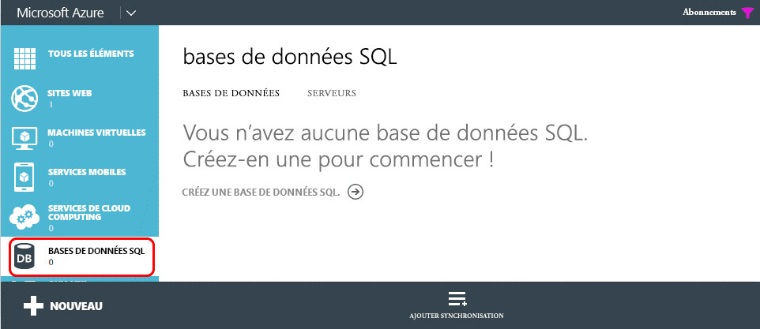
  
    
    
Cliquez sur le lien **SERVEURS** dans la barre de navigation supérieure, puis cliquez sur le bouton **AJOUTER** dans le pied de page, comme indiqué dans la figure suivante :
  
    
    

**Tableau de bord Base de données SQL Azure dans le portail de gestion d'Azure**

  
    
    

  
    
    
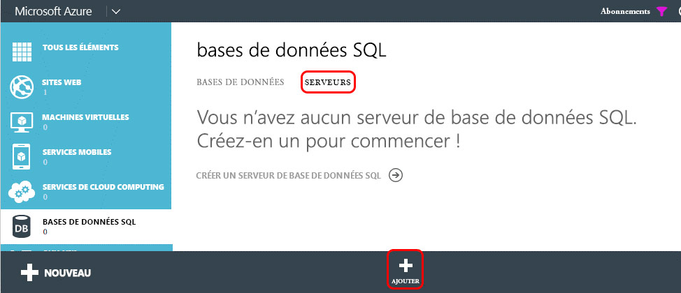
  
    
    
Dans la boîte de dialogue **CRÉER UN SERVEUR** qui s'affiche, sélectionnez l' **ABONNEMENT** Azure, le **NOM DE CONNEXION** et le **MOT DE PASSE** pour l'utilisateur qui disposera de droits d'accès au serveur et sélectionnez la même **RÉGION** que celle utilisée lors de la création du Site web Azure effectuée précédemment. Notez le nom d'utilisateur et le mot de passe car ceux-ci seront nécessaires au cours d'une prochaine étape.
  
    
    

**Création d'une base de données SQL Azure dans le portail de gestion d'Azure**

  
    
    

  
    
    
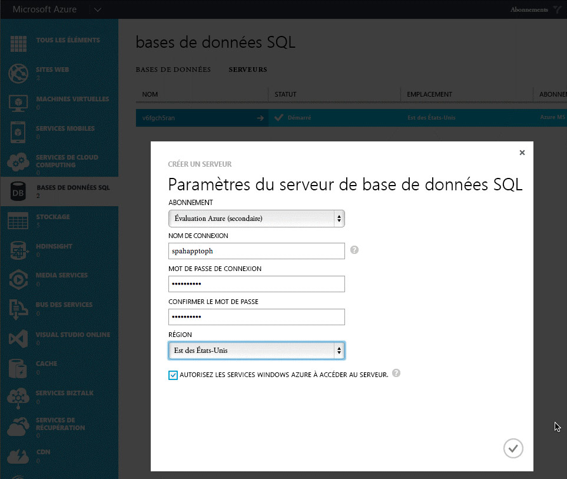
  
    
    
Une fois le formulaire rempli, cliquez sur la **coche** en bas à droite pour créer la base de données. Même si le serveur est désormais créé, la seule ressource pouvant y accéder sont les autres services Azure. Notez le nom de la Base de données SQL Microsoft Azure, car il sera nécessaire au cours d'une prochaine étape.
  
    
    
Pour vous connecter à la Base de données SQL Microsoft Azure et déployer la base de données, vous devez créer une règle de pare-feu qui autorise le trafic à partir de l'ordinateur qui va déployer la base de données. Sinon, les connexions à la Base de données SQL Microsoft Azure seront refusées avec des erreurs semblables à celles mentionnées dans la figure suivante :
  
    
    

**Erreur de connexion à une base de données SQL Azure**

  
    
    

  
    
    
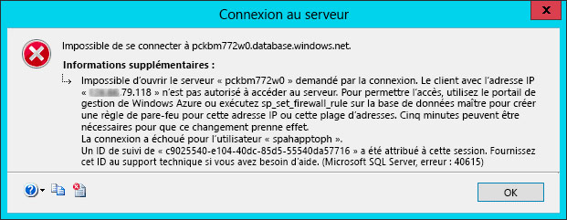
  
    
    
Pour créer une règle de pare-feu, dans le **portail de gestion d'Azure**, sélectionnez la Base de données SQL Microsoft Azure créée précédemment, puis cliquez sur le lien **CONFIGURER** dans la barre de navigation supérieure. Dans la section **Adresses IP autorisées**, votre adresse IP est actuellement affichée comme indiqué dans la figure suivante. Cliquez sur **AJOUTER AUX ADRESSES IP AUTORISÉES** pour ajouter une règle de pare-feu. Ceci autorisera les connexions à la Base de données SQL Microsoft Azure et le déploiement de la base de données. Veillez à cliquer sur le bouton **Enregistrer** dans le pied de page.
  
    
    

**Création d'une règle de pare-feu pour une base de données SQL Azure dans le portail de gestion d'Azure**

  
    
    

  
    
    
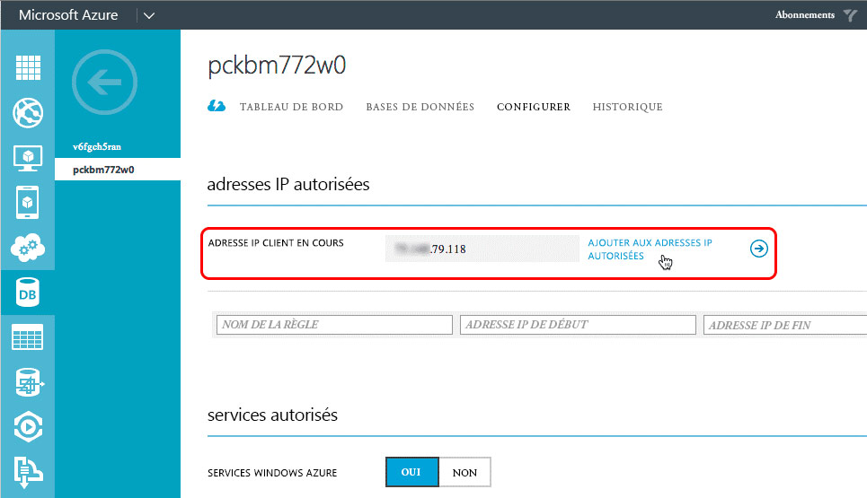
  
    
    
L'étape suivante consiste à déployer la base de données. Ceci peut être fait à partir de Visual Studio à l'aide de Azure SDK v2.3. Installez-le à partir de  [cette page du Centre de téléchargement](http://azure.microsoft.com/fr-fr/downloads). Dans Visual Studio, ouvrez la fenêtre d'outils **Explorateur d'objets SQL Server**, cliquez avec le bouton droit sur le nœud **SQL Server** et sélectionnez **Ajouter SQL Server**:
  
    
    

**Ajout d'une base de données SQL Azure dans l'Explorateur de serveurs**

  
    
    

  
    
    
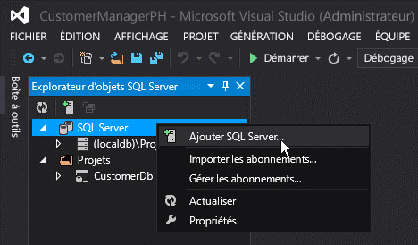
  
    
    
Dans la boîte de dialogue **Se connecter au serveur**, entrez le **nom du serveur**, définissez l' **authentification** sur **Authentification SQL Server** et entrez les mêmes **nom de connexion** et **mot de passe** que ceux définis lors de la création de la Base de données SQL Microsoft Azure. Le nom du serveur doit être le nom complet du serveur, c'est-à-dire `[server-name].database.windows.net`, comme indiqué dans la figure suivante :
  
    
    

**Connexion à une base de données SQL Azure dans Visual Studio**

  
    
    

  
    
    
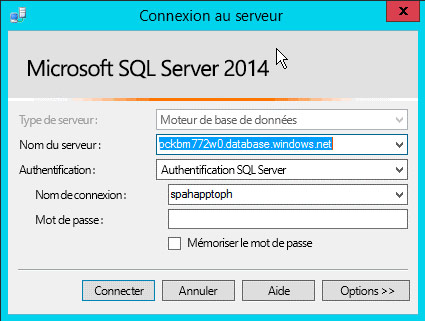
  
    
    
Une fois connecté à la Base de données SQL Microsoft Azure, développez le nœud du serveur nouvellement ajouté, cliquez avec le bouton droit sur le nœud **Bases de données** et sélectionnez **Publier l'application de la couche Données** pour faire apparaître l'Assistant de publication.
  
    
    
Dans la section **Application de la couche Données source (.dacpac)**, utilisez le bouton **Parcourir** pour trouver le fichier *.dacpac généré lors de la création du projet de base de données au cours d'une précédente étape. Assurez-vous que le **nom de la base de données** est défini surCustomerDb, puis cliquez sur **Publier** pour publier CustomerDb dans la Base de données SQL Microsoft Azure.
  
    
    

**Publication d'une application de la couche Données sur une base de données SQL Azure avec Visual Studio**

  
    
    

  
    
    
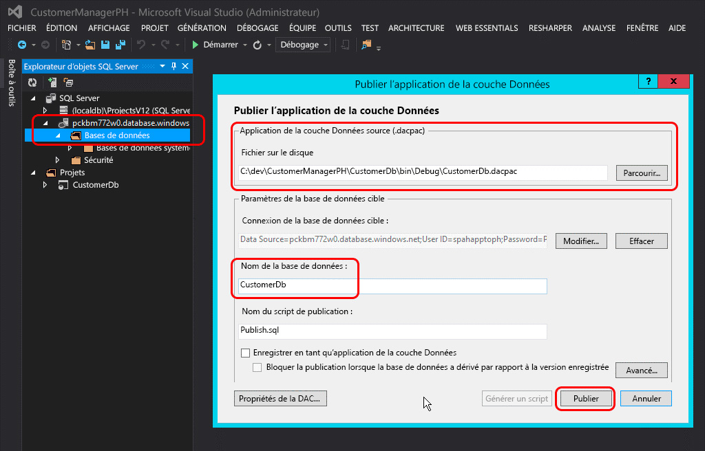
  
    
    
Actualisez la fenêtre d'outils **Explorateur d'objets SQL Server** dans Visual Studio pour voir la base de données CustomerDb listée sous le nœud **Bases de données**.
  
    
    

    
> [!REMARQUE]
>  Selon la manière dont la base de données a été créée pour le complément auto-hébergé, un travail supplémentaire peut être nécessaire pour la déployer vers Azure. Consultez les articles suivants dans MSDN pour obtenir des conseils supplémentaires :>  [Converting between Data-tier Application Projects and Database Projects](http://msdn.microsoft.com/library/40b51f5a-d52c-44ac-8f84-037a0917af33.aspx)>  [Creating &amp; Managing Data-Tier Application](http://msdn.microsoft.com/library/18907b6c-7678-4182-9304-fe56fdb9f0bd.aspx)
  
    
    

#### Actions à effectuer après le déploiement

Une fois la Base de données SQL Microsoft Azure créée, faites une copie de la chaîne de connexion utilisée pour établir une connexion à la base de données. Pour ce faire, il existe deux méthodes. La première consiste à se connecter au **portail de gestion d'Azure** (https://manage.windowsazure.com) afin d'accéder à la Base de données SQL Microsoft Azure créée au cours de l'étape précédente : CustomerDb. Sur la page **TABLEAU DE BORD** de la base de données, cliquez sur le lien **Afficher les chaînes de connexion** pour afficher la liste des chaînes de connexion. Faites une copie de la chaîne de connexion **ADO.NET** pour une utilisation ultérieure.
  
    
    

**Obtention de chaînes de connexion de la base de données SQL Azure à partir du portail de gestion d'Azure**

  
    
    

  
    
    
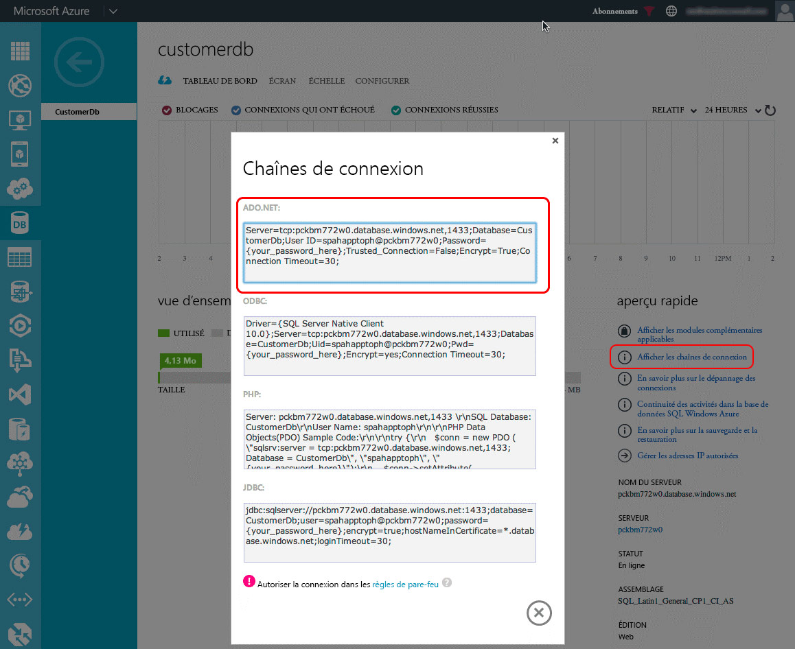
  
    
    
La seconde méthode consiste à obtenir la chaîne de connexion à partir de Visual Studio, à condition que Azure SDK v2.3 soit installé. Dans la fenêtre d'outils **Explorateur d'objets SQL Server** dans Visual Studio, sélectionnez la base de données **CustomerDb**. Une fois la base de données sélectionnée, consultez la fenêtre d'outils **Propriétés** pour voir la chaîne de connexion. Il s'agit de la même valeur que celle trouvée dans le **portail de gestion d'Azure** ci-dessus.
  
    
    

**Obtention de chaînes de connexion de la base de données SQL Azure à partir de Visual Studio, via Azure SDK**

  
    
    

  
    
    
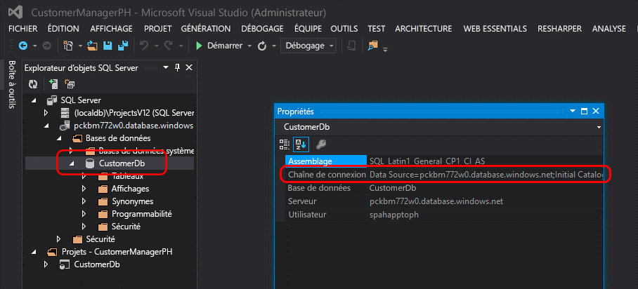
  
    
    

  
    
    

  
    
    

### Créer un Site web Azure

L'étape suivante consiste à créer un Site web Azure sur lequel l'application web distante résidera pour le complément hébergé par un fournisseur. Cette action doit être effectuée en premier car l'URL de l'application web distante est nécessaire avant l'enregistrement du complément. Toutefois, l'enregistrement du complément dans SharePoint doit être effectué avant le déploiement des fichiers pour l'application web ASP.NET, car deux sorties de la procédure d'enregistrement (l'ID client et la clé secrète client) sont nécessaires avant le déploiement des fichiers de l'application web ASP.NET.
  
    
    
Pour créer un Site web Azure, connectez-vous d'abord au **portail de gestion d'Azure** (https://manage.windowsazure.com). Une fois le tableau de bord chargé, cliquez sur le lien de navigation **SITES WEB** dans la marge de gauche, puis sur le bouton **NOUVEAU** dans le pied de page, comme indiqué dans la figure suivante :
  
    
    

**Tableau de bord Site web Azure dans le portail de gestion d'Azure**

  
    
    

  
    
    
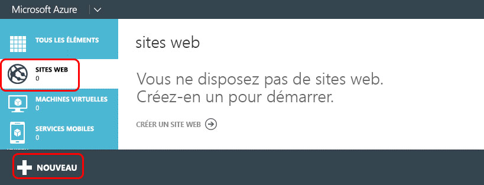
  
    
    
Ensuite, dans l'Assistant Nouveau site web, sélectionnez **CALCULER**, **SITE WEB SITE** et **CRÉATION RAPIDE**, puis spécifiez une **URL** et un **PLAN D'HÉBERGEMENT WEB**. Enfin, spécifiez la **RÉGION** où le site web doit être créé. Veillez à vous rappeler la région sélectionnée, car cette même région sera utilisée pour la Base de données SQL Microsoft Azure qui sera créée plus tard. En outre, si aucun plan d'hébergement web n'existe pour le moment ou que vous en voulez un nouveau, sélectionnez l'option **Créer un plan d'hébergement web**. La figure suivante présente un exemple :
  
    
    

**Création d'un site web Azure dans le portail de gestion d'Azure**

  
    
    

  
    
    
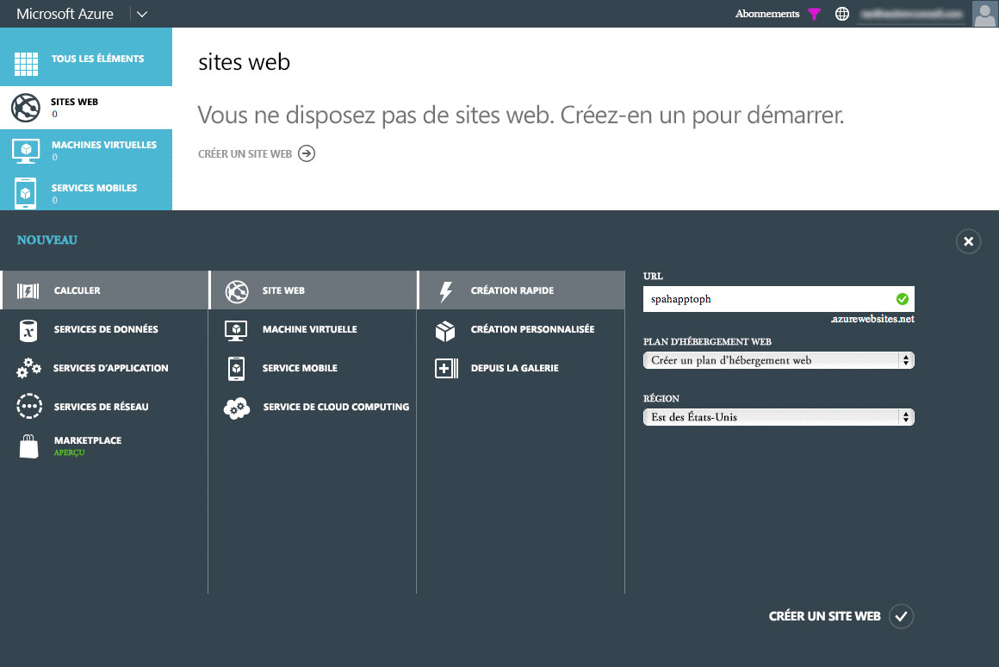
  
    
    
Une fois le Site web Azure créé, notez l'URL qui est utilisée pour le site. Dans les figures ci-dessus, le site créé est  `http://spahapptoph.azurewebsites.net`.
  
    
    

### Enregistrer un nouveau complément

Tous les Compléments SharePoint créés à l'aide du modèle de complément doivent être enregistrés auprès de la batterie de serveurs ou location SharePoint d'hébergement afin d'établir une relation de confiance entre SharePoint et l'application web distante. Ceci implique l'enregistrement d'un nouveau principal de complément auprès de SharePoint, en spécifiant les valeurs suivantes :
  
    
    

- **ID client**: ID du complément
    
  
- **Clé secrète client**: mot de passe du complément
    
  
- **Titre**: nom du complément
    
  
- **Domaine de complément**: domaine de niveau supérieur de l'application web distante
    
  
Quand un complément auto-hébergé est installé dans SharePoint Online, Office 365 crée le principal de complément automatiquement. Il connaît l'URL de l'application web distante car il crée le site automatiquement. Il prend également l'ID client et la clé secrète client, et les ajoute au fichier web.config de l'application web distante. Le fichier web.config est l'emplacement où une classe fournie par Microsoft (dans le fichier TokenHelper.cs ou .vb) pourra les rechercher lors de la validation des demandes et de l'authentification auprès de SharePoint.
  
    
    
Cependant, dans un complément hébergé par un fournisseur, le développeur doit enregistrer manuellement le complément et mettre à jour manuellement le fichier web.config dans le projet web ASP.NET.
  
    
    
Pour enregistrer un nouveau complément, accédez à la page d'enregistrement de complément du site web SharePoint où le complément sera installé. Cette page se trouve ici :  `http://[SharePoint-site-url]/_layouts/15/appregnew.aspx`. Sur la page d'enregistrement de complément, définissez le **type de complément** sur **Un complément s'exécutant sur un serveur web** et cliquez sur les deux boutons **Générer** pour créer un **ID client** et une **clé secrète client**. Entrez le nom du complément dans le champ **Titre** et l'URL du Site web Azure cible créé à l'étape précédente dans le champ **Domaine de complément**. Enfin, cliquez sur le bouton **Créer**.
  
    
    
Une fois le complément enregistré, SharePoint affichera un résumé des informations qui ont été utilisées dans le formulaire pour créer l'enregistrement. Il est très important de copier ces informations par mesure de sécurité, en particulier l'ID client et la clé secrète client, car ceux-ci seront nécessaires lors d'une prochaine étape.
  
    
    

### Modifications de la configuration de l'application web distante/du Site web Azure

L'étape suivante consiste à reconfigurer l'application web distante pour qu'elle puisse être déployée comme un complément hébergé par un fournisseur au lieu d'un complément auto-hébergé. Plusieurs méthodes permettent de déployer un site ASP.NET vers un Site web Azure, dont le déploiement directement à partir de Visual Studio, automatiquement à partir d'un contrôle de code source comme Visual Studio Online, à partir de GitHub, ou même en utilisant la méthode éprouvée du déploiement par FTP. Dans cet article, Visual Studio est utilisé. Toutefois, avant que l'application web ne puisse être déployée, elle nécessite quelques mises à jour pour pouvoir fonctionner avec le complément hébergé par un fournisseur.
  
    
    

#### Mettre à jour le projet d'application web distante

L'importante modification à effectuer dans l'application web MVC ASP.NET se trouve dans le fichier web.config. Dans ce fichier, il existe trois paramètres situés dans le nœud **<appSettings>**. Il s'agit de **ClientId**, **ClientSecret** et **SqlAzureConnectionString**. Les deux premiers sont utilisés par la classe fournie par Microsoft, dans le fichier TokenHelper.cs ou .vb, pour faciliter l'authentification et la communication avec SharePoint à partir de l'application web distante. Le dernier,  `SqlAzureConnectionString`, est utilisé par le complément pour la connexion à la Base de données SQL Microsoft Azure.
  
    
    
Dans un complément SharePoint auto-hébergé, Office 365 remplit les valeurs de ces paramètres lors de la création du Site web Azure et de la Base de données SQL Microsoft Azure au moment de l'installation du complément. Cependant, dans un complément hébergé par un fournisseur, ces paramètres doivent être définis manuellement avant le déploiement du complément.
  
    
    
Une solution consiste à coller les valeurs définies lors des étapes ci-dessus pour les trois paramètres, mais l'inconvénient de cette approche est que, si jamais ces paramètres ont besoin d'être modifiés, le fichier web.config devra être mis à jour et redéployé manuellement sur le Site web Azure.
  
    
    
Une autre solution consiste tout simplement à effacer ces paramètres (sans toucher aux clés des paramètres, en définissant juste l'attribut **value=""** sur une chaîne vide) et à les définir à la place dans les paramètres du Site web Azure via le **portail de gestion d'Azure**. Cette approche signifie que les paramètres peuvent être modifiés sans mettre à jour la base de code.
  
    
    
Pour ce faire, connectez-vous au **portail de gestion d'Azure** (https://manage.windowsazure.com) et accédez au Site web Azure créé au cours des étapes précédentes. Sur la page de tableau de bord du Site web Azure, cliquez sur **CONFIGURER** dans le menu de navigation supérieur, puis faites défiler vers le bas jusqu'à la section **Paramètres de complément**. Ajoutez trois nouveaux paramètres de complément en utilisant les mêmes noms de paramètre que dans le fichier web.config. Utilisez les valeurs obtenues lors des étapes précédentes pour ClientId, ClientSecret et SqlAzureConnectionString.
  
    
    
Assurez-vous que la chaîne de connexion de la Base de données SQL Microsoft Azure est correcte et valide car, lorsque la chaîne de connexion est exposée via le **portail de gestion d'Azure** et Visual Studio, l'attribut de mot de passe est remplacé par un masque. Le mot de passe masqué dans la chaîne de connexion doit être modifié afin d'utiliser le mot de passe correct défini lors de la création du nom de connexion pour la Base de données SQL Microsoft Azure.
  
    
    

#### Déploiement de l'application web distante sur le Site web Azure

À présent, les fichiers de l'application web MVC ASP.NET doivent être déployés vers le Site web Azure en tant qu'application web distante. Dans Visual Studio, cliquez avec le bouton droit sur le projet web et sélectionnez **Publier**. Ceci lance la boîte de dialogue de l'Assistant **Publier le site Web**. Dans cette boîte de dialogue, sélectionnez l'option **Sites Web Windows Azure** et cliquez sur **Publier**.
  
    
    

**Boîte de dialogue Publier le site web dans Visual Studio**

  
    
    

  
    
    
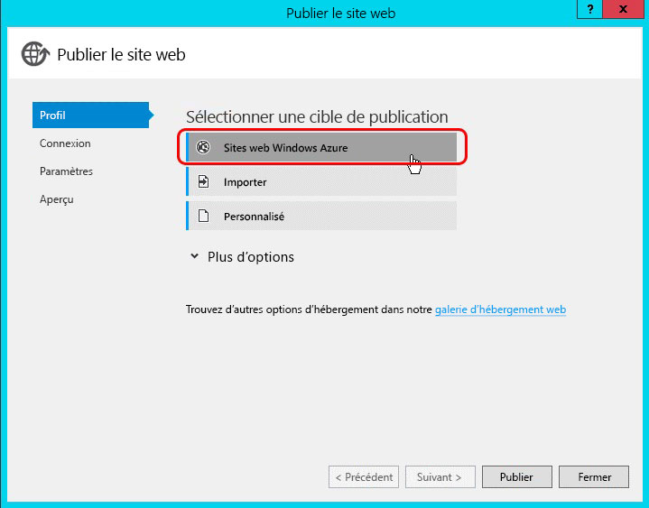
  
    
    
À l'étape suivante, sélectionnez le nom du Site web Azure qui a été créé à l'étape précédente, comme indiqué dans la figure suivante, puis cliquez sur **OK** et veillez à ce que l'URL du site commence par HTTPS.
  
    
    

**Publication de l'application web ASP.NET sur un site web Azure existant**

  
    
    

  
    
    
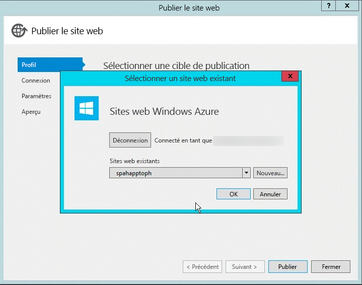
  
    
    
À la dernière étape, cliquez sur le bouton **Valider la connexion** pour garantir le bon état de fonctionnement des paramètres et de la connexion. Enfin, cliquez sur **Publier**. Ceci déclenchera le déploiement de l'application web ASP.NET sur le Site web Azure par Visual Studio.
  
    
    
Après le déploiement du site web, Visual Studio lancera le navigateur de débogage par défaut et accédera au Site web Azure. Toutefois, le site affichera une erreur. Elle est due au fait que les contrôleurs MVC ASP.NET disposent d'un attribut (plus précisément l'attribut  `SharePointContextFilter`) qui s'attend à ce que SharePoint envoie certaines valeurs au contrôleur dans l'en-tête d'une requête HTTP POST. Cependant, le navigateur a lancé par défaut une requête HTTP GET ; cette erreur est donc attendue.
  
    
    

    
> [!REMARQUE]
> Reportez-vous à la documentation Azure pour connaître des options supplémentaires pour le déploiement d'applications web ASP.NET sur un Site web Azure :  [Procédure de déploiement d'un site web Microsoft Azure](http://azure.microsoft.com/fr-fr/documentation/articles/web-sites-deploy). 
  
    
    

#### Actions à effectuer après le déploiement

L'étape suivante consiste à copier l'adresse URL du site.
  
    
    

#### Certificats SSL et domaines personnalisés pour des Sites web Azure

Tous les Sites web Azure utilisent la convention d'affectation de noms suivante :  `http[s]://[site-name].azurewebsites.net`. Microsoft a déjà ajouté un certificat SSL avec caractères génériques à tous les sites web sous le domaine  `*.azurewebsites.net`, mais les clients sont libres d'associer un domaine personnalisé à leur Site web Azure, ainsi que d'utiliser leurs propres certificats SSL pour ces domaines personnalisés.
  
    
    
Pour plus d'informations sur l'utilisation des domaines personnalisés, reportez-vous à la documentation Azure :  [Configuration d'un nom de domaine personnalisé pour un site web Microsoft Azure](http://azure.microsoft.com/fr-fr/documentation/articles/web-sites-custom-domain-name). Pour plus d'informations sur l'ajout d'un certificat SSL personnalisé pour votre nom de domaine personnalisé, reportez-vous à la documentation Azure :  [Activation du protocole HTTPS pour un site web Microsoft Azure](http://azure.microsoft.com/fr-fr/documentation/articles/web-sites-configure-ssl-certificate).
  
    
    

### Reconfiguration du projet de complément SharePoint

La dernière étape consiste à reconfigurer le projet de complément SharePoint. Le projet Visual Studio pour le complément SharePoint est configuré en tant que complément de type auto-hébergé. Tout d'abord, convertissez le complément auto-hébergé en complément hébergé par un fournisseur en ouvrant le fichier AppManifest.xml dans le projet de complément SharePoint et en remplaçant **Autohébergement** par **Hébergement par un fournisseur** dans l'option **Type d'hébergement**.
  
    
    
En outre, définissez la **page de démarrage** du complément pour qu'elle pointe vers l'URL de la page de démarrage de l'application web distante, c'est-à-dire l'URL du Site web Azure. Veillez à inclure la valeur de la chaîne de requête{StandardTokens}, si ce n'est pas le cas. Cela garantit l'ajout par SharePoint des principaux jetons de chaîne de requête à l'URL lors de l'ouverture de l'application web distante.
  
    
    
Ensuite, supprimez la référence à l'application web MVC ASP.NET dans le projet de complément SharePoint en sélectionnant le projet de complément SharePoint dans l' **Explorateur de solutions** de Visual Studio. Puis, dans la fenêtre d'outils **Propriétés**, définissez la propriété **Projet web** sur **(Aucun)**, comme indiqué dans la figure 20 :
  
    
    

**Suppression de l'application web distante dans le package de complément SharePoint**

  
    
    

  
    
    
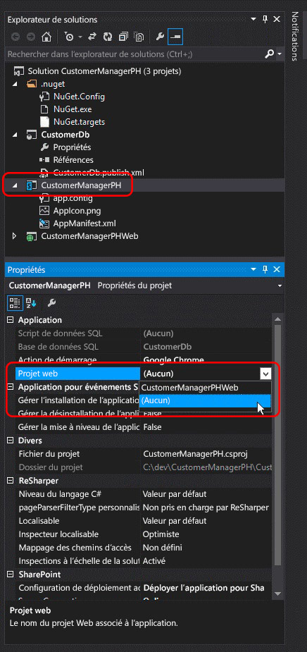
  
    
    
La dernière étape exige une mise à jour manuelle du fichier AppManifest.xml car certains paramètres ne sont pas affichés dans le concepteur. Pour ce faire, enregistrez les modifications existantes dans le fichier AppManifest.xml, puis cliquez avec le bouton droit sur le même fichier dans l' **Explorateur de solutions** et sélectionnez **Mode Code**.
  
    
    

**Ouverture du fichier AppManifest.xml dans le mode Code**

  
    
    

  
    
    
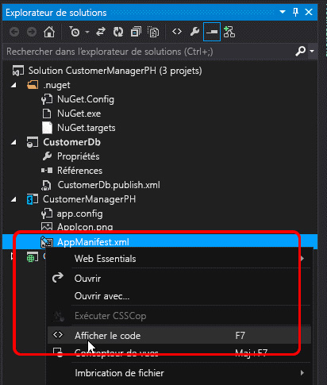
  
    
    
Dans le mode Code du fichier AppManifest.xml, supprimez les deux références au projet d'application web MVC ASP.NET et au projet d'application de la couche Données SQL car elles ne sont pas nécessaires dans un complément SharePoint hébergé par un fournisseur.
  
    
    
Ensuite, créez un GUID et remplacez le GUID existant dans l'attribut **ProductId**. Ceci signalera à SharePoint qu'il s'agit d'un nouveau complément et non d'une mise à jour d'un complément existant.
  
    
    

    
> [!IMPORTANTE]
> Si le ProductId existant était utilisé, SharePoint indiquerait l'erreur suivante lors de l'installation du complément converti : « Le complément fourni diffère d'un autre complément doté d'un ID de version et de produit identiques ». 
  
    
    

Ensuite, trouvez l'élément **<RemoteWebApplication>** et mettez à jour l'attribut **ClientId** afin qu'il soit identique au GUID obtenu lors de l'enregistrement du complément auprès de SharePoint et qui a été utilisé dans les paramètres de complément du fichier web.config du Site web Azure.
  
    
    

**Définition du ClientId pour un complément SharePoint hébergé par un fournisseur**

  
    
    

  
    
    
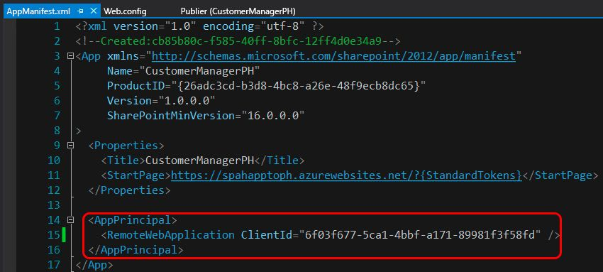
  
    
    
Une fois toutes les modifications apportées au fichier AppManifest.xml enregistrées, le complément est maintenant prêt à être testé en tant que complément SharePoint hébergé par un fournisseur. Déployez le complément sur une batterie de serveurs SharePoint ou sur un site SharePoint Online pour vérifier que les étapes de conversion ont été effectuées correctement.
  
    
    

## Autres ressources

Pour plus d'informations sur le modèle de complément SharePoint, le modèle de complément ou les compléments SharePoint hébergés par un fournisseur, suivez le  [Blog de développeurs Office](http://blogs.office.com/dev/) afin d'obtenir des informations et des mises à jour sur les outils de développement, les scripts et les utilitaires d'aide à la création de compléments SharePoint et à la migration de compléments auto-hébergés en compléments hébergés par un fournisseur.
  
    
    

