# Créer un complément de gestion des informations professionnelles dans le Cloud qui utilise la passerelle SAP
 Découvrez comment générer le complément LightSwitch SharePoint hébergé par un fournisseur pour accéder aux données SAP à l'aide de la Passerelle SAP pour Microsoft.
Cet article décrit les étapes clés suivies par l'équipe de développement chez Microsoft pour créer un complément LightSwitch SharePoint hébergé par un fournisseur qui peut accéder aux données SAP à l'aide de la Passerelle SAP pour Microsoft. Ce complément prend en charge les opérations CRUD sur les données SAP et peut être utilisé pour afficher des images d'une bibliothèque d'images SharePoint et télécharger des images vers cette bibliothèque.


Cet article a pour objectif de décrire les points clés du complément pouvant vous aider à créer des compléments similaires. L'exemple de code est fourni et lié à l'article pour que vous puissiez voir comment la solution a été créée, afin de renforcer votre apprentissage.
 **Téléchargement d'exemples :** [ Exemple : développement d'un complément de gestion des informations professionnelles dans le cloud pour accéder à la Passerelle SAP pour Microsoft](https://code.msdn.microsoft.com/Sample-Developing-a-Cloud-25d6d1ea)


## Avant de commencer

Les éléments suivants sont des conditions préalables à la réalisation des procédures de cet article :


- **Un Site du développeur Office 365** dans un domaine Office 365 associé à un client Microsoft Azure Active Directory (Azure AD). Voir [Inscrivez-vous à un site du développeur Office 365, configurez vos outils et votre environnement, et commencez à déployer des compléments](http://msdn.microsoft.com/fr-fr/library/office/fp179924%28v=office.15%29.aspx) ou [Procédure : Créer un site du développeur dans votre abonnement Office 365 existant](http://msdn.microsoft.com/fr-fr/library/office/jj692554%28v=office.15%29.aspx).


- **Visual Studio 2013 avec la mise à jour 4** ou une version ultérieure, que vous pouvez télécharger sur la page [Bienvenue dans Visual Studio 2013](http://msdn.microsoft.com/fr-fr/library/dd831853.aspx).


- **Outils de développement Microsoft Office pour Visual Studio.** La version incluse dans la mise à jour 4 de Visual Studio 2013 ou une version ultérieure.


- La **Passerelle SAP pour Microsoft** qui est déployée et configurée dans Microsoft Azure. Pour en savoir plus, consultez la page [Passerelle SAP pour Microsoft](http://go.microsoft.com/fwlink/?LinkId=507635).


- **Un compte d'entreprise dans Microsoft Azure.** Voir [Créer un compte d'utilisateur professionnel dans Azure AD](http://go.microsoft.com/fwlink/?LinkID=512580)

    > **REMARQUE**
    > Connectez-vous à votre compte Office 365 (login.microsoftonline.com) pour modifier le mot de passe temporaire une fois le compte créé. 
- **Un point de terminaison OData SAP** contenant des exemples de données. Pour en savoir plus, consultez [Passerelle SAP pour Microsoft](http://go.microsoft.com/fwlink/?LinkId=507635).


- **Quelques connaissances de base sur Azure AD.** Reportez-vous à [Présentation d'Azure AD](http://msdn.microsoft.com/fr-fr/library/azure/dn655157.aspx).


- **Quelques connaissances de base sur la création de compléments SharePoint.** Voir [Procédure : Créer un complément SharePoint de base hébergé par un fournisseur](http://msdn.microsoft.com/fr-fr/library/office/fp142381%28v=office.15%29.aspx).


- **Quelques connaissances de base d'OAuth 2.0 dans Azure AD**. Pour en savoir plus, consultez les rubriques sous [OAuth 2.0 dans Azure AD](http://msdn.microsoft.com/library/azure/dn645545.aspx).


## Présentation de la solution

Contoso Motors est une société fictive spécialisée dans la vente de voitures qui représente une entreprise réelle dans laquelle un concessionnaire d'automobiles partage des informations sur son inventaire d'automobiles avec des représentants de vente et d'autres concessionnaires auxquels il est affilié. Grâce à ce complément, les vendeurs peuvent vérifier l'état actuel de leur inventaire automobile, auquel le complément accède directement à partir de SAP au moyen de la Passerelle SAP pour Microsoft. Toutes les données sont stockées dans SAP, et une image de chaque voiture est enregistrée dans une bibliothèque d'images dans SharePoint Online. Les données issues de SAP et la bibliothèque d'images SharePoint sont réunies et affichées par ce complément. Dans le complément, les gestionnaires et les administrateurs peuvent effectuer des opérations CRUD sur les données détaillées relatives à chaque voiture dans SAP.


Dans l'exemple de cet article, le complément SellerDashboard manipule les données de l'inventaire automobile de SAP et son image dans la bibliothèque d'images SharePoint. Dans ce complément, les opérations CRUD (créer, lire, mettre à jour et supprimer) sont prises en charge sur les informations détaillées relatives à chaque voiture dans SAP.


> **CONSEIL**
> Pour obtenir une démonstration vidéo de ce complément, regardez la vidéo  [Webinaire technique : Passerelle SAP pour Microsoft et modèle de développement Microsoft Azure](http://go.microsoft.com/fwlink/?LinkId=517378) sur BrightTalk. La démonstration de la fonctionnalité du complément démarre après 48 minutes.


 **Architecture de code**


La solution SellerDashboard comprend huit projets et, comme illustré par l'image suivante, est divisée en deux catégories : BoxXDataStudio et SellerDashboardStudio.


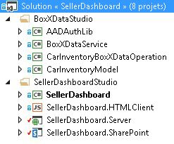


### BoxXDataStudio

Cette catégorie comprend tous les composants nécessaires pour interagir avec la Passerelle SAP pour Microsoft.


- **AADAuthLib**

    Ce composant est utilisé pour extraire le  [flux d'octroi d'un code d'autorisation Azure AD](https://msdn.microsoft.com/fr-fr/library/azure/dn645542.aspx), qui utilise un modèle Singleton.

    L'extrait de code suivant indique la fonction principale, fournie par le composant AADAuthLib. Pour plus de détails, voir la classe d'assistance de l'exemple de code AADAuthLib/AuthUtil.cs.


 ```cs

// Use the auth code, acquire the refresh token and access token, and store them in the current session
        public bool AcquireTokenFromAuthCode(string authCode, string redirectUrl = "redirectUrl")
        {
            if (!IsAuthorized &amp;&amp; !string.IsNullOrEmpty(authCode))
            {
                AuthenticationResult authResult = _authContext.AcquireTokenByAuthorizationCode(authCode,
                    new Uri(ConfigurationManager.AppSettings["ida:" + redirectUrl]),
                    _clientCredential,
                    ConfigurationManager.AppSettings["ida:ResourceUrl"]);

                HttpContext.Current.Session["RefreshToken"] = authResult.RefreshToken;
                HttpContext.Current.Session["AccessToken-" + ConfigurationManager.AppSettings["ida:ResourceUrl"]] = new Tuple<string, DateTimeOffset>(authResult.AccessToken, authResult.ExpiresOn);

                return true;
            }

            return false;
  }

 // Provide the access token, which is stored in the current session, if the access token expired, use the refresh token get a new one.
 public string AccessToken
        {
            get
            {
                if (!IsAuthorized) throw new UnauthorizedAccessException();

                var accessToken = HttpContext.Current.Session["AccessToken-" + ConfigurationManager.AppSettings["ida:ResourceUrl"]] as Tuple<string, DateTimeOffset>;

                if (IsAccessTokenValid(accessToken))
                {
                    return accessToken.Item1;
                }

                accessToken = RenewAccessToken();
                HttpContext.Current.Session["AccessToken-" + ConfigurationManager.AppSettings["ida:ResourceUrl"]] = accessToken;

                return accessToken.Item1;
            }
  }
 ```

- **BoxXDataService**

Il s'agit d'un service RIA WCF, qui est l'interface utilisée par le composant SellerDashboard côté serveur hébergé dans Azure, et qui utilise la source de données SAP de la Passerelle SAP pour Microsoft.

L'extrait de code suivant est la méthode web CRUD, prise en charge par le service RIA WCF. Pour plus de détails, voir BoxXDataService/BoxXDataService.cs.


 ```cs

[Query(IsDefault = true)]
        public IQueryable<InventoryItem> GetAllCarInventory()
        {
            BoxXDataReader dataReader = BoxXDataReader.Instance;
            IInventoryCollection dataCollection = ModelFactory.CreateInventoryCollection(dataReader.SchemaPropertyNames);
            IInventoryQuery query = QueryFactory.CreateQuery();
            dataReader.GetData(dataCollection, query);

            return dataCollection.Items.Cast<InventoryItem>().AsQueryable();
        }

        [Update]
        public void UpdateCarInventoryItem(InventoryItem carInventoryItem)
        {
            BoxXDataUpdater dataUpdater = BoxXDataUpdater.Instance;
            dataUpdater.UpdateInventoryItem(carInventoryItem);
        }

        [Insert]
        public void InsertCarInventoryItem(InventoryItem carInventoryItem)
        {
            BoxXDataCreater dataCreater = BoxXDataCreater.Instance;
            dataCreater.CreateInventoryItem(carInventoryItem);
        }

        [Delete]
        public void DeleteCarInventoryItem(InventoryItem carInventoryItem)
        {
            BoxXDataDeleter.DeleteInventoryItem(carInventoryItem.ID);
 }
 ```

- **CarInventoryBoxXDataOperation**

    Il s'agit de l'implémentation CRUD réelle pour BoxXDataService. L'image suivante illustre l'architecture de code principale de CarInventoryBoxXDataOperation. L'espace de noms CRUD est utilisé pour implémenter les opérations CRUD, et l'espace de noms Util est le code d'assistance pour l'espace de noms CRUD.

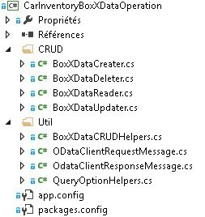


- **CarInventoryModel**

    Il s'agit d'un projet de bibliothèque utilisé pour implémenter les utilitaires et le modèle de données. La définition du modèle de données doit correspondre aux métadonnées du point de terminaison OData utilisé par la Passerelle SAP pour Microsoft, qui est basé sur le schéma de données SAP. BoxXDataService et CarInventoryBoxXDataOperation l'utilisent pour convertir l'élément de base de données SAP en instance d'inventaire de voitures.

    L'image suivante illustre les principaux composants.


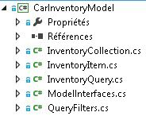


### SellerDashboardStudio

SellerDashboardStudio comprend des composants standard du complément SharePoint LightSwitch.


- **SellerDashboard**

    SellerDashboard est le projet StartUp utilisé pour publier le complément SellerDashboard sur le site web d'Azure et son complément SharePoint sur le site du développeur SharePoint.


- **SellerDashboard.HTMLClient**

    Ce composant inclut les écrans, un contrôle personnalisé et un contrôle de téléchargement de photos. L'image suivante illustre les principaux composants.


- 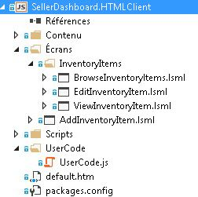


SellerDashboard.HTML.Client comprend les quatre écrans suivants :

  - BrowseInventoryItems est l'écran d'accueil, utilisé pour parcourir les informations de base pour tous les objets de l'inventaire.


  - ViewInventoryItem est l'écran détaillé, utilisé pour afficher une vue détaillée pour chaque élément de l'inventaire.


  - EditInventoryItem est un écran contextuel d'édition, utilisé pour modifier un élément d'inventaire.


  - AddInventoryItem est un écran contextuel d'ajout, utilisé pour ajouter un nouvel élément d'inventaire.


    Le fichier UserCode.js inclut le code de contrôle personnalisé UX.

    Les fichiers photohelper.js et sharepointauthhelper.js, inclus dans le dossier Scripts, sont basés sur les directives fournies dans l'article  [Procédure pas à pas : création d'un complément SharePoint à l'aide de LightSwitch](http://msdn.microsoft.com/fr-fr/library/jj969621.aspx).


- **SellerDashboard.Server**

    Ce composant comprend la source de données RIA WCF, la source de données SharePoint et l'API web de téléchargement de photos. L'image suivante illustre les principaux composants.

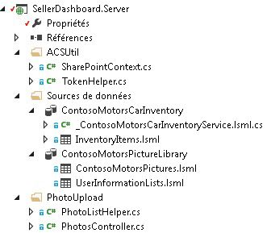


SharePointContext.cs et TokenHelper.cs sont les classes d'assistance qui fournissent le contexte client pour l'authentification par rapport à SharePoint. Ceci permet d'utiliser l'API web de téléchargement de photos pour télécharger des photos de voitures dans la bibliothèque d'images. Les fichiers PhotoListHelper.cs et PhotosController.cs implémentent l'API web de téléchargement de photos. Pour plus d'informations sur l'API web de téléchargement de photos utilisée par LightSwitch, consultez l'article  [Procédure pas à pas : création d'un complément SharePoint à l'aide de LightSwitch](http://msdn.microsoft.com/fr-fr/library/jj969621.aspx).


- **SellerDashboard.SharePoint**

    Ce composant est inclus après la solution LightSwitch pour activer le projet SharePoint. Vous pouvez utiliser ce composant pour configurer le site SharePoint utilisé pour la bibliothèque d'images et pour définir les autorisations requises pour le complément. SellerDashboard doit disposer du niveau d'autorisation Contrôle total sur le site SharePoint qui héberge la bibliothèque d'images.


## Mise en œuvre


### Vue d'ensemble

L'image suivante illustre les composants qui forment le SellerDashboard. La ligne continue indique le flux de données et la ligne pointillée indique le flux OAuth. Les composants verts concernent les opérations de données SAP, les composants bleus concernent l'opération de la bibliothèque d'images SharePoint et les composants orange décrivent les opérations de l'application SellerDashboard entière.  


 **Solution SellerDashboard**


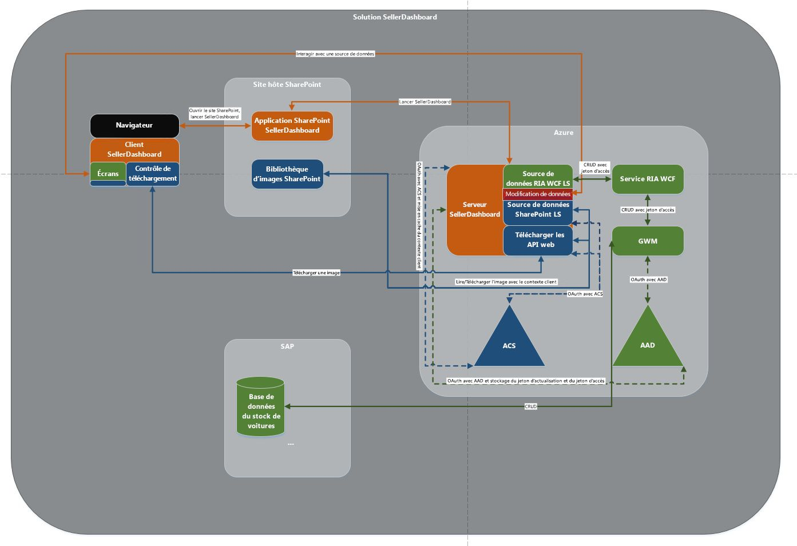


### Mashup de données

LightSwitch prend en charge le mashup de données en ajoutant une relation entre les deux sources de données dans le concepteur.


 **Source de données SAP**


-  *Schéma de données dans la base de données SAP* 

    L'extrait de code suivant illustre un exemple de schéma de données de la Passerelle SAP pour Microsoft.


 ```XML

<?xml version="1.0" encoding="UTF-8"?> 
- <edmx:Edmx xmlns:sap="http://www.sap.com/Protocols/SAPData" xmlns:m="http://schemas.microsoft.com/ado/2007/08/dataservices/metadata" 
xmlns:edmx:"http://schemas.microsoft.com/ado/2007/06/edmx" Version="1.0">
   - <edmx:DataServices m:DataServiceVersion="2.0">
      - <Schema xml:lang="en" xmlns="http://schemas.microsoft.com/ado/2008/09/edm" Namespace="ZCAR_POC_SRV">
         - <EntityType sap:content-version="1" Name="ContosoMotors">
              - <Key>
                     <PropertyRef Name="ID"/>
               </Key>
               <Property Name="ContactPhone" Type="Edm.String"/>
               <Property Name="ContactEmail" Type="Edm.String"/>
               <Property Name="ID" Type="Edm.Int32" Nullable="false"/>
               <Property Name="BuyerEmail" Type="Edm.String" MaxLength="255"/>
               <Property Name="MaxPower" Type="Edm.Int32" Nullable="false"/>
               <Property Name="Engine" Type="Edm.String" Nullable="false" MaxLength="255"/>
               <Property Name="BodyStyle" Type="Edm.String" Nullable="false" MaxLength="255"/>
               <Property Name="Transmission" Type="Edm.String" Nullable="false" MaxLength="255"/>
               <Property Name="Year" Type="Edm.Int32" Nullable="false"/>
               <Property Name="Model" Type="Edm.String" Nullable="false" MaxLength="255"/>
               <Property Name="Brand" Type="Edm.String" Nullable="false" MaxLength="255"/>
               <Property Name="ExtColor" Type="Edm.String" Nullable="false" MaxLength="255"/>
              <Property Name="IntColor" Type="Edm.String" Nullable="false" MaxLength="255"/>
              <Property Name="ContactName" Type="Edm.String" Nullable="false" MaxLength="255"/>
              <Property Name="Price" Type="Edm.String" Nullable="false"/>
              <Property Name="StockNo" Type="Edm.String" Nullable="false"/>
              <Property Name="Arrived_Date" Type="Edm.DateTime" Nullable="false" Precision="0"/>
              <Property Name="Status" Type="Edm.String" Nullable="false" MaxLength="255"/>
      </EntityType>
   - <EntityContainer Name="ZCAR_POC_SRV_Entities" m:IsDefaultEntityContainer="true">
          <EntitySet sap:content-version="1" Name="ContosoMotorsCollection" sap:searchable="true" EntityType="ZCAR_POC_SRV.ContosoMotors"/>
     </EntityContainer>
     <atom:link xmlns:atom="http://www.w3.org/2005/Atom" href="http://contoso.cloudapp.net:8080/perf/sap/opu/odata/sap/ZCAR_POC_SRV/$metadata" rel="self"/>
     <atom:link xmlns:atom="http://www.w3.org/2005/Atom" href="http://contoso.cloudapp.net:8080/perf/sap/opu/odata/sap/ZCAR_POC_SRV/$metadata" rel="latest-version"/>
</Schema>
</edmx:DataServices>
</edms:Edmx>           

 ```


Il s'agit de notre base de données de test, et le type de propriété et la valeur Nullable sont basés sur le scénario. L'ID est PropertyRef et l'opération CRUD OData est basée sur l'ID. La propriété StockNo est utilisée pour effectuer le mashup des données avec la photo de la voiture qui est enregistrée dans la bibliothèque d'images SharePoint.


-  *Modèle de données défini pour le service RIA* 

 ```cs

public interface IInventoryItem
    	{
        IEnumerable<InventoryPropertyName> ValidPropertyNames { get; }
        bool IsValid { get; }

        int ID { get; set; }
        DateTime ArrivedDate { get; set; }
        string BodyStyle { get; set; }
        string Brand { get; set; }
        string BuyerEmail { get; set; }
        string ContactEmail { get; set; }
        string ContactName { get; set; }
        string ContactPhone { get; set; }
        string Engine { get; set; }
        string ExtColor { get; set; }
        IEnumerable<Uri> Images { get; }
        string IntColor { get; set; }
        int MaxPower { get; set; }
        string Model { get; set; }
        decimal Price { get; set; }
        bool Removed { get; }
        string Status { get; set; }
        string StockNo { get; set; }
        string Transmission { get; set; }
        int Year { get; set; }

        void AddImageUrl(Uri url);
        bool CopyFrom(IInventoryItem other);
        object GetPropertyValue(InventoryPropertyName property);
        void MarkAsRemoved();
        void SetPropertyValue(InventoryPropertyName property, object value);
       }

    	public interface IInventoryCollection
       {
        IEnumerable<InventoryPropertyName> QueriedPropertyNames { get; }
        IEnumerable<IInventoryItem> Items { get; }
        bool Valid { get; }

        IInventoryItem this[int id] { get; }
        bool Contains(int id);
        void AddItem(IInventoryItem inventoryItem);
        IInventoryCollection Filter(Predicate<IInventoryItem> match);
        bool CopyFrom(IInventoryCollection other);
}

 ```


Toute propriété qui n'est pas incluse dans le schéma de la base de données SAP peut être ignorée. Par exemple, la propriété **Images** a été ajoutée ici à des fins d'évolutivité. Ce modèle de données est une couche intermédiaire entre la base de données SAP réelle et la source de données SellerDashboard.Server. Le projet LightSwitch a deux composants : View et Server. Lorsque vous ajoutez une source de données externe côté serveur, LightSwitch vous aide à créer une couche de données abstraite qui est ajoutée à la source de données côté serveur.

La plupart des propriétés ont le même type que les propriétés dans le schéma de base de données SAP, sauf pour StockNo, dont le type **int** a été modifié et défini sur **string**. Ceci est dû au fait que StockNo est utilisé comme un moyen de définir la relation entre les données de SAP et la bibliothèque d'images SharePoint.

> **CONSEIL**
> StockNo doit avoir le type **string**, car la valeur stockée dans la bibliothèque d'images SharePoint est **Text**. Ces deux types doivent correspondre afin d'accomplir le mashup de données.

La mise en œuvre des deux interfaces est dans CarInventoryModel/InventoryItem.cs et CarInventoryModel/InventoryCollection.cs.


-  *Source de données utilisée par LightSwitch côté serveur* 

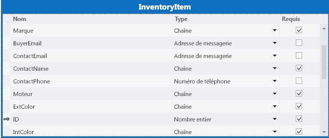


Dans le serveur de SellerDashboard, lorsque vous ajoutez le service RIA WCF (BoxXDataService), le modèle de données qui est défini dans CarInventoryModel est inclus, et vous obtenez le tableau de données pertinent. Vous pouvez changer le type de certaines propriétés. Par exemple, vous pouvez changer le type **BuyerEmail** **String** sur **Email Address**, et LightSwitch prendra en charge la vérification du format électronique côté client.


 **Bibliothèque d'images SharePoint**


La bibliothèque d'images dans le site hôte de SharePoint s'appelle ContosoMotorsPictureLibrary, et contient trois nouvelles colonnes nommées StockNo, ThumbnailUrl et FullImageUrl. Toutes sont configurées en tant que champs **Text**.


> **CONSEIL**
> Les noms des colonnes sont sensibles à la casse. 


 La colonne StockNo est utilisée pour créer une relation avec les données SAP. Les colonnes ThumbnailUrl et FullImageUrl sont utilisées pour obtenir l'URL vers l'image pertinente d'une manière pratique.


 *Source de données utilisée par LightSwitch côté serveur* 


ContosoMotorsPicture est un modèle de source de données LightSwitch qui correspond à la bibliothèque d'images du site hôte de SharePoint sur LightSwitch côté serveur.


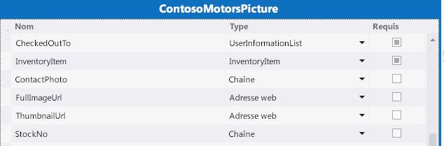


 **Relation de données**


Ajoutez une relation un-à-zéro ou une relation un-à-un entre InventoryItem et ContosoMotorsPicture. L'image suivante illustre à quoi elle ressemble, en utilisant LightSwitch dans Visual Studio


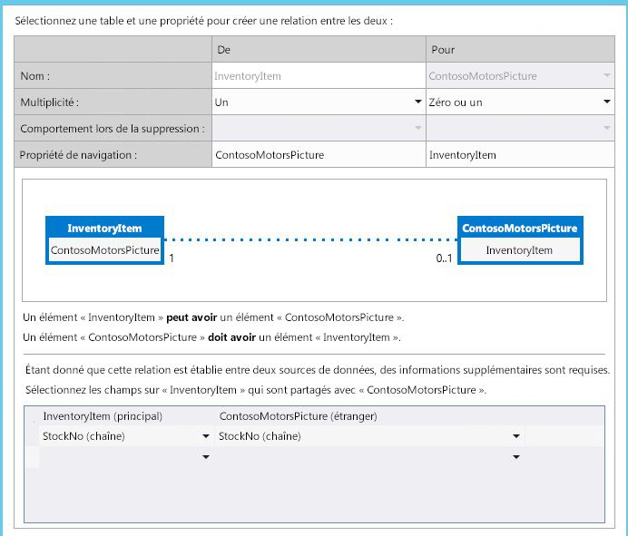


### OAuth avec Azure AD et ACS

Cette section donne un aperçu de la façon dont le complément met en œuvre OAuth dans Azure AD et les services de contrôle d'accès (ACS).


 **Vue d'ensemble**


SellerDashboard est un complément hôte de fournisseur de SharePoint qui doit fonctionner sur les deux sources de données : la bibliothèque d'images SharePoint et les données SAP au moyen de la Passerelle SAP pour Microsoft.


Pour accéder à la bibliothèque d'images SharePoint, SellerDashboard doit effectuer une authentification par rapport à ACS, et obtenir un jeton d'accès de ces services. Pour accéder aux données SAP, cependant, SellerDashboard doit obtenir un jeton d'accès différent d'Azure AD, car la Passerelle SAP pour Microsoft utilise Azure AD pour l'authentification et l'autorisation.


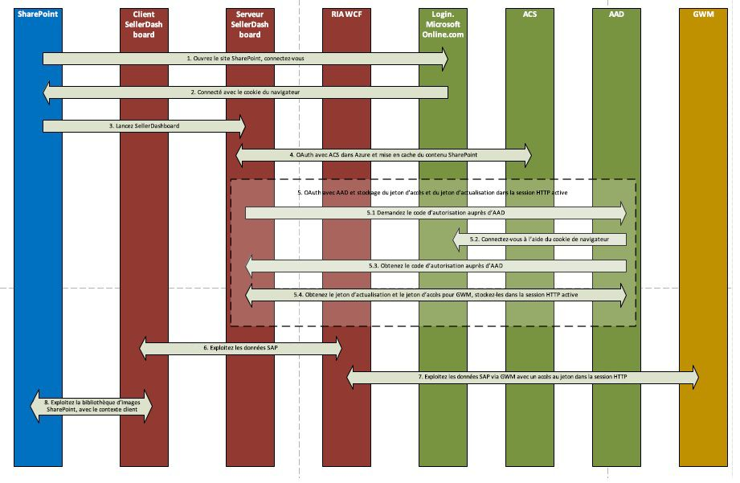


 **Mise en œuvre**


SellerDashboard est un complément SharePoint hébergé par un fournisseur qui prend en charge l'opération de téléchargement de photos en utilisant le modèle objet côté client SharePoint. Le contexte de SharePoint, qui est utilisé pour créer le contexte client pour l'hôte SharePoint, est mis en cache, et le contexte client est ensuite utilisé par l'API web de téléchargement.


À la fin du processus OAuth avec ACS, la demande d'authentification est envoyée à AD Azure. Pour ce faire, le complément utilise un cookie pour se connecter à Login.MicrosoftOnline.com, puis effectuer le flux de code d'autorisation d'Azure AD, qui renvoie un jeton d'actualisation que le complément met en cache pour les futures demandes d'authentification pendant la session. Voici le code qui est utilisé pour ce processus.


```cs

protected override void Page_Load(object sender, EventArgs e)
{
    if (!IsPostBack)
    {
 SharePointContext spContext = SharePointContextProvider.Current.GetSharePointContext(Context);
        if (spContext != null)
        {
     // Cache the SharePoint Context, which will be used to create Client Context for SharePoint host
            _spContext = spContext;
        }

		
        // Acquire refresh token and access token, and store them in the current session, which will be used do the OAuth with AAD for operating the SAP data
        AuthUtil.Instance.AcquireTokenFromAuthCode(Request.QueryString["code"]);

        if (!AuthUtil.Instance.IsAuthorized)
        {
             Response.Redirect(AuthUtil.Instance.AuthCodeUrl);
        }
     }

     base.Page_Load(sender, e);
 }
```

Pour plus de détails, voir SellerDashBoard.Server/SharePointLaunch.aspx.cs et AADAuthLib/AuthUtil.cs dans l'exemple de code.


SellerDashboard.Server inclut les fichiers SharePointContext.cs et TokenHelper.cs, qui sont utilisés pour obtenir le contexte du client d'application uniquement pour l'hôte SharePoint. Ces deux fichiers sont ajoutés automatiquement à votre projet SharePoint par Visual Studio. (Visual Studio nomme le projet < *nomdevotreprojet*  >Web ; par exemple, SharePointAppWeb.) Vous pouvez ensuite copier ces deux fichiers dans votre code source de complément SellerDashboard et les inclure dans votre projet.


### Opérations CRUD sur des données SAP de la Passerelle SAP pour Microsoft

Les extraits de code suivants indiquent la logique de code principale des opérations CRUD. Pour plus de détails, voir la mise en œuvre de CarInventoryBoxXDataOperation dans l'exemple de code.


 **BoxXDataCreater**


```cs

        public void CreateInventoryItem(IInventoryItem inventoryItem)
        {
            if (_model == null)
            {
                _model = BoxXDataCRUDHelpers.GetMetadata(BoxXDataCRUDHelpers.MetadataUrl);
            }

            // Create new entry request generate
            var requestMessage = new ODataClientRequestMessage(new Uri(BoxXDataCRUDHelpers.DataCollectionUrl),
                                                                ODataConstants.MethodPost);
            BoxXDataCRUDHelpers.CreateEntryRequestHeaderSetter(requestMessage, AuthUtil.Instance.AccessToken);
            BoxXDataCRUDHelpers.SetODataRequestContent(requestMessage, _model, inventoryItem);

            // Create new entry request execute
            IODataResponseMessage responseMessage = requestMessage.GetResponse();

        }
BoxXDataReader
 public void GetData(IInventoryCollection dataCollection, IInventoryQuery query)
        {
            GetValueWithoutLocallyFiltering(dataCollection, query);

            if (query.Filters.Any())
            {
                var filteredCollection = dataCollection.Filter(inventoryItem =>
                    query.Filters.Any(filter => filter.Match(inventoryItem)));

                dataCollection.CopyFrom(filteredCollection);
            }
        }
```

 **BoxXDataUpdater**


```cs

public void UpdateInventoryItem(IInventoryItem inventoryItem)
        {
            if (_model == null)
            {
                _model = BoxXDataCRUDHelpers.GetMetadata(BoxXDataCRUDHelpers.MetadataUrl);
            }

            // Update existing entry request generate
            var requestMessage = new ODataClientRequestMessage(new Uri(BoxXDataCRUDHelpers.DataCollectionUrl + '(' + inventoryItem.ID + ')'),
                                                                ODataConstants.MethodPut);
            BoxXDataCRUDHelpers.UpdateEntryRequestHeaderSetter(requestMessage, AuthUtil.Instance.AccessToken);
            BoxXDataCRUDHelpers.SetODataRequestContent(requestMessage, _model, inventoryItem);

            // Update existing entry request execute
            IODataResponseMessage responseMessage = requestMessage.GetResponse();
        }
BoxXDataDeleter
 public static void DeleteInventoryItem(int ID)
        {
            // Delete existing entry request generate
            var requestMessage = new ODataClientRequestMessage(new Uri(BoxXDataCRUDHelpers.DataCollectionUrl + '(' + ID + ')'),
                                                                ODataConstants.MethodDelete);
            BoxXDataCRUDHelpers.DeleteEntryRequestHeaderSetter(requestMessage, AuthUtil.Instance.AccessToken);

            // Delete existing entry request execute
            IODataResponseMessage responseMessage = requestMessage.GetResponse();
        }
```


### Téléchargement de photos vers la bibliothèque d'images SharePoint

La commande de téléchargement de photos et la mise en œuvre de l'API web de téléchargement de photos sont utilisées pour télécharger des photos vers la bibliothèque d'images SharePoint, à l'aide du code suivant, basé sur les directives fournies dans l'article  [Procédure pas à pas : création d'un complément SharePoint à l'aide de LightSwitch](http://msdn.microsoft.com/fr-fr/library/jj969621.aspx).


 **Pour les changements de photohelper.js :**


Un nouveau champ est ajouté pour l'uploadForm, qui est utilisé pour transmettre le StockNo à l'API web de téléchargement de photos.


```

uploadForm = $(
             '<form id="uploadForm" method="POST" enctype="multipart/form-data" action="' + API_URL + '"  data-ajax="false" target="uploadTargetIFrame">' +
             '   <input name="fileInput" id="fileInput" type="file" size="30" data-theme="c" accept="image/*" multiple="true"/>' +
             '   <input type="hidden" name=' + screen.InventoryItem.StockNo + '>' +
             '</form>');

```

Ajoutez la logique de mise en cache de l'URL de l'image, et la logique de restauration de l'image.


```

function completeUpload(uploadedFiles) {
            var fullImageUrl = uploadedFiles[0];
            var photoNameWithExt = fullImageUrl.substr(fullImageUrl.lastIndexOf('/') + 1);
            var photoNameWithoutExt = photoNameWithExt.substr(0, photoNameWithExt.lastIndexOf("."));
            var photoPathUri = fullImageUrl.substr(0, fullImageUrl.lastIndexOf('/'));
            var photoExt = photoNameWithExt.substr(photoNameWithExt.lastIndexOf(".") + 1, photoNameWithExt.length);
            var thumbnailUrl = photoPathUri + "/_t/" + photoNameWithoutExt + "_" + photoExt + ".jpg";
            setCacheUrl(screen.InventoryItem.StockNo, fullImageUrl + "*#00#" + thumbnailUrl);
            setDetailsCarPicture(fullImageUrl);
            screen.closePopup();
        }
```

 **Pour les changements de PhotosController.cs :**


Utilisez le contexte client d'application uniquement pour l'hôte SharePoint, qui est créé par le contexte SharePoint mis en cache.


Effectuez cette opération car ContosoMotorsPictureLibrary n'appartient pas au complément SellerDashboard mais au site hôte SharePoint. Supprimez également le code de suppression de la photo approprié.


```cs

private ClientContext AppWebContext
    {
        get
        {
            if (appWebContext == null)
            {
                appWebContext = SharePointLaunch.getAppWebContext();
            }
            return appWebContext;
        }
    }

```

 **Pour les changements de PhotoListHelper.cs :**


Ajoutez la logique de mise à jour de l'image, qui supprimera l'ancienne image le cas échéant, puis ajoutez un nouvel élément d'image. Attribuez le StockNo du nouvel élément d'image et définissez simultanément les valeurs FullImageUrl et ThumbnailUrl sur le nouvel élément d'image.


```cs

            // Delete the old picture item
            foreach (ListItem item in items)
            {
                if (!string.IsNullOrEmpty((string)(item["StockNo"])))
                {
                    string tempStockNo = item["StockNo"].ToString();
                    if (tempStockNo.Equals(stockNo))
                    {
                        item.DeleteObject();
                        siteContext.ExecuteQuery();
                        break;
                    }
                }
            }

            // Update the new picture item
            foreach (ListItem item in items)
            {
                string fullImageName = item["FileLeafRef"].ToString();
                string thumbnailName = fullImageName.Replace('.', '_') + ".jpg";

                if (photoUri.Contains(fullImageName))
                {
                    item["StockNo"] = stockNo;
                    item["FullImageUrl"] = photoUri;
                    item["ThumbnailUrl"] = photoUri.Replace(fullImageName, "_t/" + thumbnailName);
                    item.Update();
                    siteContext.ExecuteQuery();
                    break;
                }
            }


```


### Expérience utilisateur

Pour la demande de scénario spéciale, de nombreux contrôles personnalisés sont mis en œuvre pour prendre en charge la demande. Vous pouvez trouver le code correspondant dans le fichier UserCode.js. Vous pouvez créer une interface utilisateur simple rapidement en utilisant le concepteur de LightSwitch. L'ensemble d'écrans communs peut répondre à votre demande de test. Étant donné que l'expérience utilisateur n'est pas l'objectif principal de ce document, les détails ne sont pas fournis ici.


## Déploiement de l'application

Suivez les étapes de cette section pour déployer le complément. Avant de déployer ce complément, vérifiez que la Passerelle SAP pour Microsoft a été déployée et configurée sur votre client Azure.


### Créer votre site web Azure


1. Connectez-vous au  [portail Microsoft Azure](http://go.microsoft.com/fwlink/?LinkID=512959) en tant qu'administrateur global.


2. Dans le menu de gauche, cliquez sur **Sites web**.

    > **REMARQUE**
      > Vous utiliserez ce site web pour héberger le complément SharePoint hébergé par un fournisseur pour le SellerDashboard. 
3. Dans la barre de commandes située au bas de la page, cliquez sur **Nouveau**.


4. Sélectionnez **Calculer > Site web > Création rapide**.


5. Dans la zone **URL**, entrez la première partie de l'URL à utiliser, sélectionnez un plan d'hébergement web, puis cliquez sur **Créer un site web**. Copiez cette URL, car vous en aurez besoin lorsque vous enregistrerez le complément ultérieurement dans une section suivante de cet article. Par exemple, utilisez Constoso.azurewebsites.net.


### Enregistrement de l'application SharePoint

Nous utilisons un complément SharePoint vide pour accorder au complément SharePoint les autorisations de lecture nécessaires pour récupérer des images de voitures de la bibliothèque d'images dans SharePoint Online. Procédez comme suit pour enregistrer le complément SharePoint auprès du site SharePoint qui contient cette bibliothèque d'images et accorder au complément un accès en lecture au site.


### Pour enregistrer le complément SharePoint


1. Ouvrez la solution dans l'Explorateur de solutions.


2. Dans les propriétés du complément SharePoint, vous devez entrer l' **URL du site** SharePoint qui contient la bibliothèque d'images. Dans l'invite de connexion qui apparaît, connectez-vous en tant que propriétaire du site.


3. Définissez les autorisations de lecture dans le manifeste de l'application.

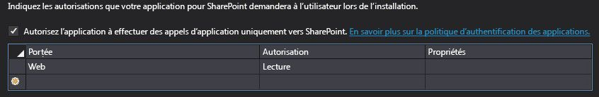


4. Définissez le complément en tant que projet StartUp et exécutez le projet. Vous trouverez les valeurs ClientID et ClientSecret dans le fichier ContosoMotorsCarInventoryWeb/Web.config. Le code doit avoir l'apparence suivante :

 ```XML

<add key="ClientId" value="06af1059-8916-4851-a271-2705e8cf53c6"/>
<add key="ClientSecret" value="LypZu2yVajlHfPLRn5J2hBrwCk5aBOHxE4PtKCjIQkk="/>
 ```

5. Remplacez les valeurs de ClientID et ClientSecret dans « Configuration de complément hébergé » dans ContosoMotorsCarInventoryWeb/TokenHelper.cs par les valeurs ci-dessus. Le code doit avoir l'apparence suivante :

 ```cs

private static readonly string ClientId = "06af1059-8916-4851-a271-2705e8cf53c6";
private static readonly string ClientSecret = "LypZu2yVajlHfPLRn5J2hBrwCk5aBOHxE4PtKCjIQkk=";

 ```


### Enregistrer votre application web Azure AD

Les étapes de cette section décrivent l'enregistrement de l'exemple de complément à partir du portail de gestion Azure.


1. Connectez-vous au  [portail de gestion Azure](http://go.microsoft.com/fwlink/?LinkID=512959) à l'aide de votre compte de coadministrateur ou d'administrateur du service Azure.


2. Dans le volet de navigation gauche, cliquez sur **Active Directory**.


3. Sur la page Active Directory, cliquez sur le répertoire qui a été configuré pour la passerelle SAP pour Microsoft.

    > **CONSEIL**
      >  Si vous ne savez pas lequel a été utilisé, demandez à l'administrateur de la passerelle SAP pour Microsoft. Conseil : il s'agit du répertoire qui contient les utilisateurs et les groupes pour la passerelle SAP pour Microsoft.
4. Dans la barre de navigation supérieure, choisissez **APPLICATIONS**.


5. Au bas de la page, cliquez sur **Ajouter**.


6. Dans la boîte de dialogue qui apparaît, choisissez **Ajouter une application développée par mon organisation**.


7. Dans la boîte de dialogue **Ajouter une application**, donnez un nom à l'application ; par exemple, utilisez « SellerDashboard ».


8. Choisissez **Application web et/ou API web** comme type d'application, puis cliquez sur la flèche droite.


9. Dans la boîte de dialogue **Ajouter des propriétés**, utilisez l'URL du site que vous avez créé précédemment (dans la section Créer votre site web Azure) comme URL DE CONNEXION. Par exemple, utilisez *https://Constoso.azurewebsites.net*  .


10. Pour l' **URI ID D'APPLICATION**, donnez à l'application un URI unique, tel que le nom d'application ajouté à la fin de l' **URL DE CONNEXION**; par exemple, utilisez *https://Constoso.azurewebsites.net/SellerDashboard*  , où Constoso.azurewebsites.net est le site que vous avez créé précédemment dans cet article.


11. Cliquez sur la case à cocher pour créer l'application. 

    Le tableau de bord Azure pour l'application s'ouvre et affiche un message de réussite.


> **REMARQUE**
> Vous devez enregistrer le complément avec Azure AD deux fois : une fois à des fins de débogage et une autre fois pour le déployer pour la production, comme décrit à l'étape 10. <BR /><BR /> Pour enregistrer le complément à des fins de débogage, utilisez l' **URL DE CONNEXION** et l' **URI ID D'APPLICATION** avec l'URL de débogage du projet SellerDashboard.Server afin de pouvoir exécuter le débogueur Visual Studio (F5). Cette URL aura la forme https://localhost. *nnnn*  , où *nnnn*  est un numéro de port. Vous trouverez cette URL dans le volet Propriétés de Visual Studio.<BR /><BR /> Ensuite, lorsque vous êtes prêt pour le déploiement pour la production, modifiez l'enregistrement pour utiliser l'URL de production correcte. 


### Configurer les paramètres de l'application

Configurer les paramètres de l'application que vous avez créée dans la procédure précédente. 


1. En haut de la page, cliquez sur **Configurer**.


2. Définissez les paramètres requis et prenez note des paramètres de configuration, comme décrit dans le tableau suivant.


|**Paramètre**|**Opération**|
|:-----|:-----|
|ID du client  <br/> |Copiez la valeur qui apparaît dans le champ ID du client.  <br/> |
|Clé secrète client  <br/> | Générer une nouvelle clé d'application : <br/>  Dans la section Clés, sélectionnez la durée de la clé : 1 ou 2 ans. <br/>  Dans la barre de commandes au bas de la page, cliquez sur **Enregistrer**.  <br/>  La valeur de clé apparaît. <br/>  Copiez et enregistrez la valeur de clé pour une utilisation ultérieure ; vous ne pouvez pas la récupérer lorsque vous quittez la page. <br/> |
|URI ID d'application  <br/> |Copiez la valeur qui apparaît dans le champ **URI ID de complément**.  <br/> |
 

Gardez ces informations à portée de main, car vous en aurez besoin dans une procédure ultérieure.


3. Dans la section **Autorisations pour d'autres applications**, procédez comme suit :

1. Sélectionnez votre application Passerelle SAP pour Microsoft.


2. Dans la colonne **Autorisations déléguées**, activez les cases pour les autorisations pour la Passerelle SAP pour Microsoft nécessaires pour le complément SharePoint hébergé par un fournisseur pour SellerDashboard.


4. Dans la barre de commandes au bas de la page, cliquez sur **Enregistrer**.


### Remplacez la configuration nécessaire pour le déploiement


1. Localisez SellerDashboardHTMLClient/UserCode.js, et recherchez l'espace réservé de code suivant :

 ```cs

sharePointUrl: "Replace with your SharePoint host site",
// https://fake_domain.sharepoint.com/sites/Developer
SharePointRootUrl: "Replace with your SharePoint root site"
 // https://fake_domain.sharepoint.com/ 

 ```


1. Remplacez la valeur sharePointUrl par votre site SharePoint, celui sur lequel le complément sera installé et qui contient également la bibliothèque d'images.


2. Remplacez la valeur sharePointRootUrl par le site racine SharePoint correspondant.


2. Localisez SellerDashboard.Server/Web.config dans la solution SellerDashboard et recherchez l'espace réservé de configuration suivant :

 ```XML

<add key="ClientSecret" value="MwMp1yxOyy8BGhfD5d9VvuqlRbhaqWESxVNLzgpYNHU=" />
<add key="ClientId" value="ed138b32-c89d-4f22-b74d-7d9d5044b260" />
<add key="Ida:ClientId" value="Replace with Azure register add-in client id" />
<add key="Ida:ClientSecret" value="Replace with Azure register add-in client secret" />
<add key="Ida:TenantId" value="Replace with the SAP Gateway for Microsoft tenant domain, for example <yourDomain>.onmicrosoft.com" />
<add key="Ida:RedirectUrl" value="Replace with the Azure host site, for example https://contoso.azurewebsites.net/SharePointLaunch.aspx" />
<add key="Ida:ResourceUrl" value="Replace with the SAP Gateway for Microsoft instance, for example http://contoso.cloudapp.net/" />
<add key="Ida:ODataServiceBaseUrl" value="Replace with the SAP OData endpoint url, for example https://contoso.cloudapp.net:8081/perf/sap/opu/odata/sap/ZCAR_POC_SRV/" />
<add key="Ida:ODataServiceMetadataUrl" value="Replace with the SAP OData endpoint metadata url, for example https://contoso.cloudapp.net:8081/perf/sap/opu/odata/sap/ZCAR_POC_SRV/$metadata" />
<add key="Ida:DataCollection" value="Replace with OData EntitySet name, for example ContosoMotorsCollection" />
<add key="Ida:ODataFeedOrEntryFormat" value="application/atom+xml" />
<add key="Ida:ODataMetadataFormat" value="application/xml" />
<add key="Ida:ODataContentType" value="application/xml" />
<add key="Ida:ODataVersion" value="2.0" />
<add key="Ida:ODataMaxVersion" value="3.0" />
<add key="Ida:ODataWriterTypeName" value="Replace with the OData EntityType, for example ZCAR_POC_SRV.ContosoMotors" />
<add key="Ida:DefaultID" value="1024" />
<add key="Ida:DefaultStockNo" value="2048" />
<add key="Ida:SPPicLib" value="Replace with you picture library name, for example ContosoMotorsPictureLibrary" />
 ```


1. Remplacez les valeurs ClientId et ClientSecret par les valeurs obtenues dans la procédure précédente.


2. Remplacez les valeurs Ida:ClientId et Ida:ClientSectet par les valeurs de l'application Azure AD.


3. Remplacez la valeur Ida:TenantId par < *votredomaine*  >.onmicrosoft.com.

    Par exemple, si le compte de votre organisation est someone@< *votredomaine*  >.onmicrosoft.com, < *votredomaine*  >.onmicrosoft.com est la valeur dont vous avez besoin.


4. Remplacez la valeur Ida:RedirectUrl par le site de test que vous avez créé sur Azure, qui héberge ce complément.


5. Remplacez la valeur Ida:ResourceUrl par l'instance de la Passerelle SAP pour Microsoft qui a été déployée et configurée dans Azure.


6. Remplacez la valeur Ida:ODataServiceBaseUrl par l'URL du point de terminaison OData de l'instance de la Passerelle SAP pour Microsoft.


7. Remplacez la valeur Ida:ODataServiceMetadataUrl par l'URL des métadonnées du point de terminaison OData de l'instance de la Passerelle SAP pour Microsoft


8. Remplacez la valeur Ida:DataCollection. Vous pouvez obtenir cette valeur à partir des métadonnées. Par exemple, utilisez ContosoMotorsCollection.


9. Remplacez la valeur Ida:ODataWriterTypeName. Vous pouvez obtenir la valeur correcte à partir des métadonnées. 

    Par exemple, utilisez les éléments suivants :


 ```XML

ZCAR_POC_SRV.ContosoMotors

<EntityContainer Name="ZCAR_POC_SRV_Entities" m:IsDefaultEntityContainer="true">
     <EntitySet sap:content-version="1" Name="ContosoMotorsCollection" sap:searchable="true" EntityType="ZCAR_POC_SRV.ContosoMotors"/>
</EntityContainer>
<atom:link xmlns:atom="http://www.w3.org/2005/Atom" href="http://contoso.cloudapp.net:8080/perf/sap/opu/odata/sap/ZCAR_POC_SRV.ContosoMotors"/>
 ```

10. Remplacez la valeur Ida:SPPicLib par le nom de la bibliothèque d'images que vous avez créée dans le site hôte SharePoint.


### Publier le projet


1. Localisez le projet SellerDashboard dans la solution SellerDashboard.


2. Cliquez avec le bouton droit la souris sur le SellerDashboard pour publier le projet.


3. Choisissez **Hébergement par le fournisseur**.


4. Choisissez **Windows Azure**.


5. Connectez-vous en tant qu'administrateur global.


6. Choisissez le site web que vous avez créé dans Azure.


7. Indiquez que vous souhaitez utiliser HTTPS.


8. Utilisez la chaîne de connexions de données par défaut.


9. Entrez le site web que vous avez créé dans Azure comme site web hôte ; entrez les valeurs ClientId et ClientSecret que vous avez obtenues dans la procédure précédente.


10. Publiez

     Vous obtiendrez un package publié.


### Installer l'application


1. Connectez-vous à votre site de déploiement SharePoint en tant qu'administrateur du site.


2. Sur la page d'accueil du site, cliquez sur **Nouveau complément à déployer**.


3. Choisissez le package obtenu du processus de publication.


4. Déployez-le et approuvez-le.


## Liste de code externe


|**Source web**|**Collection**|**Emplacement du code**|**Licence**|
|:-----|:-----|:-----|:-----|
| [Didacticiel de complément d'enquête : développement d'une application SharePoint à l'aide de LightSwitch](http://code.msdn.microsoft.com/Survey-App-Tutorial-a70d0afd) <br/>  [Procédure pas à pas : création d'un complément SharePoint à l'aide de LightSwitch](http://msdn.microsoft.com/fr-fr/library/jj969621.aspx) <br/> |**Outil de téléchargement de photos :** <br/> PhotoListHelper.cs  <br/> PhotosController.cs  <br/> Global.asax.cs  <br/> | [Didacticiel de complément d'enquête : développement d'une application SharePoint à l'aide de LightSwitch (C#)](http://www.getcodesamples.com/src/2571E87E/) <br/> |Licence Apache, Version 2.0  <br/> |
|null  <br/> |**Auth ACS :** <br/> SharePointContext.cs  <br/> TokenHelper.cs  <br/> |**Modèles VS internes :** <br/> Visual C#/Office/SharePoint/Apps/AppforSharePoint  <br/> ||
 
