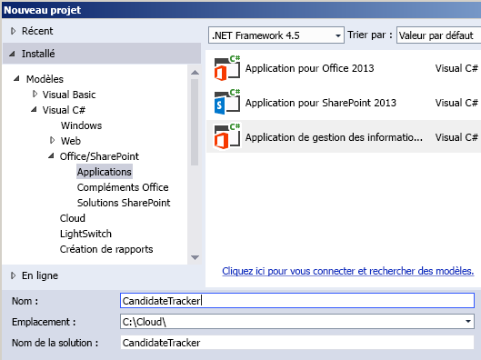
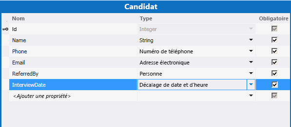
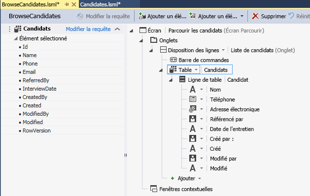
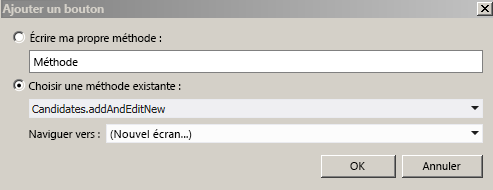
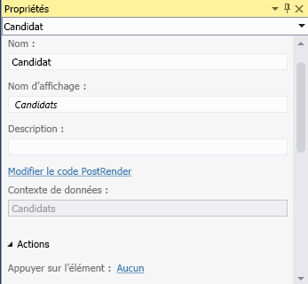
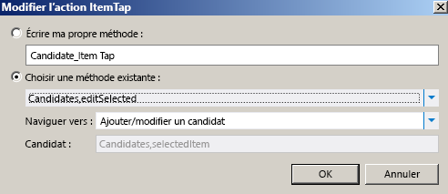
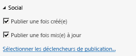

# Créer un complément de gestion des informations professionnelles dans le Cloud avec échange de News
En utilisant le modèle **Complément de gestion des informations professionnelles dans le Cloud** pour Visual Studio, vous pouvez créer des compléments SharePoint grâce auxquels les utilisateurs peuvent afficher, ajouter ou mettre à jour des données SharePoint. Le type de projet **Complément de gestion des informations professionnelles dans le Cloud** utilise les technologies Visual Studio LightSwitch qui simplifient la procédure de création de compléments professionnels hébergés sur SharePoint. Au cours de cette procédure, vous allez créer un complément pour assurer le suivi de candidatures à un emploi en utilisant les fonctionnalités d'intégration sociale de SharePoint pour Office 365 pour intégrer un échange de News au complément.Vous pouvez télécharger l'exemple de complément complet depuis MSDN Code Gallery :  [Création d'un complément de gestion des informations professionnelles dans le Cloud avec échange de News](http://code.msdn.microsoft.com/Creating-a-Cloud-Business-8540c0c9)
## Conditions préalables

Cette procédure pas à pas requiert Visual Studio 2013.


Pour héberger le complément, vous aurez besoin d'un site SharePoint 2013 ou d'un site de développeur SharePoint sur Office 365, que vous pouvez obtenir avec une  [Inscription pour la création d'un site de développeur Office 365](http://go.microsoft.com/fwlink/?LinkId=263490).


## Créer un projet de complément de gestion des informations professionnelles dans le Cloud
<a name="bk_create"> </a>

 Pour créer un complément de ce type, commencez avec le modèle de projet **complément de gestion des informations professionnelles dans le Cloud** de Visual Studio.


### Pour créer le projet


1. Dans la barre de menus, choisissez **Fichier** > **Nouveau** > **Projet**.

    La boîte de dialogue **Nouveau projet** s'ouvre.


2. Dans la liste de modèles, développez le nœud **Visual Basic** ou **Visual C#**. Développez le nœud **Office/SharePoint**, sélectionnez le nœud **Compléments**, puis sélectionnez **Complément de gestion des informations professionnelles dans le Cloud**, comme indiqué à la Figure 1.

   **Figure 1. Ajouter le projet**





3. Dans la zone de texte **Nom**, saisissez Suivi de candidat, puis cliquez sur le bouton **OK**.

    L'Assistant **Nouveau complément de gestion des informations professionnelles dans le Cloud** s'ouvre.


4. Dans l'Assistant **Nouveau complément de gestion des informations professionnelles dans le Cloud**, saisissez l'URL de votre site de développement Office 365, puis cliquez sur le bouton **Terminer**.

    L'URL doit prendre la forme https://  _Mon site_.sharepoint.com/sites/Developer/.

    Une solution **Suivi de candidat** est ajoutée à la solution. Elle comprend quatre projets : un projet de niveau supérieur **Suivi de candidat**, puis trois projets nommés respectivement **CandidateTracker.HTMLClient**, **CandidateTracker.Server** et **CandidateTracker.SharePoint**.


## Ajouter des données et des écrans
<a name="bk_add"> </a>

Le complément Suivi de candidat a besoin d'un tableau de base de données que vous allez créer dans le projet **Serveur** et d'écrans pour afficher, ajouter et mettre à niveau des données que vous allez créer dans le projet **HTMLClient**.


### Pour ajouter la table de base de données


1. Dans l' **Explorateur de solutions**, ouvrez le menu contextuel du nœud **CandidateTracker.Server**, puis sélectionnez **Ajoutez une table**.

    Entity Designer s'ouvre.


2. Dans la fenêtre **Propriétés**, dans la zone de texte correspondant à **Nom**, entrez Candidat.


3. Dans le concepteur d'entités, sélectionnez le lien **<Ajouter une propriété>** et saisissezNom.


4. Appuyez sur Entrée, en acceptant le **Type** par défaut, **String**, et en laissant la case **Obligatoire** cochée.


5. Cliquez sur le lien **<Ajouter une propriété>** et saisissezTéléphone, puis appuyez sur la touche **Tabulation**.


6. Dans la colonne **Type**, sélectionnez **Numéro de téléphone**, puis cliquez deux fois sur Onglet.

    Le **Numéro de téléphone** est de typeProfessionnel personnalisé, est formaté automatiquement et permet la validation des numéros de téléphone.


7. Sur la ligne suivante, saisissez Adresse de messagerie pour **Nom**, puis sélectionnez **Adresse de messagerie** comme **Type**.

    **Adresse électronique** est un autre champ de type Professionnel qui assure la validation des adresses de messagerie électronique.


8. Sur la ligne suivante, entrez Référencé par dans **Nom**, puis choisissez **Personne** en tant que **Type**.

    Le type professionnel **Personne** offre une connexion au service de profil utilisateur SharePoint User Profile Service, qui extrait les informations utilisateurs d'Active Directory.


9. Sur la ligne suivante, saisissez InterviewDate comme **Nom**, puis sélectionnez **Décalage de date et d'heure** dans **Type**.

    Le type d'entreprise **Décalage de date et d'heure** enregistre la date et l'heure au format UTC, ce qui permet aux utilisateurs de différents fuseaux horaires de voir l'heure correcte.

    La figure 2 montre l'entité terminée.


   **Figure 2. Entité candidats**





### Pour créer l'écran de navigation


1. Dans le concepteur d'entité, dans la barre **Perspective**, sélectionnez l'onglet **Client HTML**, puis, dans la barre d'outils, sélectionnez **Écran**.

    La boîte de dialogue **Nouveau projet** s'ouvre.


2. Dans la boîte de dialogue **Ajouter un nouvel écran**, dans la liste **Sélectionnez un modèle d'écran**, choisissez **Parcourir l'écran des données**.


3. Dans la liste **Données d'écran**, sélectionnez **Candidats**, puis cliquez sur le bouton **OK**.

    Le concepteur d'écran s'ouvre, avec une représentation de l'entité de données dans le volet de gauche, et une représentation de la disposition d'écran dans le volet de droite.


4. Dans le volet de droite du concepteur d'écran, sélectionnez le nœud **Liste | Candidats**, développez **Liste** et sélectionnez **Table**, comme indiqué à la figure 3.

   **Figure 3. Contrôle de table**





    Cette opération affichera les informations du **Candidat** sous forme de tableau et non sous forme de liste par défaut.

    Notez qu'en plus des champs que vous avez définis pour la table, il existe trois autres champs : Créé par, Créé, Modifié par et Modifié. Ces champs créent une piste de vérification pour montrer quand un élément a été ajouté ou mis à jour, et par qui. 


### Pour créer l'écran Ajouter


1. Dans le concepteur d'écran, ouvrez le menu contextuel du nœud **Barre de commandes** et choisissez **Ajouter un bouton**.


2. Dans la boîte de dialogue **Ajouter un bouton**, développez la liste **showTab** et sélectionnez **addAndEditNew**, comme indiqué à la figure 4, puis cliquez sur le bouton **OK**.

   **Figure 4. Boîte de dialogue Ajouter un bouton**





    La boîte de dialogue **Ajouter un nouveau projet** s'ouvre.


3. Dans la boîte de dialogue **Ajouter un nouvel écran**, acceptez les valeurs par défaut et cliquez sur le bouton **OK**.


Une nouvelle fenêtre de concepteur d'écran s'ouvre.


### Pour créer l'écran de modification


1. Sélectionnez l'onglet **BrowseCandidates.lsml** du concepteur d'écran, puis, dans le concepteur d'écran, choisissez le nœud **Table | Candidats**.


2. Dans la fenêtre **Propriétés**, sélectionnez le lien **Toucher sur l'élément**, comme indiqué à la figure 5.

   **Figure 5. Lien Toucher sur l'élément**





    La boîte de dialogue **Modifier l'action de toucher sur l'élément** s'ouvre.


3. Dans la boîte de dialogue **Modifier l'opération de toucher sur l'élément**, développez la liste **Afficher l'onglet**, puis choisissez **editSelected** comme indiqué à la figure 6, puis cliquez sur le bouton **OK**.

   **Figure 6. Boîte de dialogue Modifier l'opération de toucher sur l'élément**





### Pour tester le complément


1. Dans la barre de menus, choisissez **Débogage**, ** Démarrer le débogage**.

    Lors de la première exécution d'un complément SharePoint sur votre ordinateur, vous êtes invité à installer un certificat Localhost parce que les compléments de gestion des informations professionnelles dans le Cloud utilisent toujours SSL (Secure Sockets Layer). Si vous acceptez ce certificat, l'alerte de sécurité ne s'affichera pas à chaque fois que vous lancerez le complément. Comme le certificat s'applique uniquement à Localhost, votre système n'est exposé à aucune menace.


2. Dans la boîte de dialogue **Alerte de sécurité**, cliquez sur le bouton **Oui**.


3. Si la boîte de dialogue **Avertissement de sécurité** apparaît, cliquez sur le bouton **Oui**.

    Votre navigateur web s'affiche.


4. Sur la page **Se connecter**, cliquez sur le bouton **Connexion**.


5. Entrez votre mot de passe et cliquez sur le bouton **Connexion**.


6. À l'invite, cliquez sur le bouton **Approuver**.


7. Sur le l'écran **Rechercher les candidats**, cliquez sur le bouton **Ajouter un candidat**.

    L'écran **Ajouter un candidat** s'ouvre.


8. Dans l'écran **Ajouter un candidat**, entrez un nom, un numéro de téléphone et adresse électronique.


9. Sélectionnez le champ **Référencé par** et entrez les trois premières lettres de votre propre nom.

    Votre nom complet doit apparaître dans la liste. Si votre site est connecté à Active Directory, vous verrez une liste de tous les utilisateurs dont les noms commencent par les trois caractères.


10. Si vous le souhaitez, modifiez la date et l'heure de l'option **Date de l'entretien**, puis cliquez sur le bouton **Enregistrer** pour revenir à l'écran **Rechercher des candidats**.

    Le candidat que vous venez d'ajouter s'affiche ; si vous choisissez la ligne correspondante, l'écran d' **ajout du candidat modifié** s'ouvre. Notez que certains champs héritent des comportements spéciaux de leurs types de visite personnalisés. Choisissez le champ **Téléphone** pour composer le numéro, choisissez le champ **Messagerie électronique** pour envoyer un message électronique ou le champ **Créé par** pour voir vos informations de contact.


11. Fermez la fenêtre du navigateur pour interrompre l'exécution du complément.


## Ajouter un échange de News
<a name="bk_feed"> </a>

SharePoint pour Office 365 offre, parmi ses fonctionnalités, la possibilité d'ajouter des échanges de News permettant à l'utilisateur d'assurer le suivi d'une activité sur une liste et d'ajouter ses commentaires. Les compléments de gestion des informations professionnelles dans le Cloud facilitent la création d'un échange de News pour votre complément.


### Pour activer l'intégration sociale


1. Sélectionnez l'onglet **Candidates.lsml** du concepteur, puis dans la barre **Perspective**, sélectionnez l'onglet **Serveur**.


2. Dans la fenêtre ** Propriétés**, cochez les cases **Publier une fois créé(e)** et ** Publier une fois mis(e) à jour**, comme indiqué à la figure 7.

   **Figure 7. Propriétés sociales**





3. Sélectionnez le lien **Sélectionner les déclencheurs de publication**.

    La boîte de dialogue **Sélectionner les déclencheurs de publication** s'affiche.


4. Dans la boîte de dialogue **Sélectionner les déclencheurs de publication**, décochez la case **Tous les champs**, cochez la case **Date de l'entretien**, puis cliquez sur le bouton **OK**.


### Pour tester le complément


1. Dans la barre de menus, choisissez **Débogage**, ** Démarrer le débogage**.


2. Sur l'écran **Rechercher les candidats**, cliquez sur le candidat que vous avez créé précédemment.


3. Sur l'écran d' **ajout de candidat modifié**, changez l'option **Date de l'entretien**, puis cliquez sur le bouton **Enregistrer**.


4. Cliquez sur le bouton **Ajouter un candidat** et ajoutez un autre candidat.


5. Dans l'écran **Rechercher les candidats**, sur la barre Chrome SharePoint, sélectionnez le lien **Échange de News**.

    L' **Échange de News** ouvre une nouvelle fenêtre d'exploration avec deux entrées pour les candidats ajoutés et mis à jour. Vous pouvez sélectionner le lien **J'aime** pour une publication, ou vous pouvez choisir le lien **Répondre** pour ajouter un commentaire.


6. Fermez les deux fenêtres de navigateur pour stopper l'exécution du complément.


## Ajouter la Validation
<a name="bk_validate"> </a>

Dans de nombreux compléments de gestion des informations professionnelles, vous voudrez restreindre l'accès à certaines fonctionnalités, par exemple, en permettant uniquement à un gestionnaire de changer la date de l'entretien. Les compléments de gestion des informations professionnelles dans le Cloud vous permettent de le faire en écrivant une logique de validation ; dans ce cas, vous allez écrire un programme pour déterminer si l'utilisateur actuel est un membre de groupe de sécurité Active Directory spécifique.


### Pour ajouter la validation


1. Sélectionnez l'onglet du concepteur **Candidates.lsml**, puis, sur la barre **Perspective**, sélectionnez l'onglet **Serveur**.


2. Dans la barre d'outils, développez la liste **Code d'écriture** et choisissez la méthode **Candidates_Validate**.

    L'éditeur de code s'ouvre.


3. Dans l'éditeur de code, ajoutez le code suivant à la méthode **Candidates_Validate**:

 ```VB.net

If Not Application.User.Department = "Hiring Managers" Then
                results.AddEntityError("Permission denied")
            End If
 ```


 ```cs

if (!(Application.User.Department == "Hiring Managers")) {
results.AddEntityError("Permission denied");
}
 ```


    La méthode **Validate** s'exécute lorsqu'un utilisateur essaie d'effectuer un enregistrement. Si l'utilisateur est un membre du groupe de sécurité Gestionnaires d'embauche, l'enregistrement est sauvegardé. Dans le cas contraire, un message d'erreur « Autorisation refusée » s'affiche, et l'enregistrement est effacé.


À ce stade, si vous exécutez le complément et ajoutez un nouveau candidat, vous verrez probablement le message d'erreur, à moins d'être membre du groupe de sécurité Gestionnaires d'embauche. Remplacez « Gestionnaires d'embauche » par le nom du groupe de sécurité auquel vous appartenez, puis réessayez. Vous devriez avoir l'autorisation d'ajouter un candidat.


## Étapes suivantes
<a name="bk_validate"> </a>

Félicitations ! Vous avez créé votre premier complément de gestion des informations professionnelles dans le Cloud. S'il s'agit d'un complément que vous souhaitez partager avec des utilisateurs, la prochaine étape consiste à publier ce complément. Voir  [Procédure : publier dans Office 365 un complément de gestion des informations professionnelles dans le Cloud](http://msdn.microsoft.com/fr-fr/library/vstudio/dn454601.aspx) ou [Publier des compléments SharePoint](http://msdn.microsoft.com/fr-fr/library/office/apps/jj164070.aspx).


Bien entendu, il s'agit d'un simple exemple. Vous pouvez faire bien plus que créer des compléments dotés de nombreuses fonctionnalités. Comme le modèle de complément de gestion des informations professionnelles dans le Cloud est basé sur des technologies LightSwitch, il se peut que vous souhaitiez consulter la documentation LightSwitch pour avoir des idées. Voir  [Compléments SharePoint LightSwitch](http://msdn.microsoft.com/fr-fr/library/vstudio/jj969620.aspx).


## Ressources supplémentaires
<a name="bk_addresources"> </a>


-  [Créer des compléments de gestion des informations professionnelles dans le Cloud](create-cloud-business-add-ins.md)


