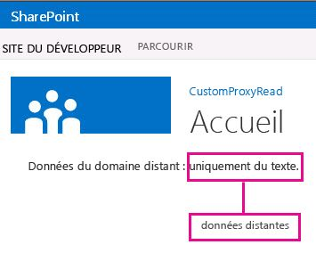

# Créer une page de proxy personnalisée pour la bibliothèque inter-domaines dans SharePoint 2013
Découvrez comment créer une page de proxy personnalisé pour accéder aux données d'un service distant à partir d'une page web SharePoint à l'aide de la bibliothèque inter-domaines de SharePoint. 
Lorsque vous créez des Compléments SharePoint, vous devez généralement incorporer des données provenant de plusieurs sources différentes. Pour des raisons de sécurité, il existe toutefois des mécanismes de blocage qui empêchent toute communication avec plusieurs domaines à la fois.


Vous pouvez utiliser la bibliothèque inter-domaines pour accéder aux données du complément distant si vous fournissez une page de proxy personnalisé qui est hébergée dans l'infrastructure du complément distant. En tant que développeur, vous êtes chargé d'implémenter la page de proxy personnalisé et de gérer une logique personnalisée (mécanisme d'authentification auprès du complément distant, par exemple). Utilisez la bibliothèque inter-domaines avec une page de proxy personnalisé si vous voulez que la communication ait lieu au niveau du client.
## Conditions requises pour utiliser les exemples de cet article
<a name="SP15Createcustomproxypage_Prereq"> </a>

Vous avez besoin d'un environnement de développement comme indiqué dans  [Commencer à créer des compléments hébergés par un fournisseur pour SharePoint](get-started-creating-provider-hosted-sharepoint-add-ins.md).


### Concepts principaux à connaître avant d'utiliser une page proxy avec des Compléments SharePoint

Le tableau ci-dessous répertorie des articles utiles pour comprendre les concepts qu'implique un scénario inter-domaines pour les Compléments SharePoint.


**Tableau 1. Concepts principaux pour l'utilisation d'une page de proxy personnalisé**


|**Titre de l'article**|**Description**|
|:-----|:-----|
| [Compléments](sharepoint-add-ins.md) <br/> |Découvrez le nouveau modèle de complément SharePoint qui vous permet de créer des compléments, qui sont des solutions faciles à utiliser et de taille réduite destinées aux utilisateurs finaux.  <br/> |
| [Accès aux données sécurisé et modèles d'objet client pour les compléments SharePoint](secure-data-access-and-client-object-models-for-sharepoint-add-ins.md) <br/> |Découvrez les options d'accès aux données des Compléments SharePoint. Cette rubrique contient des informations sur les principales options parmi lesquelles vous devez effectuer un choix lors de l'utilisation de données dans votre complément.  <br/> |
| [Héberger des sites web, des sites web de complément et des composants SharePoint dans SharePoint 2013](host-webs-add-in-webs-and-sharepoint-components-in-sharepoint-2013.md) <br/> |Découvrez la différence entre les sites web hôtes et les sites web de complément. Découvrez les composants SharePoint pouvant être inclus dans un Complément SharePoint, les composants déployés sur le site web hôte, les composants déployés sur le site web de complément et la façon dont le site web de complément est déployé dans un domaine isolé.  <br/> |
| [Sécurité inter-domaines du côté client](http://msdn.microsoft.com/fr-fr/library/cc709423%28vs.85%29.aspx) <br/> |Découvrez les cas d'utilisation et les menaces inter-domaines, ainsi que les principes de sécurité qui s'appliquent aux demandes inter-domaines. Évaluez les risques que peut entraîner l'amélioration de l'accès inter-domaines à partir des applications web qui s'exécutent dans un navigateur.  <br/> |
 

## Exemple de code : accès à des données distantes à l'aide d'une page de proxy personnalisé pour la bibliothèque inter-domaines
<a name="SP15Createcustomproxypage_Codeexample"> </a>

Pour lire les données du service distant, vous devez effectuer les opérations suivantes : 


1. Créez un projet de Complément SharePoint.


2. Modifiez le manifeste du complément pour autoriser une communication à partir du complément distant.


3. Créez une page de proxy personnalisé et une page de contenu dans le projet web.


4. Créez une page qui utilise la bibliothèque inter-domaines dans le projet de Complément SharePoint.


### Création d'un projet de complément SharePoint


1. Ouvrez Visual Studio en tant qu'administrateur. (Pour ce faire, cliquez avec le bouton droit de la souris sur l'icône Visual Studio du menu **Démarrer**, puis sélectionnez **Exécuter en tant qu'administrateur**.)


2. Créez le Complément SharePoint hébergé par le fournisseur, comme indiqué dans  [Commencer à créer des compléments hébergés par un fournisseur pour SharePoint](get-started-creating-provider-hosted-sharepoint-add-ins.md) et nommez-leProxyPageApp. 


### Pour modifier le fichier manifeste du complément


1. Dans l' **Explorateur de solutions**, cliquez avec le bouton droit sur le fichier **AppManifest.xml**, puis sélectionnez **Afficher le code**.


2. Remplacez tout l'élément **AppPrincipal** par ce qui suit.

 ```XML

<AppPrincipal>
    <Internal AllowedRemoteHostUrl="~remoteAppUrl"/>
</AppPrincipal>
 ```


    > **REMARQUE**
      > L'attribut **AllowedRemoteHostUrl** est utilisé pour spécifier le domaine distant. L'attribut **~remoteAppUrl** est résolu en URL du complément distant. Pour plus d'informations sur les jetons, voir [Explorer la structure du manifeste d'application et le package d'un complément pour SharePoint](explore-the-app-manifest-structure-and-the-package-of-a-sharepoint-add-in.md). 

### Pour créer une page de proxy personnalisé


1. Après que la solution Visual Studio a été créée, cliquez avec le bouton droit de la souris dans le projet d'application web (et non le projet de Complément SharePoint) et ajoutez un nouveau formulaire web en choisissant **Ajouter** > **Nouvel élément** > **Web** > **Formulaire web**. Nommez le formulaire Proxy.aspx.


2. Dans le fichier Proxy.aspx, remplacez l'intégralité de l'élément html et de ses enfants par le code HTML suivant. Conservez le balisage figurant au-dessus de l'élément html sans le modifier. Le code HTML contient des balises et du JavaScript qui effectue les tâches suivantes :

  - Fournit un espace réservé pour le fichier JavaScript de bibliothèque inter-domaines.


  - Extrait l'URL du site web du complément du référent.


  - Charge dynamiquement le fichier JavaScript de bibliothèque inter-domaines dans l'espace réservé.


  - Fournit les paramètres pour l'objet **RequestExecutorMessageProcessor**.


  - Initialise l'objet **RequestExecutorMessageProcessor**.


 ```HTML

<html xmlns="http://www.w3.org/1999/xhtml">
<head runat="server">
    <meta http-equiv="X-UA-Compatible" content="IE=8" /> 
    <title>Custom Proxy Host Page</title>
    <script 
        src="http://ajax.aspnetcdn.com/ajax/4.0/1/MicrosoftAjax.js" 
        type="text/javascript">
    </script>
    <script 
        type="text/javascript" 
        src="http://ajax.aspnetcdn.com/ajax/jQuery/jquery-1.7.2.min.js">
    </script>

    <!-- Script to load the cross-domain library js file -->
    <script type="text/javascript">
        var hostweburl;

        $(document).ready(function(){
            //Get the URI decoded host web URL.
            hostweburl =
                decodeURIComponent(
                    getQueryStringParameter("SPHostUrl")
            );

            // The cross-domain js file is in a URL in the form:
            // host_web_url/_layouts/15/SP.RequestExecutor.js
            var scriptbase = hostweburl + "/_layouts/15/";

            // Load the js file 
            $.getScript(scriptbase + "SP.RequestExecutor.js", initCustomProxy);
        });

        //Function to initialize the custom proxy page
        //  must set the appropriate settings and implement
        //  proper authentication mechanism
        function initCustomProxy() {
            var settings =
            {
                originAuthorityValidator: function (messageOriginAuthority) {
                    // This page must implement the authentication for the
                    //   remote add-in.
                       // You should validate if messageOriginAuthority is
                       //  an approved domain to receive calls from.
                    return true;
                }
            };
            SP.RequestExecutorMessageProcessor.init(settings);
        }

        // Function to retrieve a query string value.
        // For production purposes you may want to use
        //  a library to handle the query string.
        function getQueryStringParameter(paramToRetrieve) {
            var params =
                document.URL.split("?")[1].split("&amp;");
            var strParams = "";
            for (var i = 0; i < params.length; i = i + 1) {
                var singleParam = params[i].split("=");
                if (singleParam[0] == paramToRetrieve)
                    return singleParam[1];
            }
        }
    </script>
</head>
<body>

</body>
</html>


 ```


    > **IMPORTANTE**
      > Dans un Complément SharePoint de production, vous devez fournir la logique d'autorisation et renvoyer la valeur adéquate dans l'objet **originAuthorityValidator** des paramètres.

### Pour créer une page de contenu


1. Cliquez avec le bouton droit de la souris sur le projet d'application web dans l' **Explorateur de solutions**, puis ajoutez un nouveau formulaire web en choisissant **Ajouter** > **Nouvel élément** > **Web** > **Formulaire web**. Nommez le formulaire Content.aspx.


2. Copiez le code suivant et collez-le dans la méthode **Page_Load** du fichier code-behind. Il effectue les tâches suivantes :

  - Définit le **content-type** de sortie sur **text/plain**.


  - Écrit le contenu dans le tampon de sortie.


  - Met fin à la connexion.


 ```cs

string content;
content = "Just some text.";
Response.ContentType="text/plain";
Response.Write(content);
Response.End();

 ```


### Pour créer une page web SharePoint qui utilise la bibliothèque inter-domaines


1. Cliquez avec le bouton droit de la souris sur le projet de Complément SharePoint, puis choisissez **Ajouter** > **Nouvel élément** > **Office/SharePoint** > **Module**.


2. Nommez le module Pages, puis choisissez **Ajouter**.


3. Cliquez avec le bouton droit de la souris sur le dossier **Pages**, puis choisissez **Ajouter** > **Nouvel élément**> **Office/SharePoint** > **Page**. 


4. Nommez la page Home.aspx, puis choisissez **Ajouter**.


5. Ouvrez la page **Home.aspx** si elle ne s'ouvre pas automatiquement.


6. Copiez le code ci-dessous et collez-le dans la balise de contenu **PlaceHolderMain**. 

 ```

<!-- The page dynamically loads the cross-domain library's
    js file, rescript acts as the placeholder. -->
<script 
    type="text/javascript"
    id="rescript"
    src="../_layouts/15/SP.RequestExecutor.js">
</script>
    Data from the remote domain: <span id="TextData"></span>

    <!-- Main script to retrieve the host web's title -->
    <script type="text/javascript">
    (function () {
        var executor;
        var hostweburl;
        var remotedomain;

        remotedomain = "<your_remote_add-in_domain>";

        //Get the URI decoded host web URL.
        hostweburl =
            decodeURIComponent(
                getQueryStringParameter("SPHostUrl")
        );

        // Initialize the RequestExecutor with the custom proxy URL.
        executor = new SP.RequestExecutor(remotedomain);
        executor.iFrameSourceUrl = "Proxy.aspx?SPHostUrl=" + hostweburl;

        // Issue the call against the remote endpoint.
        // The response formats the data in plain text.
        // The functions successHandler and errorHandler attend the
        //      sucess and error events respectively.
        executor.executeAsync(
            {
                url:
                    remotedomain + "Content.aspx",
                method: "GET",
                headers: { "Accept": "text/plain" },
                success: successHandler,
                error: errorHandler
            }
        );
    })();

    // Function to handle the success event.
    // Prints the data to the placeholder.
    function successHandler(data) {
        document.getElementById("TextData").innerText =
            data.body;
    }

    // Function to handle the error event.
    // Prints the error message to the page.
    function errorHandler(data, errorCode, errorMessage) {
        document.getElementById("TextData").innerText =
            "Could not complete cross-domain call: " + errorMessage;
    }

    // Function to retrieve a query string value.
    // For production purposes you may want to use
    //  a library to handle the query string.
    function getQueryStringParameter(paramToRetrieve) {
        var params =
            document.URL.split("?")[1].split("&amp;");
        var strParams = "";
        for (var i = 0; i < params.length; i = i + 1) {
            var singleParam = params[i].split("=");
            if (singleParam[0] == paramToRetrieve)
                return singleParam[1];
        }
    }
    </script>

 ```

7. Dans le code précédent que vous avez collé, recherchez la ligne  `remotedomain = "<your_remote_add-in_domain>";` et remplacez l'espace réservé _<your_remote_add-in_domain>_ par l'URL « localhost » que votre complément web utilise lorsque vous l'exécutez avec la touche F5 dans Visual Studio. Pour trouver cette valeur, sélectionnez le projet d'application web dans l' **Explorateur de solutions**. La propriété **URL** figure dans le volet **Propriétés**. Indiquez la valeur entière, avec le protocole, le port et la barre oblique de fermeture, par exemple « http://localhost: 45072 ».


8. Enregistrez et fermez le fichier.


9. Ouvrez le fichier appmanifest.xml et définissez la valeur de **Page de démarrage** sur **ProxyPageApp/Pages/Home.aspx**.


### Pour générer et exécuter la solution


1. Vérifiez que le projet de Complément SharePoint est défini en tant que projet de démarrage.


2. Appuyez sur la touche F5.

    > **REMARQUE**
      > Lorsque vous appuyez sur F5, Visual Studio génère la solution, déploie le complément et ouvre la page des autorisations pour le complément. 
3. Cliquez sur le bouton **Trust It** (Faire confiance).

    La page d'accueil s'ouvre et doit présenter l'aspect ci-dessous. La phrase « Just some text » peut mettre quelques secondes avant de s'afficher, car elle est extraite de la page Content.aspx du domaine distant.


   **Données du service distant dans une page web SharePoint.**





**Tableau 2. Dépannage de la solution**


|**Problème**|**Solution**|
|:-----|:-----|
|Visual Studio n'ouvre pas le navigateur après que vous avez appuyé sur la touche F5.  <br/> |Définissez le projet de Complément SharePoint en tant que projet de démarrage.  <br/> |
|Exception non gérée **SP n'est pas défini**. <br/> |Vérifiez que vous pouvez accéder au fichier SP.RequestExecutor.js dans une fenêtre de navigateur.  <br/> |
 

## Étapes suivantes
<a name="SP15Createcustomproxypage_Nextsteps"> </a>

Cet article a montré comment accéder à des données distantes à l'aide d'une page de proxy personnalisé pour la bibliothèque inter-domaines de SharePoint. À l'étape suivante, vous pourrez découvrir quelles autres options d'accès aux données sont disponibles dans des Compléments SharePoint. Pour plus d'informations, reportez-vous aux ressources suivantes :


-  [Exemple de code : obtenir des données à l'aide d'une page proxy pour la bibliothèque inter-domaines](http://code.msdn.microsoft.com/SharePoint-2013-Get-data-10039ff1)


-  [Accéder à des données SharePoint 2013 à partir de compléments à l'aide de la bibliothèque inter-domaines](access-sharepoint-2013-data-from-add-ins-using-the-cross-domain-library.md)


-  [Interroger un service distant à l'aide du proxy web](query-a-remote-service-using-the-web-proxy-in-sharepoint-2013.md)


## Ressources supplémentaires
<a name="SP15Createcustomproxypage_Addresources"> </a>


-  [Configurer un environnement de développement local pour les compléments pour SharePoint](set-up-an-on-premises-development-environment-for-sharepoint-add-ins.md)


-  [Utiliser des données externes dans SharePoint 2013](work-with-external-data-in-sharepoint-2013.md)


-  [Accès aux données sécurisé et modèles d'objet client pour les compléments SharePoint](secure-data-access-and-client-object-models-for-sharepoint-add-ins.md)


-  [Autorisation et authentification des compléments dans SharePoint](authorization-and-authentication-of-sharepoint-add-ins.md)


-  [Utiliser les opérations de requête OData dans les demandes REST SharePoint](use-odata-query-operations-in-sharepoint-rest-requests.md)


-  [Penser de trois manières différentes les options de conception des compléments pour SharePoint](three-ways-to-think-about-design-options-for-sharepoint-add-ins.md)


-  [Aspects importants du contexte de développement et de l'architecture des compléments pour SharePoint](important-aspects-of-the-sharepoint-add-in-architecture-and-development-landscap.md)


-  [Stockage des données dans les compléments SharePoint](important-aspects-of-the-sharepoint-add-in-architecture-and-development-landscap.md#Data)


