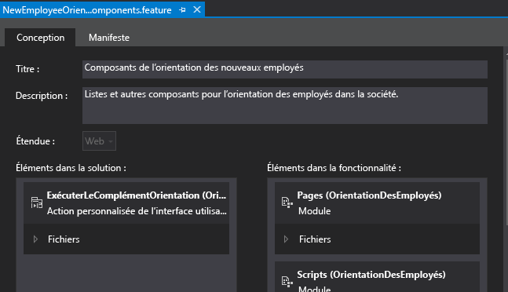

# Création d'un bouton de ruban personnalisé dans le site web hôte d'un complément SharePoint
 Ajoutez des commandes de bouton de ruban personnalisées au site web hôte d'un Complément SharePoint.
 Cet article est le neuvième d'une série sur les concepts de base du développement de Compléments SharePoint hébergés par SharePoint. Vous devez tout d'abord avoir pris connaissance de [Compléments](sharepoint-add-ins.md) et des articles précédents de la série :

-  [Commencer à créer des compléments SharePoint hébergés par SharePoint](get-started-creating-sharepoint-hosted-sharepoint-add-ins.md)

-  [Déployer et installer un complément hébergé par SharePoint pour SharePoint](deploy-and-install-a-sharepoint-hosted-sharepoint-add-in.md)

-  [Ajouter des colonnes personnalisées à un complément hébergé par SharePoint pour SharePoint](add-custom-columns-to-a-sharepoint-hostedsharepoint-add-in.md)

-  [Ajouter un type de contenu personnalisé à un complément hébergé par SharePoint pour SharePoint](add-a-custom-content-type-to-a-sharepoint-hostedsharepoint-add-in.md)

-  [Ajouter un composant WebPart à une page dans un complément hébergé par SharePoint pour SharePoint](add-a-web-part-to-a-page-in-a-sharepoint-hosted-sharepoint-add-in.md)

-  [Ajouter un flux de travail à un complément hébergé par SharePoint pour SharePoint](add-a-workflow-to-a-sharepoint-hosted-sharepoint-add-in.md)

-  [Ajouter une page et un style personnalisés à un complément hébergé par SharePoint pour SharePoint](add-a-custom-page-and-style-to-a-sharepoint-hosted-sharepoint-add-in.md)

-  [ Ajout de rendu côté client personnalisé à un complément SharePoint hébergé par SharePoint](add-custom-client-side-rendering-to-a-sharepoint-hosted-sharepoint-add-in.md)

> **REMARQUE**
>  Si vous avez suivi cette série sur les compléments hébergés par SharePoint, vous disposez d'une solution Visual Studio que vous pouvez continuer à utiliser avec cette rubrique. Vous pouvez également télécharger le référentiel à l'adresse [SharePoint_SP-hosted_Add-Ins_Tutorials](https://github.com/OfficeDev/SharePoint_SP-hosted_Add-Ins_Tutorials) et ouvrir le fichier BeforeRibbon.sln.

 Tous Compléments SharePoint peuvent être exécutés à partir de la page **Contenu du site** du site web hôte en cliquant sur la mosaïque du complément. La fonctionnalité d'un Complément SharePoint peut également être exposée sur le site web hôte par l'intermédiaire des actions personnalisées, qui sont des boutons de ruban personnalisés ou des éléments de menu personnalisés. Dans cet article, vous allez ajouter un bouton sur le ruban d'un site web hôte.
## Préparation du site web hôte

 Vous allez ajouter le bouton au ruban d'un calendrier sur le site web hôte. Suivez les étapes ci-dessous dans l'interface utilisateur de votre site de développeur SharePoint.

1.  Sur la page d'accueil du site, choisissez **Contenu du site** > **Ajouter un complément** > **Calendrier**.

2.  Dans la boîte de dialogue **Ajout de calendrier**, saisissez Programme d'orientation des employés pour le **nom**, puis sélectionnez **Créer**.

3.  Lorsque le calendrier s'ouvre, placez le curseur sur une date jusqu'à ce que le lien **Ajouter** apparaisse, puis cliquez sur **Ajouter**. 

4.  Dans la boîte de dialogue **Programme d'orientation des employés - Nouvel élément**, saisissez Orientation de Charline Leblanc pour le **titre**. Laissez les valeurs par défaut des autres champs et cliquez sur **Enregistrer**.

     Le calendrier doit ressembler à ce qui suit :

   **Calendrier personnalisé**

!\[Calendrier intitulé Plannification de l'orientation de l'employé avec un élément le 1er juin indiquant « Orientation Cassie Hicks »](images/d2066862-41c1-424d-9bfb-b6c5342bcf2c.PNG)

> **IMPORTANTE**
>  La procédure suivante nécessite que le calendrier soit visible dans l'interface utilisateur de Visual Studio, mais ce ne sera pas le cas si Visual Studio était ouvert lorsque vous avez créé le calendrier. Avant de continuer, fermez Visual Studio et déconnectez-vous de toutes les fenêtres de navigateur et consoles PowerShell avec lesquelles vous êtes connecté à votre site de développeur.

## Ajout d'une action personnalisée de ruban

1.  Dans l' **Explorateur de solutions**, cliquez avec le bouton droit sur le projet **OrientationDesEmployés**, puis choisissez **Ajouter** > **Nouvel élément** > **Office/SharePoint** > **Action personnalisée de Ruban**. Nommez l'élément ExécuterLeComplémentOrientation, puis choisissez **Ajouter**.

2. L'assistant **Créer une action personnalisée pour le Ruban** vous pose une série de questions. Fournissez les réponses en vous aidant du tableau suivant :

|**Question liée aux propriétés**|**Réponse**|
|:-----|:-----|
|Où voulez-vous exposer l'action personnalisée ?    |Choisissez **Web hôte**.    |
|Quelle est l'étendue de l'action personnalisée ?    | Choisissez **Instance de liste** ( *et pas*  Modèle de liste).   |
|À quel élément particulier s'applique l'étendue de l'action personnalisée ?    | Choisissez **Programme d'orientation des employés**.    |
|Où se trouve le contrôle ?    | N'utilisez pas les options du menu déroulant. À la place, saisissez **Ruban.Calendrier.Événements.Actions.Contrôles._enfant**. (La troisième partie, **Événements**, identifie l'onglet du ruban, et la quatrième partie, **Actions**, identifie le groupe de boutons.)    |
|Quel est le texte affiché sur l'élément de menu ?    | Saisissez **Orientation des employés**.    |
|Quelle est la cible de la navigation de l'action personnalisée ?    | N'utilisez pas les options du menu déroulant. À la place, saisissez **~appWebUrl/Listes/NouveauxEmployésÀSeattle**. Il s'agit de la page de vue de liste pour la liste, qui se trouve sur le site web de complément, c'est pourquoi le bouton de ruban du site web hôte ouvre une page sur le site web de complément.    |
 
3. Cliquez sur **Terminer**. 

## Inspection de la fonctionnalité du site web de complément

 Dans l' **Explorateur de solutions**, développez le dossier **Fonctionnalités** et choisissez l'option **ComposantsOrientationNouveauxEmployés**. Le concepteur de fonctionnalités s'ouvre.

 Notez que l'action personnalisée que vous avez créée, **ExécuterLeComplémentOrientation**, est répertoriée dans les **éléments de la solution**, mais pas dans les **éléments de la fonctionnalité**. Ceci est dû au fait que la fonctionnalité est déployée sur le site web de complément, mais que votre action personnalisée est déployée sur le site web hôte. Lorsque vous assemblez le complément dans Visual Studio pour le déployer vers la production ou lorsque vous appuyez sur F5 dans Visual Studio, les Outils de développement Office pour Visual Studio créent une fonctionnalité de site web hôte spécifique, ajoutent l'action personnalisée dans celle-ci, puis la déploient vers le site web hôte. Vous ne devez jamais modifier la fonctionnalité de site web hôte, c'est pourquoi il n'a pas été créé avant le packaging.

**Concepteur de fonctionnalité**

## Exécuter et tester le complément

1. Utilisez la touche F5 pour déployer et exécuter votre complément. Visual Studio effectue une installation temporaire du complément sur votre site SharePoint de test et exécute immédiatement celui-ci. 

2.  La page par défaut du Complément SharePoint s'ouvre. Accédez à la page d'accueil de votre site de développeur (qui constitue le site web hôte). Il existe un lien de navigation vers celui-ci dans le coin supérieur gauche de la page.

3.  Sur la page d'accueil du site web hôte, choisissez **Contenu du site**, et sur la page **Contenu du site**, cliquez sur le calendrier **Programme d'orientation des employés** (et pas sur le complément **Orientation des employés**).

4.  Lorsque le calendrier s'ouvre, cliquez sur l'événement **Orientation de Charline Leblanc**. Si l'onglet **Événements** du ruban ne s'ouvre pas automatiquement, ouvrez-le. Il doit se présenter comme suit :

   **Onglet de ruban Événements avec le bouton personnalisé**

!\[Ruban d'événements avec un bouton personnalisé nommé « Orientation de l'employé »](images/916ecbba-11ff-45b6-a8e9-ba717ae6fe0b.png)

5.  Dans le groupe **Actions** sur le ruban, cliquez sur **Orientation des employés**. La page de vue de liste pour **Nouveaux employés à Seattle** s'ouvre.

6. Pour mettre fin à la session de débogage, fermez la fenêtre du navigateur ou arrêtez le débogage dans Visual Studio. Chaque fois que vous appuyez sur F5, Visual Studio retire la version précédente du complément et installe la plus récente.

7. Vous allez travailler avec ce complément et la solution Visual Studio dans d'autres articles. Il est donc recommandé de retirer le complément une dernière fois lorsque vous avez terminé de travailler et n'allez pas le réutiliser pendant un moment. Cliquez avec le bouton droit de la souris sur le projet dans l' **Explorateur de solutions** et choisissez **Retirer**.

## 

 Dans l'article suivant de cette série, vous allez ajouter du code JavaScript au Complément SharePoint et accéder aux données SharePoint avec le modèle objet JavaScript de SharePoint : [Utilisation des API JavaScript SharePoint pour exploiter les données SharePoint](use-the-sharepoint-javascript-apis-to-work-with-sharepoint-data.md).

