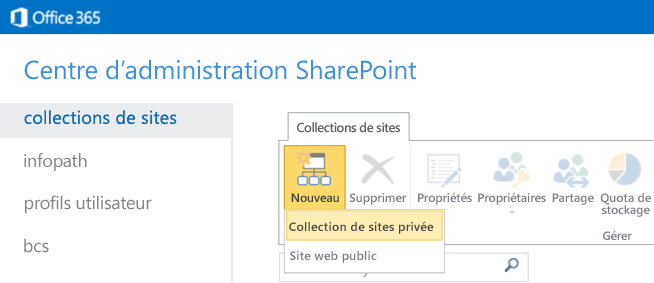
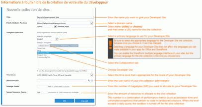
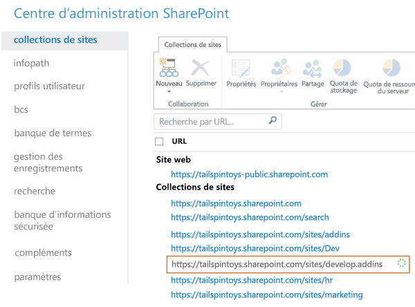

# Créer un Site du développeur dans un abonnement Office 365 existant
Avec un Site du développeur Office 365, il est plus facile de se préparer et de commencer à créer, tester et déployer vos Compléments Office et SharePoint plus rapidement. De nombreux abonnements Office 365 Business, Entreprise, Éducation et Administration comprennent un modèle de site que vous pouvez utiliser pour créer un Site du développeur.
 **Avant de commencer**

- **Assurez-vous que vous disposez d'un abonnement Office 365 prenant en charge un site du développeur.** Si vous disposez de l'un des plans d'abonnement Office 365 suivants, vous pouvez créer un Site du développeur au sein de votre abonnement existant :

> Office 365 Moyenne Entreprise

> Office 365 Entreprise E1, E3, E4, E5 ou K1

> Office 365 Éducation A2, A3 ou A4

> Office 365 Administration G1, G3, G4 ou K1

- **Si vous disposez d'un abonnement Office 365 Petite Entreprise,** celui-ci ne prend en charge qu'une seule collection de sites et vous ne pouvez donc pas créer de collection de sites de développeur. Si vous voulez en savoir plus sur les plans Office 365 pour votre entreprise, consultez [SharePoint Online : limites et frontières logicielles](http://office.microsoft.com/fr-fr/office365-sharepoint-online-enterprise-help/sharepoint-online-software-boundaries-and-limits-HA102694293.aspx).

- Pour plus d'informations sur les offres Office 365 Enterprise, voir  [Plans et tarification](http://products.office.com/fr-fr/business/office-365-enterprise-e1-business-software).

## Créer un Site du développeur

1. Connectez-vous à Office 365 en tant qu'administrateur général ou SharePoint Online.

    **Vous devez vous connecter en tant qu'administrateur général ou SharePoint Online pour créer des collections de sites,** tel qu'un Site du développeur. Seuls les administrateurs peuvent voir les options d'administration lors la connexion à Office 365. Si vous n'êtes pas administrateur, contactez un administrateur de votre entreprise et demandez-lui d'effectuer l'une des actions suivantes :

  - Vous accorder des droits d'administrateur, afin que vous puissiez créer le Site du développeur vous-même.

  - Créer le Site du développeur pour vous et vous spécifier en tant qu'administrateur pour la collection de sites.

2. Cliquez sur le bouton du lanceur d'applications situé à l'extrême gauche de la barre de navigation en haut.

3. Cliquez sur la mosaïque **Administrateur**.

4. Dans l'arborescence de navigation à gauche, développez **Admin**, puis sélectionnez **SharePoint**.

5. Dans le **Centre d'administration SharePoint**, sous l'onglet **Collections de sites**, cliquez sur **Nouvelle > Collection de sites privée**.

6. Dans la boîte de dialogue **Nouvelle collection de sites**, fournissez les informations relatives à votre Site du développeur.

    **Cliquez sur l'image suivante pour parcourir les options de la nouvelle collection de sites dans la boîte de dialogue, ou reportez-vous au tableau sous l'image pour obtenir des conseils.**
     

|||
|:-----|:-----|
|**Title**   |Nom que vous souhaitez attribuer à votre Site du développeur.    |
|Liste **Adresse du site web public**   |Choisissez un nom de domaine et un chemin d'URL, **/sites/** ou **/teams/**, puis entrez le nom de l'URL de la collection de sites.    |
|Liste **Sélectionner une langue** dans la section **Sélection du modèle**   |Langue principale à utiliser pour votre Site du développeur.    **Veillez à sélectionner la langue appropriée pour la collection de sites du développeur, car elle ne pourra plus être changée ultérieurement.**   La sélection d'une langue pour votre Site du développeur n'a pas d'incidence sur les langues disponibles dans vos compléments pour Office et SharePoint.    Vous pouvez activer l'interface multilingue de SharePoint sur vos sites, mais la langue principale pour la collection de sites est celle que vous choisissez ici.    |
|Section **Sélection du modèle** dans l'onglet **Collaboration** sous **Sélectionner un modèle**   |Sélectionnez **Site du développeur**.    |
|**Fuseau horaire**   |Fuseau horaire approprié pour les paramètres régionaux de votre Site du développeur.    |
|**Administrateur**   |Nom d'utilisateur de l'administrateur de votre collection de sites.    |
|**Quota de stockage**   |Nombre de mégaoctets (Mo) que vous souhaitez affecter à la collection de sites de ce Site du développeur.    |
|**Quota de ressources du serveur**   |Quantité de ressources à affecter à la collection de sites.    Ce nombre est une combinaison des métriques de performance (temps processeur et exceptions non gérées) relatives au code dans des solutions sandbox. Quand ce niveau dépasse le quota journalier, le mode sandbox est désactivé pour cette collection de sites.    |
 
7. Cliquez sur **OK**.

    La liste **Collections de sites** affiche l'URL du nouveau site du développeur. Une fois la création de ce site terminée, vous pouvez utiliser cette URL pour ouvrir votre site du développeur.

## Ressources supplémentaires

-  [Compléments](sharepoint-add-ins.md)

-  [Créer ou supprimer une collection de sites](http://office.microsoft.com/fr-fr/office365-sharepoint-online-enterprise-help/create-or-delete-a-site-collection-HA102772354.aspx?CTT=1)

