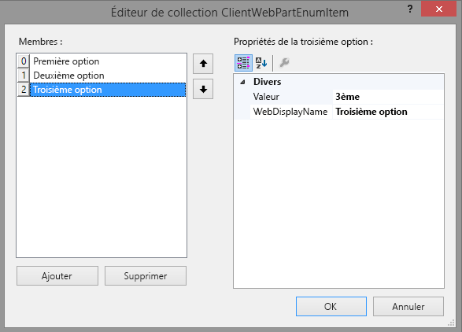
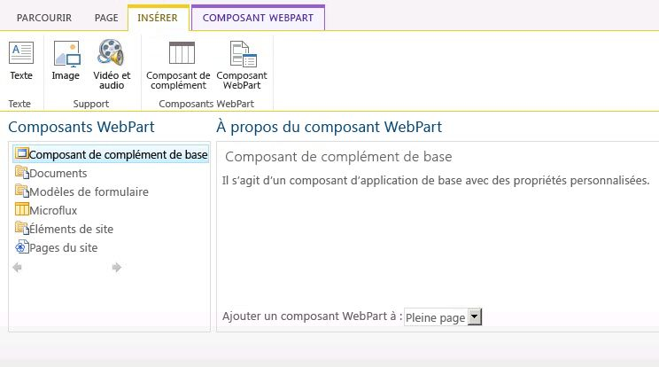

# Créer des composants de complément à installer avec votre complément pour SharePoint
Découvrez comment créer un composant de complément dans SharePoint 2013 qui soit disponible dans la galerie de composants WebPart du site web hôte lorsque vous installez votre Complément SharePoint.
Les composants de complément vous permettent d'illustrer l'expérience offerte à l'utilisateur du complément directement dans les pages du site web SharePoint. Un composant de complément affiche la page web (généralement un formulaire interactif ou un affichage dynamique de données) que vous spécifiez à l'aide d'un **IFrame** (aussi appelé cadre) dans une page du [site web hôte](http://msdn.microsoft.com/library/fp179925.aspx). Pour obtenir plus de contexte sur les composants de complément, reportez-vous aux articles suivants :
  
    
    


-  [Accéder au complément à partir de l'interface utilisateur](important-aspects-of-the-sharepoint-add-in-architecture-and-development-landscap.md#AccessingApp)
    
  
-  [Conception de l'expérience utilisateur pour les compléments dans SharePoint](ux-design-for-sharepoint-add-ins.md)
    
  
-  [Extension de l'interface SharePoint dans les compléments](sharepoint-add-ins-ux-design-guidelines.md#UXGuide_Extending)
    
  

La figure 1 présente la manière dont le composant de complément est affiché dans une page SharePoint.
  
    
    


**Figure 1. Contenu de composant de complément affiché dans une page SharePoint**

  
    
    

  
    
    

  
    
    
Un composant de complément est mis en œuvre avec la classe **ClientWebPart** et, à l'instar de tous les composants WebPart, il est disponible dans la galerie de composants WebPart après qu'un utilisateur installe le Complément SharePoint qui le contient. Vos utilisateurs peuvent personnaliser le composant de complément à l'aide des propriétés que vous fournissez. (Voir l'exemple de propriétés configurables dans un composant de complément dans la figure 2 ci-dessous).L'exemple de cet article utilise une page web hébergée sur un serveur distant, et non sur SharePoint, en tant que page de contenu. Vous pouvez également utiliser les pages SharePoint pour héberger le contenu de composant de complément, comme indiqué dans la section  [Autres scénarios courants utilisant des composants de complément](#SP15Createappparts_Nextsteps) plus loin dans cet article.
## Conditions requises pour utiliser l'exemple de cet article
<a name="SP15Createappparts_Prereq"> </a>

Pour suivre les étapes présentées dans cet exemple, vous aurez besoin de ce qui suit :
  
    
    

- Visual Studio
    
  
- Outils de développement Microsoft Office pour Visual Studio
    
  
- Un environnement de développement SharePoint. Si vous avez besoin d'aide pour configurer un environnement de développement, voir  [Commencer à créer des compléments hébergés par un fournisseur pour SharePoint](get-started-creating-provider-hosted-sharepoint-add-ins.md).
    
  

  
    
    

## Créer un composant de complément à installer sur le site web hôte
<a name="SP15Createappparts_Codeexample"> </a>

Plusieurs tâches sont à réaliser pour créer et installer votre composant de complément sur le site web hôte :
  
    
    

1. Créer les projets de Complément SharePoint et de site web distant.
    
  
2. Ajouter un formulaire pour le contenu du composant de complément.
    
  
3. Ajouter le composant de complément au projet de Complément SharePoint.
    
  
Une fois ces tâches terminées, votre composant de complément doit ressembler à celui de la figure 2 lorsque le composant de complément est en mode d'édition. Nous pouvons y voir (1) le contenu du complément affiché dans une page SharePoint et (2) les propriétés personnalisées du composant de complément.
  
    
    

**Figure 2. Page SharePoint hébergeant un composant de complément de base**

  
    
    

  
    
    

  
    
    

### Ajouter un formulaire pour le contenu du composant de complément


1. Créez un Complément SharePoint hébergé par un fournisseur, comme décrit dans  [Commencer à créer des compléments hébergés par un fournisseur pour SharePoint](get-started-creating-provider-hosted-sharepoint-add-ins.md), mais nommez le projet TestAppPart.
    
  
2. Une fois que la solution Visual Studio a été créée, cliquez avec le bouton droit de la souris dans le projet d'application web (et non le projet de Complément SharePoint) et ajoutez un composant Web Form en choisissant **Ajouter** > **Nouvel élément** > **Web** > **Formulaire web**. Nommez le formulaire AppPartContent.aspx.
    
  
3. Dans le fichier AppPartContent.aspx, remplacez l'élément html et ses enfants par le code HTML suivant. Ne modifiez pas le balisage situé au-dessus de l'élément HTML. Le code HTML contient un JavaScript qui effectue les tâches suivantes :
    
  - Il extrait les valeurs des propriétés par défaut de la chaîne de requête.
    
  
  - Il affiche les valeurs des propriétés
    
  

    Notez que le code attend certains paramètres dans la chaîne de requête. Le composant de complément fournit ses propriétés personnalisées via la chaîne de requête, afin que la page web puisse les utiliser. La tâche suivante explique comment déclarer des propriétés personnalisées et les rendre disponibles pour la page web du complément.
    


  ```HTML
  
<html>
    <body>
        <div id="content">
            <!-- Placeholders for properties -->
            String property: <span id="strProp"></span><br />
            Integer property: <span id="intProp"></span><br />
            Boolean property: <span id="boolProp"></span><br />
            Enumeration property: <span id="enumProp"></span><br />
        </div>

    <!-- Main JavaScript function, controls the rendering
         logic based on the custom property values -->
    <script lang="javascript">
        "use strict";

        var params = document.URL.split("?")[1].split("&amp;");
        var strProp;
        var intProp;
        var boolProp;
        var enumProp;

        // Extracts the property values from the query string.
        for (var i = 0; i < params.length; i = i + 1) {
            var param = params[i].split("=");
            if (param[0] == "strProp")
                strProp = decodeURIComponent(param[1]);
            else if (param[0] == "intProp")
                intProp = parseInt(param[1]);
            else if (param[0] == "boolProp")
                boolProp = (param[1] == "true");
            else if (param[0] == "enumProp")
                enumProp = decodeURIComponent(param[1]);
        }

        document.getElementById("strProp").innerText = strProp;
        document.getElementById("intProp").innerText = intProp;
        document.getElementById("boolProp").innerText = boolProp;
        document.getElementById("enumProp").innerText = enumProp;
    </script>
    </body>
</html>
  ```

4. Enregistrez et fermez le fichier.
    
  

### Ajouter le composant de complément au projet de complément SharePoint


1. Cliquez avec le bouton droit de la souris sur le projet de Complément SharePoint (et non le projet d'application web), puis choisissez **Ajouter** > **Nouvel élément** > **Office/SharePoint** > **Composant WebPart client (site web hôte)**. (« Client WebPart » est une autre désignation pour « composant de complément ».)
    
  
2. Nommez le composant Basic add-in part (Composant de complément de base).
    
  
3. Dans la boîte de dialogue **Spécifier une page de composant WebPart client**, sélectionnez **Sélectionner ou entrer une URL pour une page web existante**. Sélectionnez la page **TestAppWebPart/AppPartContent.aspx** dans la liste déroulante. (Une fois votre choix effectué, l'URL de la page peut apparaître dans la zone, dans laquelle « TestAppWebPart » est remplacé par **~remoteAppUrl** et où **{StandardTokens }** est ajouté pour les paramètres de requête.)
    
  
4. Cliquez sur **Terminer**.
    
  
5. Cliquez avec le bouton droit de la souris dans **Basic add-in part** (Composant de complément de base) dans l' **Explorateur de solutions**, puis choisissez **Propriétés**.
    
  
6. Dans le volet **Propriétés**, sélectionnez **Propriétés personnalisées**, puis choisissez le bouton de légende ( **...**).
    
  
7. À partir de la boîte de dialogue **Propriétés personnalisées**, ajoutez quatre propriétés personnalisées au composant de complément. Vous devez définir cinq attributs de chacune des quatre propriétés personnalisées. Les noms et les valeurs des attributs sont répertoriés dans le tableau 1. Pour créer les propriétés, suivez la procédure ci-dessous :
    
1. Sélectionnez **Ajouter**.
    
  
2. Dans la liste des attributs, sélectionnez le premier attribut du tableau 1 : **DefaultValue** (Valeur par défaut).
    
  
3. Définissez la valeur, par exemple Valeur de chaîne par défaut.
    
  
4. Sélectionnez l'attribut suivant, **Name** et définissez sa valeur, par exemplestrProp.
    
  
5. Continuez avec les attributs **Type**, **WebCategory** et **WebDisplayName**.
    
  
6. Sélectionnez de nouveau **Ajouter** et répétez le processus dans chacune des quatre lignes du tableau 1. Ne fermez *pas*  la boîte de dialogue.
    
   **Tableau 1. Attributs des propriétés personnalisées du composant de complément**


|**DefaultValue**|**Name**|**Type**|**WebCategory**|**WebDisplayName**|
|:-----|:-----|:-----|:-----|:-----|
|Valeur par défaut de la chaîne  <br/> |strProp  <br/> |string  <br/> |Catégorie de composant de complément de base  <br/> |Propriété de type chaîne  <br/> |
|0  <br/> |intProp  <br/> |int  <br/> |Catégorie de composant de complément de base  <br/> |Propriété de type entier  <br/> |
|false  <br/> |boolProp  <br/> |boolean  <br/> |Catégorie de composant de complément de base  <br/> |Propriété de type booléen  <br/> |
|1st  <br/> |enumProp  <br/> |enum  <br/> |Catégorie de composant de complément de base  <br/> |Propriété de type énumération  <br/> |
   

    À ce stade, la boîte de dialogue doit avoir l'aspect suivant :
    

   **Boîte de dialogue Propriétés personnalisées pour un composant WebPart client**

  

     
  

  

  
8. Sélectionnez la propriété **enumProp**, sélectionnez l'attribut **EnumItems**, puis le bouton de légende ( **...**).
    
  
9. Utilisez l' **éditeur de collections ClientWebPartEnumItem** pour ajouter trois éléments. Vous devez définir deux attributs de chacun d'entre eux. Les noms et les valeurs des attributs sont répertoriés dans le tableau 2. Créez les propriétés au moyen de la procédure suivante.
    
1. Sélectionnez **Ajouter**.
    
  
2. Dans la liste des attributs, sélectionnez le premier attribut de la Table 2 : **Value**.
    
  
3. Définissez la valeur de l'attribut, par exemple, 1st.
    
  
4. Sélectionnez l'attribut suivant, **WebDisplayName** et définissez sa valeur, par exemplePremière option.
    
  
5. Choisissez de nouveau **Ajouter** et répétez le processus sur toutes les lignes du tableau 2.
    
   **Tableau 2. Éléments enum de la propriété enumProp**


|**Value**|**WebDisplayName**|
|:-----|:-----|
|1st  <br/> |Première option  <br/> |
|2nd  <br/> |Deuxième option  <br/> |
|3rd  <br/> |Troisième option  <br/> |
   

    La boîte de dialogue doit avoir l'aspect suivant lorsque vous avez terminé :
    

   **Éditeur de collections ClientWebPartEnumItem**

  

     
  

  

  
6. Choisissez **OK** pour fermer la boîte de dialogue, puis de nouveau **OK** pour fermer la boîte de dialogue **Propriétés personnalisées**.
    
  
10. Visual Studio génère le code XML suivant pour le fichier elements.xml du composant de complément (retours à la ligne ajoutés pour plus de clarté). Notez que l'attribut **Title** de l'élément **ClientWebPart** est défini sur « Basic add-in part Title » (Titre de composant de complément de base) et que la description indique « Basic add-in part Description » (Description du composant de complément de base). Supprimez le mot « Title » du premier et remplacez le deuxième parA basic add-in part (Un composant de complément de base).
    
  ```XML
  
<?xml version="1.0" encoding="UTF-8"?>
<Elements xmlns="http://schemas.microsoft.com/sharepoint/">
    <ClientWebPart
        Name="Basic add-in part"
        Title="Basic add-in part Title"
        Description="Basic add-in part Description" >
        
        <!--  The properties are passed through the query string 
                using the following notation: _propertyName_
                in the Src property of the Content element.  
          -->
        <Content
            Src="~remoteAppUrl/AppPartContent.aspx?strProp=_strProp_&amp;amp;intProp=_intProp_&amp;amp;boolProp=_boolProp_&amp;amp;enumProp=_enumProp_"
            Type="html"/>
        <Properties>
            <Property
                Name="strProp"
                Type="string"
                RequiresDesignerPermission="true"
                DefaultValue="String default value"
                WebCategory="Basic add-in part category"
                WebDisplayName="A property of type string.">
            </Property>
            <Property
                Name="intProp"
                Type="int"
                RequiresDesignerPermission="true"
                DefaultValue="0"
                WebCategory="Basic add-in part category"
                WebDisplayName="A property of type integer.">
            </Property>
            <Property
                Name="boolProp"
                Type="boolean"
                RequiresDesignerPermission="true"
                DefaultValue="false"
                WebCategory="Basic add-in part category"
                WebDisplayName="A property of type boolean.">
            </Property>
            <Property
                Name="enumProp"
                Type="enum"
                RequiresDesignerPermission="true"
                DefaultValue="1st"
                WebCategory="Basic add-in part category"
                WebDisplayName="A property of type enum.">
                <EnumItems>
                    <EnumItem WebDisplayName="First option" Value="1st"/>
                    <EnumItem WebDisplayName="Second option" Value="2nd"/>
                    <EnumItem WebDisplayName="Third option" Value="3rd"/>
                </EnumItems>
            </Property>
        </Properties>
    </ClientWebPart>
</Elements>               

  ```


### Définir la page de démarrage du complément sur la page d'accueil du site web hôte


1. L'exemple de Complément SharePoint suivant n'a aucun site web de complément et son application web distante n'existe que pour héberger le formulaire. Ce complément n'offre pas un environnement immersif en pleine page. La page de démarrage du complément doit donc être définie sur la page d'accueil du site web hôte.
    
    Pour commencer, sélectionnez le projet de Complément SharePoint (et non le projet d'application web) dans l' **Explorateur de solutions** et copiez la valeur de la propriété **URL du site**, avec son protocole (par exemple **https://contoso.sharepoint.com**) dans le Presse-papiers.
    
  
2. Ouvrez le manifeste du complément, puis collez l'URL dans la zone **Page de démarrage**.
    
  
3. Vous pouvez également supprimer la page Default.aspx du projet d'application web, car elle n'est pas utilisée dans le Complément SharePoint.
    
  

### Créer et tester la solution


1. Appuyez sur la touche F5.
    
    > **REMARQUE**
      > Lorsque vous appuyez sur F5, Visual Studio génère la solution, installe le complément et ouvre la page des autorisations pour le complément. 
2. Sélectionnez le bouton **Approuver**.
    
  
3. Ajoutez le **composant de complément de base** à partir de la galerie de composants de complément. Pour obtenir des instructions détaillées, reportez-vous à [Ajouter un composant de complément à une page](https://support.office.com/article/Add-an-App-Part-to-a-page-6f06c0b7-44b8-4c69-b4ad-85197eee8d78).
    
    Lorsque le complément est installé sur le site web hôte, le **composant de complément de base** est disponible dans la galerie de composants de complément et doit ressembler à la figure 3.
    

   **Figure 3. Composant de complément dans la galerie de composants de compléments**

  

     
  

  

  
4. Après avoir ajouté le composant de complément, choisissez la flèche vers le bas à la droite du titre **Composant de complément de base**, puis choisissez **Modifier le composant WebPart**.
    
    Le composant de complément doit apparaître en mode d'édition, comme dans la figure 1 ci-dessus.
    
  
5. Ouvrez **Catégorie de composant de complément de base** et modifiez certaines valeurs de propriétés.
    
  
6. Cliquez sur **OK** pour enregistrer les modifications et vérifier que les propriétés ont changé dans le composant de complément.
    
  
7. Lorsque vous mettez fin à la session de débogage et n'allez plus utiliser F5 pendant un temps sur ce projet, nous vous recommandons de retirer le Complément SharePoint une dernière fois pour vous assurer que le composant de complément de test a été supprimé de votre page d'accueil. Cliquez avec le bouton droit de la souris sur le projet de Complément SharePoint et choisissez **Retirer**.
    
  

## Résolution des problèmes
<a name="SP15Createappparts_Codeexample"> </a>


**Tableau 3. Dépannage de la solution**


|**Problème**|**Solution**|
|:-----|:-----|
|Le composant de complément n'affiche pas de contenu, mais l'erreur suivante : **Navigation vers la page web annulée**. Cette erreur se produit car le navigateur a bloqué la page de contenu. <br/> | Activez le contenu mixte. La procédure peut différer selon le navigateur que vous utilisez : <br/>  Internet Explorer 9 et 10 affichent le message suivant au bas de la page : **Seul le contenu sécurisé s'affiche**. Cliquez sur **Afficher tout le contenu** pour afficher le contenu du composant de complément. <br/>  Internet Explorer 8 affiche une boîte de dialogue contenant le message suivant : **Voulez-vous visualiser uniquement le contenu de la page web dont le contenu est sécurisé ?** Cliquez sur **Non** pour afficher le contenu du composant de complément. <br/>  Sinon, vous pouvez activer le contenu mixte dans la zone Internet dans laquelle vous travaillez. Pour la plupart des développeurs, cette zone Internet est un **intranet local**. Si ce n'est pas le cas pour vous, remplacez **Intranet local** par la zone Internet dans laquelle vous travaillez. <br/>  Dans Internet Explorer, sélectionnez **Outils** > **Options Internet**.  <br/>  Dans la boîte de dialogue **Options Internet**, dans l'onglet **Sécurité**, sélectionnez **Intranet local**, puis le bouton **Niveau personnalisé**.  <br/>  Dans la boîte de dialogue **Paramètres de sécurité**, activez **Afficher un contenu mixte** dans la section **Divers**.  <br/> |
   

## Autres scénarios courants utilisant des composants de complément
<a name="SP15Createappparts_Nextsteps"> </a>

Cet article montre comment créer un composant de complément de base avec des propriétés personnalisées à l'aide d'une page web distante en tant que page de contenu. Vous pouvez également explorer les scénarios et détails suivants concernant les composants de complément.
  
    
    

### Utiliser une page SharePoint en tant que page de contenu

Dans la plupart des cas, une page web ne peut pas être affichée dans un cadre si elle renvoie un en-tête HTTP **X-Frame-Options** dans la réponse. Par défaut, les pages SharePoint contiennent l'en-tête **X-Frame-Options**. Si vous utilisez une page web SharePoint hébergée sur le site web de complément, vous rencontrerez peut-être l'erreur suivante (indiquée dans la figure 4) : **Ce contenu ne peut pas être affiché dans un cadre**.
  
    
    

**Figure 4. Composant de complément dont le contenu ne peut pas être affiché dans un cadre**

  
    
    

  
    
    

  
    
    
Sachez que certains scénarios peuvent faire l'objet d'attaques de type  [détournement de clic](http://blogs.msdn.com/b/ieinternals/archive/2010/03/30/combating-clickjacking-with-x-frame-options.aspx) lorsque les pages web sont affichées dans un cadre. Examinez vos scénarios de composant de complément avec soin pour vous assurer qu'il n'existe aucun risque d'attaque de type **détournement de clic**.
  
    
    
Si la page hébergée sur le site web de complément n'est pas susceptible de faire l'objet d'attaques de type détournement de clic, vous pouvez utiliser le composant WebPart **AllowFraming** pour supprimer l'en-tête **X-Frame-Options** de la réponse de la page. L'exemple de code suivant montre comment utiliser le composant WebPart **AllowFraming** dans une page SharePoint. Copiez ce balisage dans la page qui est hébergée sur le site web de complément. Placez-le immédiatement au-dessus du premier élément **asp:content** de la page. Il ne doit pas être le composant enfant d'un autre élément.
  
    
    


```XML

<WebPartPages:AllowFraming ID="AllowFraming1" runat="server" />
```

Vous pouvez télécharger un  [exemple de code de composant de complément](http://code.msdn.microsoft.com/SharePoint-2013-Display-be8dac16) qui montre comment utiliser une page SharePoint en tant que page de contenu.
  
    
    

### Redimensionner le composant de complément

Si vous utilisez du contenu dynamique dans votre composant de complément, il est possible que la largeur et la hauteur du contenu soient modifiées. En raison de la nature dynamique du contenu, celui-ci peut ne pas être adapté au cadre. Il se peut également que vous utilisiez trop d'espace. Avec le contenu dynamique, il peut s'avérer difficile de spécifier une taille fixe dans la déclaration du composant de complément, mais vous pouvez redimensionner le cadre pour qu'il s'adapte à la largeur et à la hauteur du contenu.
  
    
    
Vous pouvez utiliser des messages POST de votre page web de contenu pour spécifier la taille du cadre. L'exemple de JavaScript suivant montre comment envoyer un message POST pour redimensionner le cadre dans lequel votre composant de complément est hébergé. En règle générale, le cas se présente dans une méthode JavaScript dans un fichier JavaScript que vous appelez à partir de la page. Par exemple, la page peut contenir un contrôle dans lequel l'utilisateur spécifie la taille de la fenêtre du composant de complément. La méthode personnalisée est ensuite appelée à partir du gestionnaire **onchange** du contrôle. Pour consulter un échantillon complet, voir [Exemple de code : redimensionnement de composants de complément de façon dynamique dans les compléments SharePoint](http://code.msdn.microsoft.com/officeapps/SharePoint-2013-Resize-app-594acc88).
  
    
    


```
window.parent.postMessage("<message senderId={SenderId}>resize(120, 300)</message>", {hostweburl});
```

Dans l'exemple ci-dessus, la valeur de **senderId** est définie automatiquement sur la chaîne de requête de la page par le code du composant du complément lorsque cette page est affichée. Votre page devra simplement lire la valeur de **SenderId** à partir de la chaîne de requête et l'utiliser lors d'une demande de redimensionnement. Vous pouvez récupérer l'URL du site web hôte à partir de la chaîne de requête en ajoutant les jetons **StandardTokens** ou **HostUrl** à l'attribut **Src** dans la définition de votre composant de complément. Vous pouvez télécharger l' [exemple de code des composants du complément de redimensionnement](http://code.msdn.microsoft.com/officeapps/SharePoint-2013-Resize-app-594acc88) pour voir un composant de complément redimensionné de manière dynamique.
  
    
    

### Utiliser la feuille de style SharePoint dans le contenu de votre composant de complément

Votre composant de complément étant hébergé dans une page SharePoint, vous voudrez peut-être faire en sorte que le contenu du composant de complément se présente comme une partie de la page. L'une des façons d'obtenir une apparence similaire consiste à utiliser les mêmes classes de style que la page SharePoint qui héberge le composant de complément. Pour rendre la feuille de style du site web SharePoint disponible pour le composant de complément, ajoutez une référence au fichier **defaultcss.ashx** à partir du site web de complément.
  
    
    
Vous pouvez consulter la page  [Utilisation d'une feuille de style de site web SharePoint dans les compléments pour SharePoint](use-a-sharepoint-website-s-style-sheet-in-sharepoint-add-ins.md) pour obtenir des explications sur la façon de faire référence au fichier **defaultcss.ashx** dans vos Compléments SharePoint. Vous pouvez également télécharger l' [exemple de code du composant de complément cafetière](http://code.msdn.microsoft.com/office/SharePoint-2013-App-part-9d83703c) pour visualiser un composant de complément faisant référence à la feuille de style.
  
    
    

### Détecter le passage en mode d'édition du composant de complément

Les utilisateurs peuvent modifier le composant de complément pour modifier ses propriétés. Par exemple, un utilisateur peut modifier l'une des propriétés **Apparence** ou **Disposition**. (Voir figure 2 ci-dessus.) Si votre composant de complément est en mode d'édition, vous voudrez peut-être modifier la logique de rendu ou empêcher certains traitements inutiles de se produire. Prenez, par exemple, un composant de complément qui appelle une base de données principale à chaque rechargement de la page hôte. La modification d'une valeur de propriété de composant de complément en mode d'édition entraîne le rechargement de la page, mais vous ne souhaitez peut-être pas que l'appel réseau soit déclenché dans ce cas. Vous pouvez utiliser le jeton **_editMode_** pour détecter si les utilisateurs sont en train de modifier votre composant de complément.
  
    
    
Pour utiliser le jeton **_editMode_**, ajoutez un paramètre de chaîne de requête à l'attribut **Src** de l'élément **Content** dans la déclaration du composant de complément.
  
    
    


```XML
<Content Src="content_page_url&amp;amp;editmode=_editMode_">
```

Le jeton **_editMode_** permet à votre page de contenu de déterminer si le composant de complément est en mode d'édition. Si tel est le cas, le jeton **_editMode_** est résolu en 1 ; sinon, il est résolu en 0.
  
    
    

## Ressources supplémentaires
<a name="SP15Createappparts_AddResources"> </a>


-  [Exemple de code : Afficher le contenu de complément à distance sur le site web hôte en utilisant le composant de complément](http://code.msdn.microsoft.com/SharePoint-2013-Display-03c28286)
    
  
-  [Exemple de code : Afficher le contenu du site web de complément sur le site web hôte en utilisant un composant de complément](http://code.msdn.microsoft.com/SharePoint-2013-Display-be8dac16)
    
  
-  [Exemple de code : Redimensionner les composants de complément de façon dynamique dans les compléments SharePoint](http://code.msdn.microsoft.com/officeapps/SharePoint-2013-Resize-app-594acc88)
    
  
-  [Exemple de code : Afficher le contenu de la page web à distance en utilisant le composant de complément cafetière](http://code.msdn.microsoft.com/SharePoint-2013-App-part-9d83703c)
    
  
-  [Configurer un environnement de développement local pour les compléments pour SharePoint](set-up-an-on-premises-development-environment-for-sharepoint-add-ins.md)
    
  
-  [Conception de l'expérience utilisateur pour les compléments dans SharePoint](ux-design-for-sharepoint-add-ins.md)
    
  
-  [Conseils pour la conception de l'expérience utilisateur des compléments pour SharePoint](sharepoint-add-ins-ux-design-guidelines.md)
    
  
-  [Créer des composants d'expérience utilisateur dans SharePoint 2013](create-ux-components-in-sharepoint-2013.md)
    
  
-  [Penser de trois manières différentes les options de conception des compléments pour SharePoint](three-ways-to-think-about-design-options-for-sharepoint-add-ins.md)
    
  
-  [Aspects importants du contexte de développement et de l'architecture des compléments pour SharePoint](important-aspects-of-the-sharepoint-add-in-architecture-and-development-landscap.md)
    
  

