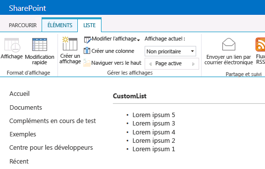

# Personnaliser le mode Liste dans les compléments pour SharePoint à l'aide du rendu côté client
Découvrez comment personnaliser l'affichage de liste dans un complément hébergé sur SharePoint en utilisant la technologie de rendu côté client dans SharePoint 2013.
Dans SharePoint 2013, lerendu côté client vous permet de produire votre propre destination pour un jeu de contrôles hébergés sur une page SharePoint. Vous pouvez également utiliser des technologies connues, telles que le HTML et JavaScript, afin de définir la logique de rendu des affichages de liste SharePoint. Avec le rendu côté client, vous pouvez spécifier vos propres ressources JavaScript et les héberger dans les options de stockage de données disponibles pour vos compléments, par exemple dans une bibliothèque de documents. Un complément hébergé par SharePoint inclut uniquement des composants SharePoint. Ses ressources se trouvent dans un sous-site isolé du site web hôte, appelé site web de complément.


## Conditions requises pour utiliser les exemples de cet article
<a name="SP15CSRlistview_Prereq"> </a>

Pour suivre les étapes présentées dans cet exemple, vous aurez besoin de ce qui suit :


-  [Visual Studio 2015 et outils de développement Microsoft Office les plus récents ](https://www.visualstudio.com/features/office-tools-vs)


- Un environnement de développement SharePoint 2013 (isolation de complément requise pour les scénarios locaux)


Pour obtenir des instructions sur la manière de configurer un environnement de développement adapté à vos besoins, voir  [Commencer à créer des applications pour Office et SharePoint](http://msdn.microsoft.com/library/187f8c8c-1b15-471c-80b5-69a40e67deea%28Office.15%29.aspx).


### Concepts fondamentaux pour vous aider à comprendre la personnalisation de l'affichage de liste avec rendu côté client

La table suivante reprend des articles utiles vous aidant à comprendre les concepts impliqués dans le scénario de personnalisation d'un affichage de liste.


**Tableau 1. Concepts fondamentaux pour la personnalisation d'un affichage de liste dans un complément**


|**Titre de l'article**|**Description**|
|:-----|:-----|
| [Compléments](sharepoint-add-ins.md) <br/> |Découvrez le nouveau modèle de complément Microsoft SharePoint 2013 qui vous permet de créer des compléments, qui sont des solutions faciles à utiliser et de taille réduite destinées aux utilisateurs finaux.  <br/> |
| [Conception de l'expérience utilisateur pour les compléments dans SharePoint](ux-design-for-sharepoint-add-ins.md) <br/> |Découvrez les options UX dont vous disposez lors de la création de Compléments SharePoint.  <br/> |
| [Héberger des sites web, des sites web de complément et des composants SharePoint dans SharePoint 2013](host-webs-add-in-webs-and-sharepoint-components-in-sharepoint-2013.md) <br/> |Découvrez la différence entre les sites web hôtes et les sites web de complément. Découvrez les composants SharePoint 2013 pouvant être inclus dans un Complément SharePoint, les composants déployés sur le site web hôte, les composants déployés sur le site web de complément et la façon dont le site web de complément est déployé dans un domaine isolé.  <br/> |
 

## Exemple de code : personnaliser un affichage de liste en utilisant le rendu côté client
<a name="SP15CSRlistview_Codeexample"> </a>

Pour personnaliser un affichage de liste déployé sur le site web de complément en utilisant le rendu côté client, suivez les étapes suivantes :


1. Créez le projet de Complément SharePoint ;


2. Créer une nouvelle définition de liste avec un affichage personnalisé ;


3. Fournissez la logique de rendu personnalisée dans un fichier JavaScript.


La figure 1 montre un affichage rendu côté client d'une liste d'annonces.


**Figure 1. Affichage personnalisé d'une liste d'annonces**





### Pour créer le projet de Complément SharePoint


1. Ouvrez Visual Studio 2015 en tant qu'administrateur. (Pour cela, cliquez avec le bouton droit de la souris sur l'icône **Visual Studio** dans le menu **Démarrer**, puis choisissez **Exécuter en tant qu'administrateur**.)


2. Créez un projet à l'aide du modèle **Complément SharePoint**.

    La Figure 2 montre l'emplacement du modèle **Complément SharePoint** dans Visual Studio 2015, sous **Modèles**, **Visual C#**, **Office/SharePoint**, **Compléments Office**.


   **Figure 2. Modèle Complément pour SharePoint 2013 Visual Studio**


!\[Modèle d'application pour SharePoint 2013 de Visual Studio](images/AppForSharePointVSTemplate.PNG)


3. Indiquez l'URL du site web SharePoint que vous souhaitez utiliser pour le débogage.


4. Sélectionnez **Hébergé par SharePoint** comme option d'hébergement pour votre complément.


### Créer une nouvelle définition de liste


1. Cliquez avec le bouton droit sur le projet de Complément SharePoint et ajoutez un nouvel élément **Liste**. Créez une liste personnalisable basée sur les Annonces.


2. Copiez le balisage suivant et collez-le dans l'élément **Views** dans le fichier Schema.xml de votre fonction de liste. Le balisage réalise les tâches suivantes :

  - Il déclare un nouvel affichage nommé Remplaçable par une IDAffichageBase=2.


  - Il indique une valeur pour l'élément **JSLink** renvoyant à un fichier JavaScript mis en service avec le complément.

    > **REMARQUE**
      > La propriété JSLink n'est pas prise en charge sur les listes d'enquêtes ou d'événements. Un calendrier SharePoint est une liste d'événements. 

 ```XML

<View BaseViewID="2"
      Name="8d2719f3-c3c3-415b-989d-33840d8e2ddb" 
      DisplayName="Overridable" 
      Type="HTML" 
      WebPartZoneID="Main" 
      SetupPath="pages\\viewpage.aspx" 
      Url="Overridable.aspx"
      DefaultView="TRUE">
  <ViewFields>
    <FieldRef Name="Title" />
  </ViewFields>
  <Query />
  <Toolbar Type="Standard" />
  <XslLink>main.xsl</XslLink>
  <JSLink Default="TRUE">~site/Scripts/CSRListView.js</JSLink>
</View>
 ```


### Fournir une logique de rendu personnalisée dans un fichier JavaScript


1. Cliquez avec le bouton droit sur le dossier **Scripts**, puis ajoutez un nouveau fichier JavaScript. Nommez le fichier CSRListView.js.


2. Copiez le code suivant et collez-le dans le fichier CSRListView.js. Le code réalise les tâches suivantes :

  - Il fournit les gestionnaires d'événements pour les événements **PreRender** et **PostRender**.


  - Il fournit les modèles pour les ensembles de modèle d'en-têtes, de pieds de page et d'éléments.


  - Il enregistre les modèles.


 ```

(function () {
    // Initialize the variable that stores the objects.
    var overrideCtx = {};
    overrideCtx.Templates = {};

    // Assign functions or plain html strings to the templateset objects:
    // header, footer and item.
    overrideCtx.Templates.Header = "<B><#=ctx.ListTitle#></B>" +
        "<hr><ul id='unorderedlist'>";

    // This template is assigned to the CustomItem function.
    overrideCtx.Templates.Item = customItem;
    overrideCtx.Templates.Footer = "</ul>";

    // Set the template to the:
    //  Custom list definition ID
    //  Base view ID
    overrideCtx.BaseViewID = 2;
    overrideCtx.ListTemplateType = 10057;

    // Assign a function to handle the
    // PreRender and PostRender events
    overrideCtx.OnPreRender = preRenderHandler;
    overrideCtx.OnPostRender = postRenderHandler;

    // Register the template overrides.
    SPClientTemplates.TemplateManager.RegisterTemplateOverrides(overrideCtx);
})();

// This function builds the output for the item template.
// It uses the context object to access announcement data.
function customItem(ctx) {

    // Build a listitem entry for every announcement in the list.
    var ret = "<li>" + ctx.CurrentItem.Title + "</li>";
    return ret;
}

// The preRenderHandler attends the OnPreRender event
function preRenderHandler(ctx) {

    // Override the default title with user input.
    ctx.ListTitle = prompt("Type a title", ctx.ListTitle);
}

// The postRenderHandler attends the OnPostRender event
function postRenderHandler(ctx) {

    // You can manipulate the DOM in the postRender event
    var ulObj;
    var i, j;

    ulObj = document.getElementById("unorderedlist");

    // Reverse order the list.
    for (i = 1; i < ulObj.children.length; i++) {
        var x = ulObj.children[i];
        for (j = 1; j < ulObj.children.length; j++) {
            var y = ulObj.children[j];
            if(x.innerText<y.innerText){              
                ulObj.insertBefore(y, x);
            }
        }
    }
}
 ```


### Pour créer et exécuter la solution


1. Appuyez sur la touche F5.

    > **REMARQUE**
      > Lorsque vous appuyez sur F5, Visual Studio génère la solution, déploie le complément et ouvre la page des autorisations pour le complément. 
2. Sélectionnez le bouton **Approuver**.


3. Accédez à votre Liste personnalisée en entrant l'adresse  _/Lists/<your_list_instance>_ relative à votre répertoire de complément dans le domaine web du complément (et non le domaine web de l'hôte). Ajoutez une ou deux annonces. Sur le ruban, sélectionnez l'affichage **Remplaçable**.


## Étapes suivantes
<a name="SP15CSRlistview_Nextsteps"> </a>

Cet article a présenté comment personnaliser un affichage de liste dans un Complément SharePoint en utilisant le rendu côté client. Vous pouvez ensuite en apprendre davantage sur les autres composants UX disponibles dans les Compléments SharePoint. Pour plus d'informations, voir :


-  [Exemple de code : personnaliser un affichage de liste dans un complément en utilisant le rendu côté client](http://code.msdn.microsoft.com/SharePoint-2013-Customize-61761017)


-  [Utilisation d'une feuille de style de site web SharePoint dans les compléments pour SharePoint](use-a-sharepoint-website-s-style-sheet-in-sharepoint-add-ins.md)


-  [Utiliser le contrôle de chrome client dans les compléments pour SharePoint](use-the-client-chrome-control-in-sharepoint-add-ins.md)


-  [Créer des actions personnalisées à déployer avec les compléments pour SharePoint](create-custom-actions-to-deploy-with-sharepoint-add-ins.md)


-  [Créer des composants de complément à installer avec votre complément pour SharePoint](create-add-in-parts-to-install-with-your-sharepoint-add-in.md)


## Ressources supplémentaires
<a name="SP15CSRlistview_AddResources"> </a>


-  [Configurer un environnement de développement local pour les compléments pour SharePoint](set-up-an-on-premises-development-environment-for-sharepoint-add-ins.md)


-  [Conception de l'expérience utilisateur pour les compléments dans SharePoint](ux-design-for-sharepoint-add-ins.md)


-  [Créer des composants d'expérience utilisateur dans SharePoint 2013](create-ux-components-in-sharepoint-2013.md)


-  [Penser de trois manières différentes les options de conception des compléments pour SharePoint](three-ways-to-think-about-design-options-for-sharepoint-add-ins.md)


-  [Aspects importants du contexte de développement et de l'architecture des compléments pour SharePoint](important-aspects-of-the-sharepoint-add-in-architecture-and-development-landscap.md)


