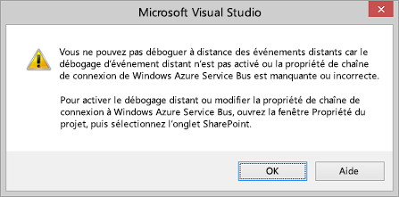
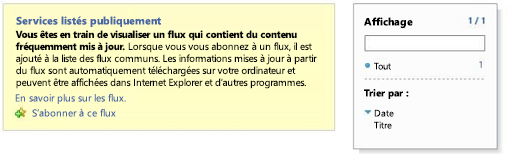

# Déboguer et dépanner un récepteur d'événement distant dans un complément pour SharePoint
Configurez votre environnement de développement afin de déboguer les événements distants dans des à l'aide de Visual Studio.
## Configurer le débogage d'un site de test SharePoint distant

> [!REMARQUE]
> Les procédures de cette section ne s'appliquent que lorsque votre site de test SharePoint est situé sur un ordinateur différent de Visual Studio ou si vous utilisez un site du développeur SharePoint Online en guise de site de test. Si SharePoint et Visual Studio sont exécutés sur le même ordinateur, ignorez cette section. 
  
    
    

Lorsqu'un projet de Complément SharePoint dans Visual Studio inclut un récepteur d'événements distant ou un récepteur d'événements de compléments, vous devez effectuer quelques actions de configuration rapide supplémentaires dans les propriétés du projet pour pouvoir déboguer le complément avec (F5). Cette configuration, à son tour, nécessite que vous effectuiez quelques actions de configuration Azure. Vous n'avez pas à répéter la configuration Azure pour chaque projet disposant d'un récepteur d'événements distant ou d'un récepteur d'événements de compléments. (Si le complément inclut un gestionnaire d'événements AppInstalled, il ne sera même pas exécuté avec F5 ou Ctrl+F5 [exécuter sans débogage], sauf si vous effectuez la configuration indiquée dans cette section.)
  
    
    

### Pour configurer Azure

1. Obtenez un abonnement Microsoft Azure si vous n'en avez pas déjà un. L'un d'entre eux est inclus en tant qu'avantage avec un  [abonnement MSDN](http://azure.microsoft.com/fr-fr/pricing/member-offers/msdn-benefits/).
    
  
2. Suivez les instructions figurant à la rubrique  [How To: Create or Modify a Service Bus Service Namespace](http://msdn.microsoft.com/library/fa561f70-007c-45aa-b34d-56317dbbfc87.aspx).
    
  

### Pour configurer le projet de complément SharePoint dans Visual Studio

1. Vous devez disposer de la dernière version des Outils de développement Office pour Visual Studio 2013 et donc  [exécuter le programme d'installation WebPI ici](http://aka.ms/OfficeDevToolsForVS2013), ou  [le programme d'installation des outils de développement Office pour Visual Studio 2015](http://aka.ms/OfficeDevToolsForVS2015)
    
  
2. Une fois que vous avez ajouté un gestionnaire d'événements de compléments ou un récepteur d'événements distant à un projet de Complément SharePoint dans Visual Studio, cliquez avec le bouton droit sur le projet dans l' **Explorateur de solutions** et sélectionnez **Propriétés**.
    
  
3. Dans le volet de propriétés, ouvrez l'onglet **SharePoint** et faites défiler jusqu'en bas.
    
  
4. Cochez la case pour **Activer le débogage via Microsoft Azure Service Bus**.
    
  
5. Entrez la chaîne de connexion complète dans la zone de texte fournie. Vous obtenez la chaîne en procédant comme décrit ci-après.
    
1. Connectez-vous au portail Azure et ouvrez l'onglet **Service Bus**.
    
  
2. Ouvrez l'espace de noms que vous avez créé pour le débogage de récepteur d'événements distants et accédez aux chaînes de connexion. L'interface utilisateur du portail Azure change fréquemment. Si vous ne trouvez pas les chaînes de connexion, consultez l' [Aide du portail Azure](https://msdn.microsoft.com/fr-fr/library/azure/dn578292.aspx).
    
  
3. Copiez la chaîne de connexion **SAS**. Il s'agit de la chaîne que vous entrez dans les propriétés de projet Visual Studio.
    
  
À l'avenir, lorsque vous créerez des projets de Complément SharePoint dans Visual Studio, ces informations seront préremplies, vous n'aurez donc pas à ouvrir le portail Azure à chaque fois.
## Tester la configuration

Utilisez les procédures décrites dans cette section pour vérifier que vous pouvez déboguer un récepteur d'événements distants.
  
    
    

### Pour créer un projet de récepteur d'événements distants

1. Dans Visual Studio, créez un Complément SharePoint hébergé par un fournisseur.
    
    Voir  [Commencer à créer des compléments hébergés par un fournisseur pour SharePoint](get-started-creating-provider-hosted-sharepoint-add-ins.md).
    
  
2. Dans l' **Explorateur de solutions**, cliquez sur le nœud du projet de complément.
    
  
3. Dans la barre de menus, sélectionnez **Projet**, puis **Ajouter un nouvel élément**.
    
  
4. Dans le volet **Modèles**, choisissez le modèle **Liste**, puis cliquez sur le bouton **Ajouter**.
    
  
5. Cliquez sur le bouton **Terminer** pour ajouter une liste personnalisée par défaut au projet de complément.
    
  
6. Ajoutez un autre élément au projet de complément ; pour ce faire, dans le volet **Modèles**, sélectionnez le modèle **récepteur d'événements distant**.
    
  
7. Dans la zone **Nom**, conservez le nom par défaut (RemoteEventReceiver1), puis cliquez sur le bouton **Ajouter**.
    
  
8. Dans la liste **Quel type de récepteur d'événements voulez-vous ?**, sélectionnez **Liste des événements d'élément**. 
    
    Conservez la source d'événements **List1**, qui est la liste que vous avez ajoutée lors des étapes précédentes.
    
  
9. Dans la liste **Gérer les événements suivants**, sélectionnez **Un élément est en cours d'ajout**, puis cliquez sur le bouton **Terminer**.
    
    Un service web est ajouté à l'application web pour gérer l'événement distant que vous avez spécifié. Un récepteur d'événements distants est ajouté au Complément SharePoint et fait référence au service web et à l'événement d'élément de liste du fichier Elements.xml du récepteur.
    
  
10. Dans le projet de complément, ouvrez AppManifest.xml.
    
  
11. Remplacez la page de démarrage par la page de la liste :  _AddInProjectName_/Lists/List1.
    
    Remplacez  _AddInProjectName_ par le nom de votre projet de complément, tel queSharePointAddIn4/Lists/List1. Dans cet exemple, nous définissons la page de démarrage sur la page de la liste. Cependant, dans un complément classique, vous pointerez certainement vers votre propre interface utilisateur sur la page de projet web.
    
  

### Pour exécuter et tester le débogage de gestionnaire d'événements

1. Si vous ne l'avez pas encore fait, effectuez la procédure intitulée **Pour configurer le projet de complément SharePoint dans Visual Studio** décrite ci-dessus.
    
  
2. Dans le projet web, ouvrez le service de récepteur d'événements distants (RemoteEventReceiver1.svc), puis ajoutez un point d'arrêt dans une ligne de code de la méthode  `ProcessEvent()`.
    
  
3. Appuyez sur la touche **F5** pour exécuter le projet.
    
  
4. Cliquez sur le bouton **+ Nouvel élément** pour ajouter un élément à la liste.
    
  
5. Fournissez un titre pour l'élément, puis cliquez sur le bouton **Enregistrer**.
    
    Le point d'arrêt que vous avez ajouté au récepteur d'événements distants est atteint, vérifiant le débogage du récepteur d'événements distants.
    
  
6. Appuyez sur la touche **F5** pour continuer à exécuter le projet, puis arrêtez le débogage une fois que vous avez terminé.
    
  

## Activer/désactiver la notification de Visual Studio indiquant que le débogage d'événement doit être configuré

Si votre projet comporte un événement à distance et que vous n'avez pas configuré le débogage d'événement à distance, Visual Studio vous invite à configurer cette fonctionnalité (voir la figure 1). Vous pouvez modifier ce comportement en désactivant la case à cocher **M'avertir si le débogage d'événement à distance n'est pas configuré** sur l'onglet **SharePoint**.
  
    
    

**Figure 1. Notification de débogage d'événement distant**

  
    
    

  
    
    

  
    
    

  
    
    

  
    
    

## Vérifier que votre service est hébergé dans le bus des services

Après avoir appuyé sur F5 et approuvé le complément, accédez à l'espace de noms du bus des services dans votre navigateur (par exemple, http://mynamespace.servicebus.windows.net). Votre point de terminaison doit y être répertorié en tant que nombre. La figure 2 montre à quoi ressemble la page lorsqu'un espace de noms n'est  *pas*  répertorié, c'est-à-dire avant d'appuyer sur F5.
  
    
    

**Figure 2. Navigation vers l'espace de noms du bus des services**

  
    
    

  
    
    

  
    
    

  
    
    

  
    
    

## Le récepteur d'événement distant n'atteint pas le point d'arrêt.

L'événement à distance peut être synchrone ou asynchrone. S'il est asynchrone, il lui faudra peut-être quelques secondes ou plus pour atteindre votre point d'arrêt.
  
    
    

## Erreur : « Il n'existait pas de point de terminaison à l'écoute »

Vous obtenez l'erreur suivante lorsque votre gestionnaire s'exécute en production :
  
    
    
« Désolé... Le callout de récepteur d'événement distant a échoué. Détails : Il n'existait pas de point de terminaison à l'écoute sur https:// _{domaine}_: _nnnnn_/ _{chemin}_/AppEventReceiver.svc pouvant accepter le message. Ceci est souvent dû à une adresse ou une action SOAP incorrecte. » où  _nnnnn_ est un port.
  
    
    
SharePoint exige qu'il n'y ait aucun port explicite dans l'URL du gestionnaire en production. Cela signifie que vous devez utiliser le port 443 pour HTTPS, ce que nous recommandons, ou le port 80 pour HTTP. 
  
    
    

## Erreur : « Impossible d'établir une relation de confiance pour le canal sécurisé SSL/TLS avec l'autorité »

Vous obtenez l'erreur suivante lorsque votre gestionnaire s'exécute en production :
  
    
    
« Désolé... Le callout de récepteur d'événement distant a échoué. Détails : Impossible d'établir une relation de confiance pour le canal sécurisé SSL/TLS avec l'autorité »
  
    
    
Lorsque le complément se trouve dans Microsoft SharePoint Online, mais que le service de récepteur d'événements distant est sur site et utilise HTTPS comme nous le recommandons, le serveur qui héberge le récepteur ne peut pas utiliser un certificat auto-signé en production. Le serveur doit posséder un certificat accepté publiquement auprès d'une autorité de certification. Si le complément est une batterie de serveurs SharePoint sur site, les certificats auto-signés sont acceptables.
  
    
    

## Ressources supplémentaires

-  [Gestion des événements dans les compléments pour SharePoint](handle-events-in-sharepoint-add-ins.md)
    
  
-  [Débogage des événements à distance SharePoint 2013 à l'aide de Visual Studio 2012](http://blogs.msdn.com/b/officeapps/archive/2013/03/21/update-to-debugging-sharepoint-2013-remote-events-using-visual-studio-2012.aspx)
    
  

