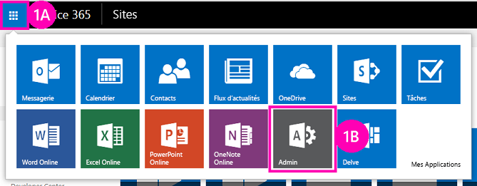

# Déployer et installer un complément hébergé par SharePoint pour SharePoint
Découvrez comment les Compléments SharePoint sont déployés et installés.
Cet article est le deuxième d'une série sur les concepts de base du développement de Compléments SharePoint hébergés par SharePoint. Vous devez tout d'abord prendre connaissance de la rubrique  [Compléments](sharepoint-add-ins.md) et des rubriques précédentes de la série :
  
    
    

-  [Commencer à créer des compléments SharePoint hébergés par SharePoint](get-started-creating-sharepoint-hosted-sharepoint-add-ins.md)
    
  

> **REMARQUE**
> Si vous avez suivi cette série sur les compléments hébergés par SharePoint, vous disposez d'une solution Visual Studio que vous pouvez continuer à utiliser pour cette rubrique. Vous pouvez également télécharger le référentiel à l'adresse  [SharePoint_SP-hosted_Add-Ins_Tutorials](https://github.com/OfficeDev/SharePoint_SP-hosted_Add-Ins_Tutorials) et ouvrir le fichier BeforeColumns.sln.
  
    
    

Il sera beaucoup plus facile pour vous de développer des Compléments SharePoint hébergés par SharePoint si vous savez comment les utilisateurs déploient et installent vos compléments. En conséquence, dans cet article, nous allons brièvement nous éloigner du codage pour créer et utiliser un catalogue de compléments, puis installer le complément sur lequel vous avez travaillé.
## Créer un catalogue de compléments

  
    
    

1. Connectez-vous en tant qu'administrateur à votre abonnement Office 365. Choisissez l'icône du lanceur de compléments, puis le complément **Admin**.
    
   **Lanceur de compléments Office 365**

  

     
  

    
    
  
2. Dans le **centre d'administration**, développez le nœud **Administrateur** dans le volet des tâches, puis choisissez **SharePoint**.
    
  
3. Dans le **Centre d'administration SharePoint**, choisissez **Compléments** dans le volet Office.
    
  
4. Sur la page **Compléments**, cliquez sur **Catalogue de compléments**. (S'il existe déjà une collection de sites de catalogue de compléments dans l'abonnement, celle-ci s'ouvre et vous avez terminé. Vous ne pouvez pas créer plusieurs catalogues de compléments dans un abonnement.)
    
  
5. Sur la page **Site de catalogue de compléments**, cliquez sur **OK** pour accepter l'option par défaut et créer un site de catalogue de compléments.
    
  
6. Sur la boîte de dialogue **Créer une collection de sites de catalogue de compléments**, indiquez le titre et l'adresse de site web de votre site de catalogue de compléments. Nous vous recommandons d'inclure « catalogue » dans le titre et l'URL pour les rendre faciles à mémoriser et à distinguer dans le **Centre d'administration SharePoint**.
    
  
7. Spécifiez un **fuseau horaire** et attribuez-vous le rôle **Administrateur**.
    
  
8. Définissez le **quota de stockage** sur la valeur la plus faible possible (actuellement 110, mais cette valeur peut changer), car les packages de complément que vous téléchargez dans cette collection de sites sont de très petite taille.
    
  
9. Définissez le **quota de ressources du serveur** sur 0 (zéro), puis choisissez **OK**. (Le quota de ressources du serveur est lié à la limitation de solutions bac à sable présentant des performances médiocres, mais vous n'installerez aucune solutions bac à sable dans votre site de catalogue de compléments.)
    
  
Comme la collection de sites est en cours de création, SharePoint vous repositionne dans le **Centre d'administration SharePoint**. Au bout de quelques minutes, vous pouvez constater que la collection a été créée.
## Empaqueter le complément et le télécharger dans le catalogue

  
    
    

1. Ouvrez la solution Visual Studio, puis cliquez avec le bouton droit de la souris dans le nœud du projet dans l' **Explorateur de solutions**. Choisissez **Publier**.
    
  
2. Dans le volet **Publier**, choisissez **Empaqueter le complément**. Le complément est empaqueté et enregistré dans un fichier *.app dans le dossier \\bin\\debug\\web.publish\\1.0.0.0 de la solution.
    
  
3. Ouvrez votre site de catalogue de compléments dans un navigateur et choisissez **Compléments SharePoint** dans la barre de navigation.
    
  
4. Le catalogue de **Compléments SharePoint** est une bibliothèque de ressources SharePoint standard. Téléchargez-y le package du complément à l'aide de l'une des méthodes de téléchargement de fichiers vers les bibliothèques SharePoint.
    
  

## Installez le complément de la même manière que les utilisateurs finaux

1. Accédez à un site web de l'abonnement SharePoint Online et ouvrez la page **Contenu du site**.
    
  
2. Choisissez **Ajouter un complément** pour ouvrir la page **Vos compléments**.
    
  
3. Recherchez le complément **Employee Orientation** (Orientation des employés) dans la section **Compléments que vous pouvez ajouter** et cliquez sur la vignette correspondante.
    
  
4. Choisissez **Approuver** dans la boîte de dialogue d'acceptation. La page **Contenu du site** s'ouvre automatiquement et le complément s'affiche avec un message indiquant que l'installation est en cours. Une fois l'installation effectuée, les utilisateurs peuvent choisir la vignette pour l'exécuter.
    
  

## Supprimer le complément

Pour continuer à améliorer le même Complément SharePoint dans Visual Studio (voir  [Étapes suivantes](#Nextsteps)), exécutez les étapes suivantes pour le supprimer :
  
    
    

1. Dans la page **Contenu du site**, placez le curseur sur le complément pour faire apparaître le bouton de légende **...**.
    
  
2. Choisissez le bouton de légende, puis cliquez sur **SUPPRIMER** dans la légende.
    
  
3. Revenez à votre site de catalogue de compléments et choisissez **Compléments SharePoint** dans la barre de navigation.
    
  
4. Mettez le complément en surbrillance et choisissez **Gérer** dans la barre des tâches juste au-dessus de la liste, puis choisissez **Supprimer** dans le menu Gérer.
    
  

## 

Nous vous recommandons fortement de poursuivre l'étude de cette série sur les compléments hébergés par SharePoint avant de passer à des rubriques plus avancées. Nous revenons maintenant au codage dans  [Ajouter des colonnes personnalisées à un complément hébergé par SharePoint pour SharePoint](add-custom-columns-to-a-sharepoint-hostedsharepoint-add-in.md).
  
    
    

