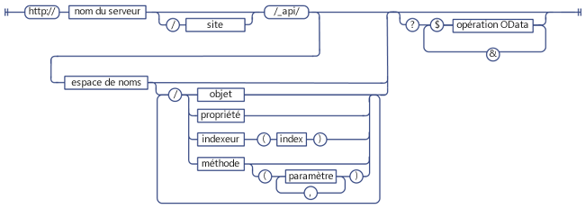
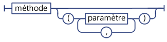
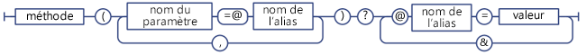
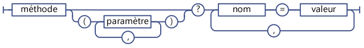
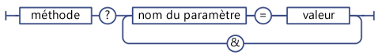

# Déterminer les URI de point de terminaison du service REST SharePoint
Découvrez les consignes générales pour la détermination des URI de point de terminaison REST SharePoint à partir de la signature des API de modèle objet client correspondantes.
 **Avant de commencer**


-  [Familiarisation avec le service REST SharePoint 2013](get-to-know-the-sharepoint-2013-rest-service.md)


-  [Naviguer dans la structure de données SharePoint représentée dans le service REST](navigate-the-sharepoint-data-structure-represented-in-the-rest-service.md)


 **Étapes suivantes**


-  [Utiliser les opérations de requête OData dans les demandes REST SharePoint](use-odata-query-operations-in-sharepoint-rest-requests.md)


## Structure des URI de point de terminaison REST SharePoint

Avant de pouvoir accéder à une ressource SharePoint à l'aide du service REST, vous devez d'abord détecter le point de terminaison d'URI qui pointe vers cette ressource. Dès que possible, l'URI de ces points de terminaison REST imite la signature de l'API de la ressource dans le modèle objet client SharePoint. Par exemple :


 *Méthode de modèle objet client :* 


List.GetByTitle(listname).GetItems()


 *Point de terminaison REST :* 


 `http://server/site/_api/lists/getbytitle('listname')/items`


Dans certains cas, l'URI de point de terminaison diffère de la signature de modèle objet client correspondante, afin d'assurer la conformité avec les conventions REST ou OData.


La figure suivante montre la structure de la syntaxe générale des URI REST SharePoint.


**Structure de la syntaxe des URI REST SharePoint**





Certains points de terminaison pour les ressources SharePoint s'écartent de cette structure de syntaxe :


- Méthodes qui nécessitent des types complexes en tant que paramètres.

    Si la méthode de modèle objet client correspondante exige que des types complexes soient transmis en tant que paramètres, le point de terminaison REST peut dévier de cette construction syntaxique pour justifier les limitations REST.


- Méthodes et propriétés statiques.

    Les points de terminaison REST s'écartent de cette structure de syntaxe pour les URI qui représentent des méthodes et propriétés statiques.


## Déterminer les points de terminaison de service REST SharePoint 2013

Pour créer un point de terminaison REST pour une ressource SharePoint, procédez comme suit :


1. Démarrez avec la référence de service REST :

     `http://server/site/_api`


2. Spécifiez le point d'entrée approprié. Par exemple :

     `http://server/site/_api/web`


3. Naviguez du point d'entrée vers les ressources spécifiques auxquelles vous voulez accéder. Ceci inclut la spécification de paramètres pour les points de terminaison correspondant aux méthodes dans le modèle objet client. Par exemple :

     `http://server/site/_api/web/lists/getbytitle('listname')`


### Référencer le service REST SharePoint 2013 dans votre URI de point de terminaison

Utilisez  `_api` pour représenter le service REST SharePoint 2013 dans vos URI de point de terminaison. Le service REST fait partie du service web client.svc. Mais pour faciliter la création d'un URI REST et raccourcir le chemin d'URI REST de base, le service REST utilise `_api` pour que vous n'ayez pas à référencer explicitement le service web client.svc. Le service REST reconnaît et accepte toujours les URI qui référencent le service web client.svc. Vous pouvez par exemple utiliser `http://server/site/_vti_bin/client.svc/web/lists` au lieu de `http://server/site/_api/web/lists`. Toutefois, l'utilisation de  `_api` représente la convention privilégiée. Les URL ont une limite de 256 caractères ; l'utilisation de `_api` permet donc de raccourcir l'URI de base, laissant ainsi plus de caractères disponibles pour la création du reste de l'URL.


### Spécifier les points d'entrée pour le service REST SharePoint 2013

Les principaux points d'entrée pour le service REST représentent la collection de sites et le site du contexte spécifié. Ainsi, ces points d'entrée correspondent aux propriétés  [ClientContext.Site](https://msdn.microsoft.com/library/Microsoft.SharePoint.Client.ClientContext.Site.aspx) et [ClientContext.Web](https://msdn.microsoft.com/library/Microsoft.SharePoint.Client.ClientContext.Web.aspx) dans les modèles objet client.


Pour accéder à une collection de sites spécifique, utilisez la construction suivante :


 `http://server/site/_api/site`


Pour accéder à un site spécifique, utilisez la construction suivante :


 `http://server/site/_api/web`


Où  *server*  représente le nom du serveur et *site*  le nom du site spécifique ou son chemin d'accès.


Outre  `/site` et `/web`, le service REST inclut divers autres points d'accès permettant aux développeurs de naviguer vers des fonctionnalités spécifiques. Le tableau ci-dessous répertorie certains de ces points d'accès.


|**Fonctionnalité**|**Point d'accès**|
|:-----|:-----|
|Site  <br/> |http:// _server/site_/_api/site  <br/> |
|Web  <br/> |http:// _server/site_/_api/web  <br/> |
|Profil utilisateur  <br/> |http:// _server/site_/_api/SP.UserProfiles.PeopleManager  <br/> |
|Recherche  <br/> |http:// _server/site_/_api/search  <br/> |
 

### Naviguer vers les ressources spécifiques auxquelles vous voulez accéder

À partir de là, vous pouvez créer des points de terminaison REST plus spécifiques en « parcourant » le modèle objet, à l'aide des noms des API du modèle objet client séparés par une barre oblique (/). Le tableau ci-dessous montre des exemples d'appels de modèle objet client et de point de terminaison REST équivalent.


|**API de modèle objet client**|**Point de terminaison REST**|
|:-----|:-----|
|ClientContext.Web.Lists  <br/> |http:// _server_/ _site_/_api/web/lists  <br/> |
|ClientContext.Web.Lists[guid]  <br/> |http:// _server_/ _site_/_api/web/lists(' _guid_')  <br/> |
|ClientContext.Web.Lists.GetByTitle("Title")  <br/> |http:// _server_/ _site_/_api/web/lists/getbytitle(' _Title_')  <br/> |
 
Les URI de points de terminaison ne respectent pas l'emploi des majuscules et des minuscules. Par exemple, dans le tableau précédent, utilisez  `/getbytitle` pour spécifier l'équivalent REST de la méthode **GetByTitle()**.


## Spécifier des paramètres dans les URI de point de terminaison REST

SharePoint 2013 étend la spécification OData pour vous permettre d'utiliser des parenthèses pour spécifier les paramètres de méthode et les valeurs d'index. Cela permet d'éviter les problèmes de levée d'ambiguïté potentiels dans les URI qui contiennent plusieurs paramètres portant un nom identique. Par exemple, les deux URI suivants contiennent des paramètres au nom identique :


 `http://server/site/_api/web/lists/getByTitle('Announcements')/fields/getByTitle('Description')`


 `http://server/site/_api/web/lists('<guid>')/fields/getById('<guid>')`


Pour spécifier plusieurs paramètres, incluez le paramètre en tant que paire nom-valeur et séparez les paramètres par des virgules. Par exemple :


 `http://server/site/_api/web/getAvailableWebTemplates(lcid=1033, includeCrossLanguage=true)`


La figure suivante illustre la syntaxe de paramètre REST SharePoint.


**Syntaxe de paramètre REST SharePoint**





### Types complexes en tant que paramètres pour le service REST

Certaines méthodes dans le modèle objet client exigent une grande charge utile en tant que paramètre. Pour que les points de terminaison REST conservent la parité de fonctionnalités avec les API de modèle objet client correspondantes, les points de terminaison doivent accepter un type complexe en tant que paramètre. Dans ce cas, le service REST étend le protocole OData existant pour permettre à ces points de terminaison REST d'accepter un type complexe unique en tant que paramètre. Ceci s'applique uniquement aux opérations **POST** et vous devez transmettre le type complexe au format [Atom](http://www.odata.org/developers/protocols/atom-format#RepresentingComplexTypesProperties) ou [JSON](http://www.odata.org/developers/protocols/json-format#RepresentingComplexTypeProperties), conformément aux normes OData.


Par exemple, la méthode  [ListCollection.Add](https://msdn.microsoft.com/library/Microsoft.SharePoint.Client.ListCollection.Add.aspx) accepte un objet [Microsoft.SharePoint.Client.ListCreationInformation](https://msdn.microsoft.com/library/Microsoft.SharePoint.Client.ListCreationInformation.aspx) en tant que paramètre. Pour ajouter une liste à un site spécifié, construisez le point de terminaison REST approprié comme suit :


 `http://server/site/_api/web/lists/add`


Ensuite, transmettez le type complexe dans le corps de la requête, ici au format JSON.



```

{ "d" : {
   "results": {
     "__metadata": {
       "type": "SP.ListCreationInformation"
     }, 
     "CustomSchemaXml": "…large payload…/", 
     "Description": "desc", 
     "DocumentTemplateType": "1", 
     "TemplateType": "101", 
     "Title": "Announcements"
   }
} 
}

```


### Utilisation d'alias de paramètre dans les appels de service REST

Vous pouvez utiliser la sémantique « alias de paramètre » dans OData pour transmettre des paramètres à un point de terminaison REST SharePoint. Dans l'alias de paramètre, la valeur de paramètre est identifiée par un alias dans l'appel de paramètre et la valeur réelle est spécifiée dans la chaîne de requête de l'URI. Ceci vous permet de prendre en charge plusieurs types de caractères et une mise en forme cohérente à l'aide de la chaîne de requête.


Par exemple, les deux URI REST suivants sont équivalents :


 *Spécifiez la valeur du paramètre directement :* 


 `http://server/site/_api/web/applyWebTemplate("STS#0")`


 *Utilisez un alias de paramètre et spécifiez la valeur de paramètre réelle dans la chaîne de requête de l'URI :* 


 `http://server/site/_api/web/applyWebTemplate(title=@template)?@template="STS#0"`


En revanche, le service REST SharePoint ne prend pas en charge la transmission de types complexes via l'alias de paramètre. Par exemple, l'URI suivant, qui contient un type complexe dans l'alias de paramètre, n'est pas pris en charge :


 `http://server/site/_api/userProfiles/People(7)/GetWorkplace(@address)?@address={"__metadata":{"type: "ODataDemo.Address"},"Street":"NE 228th", "City":"Sammamish","State":"WA","ZipCode":"98074","Country": "USA"}`


**Syntaxe d'alias de paramètre de service REST SharePoint**





### Spécification de dictionnaires en tant que valeurs de paramètre

Pour les points de terminaison REST correspondant aux méthodes qui utilisent des dictionnaires  `Dictionary<String, String>` en tant que paramètres, tansmettez le dictionnaire en tant que série de paires nom-valeur séparées par des virgules dans la chaîne de requête.


**Syntaxe de service REST pour les paramètres de dictionnaire**





 `Dictionary<String, object>` est représenté en tant qu'objet à valeurs multiples nommé KeyedPropertyValue, avec les propriétés de chaîne suivantes :


- **Key** Clé de l'objet à valeurs multiples.


- **Value** Valeur de l'objet.


- **ValueType** Type de valeur de l'objet. Pour les types de valeur simples qui correspondent à des types Entity Data Model (EDM) existants, le service REST renvoie la chaîne de type EDM appropriée ; par exemple, Edm.String. Sinon, le service REST renvoie le type de valeur renvoyé par la fonction **Type.ToString**.


### Spécification de valeurs de paramètre dans la chaîne de requête

Si l'URI REST se termine par un appel de méthode, vous pouvez utiliser la syntaxe de chaîne de requête pour spécifier les valeurs de paramètre de la méthode. Par exemple :


 `http://<server>/<site>/_api/web/applyWebTemplate?template="STS#0"`


La figure ci-dessous illustre la syntaxe de service REST pour les paramètres de chaîne de requête.


**Syntaxe de service REST pour les paramètres de chaîne de requête**





## Spécification de méthodes et propriétés statiques en tant qu'URI de service REST

Pour créer des URI correspondant aux méthodes ou propriétés statiques, utilisez le nom d'API correspondant du modèle d'objet ECMAScript, en commençant par la déclaration d'espace de noms et en utilisant la notation par points. Par exemple,  [SP.Utilities.Utility.getImageUrl(imageName)](http://msdn.microsoft.com/fr-fr/library/ee658947.aspx) dans le modèle objet client ECMAScript aurait l'équivalent REST suivant :


 `http://server/site/_api/SP.Utilities.Utility.getImageUrl('imageName')`


Cependant, les propriétés statiques sont accessibles uniquement de façon directe et ne sont pas autorisées dans le cadre d'une composition d'URI plus importante. Par exemple, l'accès direct à la méthode **SP.Utility.AssetsLibrary** dans REST peut être autorisé comme suit :


 `http://server/site/_api/SP.Utility.assetsLibrary/id`


Mais l'utilisation de cet emplacement de ressource en tant que paramètre pour un URI plus complexe, tel qu'indiqué dans l'exemple ci-dessous, n'est pas autorisée :


 `http://server/site/_api/getList(~SP.Utility/assetsLibrary/id)`


La figure ci-dessous illustre la syntaxe de membre statique de service REST SharePoint.


**Syntaxe de membre statique de service REST SharePoint**


## Étapes suivantes

Si vous voulez sélectionner, filtrer ou trier les données que vous avez demandées à partir d'un point de terminaison, le service REST SharePoint prend en charge une large gamme d'opérateurs de chaîne de recherche OData.


## Ressources supplémentaires
<a name="bk_addresources"> </a>


-  [Familiarisation avec le service REST SharePoint 2013](get-to-know-the-sharepoint-2013-rest-service.md)


-  [Effectuer des opérations de base à l'aide de terminaux REST SharePoint 2013](complete-basic-operations-using-sharepoint-2013-rest-endpoints.md)


-  [Utilisation d'une liste et de ses éléments avec REST](working-with-lists-and-list-items-with-rest.md)


-  [Utilisation de dossiers et de fichiers à l'aide de l'interface REST](working-with-folders-and-files-with-rest.md)


-  [Naviguer dans la structure de données SharePoint représentée dans le service REST](navigate-the-sharepoint-data-structure-represented-in-the-rest-service.md)


-  [Utiliser les opérations de requête OData dans les demandes REST SharePoint](use-odata-query-operations-in-sharepoint-rest-requests.md)


-  [Exemples, points de terminaison et API REST pour SharePoint 2013](02128c70-9d27-4388-9374-a11bce68fdb8.md)


-  [Synchroniser les éléments SharePoint à l'aide du service REST](synchronize-sharepoint-items-using-the-rest-service.md)


-  [Utiliser des valeurs ETag avec le service REST pour le contrôle de version des éléments de liste](5f7e0579-46b7-44ab-b3b4-cdbc622dcd98.md)


