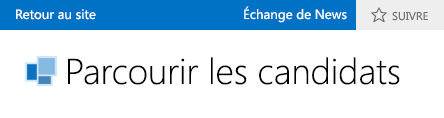

# Activer un échange de News dans un complément professionnel dans le Cloud
Les fonctionnalités sociales et de collaboration dans SharePoint pour Office 365 permettent aux utilisateurs de suivre des activités sur une liste et d'ajouter des commentaires. Vous pouvez facilement créer un échange de News pour votre complément de gestion des informations professionnelles en nuage en activant quelques propriétés.
## Conditions préalables

Pour héberger l'échange de News, vous aurez besoin d'un site SharePoint de développement sur Office 365, que vous pouvez obtenir à partir de  [Inscription pour la création d'un site de développeur Office 365](http://go.microsoft.com/fwlink/?LinkId=263490).

## Procédures

### Pour activer un échange de News

1. Dans l'Explorateur de solutions, ouvrez l'entité représentant la liste à laquelle vous voulez ajouter un échange de News, puis dans la barre **Perspective**, sélectionnez l'onglet **Serveur**.

2. Dans la fenêtre **Propriétés**, cochez les cases **Publier une fois créé(e)** et/ou **Publier une fois mis(e) à jour**.

    **Publier une fois créé(e)** ajoute un thread à l'échange de News pour chaque nouvel élément de liste. **Publier une fois mis(e) à jour** ajoute un thread lorsque la valeur d'un élément dans la liste est modifié. Des déclencheurs déterminent les champs de l'élément qui déclencheront une publication.

3. Cliquez sur le lien **Sélectionner les déclencheurs de publication**.

    La boîte de dialogue **Sélectionner les déclencheurs de publication** s'affiche.

4. Dans la boîte de dialogue **Sélectionner les déclencheurs de publication**, sélectionnez les cases à cocher de tous les champs dont vous voulez qu'ils déclenchent une publication, puis cliquez sur le bouton **OK**.

    Un seul thread sera créé pour toutes les modifications d'un élément, et ce, quel que soit le nombre de champs que vous choisissez.

### Pour accéder à un échange de News

1. Dans la barre de menus, choisissez **Débogage**, ** Démarrer le débogage** pour exécuter l'application.

2. Dans l'application en cours, ouvrez l'écran de navigation correspondant à l'entité représentant la liste à laquelle vous avez ajouté un échange de News. Si vous avez activé **Publier une fois créé(e)**, ajoutez un nouvel élément. Si vous avez activé **Publier une fois mis(e) à jour**, modifiez les champs que vous avez sélectionnés dans la boîte de dialogue **Sélectionner des déclencheurs de publication**.

3. Dans la barre Chrome SharePoint, cliquez sur le lien **Échange de News**.

    La page **Échange de News** ouvre une nouvelle page de navigateur avec des entrées pour les éléments ajoutés et/ou mis à jour. Vous pouvez choisir un lien **J'aime** pour une publication ou sélectionner un lien **Répondre** pour ajouter un commentaire.

## Ressources supplémentaires

-  [Développement de compléments de gestion d'informations professionnelles dans le Cloud](develop-cloud-business-add-ins.md)

-  [Nouveautés de flux de travail pour SharePoint 2013](http://msdn.microsoft.com/fr-fr/library/office/jj163177.aspx)

-  [Créer un complément de gestion des informations professionnelles dans le Cloud avec échange de News](create-a-cloud-business-add-in-with-a-social-newsfeed.md)

